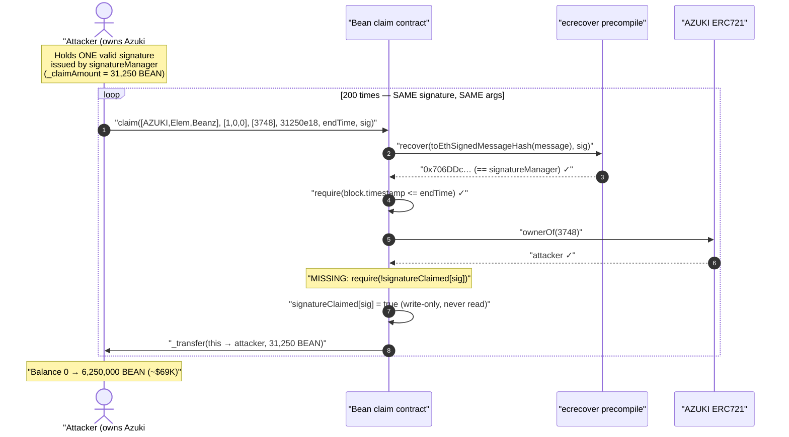
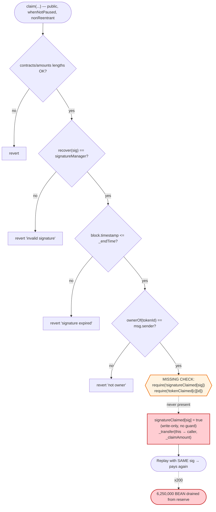
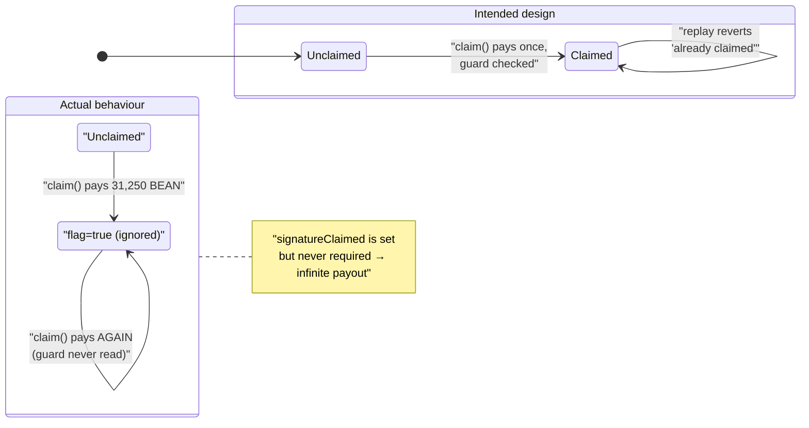

# AzukiDAO (Bean) Exploit — Signature-Replay Mint via Unenforced `signatureClaimed` Guard

> **Reproduction:** the PoC compiles & runs in an isolated Foundry project at
> [this project folder](.) (the umbrella DeFiHackLabs repo contains several
> unrelated PoCs that do not whole-compile, so this one was extracted).
> Full verbose trace: [output.txt](output.txt).
> Verified vulnerable source: [contracts_Bean.sol](sources/Bean_8189AF/contracts_Bean.sol).

---

## Key info

| | |
|---|---|
| **Loss** | ~$69,000 — **6,250,000 BEAN** minted to the attacker (200 × 31,250 BEAN) |
| **Vulnerable contract** | `Bean` (AzukiDAO airdrop token) — [`0x8189AFBE7b0e81daE735EF027cd31371b3974FeB`](https://etherscan.io/address/0x8189afbe7b0e81dae735ef027cd31371b3974feb#code) |
| **Victim** | The `Bean` claim contract's own token reserve (`_mint(address(this), MAX_SUPPLY/2)` = 500,000,000 BEAN held by the contract) |
| **Attacker EOA** | [`0x85D231C204B82915c909A05847CCa8557164c75e`](https://etherscan.io/address/0x85d231c204b82915c909a05847cca8557164c75e) |
| **Attack tx** | [`0x6233c9315dd3b6a6fcc7d653f4dca6c263e684a76b4ad3d93595e3b8e8714d34`](https://etherscan.io/tx/0x6233c9315dd3b6a6fcc7d653f4dca6c263e684a76b4ad3d93595e3b8e8714d34) |
| **Chain / block / date** | Ethereum mainnet / fork at 17,593,308 / ~July 2, 2023 |
| **Compiler** | Solidity v0.8.6, optimizer **off** (200 runs configured) |
| **Bug class** | Signature replay — claimed-signature guard written but never read (broken anti-replay) |

---

## TL;DR

`Bean.claim()` lets an NFT holder redeem an off-chain-signed allowance of BEAN tokens. The signature
is checked with a sound OpenZeppelin `ECDSA.recover` against the trusted `signatureManager`, and the
contract even maintains two "already used" maps — `tokenClaimed[contract][tokenId]` and
`signatureClaimed[signature]`. The fatal flaw: **`claim()` *writes* `signatureClaimed[_signature] = true`
but never *reads* it as a guard, and likewise never checks `tokenClaimed[...]`**
([contracts_Bean.sol:87,91](sources/Bean_8189AF/contracts_Bean.sol#L87-L91)). There is no `require(!signatureClaimed[_signature])`.

Because the signed message binds `msg.sender`, `_tokenIds`, `_claimAmount` and `_endTime` — but **not a
nonce and not a usage flag that is enforced** — a single legitimately-issued signature for one Azuki
holder can be **replayed by that same holder an unlimited number of times** while `block.timestamp <= _endTime`.

The attacker, who held **Azuki #3748**, took one valid signature the AzukiDAO backend had issued to
them (recovers to the real `signatureManager` `0x706DDc29B3fC5CE86b78bF9aaFd2B155C1772A4d`) and called
`claim(...)` **200 times in a single transaction** with the exact same arguments. Each call passed
every check and minted **31,250 BEAN** from the contract's reserve:

```
200 × 31,250 BEAN = 6,250,000 BEAN  (≈ $69K at the time)
```

The attacker's BEAN balance went from **0 → 6,250,000.0** ([output.txt:1564-1565](output.txt)).
"More iterations possible" — the only limit is the `_endTime` window and gas.

---

## Background — what AzukiDAO / Bean does

`Bean` ([source](sources/Bean_8189AF/contracts_Bean.sol)) is the ERC20 governance/airdrop token of the
community "AzukiDAO" project. Holders of supported NFT collections (Azuki, Beanz, Elementals) could
claim BEAN proportional to their holdings. To avoid putting the whole allowlist on-chain, claims are
authorized by an **off-chain signer** (`signatureManager`): the backend signs a message committing to
*who* may claim, *which* token IDs, *how much*, and *until when*, and the user submits that signature
to `claim()`.

Token economics at deploy ([:40-42](sources/Bean_8189AF/contracts_Bean.sol#L40-L42)):

| Allocation | Amount | Recipient |
|---|---:|---|
| Claim reserve | 500,000,000 BEAN | `address(this)` (the contract) — **the drained pot** |
| Treasury | 400,000,000 BEAN | `_treasury` |
| Founder ("zagabond") | 100,000,000 BEAN | `_zagabond` |
| **MAX_SUPPLY** | **1,000,000,000 BEAN** | |

The claim reserve held by `address(this)` is what `claim()` pays out via `_transfer(address(this), msg.sender, _claimAmount)`
([:93](sources/Bean_8189AF/contracts_Bean.sol#L93)). Replaying a claim therefore mints nothing new — it
**siphons the 500M-BEAN claim reserve to the attacker**, diluting/robbing every legitimate claimant.

---

## The vulnerable code

### `claim()` — the guard maps are set but never enforced

```solidity
function claim(
    address[] memory _contracts,
    uint256[] memory _amounts,
    uint256[] memory _tokenIds,
    uint256 _claimAmount,
    uint256 _endTime,
    bytes memory _signature
) external whenNotPaused nonReentrant {
    require(_contracts.length == _amounts.length, "...");
    for (uint256 i = 0; i < _contracts.length; i++) {
        require(contractSupports[_contracts[i]], "contract not support");
    }
    uint256 totalAmount;
    for (uint256 j = 0; j < _amounts.length; j++) { totalAmount += _amounts[j]; }
    require(totalAmount == _tokenIds.length, "...");

    // check signature
    bytes32 message = keccak256(abi.encodePacked(msg.sender, _contracts, _tokenIds, _claimAmount, _endTime));
    require(signatureManager == message.toEthSignedMessageHash().recover(_signature), "invalid signature");
    require(block.timestamp <= _endTime, "signature expired");

    // check NFT ownership
    uint256 endIndex; uint256 startIndex;
    for (uint256 i = 0; i < _amounts.length; i++) {
        endIndex = startIndex + _amounts[i];
        for (uint256 j = startIndex; j < endIndex; j++) {
            address contractAddr = _contracts[i];
            uint256 tokenId = _tokenIds[j];
            require(IERC721(contractAddr).ownerOf(tokenId) == msg.sender, "not owner");
            tokenClaimed[contractAddr][tokenId] = true;   // ⚠️ WRITTEN, never READ
        }
        startIndex = endIndex;
    }
    signatureClaimed[_signature] = true;                  // ⚠️ WRITTEN, never READ
    _transfer(address(this), msg.sender, _claimAmount);   // pays out from the 500M reserve
}
```

[contracts_Bean.sol:49-94](sources/Bean_8189AF/contracts_Bean.sol#L49-L94)

The contract even *declares* the right state for replay protection:

```solidity
// contract => tokenId => claimed
mapping(address => mapping(uint256 => bool)) public tokenClaimed;
// signature => claimed
mapping(bytes => bool) public signatureClaimed;
```

[contracts_Bean.sol:21-25](sources/Bean_8189AF/contracts_Bean.sol#L21-L25)

…but **neither map is ever checked**. There is no
`require(!signatureClaimed[_signature], "signature already used")` and no
`require(!tokenClaimed[contractAddr][tokenId], "token already claimed")`. The two `= true`
assignments are dead writes — they consume gas and do nothing.

### The signature scheme is otherwise sound

The `ECDSA` library used is OpenZeppelin v4.9.0
([source](sources/Bean_8189AF/openzeppelin_contracts_utils_cryptography_ECDSA.sol)), which **already
rejects malleable signatures** (low-`s`, `v ∈ {27,28}`) and bad lengths. So this is **not** a
malleability or `ecrecover(0)` bug. The recovered signer in every one of the 200 calls is the genuine
`signatureManager` `0x706DDc29B3fC5CE86b78bF9aaFd2B155C1772A4d` ([output.txt](output.txt)). The
signature is *valid* — it just isn't *single-use*.

---

## Root cause — why it was possible

A signature-gated claim must be **idempotent**: a given authorization may be redeemed exactly once. The
canonical defenses are (a) a per-signature/per-nonce "used" flag that is *checked before* paying out, or
(b) binding a monotonic nonce into the signed message. `Bean` attempted (a) — it has the
`signatureClaimed` map — but the check was omitted, so the defense is inert.

The signed message binds `msg.sender`:

```solidity
keccak256(abi.encodePacked(msg.sender, _contracts, _tokenIds, _claimAmount, _endTime))
```

This prevents a *third party* from stealing someone else's signature (the recovered address must match
`signatureManager`, and the message commits to the caller). But it does **nothing** to stop the
*intended recipient* from re-submitting their own valid signature. The only thing standing between one
claim and infinite claims was the `signatureClaimed` check — which doesn't exist.

Three compounding facts turn this from "a holder claims twice" into a $69K drain:

1. **No usage check.** `signatureClaimed[_signature]` (and `tokenClaimed`) are write-only. Unlimited replays.
2. **A large, single-call window.** All checks pass on identical inputs, so the attacker batches 200
   calls in one transaction (atomic, no front-run risk). The loop bound is arbitrary — gas and `_endTime`.
3. **A fat reserve.** `address(this)` holds 500,000,000 BEAN, so there is plenty to drain;
   `_claimAmount = 31,250 BEAN` per call is dwarfed by the pot.

The NFT-ownership check (`ownerOf(3748) == msg.sender`) is satisfied on every iteration because the
attacker *actually owns* Azuki #3748 throughout the transaction — and even if it required re-checking,
ownership doesn't change mid-transaction.

---

## Preconditions

- The attacker possesses **one valid, unexpired signature** issued by `signatureManager` for an address
  they control (i.e., they are a legitimate AzukiDAO claimant). In the live attack the signature is
  `0xd044373f…c90c93 1b` and recovers to the real manager.
- `block.timestamp <= _endTime`. Here `_endTime = 1,688,142,867` (≈ 2023-06-30 17:54 UTC). The fork is
  set just inside this window; the PoC notes *"This value must be specific to the 'endTime' provided in
  the attack tx. Block.timestamp won't work here."* ([test/AzukiDAO_exp.sol:76](test/AzukiDAO_exp.sol#L76)).
- The attacker holds the NFT named in the signature (Azuki #3748) so `ownerOf == msg.sender` passes.
- The contract is not paused (`whenNotPaused`) — it was live.

No flash loan, no capital, no special role. Just one's own signature, replayed.

---

## Attack walkthrough (with on-chain numbers from the trace)

The entire exploit is a single `for` loop calling `claim()` with byte-identical arguments
([test/AzukiDAO_exp.sol:70-79](test/AzukiDAO_exp.sol#L70-L79)). Each iteration is a complete, valid claim.

| # | Step | Attacker BEAN | Effect |
|---|------|--------------:|--------|
| 0 | **Initial** (`deal` attacker to 0) | 0 | Clean slate; pre-exploit balance logged as `0.0` ([output.txt:1564](output.txt)). |
| 1 | `claim(…, 31250e18, 1688142867, sig)` #1 | 31,250 | `ecrecover → 0x706DDc…` (= signatureManager ✓); `ownerOf(3748) → attacker` ✓; `Transfer 31,250 BEAN` from contract → attacker. `signatureClaimed[sig]=true` (ignored next call). |
| 2 | `claim(…)` #2 — **same signature** | 62,500 | Passes again. `require(!signatureClaimed)` is absent, so the just-set flag is never read. |
| … | `claim(…)` #3 … #199 | … | Each adds exactly 31,250 BEAN. The `signatureClaimed` write becomes a no-op SSTORE of `true→true`. |
| 200 | `claim(…)` #200 | **6,250,000** | Final balance `6.25e24` wei = **6,250,000.0 BEAN** ([output.txt:3623-3626](output.txt)). |

Per-call trace skeleton (identical across all 200, [output.txt:1620+](output.txt)):

```
Bean::claim([AZUKI, Elemental, Beanz], [1,0,0], [3748], 31250e18, 1688142867, 0xd044…931b)
  ├─ PRECOMPILES::ecrecover(0xa3cec2b2…ff7708, 27, r, s)  → 0x706DDc29B3fC5CE86b78bF9aaFd2B155C1772A4d   // == signatureManager ✓
  ├─ AZUKI::ownerOf(3748)                                 → 0x85D231…c75e (attacker) ✓
  ├─ emit Transfer(Bean → attacker, 31250e18)
  └─ ← [Stop]
```

The recovered signer is constant (`0x706DDc…`) and equals `signatureManager` on every call — the
signature genuinely validates each time. The `ownerOf(3748)` lookup returns the attacker on every call.
Nothing ever reverts.

### Profit / loss accounting

| | Amount |
|---|---:|
| BEAN per `claim()` (`_claimAmount`) | 31,250 |
| Number of `claim()` calls in the tx | 200 |
| **BEAN minted to attacker** | **6,250,000** |
| Approx USD value at the time | ~$69,000 |
| Source of funds | `Bean` contract's 500,000,000-BEAN claim reserve |

The attacker spent only gas. The single signature could have been replayed far more times (limited only
by the `_endTime` deadline and block gas), so the realized loss understates the latent exposure — the
entire 500M-BEAN reserve was at risk to a single valid signature.

---

## Diagrams

### Sequence of the attack



### The flaw inside `claim()`



### Intended vs. actual replay-protection state machine



---

## Why each magic number

- **`_claimAmount = 31,250 × 1e18`:** the BEAN amount baked into the one valid signature the attacker
  held. It cannot be changed without invalidating the signature (the amount is committed in the signed
  message), so the attacker maximizes value by *repeating* the fixed amount rather than enlarging it.
- **`_endTime = 1,688,142,867`:** the deadline committed in the signature. The fork block (17,593,308)
  sits just inside this window so `require(block.timestamp <= _endTime)` passes. Outside this window the
  same replay would revert with `"signature expired"`.
- **`tokenIds = [3748]`, `amounts = [1,0,0]`:** Azuki #3748 (owned by the attacker) is the only NFT
  named; Elementals/Beanz amounts are 0. `totalAmount (=1) == tokenIds.length (=1)` satisfies the
  length check.
- **`200` iterations:** an arbitrary count chosen for the PoC/attack. The PoC explicitly notes *"More
  iterations possible."* The true ceiling is `min(remaining reserve / 31,250, gas budget)` within the
  `_endTime` window.

---

## Remediation

1. **Enforce the replay guard that already exists.** Add, before payout:
   ```solidity
   require(!signatureClaimed[_signature], "signature already used");
   ```
   This single line — using the map the contract already maintains — eliminates the bug. The
   `signatureClaimed[_signature] = true` write then becomes meaningful.
2. **Also enforce per-token claims.** Add `require(!tokenClaimed[contractAddr][tokenId], "token already claimed");`
   inside the inner loop *before* setting it, so the same NFT can't be used across *different* signatures
   either.
3. **Bind a nonce into the signed message** (defense in depth). Commit a per-user monotonic `nonce` into
   the `keccak256(...)` preimage and increment on use, so even a leaked/forgotten "used" flag cannot be
   replayed. Prefer EIP-712 typed data over `abi.encodePacked` for clarity and to avoid hash-collision
   ambiguities from dynamic-array packing.
4. **Avoid `abi.encodePacked` on multiple dynamic arrays.** Packing `_contracts`, `_tokenIds` etc. with
   `encodePacked` can create ambiguous preimages across different array splits; use `abi.encode` (or
   EIP-712 struct hashing) for collision-resistant binding.
5. **Treat write-only "used" maps as a code smell.** A linter/CI rule flagging a state variable that is
   assigned but never read in a `require`/`if` would have caught this directly.

---

## How to reproduce

The PoC was extracted into a standalone Foundry project (the umbrella DeFiHackLabs repo has several
unrelated PoCs that fail to compile under `forge test`'s whole-project build):

```bash
_shared/run_poc.sh 2023-07-AzukiDAO_exp --mt testExploit -vvvvv
```

- RPC: an **Ethereum mainnet archive** endpoint is required (fork block 17,593,308 is far in the past;
  pruned public RPCs will fail with `header not found` / `missing trie node`).
- Result: `[PASS] testExploit()` — attacker BEAN balance goes `0 → 6,250,000.0`.

Expected tail ([output.txt](output.txt)):

```
  Attacker balance of Bean token before exploit: 0.000000000000000000
  Attacker balance of Bean token after exploit: 6250000.000000000000000000

Suite result: ok. 1 passed; 0 failed; 0 skipped; finished in 5.43s
Ran 1 test suite: 1 tests passed, 0 failed, 0 skipped (1 total tests)
```

---

*Reference: SharkTeam analysis — https://twitter.com/sharkteamorg/status/1676892088930271232 (AzukiDAO / Bean, Ethereum, ~$69K).*
