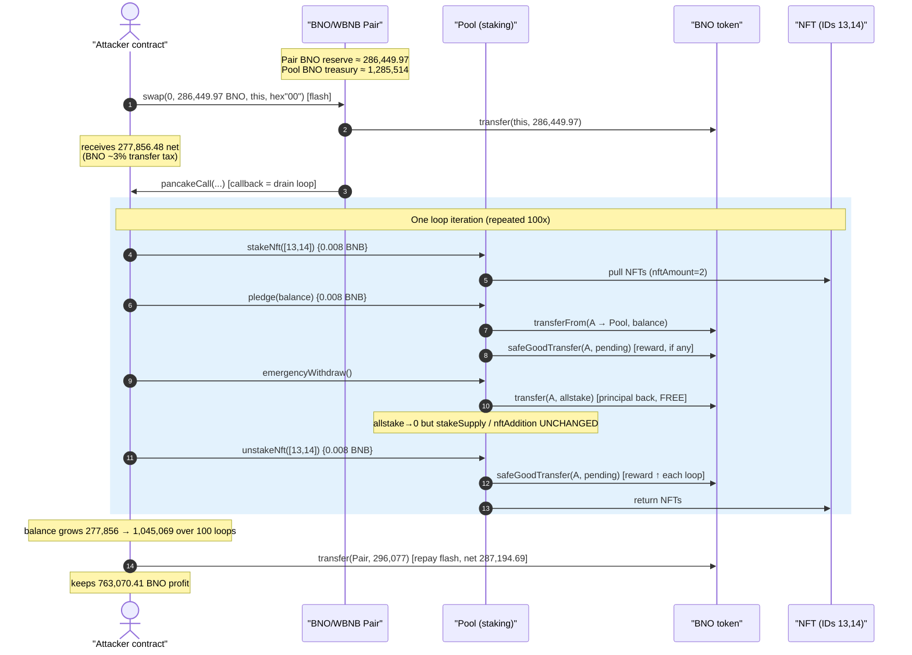
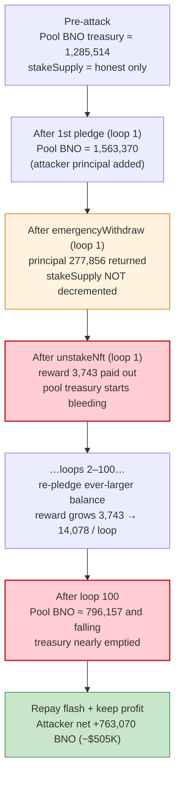
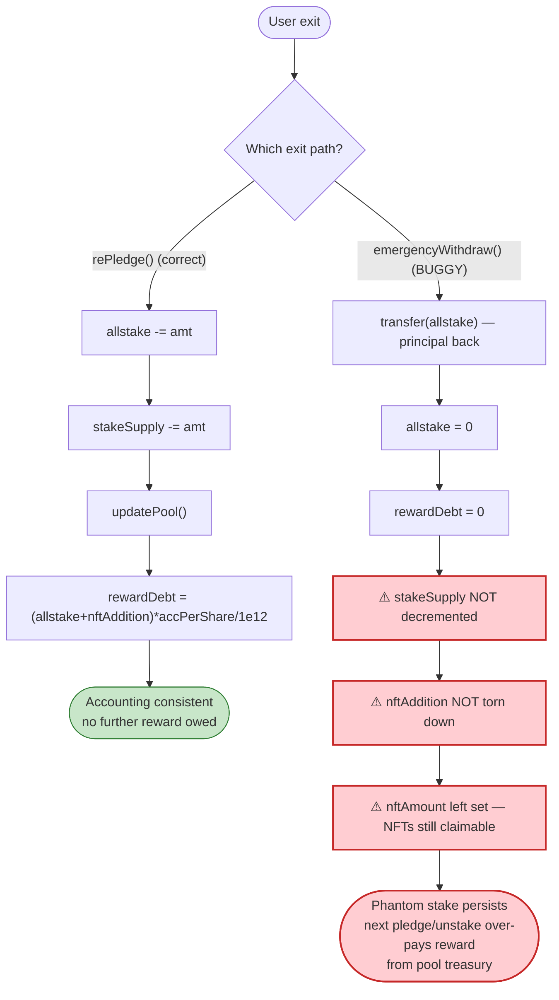

# BNO Exploit — `emergencyWithdraw()` Resets Stake but Leaves Reward Accounting Intact, Draining the Pool

> **Vulnerability classes:** vuln/logic/state-update · vuln/logic/reward-calculation

> **Reproduction:** the PoC compiles & runs in an isolated Foundry project at
> [this project folder](.) (the umbrella DeFiHackLabs repo
> contains many unrelated PoCs that do not whole-compile, so this one was extracted).
> Full verbose trace: [output.txt](output.txt).
> Verified vulnerable source: [Pool.sol](sources/Pool_dCA503/Pool.sol).

---

## Key info

| | |
|---|---|
| **Loss** | ~$505K — **763,070 BNO** extracted from the staking pool (net, after flash-loan repayment) |
| **Vulnerable contract** | `Pool` — [`0xdCA503449899d5649D32175a255A8835A03E4006`](https://bscscan.com/address/0xdCA503449899d5649D32175a255A8835A03E4006#code) |
| **Reward / stake token** | `BNO` — [`0xa4dBc813F7E1bf5827859e278594B1E0Ec1F710F`](https://bscscan.com/address/0xa4dBc813F7E1bf5827859e278594B1E0Ec1F710F) |
| **Flash-loan source** | BNO/WBNB PancakePair — `0x4B9c234779A3332b74DBaFf57559EC5b4cB078BD` |
| **NFT (booster)** | `0x8EE0C2709a34E9FDa43f2bD5179FA4c112bEd89A` (token IDs 13 & 14) |
| **Attacker EOA** | `0xA6566574eDC60D7B2AdbacEdB71D5142cf2677fB` |
| **Attacker contract** | `0xD138b9a58D3e5f4be1CD5eC90B66310e241C13CD` |
| **Attack tx** | `0x33fed54de490797b99b2fc7a159e43af57e9e6bdefc2c2d052dc814cfe0096b9` |
| **Chain / block / date** | BSC / 30,056,629 / July 2023 |
| **Compiler** | `Pool` Solidity **v0.6.12** (optimizer, 1 run); `BNO` v0.8.17 |
| **Bug class** | Broken state accounting — `emergencyWithdraw()` returns principal without clearing `stakeSupply`/`nftAddition`, so reward accrual continues against a phantom stake |

---

## TL;DR

`Pool` is a yield farm where users `pledge()` BNO and (optionally) `stakeNft()` to receive a reward
"weight" boost. Rewards are paid in the **same token** that is staked — `pledgeAddress` and
`profitToken` are both `BNO` ([Pool.sol:471](sources/Pool_dCA503/Pool.sol#L471)) — so the pool's BNO
balance is simultaneously *user principal* and *the reward treasury*.

The fatal flaw is `emergencyWithdraw()`
([Pool.sol:620-625](sources/Pool_dCA503/Pool.sol#L620-L625)):

```solidity
function emergencyWithdraw() public {
    pledgeAddress.safeTransfer(address(msg.sender), userInfo[msg.sender].allstake);
    userInfo[msg.sender].allstake = 0;
    userInfo[msg.sender].rewardDebt = 0;
}
```

It refunds the caller's **entire pledged principal** but:

1. **never decrements** `poolInfo.stakeSupply` (the global stake denominator), and
2. **never touches** `userInfo[msg.sender].nftAddition` / `poolInfo.nftAddition` (the NFT weight boost), and
3. **leaves `userInfo[msg.sender].nftAmount` set** — the staked NFTs remain claimable via `unstakeNft()`.

Because principal comes back **free** while the reward bookkeeping believes the stake is still
live, the attacker can re-pledge the same (ever-growing) BNO over and over. Each cycle:

- `pledge()` pays out `pendingFit()` rewards that accrued against the phantom stake,
- `emergencyWithdraw()` hands the principal straight back,
- `unstakeNft()` pays out *more* `pendingFit()` rewards and returns the NFTs.

Every reward payout is drawn from the pool's own BNO treasury. The attacker bootstraps the whole
thing with a **flash swap** of 286,449 BNO from the PancakeSwap pair, runs the loop **100 times**,
repays the flash loan, and keeps the difference: **763,070 BNO**.

---

## Background — what `Pool` does

`Pool` ([source](sources/Pool_dCA503/Pool.sol)) is a single-pool MasterChef-style staking farm with
an NFT booster:

- **`pledge(amount)`** ([Pool.sol:531-560](sources/Pool_dCA503/Pool.sol#L531-L560)) — deposit BNO; on
  entry it first pays out any `pendingFit()` reward via `safeGoodTransfer`, then credits
  `userInfo.allstake += amount` and `poolInfo.stakeSupply += amount`, then calls `updatePool()`.
- **`stakeNft(ids)`** ([Pool.sol:628-661](sources/Pool_dCA503/Pool.sol#L628-L661)) — escrow "official"
  NFTs to raise `userInfo.nftAmount`; the boost multiplies into `nftAddition` inside `updatePool()`.
- **`unstakeNft(ids)`** ([Pool.sol:663-693](sources/Pool_dCA503/Pool.sol#L663-L693)) — pays pending
  reward, returns the NFTs, decrements `nftAmount`.
- **`emergencyWithdraw()`** ([Pool.sol:620-625](sources/Pool_dCA503/Pool.sol#L620-L625)) — the "panic"
  exit that returns principal with no reward and no `updatePool()`.

Reward weight per user is `allstake + nftAddition`, where
`nftAddition = allstake * nftAmount * nftWeights / 100` (`updatePool()`,
[Pool.sol:518](sources/Pool_dCA503/Pool.sol#L518)). Pending reward is the classic accumulator:

```solidity
// pendingFit(), Pool.sol:500
uint256 userreward = (user.allstake.add(user.nftAddition))
                        .mul(accPerShare).div(1e12).sub(user.rewardDebt);
```

Critically, **the reward token is the stake token** (`setTokenAddress(BNO, BNO)` in the constructor,
[Pool.sol:471](sources/Pool_dCA503/Pool.sol#L471)), so reward payouts bleed the same BNO balance that
backs everyone's principal. At the fork block the pool held **~1,285,514 BNO** as its reward/stake
treasury (derived from the trace: pool balance was `1,563,370 BNO` immediately after the attacker's
first `pledge` of `277,856 BNO`).

---

## The vulnerable code

### 1. `emergencyWithdraw()` — the asymmetric exit

```solidity
function emergencyWithdraw() public {
    pledgeAddress.safeTransfer(address(msg.sender), userInfo[msg.sender].allstake); // refund principal
    userInfo[msg.sender].allstake = 0;     // ← only the per-user stake is zeroed
    userInfo[msg.sender].rewardDebt = 0;   // ← rewardDebt reset to 0 (NOT recomputed)
}
```

Compare with the *correct* exit `rePledge()`
([Pool.sol:562-596](sources/Pool_dCA503/Pool.sol#L562-L596)), which **does** maintain the global
accounting:

```solidity
userInfo[msg.sender].allstake = userInfo[msg.sender].allstake.sub(_stakeAmount);
poolInfo.stakeSupply = poolInfo.stakeSupply.sub(_stakeAmount);   // ← decrement that emergencyWithdraw omits
...
updatePool();
userInfo[msg.sender].rewardDebt = (allstake + nftAddition) * accPerShare / 1e12;  // ← proper rewardDebt
```

`emergencyWithdraw()` omits the `poolInfo.stakeSupply` decrement, omits `updatePool()`, and omits the
`nftAddition` teardown. It also sets `rewardDebt = 0` instead of recomputing it — which, combined with
the still-live `nftAddition`, makes the *next* `pendingFit()` over-pay.

### 2. The stake/`nftAddition` survives the exit

After `emergencyWithdraw()`, `userInfo.nftAddition` is still whatever `updatePool()` last set it to,
and `poolInfo.nftAddition` / `poolInfo.stakeSupply` still include this user's contribution. The next
`pledge()` therefore computes a fresh `pending` against a denominator that double-counts the attacker,
and `safeGoodTransfer` pays it out of the pool's BNO.

### 3. NFTs remain claimable after the principal is gone

`emergencyWithdraw()` leaves `userInfo.nftAmount` untouched, so the subsequent `unstakeNft()` still
finds the NFTs "yours," pays another `pending`, and returns the NFTs — readying them for the next
`stakeNft()`. In the trace the same two NFTs (IDs 13, 14) cycle in and out of the pool **100 times**.

---

## Root cause — why it was possible

A staking pool that pays rewards in the **same asset it custodies** must treat its balance as a shared
pot: principal accounting and reward accounting both draw on it, so they must move together. `Pool`
violates this in `emergencyWithdraw()`:

> It returns 100% of the caller's principal yet leaves the *global* stake denominator
> (`poolInfo.stakeSupply`), the NFT weight (`nftAddition`), and the NFT ownership (`nftAmount`) intact.
> The pool now believes a stake exists that has already been paid back, and it keeps minting reward
> entitlements against it — entitlements that are honored out of *other users'* principal.

Four design decisions compose into a critical, fully-permissionless drain:

1. **Stake token == reward token.** Every reward payout is a withdrawal from the same BNO pot that
   backs principal, so over-paid rewards directly steal honest deposits.
2. **`emergencyWithdraw()` is accounting-incomplete.** It returns principal but does not run
   `updatePool()`, does not decrement `stakeSupply`, and does not tear down `nftAddition`/`nftAmount`.
   The correct exit (`rePledge`) shows the contract authors *knew* the required teardown — they simply
   didn't apply it on the emergency path.
3. **Reward-on-every-entry.** `pledge`, `stakeNft`, and `unstakeNft` all call `safeGoodTransfer(pending)`
   on entry. Because the phantom stake keeps accruing, *each* of these calls is another free withdrawal.
4. **Free working capital via flash swap.** The attacker doesn't even need their own BNO — they borrow
   it from the BNO/WBNB pair with a `pancakeCall` flash swap and repay it at the end of the same tx.

The net effect is a self-amplifying loop: each iteration the attacker's BNO balance grows (principal
returned + reward paid), so they can re-pledge a *larger* amount next time, accruing a *larger* reward,
and so on — the per-loop reward payout climbs from **3,743 BNO** (loop 1) to **14,078 BNO** (loop 100).

---

## Preconditions

- The pool holds a meaningful BNO reward treasury (here ~1.28M BNO). Confirmed by the trace
  (post-first-pledge pool balance `1,563,370 BNO`).
- `paused == false` (the `notPause` modifier on `pledge`/`stakeNft`/`unstakeNft`). True at the fork
  block.
- The attacker owns ≥1 "official" NFT to pass `stakeNft`'s `isOfficialNFT` / `ownerOf` checks
  ([Pool.sol:641-642](sources/Pool_dCA503/Pool.sol#L641-L642)). The PoC pulls IDs 13 & 14 from the
  attacker EOA ([BNO_exp.sol:54-55](test/BNO_exp.sol#L54-L55)); the NFT boost (`nftWeights = 3`,
  `maxNftAmount = 5`, [Pool.sol:470](sources/Pool_dCA503/Pool.sol#L470)) amplifies the per-loop reward.
- A small BNB balance to pay the `withdrawalFee` (`0.008 ether`) charged by `pledge`/`stakeNft`/`unstakeNft`.
- BNO liquidity in the PancakeSwap pair to flash-swap the seed capital. The PoC uses
  `PancakePair.swap(0, reserveBNO - 1, ...)` and repays inside `pancakeCall`
  ([BNO_exp.sol:61-73](test/BNO_exp.sol#L61-L73)).

The entire attack is one transaction and self-financing (flash-loaned), so the only real "cost" is the
flash-swap fee/tax and the dust BNB fees.

---

## Attack walkthrough (with on-chain numbers from the trace)

The PoC structure: a flash swap pulls BNO from the pair, the `pancakeCall` callback runs the
100-iteration drain loop, then repays the loan; profit is whatever BNO remains.

| # | Step | Trace ref | Effect |
|---|------|-----------|--------|
| 0 | **Borrow** — `PancakePair.swap(0, 286,449.97 BNO, this, hex"00")` (flash swap) | [output.txt:1627](output.txt) | Pair sends BNO; attacker receives **277,856.48 BNO net** after BNO's ~3% transfer tax (tax → `0x6716…4D85` 5,728.99 + `0x9190…282d` 2,864.49) |
| 1 | **Approve** BNO → Pool (max) | [output.txt:1639](output.txt) | Loop prep |
| 2a | **`stakeNft([13,14])`** `{value: 0.008e18}` | [output.txt:1654](output.txt) | Escrows both NFTs; `nftAmount = 2` |
| 2b | **`pledge(277,856.48 BNO)`** `{value: 0.008e18}` | [output.txt:1708](output.txt) | Deposits full balance; `stakeSupply += 277,856`; pool BNO balance now `1,563,370` |
| 2c | **`emergencyWithdraw()`** | [output.txt:1727-1729](output.txt) | Pool transfers the **same 277,856.48 BNO** back; `allstake → 0` but `stakeSupply`/`nftAddition` **unchanged** |
| 2d | **`unstakeNft([13,14])`** `{value: 0.008e18}` | [output.txt:1738-1744](output.txt) | Pays `pending` reward **3,743.03 BNO** out of the pool, returns NFTs; attacker balance now > principal |
| 3 | **Repeat steps 2a–2d ×100** | 100× each call (verified) | Each loop re-pledges a *larger* balance (277,856 → 281,599 → … → 1,045,069 BNO) and the per-loop reward grows (3,743 → 3,793 → … → **14,078 BNO**) |
| 4 | **Final dump + repay** — `BNO.transfer(pair, 296,077 BNO)` (net 287,194.69 after tax) | [output.txt:16250](output.txt) | Repays the flash swap (borrowed 286,449.97; repaid net 287,194.69, ~744.71 BNO premium) |
| 5 | **Profit** | [output.txt:16273](output.txt) | Attacker final BNO balance = **763,070.41 BNO** |

Pool BNO balance over the loop fell from `1,563,370 BNO` (after the first pledge,
[output.txt:1742](output.txt)) to `796,157 BNO` (loop 100, [output.txt:16196](output.txt)) and
continued down — the pool's entire ~1.28M-BNO reward treasury minus a small residue was siphoned out.

### Why the reward grows each loop

`pending = (allstake + nftAddition) * accPerShare / 1e12 − rewardDebt`. After `emergencyWithdraw()`
sets `rewardDebt = 0` while `stakeSupply`/`nftAddition` stay inflated, every subsequent `pledge` re-adds
the (now larger) returned balance to `allstake`, so `allstake + nftAddition` climbs each iteration, and
`accPerShare` keeps advancing block-to-block via `updatePool()`. The product grows, `rewardDebt` is
repeatedly knocked back to a stale value, and the payout compounds.

### Profit accounting (BNO)

| Direction | Amount (BNO) |
|---|---:|
| Flash-borrowed from pair (gross) | 286,449.97 |
| ── delivered net of BNO tax | 277,856.48 |
| Reward paid out by pool over 100 loops | ≈ 766,914 *(= 763,070 final + 287,194 repaid − 277,856 borrowed net + dust)* |
| Flash repayment to pair (net of tax, from a 296,077 gross transfer) | 287,194.69 |
| **Net profit retained by attacker** | **763,070.41** |

The retained 763,070 BNO is the attacker's profit — drawn almost entirely from the pool's reward
treasury, i.e. honest stakers' funds. SlowMist/Beosin valued the loss at **~$505K**.

---

## Diagrams

### Sequence of the attack (one loop iteration shown, ×100)



### Pool treasury drain over the loop



### The flaw inside `emergencyWithdraw()` vs the correct exit



---

## Remediation

1. **Make `emergencyWithdraw()` accounting-complete.** It must mirror the teardown that `rePledge`
   already does: decrement `poolInfo.stakeSupply` by the returned `allstake`, remove the user's
   `nftAddition` from `poolInfo.nftAddition`, and zero `userInfo.nftAddition`. A true *emergency* exit
   should also forfeit pending reward, not silently leave the user able to claim more:
   ```solidity
   function emergencyWithdraw() public {
       UserInfo storage u = userInfo[msg.sender];
       uint256 amt = u.allstake;
       poolInfo.stakeSupply = poolInfo.stakeSupply.sub(amt);
       poolInfo.nftAddition = poolInfo.nftAddition.sub(u.nftAddition);
       u.allstake = 0;
       u.nftAddition = 0;
       u.rewardDebt = 0;
       pledgeAddress.safeTransfer(msg.sender, amt);   // principal only, no reward
   }
   ```
   (NFTs should be handled by requiring `unstakeNft` separately, or by also returning/zeroing
   `nftAmount` here so they cannot be re-cycled.)
2. **Do not pay rewards in the staked asset out of the same pot.** Segregate the reward treasury from
   custodied principal (separate token or separate accounting balance) so an over-payment bug cannot
   reach into other users' deposits. If reward token must equal stake token, track a dedicated
   `rewardReserve` and pay only from it.
3. **Add reentrancy / single-action-per-tx guards on reward-bearing entry points.** `pledge`,
   `stakeNft`, and `unstakeNft` each pay `pending` on entry; a `nonReentrant` guard plus a
   "one stake action per block/tx per user" check would break the tight loop.
4. **Recompute `rewardDebt` correctly on every state change** (`= (allstake + nftAddition) * accPerShare / 1e12`),
   never hard-set it to `0`, so that zeroing principal cannot create a fresh, un-debited reward claim.
5. **Invariant check.** Assert `sum(userInfo.allstake) == poolInfo.stakeSupply` and
   `pledgeToken.balanceOf(pool) >= poolInfo.stakeSupply` after every mutating call; the latter would
   have reverted the very first over-payment.

---

## How to reproduce

The PoC was extracted into a standalone Foundry project (the umbrella DeFiHackLabs repo has many
unrelated PoCs that fail to compile under `forge test`'s whole-project build):

```bash
_shared/run_poc.sh 2023-07-BNO_exp -vvvvv
```

- RPC: a **BSC archive** endpoint is required (fork block 30,056,629); most public BSC RPCs prune that
  state and fail with `header not found` / `missing trie node`.
- Result: `[PASS] testExploit()`. The attacker's BNO balance goes from `0` to `763,070.41 BNO`.

Expected tail:

```
  Attacker balance of BNO before exploit: 0.000000000000000000
  Attacker balance of BNO after exploit: 763070.410059643150530251

Suite result: ok. 1 passed; 0 failed; 0 skipped
```

---

*References: Beosin Alert — https://twitter.com/BeosinAlert/status/1681116206663876610 ; SlowMist Hacked — https://hacked.slowmist.io/ (BNO, BSC, ~$505K).*
