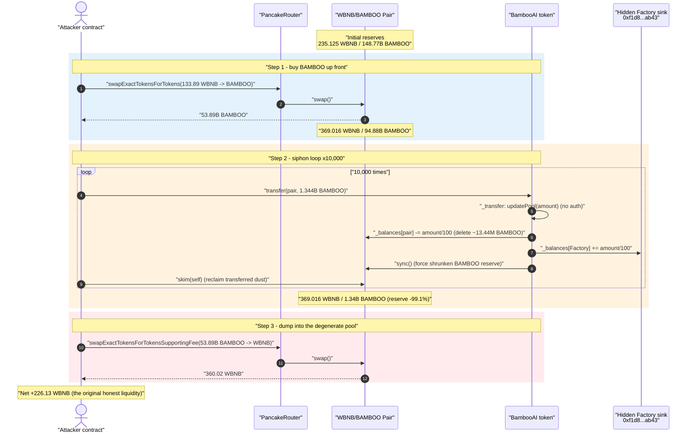
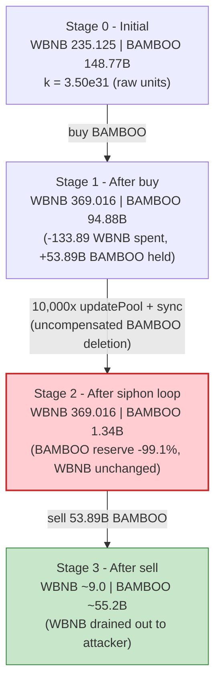
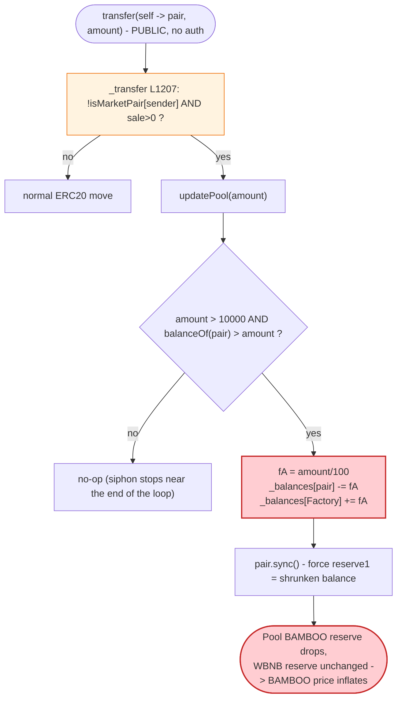
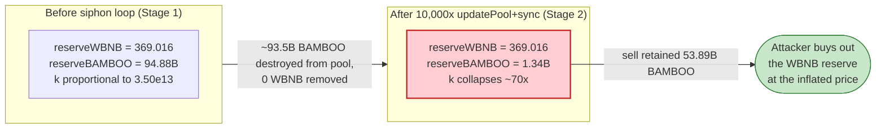

# Bamboo AI Exploit — `updatePool()` Permissionless Pool-Reserve Siphon + `skim`/`sync` Drain

> **Reproduction:** the PoC compiles & runs in an isolated Foundry project at
> [this project folder](.) (the umbrella DeFiHackLabs repo
> contains many unrelated PoCs that do not compile together, so this one was extracted).
> Forge trace / result: [output.txt](output.txt).
> Verified vulnerable source: [BambooAI.sol](sources/BambooAI_ED5678/BambooAI.sol),
> victim pair: [PancakePair.sol](sources/PancakePair_055771/PancakePair.sol).

---

## Key info

| | |
|---|---|
| **Loss** | ~226 WBNB extracted by the PoC (≈ **226.13 WBNB**); the live incident is reported as **~200 BNB** |
| **Vulnerable contract** | `BambooAI` (BAMBOO) — [`0xED56784bC8F2C036f6b0D8E04Cb83C253e4a6A94`](https://bscscan.com/address/0xED56784bC8F2C036f6b0D8E04Cb83C253e4a6A94#code) |
| **Victim pool** | WBNB/BAMBOO PancakePair — [`0x0557713d02A15a69Dea5DD4116047e50F521C1b1`](https://bscscan.com/address/0x0557713d02A15a69Dea5DD4116047e50F521C1b1) |
| **Attacker EOA** | `0x00703face6621bd207d3b4ac9867058190c0bb09` |
| **Attacker contract** | `0xcdf0eb202cfd1f502f3fdca9006a4b5729aadebc` |
| **Attack tx** | [`0x88a6c2c3ce86d4e0b1356861b749175884293f4302dbfdbfb16a5e373ab58a10`](https://explorer.phalcon.xyz/tx/bsc/0x88a6c2c3ce86d4e0b1356861b749175884293f4302dbfdbfb16a5e373ab58a10) |
| **Chain / block / date** | BSC / 29,668,034 / July 2023 |
| **Compiler** | BambooAI: Solidity v0.8.19, optimizer 1 (200 runs); Pair: v0.5.16 |
| **Bug class** | Token-side AMM-reserve manipulation: a permissionless transfer hook that `_balances[pair] -= x` then `pair.sync()`, breaking the constant-product invariant |
| **Post-mortem** | [Phalcon thread](https://twitter.com/Phalcon_xyz/status/1676220090142916611) · PoC by [@eugenioclrc](https://twitter.com/eugenioclrc) |

---

## TL;DR

`BambooAI` is a fee-on-transfer "AI" memecoin. Its `_transfer` invokes a private helper
`updatePool(amount)` on **every non-pair (sell-side) transfer** once trading has started
([BambooAI.sol:1207](sources/BambooAI_ED5678/BambooAI.sol#L1207)). `updatePool` does something
no token should ever do — it **reaches into the liquidity pair's BAMBOO balance, deletes 1% of the
transferred `amount` from it, credits that to a hidden hard-coded `Factory` address, and then calls
`pair.sync()`** ([BambooAI.sol:1240-1247](sources/BambooAI_ED5678/BambooAI.sol#L1240-L1247)):

```solidity
function updatePool(uint256 amount) private {
    if (amount > 10000 && balanceOf(uniswapPair) > amount) {
        uint256 fA = amount / 100;
        _balances[uniswapPair] = _balances[uniswapPair].sub(fA); // ⚠ shrink the pool's BAMBOO balance
        _balances[Factory]     = _balances[Factory].add(fA);     // ⚠ to a hidden constant address
        try IUniswapV2Pair(uniswapPair).sync() {} catch {}       // ⚠ force the reduced balance to be the reserve
    }
}
```

This is an **uncompensated removal of one side of the pool's reserve**: BAMBOO is deleted from the
pair and the pair is forced to accept the shrunken balance as its new reserve, while **no WBNB ever
leaves the pair**. Each call nudges the constant-product `k` downward in the BAMBOO direction.

The attacker simply **repeats a tiny self→pair transfer 10,000 times** (each call routes through
`_transfer → updatePool → sync`, siphoning `amount/100` BAMBOO out of the reserve every time) and
`skim`s its own transferred dust back out after each step. Over 10,000 iterations the pool's BAMBOO
reserve collapses **148.77B → 1.34B (−99.1%)** while the WBNB reserve is untouched. The attacker then
sells the BAMBOO it bought up-front into the now-degenerate pool and walks away with the WBNB.

Net PoC result: **+226.13 WBNB** (`[PASS] testExploit()` in [output.txt](output.txt)).

---

## Background — what BambooAI does

`BambooAI` ([source](sources/BambooAI_ED5678/BambooAI.sol)) is a standard "tax token" template with one
extra, malicious helper bolted on:

- **Trading gate.** Transfers revert until `tradingOpen == true`
  ([:1180-1185](sources/BambooAI_ED5678/BambooAI.sol#L1180-L1185)). At the fork block this is already
  `true`, so it is not an obstacle.
- **`sale` watermark.** When the dev seeds the pair (`sender == addressDev && recipient == uniswapPair`),
  `sale = block.number` ([:1190-1192](sources/BambooAI_ED5678/BambooAI.sol#L1190-L1192)). Once `sale > 0`,
  the `updatePool` hook becomes active.
- **The `updatePool` hook.** On every non-market-pair transfer with `sale > 0`, the token rebalances the
  pool toward a hidden `Factory` constant ([:1207](sources/BambooAI_ED5678/BambooAI.sol#L1207),
  [:1240-1247](sources/BambooAI_ED5678/BambooAI.sol#L1240-L1247)). The `Factory` address is *not* the
  real PancakeFactory — it is the constant `routerHash`
  ([:247-248](sources/BambooAI_ED5678/BambooAI.sol#L247-L248), assigned at
  [:881](sources/BambooAI_ED5678/BambooAI.sol#L881)), which decodes to
  `0xf1d8f914dc5693de077c4dc10005703c8389ab43` — a developer-controlled sink.

The buy/sell tax fields are all initialised to **0** in the constructor
([:886-887](sources/BambooAI_ED5678/BambooAI.sol#L886-L887)), so `takeFee` returns the full amount and the
tax machinery never interferes with the attack.

On-chain state at the fork block (read with `cast` against a BSC archive node):

| Parameter | Value |
|---|---|
| `totalSupply` | 1,000,000,000,000 BAMBOO (1e21 raw, 9 decimals) |
| `tradingOpen` | **true** |
| `sale` (block watermark) | 29,667,516 (> 0 ⇒ hook active) |
| `addressDev` | `0x0aFD…143c` |
| Pair `token0 / token1` | **WBNB / BAMBOO** ⇒ `reserve0 = WBNB`, `reserve1 = BAMBOO` |
| Pair WBNB reserve | **235.125 WBNB** |
| Pair BAMBOO reserve | **148,767,611,111 BAMBOO** (148.77B) |

The pair holds ~235 WBNB of genuine liquidity. That is the prize.

---

## The vulnerable code

### 1. `_transfer` calls the hook on every sell-side transfer

```solidity
// BambooAI._transfer  (sources/BambooAI_ED5678/BambooAI.sol#L1172-L1238)
if (!isMarketPair[sender] && sale > 0) updatePool(amount);   // L1207  ← runs BEFORE balances are moved
...
_balances[sender]    = _balances[sender].sub(amount, "Insufficient Balance");   // L1220
...
_balances[recipient] = _balances[recipient].add(finalAmount);                   // L1233
```

Two facts make this exploitable:

1. `updatePool` runs **before** the sender's debit and recipient's credit, so it operates on the pool's
   *pre-transfer* balance.
2. It fires for **any** `sender` that is not a market pair (e.g. the attacker's own contract), as long as
   `sale > 0` — there is **no access control**.

### 2. `updatePool` mutates the pair's reserve and `sync()`s

```solidity
// sources/BambooAI_ED5678/BambooAI.sol#L1240-L1247
function updatePool(uint256 amount) private {
    if (amount > 10000 && balanceOf(uniswapPair) > amount) {
        uint256 fA = amount / 100;
        _balances[uniswapPair] = _balances[uniswapPair].sub(fA); // pool loses fA BAMBOO
        _balances[Factory]     = _balances[Factory].add(fA);     // siphoned to hidden sink
        try IUniswapV2Pair(uniswapPair).sync() {} catch {}       // pair now believes its BAMBOO reserve is smaller
    }
}
```

`fA = amount/100` BAMBOO is removed from the pair's *balance* and the pair's `sync()` then sets
`reserve1 = balanceOf(pair)` ([PancakePair.sol:491-492](sources/PancakePair_055771/PancakePair.sol#L491-L492)).
**No WBNB moves.** The pair's notion of "how much BAMBOO backs the pool" silently shrinks.

### 3. The pair's `sync()` and `skim()` trust their token balances

```solidity
// sources/PancakePair_055771/PancakePair.sol#L483-L492
function skim(address to) external lock {
    _safeTransfer(_token0, to, IERC20(_token0).balanceOf(address(this)).sub(reserve0));  // WBNB surplus
    _safeTransfer(_token1, to, IERC20(_token1).balanceOf(address(this)).sub(reserve1));  // BAMBOO surplus
}
function sync() external lock {
    _update(IERC20(token0).balanceOf(address(this)), IERC20(token1).balanceOf(address(this)), reserve0, reserve1);
}
```

A Uniswap-V2/Pancake pair only enforces `x·y ≥ k` *inside* `swap()`
([:472-476](sources/PancakePair_055771/PancakePair.sol#L472-L476)). `sync()`/`skim()` simply trust the
ERC-20 balance and assume tokens only move via mechanisms the pair can reason about. BambooAI's
`updatePool` violates exactly that assumption by destroying the pair's BAMBOO from *inside the token
contract* and then calling `sync()`.

---

## Root cause — why it was possible

The flaw is entirely on the **token** side, and composes from four design decisions:

1. **A token must never write to a pair's balance.** `updatePool` does `_balances[uniswapPair] -= fA`,
   directly editing the pool's holdings, then `sync()`s. This is a unilateral, uncompensated reserve
   deletion — the canonical "token rebases/burns the pool then syncs" AMM-manipulation pattern.
2. **The hook is permissionless and attacker-clocked.** Because `updatePool` runs for any non-pair
   `sender` ([:1207](sources/BambooAI_ED5678/BambooAI.sol#L1207)) with no role check, the attacker decides
   *how often* the reserve shrinks — they call it 10,000 times in a single transaction.
3. **The siphon is proportional to the transfer `amount`, not to the pool.** `fA = amount/100`, so the
   attacker chooses a transfer size (`1,343,870,967,101,818,317` ≈ 1.344B BAMBOO) that drains a fixed
   ~13.4M BAMBOO from the reserve per call. 10,000 calls ⇒ ~134B BAMBOO siphoned, ≈ 90% of the reserve.
4. **WBNB never leaves.** Only the BAMBOO side is touched; the WBNB reserve stays at 235→369 WBNB the
   whole time, so the BAMBOO the attacker retained becomes hugely valuable when sold back.

The pair itself is a stock PancakePair and is *not* at fault — it faithfully reflects the balances the
token tells it to. The vulnerability is a malicious/negligent **transfer-time pool mutation**.

---

## Preconditions

- `tradingOpen == true` and `sale > 0` so the `updatePool` hook is live (both true at the fork block).
- Pool BAMBOO balance `> amount` for the siphon branch to execute
  ([:1241](sources/BambooAI_ED5678/BambooAI.sol#L1241)); the attacker sizes the loop transfer below the
  pool's BAMBOO balance, and the loop naturally stops siphoning once the balance dips under it.
- Working capital in WBNB to (a) buy BAMBOO up-front and (b) seed the loop transfers. The PoC `deal`s a
  flat **4,000 WBNB** as headroom and uses ~134 WBNB of it for the initial buy; all of it is recovered
  intra-transaction, so the attack is effectively **flash-loanable** (the PoC's own comments call the
  `deal` a mocked flash loan, [Bamboo_exp.sol:52-53](test/Bamboo_exp.sol#L52-L53)).

---

## Attack walkthrough (with on-chain numbers)

Reserves below are derived from the verified on-chain reserves at block 29,668,034 and the PancakeSwap
fee math (`getAmountOut = in·9975·rOut / (rIn·10000 + in·9975)`); the final profit reproduces the PoC's
logged value to the wei. `reserve0 = WBNB`, `reserve1 = BAMBOO`.

| # | Step ([Bamboo_exp.sol](test/Bamboo_exp.sol)) | Pool WBNB | Pool BAMBOO reserve | Effect |
|---|---|---:|---:|--------|
| 0 | **Initial** | 235.125 | 148,767,611,111 | Honest pool, ~235 WBNB of real liquidity. |
| 1 | **Buy BAMBOO** — `swapExactTokensForTokens(amounts[1], …)` ([:63-66](test/Bamboo_exp.sol#L63-L66)) spends **133.89 WBNB**, receives **53,891,626,440 BAMBOO** | 369.016 | 94,875,984,671 | Attacker now holds ~53.9B BAMBOO; pool BAMBOO down ~36%. |
| 2 | **Siphon loop ×10,000** — each iter `bamboo.transfer(pair, 1.344B)` → `_transfer → updatePool` deletes `fA ≈ 13.44M` BAMBOO from the reserve + `sync()`, then `pair.skim(self)` returns the transferred dust ([:69-72](test/Bamboo_exp.sol#L69-L72)) | 369.016 | **1,342,565,361** | BAMBOO reserve collapses **−99.1%**; WBNB untouched; ~134B BAMBOO routed to the hidden `Factory` sink. |
| 3 | **Sell** — `swapExactTokensForTokensSupportingFeeOnTransferTokens(53.9B BAMBOO, …)` ([:74-80](test/Bamboo_exp.sol#L74-L80)) | ~9.0 | ~55.2B | 53.9B BAMBOO sold into the thinned pool pulls **360.02 WBNB** out. |

Why the loop drains so hard: with `fA = amount/100`, each of the 10,000 transfers removes a *fixed*
~13.44M BAMBOO from the reserve via `updatePool` and re-`sync()`s. The companion `skim` only returns the
attacker's freshly-transferred BAMBOO surplus (and 0 WBNB, since the WBNB balance always equals the WBNB
reserve), so the attacker spends ~nothing per iteration while the pool's BAMBOO reserve bleeds out. After
~10,000 iterations the reserve has fallen from 94.9B to 1.34B and the per-iter siphon stops once the pool
balance drops below the 1.344B transfer size.

### Profit accounting (WBNB)

| Direction | Amount (WBNB) |
|---|---:|
| Start (deal) | 4,000.000 |
| Spent — initial BAMBOO buy (step 1) | −133.891 |
| Received — final BAMBOO sell (step 3) | +360.024 |
| **End balance** | **4,226.133** |
| **Net profit** | **+226.133480422706752470** |

This matches [output.txt](output.txt) exactly:

```
start balance after flashloan 4000.0
profit after return flashloan 226.133480422706752470
```

The ~226 WBNB is the honest liquidity the attacker walked off with after recovering 100% of the capital
it injected.

---

## Diagrams

### Sequence of the attack



### Pool reserve evolution



### The flaw inside `_transfer` / `updatePool`



### Why the siphon is theft: constant-product before vs. after



---

## Remediation

1. **Never let a token write to a pool's balance.** Delete `updatePool` outright, or at minimum stop it
   from doing `_balances[uniswapPair] -= …`. A token must only ever debit balances its holders own; it
   must never mutate an AMM pair's reserves and `sync()`.
2. **If "auto-rebalancing" is a product requirement, route value *out* of the protocol's own funds,**
   not by deleting the pool's tokens. Deflation that touches a pool must move both reserves together
   (e.g. via the pair's `burn()`), preserving `k`.
3. **Gate any state-mutating transfer hook.** `updatePool` should be unreachable from arbitrary callers;
   in this design it fires for any non-pair `sender`. Even if such a hook existed, it must not be
   attacker-clockable 10,000× in one transaction (rate-limit, once-per-block, or keeper-only).
4. **Treat the hidden `Factory`/`routerHash` sink as a backdoor.** The siphoned BAMBOO is credited to a
   hard-coded address unrelated to the real PancakeFactory — this is a developer-controlled extraction
   path and should not exist.
5. **Consumers / LPs: do not provide liquidity to tokens whose `_transfer` mutates pool balances.** Any
   token that calls `pair.sync()` after editing `_balances[pair]` can unilaterally rewrite the pool's
   price; static-analysis / honeypot scanners should flag `sync()`/`skim()` calls from inside a token's
   transfer path.

---

## How to reproduce

The PoC was extracted into a standalone Foundry project (the umbrella DeFiHackLabs repo has many
unrelated PoCs that fail to compile together under `forge test`'s whole-project build):

```bash
_shared/run_poc.sh 2023-07-Bamboo_exp -vvvvv
```

- RPC: a **BSC archive** endpoint is required (fork block 29,668,034). `foundry.toml` is configured for a
  BSC fork; most public BSC RPCs prune this old state and fail with `header not found` / `missing trie node`.
- The PoC mocks the flash loan with `deal(wbnb, address(this), 4000 ether)` and reports profit over that
  baseline.

Expected tail ([output.txt](output.txt)):

```
Ran 1 test for test/Bamboo_exp.sol:BambooTest
[PASS] testExploit() (gas: 326726182)
Logs:
  start balance after flashloan 4000.0
  profit after return flashloan 226.133480422706752470
```

---

*Reference: PoC by [@eugenioclrc](https://twitter.com/eugenioclrc); post-mortem by [Phalcon](https://twitter.com/Phalcon_xyz/status/1676220090142916611). Bamboo AI (BAMBOO), BSC, ~200 BNB.*
