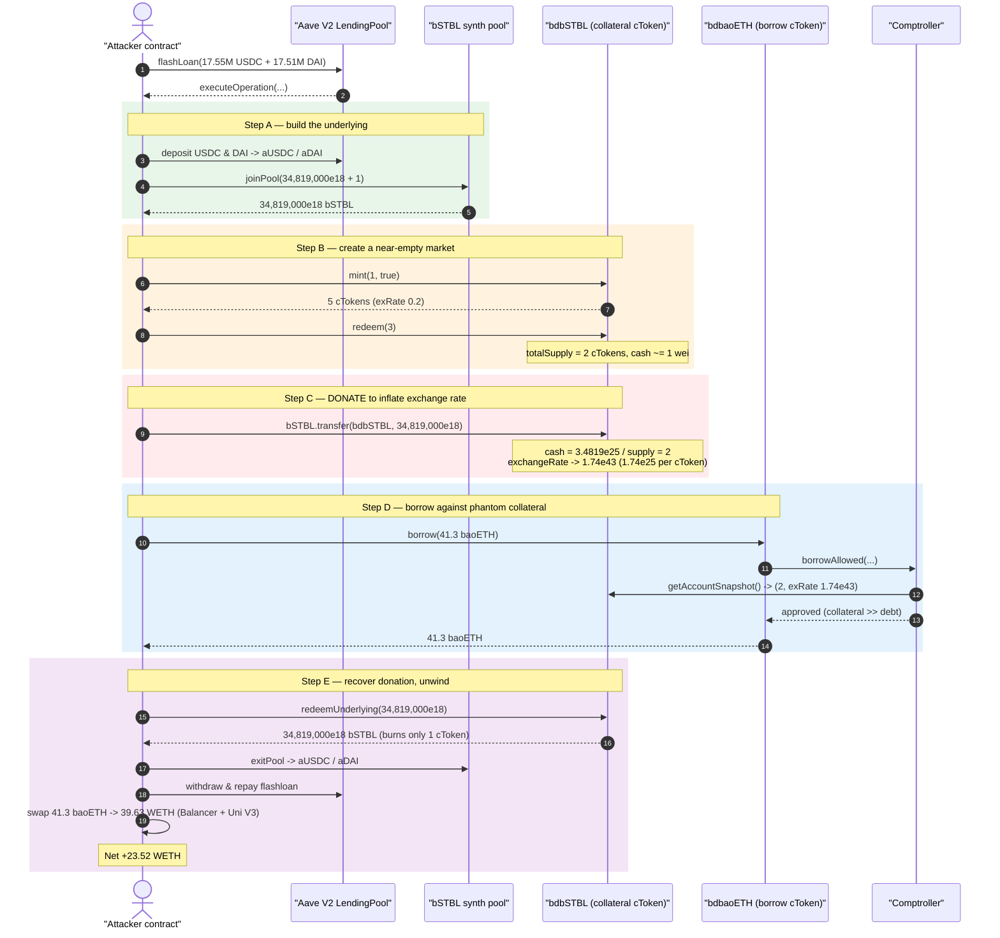
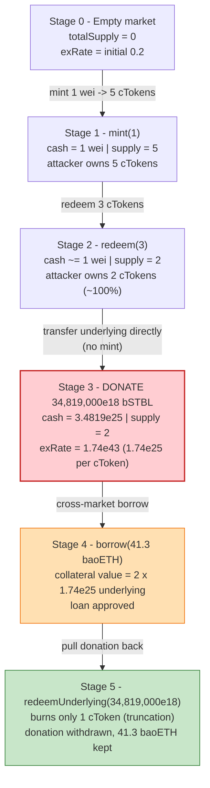
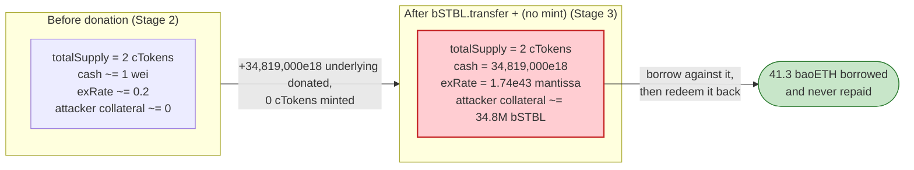

# Bao Finance Exploit — CErc20 Exchange-Rate Inflation via Direct Underlying Donation

> **Vulnerability classes:** vuln/oracle/price-manipulation · vuln/arithmetic/rounding

> **Reproduction:** the PoC compiles & runs in an isolated Foundry project at
> [this project folder](.) (the umbrella DeFiHackLabs repo
> contains many unrelated PoCs that do not whole-compile, so this one was extracted).
> Full verbose trace: [output.txt](output.txt).
> Verified vulnerable source: [contracts_markets_CToken.sol](sources/CErc20Delegator_b0f8Fe/contracts_markets_CToken.sol).

---

## Key info

| | |
|---|---|
| **Loss** | ~$46,000 — attacker walked away with **23.52 WETH** of net profit after repaying a flashloan |
| **Vulnerable contract** | `bdbSTBL` (`CErc20Delegator` → impl `0xdb340…ee84`) — [`0xb0f8Fe96b4880adBdEDE0dDF446bd1e7EF122C4e`](https://etherscan.io/address/0xb0f8fe96b4880adbdede0ddf446bd1e7ef122c4e#code) |
| **Victim market (drained)** | `bdbaoETH` — `0xe853E5c1eDF8C51E81bAe81D742dd861dF596DE7` (same vulnerable implementation) |
| **Underlying collateral token** | `bSTBL` (Bao Synth balancer-style pool token) — `0x5ee08f40b637417bcC9d2C51B62F4820ec9cF5D8` |
| **Attacker EOA** | [`0x00693a01221a5e93fb872637e3a9391ef5f48300`](https://etherscan.io/address/0x00693a01221a5e93fb872637e3a9391ef5f48300) |
| **Attacker contract** | `0x3f99d5cd830203a3027eb0ed6548db7f81c3408f` |
| **Attack tx** | [`0xdd7dd68cd879d07cfc2cb74606baa2a5bf18df0e3bda9f6b43f904f4f7bbdfc1`](https://etherscan.io/tx/0xdd7dd68cd879d07cfc2cb74606baa2a5bf18df0e3bda9f6b43f904f4f7bbdfc1) |
| **Chain / block / date** | Ethereum mainnet / fork at **17,620,870** / July 2023 |
| **Compiler** | Vulnerable CToken: Solidity **v0.5.16**, optimizer 1 (runs 200), proxy → impl `0xdb340…ee84` |
| **Bug class** | Compound-fork CToken exchange-rate (rounding/donation) manipulation — empty-market share inflation |

---

## TL;DR

`bdbSTBL` is a Bao Finance lending market built on a **Compound v2 / CErc20 fork**. Its share price
(`exchangeRate`) is computed live as

```
exchangeRate = (cash + totalBorrows − totalReserves) / totalSupply
```

where `cash = underlying.balanceOf(cToken)`
([`exchangeRateStoredInternal`, CToken.sol:1307-1337](sources/CErc20Delegator_b0f8Fe/contracts_markets_CToken.sol#L1307-L1337)).
Because `cash` is just the raw ERC-20 balance, **anyone can inflate the exchange rate of a near-empty
market by transferring underlying directly to the cToken** — no `mint` required. The Compound code
mints/redeems cTokens with **truncating integer division**
([`mintFresh`, CToken.sol:1503](sources/CErc20Delegator_b0f8Fe/contracts_markets_CToken.sol#L1503);
[`redeemFresh`, CToken.sol:1612](sources/CErc20Delegator_b0f8Fe/contracts_markets_CToken.sol#L1612)),
and there is no minimum-liquidity / dead-shares protection.

The attacker, inside a single Aave flashloan:

1. **Builds the underlying** — flash-borrows 17.55M USDC + 17.51M DAI, deposits them into Aave to get
   aUSDC/aDAI, and `joinPool`s the Bao `bSTBL` synth to obtain **34,819,000e18 bSTBL**.
2. **Seeds the empty market with dust** — `bdbSTBL.mint(1, true)` deposits **1 wei** of bSTBL and
   receives **5 cTokens** (the genesis exchange rate was 0.2). Then `bdbSTBL.redeem(3)` burns 3,
   leaving the market with `totalSupply = 2` cTokens and ~1 wei of cash.
3. **Donates** the entire **34,819,000e18 bSTBL** directly to the `bdbSTBL` contract address.
   The cToken's `cash` jumps to ~3.4819e25 while `totalSupply` is still **2**, so
   `exchangeRate` explodes to **17,409,500…e18 (≈1.74e43 mantissa, i.e. ~1.74e25 underlying per cToken)**.
4. **Borrows for free** — the attacker's 2 cTokens are now worth ~34.8M bSTBL of collateral.
   It calls `bdbaoETH.borrow(41.3 baoETH)` against that phantom collateral and the comptroller approves it.
5. **Recovers the donation** — `bdbSTBL.redeemUnderlying(34,819,000e18)` pulls the donated underlying
   back out, costing only **1 of the 2 cTokens** (truncated). The attacker keeps its borrowed 41.3 baoETH.
6. **Cashes out** — `bSTBL.exitPool` → aUSDC/aDAI → USDC/DAI repays the flashloan; the 41.3 baoETH is
   swapped on Balancer + Uniswap V3 into **WETH**, leaving **+23.52 WETH** net.

The whole position is unwound with no liquidatable debt left behind — the loss is borne by the
`bdbaoETH` market's depositors, who lost 41.3 baoETH of real liquidity to an under-collateralized
loan that was never repaid.

---

## Background — Bao Finance lending markets

Bao Finance ("BaoMarkets") runs Compound v2-style isolated lending markets. Each `CErc20Delegator`
is an upgradeable proxy that delegatecalls a shared `CErc20Delegate` implementation
(`0xdb3401bef8f66e7f6cd95984026c26a4f47eee84`). Two markets are relevant here, **both backed by the
same vulnerable implementation**:

| Market | cToken address | Underlying |
|---|---|---|
| `bdbSTBL` | `0xb0f8Fe96…122C4e` | `bSTBL` (a Bao synth pool token, joinable via aUSDC/aDAI) |
| `bdbaoETH` | `0xe853E5c1…596DE7` | `baoETH` (Bao's ETH-pegged synth) |

The attacker uses **`bdbSTBL` as the inflated collateral** and **`bdbaoETH` as the market it drains**.
The two markets are cross-margined under one Comptroller, so collateral booked in `bdbSTBL` backs a
borrow taken from `bdbaoETH`.

The custom `mint` here takes an extra `enterMarket` flag
([`CErc20Delegator.mint(uint256,bool)`, CErc20Delegator.sol:79](sources/CErc20Delegator_b0f8Fe/contracts_markets_CErc20Delegator.sol#L79))
so the depositor can supply and enable the asset as collateral in one call. That convenience is what
lets the attacker turn 1 wei of dust into live, borrowable collateral.

---

## The vulnerable code

### 1. Exchange rate is driven by the raw on-chain balance

```solidity
// CToken.sol — exchangeRateStoredInternal()
uint _totalSupply = totalSupply;
if (_totalSupply == 0) {
    return (MathError.NO_ERROR, initialExchangeRateMantissa);
} else {
    uint totalCash = getCashPrior();                 // == underlying.balanceOf(cToken)
    (mathErr, cashPlusBorrowsMinusReserves) =
        addThenSubUInt(totalCash, totalBorrows, totalReserves);
    (mathErr, exchangeRate) = getExp(cashPlusBorrowsMinusReserves, _totalSupply);
    return (MathError.NO_ERROR, exchangeRate.mantissa);   // = cash * 1e18 / totalSupply
}
```
([CToken.sol:1307-1337](sources/CErc20Delegator_b0f8Fe/contracts_markets_CToken.sol#L1307-L1337))

`getCashPrior()` is `EIP20Interface(underlying).balanceOf(address(this))` — a **balance read**, not an
internally-tracked accumulator. A plain `bSTBL.transfer(bdbSTBL, X)` therefore moves the exchange rate
directly, **without minting any cTokens against it**.

### 2. Mint truncates cTokens out

```solidity
// CToken.sol — mintFresh()
vars.actualMintAmount = doTransferIn(minter, mintAmount);
(vars.mathErr, vars.mintTokens) =
    divScalarByExpTruncate(vars.actualMintAmount, Exp({mantissa: vars.exchangeRateMantissa}));
// mintTokens = actualMintAmount / exchangeRate, ROUNDED DOWN
```
([CToken.sol:1496-1504](sources/CErc20Delegator_b0f8Fe/contracts_markets_CToken.sol#L1496-L1504))

### 3. Redeem truncates underlying out, and `cash` is fully attacker-controlled

```solidity
// CToken.sol — redeemFresh(), redeemAmountIn path
(vars.mathErr, vars.redeemTokens) =
    divScalarByExpTruncate(redeemAmountIn, Exp({mantissa: vars.exchangeRateMantissa}));
// redeemTokens = redeemAmount / exchangeRate, ROUNDED DOWN
...
if (getCashPrior() < vars.redeemAmount) { return fail(... TOKEN_INSUFFICIENT_CASH ...); }
doTransferOut(redeemer, vars.redeemAmount);
```
([CToken.sol:1605-1661](sources/CErc20Delegator_b0f8Fe/contracts_markets_CToken.sol#L1605-L1661))

Because the donated underlying is sitting in `cash`, `redeemUnderlying(donation)` pulls it straight
back out, and the **truncated** `redeemTokens` cost only **1** of the attacker's 2 cTokens.

### 4. Collateral value reads the manipulated exchange rate verbatim

`getAccountSnapshot` ([CToken.sol:1180-1198](sources/CErc20Delegator_b0f8Fe/contracts_markets_CToken.sol#L1180-L1198))
returns the live `(cTokenBalance, borrowBalance, exchangeRateMantissa)` to the Comptroller's liquidity
math. During `borrowAllowed`, the trace shows the snapshot for `bdbSTBL`:

```
bdbSTBL::getAccountSnapshot(attacker)
  └─ ← 0, 2, 0, 17409500000000000000000000500000000000000000   // (err, cTokens=2, borrow=0, exRate≈1.74e43)
```
([output.txt:2220-2222](output.txt))

`collateral = cTokens(2) × exchangeRate(1.74e25 underlying/cToken) × collateralFactor × price`
≈ the full ~34.8M bSTBL of donated underlying — far more than enough to borrow 41.3 baoETH.

---

## Root cause — why it was possible

This is the canonical **Compound-fork empty-market exchange-rate inflation** bug, identical in class to
the Hundred Finance / earlier Bao incidents (referenced in the PoC header). Four design facts compose
into a critical exploit:

1. **Share price keyed off `balanceOf`, not an internal cash counter.** A direct token transfer to the
   cToken inflates `exchangeRate` with **no offsetting cToken supply** — a free donation that benefits
   whoever holds the (tiny) existing supply.
2. **No minimum supply / dead-shares.** The attacker drove `totalSupply` down to **2** cTokens, making
   the exchange rate's denominator microscopic so the donation has enormous leverage.
3. **Truncating integer division in mint and redeem.** Mint rounds cTokens down; redeem rounds the
   token burn down. With supply ≈ 2 and a giant exchange rate, the attacker can deposit/withdraw the
   donation while keeping enough cToken balance to count as collateral.
4. **Cross-market collateralization with a live, manipulable price.** `bdbSTBL` collateral (inflated)
   backs a `bdbaoETH` borrow, and the Comptroller trusts the instantaneous `exchangeRateStored` for the
   liquidity check. There is no TWAP, no sanity bound on per-cToken value, and no check that the
   collateral market has meaningful real supply.

The market was effectively **fresh/empty** (`totalSupply` reducible to 2 cTokens, near-zero cash),
which is the precondition that makes the donation's price impact unbounded.

---

## Preconditions

- The targeted collateral market (`bdbSTBL`) must be **near-empty** so the attacker can reduce
  `totalSupply` to a couple of wei-cTokens and own essentially 100% of supply. (Confirmed: the
  attacker minted only 1 wei of underlying and the snapshot supply was 2.)
- A second market (`bdbaoETH`) under the **same Comptroller** must hold borrowable liquidity
  (≥ 41.3 baoETH was available).
- Enough working capital to mint the `bSTBL` underlying used for the donation. The PoC sources this via
  an **Aave V2 flashloan** of 17.55M USDC + 17.51M DAI ([Bao_exp.sol:90-99](test/Bao_exp.sol#L90-L99)),
  all repaid in the same transaction → the attack is **flash-loan-funded and atomic**.

---

## Attack walkthrough (with on-chain numbers from the trace)

All figures are taken directly from [output.txt](output.txt). The entire sequence executes inside
`executeOperation`, Aave's flashloan callback ([Bao_exp.sol:106-131](test/Bao_exp.sol#L106-L131)).

| # | Step | Call | Concrete numbers (from trace) |
|---|------|------|-------------------------------|
| 0 | **Flashloan** 17.55M USDC + 17.51M DAI from Aave V2 | `LendingPool::flashLoan` | `17,550,000e6` USDC + `17,510,000e18` DAI ([output.txt:1657](output.txt)) |
| 1 | Deposit both into Aave → aUSDC, aDAI | `LendingPool::deposit` ×2 | aUSDC `17,550,000e6`, aDAI `17,510,000e18` ([output.txt:1682](output.txt), [:1762](output.txt)) |
| 2 | **Join Bao synth pool** to mint underlying `bSTBL` | `bSTBL::joinPool(34,819,000e18 + 1)` | pulls aUSDC `17,541,679,714,376` + aDAI `17,508,225,626,942,268,457,672,924`; mints **34,819,000e18 + 1** bSTBL ([output.txt:1838](output.txt), mint @ [:1982](output.txt)) |
| 3 | **Seed dust** — supply 1 wei, mint 5 cTokens, enter market | `bdbSTBL.mint(1, true)` | `Mint(mintAmount: 1, mintTokens: 5)` ([output.txt:2038](output.txt)) → genesis exRate = 0.2 |
| 4 | **Burn most cTokens** to shrink supply | `bdbSTBL.redeem(3)` | `Redeem(redeemAmount: 0, redeemTokens: 3)`; supply now **2** ([output.txt:2178](output.txt)) |
| 5 | **DONATE** all 34.8M bSTBL straight to the cToken | `bSTBL.transfer(bdbSTBL, 34,819,000e18)` | `Transfer(→ bdbSTBL, 34,819,000,000,000,000,000,000,000)` ([output.txt:2191](output.txt)) — exRate → **1.74095e43** |
| 6 | **Borrow against phantom collateral** | `bdbaoETH.borrow(41.3 baoETH)` | snapshot `cTokens=2, exRate=1.74e43`; `Borrow(borrowAmount: 41.3e18)` ([output.txt:2220-2222](output.txt), [:2340](output.txt)) |
| 7 | **Recover the donation** (costs only 1 cToken) | `bdbSTBL.redeemUnderlying(34,819,000e18)` | `Redeem(redeemAmount: 34,819,000e18, redeemTokens: 1)` ([output.txt:2492](output.txt)) |
| 8 | **Exit synth pool** → aUSDC/aDAI back | `bSTBL.exitPool(34,819,000e18)` | aUSDC `17,541,679,714,375` + aDAI `17,508,225,626,942,268,457,672,923` returned ([output.txt:2504-2604](output.txt)) |
| 9 | **Withdraw from Aave & repay flashloan** | `LendingPool::withdraw` ×2 | USDC `17,549,999,999,999`, DAI `17,509,999,999,999,999,999,999,999` ([output.txt:2688](output.txt), [:2760](output.txt)) |
| 10 | **Swap 41.3 baoETH → WETH** on Balancer | `Balancer.swap` (poolId `0x1a44…51b`) | 41.3 baoETH → **39.63 WETH** ([output.txt:2839](output.txt)) |
| 11 | Top up USDC/DAI shortfall from WETH via Uni V3 | `Router.exactOutputSingle` ×2 | spent `8.069 WETH` + `8.048 WETH` to buy `15,795e6` USDC + `15,759e18` DAI for the flashloan premium ([output.txt:2862](output.txt), [:2892](output.txt)) |
| — | **Net result** | `log_named_decimal_uint` | **Attacker WETH balance after exploit: 23.515708838885169893** ([output.txt:1574](output.txt), [:3014](output.txt)) |

### How "donate then redeem" pays out

After step 5 the `bdbSTBL` market holds ~`34,819,000e18` underlying cash split across just **2**
cTokens, giving `exchangeRate ≈ 17,409,500e18` per cToken (mantissa `1.74095e43`). The Comptroller
values the attacker's 2 cTokens at the full donation. The attacker borrows 41.3 baoETH against that
(step 6), then in step 7 `redeemUnderlying(34,819,000e18)` returns the donation but burns only
`34,819,000e18 / 17,409,500e18 = 1.999… → truncated to 1` cToken. The attacker is left holding 1
cToken (worth ~1 wei of real value) and **keeps the 41.3 baoETH it borrowed**. The collateral that
"backed" the loan was the attacker's own transiently-donated money, now withdrawn.

### Profit / loss accounting

| Flow | Amount |
|---|---:|
| Flashloan principal returned to Aave | 17.55M USDC + 17.51M DAI (net zero) |
| Flashloan premium (paid via WETH→USDC/DAI swaps) | ~16.12 WETH equiv. |
| Borrowed (never repaid) | **41.3 baoETH** |
| baoETH → WETH (Balancer) | **39.63 WETH** |
| WETH consumed buying USDC/DAI to cover premium | −16.12 WETH |
| **Net attacker profit** | **+23.52 WETH** (~$46K) |

The loss falls on `bdbaoETH` depositors: 41.3 baoETH of real liquidity left the market against a loan
collateralized only by a self-funded, instantly-withdrawn donation.

---

## Diagrams

### Sequence of the attack



### Exchange-rate state evolution of the bdbSTBL market



### Why the donation is theft: collateral value before vs. after



---

## Why each magic number

- **`mint(1, true)` then `redeem(3)`:** at the genesis exchange rate of 0.2, 1 wei of underlying mints
  5 cTokens. Redeeming 3 leaves `totalSupply = 2` — small enough that a donation has near-unbounded
  leverage on the exchange rate, while still leaving the attacker a non-zero cToken balance that counts
  as collateral.
- **Donation = 34,819,000e18 bSTBL:** sized to make the 2-cToken collateral worth enough (~34.8M bSTBL,
  priced via the oracle) to satisfy `borrowAllowed` for 41.3 baoETH. Larger is harmless; it must merely
  clear the collateral-factor-discounted threshold for the desired borrow.
- **`redeemUnderlying(34,819,000e18)`:** withdraws exactly the donation. `redeemTokens =
  34,819,000e18 / 17,409,500e18 = 1.999… → 1` (truncated), so the attacker recovers 100% of the donation
  while only burning 1 of its 2 cTokens, and keeps the borrowed baoETH.
- **Flashloan of 17.55M USDC + 17.51M DAI:** the working capital needed to `joinPool` the 34.8M bSTBL
  used as the donation; repaid in full at the end, so the attacker risks only the (small) flashloan
  premium.

---

## Remediation

1. **Don't derive share price from `balanceOf`.** Track cash with an internal accounting variable that
   only changes through `mint`/`redeem`/`borrow`/`repay`, so a raw `transfer` to the cToken cannot move
   the exchange rate. (This is the modern Compound/“Comptroller-safe” pattern.)
2. **Seed every market with dead shares / minimum liquidity.** Mint and permanently lock a non-trivial
   amount of cTokens at deployment (or burn the first-depositor shares to a dead address) so
   `totalSupply` can never be driven down to a handful of wei-cTokens.
3. **Bound the exchange rate / first-depositor handling.** Reject mints/borrows when the market’s real
   supply is below a threshold, and sanity-cap per-cToken value growth per block.
4. **Use a manipulation-resistant collateral valuation.** The Comptroller should not trust the
   instantaneous `exchangeRateStored` for collateral; use a TWAP or a virtual-price oracle that cannot
   be moved by a single-block donation.
5. **Avoid truncation in the attacker’s favor.** Round mint *down* and redeem *up* in token terms (or
   add a minimum-mint check), so an inflated exchange rate cannot let a redeemer pull cash back for
   fewer cTokens than it deposited.

---

## How to reproduce

The PoC was extracted into a standalone Foundry project (the umbrella DeFiHackLabs repo does not
whole-compile under `forge test`):

```bash
_shared/run_poc.sh 2023-07-Bao_exp --mt testExploit -vvvvv
```

- RPC: an **Ethereum mainnet archive** endpoint is required (fork block 17,620,870). Pruned RPCs will
  fail with `header not found` / `missing trie node`.
- Result: `[PASS] testExploit()`, with the attacker holding **23.51 WETH** at the end.

Expected tail ([output.txt:1571-1574](output.txt)):

```
Ran 1 test for test/Bao_exp.sol:ContractTest
[PASS] testExploit() (gas: 2533853)
  Attacker WETH balance after exploit: 23.515708838885169893
```

---

*References: PeckShieldAlert — https://twitter.com/PeckShieldAlert/status/1676224397248454657 ;
similar class: Hundred Finance post-mortem — https://blog.hundred.finance/15-04-23-hundred-finance-hack-post-mortem-d895b618cf33 ;
SlowMist Hacked — https://hacked.slowmist.io/ (Bao Finance, Ethereum, ~$46K).*
