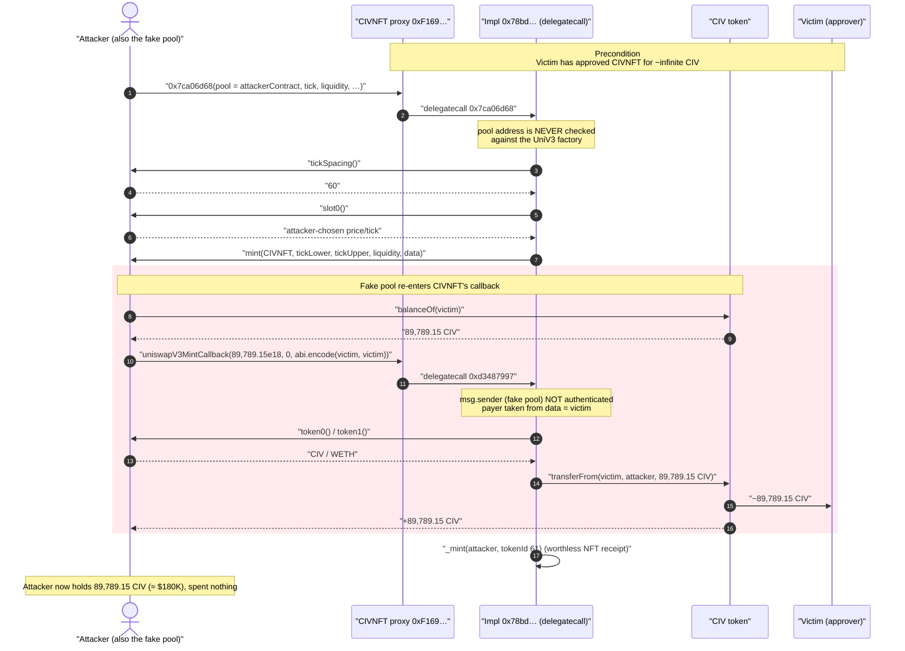
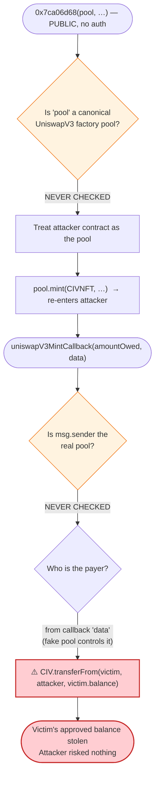
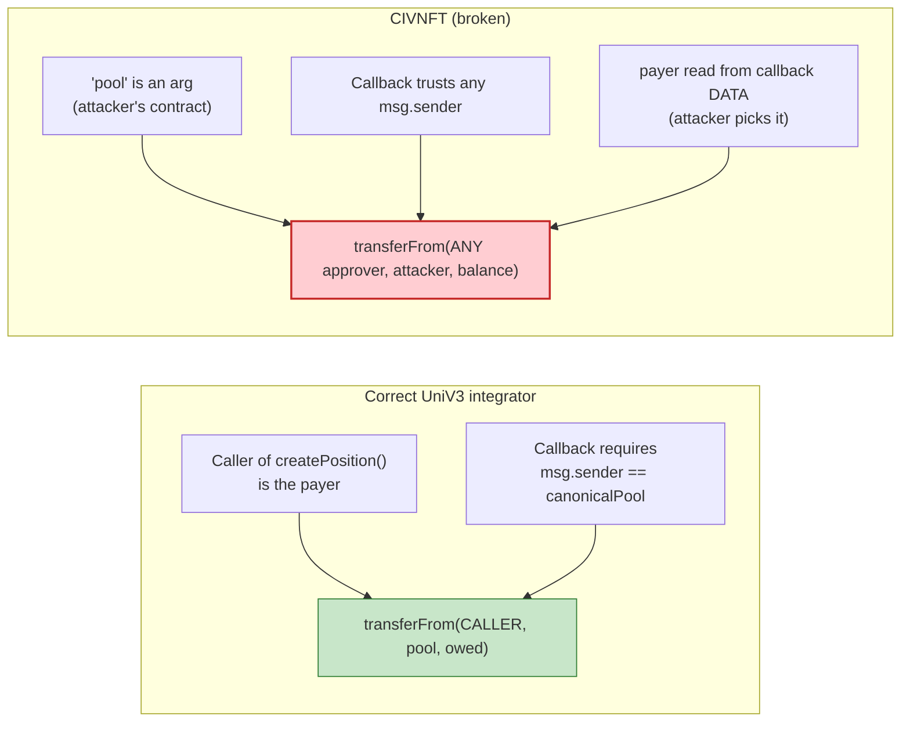

# CIVNFT / CivTrade Exploit — Missing Access Control + Attacker-Controlled Mint Callback Drains Approved Allowances

> **Reproduction:** the PoC compiles & runs in an isolated Foundry project at
> [this project folder](.) (the umbrella DeFiHackLabs repo
> contains many unrelated PoCs that do not whole-compile, so this one was extracted).
> Full verbose trace: [output.txt](output.txt).
> The vulnerable contract is the proxy at `0xF169…0580` ([sources/](sources/TransparentUpgradeableProxy_f169bd/));
> its logic lives in implementation `0x78bd…EeB9`, which was **not verified on Etherscan**, so the
> vulnerable function is reconstructed from the ground-truth execution trace (the trace IS the proof).

---

## Key info

| | |
|---|---|
| **Loss** | ~**$180K** — attacker drained **89,789.15 CIV** (the victim's entire remaining balance) from a single approved account |
| **Vulnerable contract** | `CIVNFT` proxy — [`0xF169BD68ED72B2fdC3C9234833197171AA000580`](https://etherscan.io/address/0xF169BD68ED72B2fdC3C9234833197171AA000580#code) (impl `0x78bd317a87d2Eab65b666e9402182A949Ab4EeB9`) |
| **Victim** | approver `0x512e9701D314b365921BcB3b8265658A152C9fFD` (held infinite CIV approval to CIVNFT) |
| **Stolen token** | `CIV` — [`0x37fE0f067FA808fFBDd12891C0858532CFE7361d`](https://etherscan.io/address/0x37fE0f067FA808fFBDd12891C0858532CFE7361d#code) (plain 18-dec ERC20) |
| **Attacker EOA** | `0xbf9df575670c739d9bf1424d4913e7244ed3ff66` |
| **Attacker contract** | `0x1ae3929e1975043e5443868be91cac12d8cc25ec` |
| **Attack tx** | [`0x93a033917fcdbd5fe8ae24e9fe22f002949cba2f621a1c43a54f6519479caceb`](https://etherscan.io/tx/0x93a033917fcdbd5fe8ae24e9fe22f002949cba2f621a1c43a54f6519479caceb) |
| **Chain / block / date** | Ethereum mainnet / fork **17,649,875** / July 8, 2023 |
| **PoC compiler** | Solidity (test harness `^0.8.10`); impl deployed under `v0.8.2` proxy |
| **Bug class** | Missing access control + attacker-supplied "pool" address + unauthenticated mint callback → arbitrary `transferFrom` of third-party allowances |

---

## TL;DR

`CIVNFT` is the position-manager/NFT contract behind **CivTrade**, a limited-range-order product built on
Uniswap V3. To open a position it calls into a Uniswap V3 pool: it reads `slot0()` / `tickSpacing()` and
then calls `pool.mint(...)`, and Uniswap's `mint` re-enters the caller via `uniswapV3MintCallback` to
**pull the tokens owed**. CivTrade funds that callback by doing `CIV.transferFrom(user, …)` against the
allowance users grant to `CIVNFT`.

Two flaws compose into a one-call drain:

1. **The pool address is an unchecked function argument.** The public entry point (selector `0x7ca06d68`)
   accepts the *pool* to mint into as a parameter and never verifies it is a genuine Uniswap V3 pool from
   the canonical factory. The attacker passes **their own contract** as the "pool."
2. **The mint callback trusts whatever address the from-which-to-pull is, and that address is supplied by
   the (fake) pool.** When CIVNFT's `uniswapV3MintCallback` runs, the *attacker-controlled* fake pool
   decides whose tokens get pulled. The attacker points it at the **victim** — any account that had
   approved `CIVNFT` — and pulls that account's **entire balance** to themselves.

Because the victim had granted CIVNFT an effectively-infinite CIV allowance (standard UX for the product),
the attacker, in a single `0x7ca06d68` call, moved **89,789.15 CIV** out of the victim and into the
attacker's own address — no funds of the attacker's own at risk.

In the trace, `Attacker CIV balance before = 0` and `after = 89,789.154803441368766010 CIV`
([output.txt:1569-1570](output.txt#L1569-L1570)).

---

## Background — what CivTrade / CIVNFT does

CivTrade lets users place "limit orders" as concentrated single-tick Uniswap V3 liquidity positions, wrapped
as NFTs minted by the `CIVNFT` contract. Opening a position means:

1. The user approves `CIVNFT` to spend their token (here `CIV`) — typically an unlimited approval so they can
   place many orders without re-approving.
2. The user (or the CivTrade keeper/frontend) calls a "create position" function on `CIVNFT`, which:
   - reads the target Uniswap V3 pool's `slot0()` and `tickSpacing()`,
   - calls `pool.mint(recipient, tickLower, tickUpper, liquidity, data)`,
   - and inside Uniswap's `mint`, gets re-entered at `uniswapV3MintCallback(amount0Owed, amount1Owed, data)`,
     where it **pays the pool** by transferring the owed token amount — sourced via `transferFrom` against
     the user's approval.

The Uniswap V3 *security model* for this pattern is: only a **canonical pool deployed by the official factory**
is allowed to invoke your `uniswapV3MintCallback`, and your callback authenticates the caller
(`require(msg.sender == computePoolAddress(...))`). CivTrade's `CIVNFT` skipped **both** halves of that model:
it let the caller name the pool, and the callback paid out without proving the caller was a real pool — using a
**from-address taken out of the callback `data`** that the (fake) pool fully controls.

The on-chain facts at fork block 17,649,875 (read from the trace):

| Fact | Value |
|---|---|
| Victim's remaining CIV balance | **89,789.15 CIV** (all of it stolen) |
| Victim → CIVNFT CIV allowance | effectively infinite (`type(uint256).max − 100,000 CIV`; standard decrement, see below) |
| CIV held by the attacker before | **0** |
| Attacker capital required | **none** (pure third-party-allowance theft) |

---

## The vulnerable code

The CIVNFT implementation (`0x78bd…EeB9`) was not verified on Etherscan, so there is no Solidity in
`sources/` for the logic itself (only the OpenZeppelin proxy that delegatecalls into it — see
[sources/TransparentUpgradeableProxy_f169bd/openzeppelin_contracts_proxy_transparent_TransparentUpgradeableProxy.sol](sources/TransparentUpgradeableProxy_f169bd/openzeppelin_contracts_proxy_transparent_TransparentUpgradeableProxy.sol)).
The vulnerable logic is reconstructed below from the **ground-truth trace**; the analyses linked in the PoC
header corroborate it.

### 1. Public entry point takes the pool as an argument and re-enters the caller (selector `0x7ca06d68`)

Reconstructed signature (matches the calldata layout in the trace and the PoC's hand-built call):

```solidity
// CIVNFT (impl 0x78bd…), selector 0x7ca06d68 — reconstructed from trace
function createPosition(
    address pool,        // ⚠️ attacker-supplied; never checked against the UniV3 factory
    bytes   calldata limitPrice, // "0.000059"  (string-as-bytes, cosmetic)
    int24   tick,        // -97385
    uint256 liquidity,   // 195476868337608980000000
    uint256 /*unused*/,  // 0
    bool    /*flag*/     // true
) external {             // ⚠️ NO access control
    int24 spacing = IUniswapV3PoolLike(pool).tickSpacing();        // trace: tickSpacing() -> 60
    Slot0 memory s = IUniswapV3PoolLike(pool).slot0();             // trace: slot0() (attacker-controlled values)
    // compute a single-tick range from `tick` and `spacing`, then:
    IUniswapV3PoolLike(pool).mint(                                 // trace: mint(CIVNFT, -97440, -97380, liquidity, data)
        address(this), tickLower, tickUpper, liquidityAmount, encodedData
    );
    _mint(msg.sender, nextTokenId++);                              // mints the position NFT (tokenId 61)
}
```

In the trace, CIVNFT calls back into the **attacker contract** (passed as `pool`) for `tickSpacing()`
([output.txt:1594-1595](output.txt#L1594-L1595)), `slot0()`
([output.txt:1596-1597](output.txt#L1596-L1597)), and `mint(...)`
([output.txt:1598](output.txt#L1598)). All three are answered by the attacker's own stub functions in
[test/CIVNFT_exp.sol:61-93](test/CIVNFT_exp.sol#L61-L93).

### 2. The mint callback pulls tokens from an address chosen by the (fake) pool (selector `0xd3487997`)

Reconstructed `uniswapV3MintCallback`:

```solidity
// CIVNFT, selector 0xd3487997 — reconstructed from trace
function uniswapV3MintCallback(uint256 amount0Owed, uint256 amount1Owed, bytes calldata data) external {
    // ⚠️ NO authentication that msg.sender is a canonical Uniswap V3 pool
    (address payer, address /*recipient*/) = abi.decode(data, (address, address)); // ⚠️ payer comes from data
    address t0 = IUniswapV3PoolLike(msg.sender).token0();   // trace: token0() -> CIV
    address t1 = IUniswapV3PoolLike(msg.sender).token1();   // trace: token1() -> WETH
    if (amount0Owed > 0) IERC20(t0).transferFrom(payer, msg.sender, amount0Owed); // ⚠️ transferFrom(victim, …)
    if (amount1Owed > 0) IERC20(t1).transferFrom(payer, msg.sender, amount1Owed);
}
```

The standard ERC20 `transferFrom` that fires here is in the verified CIV token
([sources/CivilizationToken_37fE0f/CivilizationToken.sol:279-287](sources/CivilizationToken_37fE0f/CivilizationToken.sol#L279-L287))
— it is a perfectly normal token; the bug is entirely in how CIVNFT calls it.

### 3. The attacker re-enters CIVNFT from its own `mint(...)` to trigger the callback with a victim payer

The attacker's fake-pool `mint()` simply calls CIVNFT's callback, hard-coding the **victim** as both the
`payer` and `recipient` in the callback `data`, and the **victim's full balance** as the amount owed
([test/CIVNFT_exp.sol:85-114](test/CIVNFT_exp.sol#L85-L114)):

```solidity
function mint(address, int24, int24, uint128, bytes calldata) external returns (uint256, uint256) {
    callUniswapV3MintCallback();                 // re-enter CIVNFT
}
function callUniswapV3MintCallback() internal {
    bytes memory data = abi.encode(victim, victim);
    CIVNFT.call(abi.encodeWithSelector(
        bytes4(0xd3487997),                      // uniswapV3MintCallback
        CIV.balanceOf(victim),                   // amount0Owed = victim's ENTIRE balance
        0,
        data                                     // payer = victim
    ));
}
```

In the trace this resolves to `CIV.transferFrom(victim, attacker, 89,789.15 CIV)`
([output.txt:1607-1614](output.txt#L1607-L1614)).

---

## Root cause — why it was possible

Uniswap V3's flash-style callbacks are safe **only** when the integrator enforces *both* of these
invariants. CIVNFT enforced **neither**:

1. **Caller / pool authentication (missing).** A correct integrator computes the canonical pool address from
   the official factory + `(token0, token1, fee)` and requires `msg.sender == thatPool` inside
   `uniswapV3MintCallback`. CIVNFT's callback ran for an arbitrary `msg.sender` (the attacker contract). It
   also let the **caller name the pool** in `createPosition`, so even the outer call never touched a real
   pool — every `slot0` / `tickSpacing` / `mint` was answered by attacker stubs.

2. **Payer authority (missing).** The address whose tokens get pulled (`payer`) was taken from the callback
   `data`, which is fully controlled by the (fake) pool. A correct design derives the payer from the
   *original* caller (`msg.sender` of `createPosition`) and never lets a downstream callback re-target it to
   an arbitrary third party.

Composed, these let anyone call `0x7ca06d68(fakePool, …)` and have CIVNFT obediently execute
`CIV.transferFrom(anyApprover, attacker, anyApprover.balance)`. The only precondition is that the victim
has a standing CIV allowance to `CIVNFT` — which every CivTrade user necessarily had.

This is the canonical **"unauthenticated Uniswap V3 callback + arbitrary-payer"** allowance-drain. It is the
same class as many ERC20-router/permit2 victim-approval thefts: a contract that holds users' approvals must
never expose a path where an attacker chooses both *who pays* and *who receives*.

---

## Preconditions

- The victim has previously approved `CIVNFT` to spend their CIV (here an effectively-infinite approval —
  see the allowance arithmetic below). Every CivTrade user satisfied this by design.
- The victim still holds a non-zero CIV balance (89,789.15 CIV here).
- **No attacker capital, no flash loan, no special role.** `0x7ca06d68` has no access control and the
  attack consumes only the victim's allowance.

**Allowance arithmetic (from the trace).** After the theft, CIVNFT's remaining allowance from the victim is
`0xfff…d849668… = type(uint256).max − 189,789.15 CIV`
([output.txt:1609](output.txt#L1609)). Since `transferFrom` decrements the allowance by exactly the moved
amount, the pre-attack allowance was `type(uint256).max − 100,000 CIV` (the victim had earlier spent ~100k CIV
of an originally-unlimited approval). In other words: **an unlimited approval**, decremented normally — the
hallmark of a third-party-allowance drain.

---

## Attack walkthrough (with on-chain numbers from the trace)

All values below come directly from [output.txt](output.txt#L1586-L1648).

| # | Step | Trace evidence | Effect |
|---|------|----------------|--------|
| 0 | **Initial** — attacker holds 0 CIV; victim holds 89,789.15 CIV with an infinite approval to CIVNFT | [:1587-1588](output.txt#L1587-L1588) | Nothing of the attacker's at risk. |
| 1 | Attacker calls `CIVNFT.0x7ca06d68(attackerContract, "0.000059", tick=-97385, liquidity=195476868337608980000000, 0, true)` | [:1592](output.txt#L1592) | Pool argument = **attacker's own contract**. |
| 2 | Proxy delegatecalls impl `0x78bd…`; impl reads `tickSpacing()` → 60 from the fake pool | [:1593-1595](output.txt#L1593-L1595) | Attacker fully scripts the "pool." |
| 3 | Impl reads `slot0()` → attacker-supplied `sqrtPriceX96`, `tick=-97380` | [:1596-1597](output.txt#L1596-L1597) | Used to derive the mint range. |
| 4 | Impl calls fake-pool `mint(CIVNFT, -97440, -97380, 499885050972117170683107, data)` | [:1598](output.txt#L1598) | Re-enters the attacker. |
| 5 | Fake pool reads `CIV.balanceOf(victim)` → **89,789.15 CIV** and re-enters `CIVNFT.uniswapV3MintCallback(89789.15e18, 0, abi.encode(victim, victim))` | [:1599-1602](output.txt#L1599-L1602) | Sets `amount0Owed` = victim's whole balance, `payer` = victim. |
| 6 | Callback reads `token0()`→CIV, `token1()`→WETH from the fake pool | [:1603-1606](output.txt#L1603-L1606) | Selects which token to pull. |
| 7 | Callback executes `CIV.transferFrom(victim, attacker, 89,789.15 CIV)` | [:1607-1614](output.txt#L1607-L1614) | **Theft.** Allowance decremented by exactly the stolen amount. |
| 8 | Impl finishes by minting the position NFT (`tokenId 61`) to the attacker | [:1620-1641](output.txt#L1620-L1641) | Cosmetic; an NFT receipt for a position that holds nothing real. |
| 9 | **Final** — attacker CIV balance = **89,789.15 CIV** | [:1643-1647](output.txt#L1643-L1647) | Full drain confirmed. |

### Profit / loss accounting (CIV)

| Direction | Amount |
|---|---:|
| Attacker CIV before | 0 |
| Pulled from victim via `transferFrom` | 89,789.154803441368766010 |
| **Attacker CIV after** | **89,789.154803441368766010** |
| Attacker capital spent | 0 |
| **Net profit** | **+89,789.15 CIV (≈ $180K)** |

The profit equals the victim's entire stolen balance, to the wei — the attacker simply walked off with one
approver's funds and risked none of their own. (CivTrade's total realized loss across all drained approvers
was reported at ~$180K; this single PoC tx reproduces the mechanism on one victim.)

---

## Diagrams

### Sequence of the attack



### Control / trust flow inside the vulnerable call



### Why it is theft: who decides "who pays"



---

## Remediation

1. **Authenticate the pool inside the callback (the canonical Uniswap V3 fix).** In
   `uniswapV3MintCallback`, recompute the pool address from the official factory and
   `(token0, token1, fee)` and `require(msg.sender == computedPool)`. This alone makes the attacker's
   fake-pool contract unable to invoke the callback.
2. **Never let the caller name the pool, or validate it.** `createPosition` should derive the pool from the
   factory for the intended token pair/fee, or at minimum `require(IUniswapV3Factory(factory).getPool(t0,t1,fee) == pool)`.
3. **Derive the payer from the original caller, never from callback `data`.** The account whose tokens are
   pulled must be `msg.sender` of the entry point (or an explicitly authorized account), passed through a
   trusted internal context — not a field a downstream callback can set to an arbitrary victim.
4. **Add access control / reentrancy hygiene.** Even with (1)–(3), guard external position-management entry
   points with `nonReentrant` and (if positions are keeper-driven) appropriate role checks, so the
   create→mint→callback flow cannot be re-entered with a forged context.
5. **Minimize standing approvals.** Encourage exact-amount or Permit2 time-boxed approvals instead of
   unlimited approvals to the position manager, so a single integration bug cannot drain a user's whole
   balance.

---

## How to reproduce

The PoC was extracted into a standalone Foundry project (the umbrella DeFiHackLabs repo has many unrelated
PoCs that fail to compile under a whole-project `forge build`):

```bash
_shared/run_poc.sh 2023-07-CIVNFT_exp -vvvvv
```

- RPC: an **Ethereum mainnet archive** endpoint is required (fork block 17,649,875).
- Result: `[PASS] testExploit()`. The attacker's CIV balance goes from **0** to **89,789.15 CIV** purely by
  abusing the victim's pre-existing approval.

Expected tail:

```
Ran 1 test for test/CIVNFT_exp.sol:CIVNFTTest
[PASS] testExploit() (gas: 442046)
Logs:
  Attacker CIV balance before exploit: 0.000000000000000000
  Attacker CIV balance after exploit: 89789.154803441368766010

Suite result: ok. 1 passed; 0 failed; 0 skipped
```

---

*References:*
- *Phalcon: https://twitter.com/Phalcon_xyz/status/1677722208893022210*
- *CivFund post-mortem: https://news.civfund.org/civtrade-hack-analysis-9a2398a6bc2e*
- *SolidityScan: https://blog.solidityscan.com/civnft-hack-analysis-4ee79b8c33d1*
- *DeFiHackLabs: 20230708-civfund — lack of access control.*
