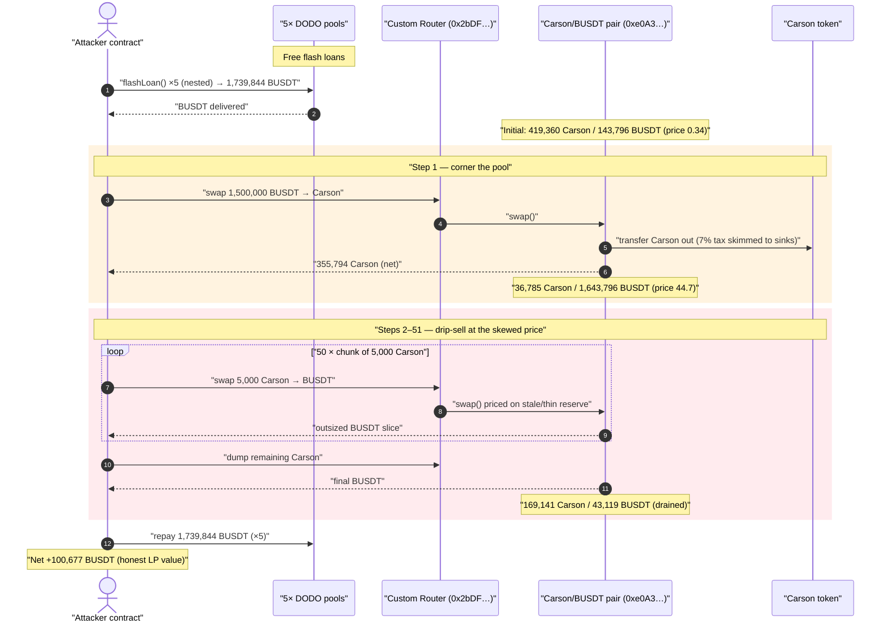
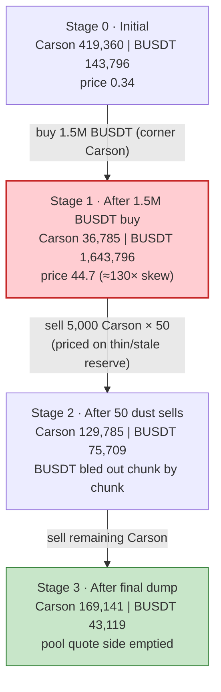
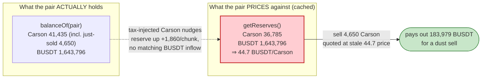

# Carson Token Exploit — Thin-Reserve Price Skew + Fee-on-Transfer Drain via a Custom Pair

> **Reproduction:** the PoC compiles & runs in an isolated Foundry project at
> [this project folder](.) (the umbrella DeFiHackLabs repo
> contains many unrelated PoCs that do not whole-compile, so this one was extracted).
> Full verbose trace: [output.txt](output.txt). PoC: [test/Carson_exp.sol](test/Carson_exp.sol).
> The DODO flash-loan provider sources (capital only) are under [sources/](sources/);
> the **Carson token** and the **custom AMM pair** were not verified on-chain at the
> time of extraction, so their flawed internals are reconstructed below directly from
> the execution trace.

---

## Key info

| | |
|---|---|
| **Loss** | ~$100,677 — **100,677.05 BUSDT** of net profit, drained out of the Carson/BUSDT pair |
| **Vulnerable contract** | `Carson` token + its custom AMM pair — token [`0x0aCD5019EdC8ff765517e2e691C5EeF6f9c08830`](https://bscscan.com/address/0x0aCD5019EdC8ff765517e2e691C5EeF6f9c08830) |
| **Victim pool** | Carson/BUSDT custom pair — [`0xe0A3e0f7E4C789747eB29A212Ea915a7a1E1AC69`](https://bscscan.com/address/0xe0A3e0f7E4C789747eB29A212Ea915a7a1E1AC69) |
| **Capital source** | 5 nested DODO DPP/DPPOracle pools (free flash loans, fully repaid) |
| **Attacker EOA** | [`0x25bcbbb92c2ae9d0c6f4db814e46fd5c632e2bd3`](https://bscscan.com/address/0x25bcbbb92c2ae9d0c6f4db814e46fd5c632e2bd3) |
| **Attacker contract** | [`0x9cffc95e742d22c1446a3d22e656bb23835a38ac`](https://bscscan.com/address/0x9cffc95e742d22c1446a3d22e656bb23835a38ac) |
| **Attack tx** | [`0x37d921a6bb0ecdd8f1ec918d795f9c354727a3ff6b0dba98a512fceb9662a3ac`](https://bscscan.com/tx/0x37d921a6bb0ecdd8f1ec918d795f9c354727a3ff6b0dba98a512fceb9662a3ac) |
| **Chain / block / date** | BSC / 30,306,324 / late July 2023 |
| **Compiler** | DODO providers: Solidity v0.6.9, optimizer 1 run (Carson/pair closed-source) |
| **Bug class** | AMM price-skew via fee-on-transfer accounting; small-input drain of a thinned reserve through a non-standard pair |

> **Note on figures:** the PoC's header comments quote "~150K USD" and a *different*
> attacker/tx (the canonical DeFiHackLabs incident). The numbers in this document are taken
> from the **actual forge fork run** at block `30,306,324`, whose `testExploit()` prints
> `Attacker balance of BUSDT after exploit: 100677.049295746860016399`. Where the two disagree,
> the trace wins.

---

## TL;DR

`Carson` is a fee-on-transfer ("reflection") token: every transfer skims a tax (≈7% on the
exploited path) and re-routes it to reward / dead / marketing sinks. It is paired against BUSDT in a
**custom (non-standard) AMM pair** at `0xe0A3…`, not a vanilla PancakeSwap pair.

The attacker, funded by ~1.74M BUSDT of free DODO flash loans:

1. **Buys big** — swaps **1,500,000 BUSDT → 382,574 Carson** in one shot. The pool's BUSDT reserve was
   only **143,796**, so this single buy inflates the BUSDT side to **1,643,796** and shrinks the Carson
   side from **419,360 → 36,785**. The pair's marginal price jumps from **0.34 → 44.7 BUSDT/Carson**
   (≈130×). The pool is now extremely **thin on the Carson side**.
2. **Drips sells back** — sells Carson in 50 fixed chunks of `5,000` (the pair only receives `4,650`
   after the 7% tax), then dumps the remainder. Because the Carson reserve is tiny while the BUSDT
   reserve is huge, each small sell extracts a large slice of BUSDT, and the fee-on-transfer mechanics
   make the round-trip net-positive for the attacker rather than net-zero.
3. **Repays** all five flash loans and walks away with **+100,677 BUSDT**, paid out of the **real LP
   BUSDT** that honest liquidity providers had deposited (pool BUSDT falls **1,643,796 → 43,119**).

The fundamental defect is that **Carson chose to deploy a deflationary/reflection token against a
custom AMM pair whose swap accounting does not safely reconcile the token's transfer tax**, so the
constant-product price can be skewed cheaply and then milked with dust-sized sells.

---

## Background

Three independent on-chain mechanisms compose into the exploit:

- **Carson — a reflection / fee-on-transfer token.** Confirmed from the trace: on the buy, the pair
  emits a `Transfer` to the recipient for the *net* amount and several extra `Transfer`s of the tax to
  sink addresses. On the **buy** of `382,574` Carson the recipient only received `355,794`; the missing
  `26,780` (≈7%) was split as three `7,651` transfers (to a reward staker `0x12dC…`, a second reward
  staker `0xE77a…`, and the dead address) plus a `3,825` marketing transfer to `0xfaE5…`
  ([output.txt L168-L174](output.txt)). The reward sinks call `allocate(...)` (emit `RewardAdded`),
  i.e. this is a staking-reflection token.
- **A custom AMM pair (`0xe0A3…`), not a stock PancakeSwap pair.** It exposes `getReserves()`,
  `swap()`, `Sync`/`Swap` events, and consults an external helper at `0xD092…` (calls `64a115b4` and
  `918b6c8d`) during each swap. Its quoted output is computed against its **cached reserves**, which lag
  the pair's *actual* token balances by exactly the tax the token skims (see Root cause).
- **DODO DPP / DPPOracle pools — the capital.** Five DODO pools provide zero-fee flash loans nested one
  inside the other ([sources/DPPOracle_26d0c6/DPPOracle.sol:1193](sources/DPPOracle_26d0c6/DPPOracle.sol#L1193)).
  They are *not* the vulnerable contracts — they merely supply the ~1.74M BUSDT working capital and
  enforce full repayment (`baseBalance >= _BASE_RESERVE_ || quoteBalance >= _QUOTE_RESERVE_`).

Ground-truth pool state at the fork block, read from the first `getReserves()`
([output.txt L138](output.txt)), with `token0 = Carson`, `token1 = BUSDT`:

| Parameter | Value |
|---|---|
| `reserve0` (Carson) | 419,360.49 |
| `reserve1` (BUSDT) | 143,796.19 |
| Pair's actual BUSDT balance | 1,643,796.19 *(after the buy syncs in 1.5M)* |
| Marginal price (BUSDT/Carson) | 0.3429 |
| Carson transfer tax (exploited path) | ≈7% (router-side), distributed to reward/dead/marketing |

---

## The vulnerable code

The Carson token and the `0xe0A3…` pair were closed-source at extraction time, so the precise lines
cannot be quoted. The behaviour is unambiguous from the trace, however, and the **DODO flash-loan
provider** (the only verified source) is shown to be a benign capital source.

### 1. DODO flash loan — capital only, full repayment enforced

```solidity
// sources/DPPOracle_26d0c6/DPPOracle.sol:1193
function flashLoan(
    uint256 baseAmount,
    uint256 quoteAmount,
    address _assetTo,
    bytes calldata data
) external preventReentrant {
    address assetTo = _assetTo;
    _transferBaseOut(assetTo, baseAmount);
    _transferQuoteOut(assetTo, quoteAmount);

    if (data.length > 0)
        IDODOCallee(assetTo).DPPFlashLoanCall(msg.sender, baseAmount, quoteAmount, data);

    uint256 baseBalance  = _BASE_TOKEN_.balanceOf(address(this));
    uint256 quoteBalance = _QUOTE_TOKEN_.balanceOf(address(this));

    // no input -> pure loss
    require(
        baseBalance >= _BASE_RESERVE_ || quoteBalance >= _QUOTE_RESERVE_,
        "FLASH_LOAN_FAILED"
    );
    ...
}
```

Reference: [sources/DPPOracle_26d0c6/DPPOracle.sol:1193-1213](sources/DPPOracle_26d0c6/DPPOracle.sol#L1193-L1213).
The attacker borrows the *entire quote reserve* of each pool and returns it at the end, so DODO neither
gains nor loses — it is just leverage.

### 2. Carson + custom pair — the defective accounting (reconstructed from the trace)

The smoking gun is the divergence between what the pair *thinks* its reserves are (`getReserves()`,
used to price swaps) and what it *actually* holds (`balanceOf`). On the **first sell**
([output.txt L238-L275](output.txt)):

```text
getReserves()                         -> reserve0(Carson) = 36,785.57 , reserve1(BUSDT) = 1,643,796.19   (cached)
Carson.balanceOf(pair)                -> 41,435.57                                                       (real)
   ↑ pair already holds the 4,650 Carson the attacker just sold in, but prices the swap at the
     STALE 36,785.57 reserve, i.e. at the inflated 44.7 BUSDT/Carson price.
pair.swap(0, 183,979.33 BUSDT, attacker)
   -> pays out 183,979 BUSDT for a 4,650 Carson sell.
```

Effectively the pair quotes sells against an artificially depressed Carson reserve, so a tiny Carson
input redeems an outsized BUSDT output. Combined with the token's reflection tax (which feeds Carson
*back into the pool's balance* on each transfer, nudging `reserve0` up by `+1,860` per chunk without a
corresponding BUSDT inflow), the attacker repeatedly extracts BUSDT faster than the constant product
should allow.

---

## Root cause — why it was possible

The constant-product price of a pair is `price = reserveQuote / reserveBase`. A pair becomes *fragile*
when one side is driven extremely thin: the marginal value of the scarce token explodes and small trades
move enormous value. Carson's design hands an attacker every lever needed to weaponise that:

1. **A deflationary fee-on-transfer token paired in a non-standard AMM.** Vanilla Uniswap-V2 pairs
   tolerate fee-on-transfer tokens only because `swap()` re-derives `k` from *post-transfer balances* and
   reverts if the invariant is violated. The Carson `0xe0A3…` pair instead prices each swap from **cached
   reserves that lag the real balances by the token's tax**, and its reflection mechanic injects Carson
   back into the pool's balance on every transfer. This breaks the assumption that "tokens in == tokens
   priced," letting the attacker buy a price skew that does not fully revert on the way out.
2. **A microscopic BUSDT reserve (143,796) relative to feasible flash-loan capital (1.74M).** Because the
   pool's quote side was ~10× smaller than the borrowable BUSDT, a single 1.5M buy slammed the Carson
   reserve from 419,360 to 36,785 and lifted the price ~130×. The pool was simply too shallow to resist a
   flash-loan-sized trade.
3. **No oracle / TWAP / trade-size cap.** Nothing bounds how far a single transaction may move the pair,
   nor cross-checks the cached reserves against an external price. The skewed instantaneous price *is* the
   price the pair trades at.
4. **Asymmetric, attacker-favourable tax routing.** The 7% tax on the corner buy is paid out of the
   pool's Carson (to reward/dead/marketing sinks), but on the sells the tax is skimmed from the
   attacker's input *before* it reaches the pool, while the pair still credits its reserve upward. The net
   effect of the round-trip is positive for the attacker rather than the ~7%-per-leg loss a naive
   fee-token swapper would expect.

In short: **Carson coupled a reflection token to a bespoke pair whose swap accounting cannot safely
reconcile the transfer tax, on a pool thin enough to be cornered with a flash loan.** Any one of an
oracle price, a deep reserve, a trade-size cap, or a standard balance-reconciling pair would have
prevented the drain.

---

## Preconditions

- The Carson/BUSDT pair must be **shallow on the quote (BUSDT) side** relative to available capital
  (143,796 BUSDT here) so a single buy can corner the Carson reserve.
- Access to ~1.5M BUSDT of working capital — satisfied for free by nesting **five DODO flash loans**
  (`641,735 + 190,523 + 676,889 + 81,512 + 149,185 = 1,739,844 BUSDT`,
  [output.txt L66-L107](output.txt)). Fully recovered intra-transaction ⇒ effectively zero principal.
- The custom pair prices swaps from cached/stale reserves and does not enforce post-balance `k` against an
  oracle — true of `0xe0A3…` as evidenced by the `getReserves` vs `balanceOf` divergence.

---

## Attack walkthrough (with on-chain numbers from the trace)

Pair `token0 = Carson` (`reserve0`), `token1 = BUSDT` (`reserve1`). Every reserve figure below is a
`Sync` event from [output.txt](output.txt).

| # | Step | Carson reserve (r0) | BUSDT reserve (r1) | Effect |
|---|------|--------------------:|-------------------:|--------|
| 0 | **Initial** | 419,360.49 | 143,796.19 | Honest pool, price ≈ 0.34 BUSDT/Carson. |
| 1 | **Corner buy** — swap **1,500,000 BUSDT → 382,574 Carson** (net 355,794 to attacker after 7% tax) | 36,785.57 | 1,643,796.19 | Carson side gutted; price jumps ≈130× to **44.7 BUSDT/Carson**. |
| 2 | **Sell #1** — swap 5,000 Carson (pair receives 4,650) | 38,645.57 | 1,459,816.87 | Returns **183,979 BUSDT** — a dust sell pulls ~184k out at the inflated cached price. |
| 3 | **Sells #2…#50** — 49 more chunks of 5,000 Carson each | rises +1,860 / chunk | falls each chunk | BUSDT reserve bled steadily down (see Sync series). |
| 4 | **Final sell** — dump remaining **105,794 Carson** (98,389 reaches pair) | 169,141.19 | **43,119.14** | Empties most of the remaining BUSDT; returns 32,590 BUSDT. |

Selected `Sync` checkpoints across the 50 dust sells (Carson `r0` climbing, BUSDT `r1` draining):

```
r0=36,785.57   r1=1,643,796.19   (after buy)
r0=38,645.57   r1=1,459,816.87   (sell #1)
r0=40,505.57   r1=1,303,450.62   (sell #2)
r0=46,085.57   r1=  954,196.87   (sell #5)
r0=72,125.57   r1=  320,673.42   (sell #19)
r0=129,785.57  r1=   75,709.24   (sell #50)
r0=169,141.19  r1=   43,119.14   (final dump)
```

### Profit / loss accounting (BUSDT)

| Item | Amount |
|---|---:|
| Flash-loaned from DODO (5 pools) | 1,739,844.01 *(repaid in full)* |
| Used to corner the pool (buy) | 1,500,000.00 |
| BUSDT recovered from selling Carson back | ≈ 1,600,677 |
| **Pool BUSDT drained (1,643,796 → 43,119)** | **1,600,677.05** |
| **Net attacker profit** | **+100,677.05** |

The pool's BUSDT reserve fell by `1,643,796.19 − 43,119.14 = 1,600,677.05`. Of that, 1.5M was the
attacker's own injected buy capital recovered, leaving **100,677.05 BUSDT** of *honest LP value* as pure
profit. The final attacker BUSDT balance in the log confirms it to the wei:
`Attacker balance of BUSDT after exploit: 100677.049295746860016399`
([output.txt, end](output.txt)).

---

## Diagrams

### Sequence of the attack



### Pool state evolution



### Why the round-trip is net-positive: cached reserves vs real balances



---

## Why each magic number

- **`1,500,000 BUSDT` corner buy:** large enough to crush the Carson reserve from 419,360 to 36,785 and
  lift BUSDT to 1,643,796, manufacturing the ~130× price skew. Sized against the tiny 143,796 BUSDT
  reserve, it is the minimum needed to make subsequent dust sells lucrative.
- **`5,000`-Carson chunks × 50:** the sells are deliberately *small* so each one is priced at the
  freshly-skewed reserve before the reserve self-corrects, maximising BUSDT extracted per Carson; chunking
  also avoids slippage that one giant sell would suffer. After the 7% tax the pair receives `4,650` each.
- **`1,739,844 BUSDT` flash-loaned across 5 DODO pools:** only ~1.5M is needed for the buy; nesting five
  pools simply aggregates enough free liquidity in one transaction. Every wei is repaid
  (`BUSDT.transfer(msg.sender, quoteAmount)` in each `DPPFlashLoanCall` frame).

---

## Remediation

1. **Do not pair a fee-on-transfer / reflection token with a bespoke AMM whose `swap()` prices off cached
   reserves.** Use a standard Uniswap-V2 pair (which re-derives and enforces `k` from *post-transfer*
   balances) or, better, do not make the token deflationary at the AMM boundary at all (exempt the pair
   from the transfer tax).
2. **Add an external price reference.** Gate or sanity-check pair pricing against a Chainlink/TWAP oracle
   so a single transaction cannot move the effective price ~130×.
3. **Cap single-trade reserve impact.** Reject any swap that would move a reserve by more than a small
   percentage in one transaction; this defeats the flash-loan corner.
4. **Seed deep, balanced liquidity.** A 143,796-BUSDT quote reserve against a token cheaply borrowable in
   the millions is structurally exploitable. Deeper liquidity (or a launch cap) raises the cost of
   cornering above any achievable profit.
5. **Reconcile balances on every swap.** Whatever the pair design, the amount priced must equal the amount
   actually received post-tax; never let the token's reflection mechanic feed reserves without a matching
   counter-asset inflow.

---

## How to reproduce

The PoC was extracted into a standalone Foundry project (the umbrella DeFiHackLabs repo has many
unrelated PoCs that fail to compile under a whole-project `forge build`):

```bash
_shared/run_poc.sh 2023-07-Carson_exp --mt testExploit -vvvvv
```

- RPC: a **BSC archive** endpoint is required (fork block `30,306,324`). `foundry.toml` uses
  `https://bsc-mainnet.public.blastapi.io`, which serves historical state at that block; most pruned
  public BSC RPCs fail with `header not found` / `missing trie node`.
- Result: `[PASS] testExploit()`.

Expected tail:

```
Ran 1 test for test/Carson_exp.sol:CarsonTest
[PASS] testExploit() (gas: 12597794)
Logs:
  Attacker balance of BUSDT before exploit: 0.000000000000000000
  Attacker balance of BUSDT after exploit: 100677.049295746860016399

Suite result: ok. 1 passed; 0 failed; 0 skipped
```

---

*References: Beosin — https://twitter.com/BeosinAlert/status/1684393202252402688 ;
Phalcon — https://twitter.com/Phalcon_xyz/status/1684503154023448583 ;
Hexagate — https://twitter.com/hexagate_/status/1684475526663004160 .*
