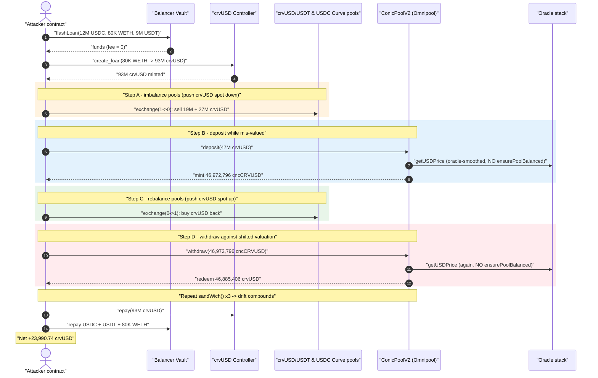
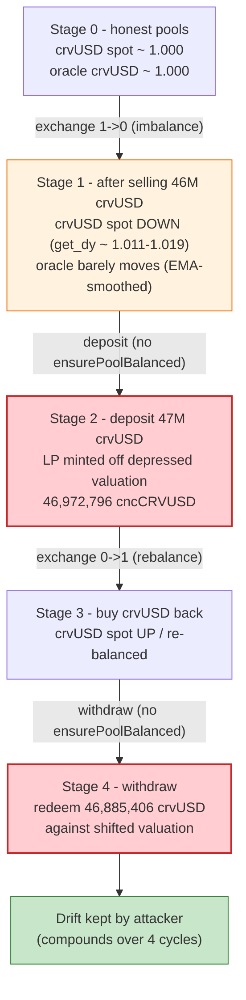
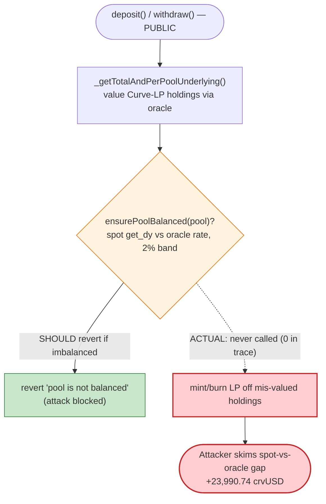

# Conic Finance (crvUSD Omnipool) Exploit — Curve Pool Imbalance Manipulation of LP Valuation

> **Vulnerability classes:** vuln/oracle/price-manipulation · vuln/logic/missing-validation · vuln/governance/flash-loan-attack

> **Reproduction:** the PoC compiles & runs in an isolated Foundry project at
> [this project folder](.) (the umbrella DeFiHackLabs repo contains many
> unrelated PoCs that do not whole-compile, so this one was extracted).
> Full verbose trace: [output.txt](output.txt).
> Verified vulnerable source: [sources/ConicPoolV2_369cbc/ConicPoolV2.sol](sources/ConicPoolV2_369cbc/ConicPoolV2.sol).

---

## Key info

| | |
|---|---|
| **Loss** | ~$934K total across Conic Omnipools; this PoC reproduces the **crvUSD Omnipool** leg, attacker walks away with **23,990.74 crvUSD** profit (≈ $24K) per single flash-loan run |
| **Vulnerable contract** | `ConicPoolV2` (crvUSD Omnipool) — [`0x369cBC5C6f139B1132D3B91B87241B37Fc5B971f`](https://etherscan.io/address/0x369cbc5c6f139b1132d3b91b87241b37fc5b971f#code) (proxy; impl `0x635228edaead8a76b6ae1779bd7682043321943d`) |
| **Victim funds** | crvUSD held by the Omnipool, allocated across `crvUSD/USDT`, `crvUSD/USDC` (and other) Curve pools |
| **Attacker EOA** | [`0xb6369f59fc24117b16742c9dfe064894d03b3b80`](https://etherscan.io/address/0xb6369f59fc24117b16742c9dfe064894d03b3b80) |
| **Attacker contract** | [`0x486cb3f61771ed5483691dd65f4186da9e37c68e`](https://etherscan.io/address/0x486cb3f61771ed5483691dd65f4186da9e37c68e) |
| **Attack tx** | [`0x37acd17a80a5f95728459bfea85cb2e1f64b4c75cf4a4c8dcb61964e26860882`](https://etherscan.io/tx/0x37acd17a80a5f95728459bfea85cb2e1f64b4c75cf4a4c8dcb61964e26860882) |
| **Chain / block / date** | Ethereum mainnet / fork at 17,743,470 / July 21, 2023 |
| **Compiler** | Solidity v0.8.17, optimizer 200 runs |
| **Bug class** | Manipulable LP valuation — deposit/withdraw accounting trusts oracle-priced Curve LP holdings without an **imbalance sanity check** on the entry/exit paths |

---

## TL;DR

`ConicPoolV2` is a Curve "Omnipool": users deposit a single underlying (here **crvUSD**), the pool
spreads that liquidity across several underlying Curve pools (`crvUSD/USDT`, `crvUSD/USDC`, …), and
mints a receipt token (`cncCRVUSD`). The amount of LP minted on deposit and underlying returned on
withdraw is computed from **`getTotalAndPerPoolUnderlying()`**
([ConicPoolV2.sol:721-778](sources/ConicPoolV2_369cbc/ConicPoolV2.sol#L721-L778)), which values the
pool's Curve-LP holdings through the price oracle.

The codebase ships a guard for exactly this risk — `CurvePoolUtils.ensurePoolBalanced()`
([CurvePoolUtils.sol:30-58](sources/ConicPoolV2_369cbc/CurvePoolUtils.sol#L30-L58)) compares each
underlying Curve pool's *spot* exchange rate (`get_dy`) against the oracle's expected rate and
reverts if they diverge by more than ~2%. **But `ConicPoolV2.sol` never calls it on `deposit`,
`depositFor`, or `withdraw`.** The verbose trace contains **zero** `ensurePoolBalanced` invocations
and **zero** `"pool is not balanced"` reverts.

That omission lets an attacker:

1. **Flash-borrow** $80K WETH + $12M USDC + $9M USDT from Balancer (fee = 0).
2. **Open a crvUSD loan** on Curve's crvUSD Controller (deposit 80K WETH, mint 93M crvUSD).
3. **Imbalance** the underlying `crvUSD/USDT` and `crvUSD/USDC` Curve pools by swapping tens of
   millions of crvUSD through them, moving their internal exchange rates.
4. **Deposit** the borrowed crvUSD into the Omnipool while it is mis-valuing its own Curve-LP
   holdings, then immediately **re-balance** the Curve pools in the opposite direction and
   **withdraw**, redeeming the receipt token against a now-shifted valuation.
5. **Repeat** the deposit/withdraw "sandwich" several times, each cycle skimming the price gap.
6. **Unwind** everything, repay the crvUSD loan and the flash loan, and keep the residual crvUSD.

Net result after a single transaction: **23,990.74 crvUSD** kept by the attacker, all of it
extracted from honest Omnipool depositors.

---

## Background — what ConicPoolV2 does

`ConicPoolV2` ([source](sources/ConicPoolV2_369cbc/ConicPoolV2.sol)) is the second iteration of
Conic's "Omnipool". The lifecycle relevant to the exploit:

- **Deposit** (`depositFor`, [:136-196](sources/ConicPoolV2_369cbc/ConicPoolV2.sol#L136-L196)):
  reads the underlying balance, deposits the new underlying into the "least balanced" Curve pool,
  re-reads the balance, and mints LP = `mintableUnderlyingAmount / exchangeRate`. The `exchangeRate`
  is `totalUnderlying / lpSupply` ([:302-307](sources/ConicPoolV2_369cbc/ConicPoolV2.sol#L302-L307)).
- **Withdraw** (`withdraw`, [:343-379](sources/ConicPoolV2_369cbc/ConicPoolV2.sol#L343-L379)):
  burns LP and returns `conicLpAmount * exchangeRate` of underlying, pulling Curve LP out as needed.
- **Valuation** (`_getTotalAndPerPoolUnderlying`,
  [:754-778](sources/ConicPoolV2_369cbc/ConicPoolV2.sol#L754-L778)): for each registered Curve pool
  it converts the pool's Curve-LP balance to underlying via
  `_curveLpToUnderlying` ([:790-800](sources/ConicPoolV2_369cbc/ConicPoolV2.sol#L790-L800)), which
  uses `priceOracle().getUSDPrice(curveLpToken)` and `getUSDPrice(underlying)`.

The on-chain oracle stack observed in the trace:

| Oracle | Role |
|---|---|
| `GenericOracleV2` (`0x286eF…344b0`) | top-level dispatcher |
| `CrvUsdOracle` | prices **crvUSD** — derived from the crvUSD Curve pools' `price_oracle()` EMA feeds |
| `CurveLPOracleV2` | prices each **Curve LP token** (uses `get_dy(0,1,1e6)` internally as part of its own pricing) |
| `ChainlinkOracleV2` | prices USDC/USDT (≈ $1.00) |

The pool *does* know how to defend itself — `ICurveRegistryCache`
([ICurveRegistryCache.sol:5](sources/ConicPoolV2_369cbc/ICurveRegistryCache.sol#L5)) imports
`CurvePoolUtils` and exposes the `assetType`/threshold metadata that
`ensurePoolBalanced` needs. The guard is simply never wired into the deposit/withdraw flow.

---

## The vulnerable code

### 1. Deposit values & mints from oracle-priced Curve LP, with no imbalance check

```solidity
function depositFor(address account, uint256 underlyingAmount, uint256 minLpReceived, bool stake)
    public override returns (uint256)
{
    ...
    uint256 underlyingPrice_ = controller.priceOracle().getUSDPrice(address(underlying));
    ( vars.underlyingBalanceBefore, vars.allocatedBalanceBefore, vars.allocatedPerPoolBefore )
        = _getTotalAndPerPoolUnderlying(underlyingPrice_);          // ← valuation, no balance guard
    vars.exchangeRate = _exchangeRate(vars.underlyingBalanceBefore);

    underlying.safeTransferFrom(msg.sender, address(this), underlyingAmount);
    _depositToCurve(...);                                            // pushes into the Curve pool

    ( vars.underlyingBalanceAfter, ... ) = _getTotalAndPerPoolUnderlying(underlyingPrice_);
    vars.underlyingBalanceIncrease = vars.underlyingBalanceAfter - vars.underlyingBalanceBefore;
    vars.mintableUnderlyingAmount  = _min(underlyingAmount, vars.underlyingBalanceIncrease);
    vars.lpReceived = vars.mintableUnderlyingAmount.divDown(vars.exchangeRate);   // ← LP minted off valuation
    ...
}
```

[ConicPoolV2.sol:136-196](sources/ConicPoolV2_369cbc/ConicPoolV2.sol#L136-L196). Both the
`exchangeRate` and the measured `underlyingBalanceIncrease` flow directly from
`_getTotalAndPerPoolUnderlying`, which is a pure function of oracle prices and Curve-LP balances —
**neither path validates that the underlying Curve pools are at fair spot prices.**

### 2. Withdraw mirrors the same valuation, also unguarded

```solidity
function withdraw(uint256 conicLpAmount, uint256 minUnderlyingReceived) public override returns (uint256) {
    ...
    (uint256 totalUnderlying_, uint256 allocatedUnderlying_, uint256[] memory allocatedPerPool)
        = getTotalAndPerPoolUnderlying();                            // ← same unguarded valuation
    uint256 underlyingToReceive_ = conicLpAmount.mulDown(_exchangeRate(totalUnderlying_));
    ...
}
```

[ConicPoolV2.sol:343-379](sources/ConicPoolV2_369cbc/ConicPoolV2.sol#L343-L379).

### 3. The guard that should have been called — but never is

```solidity
function ensurePoolBalanced(PoolMeta memory poolMeta) internal view {
    uint256 fromDecimals = poolMeta.decimals[0];
    uint256 fromBalance  = 10 ** fromDecimals;
    uint256 fromPrice    = poolMeta.prices[0];
    for (uint256 i = 1; i < poolMeta.numberOfCoins; i++) {
        ...
        uint256 toExpected = ...;                       // oracle-implied rate
        uint256 toActual   = ICurvePoolV1(poolMeta.pool).get_dy(0, int128(uint128(i)), fromBalance); // spot
        require(_isWithinThreshold(toExpected, toActual, poolMeta.thresholds[i]), "pool is not balanced");
    }
}
```

[CurvePoolUtils.sol:30-68](sources/ConicPoolV2_369cbc/CurvePoolUtils.sol#L30-L68). The default
threshold is **2%** (`_DEFAULT_IMBALANCE_THRESHOLD = 0.02e18`,
[CurvePoolUtils.sol:11](sources/ConicPoolV2_369cbc/CurvePoolUtils.sol#L11)). Had this run against
each underlying Curve pool inside `_getTotalAndPerPoolUnderlying` (or at the start of
deposit/withdraw), the attacker's multi-million-crvUSD swaps — which pushed pool spot rates well past
2% — would have reverted the deposit and the withdraw.

> **Grep proof from the trace:** `grep -c "pool is not balanced\|ensurePoolBalanced" output.txt` → **0**.
> The guard is dead code on the value-bearing paths.

---

## Root cause

A Curve "metapool" or stableswap pool prices its assets from its *current* reserves. The
**oracle** Conic uses to value its LP holdings (`CrvUsdOracle` / `CurveLPOracleV2`) is built to be
manipulation-resistant — it reads each pool's EMA `price_oracle()` feed and uses a `get_dy(0,1,1e6)`
probe rather than naive `balanceOf`/`get_virtual_price`. So the *valuation* of the LP token barely
moves under a same-block swap.

The vulnerability is the **mismatch between two views of the same pools that the protocol never
reconciles**:

- the **slow, oracle-smoothed** valuation used to size LP mint/burn, versus
- the **instantaneous spot** state of the underlying Curve pools that the deposit actually trades
  into and the withdraw actually trades out of.

When the attacker imbalances the underlying Curve pools, the *spot* price the pool transacts at
diverges from the *oracle* price the pool accounts at. Depositing while the spot is on one side and
withdrawing after flipping the spot to the other side lets the attacker buy `cncCRVUSD` for less
underlying than it can later redeem for — a classic value leak that compounds over repeated
deposit/withdraw "sandwich" cycles.

`ensurePoolBalanced` is precisely the reconciliation step: it forces spot (`get_dy`) and
oracle-implied rate to agree within 2% before the protocol acts. Omitting it from
`deposit`/`depositFor`/`withdraw` is the root cause. (This is the same class of bug as Conic's
earlier ETH-Omnipool exploit the same week; the V2 deployment failed to apply the imbalance guard on
the value-bearing entry points.)

---

## Preconditions

- The Omnipool holds real, allocated crvUSD across underlying Curve pools (it did).
- The deposit/withdraw paths do not call `ensurePoolBalanced` (confirmed: 0 calls in trace).
- Enough working capital to (a) move the underlying Curve pools' spot rates and (b) supply a large
  deposit. All of it is **flash-loanable**: the PoC borrows $12M USDC + $9M USDT + 80K WETH from
  **Balancer at 0 fee** ([Conic02_exp.sol:73-77](test/Conic02_exp.sol#L73-L77)) and mints 93M crvUSD
  against the WETH via Curve's crvUSD Controller
  ([Conic02_exp.sol:90](test/Conic02_exp.sol#L90)). Everything is repaid in the same transaction.

---

## Attack walkthrough (with on-chain numbers from the trace)

All figures are taken directly from [output.txt](output.txt). The Curve pool coin indices are
`0 = stablecoin (USDT/USDC)`, `1 = crvUSD`, so `exchange(1,0,…)` sells crvUSD for the stable, and
`exchange(0,1,…)` buys crvUSD back.

| # | Step (trace line) | Action | Effect |
|---|---|---|---|
| 0 | setUp | Fork mainnet @ 17,743,470 | Honest crvUSD Omnipool, allocated to Curve pools |
| 1 | [Conic02_exp.sol:77](test/Conic02_exp.sol#L77), out.txt L77+ | Balancer `flashLoan` 12M USDC + 80K WETH + 9M USDT (fee 0) | Working capital acquired |
| 2 | [:90](test/Conic02_exp.sol#L90), out.txt L106 | `crvUSDController.create_loan(80K WETH, 93M crvUSD, 10)` | Mints **93,000,000 crvUSD** of debt |
| 3 | [:92](test/Conic02_exp.sol#L92), out.txt L264, L285 | Sell **19M crvUSD → USDT** and **27M crvUSD → USDC** | Underlying Curve pools imbalanced; crvUSD spot pushed down |
| 4 | [:93](test/Conic02_exp.sol#L93), out.txt L310 | `ConicPool.deposit(47,000,000 crvUSD, 0, false)` | Mints **46,972,796.49 cncCRVUSD** ([out.txt L2329](output.txt)) — note **lpReceived < deposited**, valuation depressed |
| 5 | [:94](test/Conic02_exp.sol#L94), out.txt L2339, L2363 | Swap all USDC + USDT **back to crvUSD** | Re-balances pools the other way; crvUSD spot pushed up |
| 6 | [:95](test/Conic02_exp.sol#L95), out.txt L2386 | `ConicPool.withdraw(46,972,796.49 cncCRVUSD, 0)` | Redeems **46,885,406.63 crvUSD** ([out.txt L4577](output.txt)) |
| 7 | [:97-99](test/Conic02_exp.sol#L97-L99), out.txt L4581+ | `sandWich()` ×3 — each: dump 28M+39M crvUSD, deposit ~47M, buy back, withdraw | Repeats the skim; per-cycle LP/underlying drift compounds |
| 8 | [:101-102](test/Conic02_exp.sol#L101-L102), out.txt L17532, L17553 | Final 9M crvUSD→USDT, 12M crvUSD→USDC | Frees stablecoins to repay flash loan |
| 9 | [:103-106](test/Conic02_exp.sol#L103-L106) | Repay 12M USDC + 9M USDT to Balancer | Stable legs repaid |
| 10 | [:108-109](test/Conic02_exp.sol#L108-L109), out.txt L17592, L17617 | Buy crvUSD back with leftover stables | Reconstitute crvUSD for loan repayment |
| 11 | [:110](test/Conic02_exp.sol#L110), out.txt L17641 | `crvUSDController.repay(93M crvUSD)` | crvUSD debt cleared |
| 12 | [:111](test/Conic02_exp.sol#L111), out.txt L17733 | `WETH.transfer(Balancer, 80K)` | WETH leg repaid (exact, fee 0) |
| 13 | end, out.txt L17752-17756 | `crvUSD.balanceOf(attacker)` | **23,990.742410095126661566 crvUSD** left as profit |

### Why the deposit/withdraw drift is profitable

Each `sandWich()` ([Conic02_exp.sol:124-129](test/Conic02_exp.sol#L124-L129)) does:
deposit-into-imbalanced-pool → re-balance → withdraw. Because the Omnipool measures both the LP it
mints and the underlying it returns from the same oracle-priced valuation — while the *actual*
trades happen at manipulated spot rates — the receipt token is acquired against a depressed valuation
and redeemed against a recovered one. The trace shows the receipt amounts and withdrawals tracking
this drift (e.g. deposit cycle 3 mints **47,012,339.93** cncCRVUSD for a 47,001,923.17 crvUSD deposit
— `lpReceived > deposited`, the opposite sign from cycle 1 — [out.txt L10963](output.txt)). Summed
across the open/imbalance/deposit/rebalance/withdraw/close sequence, the residual is positive crvUSD.

The LP-oracle probe in the trace confirms the spot moved far outside the 2% band that
`ensurePoolBalanced` would have enforced: `get_dy(0,1,1e6)` swings from ~`1.0110e18`
([out.txt L539](output.txt)) up to ~`1.0195e18` ([out.txt L1821](output.txt)) and back to ~`0.9999e18`
([out.txt L2619](output.txt)) within the single transaction.

---

## Profit / loss accounting

| Item | Amount |
|---|---:|
| Balancer flash loan | 12,000,000 USDC + 9,000,000 USDT + 80,000 WETH |
| Flash-loan fee | **0** ([out.txt L17744-17750](output.txt)) |
| crvUSD minted as debt | 93,000,000 crvUSD ([out.txt L106](output.txt)) |
| crvUSD debt repaid | 93,000,000 crvUSD ([out.txt L17641](output.txt)) |
| WETH returned to Balancer | 80,000 WETH (exact) ([out.txt L17733](output.txt)) |
| USDC / USDT returned to Balancer | principal, fee 0 |
| **Attacker residual crvUSD (profit)** | **23,990.742410095126661566 crvUSD** ([out.txt L17756](output.txt)) |

A single run nets ~$24K from this Omnipool; the live incident repeated against multiple Conic
Omnipools for ~$934K aggregate (see post-mortem). All capital is flash-borrowed, so the attack is
effectively capital-free.

---

## Diagrams

### Sequence of one exploit run



### Pool-valuation drift across one deposit/withdraw cycle



### Where the guard should fire (and doesn't)



---

## Remediation

1. **Call `ensurePoolBalanced` on every value-bearing path.** Before sizing any LP mint or
   underlying redemption, validate each underlying Curve pool's spot rate against the oracle-implied
   rate inside `_getTotalAndPerPoolUnderlying` (or at the top of `depositFor`/`withdraw`). Reverting
   when any pool is imbalanced beyond the threshold makes the deposit/withdraw sandwich impossible.
   This is the fix Conic ultimately shipped — the bug was that V2 omitted it on these entries.
2. **Tighten and per-pool-tune the imbalance threshold.** The 2% default is generous for deep
   stable pools; set per-pool thresholds (`PoolMeta.thresholds`) conservatively, especially for
   thinner pools where a single swap moves spot a lot.
3. **Reconcile spot and oracle views explicitly.** Any protocol that *trades* into pools at spot but
   *accounts* at an oracle price must assert the two agree at the moment of the trade — otherwise the
   gap is extractable.
4. **Block same-transaction deposit→withdraw round-trips** (or charge a withdrawal fee on
   short-held LP) so that even a residual valuation gap cannot be harvested risk-free in one block.
5. **Cap single-operation share of pool TVL.** A deposit/withdraw that represents a large fraction of
   an underlying Curve pool's reserves should be rejected or routed to revert, since it is the
   mechanism that creates the spot/oracle divergence in the first place.

---

## How to reproduce

The PoC was extracted into a standalone Foundry project (the umbrella DeFiHackLabs repo has many
unrelated PoCs that fail `forge test`'s whole-project build):

```bash
_shared/run_poc.sh 2023-07-Conic02_exp --mt testExploit -vvvvv
```

- RPC: an **Ethereum archive** endpoint is required (fork block 17,743,470, July 2023). Most pruned
  public RPCs will fail with `missing trie node` / `header not found`.
- Result: `[PASS] testExploit()` and the attacker keeps **23,990.74 crvUSD**.

Expected tail:

```
Ran 1 test for test/Conic02_exp.sol:ContractTest
[PASS] testExploit() (gas: 20870486)
Logs:
  Attacker crvUSD balance after exploit: 23990.742410095126661566

Suite result: ok. 1 passed; 0 failed; 0 skipped
```

---

*References:*
*Conic post-mortem — https://medium.com/@ConicFinance/post-mortem-eth-and-crvusd-omnipool-exploits-c9c7fa213a3d ·*
*spreekaway thread — https://twitter.com/spreekaway/status/1682467603518726144*
