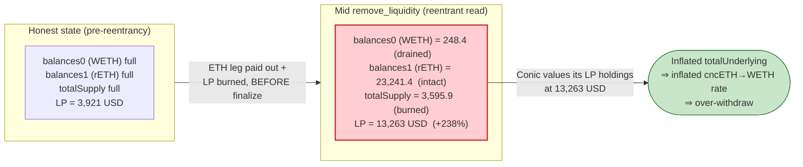
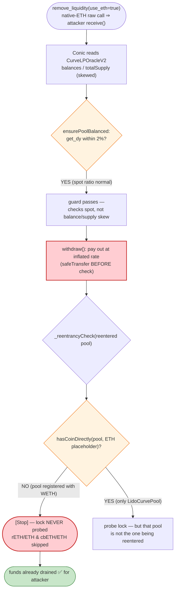

# Conic Finance ETH Omnipool Exploit — Curve Read-Only Reentrancy Oracle Inflation

> **Vulnerability classes:** vuln/reentrancy/read-only · vuln/oracle/price-manipulation · vuln/governance/flash-loan-attack

> **Reproduction:** the PoC compiles & runs in an isolated Foundry project at
> [this project folder](.) (the umbrella DeFiHackLabs repo
> contains many unrelated PoCs that do not whole-compile under `forge test`, so this one was extracted).
> Full verbose trace: [output.txt](output.txt).
> Verified vulnerable source: [ConicEthPool.sol](sources/ConicEthPool_Bb787d/ConicEthPool.sol) and
> [CurvePoolUtils.sol](sources/ConicEthPool_Bb787d/CurvePoolUtils.sol).

---

## Key info

| | |
|---|---|
| **Loss (this PoC, ETH Omnipool)** | ~$3.25M — attacker ends with **1,724.21 WETH** of profit (started with 0 capital, all flash-loaned) |
| **Vulnerable contract** | `ConicEthPool` (Omnipool) — [`0xBb787d6243a8D450659E09ea6fD82F1C859691e9`](https://etherscan.io/address/0xbb787d6243a8d450659e09ea6fd82f1c859691e9#code) |
| **Mispricing component** | `CurveLPOracleV2` (reached via `GenericOracleV2` [`0x286eF89cD2DA6728FD2cb3e1d1c5766Bcea344b0`](https://etherscan.io/address/0x286eF89cD2DA6728FD2cb3e1d1c5766Bcea344b0)) |
| **Victim** | Conic ETH Omnipool LPs (the pool's Curve/Convex positions in steCRV, rETH/ETH, cbETH/ETH) |
| **Attacker EOA** | [`0x8d67db0b205e32a5dd96145f022fa18aae7dc8aa`](https://etherscan.io/address/0x8d67db0b205e32a5dd96145f022fa18aae7dc8aa) |
| **Attacker contract** | [`0x743599ba5cfa3ce8c59691af5ef279aaafa2e4eb`](https://etherscan.io/address/0x743599ba5cfa3ce8c59691af5ef279aaafa2e4eb) |
| **Attack tx** | [`0x8b74995d1d61d3d7547575649136b8765acb22882960f0636941c44ec7bbe146`](https://etherscan.io/tx/0x8b74995d1d61d3d7547575649136b8765acb22882960f0636941c44ec7bbe146) |
| **Chain / fork block / date** | Ethereum mainnet / 17,740,954 / **July 21, 2023** |
| **Compiler** | ConicEthPool: Solidity 0.8.17 |
| **Bug class** | Curve **read-only reentrancy** → manipulated Curve-LP oracle price → inflated Omnipool exchange rate → over-withdrawal |

---

## TL;DR

`ConicEthPool` prices its Curve/Convex LP holdings through `CurveLPOracleV2`, a balance-based oracle
that values a Curve LP token as **(sum of pool coin balances × spot prices) / LP totalSupply**. That
formula is read straight out of the Curve pool's live storage. Curve's own `remove_liquidity` sends
out the native-ETH side of the pool via a **raw call** *before* its internal accounting is consistent,
and that raw call lands in the attacker's `receive()` — a classic **read-only reentrancy** window.

Inside that window the attacker calls back into Conic. For the rETH/ETH pool the oracle reads:

- `balances(0)` (the WETH/ETH side) = **248.4** — already drained by the in-progress `remove_liquidity`,
- `balances(1)` (the rETH side) = **23,241.4** — still full,
- `totalSupply` = **3,595.9** — already burned down.

Because the numerator stays large (the rETH side is intact and valued at its full Chainlink price) while
the denominator (`totalSupply`) has collapsed, the per-LP price **spikes from 3,921 → 13,263 USD (+238%)**.

Conic's `withdraw()` then computes its omnipool exchange rate off this inflated LP valuation. The
attacker, holding ~8,478 cncETH, reentrantly burns 6,292 cncETH and receives **9,319 WETH** — about
**48% more** than the ~6,292 WETH those shares were actually worth. Repeating the trick across all three
Curve pools (steCRV +6%, cbETH/ETH +17%, rETH/ETH +238%) lets the attacker walk away with **1,724.21
WETH (~$3.25M)** of genuine LP funds after repaying every flash loan.

Conic *did* ship a `_reentrancyCheck()`, but it only probes pools whose registered coin list contains
the **native-ETH placeholder**. The rETH/ETH and cbETH/ETH pools are registered with **WETH**, so their
locks were never checked — the protection had a hole exactly where the attack happened.

---

## Background — what Conic's ETH Omnipool does

Conic Finance is an "Omnipool" protocol: a user deposits a single underlying (here, **WETH**) and the
pool spreads that capital across several **Curve pools** (and stakes the Curve LP in **Convex**) according
to target weights. Depositors receive `cncETH` LP tokens whose value tracks the total underlying held.

The three Curve pools the ETH Omnipool was allocated to at the fork block:

| Curve pool | LP token | Coins (registry) | Conic asset type |
|---|---|---|---|
| `LidoCurvePool` `0xDC2431…` (ETH/stETH) | `steCRV` `0x063254…` | **native ETH** + stETH | ETH (v1) |
| `rETH_ETH_Pool` `0x0f3159…` | `rETH/ETH-f` `0x6c38cE…` | **WETH** + rETH | CRYPTO (v2) |
| `cbETH_ETH_Pool` `0x5FAE7E…` | `cbETH/ETH-f` `0x5b6C53…` | **WETH** + cbETH | CRYPTO (v2) |

To know how many `cncETH` to mint/burn, the pool must value its Curve LP holdings. It does so via
`controller.priceOracle().getUSDPrice(curveLpToken)`. The router `GenericOracleV2` tries Chainlink first,
then a custom oracle, then falls back to the **Curve LP oracle** (`CurveLPOracleV2`) for LP tokens that
have no Chainlink feed — which is the case for all three LP tokens above (the trace shows
`FeedRegistry::getFeed(... ) → Feed not found` for each).

Relevant on-chain facts at the fork block (read from the trace):

| Item | Value |
|---|---|
| Underlying | WETH |
| `cncETH` minted to attacker (7 deposits of 1,214 WETH) | **8,478.05 cncETH** |
| `depegThreshold` | 0.03e18 (3%) |
| WETH price (Chainlink) | 1,886.87 USD |
| rETH price (Chainlink) | 2,031.93 USD |
| rETH/ETH-f LP price *before* reentrancy | **3,921.44 USD** |
| rETH/ETH-f LP price *during* reentrancy | **13,263.33 USD** |

---

## The vulnerable code

### 1. The omnipool exchange rate is driven by an externally-priced LP valuation

`withdraw()` reads the total underlying (which depends on the Curve-LP oracle price) and converts the
caller's cncETH into underlying at that rate. The payout (`safeTransfer`) happens **before** the
reentrancy check at the end:

```solidity
// ConicEthPool.sol:344-381
function withdraw(uint256 conicLpAmount, uint256 minUnderlyingReceived) public override returns (uint256) {
    require(lpToken.balanceOf(msg.sender) >= conicLpAmount, "insufficient balance");
    uint256 underlyingBalanceBefore_ = underlying.balanceOf(address(this));

    (uint256 totalUnderlying_, uint256 allocatedUnderlying_, uint256[] memory allocatedPerPool)
        = getTotalAndPerPoolUnderlying();                       // ← reads CurveLPOracleV2 price
    uint256 underlyingToReceive_ = conicLpAmount.mulDown(_exchangeRate(totalUnderlying_)); // ← inflated
    ...
    uint256 underlyingWithdrawn_ = _min(underlying.balanceOf(address(this)), underlyingToReceive_);
    require(underlyingWithdrawn_ >= minUnderlyingReceived, "too much slippage");
    lpToken.burn(msg.sender, conicLpAmount);
    underlying.safeTransfer(msg.sender, underlyingWithdrawn_);   // ← funds already gone here
    ...
    emit Withdraw(msg.sender, underlyingWithdrawn_);
    _reentrancyCheck();                                          // ← check is LAST, and incomplete
    return underlyingWithdrawn_;
}
```

The total underlying is the sum over Curve pools of `_curveLpToUnderlying`, which multiplies the LP
balance by the **oracle LP price** ([ConicEthPool.sol:757-803](sources/ConicEthPool_Bb787d/ConicEthPool.sol#L757-L803)):

```solidity
// ConicEthPool.sol:793-803
function _curveLpToUnderlying(address curveLpToken_, uint256 curveLpAmount_, uint256 underlyingPrice_)
    internal view returns (uint256)
{
    return curveLpAmount_
        .mulDown(controller.priceOracle().getUSDPrice(curveLpToken_)) // ← manipulable mid-reentrancy
        .divDown(underlyingPrice_)
        .convertScale(18, underlying.decimals());
}
```

### 2. The Curve-LP oracle prices LP off live pool balances ÷ live totalSupply

`CurveLPOracleV2` (resolved on-chain; not in `sources/` but fully visible in the trace) computes, per the
[output.txt](output.txt) call tree at the rETH spike:

```
LP_price = ( balances[0]·price[0] + balances[1]·price[1]·spotAdj ) / LP.totalSupply
```

with the raw reads, during the reentrant call:

```
rETH_ETH_Pool.balances(0) [WETH] = 248.40            // ← deflated (already withdrawn)
rETH_ETH_Pool.balances(1) [rETH] = 23,241.37         // ← still full
rETH_ETH_Pool.get_dy(0,1,1e18)   = 0.9314            // spot ratio
rETH_ETH_LP.totalSupply()        = 3,595.90          // ← deflated (already burned)
⇒ LP_price = 13,263.33 USD   (vs. honest 3,921.44 USD)
```

The numerator barely drops (the rETH leg is untouched and valued at its full Chainlink price) while the
denominator collapses, so price-per-LP balloons.

### 3. The imbalance guard only inspects spot, not the supply-vs-balance skew

`CurvePoolUtils.ensurePoolBalanced` only checks that `get_dy(0,i,·)` is within ~2% of the oracle-implied
ratio ([CurvePoolUtils.sol:30-58](sources/ConicEthPool_Bb787d/CurvePoolUtils.sol#L30-L58)). During
read-only reentrancy the **spot ratio is still fine** — the distortion is entirely in `balances/totalSupply`,
which this guard never compares. So the guard passes while the LP valuation is wildly wrong.

### 4. The reentrancy guard exists but is incomplete

```solidity
// ConicEthPool.sol:893-898
function _reentrancyCheck() internal {
    for (uint256 i; i < _curvePools.length(); i++) {
        address curvePool_ = _curvePools.at(i);
        ICurveHandlerV3(controller.curveHandler()).reentrancyCheck(curvePool_);
    }
}
```

In the trace, `CurveHandlerV3::reentrancyCheck(rETH_ETH_Pool)` short-circuits with `[Stop]` because
`CurveRegistryCacheV2::hasCoinDirectly(rETH_ETH_Pool, 0xEeee…eEeE /*ETH placeholder*/) → false`.
The rETH/ETH and cbETH/ETH pools are registered with **WETH**, not the native-ETH placeholder, so the
handler never performs the real lock probe (the probe — a `exchange(0,1,0,0)` that reverts when the pool
is mid-`remove_liquidity` — is only run for `LidoCurvePool`, whose coin list *does* contain native ETH).
The lock on the actually-reentered pool was therefore never checked.

---

## Root cause

A balance-based Curve-LP oracle (`balances/totalSupply`) is only valid when the Curve pool's storage is
**self-consistent**. Curve's `remove_liquidity` for pools that pay out native ETH does so with a raw
external call *before* the post-state is finalized, and re-enters the caller. During that window the
pool's `balances` and `totalSupply` are momentarily inconsistent (one coin already paid, supply already
burned, the other coin still booked), and any contract that reads them — like Conic's oracle — gets a
distorted LP price. Conic then turns that distorted price into an inflated `cncETH → WETH` exchange rate,
letting the attacker redeem more underlying than their shares are worth.

The bug composes from four concrete failures:

1. **Manipulable price input.** The LP oracle reads live `balances`/`totalSupply`, which are corruptible
   mid-`remove_liquidity`.
2. **Wrong-shaped sanity check.** `ensurePoolBalanced` validates the *spot swap ratio* (which stays
   normal during the attack), not the balance-vs-supply skew that actually moves.
3. **Incomplete reentrancy guard.** `_reentrancyCheck()` only probes pools whose registry coin list holds
   the **native-ETH placeholder**; WETH-registered pools (rETH/ETH, cbETH/ETH) are silently skipped, so the
   lock on the reentered pool is never enforced.
4. **Unprotected secondary entry point.** `handleDepeggedCurvePool()` (used to set a "depegged" pool's
   weight to 0 and steer withdrawals toward it) has **no** `_reentrancyCheck()` at all
   ([ConicEthPool.sol:595-608](sources/ConicEthPool_Bb787d/ConicEthPool.sol#L595-L608)), and `_isDepegged`
   itself reads the same manipulable oracle ([:633-642](sources/ConicEthPool_Bb787d/ConicEthPool.sol#L633-L642)),
   so the attacker can both *declare* a pool depegged and *withdraw* against it inside the reentrancy.

---

## Preconditions

- The attacker holds `cncETH` (the PoC deposits 7×1,214 = 8,498 WETH to mint 8,478 cncETH first).
- A Curve pool reachable by the Omnipool pays out **native ETH** on `remove_liquidity`/`remove_liquidity_one_coin`
  with `use_eth=true`, giving the attacker a reentrancy window (steCRV via ETH; rETH/ETH and cbETH/ETH via
  `use_eth=true`).
- Enough working capital to seed and unbalance the Curve LP positions. In the PoC this is entirely
  **flash-loaned and repaid in the same tx**: Aave V2 stETH 20,000; Aave V3 cbETH 850; Balancer rETH 20,550 /
  cbETH 3,000 / WETH 28,504.2. Attacker starts with `deal(address(this), 0)` — zero own capital.

---

## Attack walkthrough (with on-chain numbers from the trace)

| # | Step | Mechanism / numbers from [output.txt](output.txt) |
|---|------|---|
| 0 | **Stack flash loans** | Aave V2 `flashLoan` 20,000 stETH → inside it Aave V3 `flashLoanSimple` 850 cbETH → inside it Balancer `flashLoan` [20,550 rETH, 3,000 cbETH, 28,504.2 WETH]. |
| 1 | **Seed cncETH** | In `receiveFlashLoan`, loop 7× `ConicEthPool.deposit(1,214 WETH)` → mints **8,478.05 cncETH** to attacker; interleave `exchange` to keep the Curve pools loaded. |
| 2 | **Open reentrancy via Lido** ( `reenter_1` ) | Mint steCRV with 20,000 ETH + stETH, then `LidoCurvePool.remove_liquidity(...)`. The native-ETH payout calls back into attacker `receive()` (`nonce==1`). |
| 3 | **Read-only price spike (steCRV)** | Inside the callback, `Oracle.getUSDPrice(steCRV)` jumps **2,033.19 → 2,163.28 USD (+6.4%)** (LP totalSupply burned 323,914 → 286,764 while balances lag). Attacker calls `handleDepeggedCurvePool(LidoCurvePool)` — succeeds because `_isDepegged` reads the skewed price; pool weight set to 0. |
| 4 | **Open reentrancy via cbETH/ETH** ( `reenter_2` ) | `cbETH_ETH_Pool.remove_liquidity(..., use_eth=true, ...)` → native-ETH callback (`nonce==2`). |
| 5 | **Read-only price spike (cbETH/ETH)** | `Oracle.getUSDPrice(cbETH_ETH_LP)` jumps **3,884.53 → 4,544.27 USD (+17%)**. Attacker calls `handleDepeggedCurvePool(cbETH_ETH_Pool)`; weight set to 0. |
| 6 | **Open reentrancy via rETH/ETH** ( `reenter_3` ) | `rETH_ETH_Pool.remove_liquidity(..., use_eth=true, ...)` → native-ETH callback (`nonce==3`). |
| 7 | **Read-only price spike (rETH/ETH)** | `Oracle.getUSDPrice(rETH_ETH_LP)` jumps **3,921.44 → 13,263.33 USD (+238%)** (`balances0=248.4`, `balances1=23,241.4`, `totalSupply=3,595.9`). |
| 8 | **Over-withdraw at inflated rate** | Still inside the callback, attacker calls `ConicEthPool.withdraw(6,292 cncETH, 0)`. The inflated `totalUnderlying` → inflated exchange rate → pool pays **9,319.08 WETH** for 6,292 cncETH (≈ +48% over fair ~6,292). The trailing `_reentrancyCheck(rETH_ETH_Pool)` is a no-op (`hasCoinDirectly(ETH)=false`). |
| 9 | **Withdraw the rest normally** | After reentrancy unwinds, `withdraw(2,186 cncETH, 0)` redeems the remaining shares at the now-normal rate. |
| 10 | **Repay & realize** | Swap residual rETH/cbETH/stETH back to WETH, repay all three flash loans; `sellAllTokenToWETH()` consolidates leftovers. |

Final log: `Attacker WETH balance after exploit: 1724.209743940156328037` (≈ **1,724.21 WETH**).

### The over-withdraw, precisely

```
withdraw(6,292 cncETH)  →  pool.safeTransfer(attacker, 9,319.08 WETH)
fair value of 6,292 cncETH (≈1:1 ETH omnipool)  ≈  6,292 WETH
excess extracted on this single call  ≈  3,027 WETH
```

The same inflation applied across the steCRV / cbETH / rETH legs (and the `handleDepeggedCurvePool`
weight steering that forces withdrawals out of the inflated pools) nets the **1,724.21 WETH** profit
after all flash-loan repayments.

### Profit / loss accounting

| | WETH |
|---|---:|
| Attacker starting capital | 0 (flash-loaned) |
| Net profit after repaying all flash loans | **+1,724.21** |
| Approx. USD (× 1,886.87 USD/ETH) | **≈ $3.25M** |

(The PoC reproduces the ETH-Omnipool slice of the broader Conic incident; the full multi-pool incident,
including the crvUSD Omnipool, was larger.)

---

## Diagrams

### Sequence of the attack

```mermaid
sequenceDiagram
    autonumber
    actor A as Attacker
    participant FL as "Flash lenders<br/>(Aave V2/V3, Balancer)"
    participant C as ConicEthPool
    participant CV as "Curve pool<br/>(rETH/ETH, use_eth)"
    participant O as "GenericOracleV2<br/>+ CurveLPOracleV2"

    A->>FL: stack flash loans (stETH / cbETH / rETH / WETH)
    FL-->>A: receiveFlashLoan()

    rect rgb(232,245,233)
    Note over A,C: Seed shares
    loop 7x
        A->>C: deposit(1,214 WETH)
        C-->>A: mint cncETH (total 8,478.05)
    end
    end

    rect rgb(255,243,224)
    Note over A,CV: Open the reentrancy window
    A->>CV: remove_liquidity(use_eth = true)
    CV-->>A: raw ETH transfer ⇒ receive() callback
    Note over CV: balances skewed,<br/>totalSupply already burned
    end

    rect rgb(255,235,238)
    Note over A,O: Inside callback (read-only reentrancy)
    A->>O: getUSDPrice(rETH_ETH_LP)
    O-->>A: "13,263 USD (was 3,921, +238%)"
    A->>C: handleDepeggedCurvePool(pool)
    Note over C: no _reentrancyCheck here;<br/>weight set to 0
    A->>C: withdraw(6,292 cncETH)
    C->>O: getTotalAndPerPoolUnderlying() ⇒ inflated
    C-->>A: 9,319 WETH (fair ≈ 6,292)
    Note over C: _reentrancyCheck(rETH pool) = no-op<br/>(hasCoinDirectly ETH = false)
    end

    A->>FL: repay all flash loans
    Note over A: Net +1,724.21 WETH (~$3.25M)
```

### Why the LP price inflates (balance vs. supply skew)



### Where each guard fails



---

## Remediation

1. **Make the reentrancy guard cover every reentrant pool.** The lock probe must run for any pool that
   can pay out native ETH during a `remove_liquidity`/`remove_liquidity_one_coin` — including pools
   registered with **WETH** that internally support `use_eth=true`. Gating the probe on
   `hasCoinDirectly(ETH placeholder)` was the precise hole here. Probe **before** any state read used for
   pricing, not only at the end of the function.
2. **Move `_reentrancyCheck()` to the front of every entry point** and add it to **`handleDepeggedCurvePool`**
   (and any other function that reads the Curve-LP oracle or mutates weights), so manipulated prices can
   never be observed inside a withdraw or a depeg declaration.
3. **Don't price LP tokens from raw `balances/totalSupply`.** Use a manipulation-resistant valuation:
   Curve's `get_virtual_price` *with* the official `withdraw_admin_fees`-style reentrancy check, a Chainlink/
   redstone LP feed, or `min(spot, ema)` bounds. Critically, the sanity check must compare the quantity
   that actually moves under reentrancy (balance-vs-supply skew), not just the spot swap ratio.
4. **Validate exchange-rate movement.** Cap how far the omnipool exchange rate can move within a single
   block/transaction, or compute withdrawals against a cached, slowly-updating total-underlying snapshot
   rather than a fully live one.
5. **Strengthen `ensurePoolBalanced`.** Cross-check the implied LP price against an independent reference
   (sum-of-components valued by Chainlink) and revert on large divergence, instead of trusting `get_dy`.

---

## How to reproduce

The PoC was extracted into a standalone Foundry project (the umbrella DeFiHackLabs repo has many unrelated
PoCs that fail to whole-compile under `forge test`):

```bash
_shared/run_poc.sh 2023-07-Conic_exp --mt testExploit -vvvvv
```

- RPC: an **Ethereum mainnet archive** endpoint is required (fork block 17,740,954, July 21 2023).
- Result: `[PASS] testExploit()`.

Expected tail:

```
Ran 1 test for test/Conic_exp.sol:ContractTest
[PASS] testExploit() (gas: 19661496)
  ...
  before Read-Only-Reentrancy rETH_ETH_LP Price: 3921.440966021412797335
  In Read-Only-Reentrancy rETH_ETH_LP Price: 13263.333396847175760049
  Attacker WETH balance after exploit: 1724.209743940156328037
Suite result: ok. 1 passed; 0 failed; 0 skipped
```

---

*References: Conic Finance post-mortem — https://medium.com/@ConicFinance/post-mortem-eth-and-crvusd-omnipool-exploits-c9c7fa213a3d ; BlockSec analysis — https://twitter.com/BlockSecTeam/status/1682356244299010049 . Attack tx `0x8b74995d1d61d3d7547575649136b8765acb22882960f0636941c44ec7bbe146`.*
