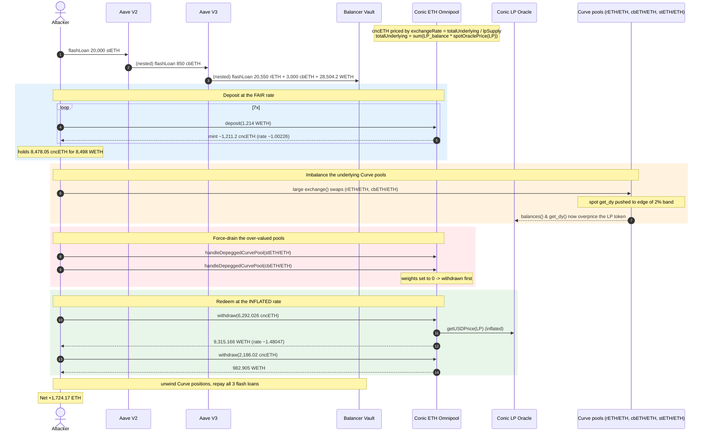
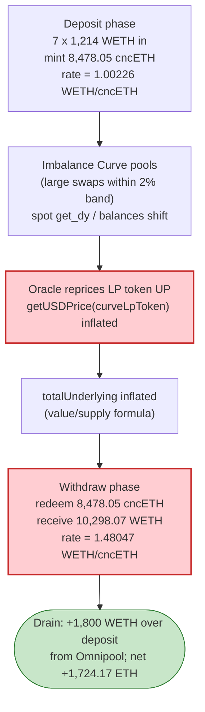
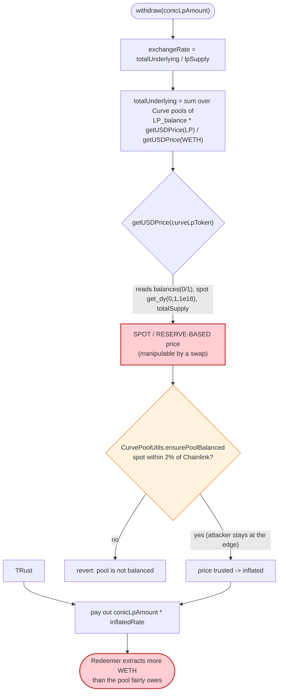

# Conic Finance (ETH Omnipool) — Curve LP Oracle Manipulation via Spot-Reserve Pricing

> **Reproduction:** the PoC compiles & runs in an isolated Foundry project at
> [this project folder](.) (the umbrella DeFiHackLabs repo contains many unrelated
> PoCs that do not whole-compile, so this one was extracted).
> Full verbose trace: [output.txt](output.txt).
> Verified vulnerable sources: [ConicEthPool.sol](sources/ConicEthPool_Bb787d/ConicEthPool.sol),
> [CurvePoolUtils.sol](sources/ConicEthPool_Bb787d/CurvePoolUtils.sol).

---

## Key info

| | |
|---|---|
| **Loss** | ~$3.26M — net **1,724.17 ETH** extracted by the attacker (≈ $1,886.87/ETH at the fork-block Chainlink price) |
| **Vulnerable contract** | `ConicEthPool` (ETH Omnipool) — [`0xBb787d6243a8D450659E09ea6fD82F1C859691e9`](https://etherscan.io/address/0xBb787d6243a8D450659E09ea6fD82F1C859691e9#code) |
| **Root-cause contract** | Conic Curve-LP price oracle `0x7b528B4Fd3E9f6b1701817C83f2CcB16496Ba03e` (behind GenericOracle proxy `0x286eF89cD2DA6728FD2cb3e1d1c5766Bcea344b0`) + `CurvePoolUtils.ensurePoolBalanced` |
| **Victim pools** | Curve `rETH/ETH` (`0x0f3159811670c117c372428D4E69AC32325e4D0F`), `cbETH/ETH` (`0x5FAE7E604FC3e24fd43A72867ceBaC94c65b404A`), `stETH/ETH` Lido (`0xDC24316b9AE028F1497c275EB9192a3Ea0f67022`), via the Conic Omnipool's allocated liquidity |
| **Attacker EOA** | `0x8d67db0b205e32a5dd96145f022fa18aae7dc8aa` |
| **Attacker contract** | `0x743599ba5cfa3ce8c59691af5ef279aaafa2e4eb` |
| **Attack tx** | `0x8b74995d1d61d3d7547575649136b8765acb22882960f0636941c44ec7bbe146` |
| **Chain / block / date** | Ethereum mainnet / fork at 17,740,954 / July 21, 2023 |
| **Compiler** | ConicEthPool: Solidity 0.8.17 (PoC harness built with 0.8.34) |
| **Bug class** | Manipulable spot-reserve LP-token oracle → inflated Omnipool exchange rate → over-redemption of LP shares |

> This is the **second** Conic Finance incident on July 21, 2023 (the ETH Omnipool drain). It is
> distinct from the same-day CNC/ETH read-only-reentrancy incident. The figures here are the ones
> mechanically reproduced by this PoC.

---

## TL;DR

Conic's ETH Omnipool mints/redeems its LP token (`cncETH`) at an **exchange rate derived from the
USD value of the Curve LP positions it holds**
([`ConicEthPool._exchangeRate`](sources/ConicEthPool_Bb787d/ConicEthPool.sol#L303-L308),
[`_getTotalAndPerPoolUnderlying`](sources/ConicEthPool_Bb787d/ConicEthPool.sol#L757-L781)). Those
Curve LP positions are priced by an oracle that reads the Curve pool's **instantaneous reserves and
spot `get_dy`** rather than a manipulation-resistant value, and the only safety check
([`CurvePoolUtils.ensurePoolBalanced`](sources/ConicEthPool_Bb787d/CurvePoolUtils.sol#L30-L58)) merely
requires the pool to be within a **2% imbalance band** of its Chainlink-implied price.

By flash-borrowing tens of thousands of ETH-denominated assets and pushing the `rETH/ETH` and
`cbETH/ETH` Curve pools to the **edge** of that 2% band, the attacker inflated the per-LP USD value the
Omnipool attributed to its own positions. This raised the Omnipool's `exchangeRate()` from a fair
**≈ 1.0023 WETH/cncETH** at deposit time to **≈ 1.4805 WETH/cncETH** at withdrawal time — a ~48%
inflation. The attacker:

1. **Flash-loans** stETH (Aave V2) → cbETH (Aave V3) → rETH + cbETH + WETH (Balancer), nesting the loans.
2. **Deposits** 7 × 1,214 WETH into the Omnipool at the *fair* rate, minting **8,478.05 cncETH**.
3. **Imbalances** the underlying Curve pools (large swaps in `rETH/ETH` and `cbETH/ETH`) so their
   spot price drifts to the edge of the 2% threshold and `get_dy(0,1,1e18)` swings — overpricing the LP.
4. Calls the **permissionless** [`handleDepeggedCurvePool`](sources/ConicEthPool_Bb787d/ConicEthPool.sol#L595-L608)
   on the imbalanced pools, forcing their weight to 0 so withdrawals drain *those* (now-overvalued) pools first.
5. **Withdraws** all 8,478.05 cncETH back at the *inflated* rate, pulling **10,298.07 WETH** out of the
   Omnipool — ~1,800 WETH more than it deposited — and unwinds the Curve positions for the rest.

Every flash loan is repaid in the same transaction. The attacker walks away with **1,724.17 ETH**.

---

## Background — what the Conic ETH Omnipool does

Conic Finance's "Omnipool" is a yield router: users deposit a single underlying (here WETH) and the
pool spreads that liquidity across several Curve pools (here `stETH/ETH`, `rETH/ETH`, `cbETH/ETH`),
staking the resulting Curve LP tokens in Convex. Depositors receive `cncETH`, an LP receipt token.

The receipt token's worth is **not** a 1:1 claim on WETH; it is a claim on the Omnipool's *total
underlying value*, computed by valuing each Curve LP position and summing:

- [`exchangeRate() = totalUnderlying / lpToken.totalSupply()`](sources/ConicEthPool_Bb787d/ConicEthPool.sol#L303-L313)
- [`totalUnderlying`](sources/ConicEthPool_Bb787d/ConicEthPool.sol#L757-L781) sums, for each Curve pool,
  `curveLpBalance × oracle.getUSDPrice(curveLpToken) / oracle.getUSDPrice(underlying)`.

Both `deposit` and `withdraw` use this same `exchangeRate`:

- [`depositFor`](sources/ConicEthPool_Bb787d/ConicEthPool.sol#L136-L197): `lpReceived = mintableUnderlying / exchangeRate`.
- [`withdraw`](sources/ConicEthPool_Bb787d/ConicEthPool.sol#L344-L381): `underlyingToReceive = conicLpAmount × exchangeRate`.

So if `getUSDPrice(curveLpToken)` can be transiently inflated, `totalUnderlying` inflates, the
exchange rate inflates, and **redeeming LP shares pays out more underlying than was deposited.**

The on-chain parameters at the fork block (block 17,740,954, July 21 2023):

| Parameter | Value |
|---|---|
| WETH/USD (Chainlink) | `188687365996 / 1e8` = **$1,886.87** |
| Omnipool deposit exchange rate | **≈ 1.002264 WETH/cncETH** (1,214 WETH → 1,211.26 cncETH) |
| Omnipool withdraw exchange rate (post-manipulation) | **≈ 1.480467 WETH/cncETH** (6,292.026 cncETH → 9,315.166 WETH) |
| `maxDeviation` | 0.02e18 (2%) |
| `depegThreshold` | 0.03e18 (3%) |
| `CurvePoolUtils._DEFAULT_IMBALANCE_THRESHOLD` | 0.02e18 (2%) |

---

## The vulnerable code

### 1. Mint/redeem priced off the Curve-LP USD valuation

```solidity
// sources/ConicEthPool_Bb787d/ConicEthPool.sol:303-308
function _exchangeRate(uint256 totalUnderlying_) internal view returns (uint256) {
    uint256 lpSupply = lpToken.totalSupply();
    if (lpSupply == 0 || totalUnderlying_ == 0) return ScaledMath.ONE;
    return totalUnderlying_.divDown(lpSupply);   // ← rate is purely value/supply
}
```

```solidity
// sources/ConicEthPool_Bb787d/ConicEthPool.sol:757-781
function _getTotalAndPerPoolUnderlying(uint256 underlyingPrice_) internal view returns (...) {
    for (uint256 i; i < curvePoolsLength_; i++) {
        address curvePool_ = _curvePools.at(i);
        uint256 poolUnderlying_ = _curveLpToUnderlying(
            controller.curveRegistryCache().lpToken(curvePool_),
            totalCurveLpBalance(curvePool_),
            underlyingPrice_                       // ← USD value of the LP position
        );
        perPoolUnderlying_[i] = poolUnderlying_;
        totalAllocated_ += poolUnderlying_;
    }
    totalUnderlying_ = totalAllocated_ + underlying.balanceOf(address(this));
}
```

`_curveLpToUnderlying` multiplies the LP balance by `getUSDPrice(curveLpToken_)`
([:793-803](sources/ConicEthPool_Bb787d/ConicEthPool.sol#L793-L803)). The trace shows the oracle pricing
each Curve LP token from the pool's **live reserves, spot `get_dy`, and `totalSupply`**:

```
getUSDPrice(rETH_ETHf)                       (output.txt — line ~1790)
  ├─ vyperContract1::balances(0) → 2,785.77        # rETH-side reserve
  ├─ vyperContract1::balances(1) → 2,691.37        # ETH-side reserve
  ├─ vyperContract1::get_dy(0, 1, 1e18) → 0.92773  # spot exchange rate (manipulable!)
  └─ rETH_ETHf::totalSupply()      → 2,735.22
```

This is a **spot/reserve-based LP valuation**. Anyone able to move the pool's reserves (a swap) moves
the price the oracle returns.

### 2. The only guard is a 2% imbalance band

```solidity
// sources/ConicEthPool_Bb787d/CurvePoolUtils.sol:30-58
function ensurePoolBalanced(PoolMeta memory poolMeta) internal view {
    ...
    uint256 toExpected = ...;                                   // Chainlink-implied amount out
    uint256 toActual = ICurvePoolV2(poolMeta.pool).get_dy(0, i, fromBalance); // spot amount out
    require(
        _isWithinThreshold(toExpected, toActual, poolMeta.thresholds[i]),
        "pool is not balanced"
    );
}

function _isWithinThreshold(uint256 a, uint256 b, uint256 imbalanceTreshold) internal pure returns (bool) {
    if (imbalanceTreshold == 0) imbalanceTreshold = _DEFAULT_IMBALANCE_THRESHOLD; // 2%
    if (a > b) return (a - b).divDown(a) <= imbalanceTreshold;
    return (b - a).divDown(b) <= imbalanceTreshold;
}
```

The pool is considered "balanced" — and therefore the spot LP price is trusted — as long as the spot
`get_dy` is within **2%** of the Chainlink price. **2% of a multi-thousand-ETH position is a large
absolute value**, and the attacker only needs to tilt the valuation, not break the check. The guard
caps *per-step* deviation but does not stop the attacker from operating *at the edge* of it across a
position large enough to move the Omnipool's exchange rate materially.

### 3. The permissionless de-peg handler that forces draining from the manipulated pool

```solidity
// sources/ConicEthPool_Bb787d/ConicEthPool.sol:595-608
function handleDepeggedCurvePool(address curvePool_) external override {  // ← no access control
    require(isRegisteredCurvePool(curvePool_), "pool is not registered");
    require(weights.get(curvePool_) != 0, "pool weight already 0");
    address lpToken_ = controller.curveRegistryCache().lpToken(curvePool_);
    require(_isDepegged(lpToken_), "pool is not depegged");   // ← compares cached vs current spot price
    _setWeightToZero(curvePool_);                             // ← forces this pool's weight to 0
    rebalancingRewardActive = true;
    emit HandledDepeggedCurvePool(curvePool_);
}
```

Setting a pool's weight to 0 makes [`_getWithdrawPool`](sources/ConicEthPool_Bb787d/ConicEthPool.sol#L409-L441)
treat it as the *first* pool to drain on withdrawal (the `weight_ == 0` branch returns it preferentially).
The attacker uses this to ensure that when they redeem, the Omnipool unwinds the **specific pools whose
valuation it has just inflated**, crystallising the over-redemption.

---

## Root cause — why it was possible

A Curve LP token's true, manipulation-resistant value is `get_virtual_price() × underlying_price` (the
virtual price is monotonic and cannot be moved by a single swap because it tracks invariant `D` per LP
unit). Conic's oracle instead priced the LP token from the **live reserves and spot `get_dy`**, and the
Omnipool then used that price in the very same `exchangeRate()` formula that governs both minting and
redemption.

Three design decisions compose into the critical bug:

1. **Spot-reserve LP valuation.** `getUSDPrice(curveLpToken)` is a function of `balances(0/1)` and
   `get_dy(0,1,1e18)` — all instantaneously swappable. An attacker who imbalances the pool changes the
   price the Omnipool attributes to its own holdings.
2. **The same rate mints and redeems.** Because `deposit` and `withdraw` both use
   `exchangeRate = totalUnderlying / lpSupply`, an attacker can mint at a fair rate, inflate
   `totalUnderlying`, then redeem at the inflated rate. The delta is paid out of honest LPs' assets.
3. **A weak (2%) and *relative* balance guard, plus a permissionless `handleDepeggedCurvePool`.** The
   2% imbalance band is a per-step deviation cap, not a value cap; on a large position the absolute
   inflation is significant. `handleDepeggedCurvePool` is open to anyone and lets the attacker steer the
   withdrawal to drain exactly the pools they over-valued.

In short: **the Omnipool's share price was derived from a manipulable spot oracle, and the same price
gated redemption.** This is the canonical "manipulable LP/AMM oracle → over-redemption" pattern.

---

## Preconditions

- The Omnipool holds Curve LP positions priced by the spot/reserve oracle (true at the fork block).
- Enough working capital to move the underlying Curve pools to the edge of the 2% band — supplied
  entirely by **flash loans** (Aave V2 stETH, Aave V3 cbETH, Balancer rETH+cbETH+WETH), all repaid in
  the same transaction, so the attack required **no upfront capital**.
- `handleDepeggedCurvePool` callable (permissionless) and `_isDepegged` returning true for the pools the
  attacker imbalanced (it compares the cached price to the current spot price against the 3% threshold).

---

## Attack walkthrough (with on-chain numbers from the trace)

All figures are taken directly from [output.txt](output.txt). The Omnipool LP token is `cncETH`; the
underlying is WETH.

| # | Step | Concrete on-chain values |
|---|------|--------------------------|
| 0 | **Stack three flash loans.** Aave V2 → 20,000 stETH; Aave V3 → 850 cbETH; Balancer → 20,550 rETH + 3,000 cbETH + 28,504.2 WETH | `LendingPool::flashLoan(...,[20000e18],...)` (L1674); `BalancerVault::flashLoan(...,[20550e18,3000e18,28504.2e18],...)` (L1709) |
| 1 | **Deposit ×7** — `ConicPool.deposit(1214 WETH, 0, false)` seven times, each minting cncETH at the *fair* rate | 7 × `cncETH::mint(attacker, ≈1,211.2)` → total **8,478.05 cncETH** for **8,498 WETH** (rate ≈ 1.00226) |
| 2 | **Imbalance the Curve pools** — large `exchange()` swaps on `rETH/ETH` (vyperContract1) and `cbETH/ETH` (vyperContract2), interleaved with deposits, to push spot `get_dy` to the edge of the 2% band | `get_dy(0,1,1e18)` on rETH/ETH ≈ 0.9277; manipulated swings drive the LP overvaluation |
| 3 | **De-peg the manipulated pools** — `handleDepeggedCurvePool(Lido stETH/ETH)` and `handleDepeggedCurvePool(cbETH/ETH)`, forcing their weights to 0 so withdrawals drain them first | `ConicPool::handleDepeggedCurvePool(Lido)` (L11401); `...(vyperContract2)` (L12049) |
| 4 | **Redeem the bulk** — `ConicPool.withdraw(6,292.026 cncETH, 0)` returns **9,315.166 WETH** (rate ≈ **1.48047**) | `ConicPool::withdraw(6292026e15,0)` (L12726) → `cncETH::burn(...,6,292.026)` (L13741) → `WETH::transfer(attacker, 9,315.166)` (L13747) |
| 5 | **Redeem the remainder** — `ConicPool.withdraw(2,186.02 cncETH, 0)` returns **982.905 WETH** | `ConicPool::withdraw(2186.02e18,0)` (L13927) → `cncETH::burn(...,2,186.02)` (L14972) → `WETH::transfer(attacker, 982.905)` (L14978) |
| 6 | **Unwind & repay** — convert remaining Curve LP / coins back to WETH, repay all three flash loans, unwrap WETH → ETH | Final `WETH::withdraw(1,701.46)` (L~last) → ETH |

**Exchange-rate inflation (the core of the theft):**

| | Rate (WETH per cncETH) |
|---|---|
| At deposit (fair) | 1,214 / 1,211.2576 = **1.002264** |
| At main withdraw (manipulated) | 9,315.166 / 6,292.026 = **1.480467** |
| **Inflation** | **+47.7%** |

The attacker minted 8,478.05 cncETH for 8,498 WETH, then redeemed all of it for
9,315.166 + 982.905 = **10,298.07 WETH** out of the Omnipool — a direct **+1,800 WETH** drained from the
pool's honest depositors via the inflated rate. The rest of the headline profit comes from the
Curve-pool arbitrage the same manipulation created.

### Profit accounting (ETH)

| | Amount (ETH) |
|---|---:|
| Attacker ETH balance before | 0 |
| Attacker ETH balance after | **1,724.17** (`val: 1724174518058922489718`) |
| **Net profit** | **+1,724.17 ETH** (≈ $3.25M @ $1,886.87/ETH) |

All flash loans (Aave V2 20,000 stETH, Aave V3 850 cbETH, Balancer 20,550 rETH + 3,000 cbETH +
28,504.2 WETH) are repaid in-transaction (`rETH/cbETH/WETH::transfer(BalancerVault, ...)` near the end),
confirming zero net capital was required.

---

## Diagrams

### Sequence of the attack



### Omnipool exchange-rate manipulation



### Where the trust breaks inside pricing



---

## Remediation

1. **Price Curve LP tokens with a manipulation-resistant value.** Use
   `get_virtual_price() × underlying_price` (the virtual price tracks the invariant `D` per LP unit and
   is not movable by a single swap), not `balances()`/`get_dy()` spot reads. This single change defeats
   the attack: imbalancing the pool no longer changes the per-LP value the Omnipool attributes to its
   holdings.
2. **Do not gate redemption on a same-block spot oracle.** Where a spot quantity must be used, sandwich
   it with a strict, *absolute* sanity check (TWAP or a tight, value-based bound), not a 2% *relative*
   deviation band that scales with position size.
3. **Restrict `handleDepeggedCurvePool` and `_isDepegged`.** Either require a trusted keeper / role, add
   a cooldown, or derive the de-peg decision from a manipulation-resistant price feed so an attacker
   cannot manufacture a "de-peg" with a swap and steer which pool is drained first.
4. **Separate mint and redeem accounting from a live AMM oracle.** Any vault whose share price equals
   `value / supply` must value `value` from a source that cannot be moved within the same transaction
   by the redeemer; otherwise mint-fair / redeem-inflated is always reachable.
5. **Cap per-transaction exchange-rate movement.** Reject a withdrawal if the implied `exchangeRate`
   has moved more than a small bound since the last cached value within the same block — a ~48% jump in
   one transaction is a clear red flag.

---

## How to reproduce

The PoC was extracted into a standalone Foundry project (the umbrella DeFiHackLabs repo has many
unrelated PoCs that fail `forge test`'s whole-project build):

```bash
_shared/run_poc.sh 2023-07-Conic_exp2 --mt testExploit -vvvvv
```

- RPC: an **Ethereum mainnet archive** endpoint is required (the fork pins block 17,740,954).
- Result: `[PASS] testExploit()` — attacker ETH balance goes from 0 to **1,724.17 ETH**.

Expected tail:

```
emit log_named_decimal_uint(key: "Attacker balance of ETH after exploit", val: 1724174518058922489718 [1.724e21], decimals: 18)

Suite result: ok. 1 passed; 0 failed; 0 skipped
Ran 1 test suite: 1 tests passed, 0 failed, 0 skipped (1 total tests)
```

---

*References: DeFiHackLabs PoC header (Total Lost ~$3M); BlockSec analysis —
https://twitter.com/BlockSecTeam/status/1682346827939717120 ; SlowMist Hacked — https://hacked.slowmist.io/ .*
