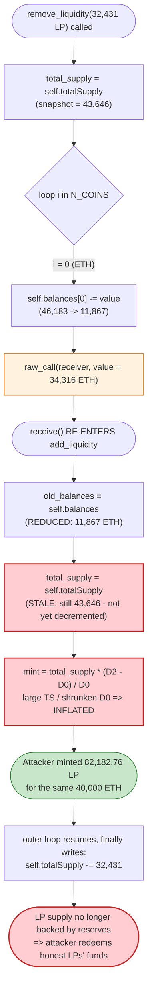
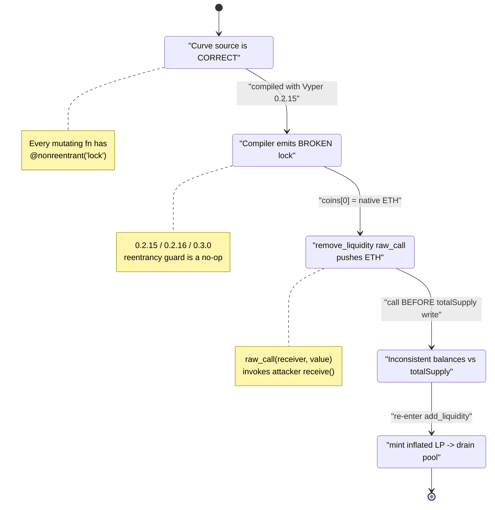

# Curve Finance pETH/ETH Pool — Vyper `@nonreentrant` Compiler Bug Read-Only/Cross-Function Reentrancy

> **Reproduction:** the PoC compiles & runs in an isolated Foundry project at
> [this project folder](.). Full verbose trace:
> [output.txt](output.txt).
> Verified vulnerable source (Vyper 0.2.15): [Vyper_contract.sol](sources/Vyper_contract_6326DE/Vyper_contract.sol).

---

## Key info

| | |
|---|---|
| **Loss (this pool / this PoC)** | **6,107.41 WETH** net profit drained from the pETH/ETH pool (~$11.4M of pool TVL at the time). Part of the ~$73M aggregate Curve incident of July 30, 2023; the PoC header's "$41M" is the broader event figure. |
| **Vulnerable contract** | Curve StableSwap pETH/ETH pool logic — [`0x6326DEbBAa15bCFE603d831e7D75f4fc10d9B43E`](https://etherscan.io/address/0x6326debbaa15bcfe603d831e7d75f4fc10d9b43e#code) (Vyper **0.2.15**) |
| **Victim pool / LP token** | pETH/ETH pool & LP — `0x9848482da3Ee3076165ce6497eDA906E66bB85C5` (minimal proxy → delegatecalls the logic above) |
| **Tokens** | `coins[0]` = native ETH, `coins[1]` = pETH (`0x836A808d4828586A69364065A1e064609F5078c7`) |
| **Attacker EOA** | [`0x6Ec21d1868743a44318c3C259a6d4953F9978538`](https://etherscan.io/address/0x6ec21d1868743a44318c3c259a6d4953f9978538) |
| **Attacker contract** | [`0x466b85b49eC0c5c1eb402d5Ea3c4b88864Ea0F04`](https://etherscan.io/address/0x466b85b49ec0c5c1eb402d5ea3c4b88864ea0f04) |
| **Attack tx** | [`0xa84aa065ce61dbb1eb50ab6ae67fc31a9da50dd2c74eefd561661bfce2f1620c`](https://etherscan.io/tx/0xa84aa065ce61dbb1eb50ab6ae67fc31a9da50dd2c74eefd561661bfce2f1620c) |
| **Chain / fork block / date** | Ethereum mainnet / 17,806,055 / **July 30, 2023** |
| **Compiler** | **Vyper 0.2.15**, optimizer enabled, 1 run |
| **Bug class** | Cross-function reentrancy — a **Vyper compiler bug** in the `@nonreentrant('lock')` re-entrancy guard (versions 0.2.15 / 0.2.16 / 0.3.0) |
| **Funding** | 80,000 WETH Balancer flash loan (0 fee) |

---

## TL;DR

The pETH/ETH pool is a Curve `StableSwap` written in **Vyper 0.2.15**. Every state-mutating
entry point — `add_liquidity`, `exchange`, `remove_liquidity`, … — carries a
`@nonreentrant('lock')` decorator that is *supposed* to make them mutually exclusive
([Vyper_contract.sol:373](sources/Vyper_contract_6326DE/Vyper_contract.sol#L373),
[:539](sources/Vyper_contract_6326DE/Vyper_contract.sol#L539),
[:614](sources/Vyper_contract_6326DE/Vyper_contract.sol#L614)).

In Vyper **0.2.15 / 0.2.16 / 0.3.0** the code the compiler emits for that decorator is **broken**:
the re-entrancy lock does not actually protect against re-entry across these functions. As a
result, when `remove_liquidity` sends native ETH to the receiver via
`raw_call(_receiver, b"", value=value)`
([:639](sources/Vyper_contract_6326DE/Vyper_contract.sol#L639)) — **after** it has already
debited `self.balances[0]` but **before** it has decremented `self.totalSupply`
([:653-655](sources/Vyper_contract_6326DE/Vyper_contract.sol#L653-L655)) — the attacker's
`receive()` callback can re-enter `add_liquidity`. That nested call sees a **half-updated pool**:
reduced `balances`, but a stale (still-large) `totalSupply`. It mints LP against that corrupted
ratio and walks away with far more LP than it deposited value for.

Concretely, using an 80,000 WETH flash loan, the attacker:

1. `add_liquidity(40,000 ETH)` → mints **32,431.42 LP**.
2. `remove_liquidity(32,431.42 LP)` → mid-loop, the pool `raw_call`s 34,316 ETH to the attacker.
   The attacker's `receive()` re-enters and `add_liquidity(40,000 ETH)` again, minting an
   **inflated 82,182.76 LP** (because `totalSupply` was still the pre-burn value while balances
   were already reduced).
3. The outer `remove_liquidity` finishes (burning the *original* 32,431 LP).
4. `remove_liquidity(10,272 LP)` of the inflated position, plus an `exchange(pETH→ETH)` to convert
   the leftover pETH, drain the pool down to ~73 ETH / ~5,033 pETH.
5. Repay the 80,000 WETH flash loan. **Net: +6,107.41 WETH.**

---

## Background — Curve StableSwap with native ETH

This pool is a standard 2-coin Curve factory `StableSwap`
([title](sources/Vyper_contract_6326DE/Vyper_contract.sol#L3)) where `coins[0]` is **native
ETH** (`0xEee…EEeE`) and `coins[1]` is **pETH** (JPEG'd's Pawnfi ETH). Because coin 0 is native
ETH, several functions must **push ETH** to the user using a low-level `raw_call`:

- `exchange` (when buying ETH): `raw_call(_receiver, b"", value=dy)` — [:606](sources/Vyper_contract_6326DE/Vyper_contract.sol#L606)
- `remove_liquidity` (coin 0 leg): `raw_call(_receiver, b"", value=value)` — [:639](sources/Vyper_contract_6326DE/Vyper_contract.sol#L639)
- `remove_liquidity_imbalance` / `remove_liquidity_one_coin`: same pattern — [:713](sources/Vyper_contract_6326DE/Vyper_contract.sol#L713), [:852](sources/Vyper_contract_6326DE/Vyper_contract.sol#L852)

A `raw_call` with a value transfer to an arbitrary `_receiver` invokes that address's
`receive()`/`fallback()` — i.e. it hands control to a potentially malicious contract **in the
middle of the pool's state update**. The only thing standing between that callback and a
re-entrancy attack is the `@nonreentrant('lock')` guard. Curve's code is, in principle, written
correctly for this: it relies on the compiler-provided lock to make all of these functions
mutually exclusive.

The on-chain pool state at the fork block (decoded from the trace storage slots — slot 8 =
`balances[0]` ETH, slot 9 = `balances[1]` pETH):

| Parameter | Value |
|---|---|
| `balances[0]` (ETH reserve) | **6,185.35 ETH** |
| `balances[1]` (pETH reserve) | **5,036.05 pETH** |
| `totalSupply` (LP) | ~43.6k after attacker's first deposit (≈11.2k before) |
| Pool price | ≈ 1 ETH ≈ 1 pETH (a "stable" peg pair) |

---

## The vulnerable code

### 1. The compiler bug — `@nonreentrant('lock')` does not lock

```vyper
# @version 0.2.15      # ← VULNERABLE compiler version
...
@payable
@external
@nonreentrant('lock')   # ← intended to block cross-function re-entry
def add_liquidity(...):
    ...

@external
@nonreentrant('lock')   # ← same lock key
def remove_liquidity(...):
    ...
```
[Vyper_contract.sol:1](sources/Vyper_contract_6326DE/Vyper_contract.sol#L1),
[:373](sources/Vyper_contract_6326DE/Vyper_contract.sol#L373),
[:614](sources/Vyper_contract_6326DE/Vyper_contract.sol#L614)

The source is *correct*. The **bug is in the Vyper compiler**: for versions **0.2.15, 0.2.16, and
0.3.0**, the bytecode generated for the named re-entrancy lock is faulty — the storage slot used
to hold the lock flag is not consistently set/cleared, so a function guarded by
`@nonreentrant('lock')` can in fact be re-entered from within another function guarded by the
**same** `'lock'` key. Effectively, the protection is silently a no-op.

### 2. The exploitable window inside `remove_liquidity`

```vyper
def remove_liquidity(_burn_amount, _min_amounts, _receiver = msg.sender) -> uint256[N_COINS]:
    total_supply: uint256 = self.totalSupply          # snapshot taken UP FRONT
    amounts: uint256[N_COINS] = empty(uint256[N_COINS])

    for i in range(N_COINS):
        old_balance: uint256 = self.balances[i]
        value: uint256 = old_balance * _burn_amount / total_supply
        assert value >= _min_amounts[i], "..."
        self.balances[i] = old_balance - value         # ⚠️ balance debited HERE
        amounts[i] = value

        if i == 0:
            raw_call(_receiver, b"", value=value)       # ⚠️⚠️ control handed to attacker HERE
        else:
            ... transfer pETH ...

    total_supply -= _burn_amount
    self.balanceOf[msg.sender] -= _burn_amount
    self.totalSupply = total_supply                     # ⚠️ totalSupply written ONLY at the end
    log Transfer(msg.sender, ZERO_ADDRESS, _burn_amount)
    log RemoveLiquidity(msg.sender, amounts, empty(uint256[N_COINS]), total_supply)
```
[Vyper_contract.sol:615-660](sources/Vyper_contract_6326DE/Vyper_contract.sol#L615-L660)

At the moment of the `raw_call` on line 639:
- `self.balances[0]` has **already been reduced** by the ETH being withdrawn (line 635), **and**
- `self.totalSupply` storage **still holds the old, pre-burn value** (it is only written on
  line 655, after the loop).

This is a classic "interactions before the final state write" ordering. Normally the re-entrancy
lock makes it harmless. With the broken 0.2.15 lock, it is wide open.

### 3. The function the attacker re-enters — `add_liquidity` reads the corrupted state

```vyper
def add_liquidity(_amounts, _min_mint_amount, _receiver = msg.sender) -> uint256:
    old_balances: uint256[N_COINS] = self.balances     # ← reads the REDUCED balances
    D0: uint256 = self.get_D_mem(rates, old_balances, amp)
    total_supply: uint256 = self.totalSupply           # ← reads the STALE (large) totalSupply
    ...
    D2: uint256 = self.get_D_mem(rates, new_balances, amp)
    mint_amount = total_supply * (D2 - D0) / D0        # ⚠️ inflated: large totalSupply / shrunken D0
    ...
    self.balanceOf[_receiver] += mint_amount
    self.totalSupply = total_supply + mint_amount
```
[Vyper_contract.sol:374-451](sources/Vyper_contract_6326DE/Vyper_contract.sol#L374-L451)

`mint_amount = total_supply * (D2 - D0) / D0` is the source of the theft. During normal operation
`total_supply` and the balances (and hence `D0`) are consistent. Re-entered mid-withdrawal,
`D0` is computed from the **already-shrunken** balances while `total_supply` is still the
**pre-shrink** figure — so the ratio `total_supply / D0` is too high, and the attacker is minted
LP at a price that no longer reflects the pool's real backing.

---

## Root cause

There are two layers, and the deeper one is not in this contract at all:

1. **Primary root cause — Vyper compiler bug (CVE-class).** Vyper **0.2.15 / 0.2.16 / 0.3.0** emit
   broken bytecode for `@nonreentrant(<key>)`. The reentrancy lock that the Curve developers
   *correctly* applied to every state-mutating function simply did not function. Any
   protocol that compiled with these versions and relied on the named lock to guard a function
   that performs an external call (like Curve's native-ETH `raw_call` pushes) was exposed.

2. **Contributing pattern — external call before the final invariant write.** `remove_liquidity`
   debits `self.balances` and then performs the ETH `raw_call` to the receiver **before** writing
   the new `self.totalSupply`. With a working lock this is safe; without it, it exposes a window in
   which `balances` and `totalSupply` are mutually inconsistent. `add_liquidity`'s
   `mint_amount = totalSupply * (D2 - D0) / D0` turns that inconsistency directly into free LP
   tokens. (Strict Checks-Effects-Interactions — writing *all* of `balances` **and** `totalSupply`
   before any external transfer — would have additionally hardened the contract against the
   compiler bug.)

The native-ETH design is what makes the bug reachable: an ERC-20-only pool would `transfer` tokens
(no automatic callback to the receiver for a plain ERC-20), whereas pushing **native ETH** via
`raw_call` unconditionally invokes the receiver's `receive()`/`fallback()`, handing the attacker
the re-entry foothold.

---

## Preconditions

- Pool compiled with the buggy Vyper (**0.2.15** here) — the meta confirms
  [`compiler: vyper:0.2.15`](sources/Vyper_contract_6326DE/_meta.json).
- One coin is **native ETH**, so withdrawal/exchange push ETH via `raw_call` and trigger the
  attacker's callback. (pETH/ETH satisfies this; `coins[0] == 0xEee…EEeE`,
  [initialize :133](sources/Vyper_contract_6326DE/Vyper_contract.sol#L133).)
- The attacker controls the `_receiver` so the ETH `raw_call` lands on its own contract — the
  default is `msg.sender`, which is the attacker contract itself.
- Capital to deposit/withdraw at scale. Fully **flash-loanable**: the PoC borrows 80,000 WETH from
  Balancer (0 fee) and repays it in the same transaction
  ([test/Curve_exp01.sol:51](test/Curve_exp01.sol#L51)).

---

## Step-by-step attack walkthrough (ground-truth numbers from the trace)

All reserve figures below are decoded directly from the `storage changes` and `AddLiquidity`/
`RemoveLiquidity`/`TokenExchange` events in [output.txt](output.txt) (slot 8 = ETH reserve,
slot 9 = pETH reserve).

| # | Action (caller) | Trace line | ETH reserve | pETH reserve | totalSupply-ish | Effect |
|---|-----------------|-----------:|------------:|-------------:|----------------:|--------|
| 0 | **Initial honest pool** | [:1609](output.txt) (pre) | 6,185.35 | 5,036.05 | ~11,215 | Real LP funds. |
| 1 | Flash-loan **80,000 WETH** from Balancer; `withdraw` → 80,000 ETH | [:1588](output.txt), [:1602](output.txt) | 6,185.35 | 5,036.05 | — | Attacker funded. |
| 2 | `add_liquidity(40,000 ETH, 0)` → mints **32,431.42 LP** | [:1609-1618](output.txt) | **46,183.14** | 5,034.59 | 43,646.82 | Honest deposit; attacker now holds 32,431 LP. |
| 3 | `remove_liquidity(32,431.42 LP)` begins; loop debits `balances[0]` and `raw_call`s **34,316.01 ETH** to attacker | [:1624](output.txt), [:1628](output.txt) | 46,183.14 → **(mid-update)** | — | **Re-entry window opens** (`totalSupply` not yet decremented). |
| 4 | ↳ **inside `receive()`**: `add_liquidity(40,000 ETH, 0)` re-enters → mints **82,182.76 LP** | [:1629-1639](output.txt) | 51,865.36 | 5,033.65 | 125,829.58 | LP minted against stale `totalSupply` / shrunken `D0` ⇒ **inflated**. |
| 5 | outer `remove_liquidity` resumes & finishes: burns the 32,431 LP, returns 34,316.01 ETH + 3,740.21 pETH | [:1653-1660](output.txt) | 11,867.13 | 1,293.44 | — | Original position closed; attacker keeps the inflated 82,182 LP. |
| 6 | `remove_liquidity(10,272 LP)` → returns **47,502.63 ETH** + 1,184.64 pETH | [:1662-1688](output.txt) | **4,362.74** | 108.80 | — | Drains most of the ETH side. |
| 7 | `WETH.deposit{value: 81,818.64}` (all ETH on hand) | [:1689](output.txt) | — | — | — | Wrap recovered ETH. |
| 8 | `exchange(1→0, 4,924.85 pETH)` → **4,288.77 ETH** out | [:1703-1728](output.txt) | 73.11 | 5,033.65 | — | Convert leftover pETH to ETH; pool ETH side emptied. |
| 9 | `WETH.deposit{value: 4,288.77}`; `WETH.transfer(Balancer, 80,000)` repay | [:1729](output.txt), [:1734](output.txt) | — | — | — | Flash loan repaid (0 fee). |
| 10 | **Final attacker WETH balance** | [:1748](output.txt) | — | — | — | **6,107.41 WETH** ⇒ profit. |

The crux is steps **3→4→5**: the inner `add_liquidity` (step 4) mints **82,182.76 LP** for a
40,000 ETH deposit, whereas the *first*, non-re-entrant `add_liquidity` (step 2) minted only
**32,431.42 LP** for the *same* 40,000 ETH. Same deposit, **2.5× the LP**, purely because the
second call observed a half-updated pool. That excess LP is what the attacker redeems in steps 5–8
to walk off with the honest liquidity providers' funds.

### Profit accounting (WETH)

| Direction | Amount (WETH) |
|---|---:|
| Borrowed (flash loan) | 80,000.00 |
| ETH wrapped after the two `remove_liquidity` calls | 81,818.64 |
| ETH wrapped after the `exchange` | 4,288.77 |
| **Total recovered** | **86,107.41** |
| Repaid to Balancer (0 fee) | 80,000.00 |
| **Net profit** | **+6,107.41** |

`86,107.41 − 80,000 = 6,107.41 WETH`, matching the final on-chain balance to the wei
(`6107408695702176366805`, [:1748](output.txt)).

---

## Diagrams

### Sequence of the attack

```mermaid
sequenceDiagram
    autonumber
    actor A as "Attacker contract"
    participant B as "Balancer Vault"
    participant P as "pETH/ETH Pool (Vyper 0.2.15)"

    A->>B: flashLoan(80,000 WETH)
    B-->>A: 80,000 WETH
    A->>A: WETH.withdraw -> 80,000 ETH

    rect rgb(227,242,253)
    Note over A,P: Step A - honest deposit
    A->>P: add_liquidity{value: 40,000 ETH}
    P-->>A: mint 32,431.42 LP
    Note over P: balances 46,183 ETH / 5,034 pETH
    end

    rect rgb(255,235,238)
    Note over A,P: Step B - remove_liquidity (lock SHOULD block re-entry, but 0.2.15 lock is broken)
    A->>P: remove_liquidity(32,431.42 LP)
    Note over P: balances[0] debited; totalSupply NOT yet written
    P->>A: "raw_call(value = 34,316 ETH)  -> receive()"
    end

    rect rgb(255,243,224)
    Note over A,P: Step C - RE-ENTRY inside receive()
    A->>P: add_liquidity{value: 40,000 ETH}
    Note over P: "sees REDUCED balances + STALE totalSupply"
    P-->>A: "mint 82,182.76 LP (inflated!)"
    end

    rect rgb(255,235,238)
    Note over A,P: Step D - outer remove_liquidity resumes
    P-->>A: returns 34,316 ETH + 3,740 pETH, burns 32,431 LP
    Note over P: balances 11,867 ETH / 1,293 pETH
    end

    rect rgb(232,245,233)
    Note over A,P: Step E - drain the inflated position
    A->>P: remove_liquidity(10,272 LP)
    P-->>A: 47,502 ETH + 1,184 pETH
    A->>P: "exchange(pETH -> ETH, 4,924 pETH)"
    P-->>A: 4,288 ETH
    Note over P: balances 73 ETH / 5,033 pETH (drained)
    end

    A->>B: repay 80,000 WETH (0 fee)
    Note over A: "Net profit +6,107.41 WETH"
```

### Why the re-entry mints free LP (state-inconsistency view)



### The two-layer root cause



---

## Remediation

1. **Upgrade the compiler.** This is the actual fix Curve and every affected protocol applied:
   recompile with a Vyper version where the `@nonreentrant` lock works (≥ 0.3.1, post-patch). The
   contract source did not need to change — the vulnerability lived entirely in the generated
   bytecode for the lock.
2. **Strict Checks-Effects-Interactions, even with a working lock.** Write **all** state — both
   `self.balances[i]` *and* `self.totalSupply` (and `self.balanceOf`) — **before** performing any
   external transfer/`raw_call`. In `remove_liquidity`, decrement and store `totalSupply` and the
   user's `balanceOf` *before* the loop that pushes ETH. This makes the half-updated window
   non-existent and defends in depth against a future lock regression.
3. **Treat native-ETH pushes as untrusted external calls.** Any `raw_call(_receiver, b"", value=…)`
   to a user-controlled address must be assumed to re-enter. Functions that perform them should not
   read or rely on any pool invariant (`balances`, `totalSupply`, `D`) being mutated again after the
   call. Prefer pull-payment / WETH over native ETH where feasible.
4. **Add an explicit application-level reentrancy guard** for value-pushing functions rather than
   relying solely on the compiler-provided named lock, so a single compiler bug cannot disarm the
   protection across the whole contract.
5. **Pin and audit compiler versions in CI.** Maintain an allow-list of known-good Vyper/Solidity
   compiler versions and fail the build on anything with an outstanding security advisory.

---

## How to reproduce

The PoC was extracted into a standalone Foundry project (the umbrella DeFiHackLabs repo has many
unrelated PoCs that fail to compile under a whole-project `forge test`):

```bash
_shared/run_poc.sh 2023-07-Curve_exp01 -vvvvv
```

- RPC: an **Ethereum mainnet archive** endpoint is required (fork block **17,806,055**, July 30, 2023).
  `foundry.toml` points `mainnet` at an Infura archive endpoint.
- Result: `[PASS] testExploit()` with `Attacker WETH balance after exploit: 6107.40…`.

Expected tail:

```
Ran 1 test for test/Curve_exp01.sol:ContractTest
[PASS] testExploit() (gas: 436793)
Logs:
  Attacker WETH balance after exploit: 6107.408695702176366805

Suite result: ok. 1 passed; 0 failed; 0 skipped; finished in 7.83s
Ran 1 test suite in 10.53s: 1 tests passed, 0 failed, 0 skipped (1 total tests)
```

---

*References: LlamaRisk post-mortem — https://hackmd.io/@LlamaRisk/BJzSKHNjn ·
Vyper disclosure — https://twitter.com/vyperlang/status/1685692973051498497 ·
SlowMist / DeFiHackLabs. Vyper `@nonreentrant` lock bug affected compiler versions 0.2.15, 0.2.16, 0.3.0.*
