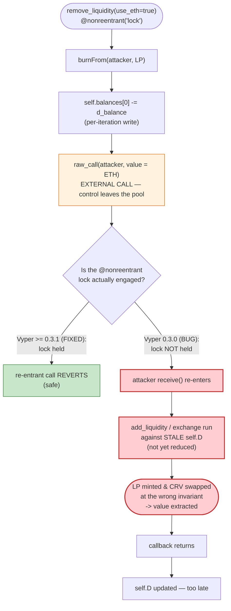
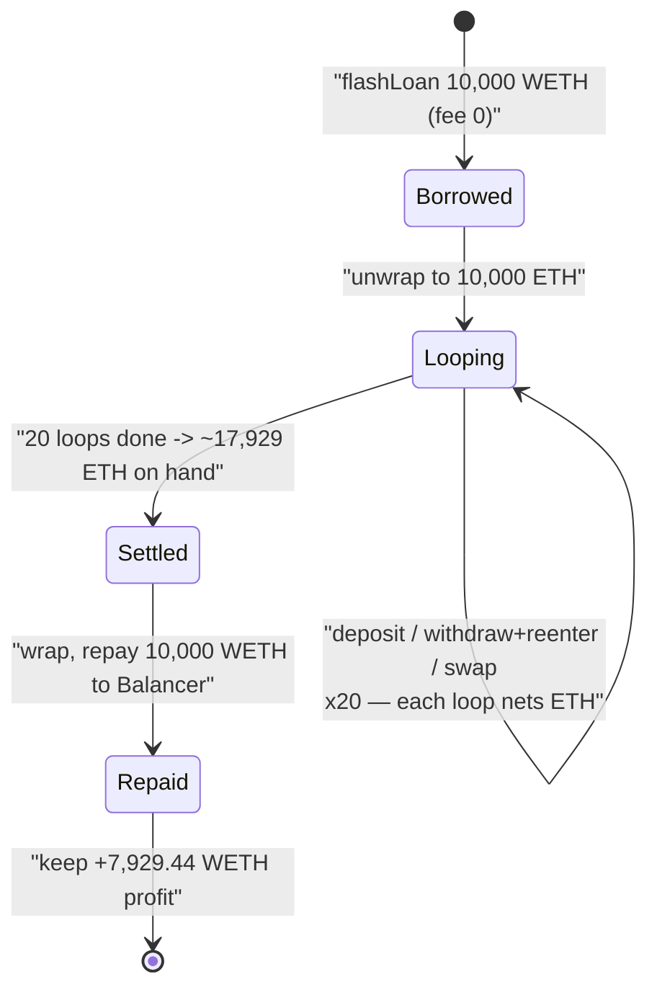

# Curve `crv/ETH` Pool Drain — Vyper 0.3.0 Broken `@nonreentrant` Lock (Read-Only/Cross-Function Reentrancy)

> **Reproduction:** the PoC compiles & runs in an isolated Foundry project at
> [this project folder](.) (the umbrella DeFiHackLabs repo
> contains many unrelated PoCs that do not compile together, so this one was extracted).
> Full verbose trace: [output.txt](output.txt).
> Verified vulnerable source (Etherscan-fetched Vyper): [Vyper_contract.sol](sources/Vyper_contract_8301AE/Vyper_contract.sol).

---

## Key info

| | |
|---|---|
| **Loss (this pool)** | ~**7,929.44 WETH** extracted in the reproduced single-transaction PoC. The wider July-30-2023 Vyper incident across all affected pools (`crv/ETH`, `alETH`, `msETH`, `pETH`, …) totalled **~$41M+** |
| **Vulnerable contract** | Curve `crv/ETH` crypto-pool (Vyper 0.3.0) — [`0x8301AE4fc9c624d1D396cbDAa1ed877821D7C511`](https://etherscan.io/address/0x8301AE4fc9c624d1D396cbDAa1ed877821D7C511#code) |
| **Victim asset / LP token** | CRV ([`0xD533a949…`](https://etherscan.io/address/0xD533a949740bb3306d119CC777fa900bA034cd52)) & ETH/WETH; pool LP token [`0xEd4064f3…`](https://etherscan.io/address/0xEd4064f376cB8d68F770FB1Ff088a3d0F3FF5c4d) |
| **Attacker EOA** | [`0xb752dEF3a1fDEd45d6C4B9F4A8F18E645b41b324`](https://etherscan.io/address/0xb752def3a1fded45d6c4b9f4a8f18e645b41b324) |
| **Attacker contract** | [`0x83e056ba00beAE4D8aA83deB326a90a4e100D0C1`](https://etherscan.io/address/0x83e056ba00beae4d8aa83deb326a90a4e100d0c1) |
| **Attack tx** | [`0x2e7dc8b2fb7e25fd00ed9565dcc0ad4546363171d5e00f196d48103983ae477c`](https://etherscan.io/tx/0x2e7dc8b2fb7e25fd00ed9565dcc0ad4546363171d5e00f196d48103983ae477c) |
| **Chain / fork block / date** | Ethereum mainnet / 17,807,829 / **July 30, 2023** |
| **Compiler** | **Vyper 0.3.0** (the vulnerable compiler), optimizer 1 run |
| **Bug class** | Compiler-level reentrancy-lock failure → cross-function reentrancy against AMM accounting (`remove_liquidity` ETH callback re-enters `add_liquidity`/`exchange` with stale reserves & `D`) |

---

## TL;DR

The Curve `crv/ETH` pool is a two-coin crypto-swap pool written in **Vyper 0.3.0**. Every
state-changing entry point (`exchange`, `add_liquidity`, `remove_liquidity`,
`remove_liquidity_one_coin`) carries the **`@nonreentrant('lock')`** decorator
([Vyper_contract.sol:792](sources/Vyper_contract_8301AE/Vyper_contract.sol#L792),
[:860](sources/Vyper_contract_8301AE/Vyper_contract.sol#L860),
[:961](sources/Vyper_contract_8301AE/Vyper_contract.sol#L961),
[:1068](sources/Vyper_contract_8301AE/Vyper_contract.sol#L1068)) and is therefore *supposed* to be
mutually re-entrancy-locked.

**But Vyper 0.2.15 – 0.3.0 mis-compiled the `@nonreentrant` decorator** (a duplicated/incorrect
re-entrancy-guard codegen that, in practice, did not hold the lock across the call). As a result the
lock did **not** actually prevent re-entry. The pool's `remove_liquidity`
([:962-988](sources/Vyper_contract_8301AE/Vyper_contract.sol#L962-L988)) sends native ETH to the
caller via a low-level `raw_call` **before it finishes writing back `self.balances` and `self.D`** —
so an attacker contract's `receive()` is invoked while the pool's internal accounting is **stale and
inconsistent** with its real token balances.

In that re-entrant window the attacker calls `add_liquidity` and `exchange`, which price LP mints and
swaps against the **wrong (pre-removal) invariant**. Each cycle mints/extracts slightly more value
than the attacker put in. The attacker wraps this in a **10,000 WETH Balancer flash loan** (0 fee),
loops the cycle **20 times**, repays the loan, and walks away with **7,929.44 WETH** of pool
liquidity — at zero capital cost.

---

## Background — the Curve crypto-pool (`crv/ETH`)

The contract is a Curve "crypto-swap" (Curve V2 cryptopool) for two assets — **ETH (coin index 0)**
and **CRV (coin index 1)** ([:96-98](sources/Vyper_contract_8301AE/Vyper_contract.sol#L96-L98)). It
maintains:

- `self.balances[2]` — cached coin balances ([:130](sources/Vyper_contract_8301AE/Vyper_contract.sol#L130)).
- `self.D` — the StableSwap/cryptoswap invariant ([:131](sources/Vyper_contract_8301AE/Vyper_contract.sol#L131)).
- `price_scale` / `price_oracle` / `virtual_price` / `xcp_profit` — the V2 internal price-tracking
  machinery updated in `tweak_price` ([:591-695](sources/Vyper_contract_8301AE/Vyper_contract.sol#L591-L695)).

LP shares are an external token (`CurveToken`, `0xEd4064f3…`) that the pool `mint`s and `burnFrom`s.

Pool state at the fork block (read from the first storage transitions in
[output.txt](output.txt), slots 29/30/31):

| Parameter | Value |
|---|---:|
| `balances[0]` (ETH) | ≈ **11,212.87 ETH** |
| `balances[1]` (CRV) | ≈ **29,570,169 CRV** |
| `D` (invariant) | ≈ 22,209.93 (1e18-scaled) |
| LP `totalSupply` | ≈ **550,348.19** LP |

The pool is a genuine, deep-liquidity pool; nothing about the *parameters* is wrong. The bug is
purely that the **reentrancy lock that the code asks for is silently absent at the bytecode level.**

---

## The vulnerable code

### 1. `remove_liquidity` sends ETH out *before* finalizing accounting

```vyper
@external
@nonreentrant('lock')                       # ← lock REQUESTED, but mis-compiled in Vyper 0.3.0
def remove_liquidity(_amount: uint256, min_amounts: uint256[N_COINS], use_eth: bool = False):
    """
    This withdrawal method is very safe, does no complex math
    """
    _coins: address[N_COINS] = coins
    total_supply: uint256 = CurveToken(token).totalSupply()
    CurveToken(token).burnFrom(msg.sender, _amount)
    balances: uint256[N_COINS] = self.balances
    amount: uint256 = _amount - 1

    for i in range(N_COINS):
        d_balance: uint256 = balances[i] * amount / total_supply
        assert d_balance >= min_amounts[i]
        self.balances[i] = balances[i] - d_balance          # (a) per-iteration balance write
        balances[i] = d_balance
        if use_eth and i == ETH_INDEX:
            raw_call(msg.sender, b"", value=d_balance)       # ⚠️ (b) EXTERNAL CALL to attacker, mid-loop
        else:
            if i == ETH_INDEX:
                WETH(_coins[i]).deposit(value=d_balance)
            assert ERC20(_coins[i]).transfer(msg.sender, d_balance)

    D: uint256 = self.D
    self.D = D - D * amount / total_supply                   # ⚠️ (c) D updated only AFTER the loop / after callback
    ...
```

[Vyper_contract.sol:960-988](sources/Vyper_contract_8301AE/Vyper_contract.sol#L960-L988)

The native-ETH branch `raw_call(msg.sender, b"", value=d_balance)` (line 978) hands control to the
attacker **inside the withdrawal loop**, while:

- `self.D` has **not yet** been reduced (line 985 runs *after* the loop), and
- on the ETH-first iteration (`i == 0`), the CRV side of `self.balances` has **not yet** been
  decremented.

So the pool's `D` and `balances` are inconsistent with the ETH that just physically left the pool.

### 2. The re-entered functions price against that stale state

`add_liquidity` mints LP from `token_supply * D / old_D - token_supply`
([:912-922](sources/Vyper_contract_8301AE/Vyper_contract.sol#L912-L922)) and `exchange`/`_exchange`
solves `newton_y` against `self.D` ([:748](sources/Vyper_contract_8301AE/Vyper_contract.sol#L748)).
Both read the **stale `self.D`** while the real reserves have already shrunk by the withdrawn ETH.
Re-entering them therefore lets the attacker mint LP / pull CRV at a price that does not reflect the
withdrawal in flight.

### 3. The protection that was *supposed* to stop this

Every relevant entry point is decorated `@nonreentrant('lock')`:

| Function | Line |
|---|---|
| `exchange` | [:792-793](sources/Vyper_contract_8301AE/Vyper_contract.sol#L792-L793) |
| `add_liquidity` | [:860-861](sources/Vyper_contract_8301AE/Vyper_contract.sol#L860-L861) |
| `remove_liquidity` | [:961-962](sources/Vyper_contract_8301AE/Vyper_contract.sol#L961-L962) |
| `remove_liquidity_one_coin` | [:1068-1069](sources/Vyper_contract_8301AE/Vyper_contract.sol#L1068-L1069) |

They all share the same lock key `'lock'`, so re-entering *any* of them from within *any* other should
revert. The source is correct. **The compiler is not** — Vyper 0.3.0 emitted a reentrancy guard that
did not actually hold across the external call, so all of these calls re-enter successfully. The
trace proves it: `add_liquidity` and `exchange` execute **inside** the `remove_liquidity` →
`receive()` callback without reverting.

---

## Root cause

> **A compiler defect (Vyper 0.2.15–0.3.0) made the `@nonreentrant` decorator a no-op, turning a
> textbook checks-effects-interactions ordering bug in `remove_liquidity` into an exploitable
> cross-function reentrancy.**

Two things had to be simultaneously true, and both were:

1. **Interaction-before-effect in `remove_liquidity`.** The pool transfers native ETH to the caller
   via `raw_call` (line 978) *before* it finishes writing `self.D` (line 985) and, on the ETH
   iteration, before the other coin's balance is decremented. This is the classic CEI violation. On
   its own it is harmless **only because** the function (and every other state-changing function) is
   declared `@nonreentrant`.

2. **The `@nonreentrant('lock')` guard did not actually lock.** The Vyper 0.3.0 codegen for the
   re-entrancy guard was buggy; the lock was not effectively engaged for the duration of the external
   call. So the attacker's `receive()` was free to call back into `add_liquidity` and `exchange` on
   the *same* pool while its invariant `D` and `balances` were stale.

The combination means the attacker can repeatedly: deposit → start a withdrawal → in the withdrawal's
ETH callback, deposit again and swap against the not-yet-updated invariant → finish the withdrawal.
Each loop extracts a sliver of LP value that should have been impossible to remove. Because a Balancer
flash loan supplies the working capital at **0 fee**, the attack is fully capital-free and atomic.

---

## Preconditions

- **Vulnerable compiler.** The pool must be compiled with Vyper 0.2.15–0.3.0 where `@nonreentrant`
  is broken (this pool is `vyper:0.3.0`, see [_meta.json](sources/Vyper_contract_8301AE/_meta.json)).
- **A native-ETH withdrawal path that calls the caller before settling state.** `remove_liquidity(...,
  use_eth=True)` does exactly this with `raw_call` (line 978).
- **The attacker is a contract** (so its `receive()` can re-enter). Here the attacker contract holds an
  LP position it just minted, withdraws it with `use_eth=True`, and re-enters from `receive()`.
- **Working capital** to make each cycle large enough to be profitable. Supplied by a **10,000 WETH
  Balancer flash loan** ([Curve_exp02.sol:63-65](test/Curve_exp02.sol#L63-L65)); Balancer charged
  **0 fee** (`feeAmount: 0` in the trace), so repayment is exactly 10,000 WETH.

---

## Attack walkthrough (with on-chain numbers from the trace)

The PoC ([test/Curve_exp02.sol](test/Curve_exp02.sol)) borrows 10,000 WETH from Balancer, unwraps it
to ETH, then runs the following cycle **20 times** ([Curve_exp02.sol:80-95](test/Curve_exp02.sol#L80-L95)):

| # | Step | Call | What the trace shows (iteration 1) |
|---|------|------|------------------------------------|
| 0 | **Flash loan** | `Balancer.flashLoan(10,000 WETH)` → `receiveFlashLoan` | `feeAmount: 0`; unwrap all WETH → 10,000 ETH ([:1606-1614](output.txt)) |
| 1 | **Deposit** | `add_liquidity{value:400 ETH}([400,0], 0, true)` | pool mints **9,804.78 LP** to attacker ([:1620](output.txt)) |
| 2 | **Withdraw (reentry trigger)** | `remove_liquidity(9,804.78 LP, [0,0], true)` | burns LP; sends **203.27 ETH** (coin0) to attacker via `raw_call` → attacker `receive()` fires **before `self.D` is updated** ([:1645-1651](output.txt)) |
| 2a | **↳ Re-enter: deposit** | inside `receive()`: `add_liquidity{value:400 ETH}([400,0],0,true)` | mints **4,674.14 LP** — *priced against the stale, pre-withdrawal `D`* ([:1652-1689](output.txt)) |
| 2b | **↳ Re-enter: swap** | inside `receive()`: `exchange{value:500 ETH}(0,1,500,0,true)` | pulls **1,212,778 CRV** out of the pool for 500 ETH ([:1690-1714](output.txt)) |
| 2c | **↳ Withdraw resumes** | `remove_liquidity` finishes: sends coin1 | attacker also receives **517,589 CRV** as the second-coin payout, then `self.D` is finally written ([:1715-1729](output.txt)) |
| 3 | **Withdraw the re-minted LP** | `remove_liquidity_one_coin(4,674.14 LP, 0, 0, true)` | converts the LP minted at step 2a back to ETH (897.01 ETH) ([:1717](output.txt)) |
| 4 | **Dump CRV back for ETH** | `exchange(1, 0, CRV.balanceOf(this), 0, true)` | sells **1,730,367 CRV → ETH** (iter 1) ([:1730-1732](output.txt)) |
| … | **Repeat ×20** | each loop nets more ETH; CRV sold per loop grows 1.73M → 6.74M+ → 14.39M | see `exchange(1,0,…)` series ([:1732, :1870, :2008, …, :4283](output.txt)) |
| 5 | **Repay** | wrap all ETH → WETH, `WETH.transfer(Balancer, 10,000)` | deposit **17,929.44 ETH**, repay 10,000 WETH ([:4307-4316](output.txt)) |

**Why each re-entrant deposit is cheaper in LP terms but profitable overall:** in step 2 the pool has
already paid out 203.27 ETH but has **not** reduced `self.D`. When the re-entrant `add_liquidity`
(2a) computes `d_token = token_supply * D / old_D - token_supply`, it uses an `old_D` that still
reflects the larger pool, so the math is run against an invariant that does not match the now-smaller
real reserves. Likewise the re-entrant `exchange` (2b) solves `newton_y` against the stale `self.D`
and hands out far more CRV (1,212,778 CRV for 500 ETH) than a consistent pool would. The attacker then
unwinds these mispriced positions in steps 3–4, banking the difference each loop.

---

## Profit / loss accounting (WETH)

All figures from the tail of [output.txt](output.txt):

| Item | Amount |
|---|---:|
| Borrowed from Balancer | 10,000.00 WETH |
| Balancer flash-loan fee | 0.00 WETH |
| ETH on hand at end of loops (wrapped to WETH) | 17,929.44 WETH |
| Repaid to Balancer | 10,000.00 WETH |
| **Attacker WETH balance after exploit** | **7,929.44 WETH** |
| **Net profit** | **+7,929.44 WETH** |

The PoC's final assertion logs `"Attacker WETH balance after exploit" = 7929437137321151670373`
(7,929.44 WETH), and the suite reports `1 passed`. This is the value drained from **this single
pool** in the reproduced transaction; the real-world incident hit several Vyper-0.3.0 pools for a
combined **$41M+**.

---

## Diagrams

### Sequence of one exploit cycle (the reentrancy window)

```mermaid
sequenceDiagram
    autonumber
    actor A as "Attacker contract"
    participant B as "Balancer Vault"
    participant P as "Curve crv/ETH pool"
    participant L as "LP token"

    A->>B: flashLoan(10,000 WETH, fee=0)
    B-->>A: receiveFlashLoan()
    Note over A: unwrap WETH -> 10,000 ETH

    rect rgb(227,242,253)
    Note over A,P: Step 1 - deposit
    A->>P: add_liquidity{400 ETH}([400,0], use_eth=true)
    P->>L: mint(attacker, 9,804.78 LP)
    end

    rect rgb(255,235,238)
    Note over A,P: Step 2 - withdraw triggers reentry
    A->>P: remove_liquidity(9,804.78 LP, use_eth=true)
    P->>L: burnFrom(attacker, 9,804.78 LP)
    Note over P: self.balances[0] reduced,<br/>but self.D NOT yet updated
    P-->>A: raw_call value=203.27 ETH  (receive() fires)

        rect rgb(255,243,224)
        Note over A,P: @nonreentrant('lock') is MIS-COMPILED -> no revert
        A->>P: add_liquidity{400 ETH} (stale D)
        P->>L: mint(attacker, 4,674.14 LP)
        A->>P: exchange{500 ETH}(0->1) (stale D)
        P-->>A: 1,212,778 CRV
        end

    Note over P: callback returns; remove_liquidity resumes
    P-->>A: 517,589 CRV (second-coin payout)
    Note over P: self.D finally written (too late)
    end

    rect rgb(232,245,233)
    Note over A,P: Steps 3-4 - unwind the mispriced positions
    A->>P: remove_liquidity_one_coin(4,674.14 LP -> 897 ETH)
    A->>P: exchange(1->0, all CRV -> ETH)
    P-->>A: ETH
    end

    Note over A: repeat x20, then repay 10,000 WETH, keep +7,929.44 WETH
```

### Why the lock failure makes the CEI bug exploitable



### Capital flow across the 20-loop attack



---

## Remediation

1. **Upgrade the compiler — this is the real fix.** Vyper patched the broken `@nonreentrant`
   codegen in 0.3.1+. Any contract relying on `@nonreentrant` for safety must be (re)compiled with a
   non-vulnerable Vyper version. This single change makes every existing lock in the source actually
   engage and blocks the cross-function reentry outright.
2. **Apply checks-effects-interactions regardless of the lock.** In `remove_liquidity`, finalize all
   state writes (`self.balances` for *all* coins and `self.D`) **before** any external transfer.
   Never `raw_call` the recipient mid-loop while accounting is half-updated. Defense-in-depth must not
   depend on a single compiler-emitted guard.
3. **Prefer pull-over-push / WETH for the ETH leg.** Sending native ETH via `raw_call` to an arbitrary
   recipient is the reentry vector. Settle in WETH (no arbitrary callback) or use a withdraw-then-claim
   pattern so the value transfer cannot re-enter privileged math.
4. **Add an explicit, language-independent reentrancy guard** (a storage flag set/cleared in the
   function body) rather than relying solely on a decorator, so a future compiler regression cannot
   silently disable the protection.
5. **Treat any read of `self.D` / `self.balances` during an external call as untrusted.** Functions
   that price against the cached invariant should not be reachable while another function is mid-update
   — enforce this with a shared lock that is verified at deploy time (e.g., a runtime self-test).

---

## How to reproduce

The PoC was extracted into a standalone Foundry project (the umbrella DeFiHackLabs repo has many
unrelated PoCs that fail to compile together under one `forge build`):

```bash
_shared/run_poc.sh 2023-07-Curve_exp02 --mt testExploit -vvvvv
```

- **RPC:** an Ethereum **mainnet archive** endpoint is required (`vm.createSelectFork("mainnet",
  17807829)` in [Curve_exp02.sol:49](test/Curve_exp02.sol#L49)); the `mainnet` alias must point at an
  archive node that serves state at block 17,807,829.
- **Result:** `[PASS] testExploit()` with the attacker holding **7,929.44 WETH** after repaying the
  flash loan.

Expected tail:

```
    ├─ emit log_named_decimal_uint(key: "Attacker WETH balance after exploit", val: 7929437137321151670373 [7.929e21], decimals: 18)
    └─ ← [Stop]

Suite result: ok. 1 passed; 0 failed; 0 skipped; finished in 10.68s
Ran 1 test suite: 1 tests passed, 0 failed, 0 skipped (1 total tests)
```

---

*References: Curve/Vyper post-mortem — https://hackmd.io/@LlamaRisk/BJzSKHNjn ;
Vyper disclosure — https://twitter.com/vyperlang/status/1685692973051498497 .*
