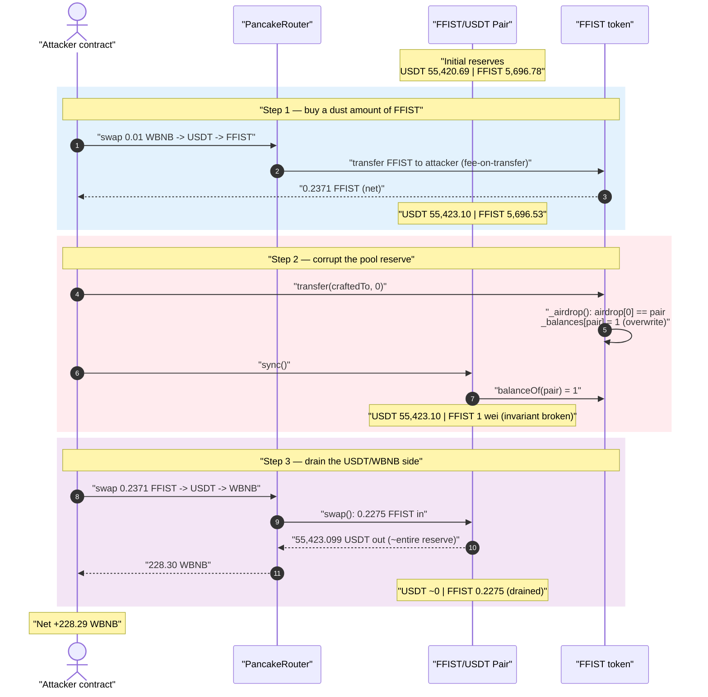
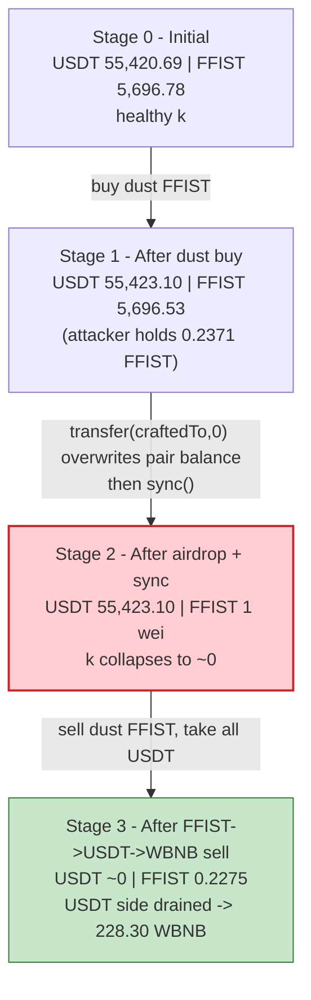
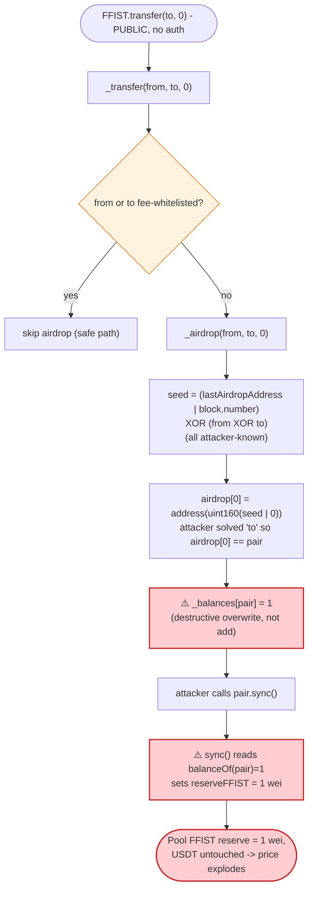
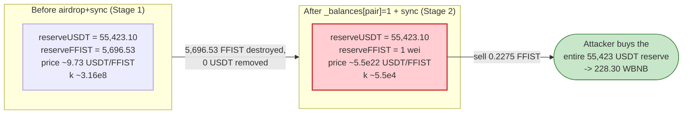

# FFIST (FIRE FIST) Exploit — Attacker-Controlled `_airdrop()` Overwrites the AMM Pool's Token Balance to 1 wei

> **Vulnerability classes:** vuln/logic/state-update · vuln/oracle/spot-price · vuln/defi/slippage

> **Reproduction:** the PoC compiles & runs in an isolated Foundry project at
> [this project folder](.) (the umbrella DeFiHackLabs repo contains several unrelated PoCs
> that do not whole-compile, so this one was extracted).
> Full verbose trace: [output.txt](output.txt).
> Verified vulnerable source: [GoldCoin.sol](sources/GoldCoin_80121d/GoldCoin.sol).

---

## Key info

| | |
|---|---|
| **Loss** | ~$110K — **228.30 WBNB** drained from the FFIST/USDT PancakeSwap pool (≈$110K at the time) |
| **Vulnerable contract** | `GoldCoin` / `FFIST` — [`0x80121DA952A74c06adc1d7f85A237089b57AF347`](https://bscscan.com/address/0x80121da952a74c06adc1d7f85a237089b57af347#code) |
| **Victim pool** | FFIST/USDT PancakePair — [`0x7a3Adf2F6B239E64dAB1738c695Cf48155b6e152`](https://bscscan.com/address/0x7a3Adf2F6B239E64dAB1738c695Cf48155b6e152) (`token0 = USDT`, `token1 = FFIST`) |
| **Attacker EOA** | [`0xcc8617331849962c27f91859578dc91922f6f050`](https://bscscan.com/address/0xcc8617331849962c27f91859578dc91922f6f050) |
| **Attacker contract** | [`0xb31c7b7bdf69554345e47a4393f53c332255c9fb`](https://bscscan.com/address/0xb31c7b7bdf69554345e47a4393f53c332255c9fb) |
| **Attack tx** | [`0x199c4b88cab6b4b495b9d91af98e746811dd8f82f43117c48205e6332db9f0e0`](https://bscscan.com/tx/0x199c4b88cab6b4b495b9d91af98e746811dd8f82f43117c48205e6332db9f0e0) |
| **Chain / block / date** | BSC / fork `30,113,117` / ~July 19, 2023 |
| **Compiler** | Solidity v0.8.17, optimizer **200 runs** |
| **Bug class** | Attacker-controllable balance write (insecure pseudo-random "airdrop") used to zero out an AMM pool reserve → broken `x·y = k` invariant |

---

## TL;DR

`FFIST` is a fee-on-transfer token with a gimmick "airdrop" feature: on every non-whitelisted
transfer, `_airdrop()` derives **4 pseudo-random addresses** from a `seed` and **hard-writes
`_balances[airdropAddress] = 1`** for each one
([GoldCoin.sol:350-365](sources/GoldCoin_80121d/GoldCoin.sol#L350-L365)). This is a *direct
balance overwrite*, not an additive mint, and the `seed` is fully derived from caller-supplied
inputs (`from`, `to`, `tAmount`, `block.number`, and a public `lastAirdropAddress`).

Because `to` and `tAmount` are attacker-chosen, the attacker can **solve for a recipient address
that forces the first derived airdrop address to equal the PancakeSwap pair**. When the transfer
runs, `_balances[pair]` is overwritten to **1 wei**. A subsequent `pair.sync()` reads that
manipulated balance and accepts **`reserveFFIST = 1`** as the pool's new reserve — while the
USDT side is left fully intact at ~55,423 USDT. The constant-product invariant is annihilated.

The attacker then:

1. **Buys a tiny amount of FFIST** for itself (0.01 WBNB → USDT → FFIST), ending with
   `0.2371 FFIST`.
2. **Crafts the malicious `to`** and calls `FFIST.transfer(to, 0)` — this triggers `_airdrop`,
   which overwrites the pair's FFIST balance from `5,696.5` → **1 wei**; then calls
   `pair.sync()` to commit the fake reserve.
3. **Sells its 0.2371 FFIST** back through the now-degenerate pool. With `reserveFFIST = 1 wei`,
   even a fraction of a token buys essentially the **entire 55,423 USDT** reserve, which then
   routes to **228.30 WBNB**.

Net profit ≈ **228.29 WBNB** for a 0.01-WBNB outlay — the entire honest USDT/WBNB-equivalent
liquidity of the pool, callable by anyone.

---

## Background — what FFIST does

`GoldCoin` (deployed as symbol `FFIST`, "FIRE FIST"), [source](sources/GoldCoin_80121d/GoldCoin.sol),
is a typical BSC "tax/reflection" token built on top of a PancakeSwap V2 USDT pair. It bolts several
features onto a standard ERC20:

- **Fee-on-transfer**: buys pay `_fundFee + _lpDividendFee` (1% + 3% = 4%); sells pay a
  time-decaying fee read from `_feeConfigs` (`getSellFee`,
  [:456-471](sources/GoldCoin_80121d/GoldCoin.sol#L456-L471)).
- **LP dividend distribution**: USDT collected from sells is periodically distributed to LP holders
  (`processLP`, [:592-647](sources/GoldCoin_80121d/GoldCoin.sol#L592-L647)).
- **An "airdrop" gimmick**: on every taxed transfer the token sprays 1-wei "airdrops" to four
  deterministically-derived junk addresses, presumably to inflate the holder count / on-chain
  activity (`_airdrop`, [:350-365](sources/GoldCoin_80121d/GoldCoin.sol#L350-L365)).

The on-chain facts at the fork block, read from the trace:

| Parameter | Value |
|---|---|
| `decimals` | 18 |
| Pair `token0` / `token1` | `USDT` / `FFIST` |
| Victim pair USDT reserve (`reserve0`) | **55,420.69 USDT** ([output.txt L93](output.txt)) |
| Victim pair FFIST reserve (`reserve1`) | 5,696.78 FFIST ([output.txt L93](output.txt)) |
| `lastAirdropAddress` (before manipulation) | `0x0370e8e41DB22a02e07b5A224F7D7e5D31EEffcf` ([output.txt L141](output.txt)) |
| Attack contract / `from` | `0x7FA9385bE102ac3EAc297483Dd6233D62b3e1496` (PoC test contract) |
| `block.number` | 30,113,117 |

The whole game is that the pool holds **~55,423 USDT** that is convertible to **228 WBNB**, and the
attacker can set the *other* side of the pool (FFIST) to 1 wei for free.

---

## The vulnerable code

### 1. `_airdrop()` — a caller-controllable, balance-*overwriting* write

```solidity
address public lastAirdropAddress;

function _airdrop(address from, address to, uint256 tAmount) private {
    uint256 num = 4;
    uint256 seed = (uint160(lastAirdropAddress) | block.number) ^ (uint160(from) ^ uint160(to));
    uint256 airdropAmount = 1;
    address airdropAddress;
    for (uint256 i; i < num;) {
        airdropAddress = address(uint160(seed | tAmount));   // ⚠️ attacker-controlled target
        _balances[airdropAddress] = airdropAmount;           // ⚠️ HARD-SET to 1 (overwrite, not add)
        emit Transfer(airdropAddress, airdropAddress, airdropAmount);
    unchecked{
        ++i;
        seed = seed >> 1;
    }
    }
    lastAirdropAddress = airdropAddress;
}
```
[GoldCoin.sol:348-365](sources/GoldCoin_80121d/GoldCoin.sol#L348-L365)

Two fatal properties:

- **The write is destructive.** `_balances[airdropAddress] = airdropAmount` *replaces* the target's
  balance with `1`, rather than adding to it. So if the target already held tokens, they are
  **deleted**.
- **The target is fully attacker-controlled.** The first iteration computes
  `airdropAddress = address(uint160(seed | tAmount))`, where
  `seed = (uint160(lastAirdropAddress) | block.number) ^ (uint160(from) ^ uint160(to))`.
  Every term is known/controllable: `lastAirdropAddress` is a public state variable, `block.number`
  is fixed within a block, `from` is the attacker, and **`to` + `tAmount` are arbitrary call
  arguments**. By choosing `to`, the attacker makes `airdropAddress` equal **any address it
  wants** — in particular, the AMM pair.

### 2. `_airdrop()` is reached by an ordinary, attacker-callable transfer

```solidity
function _transfer(address from, address to, uint256 amount) private {
    ...
    if (!_feeWhiteList[from] && !_feeWhiteList[to]) {
        uint256 maxSellAmount = balance * 999999 / 1000000;
        if (amount > maxSellAmount) { amount = maxSellAmount; }
        _airdrop(from, to, amount);          // ← called on any non-whitelisted transfer
    }
    ...
}
```
[GoldCoin.sol:285-291](sources/GoldCoin_80121d/GoldCoin.sol#L285-L291)

A plain `FFIST.transfer(to, 0)` from a non-whitelisted EOA (the attacker) to a non-whitelisted `to`
runs `_airdrop(from, to, 0)`. The `tAmount = 0` keeps the `seed | tAmount` clean (no bits forced),
which is exactly what lets the attacker hit a precise target address.

### 3. PancakePair `sync()` trusts the token's current balance

The pair ([PancakePair](https://bscscan.com/address/0x7a3Adf2F6B239E64dAB1738c695Cf48155b6e152), solc
v0.5.16) exposes the canonical Uniswap-V2 `sync()`, which force-sets reserves to the pair's *current*
token balances:

```solidity
function sync() external lock {
    _update(IERC20(token0).balanceOf(address(this)),
            IERC20(token1).balanceOf(address(this)),
            reserve0, reserve1);
}
```

`sync()` exists so a pair can re-anchor to reality if someone donates/transfers tokens to it. But it
*assumes the token's `balanceOf` is honest*. Here, `FFIST.balanceOf(pair)` has just been overwritten
to `1` by the malicious airdrop, so `sync()` happily records **`reserveFFIST = 1`**.

---

## Root cause — why it was possible

The vulnerability is a single primitive — **an attacker can set the FFIST balance of any address
(including the AMM pair) to 1 wei** — composed with PancakeSwap's reserve-syncing trust model.

Concretely:

1. **Insecure pseudo-randomness with attacker-supplied entropy.** The "airdrop" target is derived
   from `to`/`tAmount`/`block.number`/`lastAirdropAddress`, all of which are known or controllable.
   "Random" here means "solvable": the attacker inverts the XOR/OR to pick a `to` that produces the
   target address it wants. (Verified below — the crafted `to` from the PoC yields
   `airdrop[0] == pair` exactly.)
2. **Destructive balance write.** `_balances[x] = 1` overwrites. Because the chosen target is the
   liquidity pair, this *deletes* the pool's entire FFIST reserve and replaces it with 1 wei. A
   non-additive write to an arbitrary slot is the textbook "arbitrary storage corruption" bug.
3. **No protection for the pair address.** The airdrop logic never excludes `_mainPair` /
   `_swapPairList` addresses from being airdrop targets, even though the contract clearly *knows*
   which address is the pool (`_mainPair`, `_swapPairList`).
4. **`sync()` commits the lie.** A permissionless `pair.sync()` turns the corrupted token balance
   into the pool's official reserve, breaking `x·y = k` in the attacker's favor. From that point a
   trivial swap drains the other (untouched) side of the pool.

The fee/tax machinery — the one thing that might have clawed value back — is irrelevant here: the
attacker's sell goes through the degenerate pool where price is ~`55,423 USDT / 1 wei FFIST`, so the
4% fee is a rounding error against a >200,000× price dislocation.

---

## Preconditions

- A live PancakeSwap V2 FFIST/USDT pool with non-trivial USDT liquidity (≈55,423 USDT here).
- The attacker is **not** fee-whitelisted (so `_airdrop` actually runs) — true for any ordinary
  EOA/contract.
- Both `from` and `to` non-whitelisted, so the `!_feeWhiteList[from] && !_feeWhiteList[to]` branch at
  [:285](sources/GoldCoin_80121d/GoldCoin.sol#L285) is taken.
- Knowledge of the current `lastAirdropAddress` and `block.number` to solve the seed — both trivially
  readable on-chain (the PoC reads `FFIST.lastAirdropAddress()` directly,
  [FFIST_exp.sol:54](test/FFIST_exp.sol#L54)).
- Tiny working capital (0.01 WBNB in the PoC) to buy a dust amount of FFIST to sell afterward — the
  attack is essentially free and **not even flash-loan-dependent**.

---

## Address-crafting verification

Using the exact on-chain values from the trace
(`from = 0x7FA9…1496`, `lastAirdropAddress = 0x0370e8e4…ffcf`, `block.number = 30113117`,
`pair = 0x7a3Adf…e152`), the PoC's `to` formula

```solidity
to = uint160(this) ^ (uint160(lastAirdropAddress) | uint160(block.number)) ^ uint160(Pair);
```

produces `to = 0x06e30f909793185896e35d2dfb43b90a4f670a1b`, and the in-contract seed

```
seed = (uint160(lastAirdropAddress) | block.number) ^ (uint160(from) ^ uint160(to))
     = 0x7a3adf2f6b239e64dab1738c695cf48155b6e152
airdrop[0] = address(uint160(seed | 0)) = 0x7a3adf2f6b239e64dab1738c695cf48155b6e152  ==  pair ✓
```

i.e. the **first** of the four airdrop writes lands precisely on the pair. The trace confirms it:
`FFIST.transfer(0x06E30f909793185896e35D2Dfb43b90a4F670A1B, 0)` ([output.txt L142](output.txt))
emits the first self-transfer `from/to: 0x7a3Adf…e152` (the pair) with `value: 1`
([output.txt L143](output.txt)), and the immediately following `pair.sync()` reads
`FFIST.balanceOf(pair) = 1` and emits `Sync(reserve0: 55,423.099e18, reserve1: 1)`
([output.txt L167-168](output.txt)).

---

## Attack walkthrough (with on-chain numbers from the trace)

The victim pair is `token0 = USDT`, `token1 = FFIST`, so `reserve0 = USDT`, `reserve1 = FFIST`.
All reserve figures below are taken directly from the `Sync` / `getReserves` lines in
[output.txt](output.txt).

| # | Step | USDT reserve | FFIST reserve | Effect |
|---|------|-------------:|--------------:|--------|
| 0 | **Initial** ([L93](output.txt)) | 55,420.69 | 5,696.78 | Honest pool. Attacker funded with 0.01 WBNB ([L47](output.txt)). |
| 1 | **Buy FFIST** — `swapExactTokensForTokensSupportingFeeOnTransferTokens` WBNB→USDT→FFIST ([L63](output.txt)); 0.01 WBNB → 2.408 USDT → 0.2469 FFIST gross, attacker nets **0.2371 FFIST** ([L137](output.txt)) | 55,423.10 | 5,696.53 | Attacker now holds a dust FFIST balance to dump later. |
| 2a | **`FFIST.transfer(craftedTo, 0)`** → `_airdrop` overwrites `_balances[pair] = 1` ([L142-143](output.txt)) | 55,423.10 | (balance now 1 wei) | Pool's FFIST balance destroyed. Reserves not yet updated. |
| 2b | **`pair.sync()`** reads `balanceOf(pair)=1`, sets `reserve1 = 1` ([L163-168](output.txt)) | 55,423.10 | **1 wei** | ⚠️ Invariant broken: USDT untouched, FFIST reserve = 1 wei. |
| 3a | **Sell FFIST** — `swapExactTokensForTokensSupportingFeeOnTransferTokens` FFIST→USDT→WBNB ([L174](output.txt)); 0.2275 FFIST (after tax) in → **55,423.099 USDT** out ([L213-214](output.txt)) | ~0.0000002 | 0.2275 | Dust FFIST buys ~100% of the USDT reserve. |
| 3b | USDT→WBNB leg on the WBNB/USDT pair → **228.30 WBNB** out ([L233-234](output.txt)) | — | — | USDT converted to WBNB; attacker balance = 228.297650 WBNB ([L250, L253](output.txt)). |

**Why 0.2275 FFIST drains the whole USDT side:** PancakeSwap's `getAmountOut` is
`out = (in·9975·reserveOut) / (reserveIn·10000 + in·9975)`. After `sync()`, `reserveIn = reserveFFIST
= 1 wei`, while `in = 227,571,241,354,283,910 wei` (0.2275 FFIST). The `reserveIn·10000` term is
negligible (`= 10000`) next to `in·9975 ≈ 2.27e21`, so
`out ≈ reserveOut · (in·9975)/(in·9975) ≈ reserveOut` — essentially the **entire** USDT reserve
(55,423.099 USDT, leaving only 244,153 wei dust, [output.txt L221](output.txt)).

### Profit accounting (WBNB)

| Direction | Amount |
|---|---:|
| Spent — initial WBNB buy (dust FFIST) | 0.01 |
| Received — final WBNB out | 228.297650 |
| **Net profit** | **+228.2877 WBNB** |

The final logged balance is `Attacker WBNB balance after exploit: 228.297650015295573429`
([output.txt L256](output.txt)) — i.e. the attacker walked off with effectively the entire
USDT-equivalent liquidity of the pool, worth roughly **$110K** at the time, for a 0.01-WBNB outlay.

---

## Diagrams

### Sequence of the attack



### Pool state evolution



### The flaw inside `_airdrop` / `_transfer`



### Why the overwrite is theft: constant-product before vs. after



---

## Why each magic number

- **`deal 0.01 WBNB`:** only needed to acquire a *dust* FFIST balance to sell afterward. The
  attack profit is independent of this amount — any non-zero FFIST holding suffices once the pool's
  FFIST reserve is 1 wei.
- **`transfer(craftedTo, 0)`:** `tAmount = 0` is deliberate — it leaves `seed | tAmount = seed`, so
  the attacker has full control over the resulting address bits. The `craftedTo` is the algebraic
  solution of `airdrop[0] == pair`, derived by XOR-inverting the seed formula
  ([FFIST_exp.sol:52-58](test/FFIST_exp.sol#L52-L58)).
- **`pair.sync()`:** converts the off-book balance overwrite into the pool's official reserve. The
  `_burn`-equivalent here is the destructive `_balances[pair] = 1` write; `sync()` is what makes the
  AMM act on it.
- **`reserveFFIST = 1 wei`:** because `_airdrop` hard-sets the balance to exactly `1`, the pool's
  FFIST reserve becomes 1 wei regardless of how much it held before — guaranteeing the maximal price
  dislocation.

---

## Remediation

1. **Never derive privileged effects from attacker-controllable "randomness."** The airdrop target
   must not be a function of `to`/`tAmount`/`block.number`. If a vanity-airdrop feature is required,
   use addresses with no economic state (or mint to a dedicated sink), never a balance write to an
   arbitrary, caller-influenced address.
2. **Make balance writes additive, never destructive.** `_balances[x] = 1` silently deletes any
   existing balance. If the intent is "give 1 token," use `_balances[x] += 1` and account for it in
   `totalSupply`. An overwrite to an arbitrary slot is an arbitrary-storage-corruption primitive.
3. **Exclude the pool (and the token itself) from the airdrop targets.** The contract already tracks
   `_mainPair` / `_swapPairList`; the airdrop loop must skip any address in those sets (and
   `address(this)`), so a manipulated balance can never land on the AMM pair.
4. **Do not let pool reserves be set from a single un-validated `balanceOf`.** Any token whose
   transfer logic can alter the pair's own balance must avoid touching the pair entirely. Coupling a
   token-side balance mutation with a permissionless `pair.sync()` is what turns a cosmetic gimmick
   into a pool drain.
5. **Treat `sync()`-reachable balance changes as critical.** Reviewers should flag *any* code path
   in a token that can change `balanceOf(pair)` outside of legitimate `mint`/`burn`/`swap`/transfer
   semantics — it is, by construction, a constant-product break.

---

## How to reproduce

The PoC was extracted into a standalone Foundry project (the umbrella DeFiHackLabs repo has several
unrelated PoCs that fail to compile under a whole-project `forge build`):

```bash
_shared/run_poc.sh 2023-07-FFIST_exp --mt testExploit -vvvvv
```

- RPC: a **BSC archive** endpoint is required (fork block `30,113,117`, ~July 2023). Most public BSC
  RPCs prune that state and fail with `header not found` / `missing trie node`; use an archive node.
- Result: `[PASS] testExploit()` with the attacker ending on ~228.30 WBNB.

Expected tail ([output.txt](output.txt)):

```
Ran 1 test for test/FFIST_exp.sol:ContractTest
[PASS] testExploit() (gas: 891171)
Logs:
  Attacker WBNB balance after exploit: 228.297650015295573429

Suite result: ok. 1 passed; 0 failed; 0 skipped; finished in 17.18s
```

---

*References: PoC header in [test/FFIST_exp.sol](test/FFIST_exp.sol). Public analyses:
[Phalcon_xyz](https://twitter.com/Phalcon_xyz/status/1681869807698984961),
[AnciliaInc](https://twitter.com/AnciliaInc/status/1681901107940065280). SlowMist Hacked
(FFIST / FIRE FIST, BSC, ~$110K).*
