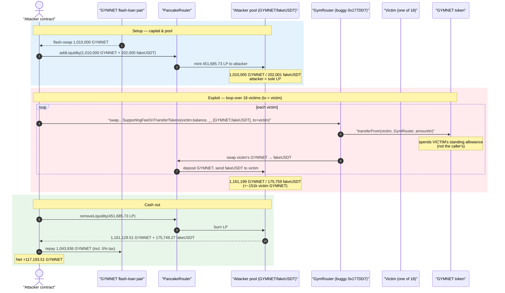
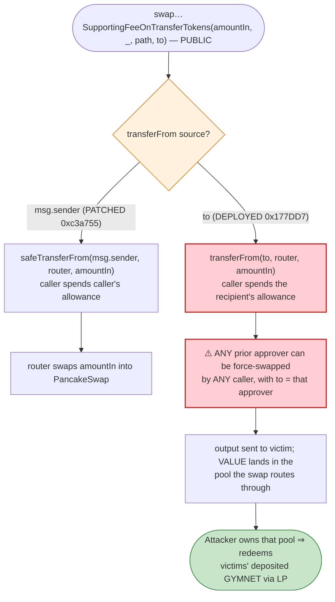
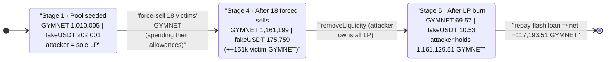

# GYM Network Exploit — `GymRouter` Pulls Swap Input From the *Recipient* Instead of the *Caller*

> **Reproduction:** the PoC compiles & runs in this isolated Foundry project at
> [this project folder](.) (the umbrella DeFiHackLabs repo contains many unrelated
> PoCs that do not whole-compile, so this one was extracted).
> Full verbose trace: [output.txt](output.txt).
> Verified (later, *patched*) router source: [contracts_GymRouter.sol](sources/GymRouter_c3a755/contracts_GymRouter.sol) — see the
> [Caveat on source vs. deployed bytecode](#caveat--verified-source-is-the-patched-version) below.

---

## Key info

| | |
|---|---|
| **Loss** | **+117,193.51 GYMNET** netted by the attacker (≈ the victims' drained GYMNET, repackaged as the attacker's pool LP). The umbrella PoC marks the USD figure as *"Unclear"*; on-chain this is ~151k GYMNET of user funds dumped into the attacker-controlled pool. |
| **Vulnerable contract** | `GymRouter` (proxy [`0x6b869795937DD2B6F4E03d5A0Ffd07A8AD8c095B`](https://bscscan.com/address/0x6b869795937DD2B6F4E03d5A0Ffd07A8AD8c095B#code), buggy implementation `0x177DD7202eb9AE5154fDf3006F8aE93DcB3b45e9`) |
| **Token** | `GymNetwork` (GYMNET) — proxy [`0x0012365F0a1E5F30a5046c680DCB21D07b15FcF7`](https://bscscan.com/address/0x0012365F0a1E5F30a5046c680DCB21D07b15FcF7#code), impl `0x843146cD421C313DB462c4ca40610e41D48Ee144` |
| **Victims** | 18 GYMNET holders who had previously `approve()`d the `GymRouter` (e.g. `0x0C8bbd0629…`, `0xbDFcA74764…`) |
| **Attacker EOA** | [`0x97eace4702217c1fea71cf6b79647a8ad5ddb0eb`](https://bscscan.com/address/0x97eace4702217c1fea71cf6b79647a8ad5ddb0eb) |
| **Attacker contract** | [`0xb8f83f38e262f28f4e7d80aa5a0216378e92baf2`](https://bscscan.com/address/0xb8f83f38e262f28f4e7d80aa5a0216378e92baf2) |
| **Attack tx** | [`0x7fe96c00880b329aa0fcb00f0ef3a0766c54e13965becf9cc5e0df6fbd0deca6`](https://bscscan.com/tx/0x7fe96c00880b329aa0fcb00f0ef3a0766c54e13965becf9cc5e0df6fbd0deca6) |
| **Chain / fork block / date** | BSC / 30,448,986 / July 2023 |
| **Compiler** | GymRouter & GymNetwork: Solidity v0.8.15, optimizer 200 runs |
| **Bug class** | Wrong `transferFrom` source address — router spends the **recipient's** allowance instead of the **caller's**, enabling theft from any prior approver |

---

## TL;DR

The deployed `GymRouter`'s `swap…SupportingFeeOnTransferTokens` family of functions pulled the
input tokens from the **`to`** address (the swap *recipient*) rather than from **`msg.sender`** (the
*caller*). Because the router is a public, shared spender that countless GYM users had already
granted ERC-20 allowances to, anyone could call:

```
swapExactTokensForTokensSupportingFeeOnTransferTokens(
    amountIn = victim.balanceOf(GYMNET),   // the victim's whole balance
    amountOutMin,
    path = [GYMNET, fakeUSDT],
    to   = victim                          // recipient == victim ⇒ source == victim
)
```

and force-sell **any victim's** GYMNET — spending the victim's own pre-existing allowance.

The attacker turned this into profit by routing all the forced sells through a **fresh pool the
attacker fully owned**:

1. **Flash-borrow** 1,010,000 GYMNET (from a different GYMNET pair) and **seed a brand-new
   GYMNET/fakeUSDT PancakeSwap pool** with it (`fakeUSDT` is an attacker-deployed token).
   The attacker becomes the sole LP.
2. For each of **18 victims**, call the router with `to = victim`. The router pulls the victim's
   entire GYMNET balance into the attacker's pool and hands the victim some near-worthless
   `fakeUSDT` — i.e. the victims' GYMNET piles up as pool reserve.
3. **Remove liquidity.** Because the attacker is the only LP, they reclaim the original 1,010,000
   GYMNET *plus* the ~151k GYMNET the 18 victims were forced to dump in.
4. **Repay the flash loan** and walk away with **117,193.51 GYMNET** of net profit.

---

## Background — the two moving parts

### 1. `GymNetwork` (GYMNET)

`GymNetwork` ([source](sources/GymNetwork_dc1b68/contracts_GymNetwork.sol)) is a Compound-style,
checkpointed, **fee-on-transfer** ERC-20 (`uint96` balances). Sells to a DEX incur a 5% tax
(`taxOnSell = 5`, [contracts_GymNetwork.sol:34](sources/GymNetwork_dc1b68/contracts_GymNetwork.sol#L34)),
routed to a tax collector; transfers to/from whitelisted "dex-tax-exempt" addresses skip the tax
([:413-415](sources/GymNetwork_dc1b68/contracts_GymNetwork.sol#L413-L415)). The exact tax
percentage is not material to the bug — it only slightly shrinks the attacker's take and explains
the `31,318 GYMNET` side-transfer seen during flash-loan repayment.

The token uses a **standard `transferFrom`** that correctly debits the *source* account's allowance
([:243-265](sources/GymNetwork_dc1b68/contracts_GymNetwork.sol#L243-L265)) — the token is fine. The
bug is entirely in the **router** that *calls* `transferFrom`.

### 2. `GymRouter`

`GymRouter` is a thin wrapper around PancakeSwap's router that adds a "commission" and a
distribution-accounting layer. Users `approve()` the `GymRouter` once, then swap through it. That
standing approval is exactly what the bug weaponizes.

---

## The vulnerable code

The verified on-chain source at the router's *current* implementation
(`0xc3a755…`) is the **fixed** version. Its fee-on-transfer swap pulls from `msg.sender`, which is
correct:

```solidity
// sources/GymRouter_c3a755/contracts_GymRouter.sol  (PATCHED version)
function swapExactTokensForTokensSupportingFeeOnTransferTokens(
    uint256 amountIn,
    uint256 amountOutMin,
    address[] calldata path,
    address to
) external {
    ...
    IERC20Upgradeable(path[0]).safeTransferFrom(msg.sender, address(this), amountIn); // ✅ caller pays
    IERC20Upgradeable(path[0]).safeIncreaseAllowance(routerAddress, amountIn - tokenACommission);
    IPancakeRouter02(routerAddress).swapExactTokensForTokensSupportingFeeOnTransferTokens(
        amountIn - tokenACommission, amountOutMin, path, to, block.timestamp + 300
    );
}
```
[contracts_GymRouter.sol:384-404](sources/GymRouter_c3a755/contracts_GymRouter.sol#L384-L404)

The **deployed implementation at the fork block** (`0x177DD7202eb9AE5154fDf3006F8aE93DcB3b45e9`,
reached via `delegatecall` from the proxy) behaved differently. Reconstructed from the trace, the
buggy line was effectively:

```solidity
// DEPLOYED (vulnerable) behavior, reconstructed from output.txt
IERC20Upgradeable(path[0]).safeTransferFrom(to, address(this), amountIn);  // ❌ recipient pays
```

The trace proves the source of the pull is `to`, not `msg.sender`. In the very first victim swap,
the attacker contract (`GYMTest 0x7FA9…`) is the caller, yet GYMNET is pulled from the victim
`0x0C8bbd06…` (the `to` parameter), and the victim's *allowance to the router* is what gets debited:

```
GymRouter::swapExactTokensForTokensSupportingFeeOnTransferTokens(
    2_882_503…e21, 544_755…e20, [GYMNET, fakeUSDT],
    0x0C8bbd0629050b78C91F1AAfDCF04e90238B3568)          // ← to = victim
  └─ 0x177DD7…::swap…(…) [delegatecall]
     ├─ GYMNET::transferFrom(
     │      0x0C8bbd0629…,                                // ← src = VICTIM (the `to`), not msg.sender
     │      GymRouter, 2_882_503…e21)
     │   ├─ emit Approval(owner: 0x0C8bbd0629…, spender: GymRouter, value: 989_833…e23)  // ← victim's allowance debited
     │   └─ emit Transfer(from: 0x0C8bbd0629…, to: GymRouter, 2_882_503…e21)
```
[output.txt:1728-1742](output.txt#L1728)

Note the `Approval` event: the victim's allowance to the `GymRouter` decreases — definitive proof
that the router spent the **victim's** standing allowance, not the attacker's.

---

## Root cause — why it was possible

A token router is a **shared, public spender**: every user who wants to swap through it grants it an
ERC-20 allowance once and leaves it in place. The entire safety of that model rests on a single
invariant:

> The router must only ever move tokens **owned by the caller** (`msg.sender`), spending **the
> caller's own** allowance.

The deployed `GymRouter` broke that invariant by sourcing the input from the **`to`** parameter —
an address fully chosen by the caller. Since `to` can be *any* address (including someone else's
wallet), the router became a universal "spend anyone's allowance" primitive:

1. **Wrong allowance owner.** `transferFrom(to, …)` debits `to`'s allowance. Any address that had
   ever approved the router (a normal action for a GYM user) could be drained by a third party.
2. **No `msg.sender` ↔ funds binding.** Nothing tied the tokens being moved to the entity
   authorizing the move. The caller authorizes nothing of their own; they direct *someone else's*
   pre-authorized tokens.
3. **Attacker-controlled sink.** The output goes to `to` (the victim), but the *value* of the forced
   sale accrues to whoever owns the pool the swap routes through. The attacker simply made themselves
   the **sole LP of a fresh GYMNET/fakeUSDT pool**, so every forced victim sell deposited GYMNET into
   a pool the attacker could then fully redeem.

The fee-on-transfer nature of GYMNET is incidental — the same bug would drain a plain ERC-20. The
patched source confirms the fix is exactly the one-word change `to → msg.sender`.

---

## Preconditions

- **Standing allowances.** Each victim must have previously `approve()`d the `GymRouter` to spend
  their GYMNET (normal for anyone who has swapped through GYM before). The trace shows 18 such
  victims with non-zero pre-existing allowances.
- **A pool the attacker controls.** The attacker needs a GYMNET pool whose LP they own, so the
  forced sells deposit value they can redeem. Here they spin up a fresh `GYMNET/fakeUSDT` pair with
  an attacker-deployed `fakeUSDT`, making themselves the **only** LP.
- **Working capital in GYMNET** to seed that pool — obtained intra-transaction via a
  PancakeSwap flash-swap of 1,010,000 GYMNET, fully repaid at the end. The attack is therefore
  effectively capital-free.

---

## Attack walkthrough (with on-chain numbers from the trace)

The attacker's pool is `CakeLP = 0x8e1b75…`, with `token0 = GYMNET`, `token1 = fakeUSDT`
(`reserve0 = GYMNET`, `reserve1 = fakeUSDT`). All figures are pulled from `Sync` events in
[output.txt](output.txt).

| # | Step | GYMNET reserve | fakeUSDT reserve | Effect |
|---|------|---------------:|-----------------:|--------|
| 0 | **Flash-borrow** 1,010,000 GYMNET via `PancakePair.swap(...)` → attacker | — | — | Capital sourced; repaid at the end ([output.txt:1631](output.txt#L1631)). |
| 1 | **Seed pool** — `addLiquidity(1,010,000 GYMNET, 202,000 fakeUSDT)` → 451,685.73 LP to attacker | 1,010,005 | 202,001 | Attacker is the **sole LP** ([:1698, :1713](output.txt#L1698)). |
| 2 | **Force-sell victim #1** (`0x0C8bbd06…`, 2,882.50 GYMNET) via router with `to = victim` | 1,012,873 | 201,430 | Victim's GYMNET pulled into the pool; victim got fakeUSDT ([:1787](output.txt#L1787)). |
| 3 | **Force-sell victim #2** (`0xbDFcA747…`, 30,753.82 GYMNET) | 1,043,473 | 195,538 | ([:1868](output.txt#L1868)) |
| … | **Force-sell victims #3–#18** (loop over 18 addresses) | … rising … | … falling … | Each victim's full GYMNET balance dumped in. |
| 4 | **After 18th victim** (`0xd6c382B2…`) | 1,161,199 | 175,759 | Pool now holds attacker's seed **+ ~151,194 GYMNET of victim funds** ([:3164](output.txt#L3164)). |
| 5 | **Remove liquidity** — burn 451,685.73 LP → attacker | 69.57 | 10.53 | Attacker reclaims **1,161,129.51 GYMNET + 175,749.27 fakeUSDT** ([:3219-3220](output.txt#L3219)). |
| 6 | **Repay flash loan** — transfer 1,043,936 GYMNET back to lender pair (5% sell-tax skims 31,318 GYMNET to fee wallet `0x120182…`; 1,012,617.92 reaches the pair) | — | — | Loan settled ([:3231-3234](output.txt#L3231)). |

After repayment the attacker's GYMNET balance is **117,193.51 GYMNET** (started at 0)
([output.txt:1571](output.txt#L1571)).

### Why the victims lost

Each victim's entire GYMNET balance was force-swapped into the attacker's freshly-created, thinly
priced `fakeUSDT` pool. The victims received `fakeUSDT` (an attacker-controlled token of negligible
real value), while their genuine GYMNET accumulated as reserve the attacker then redeemed by pulling
LP. The `amountOutMin` "≥ 90% of out amount" guard in the router
([:393-394](sources/GymRouter_c3a755/contracts_GymRouter.sol#L393-L394)) is computed against
`getAmountsOut` of the *same manipulated pool*, so it provides no protection — the quote and the
execution both reference the attacker's pool.

### Profit accounting (GYMNET)

| Direction | Amount (GYMNET) |
|---|---:|
| Borrowed (flash swap) | 1,010,000.00 |
| Deposited into pool as LP | 1,010,000.00 |
| Reclaimed on `removeLiquidity` | 1,161,129.51 |
| Repaid to flash-loan pair (incl. 5% tax) | 1,043,936.00 |
| **Net GYMNET retained** | **+117,193.51** |

The ~151k GYMNET the 18 victims were forced to sell shows up as the gap between deposited (1.01M)
and reclaimed (1.161M); after netting the flash-loan repayment and GYMNET's own sell tax, the
attacker pockets **117,193.51 GYMNET**. (The attacker-minted `fakeUSDT` they recovered is
worthless and ignored.)

---

## Diagrams

### Sequence of the attack



### Where the bug lives in the router



### Pool state evolution



---

## Caveat — verified source is the *patched* version

BscScan's verified source for the `GymRouter` implementation (`0xc3a755…`, in
[sources/GymRouter_c3a755/](sources/GymRouter_c3a755/contracts_GymRouter.sol)) already contains the
**fixed** code (`safeTransferFrom(msg.sender, …)`). The contract executing at the fork block was an
**earlier implementation** (`0x177DD7202eb9AE5154fDf3006F8aE93DcB3b45e9`, reached via the proxy's
`delegatecall` — see [output.txt:1729](output.txt#L1729)) whose source is not the verified one. The
vulnerable behavior (`transferFrom(to, …)`) is therefore established from the **execution trace**,
not the verified source; the verified source is included only to show the post-incident fix. This
is consistent with the public write-up
([@AnciliaInc](https://twitter.com/AnciliaInc/status/1686605510655811584)), which describes the
router spending arbitrary users' allowances.

---

## Remediation

1. **Pull input from `msg.sender`, never from `to`.** The single-line fix the project shipped is
   correct: `safeTransferFrom(msg.sender, address(this), amountIn)`. A router must only ever move
   the caller's own tokens. The `to` parameter is a *destination*, never a *source*.
2. **Never let one address parameter serve as both fund source and arbitrary recipient.** If a
   function both spends an allowance and lets the caller pick whose allowance, it is a universal
   theft primitive. Bind every token pull to `msg.sender`.
3. **Don't trust pool-derived quotes for slippage on caller-chosen pools.** The `≥ 90% of
   getAmountsOut` guard referenced the same pool being swapped through; against an attacker-owned
   pool it is meaningless. Slippage limits must come from the caller (an explicit `amountOutMin`
   they computed off-chain), not be re-derived from the pool inside the router.
4. **Encourage tight approvals.** Shared-router designs amplify any allowance bug into a fleet-wide
   drain. Prefer permit-style single-use approvals or per-swap allowances over standing
   `type(uint256).max` grants to a mutable, upgradeable router.
5. **Treat upgradeable router logic as critical-path.** A proxy that can be pointed at a buggy
   implementation turns an internal mistake into instant loss of every user's standing allowance —
   gate upgrades behind review + timelock and re-audit any change to token-movement code.

---

## How to reproduce

The PoC was extracted into this standalone Foundry project (the umbrella DeFiHackLabs repo has many
unrelated PoCs that fail `forge test`'s whole-project build):

```bash
_shared/run_poc.sh 2023-07-GYMNET_exp -vvvvv
```

- **RPC:** a **BSC archive** endpoint is required (fork block 30,448,986 is old; most public BSC
  RPCs prune that state and fail with `header not found` / `missing trie node`). `foundry.toml`'s
  `bsc` alias must point at an archive provider.
- **Result:** `[PASS] testExploit()`, attacker GYMNET balance grows from `0` to
  `117,193.506314277503007996`.

Expected tail:

```
Ran 1 test for test/GYMNET_exp.sol:GYMTest
[PASS] testExploit() (gas: 2760294)
Logs:
  Attacker GYMNET balance before exploit: 0.000000000000000000
  1. Taking GYMNET flashloan
  2. Adding GYMNET-fakeUSDT liquidity
  2a. Added attacker's liquidity: 451685.731454957518592000
  3. Exploiting vulnerability in gym router...
  4. Removing GYMNET-fakeUSDT liquidity: 451685.731454957518592000
  5. Repaying GYMNET flashloan
  Attacker GYMNET balance after exploit: 117193.506314277503007996
```

---

*References: DeFiHackLabs PoC header; analysis by [@AnciliaInc](https://twitter.com/AnciliaInc/status/1686605510655811584). Vulnerable behavior established from [output.txt](output.txt) (deployed impl `0x177DD7…`); patched source in [sources/GymRouter_c3a755/](sources/GymRouter_c3a755/contracts_GymRouter.sol).*
