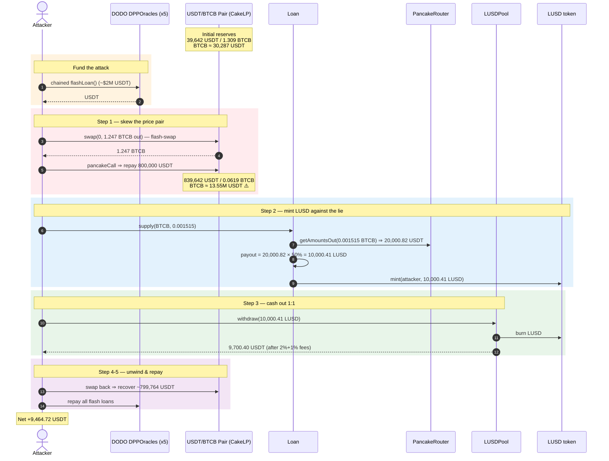
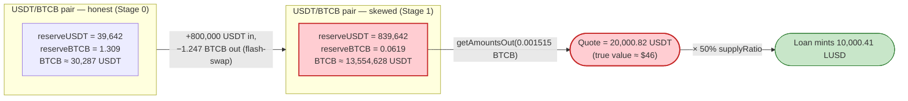
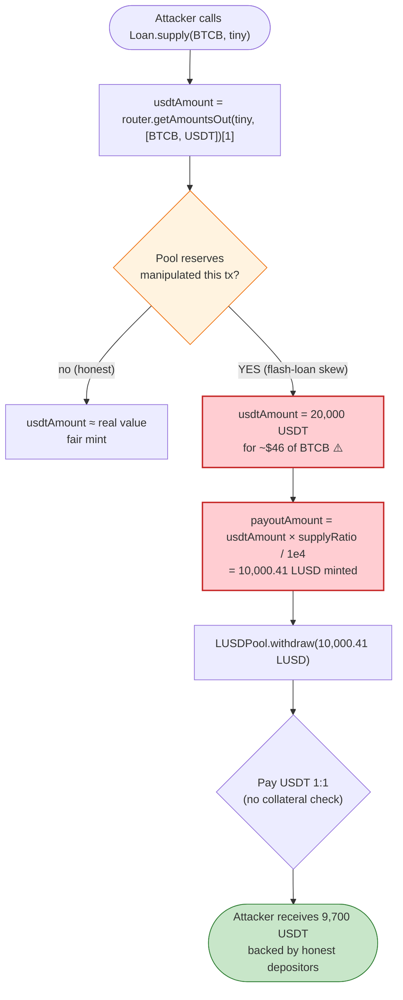

# LUSD (LAYER3) Exploit — Spot-Price Oracle Manipulation via `Loan.supply()`

> **Vulnerability classes:** vuln/oracle/spot-price · vuln/governance/flash-loan-attack

> **Reproduction:** the PoC compiles & runs in an isolated Foundry project at
> [this project folder](.) (the umbrella DeFiHackLabs repo contains many unrelated
> PoCs that do not whole-compile, so this one was extracted).
> Full verbose trace: [output.txt](output.txt).
> Verified vulnerable sources: [contracts_pool_Loan.sol](sources/Loan_deC12a/contracts_pool_Loan.sol) and
> [contracts_pool_LUSDPool.sol](sources/LUSDPool_637de6/contracts_pool_LUSDPool.sol).

---

## Key info

| | |
|---|---|
| **Loss** | ~$9.46K this tx — **9,464.72 USDT** net (SlowMist totals the campaign at ~$16K across the attacker's transactions) |
| **Vulnerable contract** | `Loan` — [`0xdeC12a1dCbC1F741cCD02dFd862ab226F6383003`](https://bscscan.com/address/0xdeC12a1dCbC1F741cCD02dFd862ab226F6383003) (mispriced mint) |
| **Drained contract** | `LUSDPool` — [`0x637De69F45F3b66D5389F305088A38109aA0cf7C`](https://bscscan.com/address/0x637de69f45f3b66d5389f305088a38109aa0cf7c#code) |
| **LUSD token** | [`0x3cD632C25A4Db4c1A636cFb23B9285Be1097A60d`](https://bscscan.com/address/0x3cD632C25A4Db4c1A636cFb23B9285Be1097A60d) |
| **Manipulated pool** | PancakeSwap USDT/BTCB pair `CakeLP` — `0x3F803EC2b816Ea7F06EC76aA2B6f2532F9892d62` |
| **Attacker contract** | [`0x21ad028c185ac004474c21ec5666189885f9e518`](https://bscscan.com/address/0x21ad028c185ac004474c21ec5666189885f9e518) |
| **Attack tx** | `0x1eeef7b9a12b13f82ba04a7951c163eb566aa048050d6e9318b725d7bcec6bfa` ([Phalcon](https://explorer.phalcon.xyz/tx/bsc/0x1eeef7b9a12b13f82ba04a7951c163eb566aa048050d6e9318b725d7bcec6bfa)) |
| **Chain / block / date** | BSC / 29,756,866 / July 2023 |
| **Compiler** | Solidity v0.8.17, optimizer enabled |
| **Bug class** | Spot-price oracle manipulation (`getAmountsOut` used as a price feed) + flash-loan-funded reserve skew |

---

## TL;DR

`Loan.supply()` decides how much LUSD to mint for a supplied token by asking the **PancakeSwap router**
how much USDT that token is worth, *right now*, using `router.getAmountsOut()`
([contracts_pool_Loan.sol:133](sources/Loan_deC12a/contracts_pool_Loan.sol#L133)). `getAmountsOut`
reads the pair's **instantaneous reserves** — a manipulable spot price, not a TWAP or an oracle.

The attacker:

1. **Flash-borrows** ~$2M USDT by chaining five DODO `DPPOracle` flash-loans, plus a PancakeSwap
   USDT/BTCB **flash-swap** of 800,000 USDT.
2. **Skews the USDT/BTCB pool**: pushes 800,000 USDT into the pair and pulls 1.247 BTCB out, driving the
   pair's reserves from `39,642 USDT / 1.309 BTCB` to `839,642 USDT / 0.0619 BTCB`. BTCB's spot price
   jumps from ≈ **30,287 USDT** to ≈ **13.55M USDT**.
3. **Supplies 0.001515 BTCB** (worth ≈ **$46** at the real price) to `Loan`. Against the skewed pool,
   `getAmountsOut` reports that BTCB is worth **20,000.82 USDT**, so — at the 50 % `supplyRatio` —
   `Loan.mint`s the attacker **10,000.41 LUSD**.
4. **Withdraws** the 10,000.41 LUSD through `LUSDPool.withdraw()`, which pays out **9,700.40 USDT** 1:1
   (minus a 2 % node fee and 1 % LP fee).
5. **Unwinds**: swaps the manipulated BTCB back through the pair (recovering the 800,000 USDT input),
   repays every flash loan, and walks away with **9,464.72 USDT** of pure profit.

The protocol minted a $10,000 stablecoin claim against $46 of collateral and then honored it with $9,700
of real USDT from the pool. Every honest depositor's USDT in `LUSDPool` backs that fraudulent mint.

---

## Background — what LUSD / LAYER3 does

LAYER3's LUSD is a soft-pegged "loan dollar" minted against supplied collateral:

- **`Loan`** ([source](sources/Loan_deC12a/contracts_pool_Loan.sol)) lets anyone `supply()` a whitelisted
  token. It prices that token in USDT via the PancakeSwap router, applies a per-token `supplyRatio`
  (here 50 %), and `mint`s the corresponding amount of LUSD to the supplier
  ([Loan.sol:126-168](sources/Loan_deC12a/contracts_pool_Loan.sol#L126-L168)).
- **`LUSDPool`** ([source](sources/LUSDPool_637de6/contracts_pool_LUSDPool.sol)) is where LUSD is
  redeemed for USDT. `deposit()` mints LUSD 1:1 for USDT; `withdraw()` burns LUSD and returns USDT 1:1
  (minus a `nodeFee` and `lpFee`) — i.e. **LUSDPool treats 1 LUSD as worth 1 USDT unconditionally**
  ([LUSDPool.sol:117-146](sources/LUSDPool_637de6/contracts_pool_LUSDPool.sol#L117-L146)).
- **LUSD** is a mint/burn-able ERC20; both `Loan` and `LUSDPool` hold the mint/burn role.

The two contracts share one fatal assumption: that the LUSD a user holds was minted against an honest
valuation. `Loan` is the only place that valuation is enforced, and it enforces it with a spot price.

On-chain parameters configured for BTCB (read from the `Supply` event's storage writes in the trace):

| Parameter | Value |
|---|---|
| `info[BTCB].supplyRatio` | **5000 bps = 50 %** |
| `info[BTCB].redeemFee` | 500 bps |
| `info[BTCB].dailyRate` | 3 |
| `LUSDPool.nodeFee` | **200 bps (2 %)** |
| `LUSDPool.lpFee` | **100 bps (1 %)** |
| USDT/BTCB pair reserves (pre-attack) | **39,642.34 USDT / 1.3089 BTCB** → BTCB ≈ 30,287 USDT |

---

## The vulnerable code

### 1. `Loan.supply()` prices collateral with a live AMM spot price

```solidity
function supply(address supplyToken, uint256 supplyAmount) external nonReentrant {
    address[] memory path = new address[](2);
    path[0] = address(supplyToken);
    path[1] = address(USDT);
    uint256 usdtAmount = router.getAmountsOut(supplyAmount, path)[1];   // ⚠️ spot price = manipulable

    Order memory order = Order({
        ...
        supplyAmount: supplyAmount,
        payoutAmount: (usdtAmount * info[supplyToken].supplyRatio) / 1e4, // 50% of inflated value
        ...
    });
    orders[msg.sender].push(order);

    IERC20(supplyToken).safeTransferFrom(msg.sender, address(this), supplyAmount); // takes $46 of BTCB
    LUSD.mint(msg.sender, order.payoutAmount);                                     // mints 10,000 LUSD
    ...
}
```

[contracts_pool_Loan.sol:126-168](sources/Loan_deC12a/contracts_pool_Loan.sol#L126-L168)

`router.getAmountsOut(amountIn, [token, USDT])` is a *pure read of the pair's current reserves* — exactly
the quantity an attacker controls within a single transaction by trading into the pool. There is no TWAP,
no Chainlink feed, no sanity bound, and no comparison against an independent price source.

### 2. `LUSDPool.withdraw()` redeems LUSD for USDT 1:1

```solidity
function withdraw(uint256 amount) external nonReentrant {
    require(!isBlackListed[msg.sender], "This account is abnormal");

    LUSD.safeTransferFrom(msg.sender, address(this), amount);

    uint256 nodeAmount = (amount * nodeFee) / 1e4;   // 2%
    LUSD.safeTransfer(nodePool, nodeAmount);

    uint256 lpAmount = (amount * lpFee) / 1e4;        // 1%
    LUSD.burn(address(this), lpAmount);
    ... router.addLiquidity(...) ...

    LUSD.burn(address(this), amount - nodeAmount - lpAmount);
    USDT.safeTransfer(msg.sender, amount - nodeAmount - lpAmount);  // ⚠️ 1 LUSD → 1 USDT, no questions
    ...
}
```

[contracts_pool_LUSDPool.sol:117-146](sources/LUSDPool_637de6/contracts_pool_LUSDPool.sol#L117-L146)

`withdraw` pays out USDT one-for-one against burned LUSD. It never checks where the LUSD came from or
whether it was minted against real collateral — it is a faucet that converts *any* LUSD into pool USDT.
Combined with `Loan`'s mispriced mint, the attacker manufactures LUSD cheaply and cashes it out here.

---

## Root cause — why it was possible

The protocol's solvency rests on one invariant: **LUSD is only minted against collateral of at least
equal USDT value** (scaled by `supplyRatio`). `Loan.supply()` is supposed to enforce that, but it
measures collateral value with a price that the *supplier* can set for free in the same transaction.

> `getAmountsOut` returns the AMM's marginal price, which is a function of the pool's instantaneous
> reserves. Anyone with (flash-borrowed) capital can move those reserves arbitrarily far for the duration
> of one transaction, get a fraudulent quote, mint against it, and then restore the reserves — paying only
> swap fees.

Concretely, three design decisions compose into the bug:

1. **Spot AMM quote as the price oracle.** `router.getAmountsOut` on a single PancakeSwap pair is the most
   manipulable price source available — and it is the *sole* determinant of how much LUSD is minted.
2. **The collateral and the price pair are the same asset.** The attacker inflates BTCB's USDT price by
   draining BTCB *out of* the very pair `getAmountsOut` reads, so a token they hold ($46 of BTCB) is
   priced as $20,000.
3. **Redemption is unconditional 1:1.** `LUSDPool.withdraw()` honors LUSD at face value with no link back
   to the collateral that minted it, so the fraudulently-minted LUSD is freely convertible to the pool's
   honest USDT.

Flash loans make the capital requirement irrelevant: the 800,000 USDT used to skew the pool, and the ~$2M
of DODO loans funding it, are all borrowed and repaid inside the single attack transaction.

---

## Preconditions

- BTCB (or any whitelisted `supplyToken`) is configured in `Loan.info` with a non-zero `supplyRatio` and is
  priced against a PancakeSwap pair whose reserves the attacker can move. ✓ (BTCB at 50 %.)
- `Loan` holds the LUSD mint role and `LUSDPool` holds enough USDT to satisfy the withdrawal. ✓
- Working capital to skew the pool, fully recovered intra-transaction → **flash-loanable**. In the PoC this
  is sourced from five chained DODO `DPPOracle.flashLoan` calls plus a PancakeSwap `CakeLP.swap` flash-swap
  ([LUSD_exp.sol:61-101](test/LUSD_exp.sol#L61-L101)).

---

## Attack walkthrough (with on-chain numbers from the trace)

The USDT/BTCB pair `CakeLP` has `token0 = USDT`, `token1 = BTCB`, so `reserve0 = USDT`, `reserve1 = BTCB`.
All figures are taken from the `Sync`/`Swap` events and `getReserves()` returns in
[output.txt](output.txt).

| # | Step | USDT reserve | BTCB reserve | BTCB spot price | Effect |
|---|------|-------------:|-------------:|----------------:|--------|
| 0 | **Initial** (pre-attack) | 39,642.34 | 1.3089 | ≈ 30,287 USDT | Honest pool. |
| 1 | **Flash-swap**: pull 1.247 BTCB out of the pair (callback repays 800,000 USDT) | 839,642.34 | 0.06195 | ≈ **13,554,628 USDT** | Pool's BTCB drained ~95 %; BTCB price inflated ~447×. ([Sync, L1698](output.txt#L1698)) |
| 2 | **`Loan.supply(BTCB, 0.001515)`** → `getAmountsOut` reads skewed reserves, returns **20,000.82 USDT**; mints `20,000.82 × 50 % = ` **10,000.41 LUSD** | 839,642.34 | 0.06346 | — | $46 of BTCB priced at $20,000 → 10,000 LUSD minted. ([getAmountsOut L1711-1714](output.txt#L1711), [mint L1723](output.txt#L1723)) |
| 3 | **`LUSDPool.withdraw(10,000.41 LUSD)`** → burns LUSD, sends back USDT minus 2 % node + 1 % LP fees | — | — | — | Attacker receives **9,700.40 USDT** from the pool. ([withdraw L1750, USDT transfer L1827](output.txt#L1827)) |
| 4 | **Unwind**: transfer 1.245 BTCB back into the pair and `swap` out 799,764.32 USDT | 39,878.03 | 1.3074 | ≈ 30,500 USDT | Reserves restored; 800,000 USDT input recovered. ([Swap/Sync L1843-1854](output.txt#L1843)) |
| 5 | **Repay** PancakeSwap flash-swap (800,000 USDT) + five DODO flash-loans | — | — | — | Net profit = **9,464.72 USDT**. ([final balance L1565](output.txt#L1565)) |

### How the mint became fraudulent

Step 1 sets the pair to `839,642 USDT / 0.0619 BTCB`. For the tiny `supplyAmount = 0.001515 BTCB`,
PancakeSwap's `getAmountsOut` is `out ≈ amountIn × 0.9975 × reserveUSDT / (reserveBTCB + amountIn × 0.9975)`.
With `reserveUSDT` enormous and `reserveBTCB` tiny, the quote balloons to **20,000.82 USDT** for what is
truly ≈ $46 of BTCB. At the 50 % `supplyRatio`, that mints **10,000.41 LUSD** — a >200× overvaluation of
the collateral.

### Profit accounting (USDT)

| Item | Amount |
|---|---:|
| Real value of BTCB supplied to `Loan` | ≈ 45.90 (≈ $46) |
| LUSD minted by `Loan` | 10,000.41 |
| USDT returned by `LUSDPool.withdraw` (after 2 % + 1 % fees) | 9,700.40 |
| 800,000 USDT pool-skew input | fully recovered on unwind |
| DODO / PancakeSwap flash loans | fully repaid |
| **Net profit (this tx)** | **+9,464.72 USDT** |

The ~$236 gap between the 9,700.40 USDT withdrawn and the 9,464.72 USDT net profit is the cumulative
swap fees and slippage paid skewing and un-skewing the BTCB pool — the cost of renting the price for one
transaction.

---

## Diagrams

### Sequence of the attack



### Why the quote is a lie: spot price before vs. after the skew



### The flaw inside `supply()` → `withdraw()`



---

## Why each magic number

- **`CakeLP.swap(0, 1_246_953_598_313_175_025)` (flash-swap 1.247 BTCB out):** drains ~95 % of the pair's
  BTCB while the `pancakeCall` callback repays 800,000 USDT, slamming `reserveBTCB` down and `reserveUSDT`
  up — the larger the reserve skew, the higher the fraudulent BTCB quote.
- **`supply(BTCB, 1_515_366_635_982_742)` (0.001515 BTCB):** deliberately tiny — small enough that the real
  cost is negligible (~$46), but against the skewed reserves `getAmountsOut` still reports it as worth
  20,000.82 USDT. The attacker only needs the mint to clear ~10,000 LUSD.
- **`withdraw(LUSD.balanceOf(this))` (10,000.41 LUSD):** dumps the entire fraudulent mint into `LUSDPool`,
  which returns 97 % of it (9,700.40 USDT) after the 2 % node + 1 % LP fees.
- **`CakeLP.swap(799_764_317_883_596_339_564_612, 0)` (recover ~799,764 USDT):** sends the manipulated BTCB
  back into the pair to pull the 800,000-USDT input back out (minus fee), restoring reserves and freeing the
  capital to repay the flash loans.

---

## Remediation

1. **Never price collateral with a single AMM spot quote.** Replace `router.getAmountsOut()` in
   `Loan.supply()` with a manipulation-resistant source: a Chainlink price feed, a Uniswap/Pancake
   **TWAP** observed over multiple blocks, or a multi-source median. A spot quote read in the same
   transaction the user controls is not an oracle.
2. **Bound and sanity-check the price.** Even with a TWAP, compare the quote against an independent feed
   and revert if they diverge beyond a tolerance, so a one-block manipulation cannot pass.
3. **Make minting and redemption symmetric and collateral-aware.** `LUSDPool.withdraw()` should not honor
   LUSD 1:1 with no link to the collateral that minted it. Track per-mint collateral backing, or require
   redemption to return the *same* collateral, so over-minted LUSD cannot be cashed out for pool USDT.
4. **Throttle single-transaction mint size / add per-block limits.** A `supply()` that mints 10,000 LUSD
   against $46 of collateral should be impossible; cap mint amount relative to verified collateral value and
   rate-limit large mints.
5. **Treat flash-loan reentry as the default threat model.** Any function whose output depends on a pool
   reserve must assume that reserve was set adversarially within the current transaction.

---

## How to reproduce

The PoC was extracted into a standalone Foundry project (the umbrella DeFiHackLabs repo has many unrelated
PoCs that fail under `forge test`'s whole-project build):

```bash
_shared/run_poc.sh 2023-07-LUSD_exp -vvvvv
```

- RPC: a **BSC archive** endpoint is required (fork block 29,756,866 is from July 2023). `foundry.toml`
  uses `https://bsc-mainnet.public.blastapi.io`, which serves historical state at that block; most public
  BSC RPCs prune it and fail with `header not found` / `missing trie node`.
- Result: `[PASS] testSkim()` — the attacker's USDT balance goes from `0` to `9,464.716730…`.

Expected tail:

```
  Attacker BEP20USDT balance before attack: 0.000000000000000000
  Attacker BEP20USDT balance after attack: 9464.716730420359231245

Suite result: ok. 1 passed; 0 failed; 0 skipped
```

---

*Reference: SlowMist Hacked — https://hacked.slowmist.io/ (LUSD / LAYER3, BSC, ~$16K campaign).*
