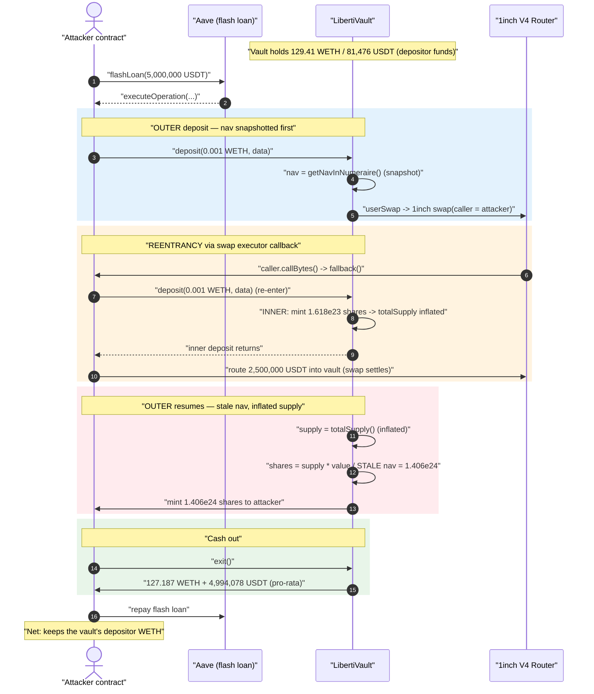
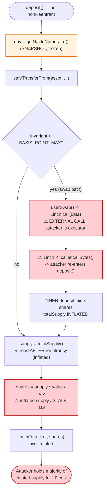
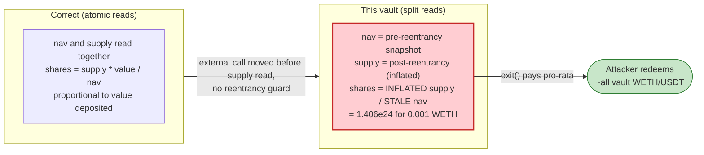

# Libertify (LibertiVault) Exploit — Deposit Reentrancy via 1inch Swap Callback Inflates Share Mint

> **Vulnerability classes:** vuln/reentrancy/single-function · vuln/arithmetic/precision-loss

> **Reproduction:** the PoC compiles & runs in an isolated Foundry project at
> [this project folder](.) (the umbrella DeFiHackLabs repo
> contains many unrelated PoCs that do not whole-compile, so this one was extracted).
> Full verbose trace: [output.txt](output.txt).
> Verified vulnerable source: [contracts_LibertiVault.sol](sources/LibertiVault_9c80a4/contracts_LibertiVault.sol)
> and [contracts_LibertiAggregationRouterV4.sol](sources/LibertiVault_9c80a4/contracts_LibertiAggregationRouterV4.sol).

---

## Key info

| | |
|---|---|
| **Loss** | ~$452K — drained from the WETH/USDT `LibertiVault` (attacker netted **123.84 WETH + 56,234 USDT** on ~0.004 WETH of seed capital) |
| **Vulnerable contract** | `LibertiVault` (clone) — [`0x9c80a455ecaca7025A45F5fa3b85Fd6A462a447b`](https://polygonscan.com/address/0x9c80a455ecaca7025a45f5fa3b85fd6a462a447b#code) |
| **Implementation** | `LibertiVault` impl — `0x089d9868b58eF37D5804281e106d9B7E71A4D05f` (EIP-1167 minimal clone target) |
| **Victim assets** | the vault's own holdings: ≈ **129.41 WETH + 81,476 USDT** of depositor funds |
| **Attacker EOA** | [`0xfd2d3ffb05ad00e61e3c8d8701cb9036b7a16d02`](https://polygonscan.com/address/0xfd2d3ffb05ad00e61e3c8d8701cb9036b7a16d02) |
| **Attacker contract** | [`0xdfcdb5a86b167b3a418f3909d6f7a2f2873f2969`](https://polygonscan.com/address/0xdfcdb5a86b167b3a418f3909d6f7a2f2873f2969) |
| **Attack tx** | [`0x7320accea0ef1d7abca8100c82223533b624c82d3e8d445954731495d4388483`](https://polygonscan.com/tx/0x7320accea0ef1d7abca8100c82223533b624c82d3e8d445954731495d4388483) |
| **Chain / block / date** | Polygon / fork at 44,941,584 / July 11, 2023 |
| **Compiler** | Solidity v0.8.17, optimizer 10,000 runs |
| **Bug class** | Reentrancy → ERC-4626-style share-inflation (stale NAV / read-after-external-call) |

---

## TL;DR

`LibertiVault.deposit()` is a vault-share function whose `_deposit()` internal routine makes an
**external call to the 1inch V4 aggregation router in the middle of the share-minting logic**, and
crucially **before** it reads `totalSupply()` and mints shares
([contracts_LibertiVault.sol:357-410](sources/LibertiVault_9c80a4/contracts_LibertiVault.sol#L357-L410)).

Because 1inch's `swap()` calls a *caller-supplied executor contract* to perform the actual token
movement, and the attacker registers **its own contract** as that executor, the swap re-enters the
vault. The attacker re-calls `deposit()` from inside the swap callback (the test does this in
`fallback()` — [Libertify_exp.sol:115-122](test/Libertify_exp.sol#L115-L122)).

The outer `deposit()` captured the vault's net asset value (`nav`) **once, at the top**, then handed
control to 1inch. The reentrant inner `deposit()` runs to completion, mints itself shares, and
**inflates `totalSupply()`**. When control returns to the outer call, it computes its own share mint
using `supply = totalSupply()` (now larger) but divides by the **stale `nav`** captured before the
reentrancy — over-minting a massive number of shares to the attacker.

The attacker then calls `exit()`
([:170-196](sources/LibertiVault_9c80a4/contracts_LibertiVault.sol#L170-L196)), which burns its shares
and pays out the vault's WETH and USDT **pro-rata to share balance**. Holding the lion's share of an
inflated supply, the attacker walks off with essentially all of the vault's real assets for ~0 cost.

The whole sequence is wrapped in an Aave flash loan purely to source the 5M USDT used as 1inch swap
liquidity; the profit comes from the vault, not the loan.

---

## Background — what LibertiVault does

`LibertiVault` ([source](sources/LibertiVault_9c80a4/contracts_LibertiVault.sol)) is a two-asset,
ERC-4626-flavoured vault deployed as EIP-1167 minimal clones (see the constructor's
`_disableInitializers()` and the `initialize()` clone-init at
[:97-126](sources/LibertiVault_9c80a4/contracts_LibertiVault.sol#L97-L126)). Each instance holds:

- `asset` — the primary token (here **WETH**, `0x7ceB23fD...`)
- `other` — usually a stablecoin (here **USDT**, `0xc2132D05...`)

Core mechanics:

- **Share token** — the vault is itself an `ERC20`. Depositors receive shares; redeemers burn them.
- **Target allocation (`invariant`)** — a basis-point split between `asset` and `other`. When
  `invariant < BASIS_POINT_MAX (10_000)`, a deposit is partly **swapped from `asset` into `other`**
  via 1inch so the vault keeps its target ratio
  ([:377-386](sources/LibertiVault_9c80a4/contracts_LibertiVault.sol#L377-L386)).
- **1inch integration** — `userSwap()`/`adminSwap()`
  ([contracts_LibertiAggregationRouterV4.sol:27-63](sources/LibertiVault_9c80a4/contracts_LibertiAggregationRouterV4.sol#L27-L63))
  forward caller-provided calldata to the 1inch V4 router at `0x1111111254fb6c44bAC0beD2854e76F90643097d`.
  The vault validates the `SwapDescription` (dstReceiver, amount, tokens) but the *executor* and the
  *swap path* are attacker-controlled.
- **NAV / pricing** — `getNavInNumeraire()` and `getValueInNumeraire()`
  ([:319-323](sources/LibertiVault_9c80a4/contracts_LibertiVault.sol#L319-L323),
  [:450-458](sources/LibertiVault_9c80a4/contracts_LibertiVault.sol#L450-L458)) price both legs in USD
  via a Chainlink-backed `priceFeed`. Share count is `supply * value / nav`.

On-chain state of the targeted vault at the fork block (read from the trace):

| Parameter | Value |
|---|---|
| `asset` | WETH (`0x7ceB23fD...`) |
| `other` | USDT (`0xc2132D05...`) |
| WETH held by the vault | **129,411,606,107,394,699,466 wei ≈ 129.41 WETH** ([output.txt:1650](output.txt)) |
| USDT held by the vault | **81,476,027,164 ≈ 81,476 USDT** ([output.txt:1661](output.txt)) |
| WETH price (Chainlink, scaled) | 188406000000 / 1e8 ≈ **$1,884.06** ([output.txt:1656](output.txt)) |
| USDT price | 100007000 / 1e8 ≈ **$1.00007** ([output.txt:1670](output.txt)) |
| `invariant` | `< 10_000` (partial allocation ⇒ swap path active) |

---

## The vulnerable code

### 1. `deposit()` snapshots `nav` once, up front

```solidity
function deposit(
    uint256 assets,
    address receiver,
    bytes calldata data
) external returns (uint256 shares) {
    uint256 nav = getNavInNumeraire(MathUpgradeable.Rounding.Up);            // ← snapshot BEFORE anything
    SafeERC20Upgradeable.safeTransferFrom(asset, _msgSender(), address(this), assets);
    shares = _deposit(assets, receiver, data, nav);                          // ← nav passed in, used later
    emit Deposit(_msgSender(), receiver, assets, shares);
}
```
[contracts_LibertiVault.sol:144-153](sources/LibertiVault_9c80a4/contracts_LibertiVault.sol#L144-L153)

Notably there is **no `nonReentrant` modifier** anywhere in the vault.

### 2. `_deposit()` makes the external swap call BEFORE reading supply / minting

```solidity
function _deposit(uint256 assets, address receiver, bytes calldata data, uint256 nav)
    private returns (uint256 shares)
{
    ...
    uint256 returnAmount = 0;
    uint256 swapAmount = 0;
    if (BASIS_POINT_MAX > invariant) {
        swapAmount = assetsToToken1(assets);
        returnAmount = userSwap(                       // ⚠️ EXTERNAL CALL to 1inch — reentrancy point
            data, address(this), swapAmount, address(asset), address(other)
        );
    }
    uint256 supply = totalSupply();                    // ⚠️ read AFTER the external call → inflated
    if (0 < supply) {
        uint256 valueToken0 = getValueInNumeraire(asset, assets - swapAmount, ...);
        uint256 valueToken1 = getValueInNumeraire(other, returnAmount, ...);
        shares = supply.mulDiv(
            valueToken0 + valueToken1,                 // numerator: value just deposited
            nav,                                       // ⚠️ STALE denominator (pre-reentrancy NAV)
            MathUpgradeable.Rounding.Down
        );
    } else {
        shares = INITIAL_SHARE;
    }
    uint256 feeAmount = shares.mulDiv(entryFee, BASIS_POINT_MAX, ...);
    _mint(receiver, shares - feeAmount);
    _mint(owner(), feeAmount);
}
```
[contracts_LibertiVault.sol:357-410](sources/LibertiVault_9c80a4/contracts_LibertiVault.sol#L357-L410)

The math is `shares = supply * value / nav`. In a correct CEI implementation, `supply` and `nav`
are read at the same instant and are mutually consistent. Here `nav` is frozen at the start of the
**outer** call, while `supply` is sampled **after** the reentrant inner deposit has already added new
shares — they are evaluated at different points in time, against a balance set that changed in between.

### 3. `userSwap()` hands control to attacker-controlled code

```solidity
function _swap(bytes calldata data, uint256 amount, address srcToken)
    private returns (uint256 returnAmount)
{
    SafeERC20.safeIncreaseAllowance(IERC20(srcToken), AGGREGATION_ROUTER_V4, amount);
    (bool success, bytes memory returndata) = AGGREGATION_ROUTER_V4.call(data);   // ⚠️ calls 1inch
    ...
}
```
[contracts_LibertiAggregationRouterV4.sol:67-88](sources/LibertiVault_9c80a4/contracts_LibertiAggregationRouterV4.sol#L67-L88)

1inch V4's `swap(IAggregationExecutor caller, SwapDescription desc, bytes data)` invokes
`caller.callBytes(...)` to actually move tokens. Since the attacker passes **its own contract address as
`caller`** (see `setData()` — [Libertify_exp.sol:124-132](test/Libertify_exp.sol#L124-L132)), 1inch
calls back into attacker code mid-swap. That callback re-enters `LibertiVault.deposit()`.

### 4. `exit()` pays out pro-rata to share balance

```solidity
function exit() external returns (uint256 amountToken0, uint256 amountToken1) {
    uint256 shares = balanceOf(_msgSender());
    if (0 < shares) {
        ...                                            // exit fee skimmed in shares
        uint256 supply = totalSupply();
        _burn(_msgSender(), shares);
        uint256 totalToken0 = asset.balanceOf(address(this));
        if (0 < totalToken0) {
            amountToken0 = totalToken0.mulDiv(shares, supply, ...);   // ← pro-rata WETH
            SafeERC20Upgradeable.safeTransfer(asset, _msgSender(), amountToken0);
        }
        uint256 totalToken1 = other.balanceOf(address(this));
        if (0 < totalToken1) {
            amountToken1 = totalToken1.mulDiv(shares, supply, ...);   // ← pro-rata USDT
            SafeERC20Upgradeable.safeTransfer(other, _msgSender(), amountToken1);
        }
        ...
    }
}
```
[contracts_LibertiVault.sol:170-196](sources/LibertiVault_9c80a4/contracts_LibertiVault.sol#L170-L196)

Once the attacker holds an inflated share balance relative to a barely-larger supply, `exit()` returns
nearly the entire WETH and USDT balance of the vault.

---

## Root cause — why it was possible

The vault violates **Checks-Effects-Interactions** in its most value-sensitive function: it performs an
**external, attacker-controllable call** (`userSwap` → 1inch → `caller.callBytes`) *between* snapshotting
`nav` and *reading* `totalSupply()` to compute the mint, with **no reentrancy guard**.

That creates a read-after-external-call inconsistency in the share formula:

```
shares = totalSupply()  *  valueDeposited  /  nav
            ▲                                    ▲
   read AFTER reentrancy            captured BEFORE reentrancy
   (inflated by inner mint)         (stale — does not reflect inner deposit's assets)
```

Concretely, three design decisions compose into the bug:

1. **External call in the middle of mint accounting.** The 1inch swap is necessary for the
   target-allocation rebalance, but it is executed before `supply`/`shares` are computed. Whoever
   controls the swap executor controls a reentrancy window squarely inside the accounting.

2. **`nav` and `supply` are read at different times.** `nav` is frozen at the top of `deposit()`;
   `supply` is read after the swap. A reentrant deposit changes both the vault's balances and the
   supply between those two reads, so the formula divides "new supply" by "old NAV" — guaranteeing
   over-mint for the outer call.

3. **No `nonReentrant` and untrusted callee.** The vault forwards arbitrary calldata to 1inch and lets
   the caller name the executor. There is nothing preventing that executor from calling back into the
   vault. A single `nonReentrant` modifier on `deposit()`/`exit()`/`redeem()` would have closed it.

The 1inch validation in `userSwap()` (dstReceiver/amount/token checks) is irrelevant to the bug — it
constrains *what* is swapped, not *who* gets called or *when* shares are minted.

---

## Preconditions

- The vault must have a non-trivial balance of `asset` and `other` (depositor funds to steal). ✓ —
  129.41 WETH + 81,476 USDT.
- `invariant < BASIS_POINT_MAX`, so `_deposit` takes the swap path and makes the external 1inch call
  (the reentrancy point). ✓
- The attacker controls the 1inch executor (`caller`) so the swap calls back into attacker code. ✓ —
  the executor is the attacker's own contract.
- No reentrancy guard on `deposit()`. ✓ — none exists.
- Working capital to feed the 1inch swap. The PoC takes a 5,000,000 USDT Aave flash loan
  ([Libertify_exp.sol:75-76](test/Libertify_exp.sol#L75-L76)); the USDT is only routed through the swap
  and fully repaid, so the attack is effectively self-funded.

---

## Attack walkthrough (with on-chain numbers from the trace)

The PoC runs **two identical flash-loan rounds** ([Libertify_exp.sol:75-76](test/Libertify_exp.sol#L75-L76));
each round deposits-with-reentrancy then exits. The first round is shown step by step below; the second
round is structurally identical with even larger inflation.

Each `deposit(0.001 WETH, …, data)` carries 1inch calldata whose swap moves `252,700 * 1e9` WETH wei
(`2.527e14`) into USDT, and the attacker's `fallback()` re-enters once.

| # | Step | Trace evidence | Effect |
|---|------|----------------|--------|
| 0 | **Vault initial balances** | WETH 129.41, USDT 81,476 ([output.txt:1650](output.txt), [:1661](output.txt)) | Honest vault, real depositor funds. |
| 1 | Flash-loan **5,000,000 USDT** from Aave | [output.txt:1625-1639](output.txt) | Provides swap liquidity (repaid later). |
| 2 | **Outer `deposit(0.001 WETH)`** → `nav` snapshotted, 0.001 WETH pulled in, then `userSwap` calls 1inch | [output.txt:1647-1690](output.txt) | Control handed to attacker mid-mint. |
| 3 | 1inch `swap()` → `caller.callBytes` → attacker **`fallback()`** | [output.txt:1699](output.txt) | `nonce` odd ⇒ **re-enters** the vault. |
| 4 | **Inner `deposit(0.001 WETH)`** runs to completion; mints **161,878,355,802,751,897,365,546 ≈ 1.618e23 shares** to attacker | `Deposit(... shares: 1.618e23)` [output.txt:1802](output.txt) | `totalSupply()` now inflated by ~1.618e23. |
| 5 | Inner swap settles: attacker pushes 2,500,000 USDT to 1inch which forwards it to the vault as `returnAmount` | [output.txt:1753-1776](output.txt) | Inner deposit accounted; supply grew. |
| 6 | Control returns to **outer** `_deposit`; it now reads the **inflated** `supply` but uses the **stale `nav`** → mints **1,406,032,915,631,316,866,149,370 ≈ 1.406e24 shares** | `Deposit(... shares: 1.406e24)` [output.txt:1858](output.txt) | Outer mint over-inflated ~8.7× the inner. |
| 7 | **`exit()`** — burns the attacker's shares (1.561e24 net after exit fee), pays out pro-rata | [output.txt:1865-1899](output.txt) | Returns **127.187 WETH** + **4,994,078 USDT**. |
| 8 | Repay flash loan; round 2 repeats with the same pattern, minting **2.11e25 shares** and exiting for **2.2156 WETH + 5,060,734 USDT** | [output.txt:2253](output.txt), [:2288](output.txt) | Sweeps the remainder. |

### The two `exit()` payouts (the actual theft)

- Round 1 `exit()` → `Exit(WETH 127,187,286,990,325,337,113 ≈ 127.187, USDT 4,994,078,236,813 ≈ 4,994,078, shares 1.561e24)` — [output.txt:1893](output.txt). The vault held only ~129.41 WETH, so this single exit drained **~98% of the vault's WETH**.
- Round 2 `exit()` → `Exit(WETH 2,215,634,869,835,882,801 ≈ 2.2156, USDT 5,060,734,454,518 ≈ 5,060,734, shares 2.176e25)` — [output.txt:2288](output.txt). This sweeps almost all remaining WETH (vault held 2.2273 WETH, [output.txt:2269](output.txt)).

The USDT pulled out each round (~5M) is dominated by the flash-loaned USDT that the attacker itself
routed into the vault; that portion is repaid. The **net stolen value** is the WETH (≈ 129.4 WETH that
belonged to depositors) plus the residual USDT.

### Why a 0.001 WETH deposit mints 1.4e24 shares

In `_deposit`, `shares = supply * value / nav`. After the reentrant inner deposit, `supply` (and the
vault's WETH/USDT balances feeding `value`) have jumped, but `nav` is the **pre-reentrancy** snapshot.
The numerator reflects the post-reentrancy reality while the denominator reflects the smaller,
pre-reentrancy NAV — so the ratio, and the minted share count, are blown far out of proportion to the
0.001 WETH actually contributed. The attacker ends each round holding the overwhelming majority of an
inflated supply, which `exit()` then redeems for the vault's genuine assets.

### Profit accounting

| | WETH | USDT |
|---|---:|---:|
| Attacker start (after `deal`) | 0.004 | 0 |
| Round 1 exit in | +127.187 | +4,994,078 |
| Round 2 exit in | +2.2156 | +5,060,734 |
| Flash-loan repayments + swap outflows (net) | (the ~10M USDT routed/repaid) | |
| **Attacker final balance** | **123.839984391882505334 ≈ 123.84 WETH** ([output.txt:1575](output.txt)) | **56,234,454,518 ≈ 56,234.45 USDT** ([output.txt:1574](output.txt)) |

At the fork-block WETH price (~$1,884), 123.84 WETH ≈ **$233K**, plus ~$56K USDT ≈ **$290K** on-chain;
public reporting (PeckShield/Phalcon) put the total loss across the incident at **~$452K**.

---

## Diagrams

### Sequence of the attack (one flash-loan round)



### The flaw inside deposit / _deposit (CEI violation)



### Why the share math breaks: consistent vs. inconsistent reads



---

## Remediation

1. **Add a reentrancy guard.** Apply `nonReentrant` (OpenZeppelin `ReentrancyGuardUpgradeable`) to
   `deposit()`, `depositEth()`, `redeem()`, `redeemEth()`, and `exit()`. This alone closes the
   demonstrated attack: the reentrant inner `deposit()` would revert.

2. **Enforce Checks-Effects-Interactions.** Do not make the external 1inch call in the middle of the
   share-mint accounting. Read `supply` and `nav` atomically and compute `shares` *before* any external
   interaction, or re-read **both** `nav` and `supply` consistently *after* the swap (never one before
   and one after). Mint shares only after all external calls have settled.

3. **Measure assets by balance delta, not by trusting the swap.** Compute the value actually added to
   the vault from before/after balance snapshots taken under the guard, rather than from a NAV captured
   before an untrusted external call.

4. **Constrain the external call target.** The swap forwards arbitrary calldata and lets the caller name
   the 1inch executor (`caller`). Restrict the executor to a known-safe value, or perform the rebalance
   swap through a trusted, non-reentrant adapter so the swap can never call back into the vault.

5. **Sanity-bound the mint.** A 0.001 WETH deposit minting ~1.4e24 shares is wildly disproportionate.
   Reject mints whose implied price-per-share deviates beyond a tight tolerance from the pre-deposit
   NAV/supply ratio.

---

## How to reproduce

The PoC was extracted into a standalone Foundry project (the umbrella DeFiHackLabs repo has many
unrelated PoCs that fail to compile under `forge test`'s whole-project build):

```bash
_shared/run_poc.sh 2023-07-Libertify_exp --mt testExploit -vvvvv
```

- RPC: a **Polygon archive** endpoint is required (the fork is pinned to block 44,941,584). Most public
  Polygon RPCs prune state that old and fail with `header not found` / `missing trie node`.
- Result: `[PASS] testExploit()`, ending balances logged as below.

Expected tail:

```
Ran 1 test for test/Libertify_exp.sol:ContractTest
[PASS] testExploit() (gas: 1287714)
  Attacker USDT balance after exploit: 56234.454518
  Attacker WETH balance after exploit: 123.839984391882505334
Suite result: ok. 1 passed; 0 failed; 0 skipped
```

---

*References: PeckShield — https://twitter.com/peckshield/status/1678688731908411393 ; Phalcon —
https://twitter.com/Phalcon_xyz/status/1678694679767031809 (Libertify / LibertiVault, Polygon, ~$452K).*
