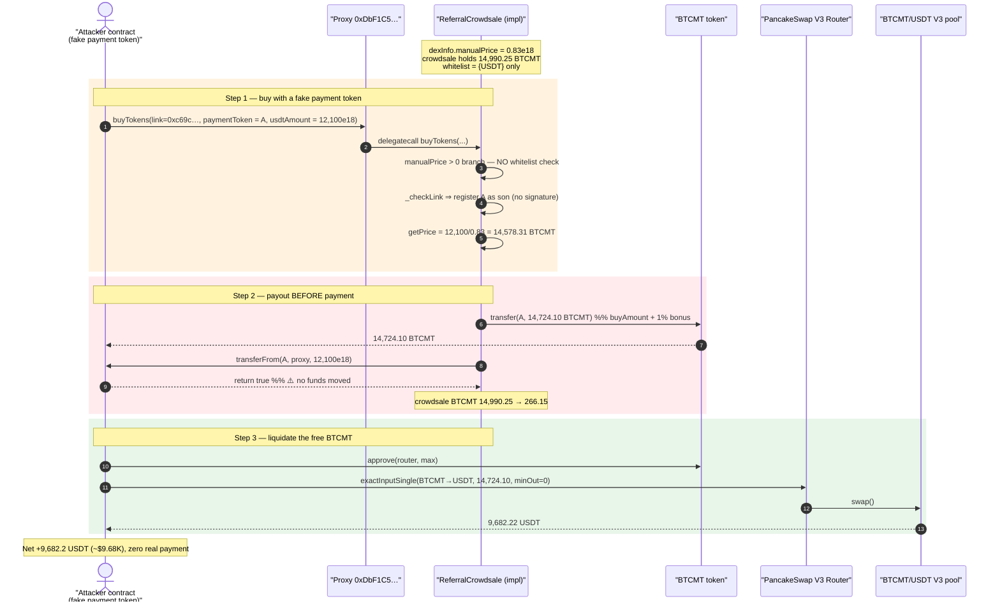
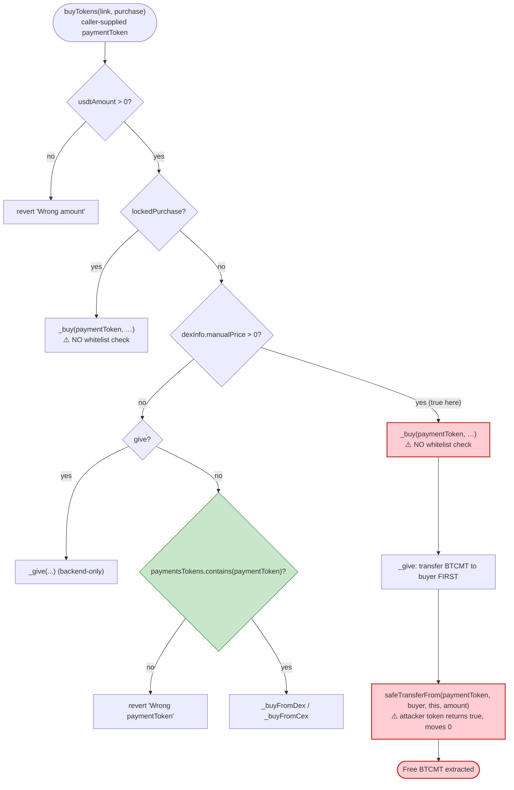
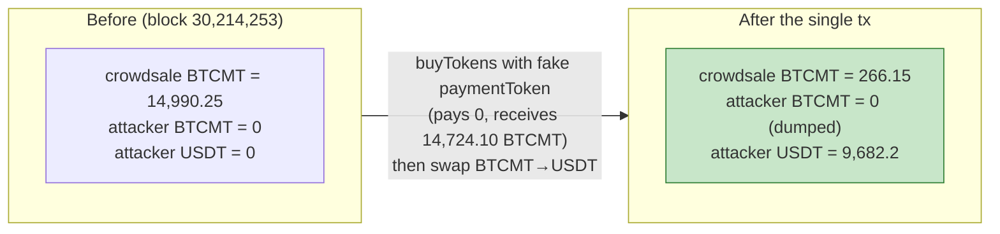

# Minto Finance Exploit — Free BTCMT Minting via Unvalidated `paymentToken` in `ReferralCrowdsale.buyTokens()`

> **Reproduction:** the PoC compiles & runs in an isolated Foundry project at
> [this project folder](.) (the umbrella DeFiHackLabs repo contains many unrelated
> PoCs that fail to whole-compile, so this one was extracted).
> Full verbose trace: [output.txt](output.txt).
> Verified vulnerable source: [ReferralCrowdsale.sol](sources/ReferralCrowdsale_0d116e/ReferralCrowdsale.sol).

---

## Key info

| | |
|---|---|
| **Loss** | ~$9.68K — **14,724.1 BTCMT** drained from the crowdsale, swapped to **9,682.2 BUSD/USDT** |
| **Vulnerable contract** | `ReferralCrowdsale` (logic) behind a transparent proxy — proxy [`0xDbF1C56b2aD121Fe705f9b68225378aa6784f3e5`](https://bscscan.com/address/0xDbF1C56b2aD121Fe705f9b68225378aa6784f3e5), impl [`0x0d116ed40831fef8e21ece57c8455ae3b1e4041b`](https://bscscan.com/address/0x0d116ed40831fef8e21ece57c8455ae3b1e4041b#code) |
| **Victim asset / pool** | BTCMT token [`0x410a56541bD912F9B60943fcB344f1E3D6F09567`](https://bscscan.com/address/0x410a56541bD912F9B60943fcB344f1E3D6F09567); sold into PancakeSwap V3 BTCMT/USDT 0.01% pool `0x11bd737757B86c16646313FdF9e86681dd3F065F` |
| **Attacker EOA** | [`0xc5001f60db92afcc23177a6c6b440a4226cb58bf`](https://bscscan.com/address/0xc5001f60db92afcc23177a6c6b440a4226cb58bf) |
| **Attacker contract** | [`0xba91db0b31d60c45e0b03e6d515e45fcabc7b1cd`](https://bscscan.com/address/0xba91db0b31d60c45e0b03e6d515e45fcabc7b1cd) |
| **Attack tx** | [`0x53be95dc8ffbc80060215133f76f48df35deef3cd7e1803e24b1e2f8aa53440b`](https://explorer.phalcon.xyz/tx/bsc/0x53be95dc8ffbc80060215133f76f48df35deef3cd7e1803e24b1e2f8aa53440b) |
| **Chain / block / date** | BSC / 30,214,253 / 2023-07-23 (12:36:35 UTC) |
| **Compiler** | Logic: Solidity v0.8.16, optimizer 200 runs · Proxy: v0.8.9 |
| **Bug class** | Missing input validation — unvalidated, attacker-controlled `paymentToken` + send-before-collect ordering ⇒ free token minting (a.k.a. "fake payment token" / unchecked external token) |

---

## TL;DR

`ReferralCrowdsale` sells BTCMT for stablecoins. The buyer passes a `paymentToken` address and a
`usdtAmount`. The crowdsale computes how much BTCMT that buys (`getPrice`), **sends the BTCMT to the
buyer first**, and only afterwards pulls the payment with
`TransferHelper.safeTransferFrom(payToken, msgSender, this, payAmount)`
([ReferralCrowdsale.sol:2500-2514](sources/ReferralCrowdsale_0d116e/ReferralCrowdsale.sol#L2500-L2514)).

The fatal gap: `buyTokens` **never validates `paymentToken` on the `manualPrice` price path**. When
`dexInfo.manualPrice > 0` the code goes straight to `_buy(purchaseParams.paymentToken, …)` with no
`paymentsTokens.contains(payToken)` check ([:2137-2145](sources/ReferralCrowdsale_0d116e/ReferralCrowdsale.sol#L2137-L2145)) —
that whitelist check only exists on the *other* (`else`) branch ([:2155-2159](sources/ReferralCrowdsale_0d116e/ReferralCrowdsale.sol#L2155-L2159)).

So the attacker sets `paymentToken = <their own contract>`, whose `transferFrom(...)` simply
`return true` without moving any funds. The crowdsale:

1. prices `12,100 "USDT"` at the admin `manualPrice` of `0.83 USDT/BTCMT` ⇒ **14,578.31 BTCMT**,
2. adds a 1% referral bonus ⇒ **14,724.10 BTCMT**, sends it to the attacker,
3. calls `attacker.transferFrom(attacker, this, 12,100e18)` to "collect" payment — which is a no-op
   that returns `true`.

The attacker walks away with **14,724.10 BTCMT for free** and dumps it into the PancakeSwap V3
BTCMT/USDT pool for **9,682.2 USDT (~$9.68K)**.

---

## Background — what `ReferralCrowdsale` does

`ReferralCrowdsale` ([source](sources/ReferralCrowdsale_0d116e/ReferralCrowdsale.sol)) is Minto
Finance's referral-based token sale. It holds a stock of BTCMT and lets users buy it for a whitelisted
stablecoin, paying out referral bonuses to "fathers" (referrers) and "sons" (referees).

It supports several pricing modes, selected inside `buyTokens`
([:2092-2179](sources/ReferralCrowdsale_0d116e/ReferralCrowdsale.sol#L2092-L2179)):

- **Locked purchase** — fixed `lockedPrice` per config index.
- **Manual price** — when an admin has set `dexInfo.manualPrice > 0`, BTCMT is priced at a fixed
  off-market rate instead of the live pair price.
- **Give** (backend-only) — gift BTCMT without payment.
- **DEX price** — price BTCMT from the BTCMT/USDT pair reserves (`getPrice`'s pair branch).
- **CEX price** — a signed off-chain quote (`_buyFromCex`).

The relevant on-chain configuration at the fork block (read via `cast call … dexInfo()` at block
30,214,253):

| Parameter | Value | Meaning |
|---|---|---|
| `dexInfo.enabled` | `true` | DEX pricing is on … |
| `dexInfo.manualPrice` | **0.83e18** (8.3e17) | …but a manual price was *also* set, so the manual branch wins |
| `dexInfo.floorPrice` | 1.0e18 | minimum acceptable price — **only enforced when `manualPrice == 0`** |
| BTCMT `decimals()` | 18 | |
| BTCMT held by the crowdsale | **14,990.25 BTCMT** | the entire prize the attacker could drain |
| Whitelisted payment token | USDT `0x55d3…7955` | the *only* legitimate `paymentToken` |

The decisive facts: the crowdsale held **14,990 BTCMT**, an admin had set a **fixed manual price**,
and the manual-price branch of `buyTokens` performs **no payment-token whitelist check** at all.

---

## The vulnerable code

### 1. `buyTokens` — the manual-price branch never whitelists `paymentToken`

```solidity
function buyTokens(
    LinkParameters memory linkParams,
    PurchaseParameters memory purchaseParams
) external {
    require(purchaseParams.usdtAmount > 0, "Wrong amount");
    ...
    if (purchaseParams.lockedPurchase) {
        _buy(purchaseParams.paymentToken, ... );          // locked branch
    } else if (dexInfo.manualPrice > 0) {                 // ⚠️ MANUAL-PRICE BRANCH
        _buy(
            purchaseParams.paymentToken,                  // ⚠️ attacker-supplied, UNCHECKED
            purchaseParams.usdtAmount,
            getPrice(purchaseParams.usdtAmount, false, 0),
            0,
            bonusPercent,
            linkParams.linkHash
        );
    } else if (purchaseParams.give) {
        _give(...);                                       // backend-only
    } else {
        require(                                          // ✅ whitelist check — but ONLY here
            paymentsTokens.contains(purchaseParams.paymentToken),
            "Wrong paymentToken"
        );
        if (dexInfo.enabled) { _buyFromDex(...); } else { _buyFromCex(...); }
    }
}
```

([ReferralCrowdsale.sol:2092-2179](sources/ReferralCrowdsale_0d116e/ReferralCrowdsale.sol#L2092-L2179))

The `paymentsTokens.contains(...)` guard that restricts payment to whitelisted stablecoins lives
*only* in the final `else` branch ([:2155-2159](sources/ReferralCrowdsale_0d116e/ReferralCrowdsale.sol#L2155-L2159)).
The locked and manual-price branches call `_buy` with the raw, caller-supplied `paymentToken` and no
whitelist check whatsoever. With `manualPrice` set, the manual branch is reached by *any* caller.

### 2. `_buy` — sends BTCMT first, then "collects" payment from the unchecked token

```solidity
function _buy(
    address payToken,
    uint256 payAmount,
    uint256 buyAmount,
    uint256 lockedDuration,
    uint256 bonusPercent,
    bytes32 link
) internal {
    if (lockedDuration == 0 && dexInfo.manualPrice == 0)   // ⚠️ floor check SKIPPED when manualPrice > 0
        require(
            (10**IERC20Metadata(BTCMT).decimals() * payAmount) / buyAmount >= dexInfo.floorPrice,
            "Under floor price"
        );

    _give(_msgSender(), payAmount, buyAmount, lockedDuration, bonusPercent, link); // ⚠️ sends BTCMT NOW

    TransferHelper.safeTransferFrom(                       // ⚠️ collects payment AFTER
        payToken, _msgSender(), address(this), payAmount
    );
}
```

([ReferralCrowdsale.sol:2484-2515](sources/ReferralCrowdsale_0d116e/ReferralCrowdsale.sol#L2484-L2515))

Two compounding problems here:

- **Send-before-collect ordering.** `_give` transfers BTCMT out *before* the payment is pulled. If the
  payment pull is a no-op, the BTCMT is already gone.
- **Payment correctness is delegated to `payToken` itself.** `safeTransferFrom` only reverts if the
  token returns `false`/reverts. A malicious `payToken` whose `transferFrom` returns `true` while
  moving nothing passes the check trivially.

### 3. `_give` — unconditionally transfers BTCMT to the buyer

```solidity
function _give( address sender, uint256 payAmount, uint256 buyAmount,
                uint256 lockedDuration, uint256 bonusPercent, bytes32 link ) internal {
    uint256 bonusAmount = (buyAmount * bonusPercent) / DENOMINATOR;   // 1% bonus
    if (lockedDuration == 0)
        require(buyAmount + bonusAmount <= IERC20(BTCMT).balanceOf(address(this)), "Not enough BTCMT");
    ...
    else
        TransferHelper.safeTransfer(BTCMT, sender, (bonusAmount - fatherAmount) + buyAmount);  // ⚠️ BTCMT out
    ...
}
```

([ReferralCrowdsale.sol:2517-2579](sources/ReferralCrowdsale_0d116e/ReferralCrowdsale.sol#L2517-L2579))

The only solvency check is "the contract has enough BTCMT" — nothing ties the outflow to *received*
payment.

### 4. `getPrice` (manual branch) — the price the attacker buys at

```solidity
} else if (dexInfo.manualPrice > 0) {
    return (payAmount * 10**IERC20Metadata(BTCMT).decimals()) / dexInfo.manualPrice;
}
```

([ReferralCrowdsale.sol:2230-2233](sources/ReferralCrowdsale_0d116e/ReferralCrowdsale.sol#L2230-L2233))

With `payAmount = 12,100e18` and `manualPrice = 0.83e18`:
`buyAmount = 12,100e18 · 1e18 / 0.83e18 = 14,578.313253012… BTCMT` — matching the
`PurchaseWithBonuses(boughtAmount = 14578313253012048192771)` event in the trace.

---

## Root cause — why it was possible

The protocol treats `paymentToken` as **trusted data** and `transferFrom`'s boolean as **proof of
payment**, while letting the *caller* choose both the token and the price branch.

Three design decisions compose into a critical bug:

1. **The payment-token whitelist is enforced on only one of four price branches.** The
   `paymentsTokens.contains(payToken)` check is in the trailing `else` branch
   ([:2155-2159](sources/ReferralCrowdsale_0d116e/ReferralCrowdsale.sol#L2155-L2159)) but is *absent*
   from the locked and `manualPrice > 0` branches. Once an admin set a manual price, the unchecked
   manual branch became the default path for ordinary buyers — and for the attacker.
2. **No proof that payment was actually received.** `_buy` relies on `safeTransferFrom` not reverting.
   It never measures the crowdsale's own balance before/after, so a token that lies (`return true`,
   moves nothing) satisfies the contract. The attacker's PoC contract is exactly such a token — its
   `transferFrom` is `return true;` ([test/MintoFinance_exp.sol:100-102](test/MintoFinance_exp.sol#L100-L102)).
3. **Effects-before-interactions / send-before-collect ordering.** `_give` pushes BTCMT out before the
   (no-op) payment pull, so even a "pull then check balance" mitigation would need to also reorder the
   transfers.

The fixed `manualPrice` and the skipped floor check are convenience, not necessity — but they made the
attack clean: a deterministic 0.83 USDT/BTCMT rate with no live-pair dependence and no floor-price
revert ([:2492-2498](sources/ReferralCrowdsale_0d116e/ReferralCrowdsale.sol#L2492-L2498)).

---

## Preconditions

- `dexInfo.manualPrice > 0` — true at the fork block (`0.83e18`), so `buyTokens` routes to the
  unchecked manual-price branch for any caller.
- The crowdsale holds BTCMT — 14,990.25 BTCMT at the block; the `_give` solvency check requires
  `buyAmount + bonus ≤ balance`, so the attacker sized `usdtAmount = 12,100` to stay just under it
  (14,724.10 ≤ 14,990.25 ✓).
- A reachable, enabled `linkHash`. The attacker reused an existing enabled link
  `0xc69c…3814` (owner `0x602abF…89A0`) so `_checkLink` registered the attacker as a new "son" without
  needing a `SIGNER_ROLE` signature ([:2581-2606](sources/ReferralCrowdsale_0d116e/ReferralCrowdsale.sol#L2581-L2606)).
  The 1% referral bonus the owner's stake conferred is incidental free upside.
- **No capital required.** The "payment" is a no-op call into the attacker's own contract; the only
  cost is gas. The stolen BTCMT is immediately liquidated on-chain, so the whole thing is a single
  self-funded transaction.

---

## Attack walkthrough (with on-chain numbers from the trace)

All figures are taken directly from [output.txt](output.txt).

| # | Step | Call / event | BTCMT moved | Effect |
|---|------|--------------|------------:|--------|
| 0 | **Start** | `BTCMT.balanceOf(attacker)` | 0 | Attacker holds nothing. |
| 1 | **Buy with fake token** | `proxy.buyTokens(link=0xc69c…3814, {paymentToken = attacker, usdtAmount = 12,100e18, give=false, locked=false})` → delegatecalls impl | — | Routes to the `manualPrice > 0` branch. |
| 2 | **Register as son** | `emit NewUserRegistered(attacker, 0x602abF…, 0xc69c…)` | — | `_checkLink` registers the attacker under the existing enabled link (no signature needed). |
| 3 | **Price it** | `getPrice` (manual): `12,100e18·1e18/0.83e18` | — | `buyAmount = 14,578.31 BTCMT`. |
| 4 | **Bonus + payout** | `_give` → `BTCMT.transfer(attacker, 14,724.10e18)`; `emit PurchaseWithBonuses(boughtAmount=14,578.31, sonBonus=145.78, amountLeft=266.15)` | **14,724.10 → attacker** | 1% bonus (145.78 BTCMT) added; crowdsale BTCMT balance falls 14,990.25 → 266.15. |
| 5 | **"Pay"** | `_buy` → `attacker.transferFrom(attacker, proxy, 12,100e18)` returns `true` | **0** | No funds move — payment is a lie. |
| 6 | **Approve router** | `BTCMT.approve(0x13f4…68Dd4, type(uint256).max)` | — | Approve PancakeSwap V3 SmartRouter. |
| 7 | **Dump** | `router.exactInputSingle(BTCMT→USDT, fee=100, amountIn=14,724.10e18, minOut=0)` → pool `0x11bd…065F` `swap()` | 14,724.10 BTCMT in | Pool sends **9,682.22 USDT** out to the attacker. |
| 8 | **Cash out** | `USDT.balanceOf(attacker)` | — | Final **9,682.23 USDT** (incl. 0.01 dust pre-balance). |

### Why the numbers line up

- **Manual price math:** `12,100 / 0.83 = 14,578.3132…` → `boughtAmount = 14578313253012048192771` (trace).
- **Bonus:** `14,724.096… − 14,578.313… = 145.783…` BTCMT = **exactly 100 bps** of `boughtAmount`
  → `sonBonus = 145783132530120481927` (trace). The link owner's stake level granted a 1% buyer bonus,
  so the attacker even received *more* BTCMT than they "paid" for.
- **Solvency:** `14,724.096… ≤ 14,990.25` (contract balance) ✓ — the attacker's `usdtAmount` was tuned
  to drain almost the entire stock without tripping the `"Not enough BTCMT"` guard.
- **Liquidation:** the PancakeSwap V3 0.01%-fee pool returned `−9682220499776226424581` token1 (USDT)
  for `14724096385542168674698` token0 (BTCMT) → ~**9,682.22 USDT** (`Swap` event, trace).

### Profit / loss accounting

| Direction | Asset | Amount |
|---|---|---:|
| Paid in (real) | — | **0** (only gas) |
| Received from crowdsale | BTCMT | 14,724.10 |
| Sold on PancakeSwap V3 | BTCMT → USDT | 14,724.10 → 9,682.22 |
| **Net profit** | **USDT** | **≈ 9,682.2 (~$9.68K)** |

The loss is the BTCMT the crowdsale gave away for nothing; its USDT-denominated value (~$9.68K) is the
realized theft after the attacker liquidated.

---

## Diagrams

### Sequence of the attack



### Decision flow inside `buyTokens` — the missing guard



### Crowdsale BTCMT balance — before vs. after



---

## Remediation

1. **Whitelist `paymentToken` on every price branch.** Move the
   `require(paymentsTokens.contains(payToken), "Wrong paymentToken")` check to the top of `buyTokens`
   (or into `_buy`) so it covers the locked and `manualPrice > 0` paths, not just the trailing `else`.
   This single change defeats the attack — the attacker's own contract is not a whitelisted token.
2. **Verify payment by balance delta, not by a returned boolean.** Measure
   `IERC20(payToken).balanceOf(address(this))` before and after the pull and
   `require(after - before == payAmount)`. A lying token then cannot satisfy the contract even if it
   were whitelisted.
3. **Collect payment before paying out (checks-effects-interactions).** Reorder `_buy` so
   `safeTransferFrom(payToken, …)` (and its balance-delta assertion) executes *before* `_give` sends any
   BTCMT.
4. **Don't let `manualPrice` silently disable the floor check.** The floor-price guard is skipped when
   `manualPrice > 0` ([:2492-2498](sources/ReferralCrowdsale_0d116e/ReferralCrowdsale.sol#L2492-L2498)).
   Enforce a sanity floor on the manual price too, so a misconfigured/low manual price cannot be combined
   with other gaps to undersell the inventory.
5. **Treat all caller-supplied addresses as untrusted.** Any external-token address coming from
   calldata must be validated against an allowlist *and* interacted with using balance-delta accounting,
   never trusted ERC20 return values.

---

## How to reproduce

The PoC was extracted into a standalone Foundry project (the umbrella DeFiHackLabs repo has many
unrelated PoCs that fail to compile under a whole-project `forge build`):

```bash
_shared/run_poc.sh 2023-07-MintoFinance_exp --mt testExploit -vvvvv
```

- RPC: a **BSC archive** endpoint is required — the fork pins block 30,214,253 (July 2023). Most public
  BSC RPCs prune that far back and fail with `header not found` / `missing trie node`; an archive node
  such as `https://bsc-mainnet.public.blastapi.io` serves the historical state.
- Result: `[PASS] testExploit()`.

Expected tail ([output.txt](output.txt)):

```
Ran 1 test for test/MintoFinance_exp.sol:MintoFinance_exp
[PASS] testExploit() (gas: 500215)
Logs:
  BTCMT balance before the Exploit 0
  BTCMT balance after the Exploit 14724096385542168674698
  Swap BTCMT -> BUSD through pancakeSwap
  BUSD balance after the Exploit 9682230499776226424581
```

---

*References: PoC header in [test/MintoFinance_exp.sol](test/MintoFinance_exp.sol); attack analysis thread linked therein. SlowMist Hacked — https://hacked.slowmist.io/ (Minto Finance, BSC, ~$9K).*
