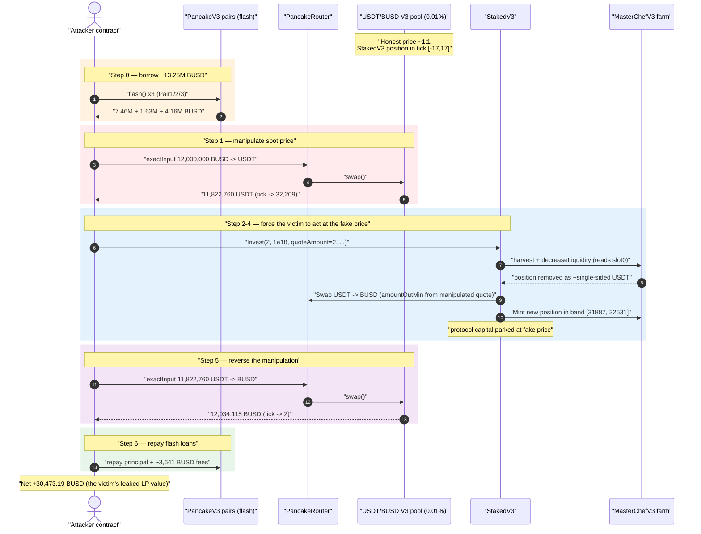
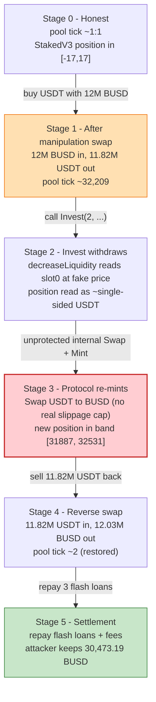
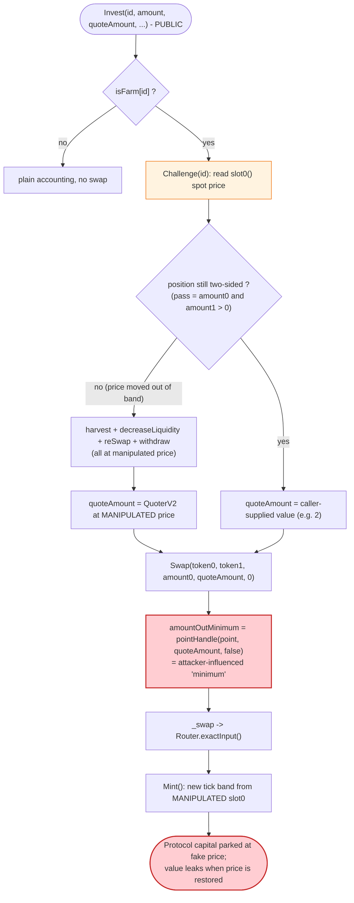

# NewFi / StakedV3 Exploit — Flash-Loan Price Manipulation of an Unprotected Internal V3 Swap

> **Reproduction:** the PoC compiles & runs in an isolated Foundry project at
> [this project folder](.) (the umbrella DeFiHackLabs repo contains many PoCs
> that do not whole-compile, so this one is extracted standalone).
> Full verbose trace: [output.txt](output.txt).
> Verified vulnerable source (multi-file blob): [sources/StakedV3_b8dc09/StakedV3.sol](sources/StakedV3_b8dc09/StakedV3.sol)
> (extracted single-file copy: [sources/StakedV3_b8dc09/_StakedV3_extracted.sol](sources/StakedV3_b8dc09/_StakedV3_extracted.sol)).

---

## Key info

| | |
|---|---|
| **Loss** | ~$31K — **30,473.19 BUSD** net profit to the attacker |
| **Vulnerable contract** | `StakedV3` — [`0xB8dC09Eec82CaB2E86C7EdC8DD5882dd92d22411`](https://bscscan.com/address/0xb8dc09eec82cab2e86c7edc8dd5882dd92d22411#code) |
| **Victim pool** | PancakeSwap V3 **USDT/BUSD 0.01%** pool — `0x4f3126d5DE26413AbDCF6948943FB9D0847d9818` (StakedV3's farmed LP position, tokenId `138703`) |
| **Attacker EOA** | [`0x3a10408fd7a2b2a43bd14a17c0d4568430b93132`](https://bscscan.com/address/0x3a10408fd7a2b2a43bd14a17c0d4568430b93132) |
| **Attacker contract** | [`0x18703a4fd7b3688607abf25424b6ab304def2512`](https://bscscan.com/address/0x18703a4fd7b3688607abf25424b6ab304def2512) |
| **Attack tx** | [`0x557628123d137ea49564e4dccff5f5d1e508607e96dd20fe99a670519b679cb5`](https://bscscan.com/tx/0x557628123d137ea49564e4dccff5f5d1e508607e96dd20fe99a670519b679cb5) |
| **Chain / block / date** | BSC / fork at **30,043,573** / ~July 17, 2023 |
| **Compiler (victim)** | Solidity `v0.8.10+commit.fc410830`, optimizer **200 runs** |
| **Bug class** | Flash-loan oracle/AMM price manipulation of an internal swap with **no slippage protection** + retail-supplied `amountOutMinimum` |

---

## TL;DR

`StakedV3` is a "single-token deposit, auto-Farm" wrapper around a PancakeSwap V3 concentrated-liquidity
position. When a user calls `Invest(...)`, the contract reads the **live, on-chain spot price** of its
managed V3 pool (`slot0()` / `QuoterV2`) to decide how much of the deposited token to swap into the
paired token, then re-mints liquidity. Every internal swap is routed through
[`_swap()`](sources/StakedV3_b8dc09/_StakedV3_extracted.sol#L828-L884), whose `amountOutMinimum` /
`amountInMaximum` is derived from a **caller-controlled `quoteAmount`** (here passed as `2`), giving the
protocol **effectively zero slippage protection**.

The attacker:

1. **Flash-borrows ~13.25M BUSD** across three PancakeSwap V3 pairs.
2. **Swaps 12,000,000 BUSD → USDT** through the USDT/BUSD 0.01% pool, pushing the pool's tick from
   **29,796 → 32,209** (BUSD made artificially cheap vs. USDT).
3. **Calls `StakedV3.Invest(2, 1e18, 2, 1, 7, deadline)`** with a token already deposited. Because
   pool `id = 2` has `isFarm = true`, `Invest` runs the full Farm-management path: it
   `harvest`s, `decreaseLiquidity`s (pulling the protocol's real liquidity out of the pool **at the
   manipulated price** — receiving 1,629 USDT + 2,097 BUSD instead of the true mix), then performs an
   **unprotected internal `Swap` and re-`Mint`** into a tick range computed from the manipulated
   `slot0`, locking the protocol's funds into a mispriced position.
4. **Reverses the manipulation** — swaps the 11.82M USDT back to BUSD, restoring the pool and walking
   away with **more BUSD than it injected**.

Because all positioning is done with flash-loaned capital that is repaid in the same transaction, the
attacker's only net change is the **30,473.19 BUSD** drained from the protocol's mispriced LP — roughly
$31K.

---

## Background — what StakedV3 does

`StakedV3` ([source](sources/StakedV3_b8dc09/_StakedV3_extracted.sol)) lets a user deposit a *single*
token into a "project" (`pool` struct, indexed by `id`). For projects flagged `isFarm[id] = true`, the
contract automatically converts the deposit into a two-sided PancakeSwap V3 concentrated-liquidity
position and stakes the position NFT into a MasterChefV3 farm. The audited project here is `id = 2`,
a **USDT/BUSD** pair on the 0.01% (`fee = 100`) V3 pool.

The relevant moving parts:

- **`Invest`** ([:450-511](sources/StakedV3_b8dc09/_StakedV3_extracted.sol#L450-L511)) — the deposit
  entry point. For a farmed project it harvests, optionally rebalances, swaps one token into the other
  per `lpRate`, and mints/appends liquidity.
- **`Challenge`** ([:709-750](sources/StakedV3_b8dc09/_StakedV3_extracted.sol#L709-L750)) — reads the
  pool's **current** `slot0()` price and the position's tick range, then asks `Compute` how much of each
  token the position currently represents. The result drives every downstream decision.
- **`Swap` → `_swap`** ([:806-884](sources/StakedV3_b8dc09/_StakedV3_extracted.sol#L806-L884)) — the
  internal router wrapper that actually trades the protocol's tokens.
- **`MintTick` / `Mint`** ([:590-707](sources/StakedV3_b8dc09/_StakedV3_extracted.sol#L590-L707)) —
  recomputes a tick range from the **current** `slot0` and mints a fresh position.

The on-chain pool parameters at the fork block (from the trace):

| Parameter | Value |
|---|---|
| V3 pool | `0x4f3126…9818` (USDT/BUSD, fee 100 = 0.01%) |
| StakedV3 farm position `tokenId` | `138703` |
| Position tick range | `[-17, 17]` (tight, near 1:1 — appropriate for a stable pair) |
| Pool tick **before** attack | implied by `sqrtPriceX96` read inside `Invest` |
| Pool tick **after** manipulation | **32,209** (`slot0` returns `3.965e29, 32209, …`) |
| Protocol position liquidity removed | `22,267,725,135,386,876,207,004,445` (≈2.23e25) |

The position lives in the `[-17, 17]` tick band — i.e. it only holds two-sided liquidity while the
pool price is within ~0.17% of 1:1. The attacker's job is to shove the pool price *far outside* that
band before forcing the protocol to act on it.

---

## The vulnerable code

### 1. Pricing is read live from the spot pool

`Challenge` and `MintTick` both read `IUniswapV3Pool(pool).slot0()` — the **instantaneous** pool price —
with no TWAP and no sanity check:

```solidity
// Challenge() — sources/StakedV3_b8dc09/_StakedV3_extracted.sol#L726
(sqrtPriceX96,,,,,,) = IUniswapV3Pool(pools[id].pool).slot0();
...
(amount0,amount1) = ICompute(compute).getAmountsForLiquidity(
    sqrtPriceX96, sqrtRatioAX96, sqrtRatioBX96, tokenPosition.liquidity);
```

Whatever the spot price is *at call time* is taken as ground truth for how much each token the
position represents — and that number then decides how much liquidity is removed and how the
protocol rebalances.

### 2. The internal swap has no real slippage guard

Inside `Invest`, the protocol swaps the deposit token into the paired token via
[`Swap`](sources/StakedV3_b8dc09/_StakedV3_extracted.sol#L806-L826):

```solidity
function Swap(uint id, address tokenIn, address tokenOut,
             uint inAmount, uint outAmount, uint side) private returns (uint,uint) {
    bytes memory path;
    if(side == 0) {
        path = abi.encodePacked(tokenIn, pools[id].fee, tokenOut);
        outAmount = pointHandle(pools[id].point, outAmount, false); // ← "min out" = quote * (1 - point)
    } ...
    if(inAmount > 0 && outAmount > 0) {
        _swap(tokenIn, inAmount, outAmount, path, side);
    }
}
```

`outAmount` (the eventual `amountOutMinimum`) is derived from `quoteAmount`, and inside `Invest` that
value is **whatever the caller passed in** when the rebalance branch is *not* taken:

```solidity
// Invest() — sources/StakedV3_b8dc09/_StakedV3_extracted.sol#L489-L493
if(!pass) {
    (quoteAmount,) = _amountOut(id, pools[id].token0, pools[id].token1, amount0, false);
}
// Exchange token0 -> token1: spend a fixed number of tokens
Swap(id, pools[id].token0, pools[id].token1, amount0, quoteAmount, 0);
```

The attacker calls `Invest(2, 1e18, /*quoteAmount=*/2, 1, 7, deadline)`. Either:
- the rebalance branch *is* taken and `quoteAmount` is re-derived from `QuoterV2` at the **manipulated**
  price (so the "minimum" already reflects the bad price), or
- it is not taken and the attacker's `quoteAmount = 2` (essentially zero) is used directly.

Either way, `amountOutMinimum` provides **no protection against the attacker's own manipulation** — it
is either attacker-supplied or computed from the very price the attacker just moved.

### 3. Liquidity is removed and re-minted at the manipulated price

`Invest` → `decreaseLiquidity` pulls the protocol's real position out of the pool using mins derived
from the manipulated `Challenge` amounts ([`_remove`, :561-588](sources/StakedV3_b8dc09/_StakedV3_extracted.sol#L561-L588)),
then `Mint` ([:621-659](sources/StakedV3_b8dc09/_StakedV3_extracted.sol#L621-L659)) recomputes a brand-new
tick band from the **manipulated** `slot0` and re-mints. The protocol's capital is thus parked into a
position that is correct *only* at the fake price; when the attacker reverts the price, that position is
left holding the wrong token mix and the difference is the attacker's profit.

---

## Root cause — why it was possible

A PancakeSwap V3 pool's `slot0()` price is a **manipulable spot oracle**: a single large swap moves it
arbitrarily within one transaction, and a flash loan supplies the capital for free. `StakedV3` trusts
that spot price in three compounding ways:

1. **Spot price as truth.** `Challenge`/`MintTick` read `slot0()` with no TWAP, no deviation bound, and
   no external oracle cross-check. The amount of liquidity to remove, the swap size, and the new tick
   band are all functions of a number the attacker controls.
2. **No protocol-enforced slippage.** The internal `Swap` uses an `amountOutMinimum` that is either the
   **caller's `quoteAmount`** or a quote taken at the manipulated price. A protocol that swaps its *own*
   user funds must price the trade against an independent reference; here it never does.
3. **Permissionless, parameter-driven trigger.** `Invest` is public and `nonReentrant`-guarded but not
   access-controlled, and the attacker supplies `id`, `quoteAmount`, etc. So the attacker chooses
   *exactly when* the reserve-removing rebalance happens — i.e. immediately after manipulating the pool.

The composition is the classic flash-loan price-manipulation pattern: *cheaply move a spot price → make
the victim transact at that price → move the price back*. The victim is not a lending protocol reading a
price feed, but an LP-management contract reading its own pool — the same flaw with extra steps.

---

## Preconditions

- A funded, farmed project exists (`pools[2].inStatus == true`, `isFarm[2] == true`) holding a real V3
  position with meaningful liquidity (tokenId `138703`, ~2.23e25 liquidity in the `[-17,17]` band).
- The attacker can deposit at least a dust amount of `token0` (1 BUSD here) to enter `Invest`.
- Working capital in BUSD to move the USDT/BUSD pool far outside the position's tick band. The attack
  borrows **~13.25M BUSD** across three flash sources and repays all of it in-tx, so it is fully
  **flash-loanable** — net attacker capital required is ~0.
- A V3 pool whose `slot0` spot price can be moved cheaply (the 0.01% USDT/BUSD pool, despite deep
  liquidity, is moved several thousand ticks by a 12M BUSD swap).

---

## Attack walkthrough (with on-chain numbers from the trace)

All figures are taken directly from the `Swap` / `Flash` / `DecreaseLiquidity` / `Mint` events in
[output.txt](output.txt). The exploit is one transaction; the three flash loans are nested and repaid
on the way out.

| # | Step | Trace evidence | Effect |
|---|------|----------------|--------|
| 0 | **Flash-borrow BUSD** from Pair1, Pair2, Pair3 | `Pair1::flash(…, 7,462,966.93 BUSD)` ([:1612](output.txt)), `Pair2::flash(…, 1,634,658.63 BUSD)` ([:1630](output.txt)), `Pair3::flash(…, 4,155,077.68 BUSD)` ([:1646](output.txt)) | ≈ **13.25M BUSD** in hand. |
| 1 | **Manipulate** — swap **12,000,000 BUSD → 11,822,760.36 USDT** through the V3 pool | `emit Swap(... amount1: 12,000,000 BUSD in, amount0: -11,822,760.36 USDT out, tick: 29796)` ([:1998](output.txt)) | Pool price driven so BUSD is cheap vs USDT; tick climbs toward 32,209. |
| 2 | **Trigger** — `StakedV3.Invest(2, 1e18, 2, 1, 7, deadline)` | `StakedV3::Invest(2, 1e18, 2, 1, 7, …)` ([:2133](output.txt)); pulls 1 BUSD via `transferFrom` ([:2134](output.txt)) | Enters the farmed-project rebalance path. |
| 3 | **Protocol withdraws at fake price** — `harvest` + `decreaseLiquidity` removes the whole position | `decreaseLiquidity(... liquidity: 2.226e25 ...) → (0, 37,853.24 USDT)` ([:2182-2196](output.txt)) | Position liquidated; `slot0` read back as **tick 32,209** ([:2149](output.txt)). |
| 4 | **Protocol mis-swaps & re-mints** — `Swap` 36,128.60 USDT → 1,627.17 BUSD, then `Mint` into a manipulated `[31887, 32531]` band | `Router::exactInput(... amountIn: 36,128.60 USDT, amountOutMinimum: 1,610.90 ...)` ([:2430](output.txt)); `emit Mint(... tickLower: 31887, tickUpper: 32531, amount0: 83.53 BUSD, amount1: 2,097.11 USDT)` ([:2524](output.txt)) | Protocol's capital re-parked into a position correct *only* at the fake price. |
| 5 | **Reverse manipulation** — swap **11,822,760.37 USDT → 12,034,115.35 BUSD** back through the pool | `emit Swap(... amount0: 11,822,760.37 USDT in, amount1: -12,034,115.35 BUSD out, tick: 2)` ([:2889](output.txt)) | Pool price restored; attacker receives **more BUSD than the 12M it spent**. |
| 6 | **Repay all three flash loans** (principal + fee) | `Flash(... amount1: 4,155,077.68, paid1: 2,077.54)` ([:3037](output.txt)); `Flash(... 1,634,658.63, paid1: 817.33)` ([:3053](output.txt)); `Flash(... 7,462,966.93, paid1: 746.30)` ([:3071](output.txt)) | ~3,641 BUSD total in flash fees paid. |
| 7 | **Profit** | `Attacker BUSD balance after exploit: 30473.187…` ([:1569](output.txt) / [:3080](output.txt)) | **+30,473.19 BUSD** kept. |

### Why the protocol bleeds value

In step 3 the protocol removes its `[-17, 17]` position while the pool is at tick ~32,209 — thousands of
ticks *above* its range — so the position reads as essentially **single-sided** (all USDT, per
`getAmountsForLiquidity` at the fake price). The protocol then swaps and re-mints into a tick band built
around the fake price (`[31887, 32531]`, step 4). When the attacker swaps the pool back to ~tick 2
(step 5), that freshly-minted position is now badly out of range and worth far less than the capital the
protocol put in. The lost LP value flows to the attacker as the favorable leg of its round-trip swap:
12,034,115.35 BUSD received vs. 12,000,000 BUSD spent on manipulation, minus flash fees, nets the
**30,473.19 BUSD** profit.

### Profit accounting (BUSD)

| Direction | Amount |
|---|---:|
| Out — manipulation swap (BUSD → USDT) | 12,000,000.00 |
| In — reverse swap (USDT → BUSD) | 12,034,115.35 |
| Out — flash fee, Pair3 | 2,077.54 |
| Out — flash fee, Pair2 | 817.33 |
| Out — flash fee, Pair1 | 746.30 |
| Out — deposit into Invest | 1.00 |
| **Net retained** | **≈ 30,473.19** |

The trace's final `Attacker BUSD balance after exploit: 30473.187414485918927438` confirms the figure
to the wei.

---

## Diagrams

### Sequence of the attack



### Pool / position state evolution



### The flaw inside `Invest` / `Swap`



---

## Remediation

1. **Do not price internal swaps off the spot pool.** Replace `slot0()`-derived sizing with a manipulation-
   resistant reference: a Uniswap/Pancake V3 **TWAP** (`observe()`), a Chainlink feed, or both with a
   deviation bound. The protocol must value its own funds against a price the caller cannot move in-tx.
2. **Enforce protocol-owned slippage.** `amountOutMinimum` / `amountInMaximum` for any swap of *protocol*
   funds must be computed by the contract from a trusted price and a small bounded slippage — never taken
   from the caller's `quoteAmount`, and never from a quote sampled at the just-moved spot price.
3. **Bound rebalance/withdraw on price deviation.** Before `decreaseLiquidity` + re-`Mint`, require that the
   live `slot0` price is within a tight band of the TWAP; revert otherwise. This makes the
   "withdraw-at-fake-price → re-mint-at-fake-price" sequence unreachable during manipulation.
4. **Sanity-check `Challenge` output.** If a tight stable-pair position (`[-17,17]`) reads as fully
   single-sided, that is a red flag for an out-of-range / manipulated price — treat it as a revert
   condition rather than a normal rebalance.
5. **Gate or rate-limit `Invest`'s rebalance path.** A permissionless function that liquidates and re-mints
   the entire protocol position on demand lets an attacker choose the moment of maximum manipulation.
   Restrict heavy rebalancing to a keeper/role, or make it a no-op when the pool price is anomalous.

---

## How to reproduce

The PoC was extracted into a standalone Foundry project (the umbrella DeFiHackLabs repo has several
unrelated PoCs that fail to compile under `forge test`'s whole-project build):

```bash
_shared/run_poc.sh 2023-07-NewFi_exp -vvvvv
```

- RPC: a **BSC archive** endpoint is required ([test/NewFi_exp.sol:40](test/NewFi_exp.sol#L40) forks at
  block `30,043,573`). The `bsc` alias in `foundry.toml` must point at an archive node that serves
  historical state; pruned public RPCs fail with `header not found` / `missing trie node`.
- The exploit logic lives in
  [`pancakeV3FlashCallback`](test/NewFi_exp.sol#L61-L77): three nested `flash()` calls accumulate BUSD,
  `BUSDToUSDT()` manipulates the price (12M BUSD), `StakedV3.Invest(2, 1 ether, 2, 1, 7, …)` triggers the
  victim, then `USDTToBUSD()` reverses it.

Expected tail:

```
  Attacker BUSD balance after exploit: 30473.187414485918927438

Suite result: ok. 1 passed; 0 failed; 0 skipped; finished in 157.90s
Ran 1 test suite in 168.88s: 1 tests passed, 0 failed, 0 skipped (1 total tests)
```

---

*Reference: DeFiHackLabs — NewFi/StakedV3, BSC, ~$31K. Attacker analysis thread: https://twitter.com/Phalcon_xyz/status/1680961588323557376*
