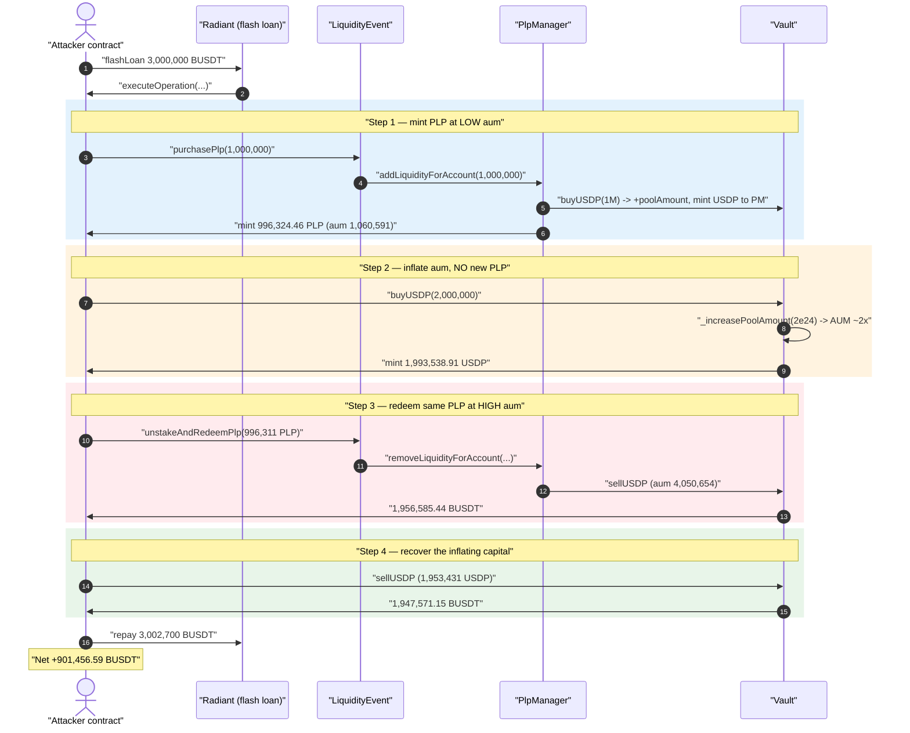
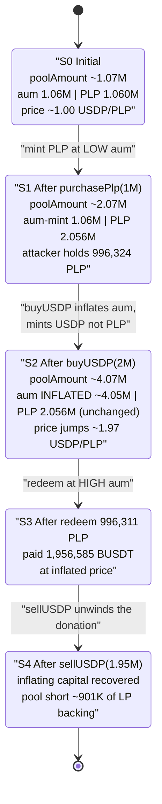
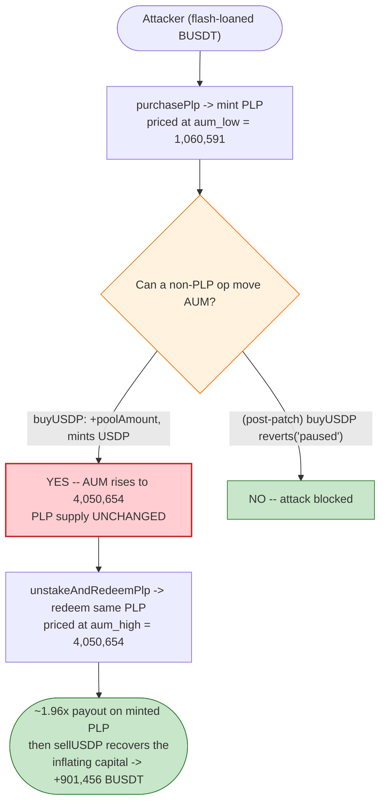

# Palmswap Exploit — PLP Share Inflation via Permissionless `buyUSDP()` AUM Manipulation

> **Reproduction:** the PoC compiles & runs in an isolated Foundry project at
> [this project folder](.) (the umbrella DeFiHackLabs repo contains several unrelated
> PoCs that do not compile under one whole-project build, so this one was extracted).
> Full verbose trace: [output.txt](output.txt).
> Verified (post-incident) sources under [sources/](sources/).

---

## Key info

| | |
|---|---|
| **Loss** | ~$901,456 — **901,456.59 BUSDT** net profit drained in a single transaction |
| **Vulnerable contracts** | `PlpManager` ([`0x6876B9804719d8D9F5AEb6ad1322270458fA99E0`](https://bscscan.com/address/0x6876B9804719d8D9F5AEb6ad1322270458fA99E0)) + `Vault` ([`0x806f709558CDBBa39699FBf323C8fDA4e364Ac7A`](https://bscscan.com/address/0x806f709558CDBBa39699FBf323C8fDA4e364Ac7A)) |
| **Victim** | Palmswap PLP liquidity pool (GMX-fork) — value held in the `Vault` |
| **Attacker EOA** | [`0xf84efa8a9f7e68855cf17eaac9c2f97a9d131366`](https://bscscan.com/address/0xf84efa8a9f7e68855cf17eaac9c2f97a9d131366) |
| **Attacker contract** | [`0x55252a6d50bfad0e5f1009541284c783686f7f25`](https://bscscan.com/address/0x55252a6d50bfad0e5f1009541284c783686f7f25) |
| **Attack tx** | [`0x62dba55054fa628845fecded658ff5b1ec1c5823f1a5e0118601aa455a30eac9`](https://bscscan.com/tx/0x62dba55054fa628845fecded658ff5b1ec1c5823f1a5e0118601aa455a30eac9) |
| **Chain / block / date** | BSC / 30,248,637 / July 24, 2023 |
| **Compiler** | Solidity v0.8.19, optimizer 200 runs |
| **Bug class** | Price/share-accounting manipulation — mint-and-redeem an LP share at two different per-share valuations within one transaction |
| **Funding** | Radiant (Aave-fork) flash loan of 3,000,000 BUSDT |

---

## TL;DR

Palmswap is a GMX fork on BSC. Its `PLP` liquidity token is priced off the `Vault`'s **Assets-Under-Management (AUM)**, and AUM is dominated by the Vault's `poolAmount`
([PlpManager.getAum :209](sources/PlpManager_ab77d4/contracts_core_PlpManager.sol#L209)). PLP is **minted** at `usdp * plpSupply / aum` and **redeemed** at `plpAmount * aum / plpSupply`
([_addLiquidity :371-373](sources/PlpManager_ab77d4/contracts_core_PlpManager.sol#L371-L373),
[_removeLiquidity :408](sources/PlpManager_ab77d4/contracts_core_PlpManager.sol#L408)).

The fatal property: **`Vault.buyUSDP()` increases `poolAmount` (and therefore AUM) but mints USDP, not PLP** — so it raises the value of *every existing PLP* without issuing new PLP
([Vault.buyUSDP :570](sources/Vault_e90571/contracts_core_Vault.sol#L570)). At the attack
block `buyUSDP`/`sellUSDP` were callable by anyone who is the configured manager path, and
the PLP cooldown was effectively `0`, so an attacker could, in **one transaction**:

1. Mint PLP at the *current* (low) AUM by calling `LiquidityEvent.purchasePlp()`.
2. Call `Vault.buyUSDP()` directly with a large BUSDT amount — this **doubles `poolAmount`/AUM** without minting any PLP, instantly raising the per-PLP redemption value ~1.96×.
3. Redeem the just-minted PLP via `LiquidityEvent.unstakeAndRedeemPlp()` at the *inflated* AUM, getting back ~1.96× the BUSDT that backed it.
4. Sell back the USDP it received in step 2 via `Vault.sellUSDP()`, recovering that capital too.

Everything was financed by a Radiant flash loan of 3M BUSDT. Net profit: **901,456.59 BUSDT**, repaid the 3M + 2,700 premium, and walked off with the difference — value taken from the honest PLP backing held in the Vault.

> **Note on sources.** The on-chain Vault *implementation* that ran at the fork block was
> `0xEA625E24a40B07F5094B390257f772580E757055`. The verified `Vault.sol` we downloaded
> ([sources/Vault_e90571](sources/Vault_e90571/contracts_core_Vault.sol)) is the **post-incident
> patched** logic implementation `0xe905…`, in which `buyUSDP()` and `increasePosition()` now start
> with `revert("paused")` ([Vault.sol :541](sources/Vault_e90571/contracts_core_Vault.sol#L541)).
> That `revert` *is the fix*: at the exploited block it was not present, which is exactly why the
> trace shows `Vault::buyUSDP` succeeding. All accounting lines referenced below (`_increasePoolAmount`,
> `getAum`, `_addLiquidity`, `_removeLiquidity`) are identical between the two versions.

---

## Background — Palmswap PLP accounting

Palmswap (a GMX/GLP fork) runs three contracts relevant here:

- **`Vault`** — custodies collateral (BUSDT). `buyUSDP()` mints the internal `USDP` stablecoin
  against deposited collateral and **credits `poolAmount`**; `sellUSDP()` burns USDP and returns
  collateral, **debiting `poolAmount`**
  ([Vault.buyUSDP :538-578](sources/Vault_e90571/contracts_core_Vault.sol#L538-L578),
  [Vault.sellUSDP :580-629](sources/Vault_e90571/contracts_core_Vault.sol#L580-L629)).
- **`PlpManager`** — the AMM-style LP layer. It mints/burns the `PLP` LP token, pricing it from the
  Vault's AUM ([PlpManager.getAum :195-262](sources/PlpManager_ab77d4/contracts_core_PlpManager.sol#L195-L262)).
- **`LiquidityEvent`** — the public, handler-whitelisted front door. `purchasePlp()` →
  `PlpManager.addLiquidityForAccount()`; `unstakeAndRedeemPlp()` → `PlpManager.removeLiquidityForAccount()`
  ([LiquidityEvent.purchasePlp :175-205](sources/LiquidityEvent_74fc94/contracts_events_LiquidityEvent.sol#L175-L205),
  [LiquidityEvent.unstakeAndRedeemPlp :245-271](sources/LiquidityEvent_74fc94/contracts_events_LiquidityEvent.sol#L245-L271)).

On-chain parameters at the fork block (read from the trace):

| Parameter | Value |
|---|---|
| `mintBurnFeeBasisPoints` | 30 bps (0.30%) |
| Vault `poolAmount` (BUSDT) before attack | ≈ 1,073,754 |
| `PLP.totalSupply()` before attack | 1,060,117.81 |
| AUM-in-USDP (max) before purchase | 1,060,591.30 |
| PLP cooldown enforced | **none** (mint + redeem succeed in the same block) |
| `buyUSDP` access at fork block | reachable (no `revert("paused")` yet) |

The whole attack hinges on one identity: **AUM ≈ `poolAmount × collateralPrice`, and `buyUSDP` moves `poolAmount` while leaving `PLP.totalSupply()` unchanged.**

---

## The vulnerable code

### 1. PLP is priced off `poolAmount`-driven AUM

```solidity
// PlpManager.getAum(bool maximise)
uint256 aum = aumAddition;
...
aum += (vault.poolAmount() * collateralTokenPrice) / (10**collateralDecimals);   // ← L208-210
...
return aumDeduction > aum ? 0 : aum - aumDeduction;
```
[PlpManager.sol :195-262](sources/PlpManager_ab77d4/contracts_core_PlpManager.sol#L195-L262)

### 2. Mint price vs. redeem price use the *current* AUM

```solidity
// _addLiquidity  — mint
uint256 aumInUsdp = getAumInUsdp(true);
uint256 plpSupply = IERC20Upgradeable(plp).totalSupply();
...
uint256 usdpAmount = vault.buyUSDP(address(this));
uint256 mintAmount = aumInUsdp == 0 ? usdpAmount
                                    : (usdpAmount * plpSupply) / aumInUsdp;   // ← L371-373
IMintable(plp).mint(_account, mintAmount);
```
[PlpManager.sol :350-390](sources/PlpManager_ab77d4/contracts_core_PlpManager.sol#L350-L390)

```solidity
// _removeLiquidity  — redeem
require(lastAddedAt[_account] + cooldownDuration <= block.timestamp, "...cooldown..."); // ← L400 (cooldown == 0)
uint256 aumInUsdp = getAumInUsdp(false);
uint256 plpSupply = IERC20Upgradeable(plp).totalSupply();
uint256 usdpAmount = (_plpAmount * aumInUsdp) / plpSupply;   // ← L408  redeem at CURRENT aum
...
uint256 amountOut = vault.sellUSDP(_receiver);
```
[PlpManager.sol :392-430](sources/PlpManager_ab77d4/contracts_core_PlpManager.sol#L392-L430)

### 3. `buyUSDP` inflates `poolAmount`/AUM without minting PLP

```solidity
// Vault.buyUSDP(address _receiver)   (at the exploited block: no revert)
uint256 mintAmount = (amountAfterFees * price) / PRICE_PRECISION;
...
_increaseUsdpAmount(mintAmount);
_increasePoolAmount(tokenAmount);   // ← L570  poolAmount += full deposit ⇒ AUM up
IUSDP(usdp).mint(_receiver, mintAmount);   // ← mints USDP to caller, NOT PLP
```
[Vault.sol :538-578](sources/Vault_e90571/contracts_core_Vault.sol#L538-L578),
[`_increasePoolAmount` :1616-1622](sources/Vault_e90571/contracts_core_Vault.sol#L1616-L1622)

Because `getAum()` reads `poolAmount` live, the AUM seen by `_removeLiquidity` (step "redeem")
is the AUM **after** the standalone `buyUSDP` injection — but the PLP supply the attacker is
redeeming against is the *pre-injection* supply.

---

## Root cause

Palmswap inherited GMX's design where the GLP/PLP price is `AUM / supply` and the Vault and LP
layer share a single AUM that **any deposit can move**. The bug is the combination of three facts:

1. **AUM is mutable by a non-PLP operation.** `buyUSDP()` raises `poolAmount` (the dominant AUM
   term) but mints USDP, not PLP. Therefore one `buyUSDP` call retroactively re-prices every
   outstanding PLP upward — a pure value transfer to current PLP holders.
2. **Mint and redeem are done against the *instantaneous* AUM with no per-block guard.** An attacker
   can mint PLP, then call `buyUSDP` to inflate AUM, then redeem the same PLP at the higher AUM —
   all atomically. The "fee" (30 bps each way) is far smaller than the ~1.96× re-pricing it bought.
3. **No cooldown / no atomic-cycle protection.** `_removeLiquidity` enforces
   `lastAddedAt + cooldownDuration <= block.timestamp`, but `cooldownDuration` was `0`, so
   mint-then-redeem inside one transaction passes the check. Nothing prevents the
   buy→inflate→redeem→un-inflate cycle in a single call frame.

In effect, the attacker temporarily "donated" 2M BUSDT of collateral to the pool to lift PLP's
price, harvested the lifted price on the PLP they had just minted, then withdrew the donated
collateral back via `sellUSDP`. The pool ends the transaction missing the honest LPs' backing.

> The post-incident patch confirms this analysis: the team did not change the math — they simply
> made `buyUSDP()` unreachable (`revert("paused")`), removing the operation that mutated AUM
> outside the PLP mint/redeem path.

---

## Preconditions

- `buyUSDP()` / `sellUSDP()` reachable by the attack path at the target block (true pre-patch).
- PLP `cooldownDuration == 0`, so mint and redeem can occur in the same block
  ([_removeLiquidity :400](sources/PlpManager_ab77d4/contracts_core_PlpManager.sol#L400)).
- LiquidityEvent not `stopped`/`eventEnded`, and the attacker eligible (no active whitelist window)
  ([purchasePlp :180-184](sources/LiquidityEvent_74fc94/contracts_events_LiquidityEvent.sol#L180-L184),
  [_checkEligible :482-486](sources/LiquidityEvent_74fc94/contracts_events_LiquidityEvent.sol#L482-L486)).
- Working capital to (a) mint a meaningful PLP position and (b) move AUM materially. Fully recovered
  intra-transaction ⇒ **flash-loanable**; the PoC sources 3M BUSDT from Radiant.

---

## Attack walkthrough (with on-chain numbers from the trace)

All numbers below are taken directly from the events in [output.txt](output.txt). BUSDT and USDP
are 18-decimals; figures are shown in whole tokens.

| # | Step (trace ref) | Vault `poolAmount` (BUSDT) | AUM-in-USDP | PLP supply | Attacker BUSDT Δ |
|---|------------------|--------------------------:|------------:|-----------:|----------------:|
| 0 | **Flash loan** 3,000,000 BUSDT from Radiant ([:79](output.txt#L79)) | ~1,073,754 | 1,060,591 | 1,060,117.81 | **+3,000,000** |
| 1 | **`purchasePlp(1,000,000)`** → internal `buyUSDP(1M)` mints 996,769 USDP to PlpManager; AddLiquidity mints **996,324.46 PLP** to attacker ([AddLiquidity :381](output.txt#L381)) | ~2,073,754 | (mint @ 1,060,591) | 2,056,442 | **−1,000,000** |
| 2 | **direct `Vault.buyUSDP(2,000,000)`** — `IncreasePoolAmount(2e24)`, mints **1,993,538.91 USDP** to attacker; **no PLP minted** ([BuyUSDP :513](output.txt#L513)) | ~4,073,754 | **inflated** | 2,056,442 | **−2,000,000** |
| 3 | **`unstakeAndRedeemPlp(996,311 PLP)`** — redeemed @ inflated **AUM 4,050,654**; burns PLP, mints/sends 1,962,472.86 USDP, `sellUSDP` returns **1,956,585.44 BUSDT** ([RemoveLiquidity :835](output.txt#L835)) | ~2,117,168 | 4,050,654 | 1,060,131 | **+1,956,585.44** |
| 4 | **`sellUSDP`** the ~1,953,431 USDP left from step 2 → **1,947,571.15 BUSDT** ([SellUSDP :938](output.txt#L938)) | ~169,597 | — | — | **+1,947,571.15** |
| 5 | **Repay flash loan** 3,000,000 + 2,700 premium ([:1005](output.txt#L1005)) | — | — | — | **−3,002,700** |

**Net:** `+3,000,000 − 1,000,000 − 2,000,000 + 1,956,585.44 + 1,947,571.15 − 3,002,700 = +901,456.59 BUSDT`
— exactly the value logged: `Attacker balance of BUSDT after exploit: 901,456.59`.

### Why the redeem pays ~1.96×

The attacker minted **996,324 PLP** by adding 1,000,000 BUSDT at AUM ≈ 1,060,591 (so ≈ 0.939 USDP/PLP).
Then `buyUSDP(2M)` lifted AUM to ≈ 4,050,654 while PLP supply stayed ≈ 2,056,442. Redeeming the same
996,311 PLP now yields `996,311 × 4,050,654 / 2,056,442 ≈ 1,962,472 USDP` ⇒ ≈ 1.97 USDP/PLP. The PLP
the attacker holds doubled in value because the 2M-BUSDT "donation" raised AUM for the whole supply,
and the attacker held a near-half share of that supply. The 2M of capital that did the lifting is
then fully recovered in step 4 — so the ~960K of "extra" USDP that the redeem produced is pure theft
from the pool's backing.

---

## Diagrams

### Sequence of the attack



### AUM / PLP-supply state machine (why the share re-prices)



### The flaw: one AUM, two pricing moments



---

## Profit / loss accounting (BUSDT)

| Direction | Amount |
|---|---:|
| Flash loan received | 3,000,000.00 |
| Spent — `purchasePlp` deposit | −1,000,000.00 |
| Spent — direct `buyUSDP(2M)` (AUM inflation) | −2,000,000.00 |
| Received — `unstakeAndRedeemPlp` (redeem at high AUM) | +1,956,585.44 |
| Received — `sellUSDP` (recover inflating capital) | +1,947,571.15 |
| Flash loan repay (3,000,000 + 2,700 premium) | −3,002,700.00 |
| **Net profit** | **+901,456.59** |

The ~901K profit is the slice of honest PLP backing that the attacker extracted by minting cheap,
re-pricing the pool with a temporary deposit, and redeeming dear — all inside one transaction.

---

## Remediation

1. **Never let a non-LP operation move the AUM that prices LP shares.** `buyUSDP`/`sellUSDP` must not
   mutate `poolAmount` in a way that re-prices existing PLP, or PLP must be priced off a value that
   excludes transient deposits. The team's own fix — making `buyUSDP()` `revert("paused")`
   ([Vault.sol :541](sources/Vault_e90571/contracts_core_Vault.sol#L541)) — eliminates the
   AUM-mutating operation entirely.
2. **Enforce a real PLP cooldown.** Set `cooldownDuration > 0` so PLP cannot be minted and redeemed
   in the same block/transaction, defeating atomic mint→inflate→redeem cycles
   ([_removeLiquidity :400](sources/PlpManager_ab77d4/contracts_core_PlpManager.sol#L400)).
3. **Use an AUM that is robust to single-tx manipulation.** Price PLP from a manipulation-resistant
   value (e.g., a snapshot / EMA of `poolAmount`, or excluding same-block collateral inflows) rather
   than the live `poolAmount`.
4. **Gate the manager surface.** Restrict `buyUSDP`/`sellUSDP` to the PlpManager mint/redeem path
   only, never as standalone externally-callable AUM levers, and verify handler whitelisting
   ([_validateHandler :432-434](sources/PlpManager_ab77d4/contracts_core_PlpManager.sol#L432-L434)).
5. **Add an LP round-trip invariant.** A mint-immediately-followed-by-redeem of the same PLP must
   never return more than was deposited minus fees; revert if it would.

---

## How to reproduce

The PoC was extracted into a standalone Foundry project (the umbrella DeFiHackLabs repo has several
unrelated PoCs that fail to compile under `forge test`'s whole-project build):

```bash
_shared/run_poc.sh 2023-07-Palmswap_exp --mt testExploit -vvvvv
```

- RPC: a **BSC archive** endpoint is required for fork block 30,248,637 (July 2023). `foundry.toml`
  uses `https://bsc-mainnet.public.blastapi.io`; most public BSC RPCs prune state this old and fail
  with `header not found` / `missing trie node`.
- Result: `[PASS] testExploit()`, with the attacker's BUSDT balance going from `0` to
  `901,456.59`.

Expected tail:

```
Ran 1 test for test/Palmswap_exp.sol:PalmswapTest
[PASS] testExploit() (gas: 2115361)
Logs:
  Attacker balance of BUSDT before exploit: 0.000000000000000000
  Attacker balance of BUSDT after exploit: 901456.592073151074931661

Suite result: ok. 1 passed; 0 failed; 0 skipped
```

---

*References: BlockSec analysis — https://twitter.com/BlockSecTeam/status/1683680026766737408 ;
SlowMist Hacked — https://hacked.slowmist.io/ (Palmswap, BSC, ~$901K).*
