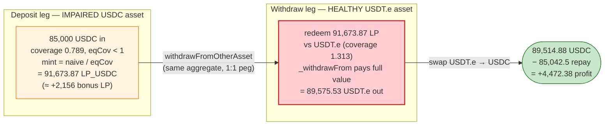
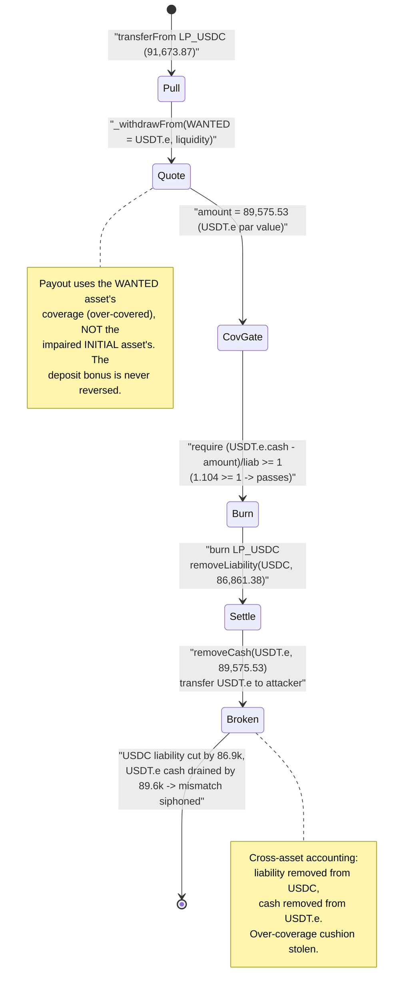

# Platypus Finance (2nd hack) — Coverage-Ratio Arbitrage via `withdrawFromOtherAsset`

> **Vulnerability classes:** vuln/logic/incorrect-state-transition · vuln/arithmetic/precision-loss

> One-line summary: depositing into an **under-covered** Platypus asset mints *bonus* LP (impairment
> gain), and `withdrawFromOtherAsset` then lets that LP be redeemed against a **different,
> well-covered** asset at full face value — converting a discounted position into full value and
> draining the difference.

> **Reproduction:** the PoC compiles & runs in this isolated Foundry project
> ([this folder](.)). Full verbose trace:
> [output.txt](output.txt). Verified vulnerable source:
> [contracts_pool_Pool.sol](sources/Pool_7e1333/contracts_pool_Pool.sol).

---

## Key info

| | |
|---|---|
| **Loss** | ~$51K (one of several attack txs); this PoC profits **4,472.378061 USDC** in a single flash-loan tx |
| **Vulnerable contract** | Platypus `Pool` (proxy [`0xbe52548488992Cc76fFA1B42f3A58F646864df45`](https://snowtrace.io/address/0xbe52548488992Cc76fFA1B42f3A58F646864df45), impl [`0x7e1333a39aBeD9A5664661957B80ba01D2702B1E`](https://snowtrace.io/address/0x7e1333a39abed9a5664661957b80ba01d2702b1e#code)) |
| **Victim assets / pool** | USDC asset `LP_USDC` ([`0x06f01502327De1c37076Bea4689a7e44279155e9`](https://snowtrace.io/address/0x06f01502327De1c37076Bea4689a7e44279155e9)) and USDT.e asset (`0xDEA7bf752Ef25301DbB2e9288338A1a9013EC194`), same aggregate account |
| **Attacker EOA** | [`0xc64afc460290ed3df848f378621b96cb7179521a`](https://snowtrace.io/address/0xc64afc460290ed3df848f378621b96cb7179521a) |
| **Attacker contract** | [`0x16a3c9e492dee1503f46dea84c52c6a0608f1ed8`](https://snowtrace.io/address/0x16a3c9e492dee1503f46dea84c52c6a0608f1ed8) |
| **Attack tx** | [`0x4b544e5ffb0420977dacb589a6fb83e25347e0685275a3327ee202449b3bfac6`](https://snowtrace.io/tx/0x4b544e5ffb0420977dacb589a6fb83e25347e0685275a3327ee202449b3bfac6) (multiple txs) |
| **Chain / block / date** | Avalanche C-Chain / fork block 32,470,736 / July 2023 |
| **Compiler** | Solidity 0.8.9 (Pool); PoC `^0.8.10` |
| **Bug class** | Broken accounting invariant — coverage-ratio / impairment-gain asymmetry across assets in one aggregate |

All numbers below are pulled directly from [output.txt](output.txt) and decoded from the
`CashAdded` / `CashRemoved` / `LiabilityAdded` / `LiabilityRemoved` / `Transfer` events and the
function return values. The PoC ends with `Attacker USDC balance after exploit: 4472.378061`
([output.txt:1569](output.txt#L1569)).

---

## TL;DR

Platypus is a single-sided stableswap. Each token has an `Asset` LP contract that tracks two numbers:
`cash` (underlying token actually held) and `liability` (what depositors are owed). The ratio
`coverage = cash / liability` measures how healthy the asset is. Assets in the same *aggregate
account* (e.g. USDC, USDT.e, all "$1" stables) are treated as freely interchangeable at a 1:1 peg.

Two design decisions combine into a critical bug:

1. **Deposit into an under-covered asset mints *more* LP than you put in** ("impairment gain"). At the
   fork block the USDC asset's coverage was **0.789** (cash 689,203.95 / liability 873,821.95), so a
   85,000-USDC deposit minted **91,673.872209 LP_USDC** — a 7.8% bonus LP, intended to reward people
   who help re-balance an unhealthy asset
   ([Pool.sol:508-513](sources/Pool_7e1333/contracts_pool_Pool.sol#L508-L513)).
2. **`withdrawFromOtherAsset` lets that LP be redeemed against a *different*, well-covered asset, and
   it pays out at that asset's value with no impairment.** The USDT.e asset had coverage **1.313**
   (cash 562,535.69 / liability 428,470.18), so its `_withdrawFrom` returns the full requested value
   ([Pool.sol:677-736](sources/Pool_7e1333/contracts_pool_Pool.sol#L677-L736)).

So the attacker mints discounted LP in the *sick* asset and cashes it out at *par* against the
*healthy* asset — an instant, repeatable arbitrage paid for by the honest LPs of the healthy asset.

The full flash-loan loop:

1. Flash-borrow **85,000 USDC** from Aave V3.
2. **Deposit** 85,000 USDC → receive **91,673.872209 LP_USDC** (impairment-gain bonus).
3. **`withdrawFromOtherAsset(USDC, USDTe, 91,673.872209, …)`** → burn the LP_USDC, receive
   **89,575.527681 USDT.e** out of the well-covered USDT.e asset.
4. **`swap(USDTe → USDC, 89,575.527681, …)`** → **89,514.878061 USDC** back.
5. Repay **85,042.5 USDC** (loan + 0.05% premium). **Net +4,472.378061 USDC.**

---

## Background — Platypus accounting

`Asset` ([contracts_asset_Asset.sol](sources/Pool_7e1333/contracts_asset_Asset.sol)) is an
ERC20 LP token with two extra scalars:

- `cash()` — underlying tokens held, maintained by `addCash`/`removeCash`
  ([Asset.sol:199-221](sources/Pool_7e1333/contracts_asset_Asset.sol#L199-L221)).
- `liability()` — total owed to depositors (deposits + dividends), maintained by
  `addLiability`/`removeLiability` ([Asset.sol:226-249](sources/Pool_7e1333/contracts_asset_Asset.sol#L226-L249)).

`coverage = cash / liability`. `coverage < 1` means the asset is *impaired* (it can't fully pay
everyone back); `coverage > 1` means it is *over-covered* (holds more than it owes — e.g. from
accrued haircut dividends).

The protocol nudges the system back to equilibrium via the **system-wide** equilibrium coverage
ratio `eqCov` ([Pool.sol:423-448](sources/Pool_7e1333/contracts_pool_Pool.sol#L423-L448)) — a
price-weighted ratio of total cash to total liability across all assets:

- On **deposit**, if `eqCov < 1` the minted LP is *scaled up* by `liquidity.wdiv(eqCov)` — you are
  *rewarded* for depositing into a system that's short on cash.
- On **single-asset withdraw** (`_withdrawFrom`), if `eqCov < 1` the payout is *scaled down* by
  `liabilityToBurn.wmul(eqCov)` — you eat the impairment when you exit.

In a single asset, those two adjustments cancel: you get bonus LP going in, you get impaired value
coming out. The danger is **`withdrawFromOtherAsset`**, where you go in through one asset and come
out through another.

---

## The vulnerable code

### 1. Deposit grants impairment-gain bonus LP

```solidity
// Pool._deposit
if (liability == 0) {
    liquidity = amount - fee;
} else {
    liquidity = ((amount - fee) * totalSupply) / liability;
}

// get equilibrium coverage ratio
uint256 eqCov = _getEquilibriumCoverageRatio();

// apply impairment gain if eqCov < 1
if (eqCov < ETH_UNIT) {
    liquidity = liquidity.wdiv(eqCov);   // ⚠️ MINT MORE LP when system is impaired
}
```
[Pool.sol:500-519](sources/Pool_7e1333/contracts_pool_Pool.sol#L500-L519)

With `eqCov < 1`, `wdiv(eqCov)` *inflates* `liquidity`. In the trace, an 85,000-USDC deposit minted
**91,673.872209 LP_USDC** ([output.txt:1775-1782](output.txt#L1775)), whereas the naive
`amount * totalSupply / liability` would have been only ~89,518.27. The extra ~2,156 LP is the
impairment gain.

### 2. `withdrawFromOtherAsset` redeems that LP against a *different* asset at face value

```solidity
function withdrawFromOtherAsset(
    address initialToken, address wantedToken, uint256 liquidity, ...
) external ... returns (uint256 amount) {
    Asset initialAsset = _assetOf(initialToken);   // USDC (the impaired one)
    Asset wantedAsset  = _assetOf(wantedToken);    // USDT.e (the healthy one)

    require(wantedAsset.aggregateAccount() == initialAsset.aggregateAccount(), 'DIFF_AGG_ACC');
    _checkPriceDeviation(initialToken, wantedToken);          // both ≈ $1 → passes

    uint256 liquidityInInitialAssetDP =
        (liquidity * 10**initialAsset.decimals()) / (10**wantedAsset.decimals());

    IERC20Upgradeable(initialAsset).safeTransferFrom(msg.sender, address(initialAsset),
        liquidityInInitialAssetDP);                           // pull the LP_USDC

    // ⚠️ payout is computed from the WANTED (healthy) asset, with ITS coverage
    (amount, , , enoughCash) = _withdrawFrom(wantedAsset, liquidity);
    require(enoughCash, 'NOT_ENOUGH_CASH');
    require((wantedAsset.cash() - amount).wdiv(wantedAsset.liability()) >= ETH_UNIT, 'COV_RATIO_LOW');
    require(minimumAmount <= amount, 'AMOUNT_TOO_LOW');

    uint256 liabilityToBurn =
        (initialAsset.liability() * liquidityInInitialAssetDP) / initialAsset.totalSupply();

    initialAsset.burn(address(initialAsset), liquidityInInitialAssetDP);  // burn LP_USDC
    initialAsset.removeLiability(liabilityToBurn);   // ⚠️ only reduce USDC liability...
    wantedAsset.removeCash(amount);                  // ...but pay out USDT.e cash
    wantedAsset.transferUnderlyingToken(to, amount); // send USDT.e to attacker
}
```
[Pool.sol:677-736](sources/Pool_7e1333/contracts_pool_Pool.sol#L677-L736)

The payout `amount` is computed by `_withdrawFrom(wantedAsset, liquidity)`
([Pool.sol:558-610](sources/Pool_7e1333/contracts_pool_Pool.sol#L558-L610)) — using the **wanted
(USDT.e) asset's** cash, liability and the **system `eqCov`**. Because USDT.e is over-covered
(`coverage = 1.313`), and the post-withdraw coverage check at
[Pool.sol:721](sources/Pool_7e1333/contracts_pool_Pool.sol#L721) only requires the wanted asset to
stay `>= 1`, the attacker can drain the entire over-coverage cushion.

### 3. The `eqCov` used for both legs is *the same system number*

`eqCov` is computed once per call from the whole pool's totals
([Pool.sol:423-448](sources/Pool_7e1333/contracts_pool_Pool.sol#L423-L448)). Crucially the
**deposit's mint bonus** uses `1/eqCov` while the **withdraw's payout** uses the *per-asset* coverage
of the wanted asset, not `1/eqCov` of the initial asset. The two no longer cancel.

---

## Root cause — why it was possible

The Platypus impairment model assumes a closed loop: *the same depositor, in the same asset, eats
exactly the impairment they were credited.* `withdrawFromOtherAsset` breaks that loop by letting LP
minted (and bonus-inflated) in one asset be redeemed against another asset's value.

Concretely:

1. **Asymmetric coverage.** At the fork block the USDC asset was under-covered (0.789) while the
   USDT.e asset was over-covered (1.313). The two assets are in the same aggregate and are priced 1:1
   by the oracle (both ≈ $1.000), so `_checkPriceDeviation` allows free interchange
   ([Pool.sol:397-407](sources/Pool_7e1333/contracts_pool_Pool.sol#L397-L407)).
2. **Bonus LP in, par value out.** Depositing into the cheap (impaired) asset mints inflated LP; the
   cross-asset withdraw redeems it against the rich (over-covered) asset, whose `_withdrawFrom`
   returns full value. The attacker buys a $1 claim for $0.95 and cashes it for $1.
3. **Self-funding.** The per-asset coverage check at
   [Pool.sol:721](sources/Pool_7e1333/contracts_pool_Pool.sol#L721) only guards the *wanted* asset's
   post-state, so the attacker can extract value up to USDT.e's over-coverage cushion in a single
   call, and repeat / size it with a flash loan.
4. **A final swap monetizes it.** The over-covered USDT.e the attacker received is swapped back to
   USDC at the protocol's near-1:1 internal price
   ([Pool.sol:749-780](sources/Pool_7e1333/contracts_pool_Pool.sol#L749-L780)), returning more USDC
   than the original deposit.

This is the same class of bug PeckShield described:
*"deposit by USDC-LP ratio, withdraw by USDT.e-LP ratio; the two ratios are close but not equal —
arbitrage."* ([test/Platypus02_exp.sol:18-21](test/Platypus02_exp.sol#L18-L21)).

---

## Preconditions

- Two assets **A** (impaired, `coverage_A < 1`) and **B** (over-covered, `coverage_B > 1`) in the
  **same aggregate account**, priced within `_maxPriceDeviation` (2%) of each other. Both USDC and
  USDT.e were ≈ $1.000 per the Chainlink reads
  ([output.txt:1659-1700](output.txt#L1659)).
- The system `eqCov < 1` so the deposit grants impairment gain (true here: USDC dominated and was
  under-covered, dragging `eqCov` below 1).
- Working capital to size the deposit. Fully recovered intra-transaction → **flash-loanable**; the
  PoC borrows 85,000 USDC from Aave V3 ([test/Platypus02_exp.sol:62](test/Platypus02_exp.sol#L62)).
- No special permissions — `deposit`, `withdrawFromOtherAsset`, and `swap` are all permissionless.

---

## Attack walkthrough (with on-chain numbers from the trace)

Decimals: USDC, USDT.e, LP_USDC are all 6-dp. Values shown in human units.

| # | Step | Call (trace) | Amount in | Amount out | Asset-accounting effect |
|---|------|--------------|----------:|-----------:|-------------------------|
| 0 | **Flash loan** | `aaveV3.flashLoanSimple(USDC, 85,000)` | — | 85,000 USDC | Attacker holds 85,000 USDC, owes 85,042.5. |
| 1 | **Deposit USDC** | `deposit(USDC, 85,000)` ([:1626](output.txt#L1626)) | 85,000 USDC | **91,673.872209 LP_USDC** | USDC cash 689,203.95 → 774,203.95 (`CashAdded` [:1759](output.txt#L1759)); USDC liability 873,821.95 → 958,821.95 (`LiabilityAdded` [:1770](output.txt#L1770)). LP minted *> deposit* due to impairment gain (eqCov<1). |
| 2 | **Cross-asset withdraw** | `withdrawFromOtherAsset(USDC→USDTe, 91,673.872209)` ([:1808](output.txt#L1808)) | 91,673.872209 LP_USDC (burned) | **89,575.527681 USDT.e** | LP_USDC burned ([:1996](output.txt#L1996)); only **86,861.378645** removed from USDC liability (`LiabilityRemoved` [:2008](output.txt#L2008)); **89,575.527681** removed from USDT.e cash (`CashRemoved` [:2019](output.txt#L2019)). USDT.e coverage 1.313 → 1.104 (still ≥ 1, so check passes). |
| 3 | **Swap back** | `swap(USDTe→USDC, 89,575.527681)` ([:2049](output.txt#L2049)) | 89,575.527681 USDT.e | **89,514.878061 USDC** (haircut 8.952383) | USDT.e cash +89,575.53 (`CashAdded` [:2127](output.txt#L2127)); USDC cash −89,514.88 (`CashRemoved` [:2138](output.txt#L2138)); USDC out to attacker ([:2156](output.txt#L2156)). |
| 4 | **Repay** | Aave pulls 85,042.5 USDC ([:flashloan](output.txt#L2210)) | 85,042.5 USDC | — | Loan + 0.05% premium repaid. |
| 5 | **Settle** | `USDC.balanceOf(attacker)` ([:2218](output.txt#L2218)) | — | **4,472.378061 USDC** | Net profit. |

### The decisive asymmetry in step 2

`withdrawFromOtherAsset` reduced the **USDC** asset's liability by only **86,861.378645** while paying
out **89,575.527681** of **USDT.e** cash. The attacker burned LP worth ~86.9k of (impaired) USDC
obligation and walked away with ~89.6k of (par-value) USDT.e — the ~2.7k gap is the over-coverage of
the USDT.e asset being siphoned, on top of the impairment-gain bonus captured at deposit.

### Profit accounting (USDC)

| Direction | Amount |
|---|---:|
| Borrowed (flash loan) | 85,000.000000 |
| Deposited into pool | −85,000.000000 |
| Received from USDTe→USDC swap | +89,514.878061 |
| Repaid (loan + 0.05% premium) | −85,042.500000 |
| **Net profit** | **+4,472.378061** |

Verified: `89,514.878061 − 85,042.5 = 4,472.378061` — exactly the PoC's reported balance
([output.txt:1569](output.txt#L1569)).

---

## Diagrams

### Sequence of the attack

```mermaid
sequenceDiagram
    autonumber
    actor A as "Attacker"
    participant AAVE as "Aave V3"
    participant P as "Platypus Pool"
    participant AU as "USDC Asset (cov 0.789)"
    participant AT as "USDT.e Asset (cov 1.313)"

    A->>AAVE: flashLoanSimple(USDC, 85,000)
    AAVE-->>A: 85,000 USDC (owe 85,042.5)

    rect rgb(255,243,224)
    Note over A,AU: Step 1 — deposit into the IMPAIRED asset
    A->>P: deposit(USDC, 85,000)
    P->>AU: addCash(85,000), addLiability(85,000)
    Note over P: eqCov < 1 ⇒ liquidity = liquidity / eqCov (bonus)
    P-->>A: mint 91,673.872209 LP_USDC
    end

    rect rgb(255,235,238)
    Note over A,AT: Step 2 — redeem that LP against the HEALTHY asset
    A->>P: withdrawFromOtherAsset(USDC→USDTe, 91,673.872209)
    P->>AU: burn LP_USDC; removeLiability(86,861.378645)
    P->>AT: removeCash(89,575.527681)  ⚠ par value, no impairment
    AT-->>A: 89,575.527681 USDT.e
    Note over AT: coverage 1.313 → 1.104 (≥1 ⇒ check passes)
    end

    rect rgb(232,245,233)
    Note over A,AU: Step 3 — monetize back to USDC
    A->>P: swap(USDTe→USDC, 89,575.527681)
    P-->>A: 89,514.878061 USDC (haircut 8.952383)
    end

    A->>AAVE: repay 85,042.5 USDC
    Note over A: Net +4,472.378061 USDC
```

### Coverage-ratio arbitrage (why bonus-LP-in / par-out is profitable)



### Where the invariant breaks inside `withdrawFromOtherAsset`



---

## Remediation

1. **Reverse the impairment gain symmetrically on cross-asset withdrawal.** If a deposit credited
   `1/eqCov` bonus LP, redeeming that LP — through *any* asset — must apply the same `eqCov` (or the
   initial asset's coverage) discount, so par value can never be extracted from a healthy sibling
   asset. The fix is to compute the payout from the **initial** asset's economics (what the LP is
   actually worth), then convert at the oracle peg, rather than from the wanted asset's raw value.
2. **Gate cross-asset withdrawals on both assets' coverage, not just the wanted asset's.** The check
   at [Pool.sol:721](sources/Pool_7e1333/contracts_pool_Pool.sol#L721) only protects the wanted
   asset. Also require the *initial* asset's coverage not to improve "for free" and require
   `coverage_initial >= coverage_wanted` (you should never be able to leave a worse asset for a better
   one at par).
3. **Disable or tightly restrict `withdrawFromOtherAsset` when assets are out of equilibrium.** When
   `eqCov < 1` (system impaired), cross-asset withdrawals at par are precisely the dangerous case;
   require `eqCov >= 1` for this entry point, or route it through `swap`'s slippage curve so any
   coverage imbalance is priced in.
4. **Price interchangeability on coverage, not just on oracle price.** Two stablecoins can both be
   "$1" yet have very different pool health. The 1:1 peg assumption
   ([Pool.sol:832-842](sources/Pool_7e1333/contracts_pool_Pool.sol#L832-L842)) ignores per-asset
   coverage; the effective redemption rate between siblings must reflect their coverage difference.

> Platypus later patched the impairment-gain / cross-asset interaction. The structural lesson:
> any "deposit bonus / withdraw penalty" rebalancing incentive must be conserved across **every**
> exit path, especially ones that let value cross between assets.

---

## How to reproduce

The PoC was extracted into a standalone Foundry project (the umbrella DeFiHackLabs repo has several
unrelated PoCs that fail to compile under `forge test`'s whole-project build):

```bash
_shared/run_poc.sh 2023-07-Platypus02_exp --mt testExploit -vvvvv
```

- RPC: an **Avalanche C-Chain archive** endpoint is required (fork block 32,470,736). `foundry.toml`
  defines the `avalanche` alias used by `vm.createSelectFork`.
- Result: `[PASS] testExploit()` and `Attacker USDC balance after exploit: 4472.378061`.

Expected tail ([output.txt:1566-1569](output.txt#L1566)):

```
Ran 1 test for test/Platypus02_exp.sol:ContractTest
[PASS] testExploit() (gas: 782066)
Logs:
  Attacker USDC balance after exploit: 4472.378061
```

---

*References: PeckShield — https://twitter.com/peckshield/status/1678800450303164431 ;
DeFiHackLabs (Platypus 2nd hack, Avalanche, ~$51K).*
