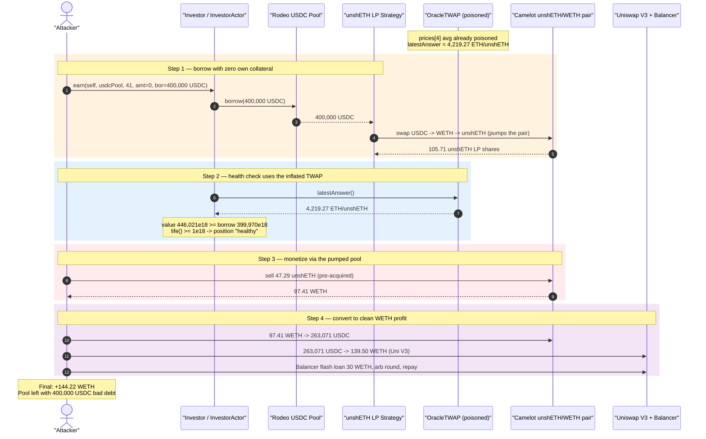
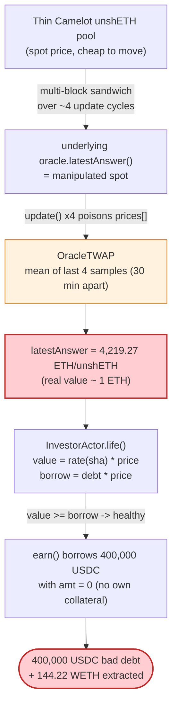
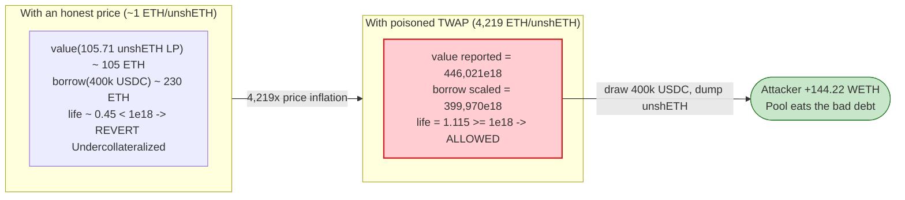

# Rodeo Finance Exploit — TWAP Oracle Manipulation of the unshETH LP Price

> **Reproduction:** the PoC compiles & runs in an isolated Foundry project at
> [this project folder](.) (the umbrella DeFiHackLabs repo contains many unrelated
> PoCs that do not compile under a whole-project build, so this one was extracted).
> Full verbose trace: [output.txt](output.txt).
> Verified vulnerable source: [src_oracles_OracleTWAP.sol](sources/OracleTWAP_f3721d/src_oracles_OracleTWAP.sol),
> [src_Investor.sol](sources/Investor_8accf4/src_Investor.sol).

---

## Key info

| | |
|---|---|
| **Loss** | ~472 ETH (~$888K) across the attack campaign; this PoC's final transaction nets **144.22 WETH** of profit |
| **Vulnerable contract** | `OracleTWAP` — [`0xf3721d8A2c051643e06BF2646762522FA66100dA`](https://arbiscan.io/address/0xf3721d8A2c051643e06BF2646762522FA66100dA#code) (consumed by `Investor`/`InvestorActor` [`0x8accf43Dd31DfCd4919cc7d65912A475BfA60369`](https://arbiscan.io/address/0x8accf43Dd31DfCd4919cc7d65912A475BfA60369#code)) |
| **Victim** | Rodeo Finance USDC lending pool [`0x0032F5E1520a66C6E572e96A11fBF54aea26f9bE`](https://arbiscan.io/address/0x0032F5E1520a66C6E572e96A11fBF54aea26f9bE#code) + the Camelot unshETH/WETH pair `0x29fC01f04032c76cA40f353c7dF685f4444c15eD` |
| **Manipulated asset** | unshETH (`unshETHOFT`) — [`0x0Ae38f7E10A43B5b2fB064B42a2f4514cbA909ef`](https://arbiscan.io/address/0x0Ae38f7E10A43B5b2fB064B42a2f4514cbA909ef#code) |
| **Attacker EOA** | [`0x2f3788f2396127061c46fc07bd0fcb91faace328`](https://arbiscan.io/address/0x2f3788f2396127061c46fc07bd0fcb91faace328) |
| **Attacker contract** | [`0xe9544ee39821f72c4fc87a5588522230e340aa54`](https://arbiscan.io/address/0xe9544ee39821f72c4fc87a5588522230e340aa54) |
| **Final attack tx** | [`0xb1be5dee3852c818af742f5dd44def285b497ffc5c2eda0d893af542a09fb25a`](https://arbiscan.io/tx/0xb1be5dee3852c818af742f5dd44def285b497ffc5c2eda0d893af542a09fb25a) |
| **TWAP-poisoning txs (prior)** | [`0x5f1663…ac7c`](https://arbiscan.io/tx/0x5f16637460021994d40430dadc020fffdb96937cfaf2b8cb6cbc03c91980ac7c), [`0x9a4622…65a2e`](https://arbiscan.io/tx/0x9a462209e573962f2654cac9bfe1277abe443cf5d1322ffd645925281fe65a2e) |
| **Chain / block / date** | Arbitrum / fork block 110,043,452 / July 11, 2023 |
| **Compiler** | OracleTWAP/Investor: Solidity v0.8.17; Pool: v0.8.15; unshETHOFT: v0.8.18 |
| **Bug class** | Oracle manipulation — short, low-resolution TWAP over a thin AMM pair used for borrow-collateral pricing |

---

## TL;DR

Rodeo Finance let users borrow USDC against a leveraged unshETH LP strategy. The
collateral value (and therefore the position's health factor) was priced by an
`OracleTWAP` that **averages only the last 4 samples taken at 30-minute intervals**
([src_oracles_OracleTWAP.sol:11-14](sources/OracleTWAP_f3721d/src_oracles_OracleTWAP.sol#L11-L14),
[:44](sources/OracleTWAP_f3721d/src_oracles_OracleTWAP.sol#L44)). The underlying spot
price came from a **thin Camelot V2 unshETH pool** — cheap to move.

Over a multi-block "sandwich" campaign the attacker poisoned all 4 TWAP samples, driving
the reported unshETH price to **4,219.27 ETH per unshETH** (a token that should be worth ~1 ETH).
At the fork block of this PoC, the oracle's `latestAnswer()` already returns
`4219270877931510930757` ([output.txt:164](output.txt#L164)) — proof the TWAP was pre-poisoned.

With the inflated oracle in place, the attacker:

1. Calls `Investor.earn(...)` to **borrow 400,000 USDC** from the Rodeo USDC pool with
   **zero collateral of their own** (`amt = 0`). The borrowed USDC is routed
   USDC → WETH → unshETH into the leveraged strategy. `InvestorActor.life()` values the
   resulting ~105.7 unshETH LP shares at the inflated TWAP price, so the health check passes
   (collateral value `4.46e23` ≥ scaled borrow `3.999e23`, [output.txt:330](output.txt#L330)).
2. The internal USDC → WETH → unshETH swap **pumps the Camelot unshETH/WETH pair** in the
   attacker's favor.
3. The attacker then **dumps their own pre-acquired 47.29 unshETH** into that pumped pair,
   pulling **97.41 WETH** out ([output.txt:432-475](output.txt#L432-L475)), and converts the
   rest of the loop into a clean WETH profit via Uniswap V3 and a Balancer flash loan.

Net for this transaction: the attacker walks away with **144.22 WETH**, having repaid
nothing to the lending pool — the 400,000 USDC of bad debt is left for Rodeo's lenders.

---

## Background — what Rodeo Finance does

Rodeo Finance is a leveraged-yield / under-collateralized-borrowing protocol on Arbitrum.
The relevant pieces:

- **`Pool`** ([src_Pool.sol](sources/Pool_0032F5/src_Pool.sol)) — an interest-bearing lending
  pool (here the USDC pool). It exposes `borrow()` ([:95-104](sources/Pool_0032F5/src_Pool.sol#L95-L104))
  and `repay()`, gated by `auth` so only the `InvestorActor` can pull funds.
- **`Investor` / `InvestorActor`** ([src_Investor.sol](sources/Investor_8accf4/src_Investor.sol)) —
  the leverage engine. `earn()` opens a position: it borrows from the pool, pushes the funds
  into a yield `Strategy`, mints strategy shares, and **requires the resulting position to be
  healthy** (`life(id) >= 1e18`).
- **`Strategy`** (unshETH LP strategy, `0x9E058177…`) — takes the borrowed USDC, swaps it into
  unshETH and provides liquidity, returning LP "shares". `rate(shares)` reports the share value.
- **`OracleTWAP`** ([src_oracles_OracleTWAP.sol](sources/OracleTWAP_f3721d/src_oracles_OracleTWAP.sol)) —
  the price feed used to value collateral. It samples an underlying spot oracle (a Camelot
  unshETH pool price) and returns a 4-point moving average.

The health computation lives in `InvestorActor.life()`
([src_Investor.sol:175-185](sources/Investor_8accf4/src_Investor.sol#L175-L185)):

```solidity
function life(uint256 id) public view returns (uint256) {
    (, address pol, uint256 str,,, uint256 sha, uint256 bor) = investor.positions(id);
    IPool pool = IPool(pol);
    IOracle oracle = IOracle(pool.oracle());
    if (bor == 0) return 1e18;
    uint256 price = (uint256(oracle.latestAnswer()) * 1e18) / (10 ** oracle.decimals());
    uint256 value = (IStrategy(investor.strategies(str)).rate(sha) * pool.liquidationFactor()) / 1e18;
    uint256 borrow = (bor * 1e18) / (10 ** IERC20(pool.asset()).decimals());
    borrow = (borrow * pool.getUpdatedIndex() / 1e18) * price / 1e18;
    return value * 1e18 / borrow;       // < 1e18 ⇒ liquidatable
}
```

Both `value` (collateral) and `borrow` (debt) depend on the **same** oracle path. The catch:
`value` is the **unshETH LP** priced through the manipulated TWAP, while `borrow` is **USDC**
debt scaled by the price feed. When the unshETH TWAP is inflated, `rate(sha)` (the unshETH LP
value) balloons far faster than the debt term, so the ratio stays ≥ 1 even though the position
holds essentially worthless real collateral against a real 400,000 USDC loan.

---

## The vulnerable code

### 1. A 4-sample, 30-minute TWAP over a thin pool

```solidity
// src_oracles_OracleTWAP.sol
int256[4] public prices;                          // ← only 4 samples
uint256 public constant updateInterval = 30 minutes;

function latestAnswer() external view returns (int256) {
    require(block.timestamp < lastTimestamp + (updateInterval * 2), "stale price");
    int256 price = (prices[0] + prices[1] + prices[2] + prices[3]) / 4;   // ← simple mean of 4
    return price;
}

function update() external auth {
    require(block.timestamp > lastTimestamp + updateInterval, "before next update");
    lastIndex = (lastIndex + 1) % 4;
    prices[lastIndex] = currentPrice();           // ← currentPrice() = spot from the underlying oracle
    lastTimestamp = block.timestamp;
    emit Updated(prices[lastIndex]);
}

function currentPrice() public view returns (int256) {
    return oracle.latestAnswer() * 1e18 / int256(10 ** oracle.decimals());
}
```

[src_oracles_OracleTWAP.sol:42-58](sources/OracleTWAP_f3721d/src_oracles_OracleTWAP.sol#L42-L58)

The "TWAP" is just the arithmetic mean of the **last four** `currentPrice()` snapshots, each
taken ~30 minutes apart. Two structural weaknesses:

- **Window resolution is tiny.** Four samples means a single fully-controlled sample shifts the
  reported price by 25%; controlling all four (over ~4 update cycles ≈ a couple of hours of
  block production) lets the attacker dictate the average outright.
- **The source price is spot from a thin AMM.** `currentPrice()` reads `oracle.latestAnswer()`
  which ultimately resolves to the unshETH Camelot pool's instantaneous price. A pool that small
  is cheap to push to an arbitrary value at sample time.

### 2. The price is used to gate borrowing — with no own-collateral required

`Investor.earn()` opens a leveraged position and only requires that the *post-borrow* health is
healthy (`life(id) >= 1e18`, enforced for `edit`; `earn` itself just records the position after
`actor.edit` returns its accounting):

```solidity
// src_Investor.sol — earn()
pullTo(IERC20(IPool(p.pool).asset()), msg.sender, address(actor), uint256(amt)); // amt == 0 here
(int256 bas, int256 sha, int256 bar) = actor.edit(id, int256(amt), int256(bor), dat);
```

[src_Investor.sol:86-107](sources/Investor_8accf4/src_Investor.sol#L86-L107)

In this attack `amt = 0` (the attacker posts **no** collateral) and `bor = 400_000e6` (USDC).
`InvestorActor.edit()` borrows the USDC from the pool and mints unshETH LP strategy shares
([src_Investor.sol:206-238](sources/Investor_8accf4/src_Investor.sol#L206-L238)). Health then
hinges entirely on `rate(sha)` × inflated TWAP being large enough — which it is.

---

## Root cause

The single root cause is **using a low-resolution, AMM-spot-derived TWAP as the authoritative
price for borrow collateral**. Concretely:

1. **The TWAP window is too short and too coarse.** A 4-sample average is trivially poisoned over
   a handful of update cycles. The attacker's prior txs (`0x5f1663…`, `0x9a4622…`) seeded the four
   `prices[]` slots; by the fork block the average had been driven to **4,219.27 ETH/unshETH**
   ([output.txt:164](output.txt#L164), [output.txt:302-303](output.txt#L302-L303)) — for an
   asset that is fundamentally worth ≈ 1 ETH.
2. **The underlying price is an AMM spot from a thin pool**, so each TWAP sample is cheap to set.
3. **The lending engine trusts that price for both collateral valuation and the health check**
   with no sanity bounds, no deviation cap versus a reference (e.g. Chainlink ETH/USD), and no
   minimum-liquidity requirement on the priced LP.
4. **Borrowing requires no real over-collateralization** once the inflated price makes the strategy
   LP "worth" more than the debt — letting the attacker draw 400,000 USDC against near-worthless
   collateral and never repay.

The lender's USDC pool is left holding the 400,000 USDC of bad debt; the attacker monetizes the
price gap by selling unshETH that they pre-positioned into the same pool the borrow path pumps.

---

## Preconditions

- The 4-slot TWAP must have been poisoned so `latestAnswer()` reports a grossly inflated unshETH
  price. In the live attack this required two prior multi-block sandwich txs against the thin
  Camelot unshETH pool; the PoC forks at a block where the poison is already baked in
  (`latestAnswer() == 4219270877931510930757`).
- The attacker holds a stash of unshETH to dump into the pool that the borrow path pumps. The PoC
  reproduces this with `deal(address(unshETH), address(this), 47_294_222_088_336_002_957)`
  ([RodeoFinance_exp.sol:90](test/RodeoFinance_exp.sol#L90)).
- The USDC pool must have at least 400,000 USDC of free liquidity to borrow (it held
  ~1.741M USDC, [output.txt:92](output.txt#L92)).
- Working WETH capital to seed swaps; fully recoverable intra-transaction (the final repay leg uses
  a 30 WETH Balancer flash loan, [output.txt:583](output.txt#L583)).

---

## Step-by-step attack walkthrough

The position opened is id `3193` ([output.txt:80-82](output.txt#L80-L82)), strategy index `41`
(unshETH LP strategy `0x9E058177…`), pool = the USDC pool.

| # | Step | Concrete numbers (from trace) | Source |
|---|------|-------------------------------|--------|
| 0 | **(Prior)** TWAP poisoned across 4 samples; `OracleTWAP.latestAnswer()` reports an inflated unshETH price | `4219270877931510930757` ≈ **4,219.27 ETH/unshETH** | [output.txt:164](output.txt#L164) |
| 1 | `Investor.earn(self, usdcPool, 41, amt=0, bor=400_000e6, dat)` — open leveraged position with **no own collateral** | borrow `400000000000` USDC (4e11, 6-dec) | [output.txt:77](output.txt#L77), [output.txt:89](output.txt#L89) |
| 2 | Pool lends 400,000 USDC to the actor | `Borrow(... 400000000000, bor=382349705467)` | [output.txt:108](output.txt#L108) |
| 3 | Strategy swaps the borrowed USDC → WETH → unshETH via Camelot (pumps the unshETH/WETH pair), mints LP shares | out: `105710624227042722164` ≈ **105.71 unshETH**; Camelot unshETH/WETH `Sync(reserve0=34.28 unshETH, reserve1=358.73 WETH)` | [output.txt:189](output.txt#L189), [output.txt:244-272](output.txt#L244-L272) |
| 4 | `InvestorActor.life()` health check passes — collateral valued at inflated TWAP | `check(... value=446021758289122595426003, borrow=399970139999937220525996)` → value ≥ borrow ⇒ healthy | [output.txt:330](output.txt#L330) |
| 5 | Attacker dumps its own **47.29 unshETH** into the now-pumped Camelot pair | swap `47294222088336002957` unshETH → **`97414789379190681138`** ≈ **97.41 WETH**; pair `Sync(reserve0=81.57 unshETH, reserve1=261.31 WETH)` | [output.txt:432](output.txt#L432), [output.txt:449-475](output.txt#L449-L475) |
| 6 | Attacker swaps that 97.41 WETH → USDC on Camelot | out `263071464710` ≈ **263,071 USDC** | [output.txt:488](output.txt#L488), [output.txt:533](output.txt#L533) |
| 7 | Swap 263,071 USDC → WETH on Uniswap V3 (0.05% pool) | out `139498381166854225289` ≈ **139.50 WETH** | [output.txt:546](output.txt#L546), [output.txt:548](output.txt#L548) |
| 8 | Balancer flash loan of **30 WETH**, used to do one more WETH→USDC→WETH arb round and repay | borrow 30 WETH; round nets net positive; repay 30 WETH (fee 0) | [output.txt:583](output.txt#L583), [output.txt:598-710](output.txt#L598-L710) |
| 9 | **Final balances** | unshETH: 0; **WETH: `144219004344154985727` ≈ 144.22 WETH** | [output.txt:716](output.txt#L716), [output.txt:725](output.txt#L725) |

The lending pool is never repaid the 400,000 USDC — that loan against worthless collateral is the
loss; the attacker's WETH profit is the realized portion extracted via the pumped Camelot pool.

---

## Profit / loss accounting

| Item | Amount |
|---|---:|
| Attacker WETH at start | 0 (PoC deals headroom but measures delta from 0 WETH) |
| Attacker WETH at end | **144.22 WETH** ([output.txt:719](output.txt#L719)) |
| Attacker unshETH at end | 0 ([output.txt:713](output.txt#L713)) |
| Realized profit (this tx) | **+144.22 WETH** |
| Bad debt left in Rodeo USDC pool | ~400,000 USDC (loan against ~worthless unshETH LP, never repaid) |
| Campaign total loss (all txs) | ~472 ETH (~$888K) per the post-mortem |

The `life()` check at step 4 numerically confirms the manipulation: collateral `value` was
reported as `446,021.76e18` while the scaled `borrow` was `399,970.14e18`
([output.txt:330](output.txt#L330)) — a "healthy" 1.115 ratio for a position whose real
collateral was a tiny unshETH LP share worth a fraction of the 400,000 USDC borrowed.

---

## Diagrams

### Sequence of the attack



### Price-manipulation pipeline



### Why the health check passes on worthless collateral



---

## Why each magic number

- **`bor = 400_000e6` USDC:** the maximum the attacker could borrow while the poisoned-price
  health check still returned `>= 1e18` against the ~105.71 unshETH LP the borrow produced
  (`value 446,021e18` vs `borrow 399,970e18`, [output.txt:330](output.txt#L330)).
- **`amt = 0`:** the attacker posts no collateral of their own — the entire position is funded by
  the borrowed USDC, which is the point of the under-collateralization.
- **`47_294_222_088_336_002_957` unshETH (≈47.29):** the attacker's pre-acquired stash, sized to
  dump into the Camelot unshETH/WETH pair right after the `earn()` swap leg pumps it, extracting
  97.41 WETH ([output.txt:432-475](output.txt#L432-L475)).
- **`dat = abi.encode(500)`:** the 0.05% Uniswap-V3 fee tier hint used by the strategy's
  USDC↔WETH↔unshETH routing.
- **30 WETH Balancer flash loan:** working capital for the final WETH→USDC→WETH arbitrage round
  used to squeeze out the last of the price dislocation; the Balancer fee is 0 so it is free.

---

## Remediation

1. **Do not price collateral from a short, AMM-spot-derived TWAP.** Use a robust oracle for the
   ETH/USD leg (e.g. Chainlink) and, for the unshETH-specific leg, a redemption/exchange-rate
   value derived from the LSD's underlying reserves rather than a thin pool's spot price.
2. **Lengthen and harden the TWAP.** Four samples at 30-minute granularity is far too easy to
   poison. Use Uniswap-V3-style cumulative-price TWAPs over a meaningful window, require minimum
   pool liquidity, and use the deepest available pool as the price source.
3. **Add deviation and sanity bounds.** Reject (or pause borrowing on) any reported price that
   deviates beyond a small band from an independent reference feed, or that moves more than X% per
   update. A 4,219x inflation should never be accepted.
4. **Require real over-collateralization independent of the manipulable leg.** The health check
   should not be satisfiable purely by inflating the priced asset; bound borrow capacity by
   conservatively-priced, deep-liquidity collateral.
5. **Cap per-position and per-block borrow against any single strategy/asset**, so even a
   mispriced moment cannot drain the pool in one transaction.

---

## How to reproduce

The PoC was extracted into a standalone Foundry project (the umbrella DeFiHackLabs repo has many
unrelated PoCs that fail to compile under `forge test`'s whole-project build):

```bash
_shared/run_poc.sh 2023-07-RodeoFinance_exp --mt testExploit -vvvvv
```

- RPC: an **Arbitrum archive** endpoint is required (the fork pins block 110,043,452, which holds
  the already-poisoned TWAP state). Most public Arbitrum RPCs prune state this old and will fail
  with `header not found` / `missing trie node`.
- Result: `[PASS] testExploit()` leaving the attacker with ~144.22 WETH and 0 unshETH.

Expected tail:

```
Ran 1 test for test/RodeoFinance_exp.sol:RodeoTest
[PASS] testExploit() (gas: 1373760)
Logs:
  Attacker balance of unshETH after exploit: 0.000000000000000000
  Attacker balance of WETH after exploit: 144.219004344154985727

Suite result: ok. 1 passed; 0 failed; 0 skipped
```

---

*References: Rodeo post-mortem — https://medium.com/@Rodeo_Finance/rodeo-post-mortem-overview-f35635c14101 ;
Phalcon — https://twitter.com/Phalcon_xyz/status/1678765773396008967 ;
PeckShield — https://twitter.com/peckshield/status/1678700465587130368*
