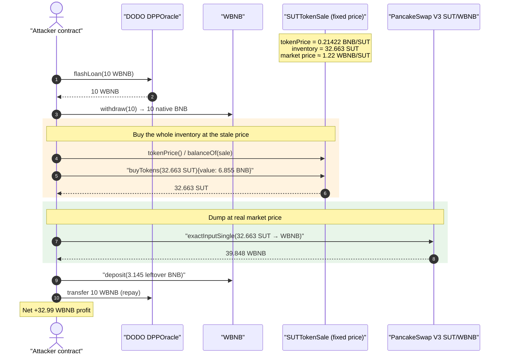
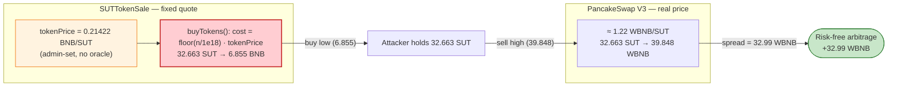
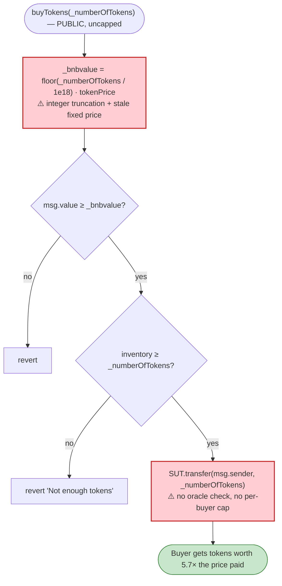

# SUT Token Sale Exploit — Fixed-Price Inventory Sold Far Below Market

> **Reproduction:** the PoC compiles & runs in an isolated Foundry project at
> [this project folder](.) (the umbrella DeFiHackLabs repo contains several unrelated PoCs
> that do not compile together, so this one was extracted).
> Full verbose trace: [output.txt](output.txt).
> Verified vulnerable source: [SUTTokenSale.sol](sources/SUTTokenSale_F075c5/SUTTokenSale.sol).

---

## Key info

| | |
|---|---|
| **Loss** | ~$8K USD — **32.99 WBNB** of risk-free arbitrage profit |
| **Vulnerable contract** | `SUTTokenSale` — [`0xF075c5C7BA59208c0B9c41afcCd1f60da9EC9c37`](https://bscscan.com/address/0xF075c5C7BA59208c0B9c41afcCd1f60da9EC9c37#code) |
| **Token sold** | `SUT` (SILICA UTILITY COIN) — [`0x70E1bc7E53EAa96B74Fad1696C29459829509bE2`](https://bscscan.com/address/0x70E1bc7E53EAa96B74Fad1696C29459829509bE2#code) |
| **Exit venue (price source)** | PancakeSwap V3 SUT/WBNB pool `0xEBc4B13F574AE8eb68E61B3B21F3457AB2f1F2e4` (fee 2500) |
| **Attacker EOA** | [`0x547fb3db0f13eed5d3ff930a0b61ae35b173b4b5`](https://bscscan.com/address/0x547fb3db0f13eed5d3ff930a0b61ae35b173b4b5) |
| **Attacker contract** | [`0x9be508ce41ae5795e1ebc247101c40da7d5742db`](https://bscscan.com/address/0x9be508ce41ae5795e1ebc247101c40da7d5742db) |
| **Attack tx** | [`0xfa1ece5381b9e2b2b83cb10faefde7632ca411bb38dd6bafe1f1140b1360f6ae`](https://bscscan.com/tx/0xfa1ece5381b9e2b2b83cb10faefde7632ca411bb38dd6bafe1f1140b1360f6ae) |
| **Chain / block / date** | BSC / 30,165,901 / July 2023 |
| **Compiler** | `SUTTokenSale` Solidity v0.8.14 (optimizer off); `SUTToken` v0.5.17 |
| **Bug class** | Stale / mispriced fixed-price sale (price-feed-less primary sale) + integer-division price truncation |

---

## TL;DR

`SUTTokenSale` is a primitive "ICO" contract that sells its SUT inventory at a single, admin-set,
**hard-coded** `tokenPrice` ([SUTTokenSale.sol:130](sources/SUTTokenSale_F075c5/SUTTokenSale.sol#L130),
[:145-148](sources/SUTTokenSale_F075c5/SUTTokenSale.sol#L145-L148)). At the time of the attack the
sale price was **0.21422 BNB per SUT**, while the live PancakeSwap V3 market price of SUT was
**≈ 1.22 WBNB per SUT** — a **~5.7×** discount. `buyTokens()` does no oracle check, no per-buyer cap,
and lets *anyone* drain the entire inventory at the stale price
([:156-165](sources/SUTTokenSale_F075c5/SUTTokenSale.sol#L156-L165)).

The attacker simply:

1. Flash-borrows **10 WBNB** from a DODO `DPPOracle` pool (only used as a source of capital).
2. Reads the sale contract's whole inventory — **32.663 SUT** — and `buyTokens()` it for only
   **6.855 BNB** (the fixed price).
3. Sells those 32.663 SUT into the PancakeSwap V3 pool for **39.848 WBNB**.
4. Repays the 10 WBNB flash loan.

Net profit = **32.99 WBNB** (≈ $8K), with **zero** capital at risk — the discrepancy between the
fixed sale price and the real market price is pure, repeatable arbitrage.

A secondary bug makes it slightly worse: the cost formula truncates with integer division
(`_numberOfTokens / 1e18`), so the buyer is only charged for *whole* tokens and the fractional part
of the inventory is handed over for free.

---

## Background — what SUTTokenSale does

`SUTTokenSale` ([source](sources/SUTTokenSale_F075c5/SUTTokenSale.sol)) is a hand-rolled token-sale
contract holding an inventory of `SUT` and selling it for native BNB:

- **`tokenPrice`** — a single public `uint256` "price per token", in wei of BNB per *whole* SUT,
  settable only by `admin` via `settokenPrice()`
  ([:145-148](sources/SUTTokenSale_F075c5/SUTTokenSale.sol#L145-L148)).
- **`buyTokens(_numberOfTokens)`** — the public sale entry point. It computes the BNB cost from
  `tokenPrice`, requires that much `msg.value`, then transfers the requested SUT to the buyer
  ([:156-165](sources/SUTTokenSale_F075c5/SUTTokenSale.sol#L156-L165)).

Crucially, the contract has **no connection to any market or oracle**. The price is whatever the
admin last typed in. Meanwhile, SUT was *also* trading on a PancakeSwap V3 pool, where the real
price floated freely. Once the AMM price drifted above the stale fixed price, the sale contract
became a vending machine dispensing tokens below market.

The on-chain facts at fork block 30,165,901 (read directly from the trace):

| Fact | Value | Trace |
|---|---|---|
| `SUTTokenSale.tokenPrice()` | **214,224,507,283,633,242 wei ≈ 0.21422 BNB/SUT** | [output.txt:49-50](output.txt) |
| SUT inventory held by the sale contract | **32,663,166,885,742,087,138 ≈ 32.663 SUT** | [output.txt:52-53](output.txt) |
| Market price of SUT on PancakeSwap V3 | **≈ 1.2200 WBNB/SUT** | derived from [output.txt:74-109](output.txt) |
| Undervaluation factor | **≈ 5.69×** | — |

---

## The vulnerable code

### 1. A single fixed price, set by the admin, with no market anchor

```solidity
// SUTTokenSale.sol
uint256 public tokenPrice;                 // line 130 — flat BNB-wei price per whole SUT

function settokenPrice(uint256 _tokenPrice) public {   // lines 145-148
    require(msg.sender == admin);
    tokenPrice = _tokenPrice;              // never compared to any market/oracle price
}
```

### 2. `buyTokens` lets anyone sweep the inventory at that price — and truncates the cost

```solidity
// SUTTokenSale.sol:156-165
function buyTokens(uint256 _numberOfTokens) public payable {
    uint256 _bnbvalue = (_numberOfTokens/1000000000000000000)*tokenPrice;  // ⚠️ integer division
    require(msg.value >= _bnbvalue);
    require(tokenContract.balanceOf(address(this)) >= _numberOfTokens,"Not enough tokens");
    require(tokenContract.transfer(msg.sender, _numberOfTokens),"Transfer failed");

    tokensSold += _numberOfTokens;
    emit Sell(msg.sender, _numberOfTokens);
}
```

Two independent problems live in these ten lines:

- **Mispriced sale (primary).** `_bnbvalue` is derived entirely from the stale `tokenPrice`. There
  is no slippage protection, no per-account limit, no oracle sanity check, and no `onlyOwner` gate —
  any address can buy the *entire* inventory at the below-market price. This is the dominant source
  of loss.
- **Integer-division truncation (secondary).** `_numberOfTokens/1e18` floors the token count to
  whole units before multiplying by the price. For the attacker's purchase of
  `32_663_166_885_742_087_138` raw units, `floor(32.663…) = 32`, so the buyer is charged for
  **32** whole tokens and the remaining **0.663 SUT** is delivered for free. (The same truncation
  means a buyer of < 1e18 raw SUT pays **0** BNB.)

For the actual purchase the math reconciles to the wei:

```
floor(32_663_166_885_742_087_138 / 1e18) = 32
_bnbvalue = 32 * 214_224_507_283_633_242
          = 6_855_184_233_076_263_744 wei
          = 6.855184233076263744 BNB     ← exactly the msg.value the attacker sent (PoC line 75)
```

---

## Root cause — why it was possible

A token sale that quotes a **flat, manually-maintained price** while the same token trades on an
open market is only safe as long as the manual price tracks the market. It never does for long. The
moment the AMM price rises above the fixed sale price, the sale contract becomes a free arbitrage
faucet: buy low from the contract, sell high on the AMM, repeat until the inventory is gone.

`SUTTokenSale` compounds this with several missing guardrails:

1. **No oracle / market reference.** `buyTokens` trusts `tokenPrice` absolutely
   ([:157](sources/SUTTokenSale_F075c5/SUTTokenSale.sol#L157)). It never reads the PancakeSwap pool,
   a TWAP, or any external feed, so it cannot notice that it is selling at ~1/5.7 of market.
2. **Permissionless, uncapped buying.** Anyone may call `buyTokens` for any amount up to the whole
   inventory ([:156](sources/SUTTokenSale_F075c5/SUTTokenSale.sol#L156)); there is no per-buyer cap,
   no whitelist, and no rate limit, so the entire mispriced inventory can be drained in one call.
3. **Integer-division underpricing.** `(_numberOfTokens/1e18)*tokenPrice`
   ([:157](sources/SUTTokenSale_F075c5/SUTTokenSale.sol#L157)) floors before multiplying, so the
   contract systematically undercharges for any fractional-token purchase — for sub-1-token buys it
   charges literally nothing.
4. **No slippage/`amountOutMinimum` defense is even possible** — the contract isn't an AMM, it's a
   fixed quote, so its "price" simply lags reality.

Because the whole thing is intra-transaction and needs no inventory of its own, the attacker funds
it with a **flash loan** (10 WBNB from a DODO `DPPOracle` pool — see
[output.txt:29](output.txt)) and repays it in the same transaction; the loan is incidental, not the
vulnerability.

---

## Preconditions

- The sale contract holds SUT inventory (32.663 SUT at the fork block).
- `tokenPrice` is set below the prevailing PancakeSwap V3 market price (here 0.21422 BNB vs ~1.22
  WBNB — a 5.7× gap). This is the entire bug; it required no manipulation, just a stale admin price.
- Enough WBNB to front the purchase. The peak outlay was only **6.855 BNB** and it is fully
  recovered intra-transaction, so the attack is trivially **flash-loanable** (the PoC borrows 10
  WBNB from DODO purely as a capital source).

No timing window, no privileged role, and no price manipulation are needed — the discount is
standing and the buy is permissionless.

---

## Attack walkthrough (with on-chain numbers from the trace)

All figures are taken directly from [output.txt](output.txt). The exploit body lives in
`DPPFlashLoanCall` ([SUT_exp.sol:69-87](test/SUT_exp.sol#L69-L87)).

| # | Step | Trace | Numbers |
|---|------|-------|---------|
| 0 | **Flash loan** — borrow 10 WBNB from DODO `DPPOracle` | [output.txt:29-30](output.txt) | +10 WBNB |
| 1 | `SUT.approve(Router, max)` and `WBNB.withdraw(10e18)` → 10 native BNB | [output.txt:37-48](output.txt) | 10 WBNB → 10 BNB |
| 2 | Read `tokenPrice()` = **0.21422 BNB/SUT** and inventory = **32.663 SUT** | [output.txt:49-53](output.txt) | price, inventory |
| 3 | **`buyTokens(32.663 SUT)`** sending `6.855184233076263744 BNB` → receive all 32.663 SUT | [output.txt:54-68](output.txt) | −6.855 BNB, +32.663 SUT |
| 4 | **`Router.exactInputSingle`** sells 32.663 SUT → **39.848 WBNB** on the V3 pool | [output.txt:74-109](output.txt) | −32.663 SUT, +39.848 WBNB |
| 5 | `WBNB.deposit{value: 3.144815766923736256}` — wrap the leftover BNB (10 − 6.855) | [output.txt:110-114](output.txt) | +3.145 WBNB |
| 6 | `WBNB.transfer(DPPOracle, 10e18)` — repay flash loan | [output.txt:115-120](output.txt) | −10 WBNB |
| 7 | **Final WBNB balance** | [output.txt:132-136](output.txt) | **32.99291972410766 WBNB** |

Step 3 is where the value leaks: the attacker pays **6.855 BNB** for tokens that step 4 immediately
liquidates for **39.848 WBNB**. The contract sold ~$8K of SUT for ~$1.4K of BNB.

### Profit / loss accounting (WBNB)

| Direction | Amount (WBNB) |
|---|---:|
| Borrowed (flash loan, repaid) | 10.000000 |
| Spent — `buyTokens` cost | 6.855184 |
| Received — V3 sale of 32.663 SUT | 39.848104 |
| Leftover native BNB wrapped (10 − 6.855184) | 3.144816 |
| Flash-loan repayment | −10.000000 |
| **Net profit** | **+32.992920** |

Reconciliation: `39.848104 + 3.144816 − 10 = 32.992920 WBNB`, matching the trace's reported final
balance of `32992919724107662747` wei to the wei ([output.txt:133](output.txt),
[:136](output.txt)). At the ~$242/BNB price of July 2023 this is the ~$8K loss quoted in the PoC
header.

---

## Diagrams

### Sequence of the attack



### Where the value leaks



### The flaw inside `buyTokens`



---

## Why the secondary truncation matters

`_bnbvalue = (_numberOfTokens / 1000000000000000000) * tokenPrice` floors the *whole-token* count
**before** multiplying by the price:

- For the attacker's `32.663 SUT` buy, `floor(32.663) = 32`, so 0.663 SUT (≈ 0.81 WBNB of value)
  was handed over for free on top of the underpricing.
- Worse, for **any purchase of fewer than `1e18` raw units** (less than one whole SUT), the floor is
  `0`, so `_bnbvalue = 0` and the `require(msg.value >= 0)` always passes — the contract would
  literally give away sub-token amounts for nothing. (The dominant loss here is still the stale
  price, but this truncation guarantees the contract can never charge correctly for fractional
  amounts.)

---

## Remediation

1. **Price the sale from the market, not a manual constant.** If SUT trades on an AMM, derive the
   sale price from a manipulation-resistant **TWAP/oracle** (or remove the fixed-price sale entirely
   once a market exists). A flat `tokenPrice` that anyone can arbitrage against the AMM is unsafe by
   construction.
2. **Fix the cost arithmetic.** Compute the cost without truncation, e.g.
   `_bnbvalue = (_numberOfTokens * tokenPrice) / 1e18`, so fractional tokens are charged
   proportionally and sub-1-token buys are not free.
3. **Cap and gate the sale.** Add per-buyer/per-block purchase limits (or a whitelist), and consider
   restricting large buys to the admin path so the entire inventory cannot be swept in a single
   permissionless call.
4. **Add slippage-style guards against staleness.** Reject `buyTokens` (or auto-pause the sale) when
   the configured `tokenPrice` deviates from the on-chain market price by more than a small
   tolerance, so a forgotten/stale price cannot be exploited.
5. **Require exact payment and refund the remainder.** `require(msg.value >= _bnbvalue)` accepts
   overpayment silently; use exact pricing and refund any surplus to avoid griefing/accounting drift.

---

## How to reproduce

The PoC was extracted into a standalone Foundry project (the umbrella DeFiHackLabs repo has several
unrelated PoCs that fail to compile under a whole-project `forge build`):

```bash
_shared/run_poc.sh 2023-07-SUT_exp -vvvvv
```

- RPC: a **BSC archive** endpoint is required (`createSelectFork("bsc", 30_165_901)` —
  [SUT_exp.sol:50](test/SUT_exp.sol#L50)). Most public BSC RPCs prune state this old and fail with
  `header not found` / `missing trie node`.
- Result: `[PASS] testExploit()`.

Expected tail (from [output.txt:3-9](output.txt)):

```
Ran 1 test for test/SUT_exp.sol:SUTTest
[PASS] testExploit() (gas: 290945)
Logs:
  Incorrect SUT token price returned from tokenPrice() function: 214224507283633242
  Buyed number of SUT tokens: 32.663166885742087138
  Attacker WBNB balance after exploit: 32.992919724107662747
```

---

*Reference: PoC `@KeyInfo` header in [test/SUT_exp.sol](test/SUT_exp.sol); analysis tweet
https://twitter.com/bulu4477/status/1682983956080377857 .*
