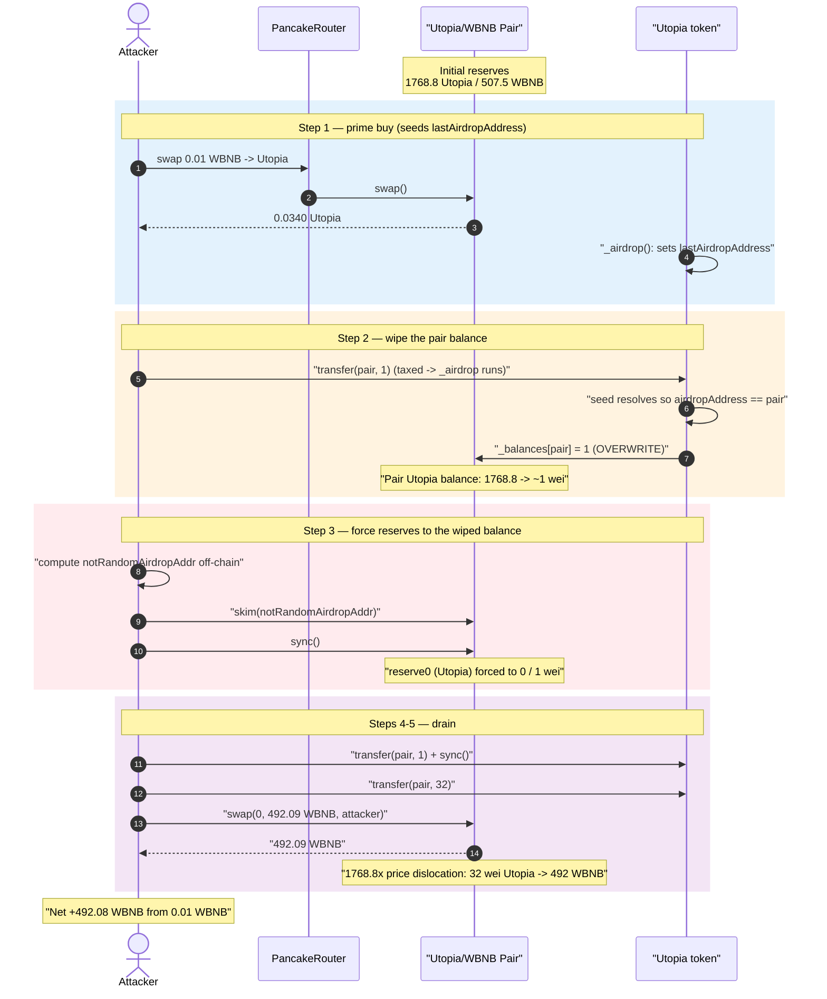
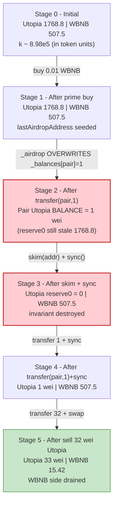
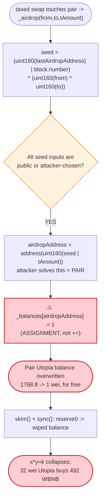
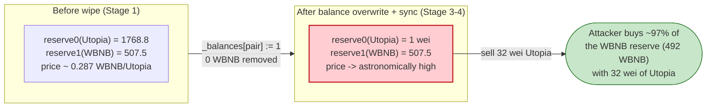

# Utopia Exploit — `_airdrop()` Overwrites the Pool's Token Balance to 1, Collapsing the AMM Reserve

> **Vulnerability classes:** vuln/logic/state-update · vuln/oracle/spot-price · vuln/defi/slippage

> **Reproduction:** the PoC compiles & runs in an isolated Foundry project at
> [this project folder](.) (the umbrella DeFiHackLabs repo
> contains several unrelated PoCs that do not whole-compile, so this one was extracted).
> Full verbose trace: [output.txt](output.txt).
> Verified vulnerable source: [Utopia.sol](sources/Utopia_b1da08/Utopia.sol),
> victim pool: [PancakePair.sol](sources/PancakePair_feEf61/PancakePair.sol).

---

## Key info

| | |
|---|---|
| **Loss** | ~$119K — **492.08 WBNB** drained from the Utopia/WBNB PancakeSwap pair (attacker started with 0.01 WBNB) |
| **Vulnerable contract** | `Utopia` — [`0xb1da08C472567eb0EC19639b1822F578d39F3333`](https://bscscan.com/address/0xb1da08C472567eb0EC19639b1822F578d39F3333#code) |
| **Victim pool** | Utopia/WBNB PancakePair — [`0xfeEf619a56fCE9D003E20BF61393D18f62B0b2D5`](https://bscscan.com/address/0xfeEf619a56fCE9D003E20BF61393D18f62B0b2D5) |
| **Attacker EOA** | [`0xe84ef3615b8df94c52e5b6ef21acbf0039b29113`](https://bscscan.com/address/0xe84ef3615b8df94c52e5b6ef21acbf0039b29113) |
| **Attacker contract** | [`0x6191203510c2a6442faecdb6c7bb837a76f02d23`](https://bscscan.com/address/0x6191203510c2a6442faecdb6c7bb837a76f02d23) |
| **Attack tx** | [`0xeb4eb487f58d39c05778fed30cd001b986d3c52279e44f46b2de2773e7ee1d5e`](https://bscscan.com/tx/0xeb4eb487f58d39c05778fed30cd001b986d3c52279e44f46b2de2773e7ee1d5e) |
| **Chain / block / date** | BSC / fork 30,119,396 / July 20, 2023 |
| **Compiler** | Solidity ^0.8.18 |
| **Bug class** | Business-logic flaw — attacker-predictable "airdrop" address whose balance is **overwritten** (not added) to `1`, usable to zero out the AMM pair's token reserve |

---

## TL;DR

`Utopia` is a fee-on-transfer "dividend" token. On every taxed buy/sell it runs a marketing
gimmick called `_airdrop()` ([Utopia.sol:327-342](sources/Utopia_b1da08/Utopia.sol#L327-L342))
that mints `1` wei of Utopia to a *pseudo-random* address derived from a seed. Two fatal mistakes:

1. **The seed is fully attacker-controlled / predictable** — it is built from
   `lastAirdropAddress`, `block.number`, and the `from`/`to` of the triggering transfer
   ([:328](sources/Utopia_b1da08/Utopia.sol#L328)). `lastAirdropAddress` is a public getter,
   `block.number` is known, and the attacker chooses `from`/`to`. So the attacker can compute
   exactly which address will receive the next "airdrop."
2. **The airdrop is an *assignment*, not an *addition*:**
   `_balances[airdropAddress] = airdropAmount;` ([:334](sources/Utopia_b1da08/Utopia.sol#L334))
   — it **overwrites** the target's balance with `1`, destroying whatever was there before.

By steering the airdrop address to equal **the PancakeSwap pair itself**, the attacker overwrites
the pair's Utopia balance from `1,768,803,582,795,555,809,112` wei down to **`1` wei** — for free.
The pair's WBNB balance is untouched. A `skim()` + `sync()` then forces the pool's `reserve0`
(Utopia) to that `1` wei while leaving `reserve1` (507.5 WBNB) intact, collapsing the
constant-product invariant `x·y = k`. The attacker sells a few wei of Utopia into the now-degenerate
pool and walks away with **492.08 WBNB**, turning a 0.01 WBNB starting balance into ~$119K of profit.

---

## Background — what Utopia does

`Utopia` ([source](sources/Utopia_b1da08/Utopia.sol)) is a standard "tokenomics" BSC token
(`AbsToken`) with fee-on-transfer, LP dividends, and an "airdrop" feature:

- **Trading is taxed** — buys pay a 1% LP-dividend fee + 1% burn; sells pay 3% to a dividend
  distributor (`_tokenTransfer`, [:382-423](sources/Utopia_b1da08/Utopia.sol#L382-L423)).
- **LP dividend bookkeeping** — `processLP` / `processLPRewardUsdt` distribute MT/USDT to LP holders.
- **"Airdrop" on every taxed swap** — `_airdrop()` is called inside `_transfer` whenever a non-whitelisted
  buy/sell crosses the pair ([:300](sources/Utopia_b1da08/Utopia.sol#L300)). It is a cosmetic stunt that
  emits a self-Transfer event from a derived address to make the token look "active" in explorers.

The pool token ordering at the fork block: the Utopia address
`0xb1da08…` is numerically **less than** WBNB `0xbb4CdB…`, so in the pair **`token0 = Utopia`,
`token1 = WBNB`**, i.e. `reserve0 = Utopia`, `reserve1 = WBNB`. Confirmed by the first
`getReserves()` in the trace: `(1768838349283261391642 Utopia, 507494915442740086636 WBNB)`
([output.txt:79](output.txt)).

On-chain state at fork block 30,119,396 (from the trace):

| Parameter | Value |
|---|---|
| Pair Utopia reserve (`reserve0`) | 1,768.84 Utopia (1768838349283261391642 wei) |
| Pair WBNB reserve (`reserve1`) | 507.49 WBNB (507494915442740086636 wei) ← the prize |
| Pair actual WBNB balance | 507.50 WBNB (507504915442740086636 wei) |
| Attacker WBNB start | **0.01 WBNB** (1e16 wei) |
| `_buyLPDividendFee` / `_buyDestroyFee` | 100 / 100 bps (1% + 1% on buys) |
| `_sellLPDividendFee` | 300 bps (3% on sells) |

---

## The vulnerable code

### The "airdrop" routine — predictable target + balance **overwrite**

```solidity
// Utopia.sol:325-342
address public lastAirdropAddress;            // ← public, readable by anyone

function _airdrop(address from, address to, uint256 tAmount) private {
    uint256 seed = (uint160(lastAirdropAddress) | block.number) ^ (uint160(from) ^ uint160(to));
    address airdropAddress;
    uint256 num = 1;
    uint256 airdropAmount = 1;
    for (uint256 i; i < num;) {
        airdropAddress = address(uint160(seed | tAmount));
        _balances[airdropAddress] = airdropAmount;        // ⚠️ OVERWRITE, not +=
        emit Transfer(airdropAddress, airdropAddress, airdropAmount);
    unchecked{
        ++i;
        seed = seed >> 1;
    }
    }
    lastAirdropAddress = airdropAddress;                  // ← lets the attacker chain the seed
}
```

`_airdrop` is invoked on every taxed transfer that touches the pair
([:300](sources/Utopia_b1da08/Utopia.sol#L300)):

```solidity
// Utopia.sol:284-307  (inside _transfer)
if (_swapPairList[from] || _swapPairList[to]) {
    ...
    if (!_feeWhiteList[from] && !_feeWhiteList[to]) {
        takeFee = true;
        ...
        _airdrop(from, to, amount);   // ← here
        ...
    }
}
```

The seed has three "inputs": `lastAirdropAddress` (public), `block.number` (known), and the
`from`/`to` of the transfer (chosen by the attacker — the PoC sends `Utopia.transfer(Pair, …)`,
so `from = attacker`, `to = Pair`). Everything is knowable off-chain, so the attacker can solve for
the exact `airdropAddress` the next call will produce — and arrange for it to be the pair address.

### Why hitting the pair is catastrophic

The pair prices assets purely from its reserves, and `sync()`/`skim()` trust that token balances
only change via mint/burn/swap they can reason about:

```solidity
// PancakePair.sol:483-492
function skim(address to) external lock {            // forces balances DOWN to reserves
    _safeTransfer(_token0, to, IERC20(_token0).balanceOf(address(this)).sub(reserve0));
    _safeTransfer(_token1, to, IERC20(_token1).balanceOf(address(this)).sub(reserve1));
}
function sync() external lock {                      // forces reserves to match balances
    _update(IERC20(token0).balanceOf(address(this)).., IERC20(token1).balanceOf(address(this))..);
}
```

When `_airdrop` overwrites `_balances[pair] = 1`, the pair's *actual* Utopia balance becomes `1`
while its stored `reserve0` is still ~1768 Utopia. `sync()` then writes that `1` straight into
`reserve0`. No WBNB ever leaves the pair, so `k` collapses and the marginal price of Utopia explodes
— exactly the same effect as the BY-Token reserve-burn bug, but achieved here through a *balance
overwrite* rather than a `_burn(pool, …)`.

---

## Root cause — why it was possible

Two independent defects compose into a critical bug:

1. **Predictable airdrop target.** The seed mixes only public/attacker-chosen values
   (`lastAirdropAddress`, `block.number`, `from`, `to`). A "random recipient" that the caller can
   *compute and choose* is not random — it is a write primitive to an arbitrary address.
2. **Destructive assignment.** `_balances[airdropAddress] = 1` **replaces** the recipient's balance
   instead of crediting it. For an ordinary EOA receiving 1 wei this is invisible. For an address
   that *holds* tokens — the AMM pair, a treasury, any holder — it is an **uncapped balance wipe**.

Put together: *anyone can wipe the Utopia balance of any address they can name to `1` wei, simply
by triggering a taxed swap whose seed resolves to that address.* The attacker names the pair.

Because the pair's pricing is reserve-based and `sync()` blindly trusts the post-wipe balance, the
balance wipe converts directly into a price manipulation and a drain of the untouched WBNB side.

Contributing factors:

- **`lastAirdropAddress` is public**, removing any guesswork from chaining the seed across calls.
- **`block.number` (not a private nonce) is in the seed**, so it adds no entropy the attacker can't see.
- **`tAmount` is OR'd into the address** (`seed | tAmount`), letting the attacker nudge the low bits
  of the resulting address with the transfer amount (the PoC uses amounts of `1` and `32`).

---

## Preconditions

- The token must be taxed/active so `_airdrop()` actually runs on the attacker's swap path
  (`!_feeWhiteList[from] && !_feeWhiteList[to]` and the pair is involved,
  [:291-300](sources/Utopia_b1da08/Utopia.sol#L291-L300)). At the fork block trading is live, so a
  single small buy followed by `Utopia.transfer(pair, …)` triggers the airdrop.
- A tiny amount of WBNB to perform the priming buy. The PoC starts with **0.01 WBNB**
  ([Utopia_exp.sol:40](test/Utopia_exp.sol#L40)); the entire profit comes from the pool, so the
  attack is effectively self-funded / flash-loanable.
- Ability to read `Utopia.lastAirdropAddress()` and compute the next seed — trivial on-chain
  ([Utopia_exp.sol:52-55](test/Utopia_exp.sol#L52-L55)).

---

## Step-by-step attack walkthrough (with on-chain numbers from the trace)

Recall `reserve0 = Utopia`, `reserve1 = WBNB`. All figures below are read directly from the
`getReserves`/`Sync`/`Transfer` lines in [output.txt](output.txt).

| # | Step (trace ref) | Pair Utopia balance | Pair WBNB balance | reserve0 (Utopia) | reserve1 (WBNB) | Effect |
|---|---|---:|---:|---:|---:|---|
| 0 | **Initial** ([:79-81](output.txt)) | 1768.80 | 507.50 | 1768.84 | 507.49 | Honest pool. |
| 1 | **Prime buy** — swap 0.01 WBNB → 0.0340 Utopia to attacker ([:69-115](output.txt)). This taxed buy also fires `_airdrop`, seeding `lastAirdropAddress`. | 1768.80 | 507.50 | 1768.80 | 507.50 | Attacker now holds 0.0340 Utopia; `lastAirdropAddress` set. |
| 2 | **`transfer(pair, 1)`** — taxed transfer fires `_airdrop` again; seed now resolves so the **airdrop address = pair**, overwriting `_balances[pair] = 1` ([:116-136](output.txt), note balance jumps to 1768803582795555809113 then is the target of the wipe). | **1** (≈0) | 507.50 | 1768.80 (stale) | 507.50 | Pair's Utopia balance wiped to ~1 wei; reserves still stale. |
| 3 | **Compute `notRandomAirdropAddr`** off-chain ([Utopia_exp.sol:52-55](test/Utopia_exp.sol#L52-L55)) and **`skim(notRandomAirdropAddr)`** ([:139-164](output.txt)) — pushes the pair's *excess* balance (balance − reserve) out, then `sync()` ([:165-173](output.txt)) writes the tiny balance into reserve0. | ~0 | 507.50 | **0** | 507.50 | `reserve0` (Utopia) forced to 0. Invariant destroyed. |
| 4 | **`transfer(pair, 1)` + `sync()`** ([:174-202](output.txt)) — nudges the pair to hold `1` wei Utopia and syncs. | 1 | 507.50 | **1** | 507.50 | Pool now: 1 wei Utopia ↔ 507.5 WBNB. |
| 5 | **`transfer(pair, 32)`** ([:207-228](output.txt)) then **`Pair.swap(0, amountOut, attacker, …)`** ([:229-246](output.txt)) — sell 32 wei of Utopia. `getAmountOut(32, 1, 507.49 WBNB)` ≈ **492.09 WBNB** ([:205-206](output.txt)). | 33 | 15.42 | 33 | 15.42 | **492.08 WBNB paid out to attacker.** |

**Why "32 wei buys 492 WBNB":** PancakeSwap's `getAmountOut` is
`out = (in·9975·reserveOut) / (reserveIn·10000 + in·9975)`. After the wipe `reserveIn = 1` wei, so
for `in = 32`: `out = (32·9975·507.49e18) / (1·10000 + 32·9975) ≈ (319200/329200)·507.49e18 ≈ 0.9696·reserveOut ≈ 492.09 WBNB`.
The fee-scaled input (32·9975 = 319,200) dwarfs the scaled reserve (10,000), so 32 wei of Utopia buys
~97% of the entire WBNB reserve in a single swap.

### Profit accounting (WBNB)

| Direction | Amount |
|---|---:|
| Attacker WBNB before exploit ([output.txt:7, :66](output.txt)) | 0.010000 |
| Spent — prime buy (step 1) | 0.010000 |
| Received — final sell of 32 wei Utopia (step 5) | 492.088606 |
| **Attacker WBNB after exploit** ([output.txt:8, :248-251](output.txt)) | **492.088606** |
| **Net profit** | **+492.0786** WBNB (≈ the pool's entire 507.5 WBNB minus residual ~15.4 WBNB left in the pair) |

The trace's own log lines confirm it:
`Attacker WBNB balance before exploit: 0.010000000000000000` →
`Attacker WBNB balance after exploit: 492.088605739133158123`.

---

## Diagrams

### Sequence of the attack



### Pool state evolution



### The flaw inside `_airdrop`



### Why the wipe is theft: constant-product before vs. after



---

## How the seed is solved (the PoC's math)

The PoC reconstructs the airdrop address that the *next* `_airdrop` will write to so it can target
the pair, then derives the address to pass to `skim`
([Utopia_exp.sol:50-57](test/Utopia_exp.sol#L50-L57)):

```solidity
// after Utopia.transfer(address(Pair), 1) has already run _airdrop once
uint256 seed = (uint160(Utopia.lastAirdropAddress()) | uint160(block.number))
    ^ uint160(address(Pair)) ^ uint160(address(Pair));   // from==to==Pair => those XOR cancel
address notRandomAirdropAddr = address(uint160(seed | 1));  // tAmount may be 0 or 1
Pair.skim(notRandomAirdropAddr);
```

Because `from` and `to` both equal the pair in the contract's airdrop call for that transfer, the
`uint160(from) ^ uint160(to)` term cancels to zero, leaving the seed a pure function of the public
`lastAirdropAddress` and `block.number`. The attacker reproduces it exactly off-chain — proof that
the "airdrop" recipient was never random.

---

## Remediation

1. **Never overwrite balances — only credit.** Change
   `_balances[airdropAddress] = airdropAmount;` to `_balances[airdropAddress] += airdropAmount;`
   so the gimmick can never *reduce* an existing holder's balance. This alone neutralizes the
   reserve-wipe primitive.
2. **Do not let any transfer mutate the AMM pair's balance out-of-band.** Exclude the pair (and any
   contract) from receiving "airdrop" writes, e.g. `if (airdropAddress == _mainPair || isContract) return;`.
   Reserve-bearing addresses must only change via real swaps/mints/burns the pair can account for.
3. **Stop pretending the recipient is random.** A seed built from `block.number`, public state, and
   caller-chosen `from`/`to` is fully predictable. If a pseudo-random recipient is truly desired,
   it must not be derivable by the caller and must never be a write primitive to arbitrary balances.
   The cleanest fix is to remove `_airdrop` entirely — it has no economic purpose.
4. **Treat `sync()`-able balance changes as adversarial.** Any token logic that can move a holder's
   balance (especially the pool's) by an unbounded amount lets an attacker weaponize `skim`/`sync`
   to dislocate price. Cap or forbid such writes against pool/treasury addresses.

---

## How to reproduce

The PoC was extracted into a standalone Foundry project (the umbrella DeFiHackLabs repo has several
unrelated PoCs that fail to compile under `forge test`'s whole-project build):

```bash
_shared/run_poc.sh 2023-07-Utopia_exp --mt testExploit -vvvvv
```

- RPC: a **BSC archive** endpoint is required (fork block 30,119,396 is from July 2023). Most public
  BSC RPCs prune that far back and fail with `header not found` / `missing trie node`; use an archive
  provider.
- Result: `[PASS] testExploit()` turning 0.01 WBNB into ~492.09 WBNB.

Expected tail ([output.txt](output.txt)):

```
Ran 1 test for test/Utopia_exp.sol:UtopiaTest
[PASS] testExploit() (gas: 725734)
Logs:
  Attacker WBNB balance before exploit: 0.010000000000000000
  Attacker WBNB balance after exploit: 492.088605739133158123

Suite result: ok. 1 passed; 0 failed; 0 skipped
```

---

*References: DeDotFi Security — https://twitter.com/DeDotFiSecurity/status/1681923729645871104 ;
DeFiHackLabs (Utopia, BSC, ~$119K). Same class as the FFIST business-logic flaw (2023-07-20).*
