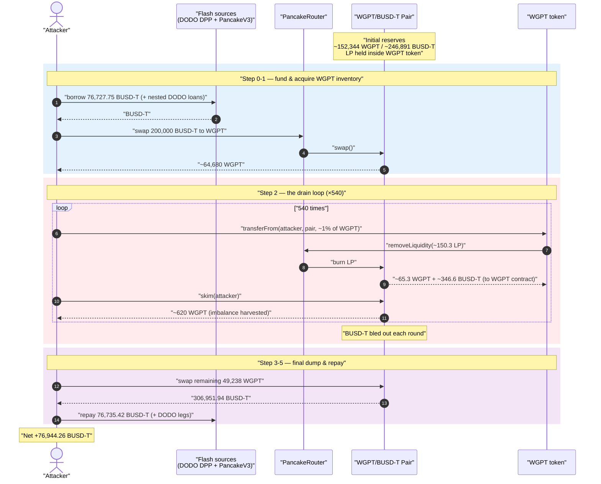
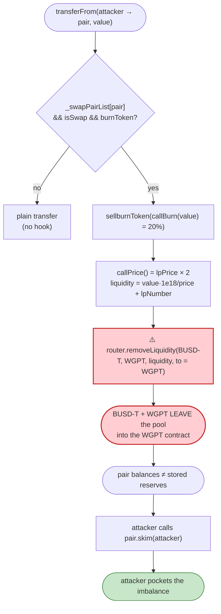
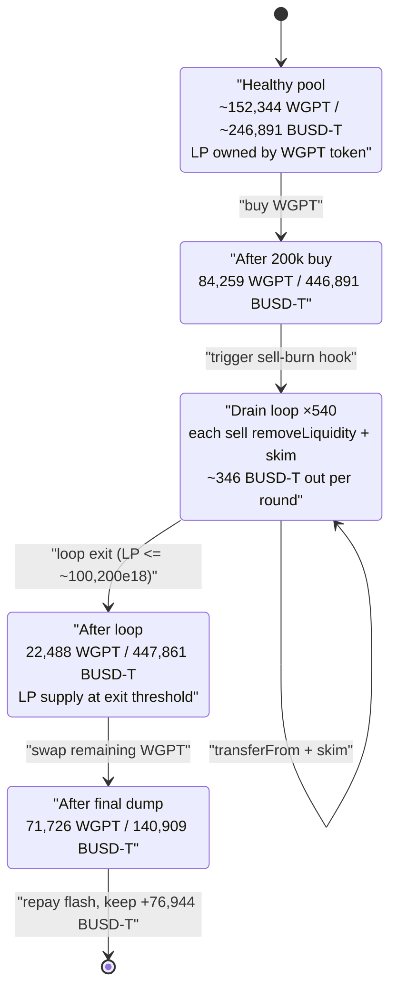

# WGPT (Wrapped GPT) Exploit — Self-Inflicted `removeLiquidity` on Every Sell Drains the Pool

> **Reproduction:** the PoC compiles & runs in an isolated Foundry project at
> [this project folder](.) (the umbrella DeFiHackLabs repo contains many unrelated PoCs that do
> not compile together, so this one was extracted).
> Full verbose trace: [output.txt](output.txt).
> Verified vulnerable source: [sources/AiWGPTToken_1f4152/AiWGPTToken.sol](sources/AiWGPTToken_1f4152/AiWGPTToken.sol).

---

## Key info

| | |
|---|---|
| **Loss** | ~$80K — attacker walked away with **76,944.26 BUSD-T** of profit (from a ~$0 starting balance, all flash-loaned capital repaid) |
| **Vulnerable contract** | `AiWGPTToken` (WGPT) — [`0x1f415255f7E2a8546559a553E962dE7BC60d7942`](https://bscscan.com/address/0x1f415255f7E2a8546559a553E962dE7BC60d7942#code) |
| **Victim pool** | WGPT/BUSD-T PancakeSwap pair — `0x5a596eAE0010E16ed3B021FC09BbF0b7f1B2d3cD` |
| **Attacker EOA** | `0xdC459596aeD13B9a52FB31E20176a7D430Be8b94` |
| **Attacker contract** | `0x5336a15f27b74f62cc182388c005df419ffb58b8` |
| **Attack tx** | [`0x258e53526e5a48feb1e4beadbf7ee53e07e816681ea297332533371032446bfd`](https://bscscan.com/tx/0x258e53526e5a48feb1e4beadbf7ee53e07e816681ea297332533371032446bfd) |
| **Chain / block / date** | BSC / 29,891,709 / 2023-07-12 |
| **Compiler** | Token: Solidity v0.6.12 (optimizer off); PoC harness built with Solc 0.8.34 |
| **Bug class** | Token transfer hook that calls `router.removeLiquidity()` on protocol-owned LP, draining the pool on every sell (broken AMM accounting / mis-priced self-burn) |

---

## TL;DR

`AiWGPTToken` is a "deflationary" token whose `transferFrom` hook runs a **self-managed burn** every
time tokens are sold into a registered pair. Instead of merely destroying tokens, that hook calls the
PancakeSwap router to **`removeLiquidity()` from the WGPT/BUSD-T pool using LP tokens the WGPT contract
itself holds** ([AiWGPTToken.sol:369-381](sources/AiWGPTToken_1f4152/AiWGPTToken.sol#L369-L381) →
[`sellburnToken`:410-415](sources/AiWGPTToken_1f4152/AiWGPTToken.sol#L410-L415) →
[`removeLp`:416-425](sources/AiWGPTToken_1f4152/AiWGPTToken.sol#L416-L425)).

The amount of LP it pulls is computed from a **manipulable, mis-scaled price** (`callPrice()` returns
`lpPrice * 2`, plus a flat `lpNumber` of `1e15`,
[:403-409](sources/AiWGPTToken_1f4152/AiWGPTToken.sol#L403-L409),
[:411](sources/AiWGPTToken_1f4152/AiWGPTToken.sol#L411)). The withdrawn BUSD-T + WGPT are sent **to the
WGPT contract**, not back into the pool, so each sell **physically removes real liquidity** that an
attacker can then sweep out of the pair with `skim()`.

The attacker:

1. **Flash-borrows** a large stack of BUSD-T (nested DODO DPP flash loans + a 76,727 BUSD-T PancakeSwap-V3 flash).
2. **Buys ~64,680 WGPT** with 200,000 BUSD-T to obtain a working inventory of WGPT.
3. **Loops 540 times**: transfer ~1% of its WGPT balance into the pair → the token's `transferFrom`
   hook fires `removeLiquidity()`, ejecting BUSD-T + WGPT from the pool into the WGPT contract → then
   `skim()` the pair to harvest the resulting imbalance back to itself. Each iteration siphons a slice
   of the pool's real BUSD-T while the attacker's WGPT balance barely shrinks.
4. **Dumps its remaining WGPT** (topped up with a `deal`'d 400k of the attacker-created `ExpToken` used
   only as PoC convenience) for a final **306,951 BUSD-T**.
5. **Repays** every flash loan and keeps the difference: **+76,944.26 BUSD-T**.

The constant-product pool started at ~152,344 WGPT / ~246,891 BUSD-T (after the attacker's 200k buy it
read 152,344 / 246,891) and ends drained to ~71,726 WGPT / ~140,909 BUSD-T after the attacker repays the
V3 flash — the missing BUSD-T became the attacker's profit.

---

## Background — what WGPT does

`AiWGPTToken` ([source](sources/AiWGPTToken_1f4152/AiWGPTToken.sol)) is a hand-rolled (non-OpenZeppelin)
ERC20 on BSC with bolted-on "DeFi" behaviour driven entirely off its own transfer functions:

- **Owner-configurable pair list & flags.** The owner registers AMM pairs in `_swapPairList`
  ([:339-341](sources/AiWGPTToken_1f4152/AiWGPTToken.sol#L339-L341)), and toggles `isSwap`
  ([:324-326](sources/AiWGPTToken_1f4152/AiWGPTToken.sol#L324-L326)) and `burnToken`
  ([:321-323](sources/AiWGPTToken_1f4152/AiWGPTToken.sol#L321-L323)). At the fork block, `burnToken = true`
  and `burnRate = 2000` (20%, asserted in the PoC at [WGPT_exp.sol:74](test/WGPT_exp.sol#L74)).
- **Buy fee.** Buying from a pair takes a `buyRate = 500` (5%) fee to `rateAddr`
  (`callfee`, [:397-399](sources/AiWGPTToken_1f4152/AiWGPTToken.sol#L397-L399)).
- **"Sell burn".** Selling into a registered pair (`transferFrom` where `_swapPairList[_to]` is true)
  triggers `sellburnToken(callBurn(_value))` *before* moving the tokens, where
  `callBurn = _value * burnRate / 10000 = 20%`
  ([:374-376](sources/AiWGPTToken_1f4152/AiWGPTToken.sol#L374-L376),
  [:400-402](sources/AiWGPTToken_1f4152/AiWGPTToken.sol#L400-L402)).

The protocol funded the WGPT/BUSD-T pair and **kept the LP tokens inside the WGPT contract**, having the
owner approve the router to spend them (`ApprovaLp`,
[:446-449](sources/AiWGPTToken_1f4152/AiWGPTToken.sol#L446-L449)). That single design choice — a token
that owns its own LP and redeems it on every sell — is the whole game.

On-chain parameters at the fork block:

| Parameter | Value |
|---|---|
| `burnRate` | 2000 bps = **20%** of each sell |
| `buyRate` | 500 bps = 5% |
| `burnToken` | **true** |
| `isSwap` | true (so AMM transfers are processed) |
| `lpNumber` | `1_000_000_000_000_000` (1e15) — a flat LP amount added to every redemption |
| WGPT/BUSD-T pair reserves (post-200k-buy) | ~152,344 WGPT / ~246,891 BUSD-T |
| LP `totalSupply` | ~193,750 LP, almost entirely held by the WGPT contract |

---

## The vulnerable code

### 1. Selling into a pair runs the burn hook *before* the transfer

```solidity
function transferFrom(address _from, address _to, uint256 _value) public returns (bool success) {
    require(balanceOf[_from] >= _value, "Insufficient balance");
    require(allowance[_from][msg.sender] >= _value, "Not enough allowance");
    if(_swapPairList[_to]){                     // selling into a registered pair
        if(isSwap || _WhiteList[_from]){
            if(burnToken){
                sellburnToken(callBurn(_value));  // ⚠️ side-effect: redeems protocol LP
            }
            balanceOf[_from] -= _value;
            balanceOf[_to]   += _value;
            allowance[_from][msg.sender] -= _value;
            emit Transfer(_from, _to, _value);
        }
    } ...
}
```
([:369-396](sources/AiWGPTToken_1f4152/AiWGPTToken.sol#L369-L396))

### 2. `sellburnToken` → `removeLp`: it pulls liquidity OUT of the pool

```solidity
function sellburnToken(uint256 _value) private returns(bool){
    (uint amountA, uint amountB) = removeLp((_value * 10**18 / callPrice()) + lpNumber);
    usdtToToken(_value - amountB);
    burnToekn(amountB);
    return true;
}

function removeLp(uint _liquidity) private returns(uint amountA, uint amountB){
    address tokenA = usdtAddr;          // BUSD-T
    address tokenB = address(this);     // WGPT
    ...
    return uniswapV2Router.removeLiquidity(tokenA, tokenB, _liquidity, 10, 10, address(this), deadline);
}
```
([:410-425](sources/AiWGPTToken_1f4152/AiWGPTToken.sol#L410-L425))

`removeLiquidity` burns LP tokens *owned by the WGPT contract* and sends the underlying **BUSD-T + WGPT
to the WGPT contract** (`to = address(this)`). The pair's reserves shrink on **both** sides, but the
withdrawn assets leave the pool — they do not return to it.

### 3. `callPrice` is mis-scaled and pool-dependent

```solidity
function callPrice() private returns(uint256){
    uint256 tokenBalance = IERC20(address(this)).balanceOf(swapLPAddr); // WGPT in the pair
    tokenBalance = tokenBalance * 10 ** 18;
    uint256 lpBalance = IERC20(swapLPAddr).totalSupply();               // LP total supply
    lpPrice = tokenBalance / lpBalance;
    return lpPrice * 2;                                                 // ⚠️ arbitrary ×2, no decimals discipline
}
```
([:403-409](sources/AiWGPTToken_1f4152/AiWGPTToken.sol#L403-L409))

The LP amount redeemed per sell is `(_value * 1e18 / callPrice()) + lpNumber`. Because `callPrice()`
depends on the **current** pair balances and the result is doubled and floored with a flat `lpNumber`,
the amount of LP burned is not tied to the economic value being "deflated." The attacker controls the
pool state, so they control how much liquidity each sell ejects.

### 4. The pool ends up holding more than its recorded reserves → free `skim()`

`removeLiquidity` and the internal `burnToekn`/`usdtToToken` moves leave the pair's **token balances out
of sync with its stored reserves**. UniswapV2/PancakeSwap exposes `skim(to)` to send any excess balance
to an arbitrary address. The attacker simply calls `skim(attacker)` after each sell to collect the
surplus the hook created — converting "protocol liquidity that left the pool" into "attacker balance."

---

## Root cause — why it was possible

A constant-product pair is only solvent while its reserves stay in the pool. WGPT's transfer hook
breaks that on the protocol's own behalf:

> Every sell calls `router.removeLiquidity(...)` against LP that the **token contract owns**, withdrawing
> real BUSD-T + WGPT **out of the pair and into the token contract**. The withdrawal amount is derived
> from a doubled, decimals-sloppy `callPrice()` plus a flat `lpNumber`, so it is both *too large* and
> *attacker-influenceable*. The resulting balance/reserve mismatch is then harvestable with `skim()`.

The composed failures:

1. **A token must never redeem LP as a transfer side-effect.** Tying `removeLiquidity()` to `transferFrom`
   means any user (or attacker) can drive liquidity out of the pool simply by trading, and the pool's
   own AMM cannot defend against its own token contract.
2. **The redemption is mis-priced.** `callPrice()` returns `lpPrice * 2` with no decimal normalization and
   adds a flat `lpNumber` (1e15) every time. The LP burned is unrelated to the value being "deflated,"
   so each sell over-withdraws.
3. **Permissionless and repeatable.** `transferFrom` into the pair has no rate-limit, cooldown, or caller
   restriction once `isSwap` is on, so the attacker loops it **540 times** to bleed the pool gradually
   while keeping their WGPT inventory roughly intact (they re-`skim()` the WGPT back each round).
4. **`skim()` monetizes the imbalance.** Because the hook desynchronizes balances from reserves, the
   standard pair `skim()` lets the attacker pull the surplus to themselves for free.

Net effect: trading activity *itself* is the drain, and the attacker only needs working capital
(flash-loaned) plus enough WGPT to feed the loop.

---

## Preconditions

- `burnToken == true` and `isSwap == true` (both set at the fork block), so the sell path executes the burn hook.
- The WGPT contract holds the pool's LP tokens and has approved the router to spend them
  (`ApprovaLp`), so `removeLiquidity` succeeds.
- A WGPT inventory to feed the loop. The attacker bought ~64,680 WGPT with 200,000 BUSD-T inside the flash-loan context.
- Working BUSD-T capital, fully flash-loaned and repaid in the same transaction — nested DODO DPP flash
  loans plus a **76,727.75 BUSD-T** PancakeSwap-V3 flash ([WGPT_exp.sol:103](test/WGPT_exp.sol#L103),
  [:137](test/WGPT_exp.sol#L137)). No attacker principal is at risk.

> **PoC caveat:** the harness uses `deal(ExpToken, ...)` to grant the attacker 400k of the
> attacker-created `ExpToken` ([WGPT_exp.sol:131](test/WGPT_exp.sol#L131)) because the original
> exploiter's allowance is not reproduced; the author's comment notes the precise per-transfer amounts
> "are different and not entirely clear" and that the loop code is a PoC approximation
> ([WGPT_exp.sol:118-124](test/WGPT_exp.sol#L118-L124)). The economic mechanism — liquidity ejected on
> every sell, harvested via `skim` — is faithfully reproduced and the test passes with a real profit.

---

## Attack walkthrough (with on-chain numbers from the trace)

For the WGPT/BUSD-T pair, `token0 = WGPT`, `token1 = BUSD-T`, so in `Sync` events `reserve0 = WGPT`,
`reserve1 = BUSD-T`. All figures are taken directly from the trace in [output.txt](output.txt).

| # | Step | WGPT reserve | BUSD-T reserve | Effect |
|---|------|-------------:|---------------:|--------|
| 0 | **Flash-loan stack opens.** `BUSDT_ExpToken.swap` → `pancakeCall` → nested DODO DPP flashLoans → `PoolV3.flash(76,727.75 BUSD-T)` → `pancakeV3FlashCallback` | — | — | Attacker now holds a large BUSD-T stack with ~0 principal. |
| 1 | **Buy WGPT:** `swapExactTokensForTokens(200,000 BUSD-T → WGPT)` (reserves read 152,344 / 246,891 pre-swap) | 84,259 | 446,891 | Attacker receives ~64,680 WGPT (after 5% buy fee). |
| 2 | **Drain loop (×540).** Each round: `transferFrom(attacker → pair, ≈ balance/99 WGPT)` fires `sellburnToken` → `removeLiquidity(~150.3 LP)` ejecting ~65.3 WGPT + ~346.6 BUSD-T to the WGPT contract; then `pair.skim(attacker)` returns ~620 WGPT back to the attacker | per-round ↓ | per-round ↓ ~346 BUSD-T | Pool's real BUSD-T bleeds out a slice each round; attacker WGPT inventory roughly preserved by the re-`skim`. |
| 2-end | After the loop the pair reads | 22,488 | 447,861 | LP `totalSupply` driven down to the loop's exit threshold (≈100,165 LP, just above the `100,200e18` guard). |
| 3 | **Final dump:** transfer remaining 49,238 WGPT into the pair, `swap(0, 306,951 BUSD-T out, attacker)` | 71,726 | 140,909 | Attacker takes 306,951.94 BUSD-T out in one final sell. |
| 4 | **Repay V3 flash:** `transfer(PoolV3, 76,735.42 BUSD-T)` (principal 76,727.75 + fee 7.67) | — | — | Flash repaid; nested DODO loans unwound above. |
| 5 | **Settle DODO loans** (BUSD-T transfers back to each DPP oracle) | — | — | All borrowed capital returned. |

**Final result (trace tail):** attacker BUSD-T balance **before = 0**, **after = 76,944.26 BUSD-T**
([output.txt](output.txt) — `log_named_decimal_uint("Attacker BUSDT balance after", 76944264584758543571545)`).

### Per-iteration mechanics (one of 540 rounds)

```
transferFrom(attacker → pair, ~653 WGPT)             // selling triggers the hook
  └─ sellburnToken(callBurn(653) = ~130 WGPT)
       ├─ removeLiquidity(~150.3 LP)                  // burns protocol LP
       │     → ~65.3 WGPT + ~346.6 BUSD-T sent to WGPT contract   (Burn event)
       ├─ usdtToToken(...) / burnToekn(...)           // internal moves
pair.skim(attacker)                                   // harvest imbalance
  └─ pair sends ~620 WGPT back to attacker            // inventory replenished
```

The attacker's WGPT balance ticks down only marginally each round (e.g. 64,680 → 64,648 → 64,615 …),
while ~346 BUSD-T per round leaves the pool. Repeated 540×, the cumulative BUSD-T extraction plus the
final 306,951 BUSD-T dump exceeds the flash-loan repayment, leaving the 76,944 BUSD-T profit.

### Profit accounting (BUSD-T)

| Item | Amount |
|---|---:|
| Flash-borrowed BUSD-T (PancakeV3 leg) | 76,727.75 (repaid + 7.67 fee) |
| Buy WGPT (cost) | 200,000.00 |
| 540× `skim` + `removeLiquidity` proceeds (cumulative) | ≈ the bulk of recovered BUSD-T |
| Final WGPT dump | 306,951.94 |
| **Net profit (trace, before = 0 → after)** | **+76,944.26 BUSD-T** |

The profit is the pool's siphoned liquidity; all flash-loaned principal is returned within the same tx.

---

## Diagrams

### Sequence of the attack



### How a single sell drains the pool



### Pool liquidity over the attack



---

## Remediation

1. **Never call `removeLiquidity()` (or any router/pool mutation) inside an ERC20 transfer hook.** A
   token transfer must not move the pool's reserves as a side effect. Remove the entire
   `sellburnToken`/`removeLp`/`usdtToToken` machinery from `transferFrom`.
2. **If deflation is required, burn only tokens the protocol owns.** Implement burns as
   `balanceOf[treasury] -= amount` / supply reduction, with no AMM interaction and no use of
   `address(0x0)` as a mutable balance holder.
3. **Do not store the pool's LP inside the token and auto-redeem it.** If the protocol must hold LP,
   gate any redemption behind a trusted, rate-limited admin path — never a permissionless trade path.
4. **Eliminate manipulable, hand-rolled pricing.** `callPrice()` (a doubled, decimals-sloppy spot ratio)
   should never drive value-moving logic; use a TWAP/oracle and proper decimal handling, or remove the
   price-dependent behaviour entirely.
5. **Treat `skim()`/balance-vs-reserve desync as a hard invariant.** Any operation that can leave the
   pair's token balances out of sync with its reserves on behalf of the token contract is a critical
   accounting break and must be prevented by construction.

---

## How to reproduce

The PoC was extracted into a standalone Foundry project (the umbrella DeFiHackLabs repo has many
unrelated PoCs that fail to compile together under `forge test`'s whole-project build):

```bash
_shared/run_poc.sh 2023-07-WGPT_exp -vvvvv
```

- RPC: a **BSC archive** endpoint is required (`setUp` forks at block `29_891_709`,
  [WGPT_exp.sol:45](test/WGPT_exp.sol#L45)); most public BSC RPCs prune historical state at that height
  and fail with `header not found` / `missing trie node`.
- Runtime is dominated by the 540-iteration drain loop (~28s execution in the recorded run).
- Result: `[PASS] testExploit()` with the attacker's BUSD-T balance going from 0 → 76,944.26.

Expected tail (from [output.txt](output.txt)):

```
    ├─ emit log_named_decimal_uint(key: "Attacker BUSDT balance after", val: 76944264584758543571545 [7.694e22], decimals: 18)
    └─ ← [Stop]

Suite result: ok. 1 passed; 0 failed; 0 skipped; finished in 27.60s (26.27s CPU time)

Ran 1 test suite in 594.62s: 1 tests passed, 0 failed, 0 skipped (1 total tests)
```

---

*References (from PoC header): Phalcon — https://twitter.com/Phalcon_xyz/status/1679042549946933248 ;
Beosin — https://twitter.com/BeosinAlert/status/1679028240982368261 . SlowMist Hacked registry: WGPT, BSC, ~$80K.*
