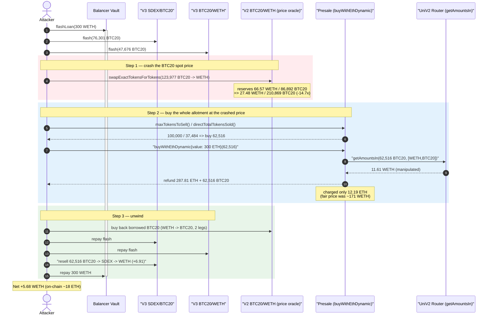
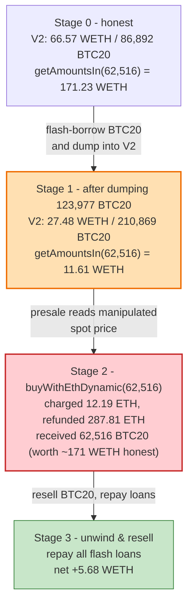
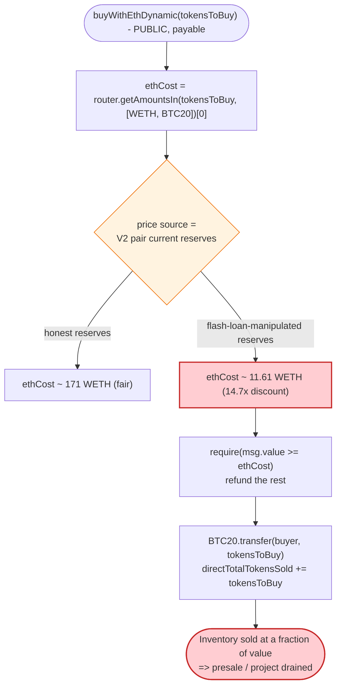

# BTC20 / 24Pixels Presale Exploit — Spot-AMM Price Oracle Manipulation in `buyWithEthDynamic()`

> **Reproduction:** the PoC compiles & runs in an isolated Foundry project at
> [this project folder](.) (the umbrella DeFiHackLabs repo contains many
> unrelated PoCs that do not whole-compile, so this one was extracted).
> Full verbose trace: [output.txt](output.txt).
> Verified token source: [BTC20Token.sol](sources/BTC20Token_E86DF1/BTC20Token.sol).
> The vulnerable logic lives in the **presale** implementation behind
> [`TransparentUpgradeableProxy 0x1F006F…`](sources/TransparentUpgradeableProxy_1F006F/) (impl `0xe69be7d6…`, source not verified on-chain — reconstructed from the trace).

---

## Key info

| | |
|---|---|
| **Loss** | **~18 ETH** reported on-chain (SlowMist); the isolated single-iteration PoC nets **5.68 WETH** in one flash-loan cycle |
| **Vulnerable contract** | `PresaleV4` (`buyWithEthDynamic`) behind proxy [`0x1F006F43f57C45Ceb3659E543352b4FAe4662dF7`](https://etherscan.io/address/0x1F006F43f57C45Ceb3659E543352b4FAe4662dF7) (impl `0xe69be7d6b306b4fbce516e3f07c8f438a6860084`) |
| **Sold token** | `BTC20Token` (BTC20) — [`0xE86DF1970055e9CaEe93Dae9B7D5fD71595d0e18`](https://etherscan.io/address/0xE86DF1970055e9CaEe93Dae9B7D5fD71595d0e18#code) |
| **Manipulated oracle / victim pool** | BTC20/WETH **Uniswap V2** pair `0xd50C5B8f04587D67298915E099E170af3Cd6909A` (read via `getAmountsIn`) |
| **Liquidity sources tapped** | Balancer Vault `0xBA1222…2C8`; Uniswap V3 SDEX/BTC20 pair `0xDb81b8…E385`; Uniswap V3 BTC20/WETH pair `0x7234c9…E14e` |
| **Attacker EOA** | `0x6Ce9fA08F139f5e48Bc607845e57EFE9aa34C9f6` |
| **Attacker contract** | `0xb7fBf984A50CD7c66e6dA3448D68d9F3B7f24f33` |
| **Attack tx** | [`0xcdd93e37ba2991ce02d8ca07bf6563bf5cd5ae801cbbce3dd0babb22e30b2dbe`](https://etherscan.io/tx/0xcdd93e37ba2991ce02d8ca07bf6563bf5cd5ae801cbbce3dd0babb22e30b2dbe) |
| **Chain / fork block / date** | Ethereum mainnet / 17,949,214 (attack at 17,949,215) / Aug 19, 2023 |
| **Compiler** | BTC20 token: Solidity v0.8.9 (optimizer off); presale impl: v0.8.9 |
| **Bug class** | Price-oracle manipulation — presale prices its tokens off a **spot** Uniswap V2 reserve via `getAmountsIn`, manipulable inside one transaction with a flash loan |

---

## TL;DR

The 24Pixels/BTC20 **dynamic presale** lets anyone buy a fixed remaining token allotment via
`buyWithEthDynamic(tokenAmount)`. It computes the ETH price for that allotment by calling
`UniswapV2Router.getAmountsIn(tokenAmount, [WETH, BTC20])` — i.e., it reads the **instantaneous
reserves** of the BTC20/WETH Uniswap V2 pair as its price source.

That spot price is trivially manipulable. The attacker, inside a single transaction funded by
nested flash loans:

1. **Crashes the BTC20/WETH price** by dumping ~123,977 BTC20 into the V2 pair, moving its reserves
   from `66.57 WETH / 86,892 BTC20` to `27.48 WETH / 210,869 BTC20` — i.e., making BTC20 ~14.7× cheaper.
2. **Buys the entire remaining presale allotment** (62,516 BTC20 = `maxTokensToSell − directTotalTokensSold`)
   through `buyWithEthDynamic`. At the crashed price, `getAmountsIn(62,516 BTC20)` returns **11.61 WETH**
   instead of the **171.23 WETH** it would have returned at the honest pre-attack reserves. The presale
   charges only **12.19 ETH** for those 62,516 BTC20 and refunds the rest.
3. **Resells** the cheaply-acquired 62,516 BTC20 elsewhere and repays every flash loan, walking off with
   the difference.

Concretely (single PoC iteration): the presale sells ~$170-worth of BTC20 (at honest price) for ~12 ETH,
and the whole cycle nets the attacker **5.68 WETH**. The on-chain attacker repeated/sized this to ~18 ETH.

---

## Background — what the BTC20 presale does

`BTC20Token` ([source](sources/BTC20Token_E86DF1/BTC20Token.sol)) is itself a **plain, unremarkable
ERC20** — fixed `hardCap` of 21,000,000 BTC20, a standard `_transfer`/`_mint`/`_burn`, and `Ownable`.
There is no tax, no rebase, no pool-burn. The token is not where the bug lives.

The bug lives in the **presale contract** (`PresaleV4`, an upgradeable proxy at `0x1F006F…`). It holds a
large BTC20 inventory and sells it to the public. Its source is not verified on Etherscan, but the trace
exposes its full behaviour. The relevant entry point is `buyWithEthDynamic(uint256 tokensToBuy)`, plus
two public views the attacker reads to size its purchase:

| Presale view / fn | Trace evidence | Value at attack block |
|---|---|---|
| `directTotalTokensSold()` | [output.txt:1698-1700](output.txt) | `37,484` (whole tokens) |
| `maxTokensToSell()` | [output.txt:1702-1704](output.txt) | `100,000` (whole tokens) |
| `buyWithEthDynamic{value:…}(tokens)` | [output.txt:1706-1726](output.txt) | priced via `getAmountsIn` |

So the remaining allotment is `100,000 − 37,484 = 62,516` BTC20 — exactly the amount the attacker buys
(`buyAmount` in [BTC20_exp.sol:100](test/BTC20_exp.sol#L100)).

Inside `buyWithEthDynamic`, the presale prices the buy by asking the **Uniswap V2 router** how much WETH
it would take to buy `tokensToBuy` BTC20 on the open market:

```text
output.txt:1707  uniRouter::getAmountsIn(62516e18, [WETH, BTC20])  →  [11.6142 WETH, 62516 BTC20]
output.txt:1708  └─ BTC20_WETH_Pair2::getReserves()  →  (27.478 WETH, 210869 BTC20)   // manipulated
```

It then charges that ETH amount (plus a small markup → 12.19 ETH), forwards the fee, refunds the
unused `msg.value`, and `transfer`s the 62,516 BTC20 to the buyer
([output.txt:1711-1722](output.txt)). **The price source is the live AMM reserve, sampled at call
time, with no TWAP, no Chainlink feed, and no sanity bound.**

---

## The vulnerable code

### 1. Presale price = spot `getAmountsIn` (reconstructed from the trace)

The presale's `buyWithEthDynamic` does (paraphrased from the call sequence
[output.txt:1706-1726](output.txt)):

```solidity
function buyWithEthDynamic(uint256 tokensToBuy) external payable returns (bool) {
    // PRICE = how much WETH it takes to buy `tokensToBuy` BTC20 on Uniswap V2, right now
    address;
    path[0] = WETH;
    path[1] = BTC20;
    uint256 ethCost = router.getAmountsIn(tokensToBuy * 1e18, path)[0]; // ← SPOT reserve read
    ethCost = ethCost + ethCost / 100 + 1;                              // ~1% markup

    require(msg.value >= ethCost, "...");
    payable(feeWallet).transfer(...);          // forwards fee   (output.txt:1711)
    payable(msg.sender).transfer(msg.value - ethCost); // refunds change (output.txt:1713)

    directTotalTokensSold += tokensToBuy;      // storage @229: 37484 → 100000 (output.txt:1724)
    BTC20.transfer(msg.sender, tokensToBuy * 1e18); // delivers tokens (output.txt:1716)
    emit TokensBought(msg.sender, tokensToBuy, address(0), ethCost, 0, block.timestamp);
    return true;
}
```

The one line that matters is `router.getAmountsIn(..., [WETH, BTC20])`. `getAmountsIn` is a pure
function of the pair's **current** reserves:

```
amountIn = (reserveWETH · amountOutBTC20 · 1000) / ((reserveBTC20 − amountOutBTC20) · 997) + 1
```

Whoever controls the reserves at the instant of the call controls the price.

### 2. The token is a stock ERC20 — no protections

`BTC20Token._transfer` ([BTC20Token.sol:391-411](sources/BTC20Token_E86DF1/BTC20Token.sol#L391-L411))
is a textbook ERC20 transfer with no anti-MEV, no max-tx, no cooldown. Nothing in the token impedes the
attacker's pool dump or resale.

---

## Root cause — why it was possible

> **The presale uses a single-block spot AMM reserve as its pricing oracle.** A Uniswap V2 pair's
> `getReserves()` (and therefore `getAmountsIn`) reflects the *current* state of the pool, which any
> actor can move arbitrarily within the same transaction using a flash loan. Pricing a primary token
> sale off that number means the sale price can be driven to near-zero on demand.

Three design choices compose into the loss:

1. **Spot oracle, not TWAP.** `getAmountsIn` reads instantaneous reserves. The attacker pre-loads the
   pair so that, at the exact moment of the buy, BTC20 looks ~14.7× cheaper than its honest price.
2. **The sale price is the *only* gate.** There is no minimum ETH floor, no per-token hard price, and no
   bound on how far the quoted price may deviate from a reference. A 14.7× discount sails through.
3. **The remaining allotment is publicly readable and buyable in one call.** `maxTokensToSell()` and
   `directTotalTokensSold()` let the attacker compute the exact `62,516` to sweep the whole inventory in
   a single `buyWithEthDynamic`, so the manipulated price only has to hold for one block.

Quantitatively (verified with the UniV2 `getAmountsIn` formula against the trace reserves):

| Reserves used for the quote | `getAmountsIn(62,516 BTC20)` |
|---|---:|
| **Honest** (pre-attack): 66.57 WETH / 86,892 BTC20 | **171.23 WETH** |
| **Manipulated** (post-dump): 27.48 WETH / 210,869 BTC20 | **11.61 WETH** ← matches trace [output.txt:1710](output.txt) |

The presale handed over inventory worth ~171 WETH (at honest spot) for ~12 ETH.

---

## Preconditions

- The presale is live with remaining inventory: `directTotalTokensSold < maxTokensToSell`
  (37,484 < 100,000 ✓).
- A BTC20/WETH Uniswap V2 pair exists and is the price source for `getAmountsIn`
  (`BTC20_WETH_Pair2 0xd50C5B…909A`), and its reserves are thin enough to move cheaply
  (only ~66.6 WETH / 86,892 BTC20 of liquidity).
- Working capital to (a) dump BTC20 into the V2 pair and (b) pay the (now-cheap) presale price. All of
  it is recovered intra-transaction → **flash-loanable**. The PoC sources it from a 300 WETH Balancer
  flash loan plus two nested Uniswap V3 flash loans (SDEX/BTC20 and BTC20/WETH) for the BTC20 inventory
  to dump ([BTC20_exp.sol:51, 68, 91](test/BTC20_exp.sol#L51)).

---

## Step-by-step attack walkthrough (with on-chain numbers from the trace)

The PoC nests three flash loans to source the BTC20 it dumps and the WETH it spends, then unwinds them
in reverse. All figures are taken directly from the `getReserves`/`Sync`/`Swap`/`Return` lines in
[output.txt](output.txt). For the V2 pair, `token0 = WETH`, `token1 = BTC20`.

| # | Step | Trace ref | BTC20/WETH V2 reserves (WETH / BTC20) | Effect |
|---|------|-----------|---------------------------------------|--------|
| 0 | **Balancer flash loan** 300 WETH | [:1634](output.txt) | 66.57 / 86,892 (honest) | Working capital in. |
| 1 | **V3 flash** 76,301 BTC20 from SDEX/BTC20 pair, then **V3 flash** 47,676 BTC20 from BTC20/WETH V3 pair | [:1641](output.txt), [:1653](output.txt) | unchanged | Borrow BTC20 to dump. |
| 2 | **Dump** 123,977 BTC20 into the V2 pair (`swapExactTokensForTokens` BTC20→WETH) | [:1667-1690](output.txt) | **27.48 / 210,869** | Crashes BTC20 spot price ~14.7×; +39.09 WETH out. |
| 3 | Read `directTotalTokensSold()=37,484`, `maxTokensToSell()=100,000` | [:1698-1704](output.txt) | 27.48 / 210,869 | Compute remaining allotment = 62,516 BTC20. |
| 4 | **`buyWithEthDynamic{value: 300 ETH}(62,516)`** — `getAmountsIn` quotes **11.61 WETH**, charged **12.19 ETH**, **287.81 ETH refunded**, 62,516 BTC20 delivered | [:1706-1726](output.txt) | 27.48 / 210,869 (presale doesn't touch the pair) | Buys ~171-WETH-worth of BTC20 for ~12 ETH. |
| 5 | **Buy back** the borrowed BTC20 to repay the V3 flashes (`swapTokensForExactTokens` WETH→BTC20, two legs) and return it to the V3 pairs | [:1729-1806](output.txt) | 35.63 / 162,716 → 67.79 / 85,652 | Repays both V3 flash loans in-kind. |
| 6 | **Resell** the 62,516 cheap BTC20 via V3: BTC20→SDEX→WETH | [:1818](output.txt), [:1853-1879](output.txt) | — | 62,516 BTC20 → 1,270,786 SDEX → **6.91 WETH**. |
| 7 | **Repay** Balancer 300 WETH (0 fee) | [:1880](output.txt) | — | Loan closed. |
| 8 | **Settle** | [:1894](output.txt) | — | Final WETH balance **5.6847 WETH** = profit. |

> The attacker sends `value: 300 ETH` to the presale as native ETH (the test account is pre-funded with
> ETH by Foundry; on-chain the attacker held ETH). The presale immediately **refunds 287.81 ETH**
> ([output.txt:1713-1714](output.txt)) because the manipulated quote was only 12.19 ETH — the refund is
> the clearest single piece of evidence that the price was driven to a fraction of fair value.

### Profit accounting (this PoC, WETH-denominated)

| Leg | Amount (WETH) | Trace ref |
|---|---:|---|
| Balancer flash loan in | +300.00 | [:1634](output.txt) |
| Dump BTC20 → WETH (step 2) | +39.09 | [:1679](output.txt) |
| `buyWithEthDynamic` net cost (12.19 charged, 287.81 refunded of the 300 ETH) | −12.19 | [:1711-1713](output.txt) |
| Repay V3 flash #1 (BTC20 bought with WETH, leg A) | −8.16 | [:1732](output.txt) |
| Repay V3 flash #2 (BTC20 bought with WETH, leg B) | −32.16 | [:1778](output.txt) |
| Resell 62,516 BTC20 → SDEX → WETH | +6.91 | [:1855](output.txt) |
| Repay Balancer (0 fee) | −300.00 | [:1880](output.txt) |
| **Net profit** | **+5.68** | final balance [:1894](output.txt) = `5,684,731,200,402,649,461` wei |

The on-chain attacker (SlowMist: ~18 ETH) used larger sizing / more presale rounds; the mechanism is
identical. The reported test output is `Attack Exploit: 5.684731200402649461 ETH`.

---

## Diagrams

### Sequence of the attack



### Pool / price-quote evolution



### The flaw inside `buyWithEthDynamic`



---

## Why each magic number

- **`Amount_SDEX_BTC20_Pair3 = 76,301 BTC20` and `Amount_BTC20_WETH_Pair3 = 47,676 BTC20`**
  ([BTC20_exp.sol:27-28](test/BTC20_exp.sol#L27-L28)): the two nested V3 flash amounts, sized so that the
  combined ~123,977 BTC20 dumped into the V2 pair crashes its price by exactly enough to make the
  62,516-token presale buy profitable while still being repayable.
- **`buyAmount = maxTokensToSell() − directTotalTokensSold() = 100,000 − 37,484 = 62,516`**
  ([BTC20_exp.sol:100](test/BTC20_exp.sol#L100)): sweeps the *entire* remaining presale inventory in one
  call, so the manipulated price only needs to hold for that single transaction.
- **`{value: totalBorrowed} = 300 ETH`** ([BTC20_exp.sol:101](test/BTC20_exp.sol#L101)): a deliberate
  over-payment. The presale refunds whatever exceeds the (manipulated) quote, so sending plenty avoids a
  revert if the quote lands slightly higher than expected; here 287.81 ETH came straight back.
- **`amountOut = amount + amount/100 + 1`** ([BTC20_exp.sol:92, 102](test/BTC20_exp.sol#L92)): the V3
  flash repayment amount including the ~1% V3 flash fee.

---

## Remediation

1. **Never price a primary token sale off a spot AMM reserve.** Replace `getAmountsIn`/`getReserves`
   with a manipulation-resistant source: a Uniswap V2/V3 **TWAP** over a meaningful window, or a
   Chainlink price feed. A single-block reserve read is not an oracle.
2. **Set a hard price floor / ceiling.** The presale should have a configured minimum ETH-per-token and
   reject any quote that deviates beyond a small band from a reference price. A 14.7× discount must
   revert.
3. **Decouple sale price from tradable pool depth.** If a market price must inform the sale, sanity-check
   it against an independent reference and cap per-transaction / per-block purchase size so a single
   manipulated block cannot drain the whole inventory.
4. **Rate-limit the allotment.** Selling the entire `maxTokensToSell − directTotalTokensSold` in one
   call let the manipulated price hold for only one block. Per-address and per-block caps raise the cost
   of a flash-loan attack dramatically.
5. **Add reentrancy / flash-loan awareness.** While the core bug is the oracle, guarding the buy path and
   sampling the price across blocks both blunt single-transaction manipulation.

---

## How to reproduce

The PoC was extracted into a standalone Foundry project (the umbrella DeFiHackLabs repo has many
unrelated PoCs that fail under a whole-project `forge build`):

```bash
_shared/run_poc.sh 2023-08-BTC20_exp -vvvvv
```

- RPC: a mainnet **archive** endpoint is required (fork block `17,949,214`). Configure `mainnet` in
  `foundry.toml` / `--fork-url`; most pruned public RPCs will fail with `header not found`.
- Result: `[PASS] testExploit()`.

Expected tail:

```
  Before Start: 0 ETH
  Attack Exploit: 5.684731200402649461 ETH
[PASS] testExploit() (gas: 732713)
Suite result: ok. 1 passed; 0 failed; 0 skipped
```

---

*References: DeFiHackLabs PoC header; Decurity thread
(https://twitter.com/DecurityHQ/status/1692924369662513472); SlowMist Hacked (~18 ETH, Ethereum,
Aug 2023). Presale implementation `0xe69be7d6…` is unverified on Etherscan; its behaviour above is
reconstructed from the verbose execution trace in [output.txt](output.txt).*
