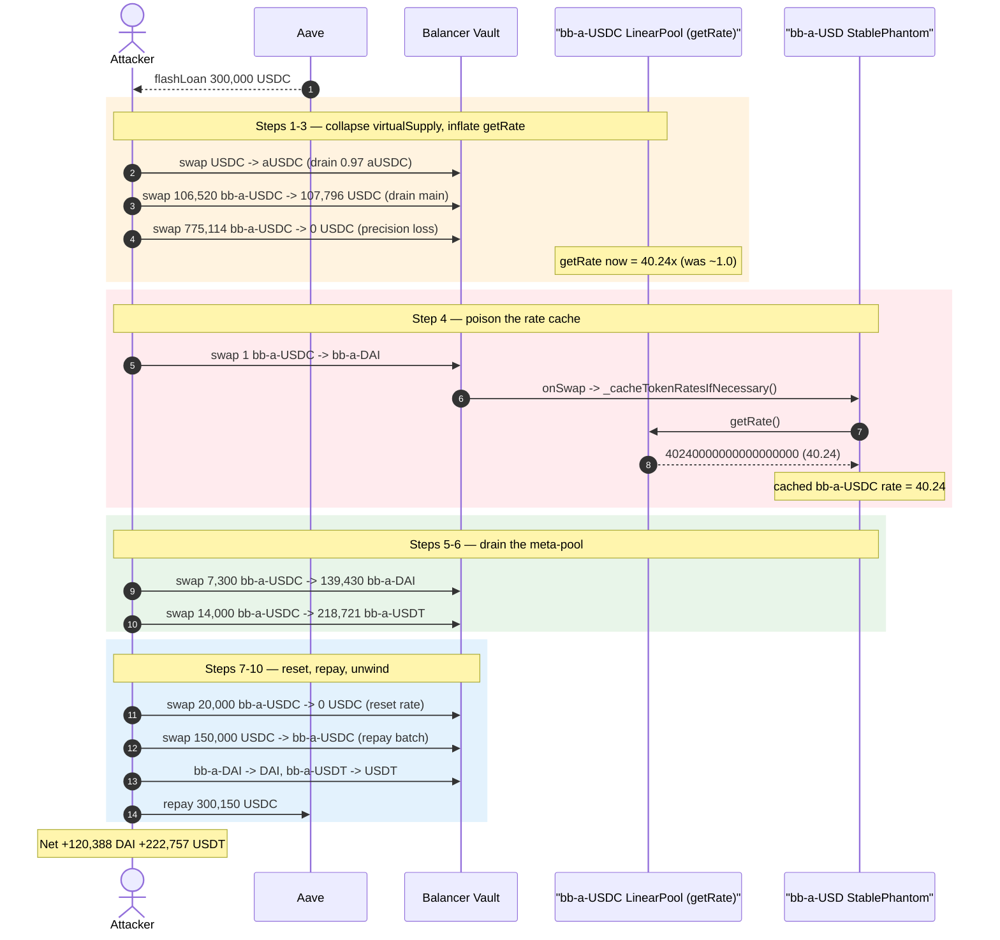
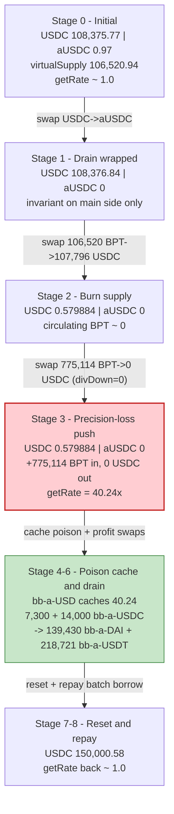
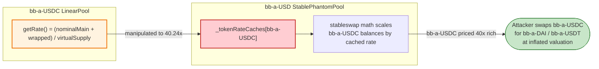

# Balancer Boosted Pools Exploit — Linear-Pool `getRate()` Inflation via BPT Supply Drain + Precision Loss

> **Vulnerability classes:** vuln/oracle/price-manipulation · vuln/arithmetic/precision-loss · vuln/arithmetic/rounding

> **Reproduction:** the PoC compiles & runs in an isolated Foundry project at
> [this project folder](.) (the umbrella DeFiHackLabs repo contains many unrelated PoCs that do
> not whole-compile, so this one was extracted). Full verbose trace:
> [output.txt](output.txt). Verified vulnerable source:
> [contracts_LinearPool.sol](sources/AaveLinearPool_9210f1/contracts_LinearPool.sol),
> [contracts_LinearMath.sol](sources/AaveLinearPool_9210f1/contracts_LinearMath.sol),
> [contracts_StablePhantomPool.sol](sources/StablePhantomPool_7B5077/contracts_StablePhantomPool.sol).

---

## Key info

| | |
|---|---|
| **Loss** | ~$2.1M total across all affected Balancer V2 boosted pools (this PoC reproduces the `bb-a-USD` slice: it walks away with **120,388.65 DAI + 222,757.22 USDT**, ≈ **$343K** of value for a 0.15 USDC flash-loan premium) |
| **Vulnerable contract** | `bb-a-USDC` `AaveLinearPool` — [`0x9210F1204b5a24742Eba12f710636D76240dF3d0`](https://etherscan.io/address/0x9210f1204b5a24742eba12f710636d76240df3d0#code) (the `getRate()` victim); rate consumed by the `bb-a-USD` `StablePhantomPool` [`0x7B50775383d3D6f0215A8F290f2C9e2eEBBEceb2`](https://etherscan.io/address/0x7B50775383d3D6f0215A8F290f2C9e2eEBBEceb2#code) |
| **Victim pools** | `bb-a-USDC`/`USDC`/`aUSDC` Linear pool (id `…0fc`) and the `bb-a-USD` StablePhantom meta-pool (id `…0fe`) holding `bb-a-USDC`/`bb-a-DAI`/`bb-a-USDT` |
| **Attacker EOA** | [`0xed187f37e5ad87d5b3b2624c01de56c5862b7a9b`](https://etherscan.io/address/0xed187f37e5ad87d5b3b2624c01de56c5862b7a9b) |
| **Attacker contract** | [`0x2100dcd8758ab8b89b9b545a43a1e47e8e2944f0`](https://etherscan.io/address/0x2100dcd8758ab8b89b9b545a43a1e47e8e2944f0) |
| **Attack tx** | [`0x2a027c8b915c3737942f512fc5d26fd15752d0332353b3059de771a35a606c2d`](https://etherscan.io/tx/0x2a027c8b915c3737942f512fc5d26fd15752d0332353b3059de771a35a606c2d) |
| **Chain / block / date** | Ethereum mainnet / fork at **18,004,651** / August 2023 |
| **Compiler** | Pools: Solidity **v0.7.1**, optimizer 9999 runs; PoC harness compiled under 0.8.34 |
| **Bug class** | Manipulable, instantaneously-computed share price (`getRate()`) + rounding-to-zero precision loss → cross-pool oracle/cache poisoning |

---

## TL;DR

A Balancer V2 **Linear Pool** (`bb-a-USDC`) exposes `getRate()`, which is the on-chain "share price" of
its BPT measured in underlying units. That rate is
`getRate() = (nominalMain + wrapped) / virtualSupply`
([contracts_LinearPool.sol:546-567](sources/AaveLinearPool_9210f1/contracts_LinearPool.sol#L546-L567)),
where `virtualSupply = totalSupply − BPT-held-by-Vault`
([:656-668](sources/AaveLinearPool_9210f1/contracts_LinearPool.sol#L656-L668)).

The attacker drives the **denominator toward zero** by swapping out almost all the pool's circulating
BPT (`bb-a-USDC`), then does a "give-in" swap of more BPT that, because the invariant is now tiny,
**rounds the USDC payout down to literally 0** in `LinearMath._calcMainOutPerBptIn`
([contracts_LinearMath.sol:142-157](sources/AaveLinearPool_9210f1/contracts_LinearMath.sol#L142-L157)).
That adds value to the pool while burning even more virtual supply, so `getRate()` jumps from its honest
**~1.0** to **40.24** (confirmed in the trace at
[output.txt:1719](output.txt) — `TokenRateCacheUpdated … rate: 40240000000000000000`).

The parent **`bb-a-USD` StablePhantomPool** *caches* this rate the next time any of its tokens is touched
(`_updateTokenRateCache` → `provider.getRate()`,
[contracts_StablePhantomPool.sol:743-752](sources/StablePhantomPool_7B5077/contracts_StablePhantomPool.sol#L743-L752)).
With `bb-a-USDC` now mis-valued at **40.24×** inside the meta-pool, the attacker swaps a few thousand of
its `bb-a-USDC` for **139,430 `bb-a-DAI` + 218,721 `bb-a-USDT`**, unwinds those to real DAI/USDT, repays a
300,000 USDC Aave flash loan, and keeps the difference.

---

## Background — Balancer V2 Boosted (Aave) pools

Balancer's "Boosted" pools are a two-layer construction:

- **Linear Pool** (e.g. `bb-a-USDC`): holds a *main* token (USDC), a *wrapped* yield-bearing token
  (`aUSDC`), and pre-minted **BPT** (`bb-a-USDC` itself). It lets users move between USDC and aUSDC at a
  trusted Aave exchange rate while keeping `nominalMain + wrapped` invariant
  ([contracts_LinearMath.sol:275-277](sources/AaveLinearPool_9210f1/contracts_LinearMath.sol#L275-L277)).
  Its BPT trades against the underlying at a slowly-appreciating rate exposed by `getRate()`.
- **StablePhantom meta-pool** (`bb-a-USD`): a stableswap whose *tokens are the three Linear-pool BPTs*
  (`bb-a-USDC`, `bb-a-DAI`, `bb-a-USDT`). To price them against each other it does **not** assume they
  are 1:1 — it reads each constituent's `getRate()` through an `IRateProvider` and caches it
  ([contracts_StablePhantomPool.sol:743-752](sources/StablePhantomPool_7B5077/contracts_StablePhantomPool.sol#L743-L752)),
  scaling balances by that rate inside the stableswap math.

The security of the whole stack therefore rests on one assumption: **a Linear pool's `getRate()` cannot be
moved meaningfully within a single transaction.** This incident is the violation of exactly that assumption.

On-chain state of the `bb-a-USDC` Linear pool at the fork block (read from the Vault in the trace,
[output.txt:1630](output.txt)):

| Slot | Token | Raw balance | Meaning |
|---|---|---|---|
| 0 | `bb-a-USDC` (BPT) | `5192296858428306686809548346588505` | pre-minted BPT held by Vault (≈ 5.19e15 BPT) |
| 1 | `USDC` (main) | `108375769187` | **108,375.77 USDC** |
| 2 | `aUSDC` (wrapped) | `970495` | **0.970495 aUSDC** |

`totalSupply` of the BPT is the constant `_INITIAL_BPT_SUPPLY ≈ 5.192296858…e33`, so the **circulating
virtual supply** = `totalSupply − VaultBPTbalance` ≈ **106,520.94 bb-a-USDC** (confirmed:
`getVirtualSupply()` returns `106520941720947982631590` at [output.txt:1668](output.txt)).
The wrapped balance is essentially dust (0.97 aUSDC) — this thinness is what makes the rounding-to-zero
attack cheap.

---

## The vulnerable code

### 1. `getRate()` divides by a manipulable virtual supply

```solidity
// contracts_LinearPool.sol:546
function getRate() external view override returns (uint256) {
    bytes32 poolId = getPoolId();
    (, uint256[] memory balances, ) = getVault().getPoolTokens(poolId);
    _upscaleArray(balances, _scalingFactors());

    (uint256 lowerTarget, uint256 upperTarget) = getTargets();
    LinearMath.Params memory params = LinearMath.Params({ ... });

    uint256 totalBalance = LinearMath._calcInvariant(
        LinearMath._toNominal(balances[_mainIndex], params),
        balances[_wrappedIndex]
    );

    // ⚠️ divides by virtual supply, which the attacker can drive ~to zero
    return totalBalance.divUp(_getApproximateVirtualSupply(balances[_bptIndex]));
}

// contracts_LinearPool.sol:665
function _getApproximateVirtualSupply(uint256 bptBalance) internal pure returns (uint256) {
    return _INITIAL_BPT_SUPPLY - bptBalance;   // = circulating BPT
}
```

`getRate()` is a **spot** computation over current Vault balances. There is no TWAP, no manipulation
guard, and no minimum-supply floor on the divisor.

### 2. The payout rounds to zero when the invariant is tiny

```solidity
// contracts_LinearMath.sol:142
function _calcMainOutPerBptIn(
    uint256 bptIn, uint256 mainBalance, uint256 wrappedBalance, uint256 bptSupply, Params memory params
) internal pure returns (uint256) {
    uint256 previousNominalMain = _toNominal(mainBalance, params);
    uint256 invariant          = _calcInvariant(previousNominalMain, wrappedBalance);
    // ⚠️ invariant ≈ 0 after the main balance was drained ⇒ deltaNominalMain rounds DOWN to 0
    uint256 deltaNominalMain   = Math.divDown(Math.mul(invariant, bptIn), bptSupply);
    uint256 afterNominalMain   = previousNominalMain.sub(deltaNominalMain);   // == previous
    uint256 newMainBalance     = _fromNominal(afterNominalMain, params);
    return mainBalance.sub(newMainBalance);     // == 0 USDC out, but bptIn still entered the pool
}
```

When the attacker has already pulled the main (USDC) balance down to ~0.58 USDC, the `invariant` is
negligible, so `Math.divDown(invariant * bptIn, bptSupply)` floors to **0**. The pool happily accepts
`775,114 bb-a-USDC` of BPT in and returns **0 USDC** out — the value stays in the pool but circulating
supply keeps shrinking, multiplying `getRate()`.

### 3. The parent pool blindly caches whatever `getRate()` says

```solidity
// contracts_StablePhantomPool.sol:743
function _updateTokenRateCache(IERC20 token, IRateProvider provider, uint256 duration) private {
    uint256 rate = provider.getRate();      // ⚠️ trusts the Linear pool's spot rate verbatim
    bytes32 cache = PriceRateCache.encode(rate, duration);
    _tokenRateCaches[token] = cache;
    emit TokenRateCacheUpdated(token, rate);
}
```

The comment on this function even says it *"trusts the given values, and does not perform any checks"*
([:741](sources/StablePhantomPool_7B5077/contracts_StablePhantomPool.sol#L741)). The cache is refreshed
lazily during normal swaps via `_cacheTokenRatesIfNecessary`
([:757-767](sources/StablePhantomPool_7B5077/contracts_StablePhantomPool.sol#L757-L767)), so the attacker
only has to touch the pool once after inflating the rate to poison the cache.

---

## Root cause — why it was possible

The bug is the composition of three individually-reasonable design choices:

1. **`getRate()` is a spot price with a manipulable denominator.** It is `value / circulatingSupply`, and
   circulating supply is just `totalSupply − VaultBPT`. Because BPT is freely swappable through the Vault,
   anyone can shrink the divisor arbitrarily within one transaction. There is no TWAP/oracle and no floor
   on the supply used in the division.

2. **`LinearMath` rounds the main-token payout down to zero in a thinned pool.** Once the main reserve is
   drained, additional BPT can be pushed *into* the pool for **0** main tokens out
   ([contracts_LinearMath.sol:142-157](sources/AaveLinearPool_9210f1/contracts_LinearMath.sol#L142-L157)).
   This is the lever that lets the attacker keep burning circulating BPT for free, driving `getRate()`
   from 1.0 to 40.24.

3. **The StablePhantom meta-pool caches the constituent rate with zero sanity-checking.** It accepts a
   40.24× rate as gospel and then prices `bb-a-USDC` 40× richer than reality inside its stableswap math,
   letting the attacker drain `bb-a-DAI`/`bb-a-USDT` value out of it.

In short: a per-transaction-manipulable share price is consumed as if it were a slow, trustworthy oracle.
The "precision loss" framing in the post-mortems and the "rate manipulation" framing are two views of the
same root cause — the rate is computed from instantaneous, attacker-controllable Vault balances.

---

## Preconditions

- A Linear pool with a **thin wrapped/main balance** relative to its BPT supply. Here `aUSDC = 0.97` and
  `USDC = 108,375`, so a ~108K USDC swap-out empties the main side and pushes the invariant to dust.
- The Linear pool's `getRate()` is wired as the `IRateProvider` for that token inside a StablePhantom
  meta-pool whose cache can be refreshed by a normal swap (always true for `bb-a-USD`).
- Working capital to (a) buy out the pool's main token and (b) carry the borrowed BPT mid-transaction.
  The attacker used a **300,000 USDC Aave flash loan** ([Balancer_exp.sol:54-62](test/Balancer_exp.sol#L54-L62));
  premium was only **150 USDC** (0.05%). The whole attack is atomic and flash-loanable.

---

## Attack walkthrough (with on-chain numbers from the trace)

All figures below are read directly from `onSwap`/`Swap`/`TokenRateCacheUpdated` events in
[output.txt](output.txt). The `bb-a-USDC` Linear pool token order is `[BPT(idx0), USDC(idx1), aUSDC(idx2)]`.

| # | Action (trace ref) | bb-a-USDC pool after | Effect |
|---|---|---|---|
| 0 | **Flash-loan** 300,000 USDC from Aave ([:62](test/Balancer_exp.sol#L62)) | — | Working capital, premium 150 USDC. |
| 1 | **Drain wrapped** — GIVEN_OUT swap, pay 1.067753 USDC → take all **0.970495 aUSDC** ([output.txt:1638](output.txt)) | USDC 108,376.84 / aUSDC **0** | Wrapped side emptied; invariant now sits entirely on the main side. |
| 2 | **Burn the supply (batch step 0)** — give in **106,520.94 bb-a-USDC** → out **107,796.95 USDC** ([output.txt:1678](output.txt),[:1684](output.txt)) | USDC **0.579884** / aUSDC 0 | Main side drained to dust; circulating BPT ≈ 0. |
| 3 | **Precision-loss push (batch step 1)** — give in **775,114.42 bb-a-USDC** → out **0 USDC** ([output.txt:1685](output.txt),[:1691](output.txt)) | USDC 0.579884 / aUSDC 0 | Pool keeps the BPT, pays nothing. `getRate()` now ≈ **40.24**. |
| 4 | **Poison the cache (batch step 2)** — swap 1.0 `bb-a-USDC` → 1.0003 `bb-a-DAI` in `bb-a-USD`; this triggers `_cacheTokenRatesIfNecessary` ([output.txt:1711-1719](output.txt)) | — | `bb-a-USD` caches `bb-a-USDC` rate = **40240000000000000000 (40.24)** ([output.txt:1719](output.txt)). |
| 5 | **Profit #1 (batch step 3)** — swap **7,300 `bb-a-USDC`** → **139,430.48 `bb-a-DAI`** ([output.txt:1733](output.txt)) | — | `bb-a-USDC` valued 40× ⇒ ~19× more `bb-a-DAI` out than fair. |
| 6 | **Profit #2 (batch step 4)** — swap **14,000 `bb-a-USDC`** → **218,721.39 `bb-a-USDT`** ([output.txt:1739](output.txt)) | — | Same inflation against the USDT leg. |
| 7 | **Reset rate (batch step 5)** — give in 20,000 `bb-a-USDC` → 0 USDC ([output.txt:1746](output.txt)) | USDC 0.579884 / aUSDC 0 | Drives virtual supply to ~0, returning `bb-a-USDC` rate toward 1.0. |
| 8 | **Repay batch borrow (batch step 6)** — 150,000 USDC → 149,450 `bb-a-USDC` ([output.txt:1753](output.txt)) | USDC 150,000.58 | Repays the BPT consumed in steps 2-3-7; pool re-funded. |
| 9 | **Unwind** `bb-a-DAI` → **141,127.44 DAI** ([output.txt:1802](output.txt)); leftover `bb-a-USDC` → USDC; `bb-a-USDT` → **222,757.22 USDT** ([output.txt:1864](output.txt)) | — | Convert stolen BPT to real assets. |
| 10 | **Repay flash loan** 300,150 USDC (DAI→USDC top-up via Uniswap, [:209-215](test/Balancer_exp.sol#L209-L215)) | — | Loan + premium repaid. |

**Net to attacker** (final `balanceOf` at [output.txt:1981-1986](output.txt)):
`USDT 222,757.216170` + `DAI 120,388.649168` (after spending part of the DAI to top up the USDC repayment).

### Why 1.0 → 40.24

Honest rate ≈ `(108,375.77 nominalMain + ~0.97 wrapped) / 106,520.94 supply ≈ 1.017`. After step 3 the
numerator is ~`0.58 USDC` worth of value while the denominator (circulating supply) has been crushed to a
tiny remainder, so `divUp(value, supply)` blows up. The trace's cached value `40240000000000000000` is the
exact `getRate()` the parent pool read — a clean 40.24× over par. That single number is the whole exploit.

---

## Profit / loss accounting

| Item | Amount |
|---|---:|
| Flash-loan principal (Aave) | 300,000 USDC |
| Flash-loan premium (0.05%) | 150 USDC |
| `bb-a-DAI` extracted → DAI | 141,127.44 DAI (139,430.48 bb-a-DAI in) |
| `bb-a-USDT` extracted → USDT | 222,757.22 USDT (218,721.39 bb-a-USDT in) |
| **Attacker ending balance** (this PoC slice) | **120,388.65 DAI + 222,757.22 USDT ≈ $343K** |
| **Reported total across all boosted pools** | **~$2.1M** |

The PoC reproduces only the `bb-a-USD` pool slice on a single fork block; the real incident repeated the
same pattern across multiple Balancer V2 boosted pools (bb-a-USD, bb-e-USD, etc.) for the ~$2.1M figure.
The stolen value is the genuine liquidity of LPs in the `bb-a-DAI` and `bb-a-USDT` legs of the meta-pool.

---

## Diagrams

### Sequence of the attack



### State evolution of the bb-a-USDC Linear pool



### Where the rate inflation propagates



---

## Why each magic number (from [Balancer_exp.sol](test/Balancer_exp.sol))

- **`amounts[0] = 300,000e6` USDC flash loan** — enough headroom to buy out the ~108K USDC main reserve
  and carry the borrowed BPT through the batch swap intra-transaction.
- **Step[0] `virtualSupply − 775,114,420,171 − 20,000,000,000`** ([:126](test/Balancer_exp.sol#L126)) —
  burns *almost* all circulating BPT in one give-in swap, leaving precisely the two slivers needed for the
  next two steps. Comment in the PoC: *"burn almost all virtualSupply, make rate manipulation easier."*
- **Step[1] `775,114,420,171` (775,114 bb-a-USDC)** ([:128](test/Balancer_exp.sol#L128)) — sized so the
  give-in swap returns **0 USDC** (precision loss). Comment: *"swap out zero USDC due to precision loss,
  inflate share (bb-a-usdc) price."* This is the rate-inflation lever.
- **Step[2] `1e18`** ([:129](test/Balancer_exp.sol#L129)) — a tiny swap whose only purpose is to make the
  `bb-a-USD` pool run `_cacheTokenRatesIfNecessary` and store the 40.24 rate. Comment: *"updating inflated
  prices to the cache."*
- **Steps[3]/[4] `7,300e18` / `14,000e18`** ([:130-131](test/Balancer_exp.sol#L130-L131)) — the actual
  profit swaps against the now-mispriced meta-pool. Comment: *"profit by exchanging bb-a-usdc after
  manipulated price."*
- **Step[5] `20,000,000,000`** ([:132](test/Balancer_exp.sol#L132)) — drains the last sliver to bring
  virtual supply to ~0 and *reset* `bb-a-USDC` price back to 1, so the repay swap is priced fairly.
  Comment: *"Bring virtualSupply to 0, reset bb-a-usdc price to 1."*
- **Step[6] `150,000e6` USDC** ([:133](test/Balancer_exp.sol#L133)) — re-funds the BPT pulled out in
  steps 2/3/7. Comment: *"repay batch swap borrow."*

---

## Remediation

1. **Do not derive trust-bearing rates from instantaneous Vault balances.** `getRate()` divides current
   value by current circulating supply — both attacker-movable in one tx. Balancer's own fix was to make
   boosted-pool rates resistant to single-transaction manipulation; downstream consumers should treat any
   spot `getRate()` as untrusted.
2. **Floor or guard the supply used in the division.** A `virtualSupply` near zero should make `getRate()`
   revert (or clamp), not explode. Dividing by an attacker-collapsible denominator is the core defect at
   [contracts_LinearPool.sol:566](sources/AaveLinearPool_9210f1/contracts_LinearPool.sol#L566).
3. **Reject degenerate swaps instead of paying 0.** A give-in swap that returns **0** main tokens
   ([contracts_LinearMath.sol:142-157](sources/AaveLinearPool_9210f1/contracts_LinearMath.sol#L142-L157))
   is a free way to burn supply and should revert (`ZERO_OUT`) rather than silently accept the input.
4. **Sanity-check cached rates in the meta-pool.** `_updateTokenRateCache`
   ([contracts_StablePhantomPool.sol:743-752](sources/StablePhantomPool_7B5077/contracts_StablePhantomPool.sol#L743-L752))
   "does not perform any checks." Bound the per-update rate delta (e.g. reject a >X% jump per block), or use
   a time-weighted/EMA rate so a single-block 40× spike cannot be cached and consumed atomically.
5. **Keep Linear pools well-funded relative to their BPT supply.** The attack was cheap only because the
   wrapped balance was dust (0.97 aUSDC) and the main side was buy-out-able with ~108K USDC; maintaining
   meaningful reserves raises the cost of collapsing the invariant.

---

## How to reproduce

The PoC was extracted into a standalone Foundry project (the umbrella DeFiHackLabs repo has many unrelated
PoCs that fail to compile under `forge test`'s whole-project build):

```bash
_shared/run_poc.sh 2023-08-Balancer_exp --mt testExploit -vvvvv
```

- RPC: a **mainnet archive** endpoint is required (fork block 18,004,651, August 2023). The project
  `foundry.toml` aliases `mainnet` to such an endpoint; pruned RPCs fail with `header not found` /
  `missing trie node`.
- Result: `[PASS] testExploit()`.

Expected tail (from [output.txt:1577-1580](output.txt)):

```
[PASS] testExploit() (gas: 1381778)
  Attacker USDT balance after exploit: 222757.216170
  Attacker DAI balance after exploit: 120388.649168489688600191
Suite result: ok. 1 passed; 0 failed; 0 skipped
```

---

*References:*
*BlockSec — "Yet Another Risk Posed by Precision Loss: An In-Depth Analysis of the Recent Balancer Incident"
(https://blocksecteam.medium.com/yet-another-risk-posed-by-precision-loss-an-in-depth-analysis-of-the-recent-balancer-incident-fad93a3c75d4);*
*Balancer Protocol — "Rate Manipulation in Balancer Boosted Pools — Technical Post-Mortem"
(https://medium.com/balancer-protocol/rate-manipulation-in-balancer-boosted-pools-technical-postmortem-53db4b642492).*
