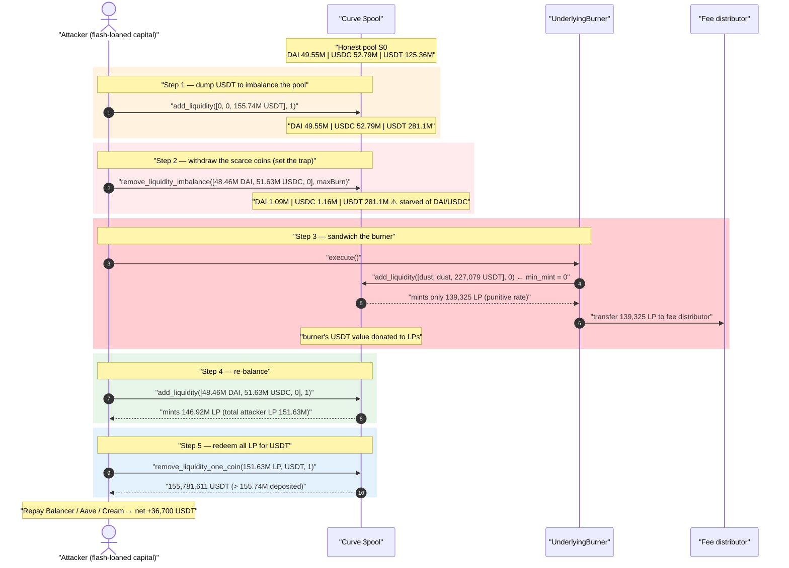
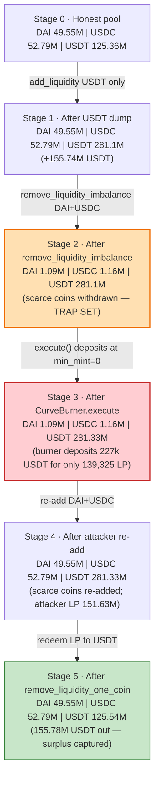
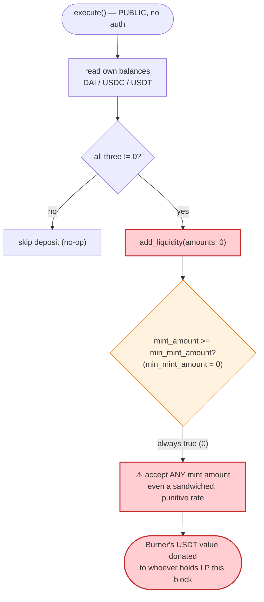

# Curve `UnderlyingBurner.execute()` — Zero-Slippage Sandwich on the 3pool

> **Vulnerability classes:** vuln/defi/sandwich-attack · vuln/defi/slippage · vuln/access-control/missing-auth

> **Reproduction:** the PoC compiles & runs in an isolated Foundry project at
> [this project folder](.) (the umbrella DeFiHackLabs repo contains many
> unrelated PoCs that fail to whole-compile, so this one was extracted).
> Full verbose trace: [output.txt](output.txt).
> Verified vulnerable source: [Vyper_contract.sol](sources/Vyper_contract_786b37/Vyper_contract.sol).

---

## Key info

| | |
|---|---|
| **Loss** | ~$36,700 — **36,700.27 USDT** extracted from the Curve 3pool by sandwiching the burner |
| **Vulnerable contract** | `UnderlyingBurner` (Vyper) — [`0x786B374B5eef874279f4B7b4de16940e57301A58`](https://etherscan.io/address/0x786b374b5eef874279f4b7b4de16940e57301a58#code) |
| **Victim pool** | Curve `3pool` (DAI/USDC/USDT) — [`0xbEbc44782C7dB0a1A60Cb6fe97d0b483032FF1C7`](https://etherscan.io/address/0xbEbc44782C7dB0a1A60Cb6fe97d0b483032FF1C7) (LP `0x6c3F90…6E490`) |
| **Attacker EOA** | [`0xccc526e2433db1eebb9cbf6acd7f03a19408278c`](https://etherscan.io/address/0xccc526e2433db1eebb9cbf6acd7f03a19408278c) |
| **Attacker contract** | [`0x915dff6707bea63daea1b41aa5d37353229066ba`](https://etherscan.io/address/0x915dff6707bea63daea1b41aa5d37353229066ba) |
| **Attack tx** | [`0xd493c73397952049644c531309df3dd4134bf3db1e64eb6f0b68b016ee0bffde`](https://etherscan.io/tx/0xd493c73397952049644c531309df3dd4134bf3db1e64eb6f0b68b016ee0bffde) |
| **Chain / block / date** | Ethereum mainnet / fork **17,823,542** / ~August 1, 2023 |
| **Compiler** | Burner: **Vyper 0.2.8**, optimizer 1 run · 3pool: Vyper 0.2.4 |
| **Bug class** | Permissionless AMM deposit with **zero slippage protection** (`min_mint_amount = 0`) → MEV sandwich |

---

## TL;DR

Curve's `UnderlyingBurner` is a fee-processing contract: it accumulates DAI/USDC/USDT (the fees the
protocol skims), then anyone can call its public `execute()` function to dump that accumulated balance
into the 3pool as liquidity, receiving 3CRV LP that is forwarded to the fee distributor.

The fatal line is in `execute()`
([Vyper_contract.sol:182](sources/Vyper_contract_786b37/Vyper_contract.sol#L182)):

```python
StableSwap(TRIPOOL).add_liquidity(amounts, 0)
#                                          ↑ min_mint_amount = 0  ← no slippage guard
```

`add_liquidity` mints LP proportional to the *value* the deposit adds to the pool, and Curve's
StableSwap math penalizes deposits that **worsen** the pool's balance. Because `execute()` accepts
**any** mint amount (`0`), an attacker can sandwich it:

1. **Pre-imbalance** the 3pool so that the coins the burner is *not* holding (DAI, USDC) are nearly
   depleted, while the coin it *is* mostly holding (USDT) is in massive surplus.
2. Let the burner deposit its ~227k USDT (+dust DAI/USDC) into this lopsided pool. With `min_mint_amount = 0`
   the deposit goes through at a punitive rate — the burner effectively swaps its USDT into the pool
   far below fair value, **donating** the difference to existing LPs.
3. **Re-balance** the pool by adding back the DAI/USDC the attacker withdrew in step 1, then redeem
   their LP for USDT. They walk away with **more USDT than they started with** — the burner's donated value.

The whole thing is wrapped in a Balancer flash loan and three lending-protocol loans (Aave v2/v3 +
Cream) purely to source the ~$200M of working capital needed to move the 3pool's reserves; every
borrow is repaid in the same transaction. Net profit: **36,700 USDT**.

---

## Background — what `UnderlyingBurner` does

Curve's fee machinery has a chain of "burner" contracts. `UnderlyingBurner`
([source](sources/Vyper_contract_786b37/Vyper_contract.sol), titled *"Underlying Burner — Converts
underlying coins to USDC, adds liquidity to 3pool and transfers to fee distributor"*) is the final
hop for stablecoin fees:

- **`burn(_coin)`** ([:100-151](sources/Vyper_contract_786b37/Vyper_contract.sol#L100-L151)) — receives a
  coin and, if it is not a 3pool asset, swaps it to USDC via the registry. After repeated `burn` calls
  the contract is left holding some mix of DAI, USDC and USDT.
- **`execute()`** ([:168-188](sources/Vyper_contract_786b37/Vyper_contract.sol#L168-L188)) — reads its own
  DAI/USDC/USDT balances and, *if all three are non-zero*, deposits them into the 3pool via
  `add_liquidity(amounts, 0)`, then forwards the minted 3CRV LP to the fee `receiver`.

`execute()` is **permissionless** — there is no `onlyOwner`, no keeper allow-list. That is by design:
anyone should be able to push accumulated fees through. The problem is the *terms* on which it deposits.

At the fork block the burner held a tiny, attacker-seeded balance to satisfy the `!= 0` gate:

| Coin held by burner at `execute()` | Amount (from trace) |
|---|---|
| DAI  | 100,000 wei (1e-13 DAI) |
| USDC | 100,000 wei (0.1 USDC) |
| USDT | **227,079.039776 USDT** |

The USDT is the bulk; the two dust amounts only exist to pass `amounts[0] != 0 and amounts[1] != 0 and amounts[2] != 0`.

The Curve 3pool reserves at the start (honest state, from the trace's storage slots `…cf6/cf7/cf8`):

| Coin | 3pool reserve (S0) |
|---|---:|
| DAI  | 49,553,229 |
| USDC | 52,791,281 |
| USDT | 125,361,698 |

---

## The vulnerable code

### 1. `execute()` deposits with `min_mint_amount = 0`

[sources/Vyper_contract_786b37/Vyper_contract.sol:168-188](sources/Vyper_contract_786b37/Vyper_contract.sol#L168-L188):

```python
@external
def execute() -> bool:
    """
    @notice Add liquidity to 3pool and transfer 3CRV to the fee distributor
    """
    assert not self.is_killed

    amounts: uint256[3] = [
        ERC20(TRIPOOL_COINS[0]).balanceOf(self),   # DAI
        ERC20(TRIPOOL_COINS[1]).balanceOf(self),   # USDC
        ERC20(TRIPOOL_COINS[2]).balanceOf(self),   # USDT
    ]
    if amounts[0] != 0 and amounts[1] != 0 and amounts[2] != 0:
        StableSwap(TRIPOOL).add_liquidity(amounts, 0)   # ⚠️ min_mint_amount hard-coded to 0

    amount: uint256 = ERC20(TRIPOOL_LP).balanceOf(self)
    if amount != 0:
        ERC20(TRIPOOL_LP).transfer(self.receiver, amount)

    return True
```

The deposit accepts **whatever** LP the pool decides to mint. There is no minimum, no
expected-value computation, no read of `get_virtual_price` / `calc_token_amount` to sanity-check
the rate.

### 2. What `min_mint_amount` is supposed to protect against

The 3pool's `add_liquidity`
([Vyper_contract.sol:270-351](sources/Vyper_contract_bEbc44/Vyper_contract.sol#L270-L351)) mints LP based
on how much the StableSwap invariant `D` grows, accounting for an *imbalance fee*:

```python
# Invariant after change
D1: uint256 = self.get_D_mem(new_balances, amp)
...
# fee on the imbalance each coin introduces vs the ideal proportional deposit
fees[i] = _fee * difference / FEE_DENOMINATOR
new_balances[i] -= fees[i]
D2 = self.get_D_mem(new_balances, amp)
...
mint_amount: uint256 = token_supply * (D2 - D0) / D0
assert mint_amount >= min_mint_amount, "Slippage screwed you"   # ← the only guard
```

A deposit that pushes the pool *further* from balance receives **less** LP than the nominal dollar
value deposited — the shortfall is implicitly redistributed to all existing LPs. The
`assert mint_amount >= min_mint_amount` line is the *only* defense a depositor has against that
shortfall being arbitrarily large. With `min_mint_amount = 0`, the burner waives it completely:
it will accept *any* rate, including one an attacker has crafted to be maximally unfair.

---

## Root cause — why it was possible

A Curve StableSwap deposit is, economically, a swap-plus-mint: putting in only the surplus coin
(USDT) while the pool is starved of the others (DAI/USDC) is equivalent to selling USDT into the pool
at a depressed price. The `min_mint_amount` parameter is what lets a depositor say *"only execute if I
get at least X LP back"* — i.e., *"don't let me be sandwiched."*

`UnderlyingBurner.execute()` violates this in the worst way:

1. **`min_mint_amount` hard-coded to `0`.** The deposit will succeed no matter how badly the pool is
   imbalanced. The burner has zero protection against depositing at a manipulated rate.
2. **Permissionless trigger.** Anyone can call `execute()` at any time, so the attacker chooses the
   *exact* moment to fire it — sandwiched between their own imbalancing and re-balancing operations,
   all inside one atomic transaction.
3. **The burner's balance is dominated by a single coin (USDT).** A single-sided deposit is precisely
   the case StableSwap penalizes most, so the attacker can pre-arrange the pool to make that penalty
   enormous and pocket it.
4. **The deposited value is "found money" for LPs.** The shortfall the burner eats is distributed
   pro-rata to LPs. The attacker simply becomes the dominant LP for the instant the burner deposits,
   captures the donation, and then unwinds their LP position.

This is a textbook **MEV sandwich against an unprotected on-chain liquidity action**. The post-mortem
(Hypernative) classified it as a "unique sandwich attack against Curve Finance."

---

## Preconditions

- The burner must hold non-zero DAI, USDC **and** USDT so the `!= 0` gate in `execute()` passes. The
  attacker seeds 100,000 wei of DAI and USDC (the USDT was the genuine accrued fee balance,
  227,079 USDT). 
- `execute()` is callable by anyone (no access control) — always true.
- Enough working capital to move the 3pool's reserves by tens of millions of dollars. The attacker
  sourced this via a **Balancer flash loan** (wstETH + WETH + USDT) plus **Aave v2/v3** and **Cream**
  USDT borrows against the flash-loaned collateral — all repaid in the same transaction
  ([test/CurveBurner_exp.sol:83-146](test/CurveBurner_exp.sol#L83-L146)). No own capital at risk.

---

## Attack walkthrough (with on-chain numbers from the trace)

All reserve figures below are decoded directly from the 3pool's storage slots in
[output.txt](output.txt) (`…cf6` = DAI ·1e18, `…cf7` = USDC ·1e6, `…cf8` = USDT ·1e6). The attacker
contract is the Foundry test harness (`ContractTest`); the victim is `CurveBurner` / `Curve3POOL`.

| # | Step (caller) | Pool DAI | Pool USDC | Pool USDT | Effect |
|---|---|---:|---:|---:|--------|
| 0 | **Initial** (honest 3pool) | 49,553,229 | 52,791,281 | 125,361,698 | Balanced pool. |
| 1 | **`add_liquidity([0, 0, 155.74M USDT], 1)`** — attacker dumps borrowed USDT ([trace L522](output.txt)) | 49,552,593 | 52,790,605 | **281,105,296** | Pool now grossly USDT-heavy; attacker holds 151.6M LP. |
| 2 | **`remove_liquidity_imbalance([48.46M DAI, 51.63M USDC, 0], …)`** — pull out the scarce coins ([trace L561](output.txt)) | **1,088,993** | **1,160,153** | 281,103,223 | DAI & USDC reserves crushed to ~1M; USDT still ~281M. **Trap set.** |
| 3 | **`CurveBurner.execute()`** — burner deposits 227,079 USDT + dust at `min_mint_amount = 0` ([trace L602](output.txt)) | 1,088,993 | 1,160,153 | **281,330,301** | Burner mints only **139,325 LP** for 227k USDT — punitive rate; value donated to LPs. |
| 4 | **`add_liquidity([48.46M DAI, 51.63M USDC, 0], 1)`** — attacker re-balances by re-adding the scarce coins ([trace L684](output.txt)) | 49,551,155 | 52,789,072 | 281,326,881 | Pool restored; attacker mints **146.92M LP**, total LP 151.63M. |
| 5 | **`remove_liquidity_one_coin(151.63M LP, 2, 1)`** — redeem all LP for USDT ([trace L728](output.txt)) | 49,551,155 | 52,789,072 | **125,543,711** | Attacker pulls **155,781,611 USDT** out — more than the 155.74M they put in. |
| 6 | Repay Cream / Aave v2 / Aave v3 / Balancer; keep the surplus | — | — | — | All loans repaid same-tx; surplus is profit. |

**Where the profit comes from.** Compare what the attacker put into the USDT side vs. took out:

- Step 1 deposited **155,744,911 USDT**.
- Step 5 withdrew **155,781,611 USDT** (≈ +36.7k more than deposited).

The DAI/USDC legs (steps 2 and 4) net to roughly zero — the attacker withdrew 48.46M DAI + 51.63M USDC
in step 2 and re-deposited the *same* amounts in step 4. The net gain on the USDT side is exactly the
value the burner donated in step 3 by depositing into a pool the attacker had deliberately starved of
DAI/USDC. After repaying every loan, the attacker is left holding **36,700.268952 USDT**
([trace tail](output.txt) — `Attacker USDT balance after exploit: 36700.268952`).

### The "punitive rate" in step 3, concretely

The burner deposited **227,079 USDT** (nominally ~$227k) but the pool minted it only **139,325 LP**.
At the pool's prevailing virtual price the burner *should* have received on the order of ~227k LP for a
balanced-value deposit. Depositing the surplus coin (USDT) into a pool whose other reserves were only
~$1M each maximized Curve's imbalance fee and the `D`-growth penalty, so the burner received ~38% less
LP than fair — and with `min_mint_amount = 0` it had no way to refuse. That shortfall is the
attacker's profit.

---

## Profit / loss accounting

| Item | Amount |
|---|---:|
| Attacker USDT into pool (step 1) | 155,744,911 USDT |
| Attacker USDT out of pool (step 5) | 155,781,611 USDT |
| DAI out (step 2) / DAI back in (step 4) | −48,463,057 / +48,463,057 ≈ 0 |
| USDC out (step 2) / USDC back in (step 4) | −51,629,873 / +51,629,873 ≈ 0 |
| Burner USDT donated (deposited 227,079 for only 139,325 LP) | the source of the surplus |
| **Net attacker profit** | **+36,700.27 USDT (~$36.7k)** |

The borrowed principal (Balancer flash loan, Aave v2/v3, Cream) is all repaid inside the same
transaction; none of it contributes to or subtracts from the net — it is pure leverage to move the
pool. The realized loss falls on **Curve's fee revenue** (the burner deposited fees at a bad rate)
and is captured by the attacker.

---

## Diagrams

### Sequence of the attack



### Pool state evolution



### The flaw inside `execute()`



---

## Remediation

1. **Pass a real `min_mint_amount`.** `execute()` must compute an expected LP amount and set a
   slippage floor:
   ```python
   expected: uint256 = StableSwap(TRIPOOL).calc_token_amount(amounts, True)
   StableSwap(TRIPOOL).add_liquidity(amounts, expected * 995 / 1000)  # 0.5% tolerance
   ```
   Any sandwich that depresses the mint below the floor then reverts.
2. **Don't deposit a single dominant coin into a StableSwap.** A balance overwhelmingly in one coin is
   exactly the case the AMM penalizes. Convert toward a balanced ratio first (the burner already has a
   registry-swap path in `burn()`), or deposit in proportions close to the pool's current ratio.
3. **Restrict *when* `execute()` runs, not *who* runs it.** Even if it stays permissionless, gating it
   behind a per-block / per-interval rate limit, or requiring it to run only when the pool is near
   balance, removes the attacker's ability to fire it at the precise moment the pool is trapped.
4. **Use a manipulation-resistant value reference.** Sanity-check the deposit against
   `get_virtual_price()` (which the attacker cannot move arbitrarily within a single block without
   cost) rather than instantaneous reserves, and revert if the realized rate deviates beyond a bound.
5. **General principle for fee/keeper automations:** any permissionless on-chain action that swaps,
   deposits, or LPs on behalf of the protocol must carry slippage protection. Hard-coding `0` /
   `type(uint).max` for `min_out` / `max_in` is a recurring source of MEV losses.

---

## How to reproduce

The PoC was extracted into a standalone Foundry project (the umbrella DeFiHackLabs repo has many
unrelated PoCs that fail to compile under a single `forge test` build):

```bash
_shared/run_poc.sh 2023-08-CurveBurner_exp --mt testExploit -vvvvv
```

- RPC: an **Ethereum mainnet archive** endpoint is required — the test forks at block
  **17,823,542** (`foundry.toml` `[rpc_endpoints].mainnet`). Most pruned public RPCs will fail with
  `header not found` / `missing trie node` at this historical block.
- Result: `[PASS] testExploit()` with `Attacker USDT balance after exploit: 36700.268952`.

Expected tail:

```
Ran 1 test for test/CurveBurner_exp.sol:ContractTest
[PASS] testExploit() (gas: 2535280)
Logs:
  Attacker USDT balance after exploit: 36700.268952

Suite result: ok. 1 passed; 0 failed; 0 skipped
```

---

*References: DeFiHackLabs PoC header; Hypernative post-mortem —
https://medium.com/@Hypernative/exotic-culinary-hypernative-systems-caught-a-unique-sandwich-attack-against-curve-finance-6d58c32e436b (Curve `UnderlyingBurner`, Ethereum, ~$36k).*
