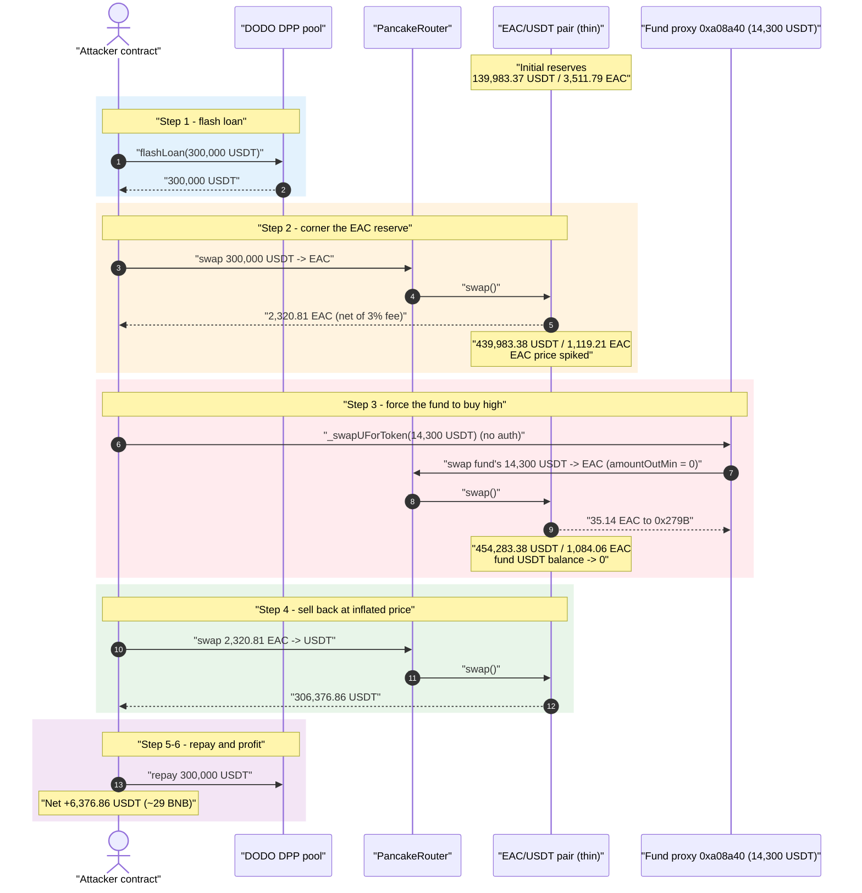
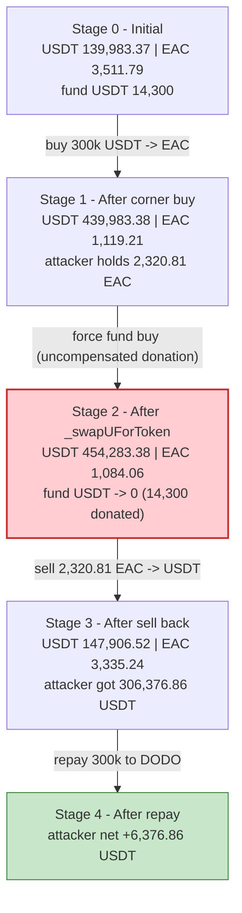
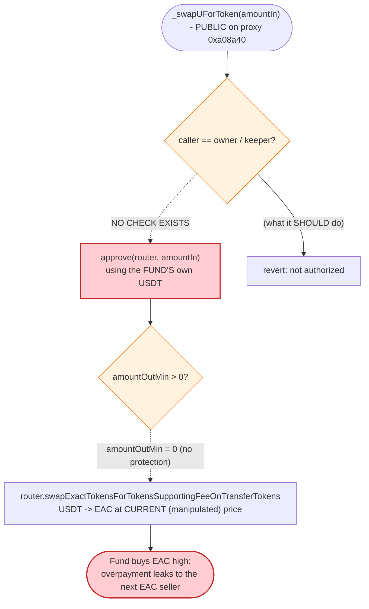

# EAC Exploit — Permissionless `_swapUForToken()` Drains the Fund Contract into a Thin Pool

> **Reproduction:** the PoC compiles & runs in this isolated Foundry project at
> [this project folder](.) (the umbrella DeFiHackLabs repo contains many PoCs that do not
> whole-compile, so this one was extracted). Full verbose trace:
> [output.txt](output.txt). Verified vulnerable token source:
> [EAC.sol](sources/EAC_64f291/EAC.sol).

---

## Key info

| | |
|---|---|
| **Loss** | **≈ 6,377 USDT (~29 BNB)** profit to the attacker, sourced from **14,300 USDT** force-spent out of the project's fund contract plus the EAC/USDT pool's own liquidity |
| **Vulnerable contract** | Fund/"PlanA" contract behind proxy [`0xa08a40e0F11090Dcb09967973DF82040bFf63561`](https://bscscan.com/address/0xa08a40e0F11090Dcb09967973DF82040bFf63561) — permissionless `_swapUForToken(uint256)` (selector `0xe6a24c3f`) |
| **Token / pool** | `EAC` [`0x64f291DE10eCd36D5f7b64aaEbC70943CFACE28E`](https://bscscan.com/address/0x64f291DE10eCd36D5f7b64aaEbC70943CFACE28E#code); victim pool = EAC/USDT PancakeSwap pair `0x6901c75C9A0B18687bD6f5764fE7fdD1dbCc316c` |
| **Attacker EOA** | [`0x27e981348c2d1f5b2227c182a9d0ed46eed84946`](https://bscscan.com/address/0x27e981348c2d1f5b2227c182a9d0ed46eed84946) |
| **Attacker contract** | [`0x20dcf125f0563417d257b98a116c3fea4f0b2db2`](https://bscscan.com/address/0x20dcf125f0563417d257b98a116c3fea4f0b2db2) |
| **Flash-loan source** | DODO DPP pool `0x26d0c625e5F5D6de034495fbDe1F6e9377185618` (300,000 USDT, fee-free) |
| **Attack tx** | [`0x477f9ee698ac8ae800ffa012ab52fd8de39b58996245c5e39a4233c1ae5f1baa`](https://bscscan.com/tx/0x477f9ee698ac8ae800ffa012ab52fd8de39b58996245c5e39a4233c1ae5f1baa) |
| **Chain / block / date** | BSC / 31,273,019 / **Aug 29, 2023** |
| **Compiler (token)** | Solidity v0.8.13, optimizer off (`runs=200`); fund proxy impl v0.8.9, optimizer 1 |
| **Bug class** | Missing access control on a fund-spending function + thin-pool price manipulation (sandwich around a forced victim buy) |

---

## TL;DR

The EAC project deployed a "fund" contract (reachable through proxy
`0xa08a40…`) exposing a **public, unauthenticated** function
`_swapUForToken(uint256 amountIn)` (selector `0xe6a24c3f`). When called, it makes
the **fund contract spend its own USDT** to buy EAC on the EAC/USDT PancakeSwap
pair. The EAC/USDT pool at the fork block was **extremely thin** — only
**3,511.79 EAC** of inventory against 139,983.37 USDT — so the price was easy to
move with borrowed capital.

The attacker simply **sandwiched the fund's forced buy**:

1. Flash-loan **300,000 USDT** from DODO and swap all of it into EAC, buying up
   nearly the entire EAC inventory (pool EAC reserve `3,511.79 → 1,119.21`). The
   attacker now holds **2,320.81 EAC**, bought at a low average price.
2. Call the permissionless `_swapUForToken(14,300e18)` on the fund proxy. The
   fund spends **its own 14,300 USDT** buying EAC at the now-inflated price,
   pushing the USDT reserve up (`439,983 → 454,283`) and the EAC reserve down
   (`1,119.21 → 1,084.06`). The attacker pays nothing for this; it strictly
   improves the price at which the attacker can sell back.
3. Sell the **2,320.81 EAC** back to the pool for **306,376.86 USDT** — far more
   than the 300,000 the buy-in cost, because the fund's donation moved the price.
4. Repay the 300,000 USDT loan. Net profit **≈ 6,377 USDT (~29 BNB)**.

The fund contract was drained of its 14,300 USDT, and that value (plus a slice of
the pool's own liquidity) ended up in the attacker's pocket.

---

## Background — EAC token and its "fund"

`EAC` ([EAC.sol](sources/EAC_64f291/EAC.sol)) is a standard OpenZeppelin ERC20
with a custom `_transfer` override that levies taxes on PancakeSwap trades and
calls into an external **fund** contract on every buy and sell:

- **Buy** (transfer *from* the pair): 3% goes to `fundReward`, then
  `EACFund(fundReward).PlanA()` is invoked
  ([EAC.sol:793-798](sources/EAC_64f291/EAC.sol#L793-L798)).
- **Sell** (transfer *to* the pair): 2% fund fee + 1% burn to `0x…dEaD`, then
  `PlanA()` again ([EAC.sol:800-811](sources/EAC_64f291/EAC.sol#L800-L811)).

```solidity
interface EACFund {
    function PlanA() external;
}
...
if (_isPair[from]) { // buy
    uint fund = (amount * 3)/100;
    _amount -= fund;
    super._transfer(from, fundReward, fund);
    EACFund(fundReward).PlanA();
}
if (_isPair[to]) {  // sell
    uint fund = (amount * 2)/100;
    uint burn = amount/100;
    _amount -= fund;
    super._transfer(from, fundReward, fund);
    if (totalSupply()-balanceOf(BURN_ADDRESS) > MIN_SUPPLY) {
        _amount -= burn;
        super._transfer(from, BURN_ADDRESS, burn);
    }
    EACFund(fundReward).PlanA();
}
```

`fundReward` is an external contract that accumulates EAC fees and (per its
`PlanA()` routine, visible in the trace) periodically dumps small amounts. That
fund contract is the project treasury. **Separately**, the project deployed a
proxy at `0xa08a40…` (TransparentUpgradeableProxy, implementation `0x2deb06…`,
runtime delegate `0xb803eD66…`) holding **14,300 USDT** of treasury funds, and
that proxy exposes the vulnerable `_swapUForToken(uint256)` entry point.

On-chain facts at the fork block (read via `cast`):

| Item | Value |
|---|---|
| EAC `totalSupply` | **21,000,000 EAC** |
| EAC/USDT pair `token0 / token1` | **USDT / EAC** (so `reserve0 = USDT`, `reserve1 = EAC`) |
| Pool USDT reserve (reserve0) | **139,983.37 USDT** |
| Pool EAC reserve (reserve1) | **3,511.79 EAC** ← the pool is starved of EAC |
| `_isPair[pair]` | **true** |
| Fund proxy `0xa08a40…` USDT balance | **14,300 USDT** ← the prize that's force-spent |
| DODO DPP USDT available | ~786,495 USDT (flash-loan source) |

The decisive fact is the **3,511.79 EAC** pool inventory. With so little EAC in
the pool, a few hundred thousand USDT of borrowed buying pressure swings the
marginal price dramatically — and the fund contract is then forced to buy at that
swung price.

---

## The vulnerable code

### 1. The token routes fees and triggers the fund on every trade

[EAC.sol:777-814](sources/EAC_64f291/EAC.sol#L777-L814) — the `_transfer`
override that fires `PlanA()` and hands fees to the external fund. This is the
*coupling* that makes the fund worth attacking, but it is not itself the hole.

### 2. The fund proxy's `_swapUForToken(uint256)` is permissionless

The proxy at `0xa08a40…` exposes selector `0xe6a24c3f = _swapUForToken(uint256)`.
The runtime implementation `0xb803eD66…` is **unverified** on BscScan, but its
behavior is fully observable in the trace
([output.txt:131-228](output.txt)): when called by *anyone*, it

1. reads the proxy's own USDT balance,
2. `approve`s the PancakeSwap router for that USDT,
3. swaps the USDT for EAC via
   `swapExactTokensForTokensSupportingFeeOnTransferTokens`, sending the EAC to a
   third address (`0x279B83…`),

with **no `msg.sender` / role check anywhere** — the call does not revert when
invoked directly from the attacker's contract:

```solidity
// reconstructed from the trace at output.txt:131-228 — there is NO access-control guard
function _swapUForToken(uint256 amountIn) external {          // ⚠️ no onlyOwner / no role
    IERC20(USDT).approve(router, amountIn);
    address[] memory path = [USDT, EAC];
    router.swapExactTokensForTokensSupportingFeeOnTransferTokens(
        amountIn, 0, path, recipient, block.timestamp + 1000   // ⚠️ amountOutMin = 0
    );
}
```

Two design faults compound here:

- **No access control** — anyone can make the fund spend its USDT, at a moment of
  the caller's choosing.
- **`amountOutMin = 0` (no slippage protection)** — the forced swap accepts any
  output, so it happily buys at a price the caller has just manipulated.

The attacker's PoC reaches it with a single low-level call
([test/EAC_exp.sol:37](test/EAC_exp.sol#L37)):

```solidity
proxy.call(abi.encodeWithSelector(0xe6a24c3f, IERC20(usdt).balanceOf(proxy)));
```

passing the proxy's *entire* USDT balance (14,300 USDT) as the amount.

---

## Root cause — why it was possible

A Uniswap-V2/PancakeSwap pair prices the two assets purely from its reserves
along the constant product `x·y = k`. The marginal price is `reserveUSDT /
reserveEAC`. Because the EAC reserve was only **3,511.79 EAC**, the price was
fragile.

The fund's `_swapUForToken` violates two basic safety principles at once:

> A privileged, value-spending action (spend treasury USDT, buy a token on an
> AMM) was left **callable by anyone**, with **no minimum-output check**, against
> a pool whose price the caller fully controls within the same transaction.

Concretely the bug composes from:

1. **Missing access control.** `_swapUForToken` has no `onlyOwner`/keeper guard,
   so the attacker decides *when* the fund buys — i.e., right after the attacker
   has inflated the EAC price by cornering the pool. A legitimate treasury "buy
   back our token" routine must be restricted to a trusted role or a keeper.
2. **No slippage protection (`amountOutMin = 0`).** The forced buy accepts any
   amount of EAC out. Combined with a thin pool, the fund pays a wildly inflated
   price; that overpayment is exactly the value transferred to whoever sells EAC
   next (the attacker).
3. **A thin pool whose price is single-transaction-manipulable.** With only
   ~3,511 EAC of inventory, 300,000 USDT of borrowed buy pressure moves the price
   enough that the 14,300-USDT forced buy, plus the attacker's own re-sale,
   nets a profit.
4. **Flash-loanable capital.** DODO supplied 300,000 USDT fee-free, so the
   attacker needed essentially **no capital** — the entire position is opened and
   closed inside one transaction.

The token's fee/burn machinery (3% buy, 2%+1% sell) skims a little off both legs
but does not prevent the attack: it merely reduces the margin. In the trace the
attacker's buy nets 97% of gross (`2,320.81 / 2,392.59 = 0.97`) and the sell is
likewise debited 3% before hitting the pool — yet 306,376.86 USDT still comes
back out against a 300,010 USDT cost basis.

---

## Preconditions

- The fund proxy `0xa08a40…` must hold USDT (it held **14,300 USDT**).
- `_swapUForToken(uint256)` must be externally callable with no caller
  restriction (it was).
- The EAC/USDT pool must be thin enough that one transaction can move the price
  meaningfully (EAC reserve was only **3,511.79 EAC**).
- Working capital in USDT to corner the pool — sourced **fee-free from DODO**, so
  the attack is effectively zero-capital and atomic.

---

## Attack walkthrough (with on-chain numbers from the trace)

The pair's `token0 = USDT`, `token1 = EAC`, so `reserve0 = USDT`, `reserve1 =
EAC`. All figures are read directly from the `getReserves`/`Sync` events in
[output.txt](output.txt). The attacker contract begins with ~10 USDT of seed and
borrows 300,000 USDT.

| # | Step | Pool USDT (r0) | Pool EAC (r1) | Effect |
|---|------|---------------:|--------------:|--------|
| 0 | **Initial** | 139,983.37 | 3,511.79 | Honest, EAC-starved pool. |
| 1 | **Flash-loan 300,000 USDT** from DODO ([output.txt:23](output.txt)) | 139,983.37 | 3,511.79 | Attacker now holds ≈300,000.01 USDT. |
| 2 | **Corner buy** — swap 300,000.01 USDT → EAC (net **2,320.81 EAC** after 3% buy fee) | 439,983.38 | 1,119.21 | Pool EAC reserve crushed ~68%; EAC price spiked. |
| 3 | **`_swapUForToken(14,300 USDT)`** on the fund proxy — fund spends **its own** 14,300 USDT buying EAC at the spiked price (35.14 EAC out to `0x279B83…`) | 454,283.38 | 1,084.06 | Free donation: USDT pushed up, EAC pushed down further. Fund USDT balance → **0**. |
| 4 | **Sell back** — attacker sells its 2,320.81 EAC → **306,376.86 USDT** ([output.txt:304-316](output.txt)) | 147,906.52 | 3,335.24 | Attacker exits at the price the fund helped inflate. |
| 5 | **Repay** 300,000 USDT to DODO ([output.txt:323](output.txt)) | — | — | Loan closed; no fee. |
| 6 | **Profit** — final attacker USDT balance **6,376.86** ([output.txt:330-331](output.txt)) | — | — | Net ≈ **6,377 USDT (~29 BNB)**. |

**Why step 3 is the theft:** the fund's forced buy adds 14,300 USDT to the pool's
USDT side while removing ~35 EAC. The attacker is the dominant EAC holder (2,320.81
EAC) coming out of step 2, so when the attacker sells in step 4 the pool's USDT
reserve — now padded by the fund's donation — flows disproportionately to the
attacker. Without step 3, the round-trip swap (buy 300k → sell back) would return
roughly the input minus fees and slippage, i.e. a loss; the fund's free 14,300
USDT donation is what tips the round trip into profit.

### Profit / loss accounting (USDT)

| Direction | Amount |
|---|---:|
| Borrowed (DODO, fee-free) | 300,000.00 |
| Spent — corner buy (incl. ~10 seed) | 300,000.01 |
| **Fund's USDT force-spent into the pool** | **14,300.00** |
| Received — sell back 2,320.81 EAC | 306,376.86 |
| Repaid to DODO | −300,000.00 |
| **Attacker net profit** | **≈ +6,376.86** |

The attacker's ~6,377 USDT gain is funded by the fund contract's 14,300 USDT
donation (only part of which is recovered as profit; the remainder is lost to
fees, burn, and the pool). The fund/treasury is the direct victim; honest LPs in
the thin pool absorb the rest of the price dislocation.

---

## Diagrams

### Sequence of the attack



### Pool / fund state evolution



### The flaw inside `_swapUForToken`



---

## Remediation

1. **Add access control to `_swapUForToken`.** Restrict it to the owner or a
   trusted keeper (`onlyOwner` / role check). A treasury function that spends
   funds must never be permissionless. This single fix removes the attacker's
   ability to choose *when* the fund buys.
2. **Enforce slippage protection.** Pass a non-zero, oracle/TWAP-derived
   `amountOutMin` (and a tight deadline) so a forced or mistimed buy cannot
   execute against a manipulated spot price.
3. **Do not price treasury actions off instantaneous AMM spot.** Use a TWAP or an
   external oracle to size and gate buybacks; spot reserves of a thin pool are
   trivially manipulable within a single block.
4. **Seed/maintain adequate pool depth.** A pool holding only ~3,511 EAC against
   ~140k USDT is manipulable for a few hundred thousand USDT — which is freely
   flash-loanable. Deeper, balanced liquidity raises the cost of price swings.
5. **Reentrancy/atomicity guards.** Mark treasury swap entry points
   `nonReentrant` and consider per-block rate limits so they cannot be wrapped
   inside an attacker's sandwich within one transaction.

---

## How to reproduce

The PoC was extracted into this standalone Foundry project (the umbrella
DeFiHackLabs repo has many PoCs that fail a whole-project `forge build`):

```bash
_shared/run_poc.sh 2023-08-EAC_exp -vvvvv
```

- RPC: a **BSC archive** endpoint is required (fork block 31,273,018). The
  project is configured for `bsc`; public pruning RPCs may fail with
  `header not found` / `missing trie node` at this historical block — use an
  archive provider (e.g. `https://bsc-mainnet.public.blastapi.io`).
- Result: `[PASS] testExploit()` and the log line shows the attacker's recovered
  USDT.

Expected tail:

```
Ran 1 test for test/EAC_exp.sol:ContractTest
[PASS] testExploit() (gas: 584717)
Logs:
  Attacker USDT balance after exploit: 6376.857069483678926140

Suite result: ok. 1 passed; 0 failed; 0 skipped
```

The `6,376.86` USDT in the log is the realized profit (~29 BNB at the time),
funded by the fund contract's 14,300 USDT being force-spent into the thin pool.

---

*References: DeFiHackLabs PoC header (Attacker `0x27e9…4946`, tx `0x477f…1baa`);
analysis thread linked in [test/EAC_exp.sol](test/EAC_exp.sol). SlowMist Hacked —
https://hacked.slowmist.io/ (EAC, BSC, ~$29 BNB).*
