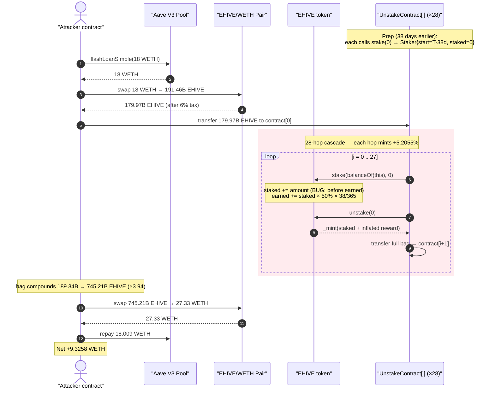
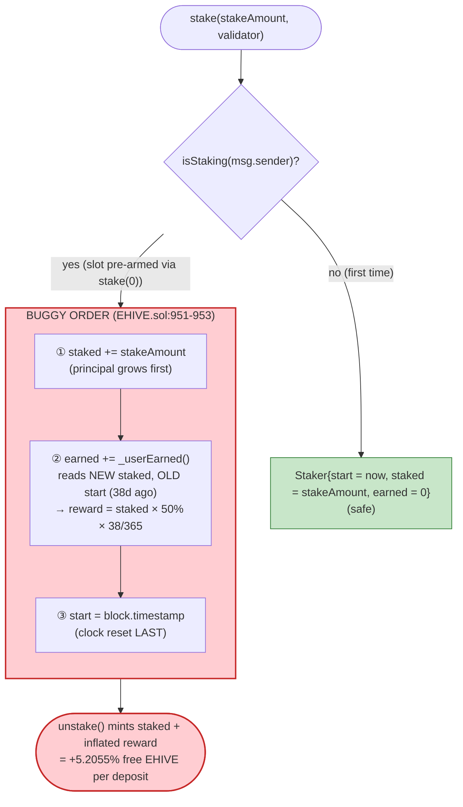
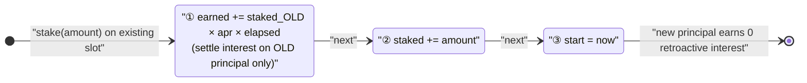
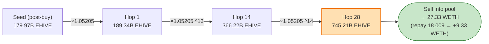

# EHIVE Exploit — `stake()` Updates `staked` Before Computing `earned`, Inflating Rewards

> **Vulnerability classes:** vuln/logic/incorrect-order-of-operations · vuln/logic/reward-calculation

> **Reproduction:** the PoC compiles & runs in an isolated Foundry project at
> [this project folder](.) (the umbrella DeFiHackLabs repo
> does not whole-compile, so this PoC was extracted into its own project).
> Full verbose trace: [output.txt](output.txt).
> Verified vulnerable source: [sources/EHIVE_4Ae2Cd/EHIVE.sol](sources/EHIVE_4Ae2Cd/EHIVE.sol).

---

## Key info

| | |
|---|---|
| **Loss** | ~$15K — **9.3258 WETH** net profit drained from the EHIVE/WETH pool |
| **Vulnerable contract** | `EHIVE` ("Ethereum Hive") — [`0x4Ae2Cd1F5B8806a973953B76f9Ce6d5FAB9cdcfd`](https://etherscan.io/address/0x4Ae2Cd1F5B8806a973953B76f9Ce6d5FAB9cdcfd#code) |
| **Victim pool** | EHIVE/WETH UniswapV2 pair — [`0xAE851769593AC6048D36BC123700649827659A82`](https://etherscan.io/address/0xAE851769593AC6048D36BC123700649827659A82) |
| **Attacker EOA** | [`0x0195448a9c4adeAf27002C6051c949f3c3234bb5`](https://etherscan.io/address/0x0195448a9c4adeAf27002c6051c949f3c3234bb5) |
| **Attacker contract** | [`0x98c2e1e85f8bf737d9c1450dd26d4a4bf880b892`](https://etherscan.io/address/0x98c2e1e85f8bf737d9c1450dd26d4a4bf880b892) |
| **Attack tx** | [`0xad818ec910def08c70ac519ab0fffa084b4178014a91cd8aa2f882d972a511c1`](https://etherscan.io/tx/0xad818ec910def08c70ac519ab0fffa084b4178014a91cd8aa2f882d972a511c1) |
| **Preparation tx** | [`0xd9156f507c701a09d3312e1987383c7c882df50b3127e1adfd74d74052642114`](https://etherscan.io/tx/0xd9156f507c701a09d3312e1987383c7c882df50b3127e1adfd74d74052642114) |
| **Chain / fork block / date** | Ethereum / 17,690,497 (prep ≈ 2023-07-14, attack ≈ 2023-08-21 after a 38-day wait) |
| **Compiler** | Solidity v0.8.15, optimizer **disabled** (per verified source metadata) |
| **Bug class** | Stake-accounting ordering bug — `staked` is increased *before* `earned` is recomputed, so the freshly-deposited principal is paid 38 days of retroactive APR |

---

## TL;DR

`EHIVE` is a token with a built-in 50%-APR staking program. The `stake()` function has a
**write-ordering bug** ([EHIVE.sol:950-956](sources/EHIVE_4Ae2Cd/EHIVE.sol#L950-L956)): when an
address that is *already registered* as a staker adds more principal, it executes

```
staked  += stakeAmount;                 // ① principal grows first
earned  += _userEarned(...);            // ② reward recomputed AFTER, using the NEW principal
start    = block.timestamp;             // ③ clock reset LAST
```

`_userEarned` ([:928-941](sources/EHIVE_4Ae2Cd/EHIVE.sol#L928-L941)) computes
`earned = staked × 50% × (now − start) / 1 year`. Because `staked` was already bumped in step ①
but `start` is still the *old* timestamp (38 days ago), the brand-new principal is retroactively
credited with **38 days of 50% APR it never actually accrued**. The attacker pre-registers a stake
of `0` to plant a 38-day-old `start`, then deposits a huge principal in the same slot — instantly
"earning" ≈ 5.2% on the full deposit.

The attacker industrializes this:

1. Pre-deploys **28** `UnstakeContract` instances, each calling `stake(0)` to plant a 38-day-old
   timestamp (done in the prep tx; the PoC reproduces it with `vm.warp(+38 days)`).
2. Flash-borrows **18 WETH** from Aave, swaps it for **191.46 billion EHIVE** in the pool.
3. Feeds that EHIVE into a **cascade**: contract `i` re-stakes its full balance (triggering the bug
   → +5.2% minted), unstakes (gets principal + inflated reward), and forwards the larger balance to
   contract `i+1`. Across 28 hops the bag compounds **189.34B → 745.21B EHIVE** (≈ 3.94×).
4. Dumps the 745.21B EHIVE back into the pool for **27.33 WETH**, repays the 18.009 WETH flash loan,
   and walks away with **+9.3258 WETH**.

---

## Background — what EHIVE staking does

`EHIVE` ([source](sources/EHIVE_4Ae2Cd/EHIVE.sol)) is an ERC20 with a tax-on-DEX-trade mechanism
(6% total: 2% marketing, 1% liquidity, 3% validator) bolted onto a simple time-based staking pool.
Relevant parameters from the constructor and the verified source:

| Parameter | Value |
|---|---|
| `decimals` | 18 |
| initial supply | 500,000,000,000 EHIVE (`5e11 × 1e18`) |
| `maxSupply` | 1,000,000,000,000 EHIVE (`1e12 × 1e18`) — staking rewards keep minting until supply reaches this |
| `apr` | **50** (i.e. 50% per year) |
| `stakingEnabled` | **true** at the fork block (required by `isStakingEnabled` modifier) |
| `totalFees` | 6% on AMM buys/sells (fee-on-transfer) |

Staking model (per validator, per user):

- **`stake(amount, validator)`** ([:946-961](sources/EHIVE_4Ae2Cd/EHIVE.sol#L946-L961)) — burns
  `amount` EHIVE from the caller and records `Staker{start, staked, earned}`.
- **`unstake(validator)`** ([:985-1004](sources/EHIVE_4Ae2Cd/EHIVE.sol#L985-L1004)) — mints back
  `staked + reward`, where `reward = userEarned(...)` (current accrual + previously banked `earned`),
  then deletes the stake.
- **`_userEarned(staker, validator)`** ([:928-941](sources/EHIVE_4Ae2Cd/EHIVE.sol#L928-L941)) —
  linear accrual: `staked × apr/100 × secondsStaked / secondsPerYear`.

The intended flow is: deposit principal, wait, withdraw principal + linearly-accrued interest. The
bug breaks the ordering so that *adding* principal to an existing stake pays interest on the new
principal as if it had been deposited at the old `start` time.

---

## The vulnerable code

### 1. `stake()` — `staked` is bumped before `earned` is recomputed

[sources/EHIVE_4Ae2Cd/EHIVE.sol:946-961](sources/EHIVE_4Ae2Cd/EHIVE.sol#L946-L961):

```solidity
function stake(uint256 stakeAmount, uint256 validator) external isStakingEnabled {
    require(totalSupply() <= maxSupply, "There are no more rewards left to be claimed.");

    // Check user is registered as staker
    if (isStaking(msg.sender, validator)) {
        _stakers[msg.sender][validator].staked += stakeAmount;                       // ① principal first
        _stakers[msg.sender][validator].earned += _userEarned(msg.sender, validator); // ② reward AFTER, uses new principal + OLD start
        _stakers[msg.sender][validator].start = block.timestamp;                     // ③ clock reset last
    } else {
        _stakers[msg.sender][validator] = Staker(msg.sender, block.timestamp, stakeAmount, 0);
    }

    validators[validator].staked += stakeAmount;
    totalStaked += stakeAmount;
    _burn(msg.sender, stakeAmount);
}
```

### 2. `_userEarned()` — interest is `staked × apr × elapsed`

[sources/EHIVE_4Ae2Cd/EHIVE.sol:928-941](sources/EHIVE_4Ae2Cd/EHIVE.sol#L928-L941):

```solidity
function _userEarned(address staker, uint256 validator) private view returns (uint256) {
    require(isStaking(staker, validator), "User is not staking.");

    uint256 staked = userStaked(staker, validator);             // ← reads the ALREADY-INCREASED staked
    uint256 stakersStartInSeconds = _stakers[staker][validator].start.div(1 seconds); // ← still the OLD start
    uint256 blockTimestampInSeconds = block.timestamp.div(1 seconds);
    uint256 secondsStaked = blockTimestampInSeconds.sub(stakersStartInSeconds);        // ← 38 days

    uint256 earn = staked.mul(apr).div(100);                    // staked × 50%
    uint256 rewardPerSec = earn.div(365).div(24).div(60).div(60);
    uint256 earned = rewardPerSec.mul(secondsStaked);           // × 38 days  → ≈ 5.2055% of new principal
    return earned;
}
```

### 3. `unstake()` — pays out `staked + reward`

[sources/EHIVE_4Ae2Cd/EHIVE.sol:985-1004](sources/EHIVE_4Ae2Cd/EHIVE.sol#L985-L1004):

```solidity
function unstake(uint256 validator) external {
    require(isStaking(msg.sender, validator), "You are not staking!?");
    uint256 reward = userEarned(msg.sender, validator);  // = currentAccrual + banked `earned`

    if (totalSupply().add(reward) < maxSupply && stakingEnabled) {
        ...
        _mint(msg.sender, _stakers[msg.sender][validator].staked.add(reward));  // ← principal + inflated reward
    } else {
        _mint(msg.sender, _stakers[msg.sender][validator].staked);
    }
    ...
    delete _stakers[msg.sender][validator];
}
```

---

## Root cause — why it was possible

A correct linear-reward staking implementation must **settle the reward earned on the OLD principal
up to now, THEN add the new principal, THEN reset the clock.** EHIVE does the first two in the wrong
order:

> `staked += stakeAmount` runs *before* `_userEarned()` is evaluated, while `start` still points to
> the old deposit time. So `_userEarned` multiplies the **new, larger** `staked` by the **full old
> elapsed time**. Every wei of freshly-added principal is paid retroactive interest for a period it
> was never staked.

This converts the staking pool into a money pump with a fixed multiplier per deposit:

```
multiplier per stake-into-existing-slot
  = 1 + apr/100 × elapsed/secondsPerYear
  = 1 + 0.50    × (38 days / 365 days)
  = 1 + 0.0520548
  = 1.0520548
```

Two design facts make it devastating rather than a slow bleed:

1. **`stake(0)` registers a staker with no cost.** Calling `stake(0, 0)` plants
   `Staker{start = now, staked = 0}` ([:954-955](sources/EHIVE_4Ae2Cd/EHIVE.sol#L954-L955)). It
   burns 0 tokens, costs nothing, and silently arms a 38-day-old `start` timestamp that can later be
   weaponized by depositing the real principal into the *same* slot.
2. **The reward is freshly minted from thin air** (`_mint` on unstake), capped only by `maxSupply`
   (1e12 EHIVE — far above circulating supply), so the pump never runs dry within a single attack.

Because `start` is per `(staker, validator)` and the multiplier is independent of principal size, the
attacker can **chain** the pump: route the bag through N independent staker addresses, each freshly
re-staking the whole balance and minting +5.2%, compounding `1.0520548^N`.

---

## Preconditions

- `stakingEnabled == true` (it was, at the fork block).
- `totalSupply() <= maxSupply` so `stake()` does not revert and `unstake()` takes the
  reward-minting branch ([:990](sources/EHIVE_4Ae2Cd/EHIVE.sol#L990)).
- A staker slot whose `start` is some time in the past, so `secondsStaked > 0`. The attacker
  arranges this with **28 throwaway contracts each calling `stake(0)`** ~38 days before the attack.
  In the live incident the wait was real (prep tx 38 days before the attack tx); the PoC compresses
  it with `vm.warp(block.timestamp + 38 days)` ([test/EHIVE_exp.sol:72](test/EHIVE_exp.sol#L72)).
- Working capital to seed the cascade. The attack uses an **18 WETH Aave flash loan**
  ([test/EHIVE_exp.sol:77](test/EHIVE_exp.sol#L77)); the profit (9.33 WETH) is realized
  intra-transaction, so the position is fully self-financing.

---

## Step-by-step attack walkthrough (with on-chain numbers from the trace)

All figures are taken directly from the events and storage diffs in
[output.txt](output.txt). The pair's `token0 = EHIVE` (`reserve0`), `token1 = WETH` (`reserve1`).

### Phase A — Preparation (28 × `stake(0)`)

In `setUp()`/the test loop, the attacker deploys 28 `UnstakeContract`s and each calls
`EHIVE.stake(0, 0)` ([test/EHIVE_exp.sol:66-70](test/EHIVE_exp.sol#L66-L70)). Each call plants
`Staker{start = 0x64b1064f (2023-07-14 08:24:47 UTC), staked = 0}` — visible in the storage diffs
(e.g. [output.txt:1596-1597](output.txt)). The test then `vm.warp`s **+38 days** to
`0x64e31f4f` (2023-08-21 08:24:47 UTC) ([test/EHIVE_exp.sol:72](test/EHIVE_exp.sol#L72)).

### Phase B — Flash loan & seed buy

| Step | Trace | Value |
|---|---|---|
| Flash-borrow 18 WETH from Aave V3 | [output.txt:1964](output.txt) | 18.0 WETH (premium 0.009 → repay 18.009) |
| Pool reserves before | [output.txt:1978](output.txt) | **362,681,749,068.6 EHIVE / 16.049 WETH** |
| Swap 18 WETH → EHIVE | Swap event [output.txt:2006](output.txt) | `amount0Out = 191,459,970,500.3 EHIVE` |
| EHIVE received (after 6% transfer tax) | [output.txt:2012-2013](output.txt) | **179,972,372,270.3 EHIVE** |

The attacker transfers that 179.97B EHIVE to `contractList[0]`
([test/EHIVE_exp.sol:91](test/EHIVE_exp.sol#L91)).

### Phase C — The 28-hop reward-inflation cascade

Each hop (`UnstakeContract.unstake(nextContract)`,
[test/EHIVE_exp.sol:134-140](test/EHIVE_exp.sol#L134-L140)) does:

```solidity
EHIVE.stake(EHIVE.balanceOf(address(this)), 0);   // re-stake whole bag into the pre-armed slot → triggers the bug
EHIVE.unstake(0);                                  // mint back staked + 5.2055% inflated reward
EHIVE.transfer(_user, EHIVE.balanceOf(address(this))); // forward to next contract
```

Walking the first hop against the trace (contract `0x5615…b72f`):

| Quantity | Trace ref | Value |
|---|---|---|
| Balance re-staked | [output.txt:2114-2116](output.txt) | 179,972,372,270.286590599676856079 EHIVE |
| Reward minted (= `staked × 0.50 × 38/365`) | computed | 9,368,424,857.905329373680153600 EHIVE |
| `unstake` mint (`staked + reward`) | mint event [output.txt:2128](output.txt) | **189,340,797,128.191919973357009679 EHIVE** |
| Reward / principal | — | **5.2055% exactly** |

The minted reward `9.368424857905329373680153600e27` matches the formula to the **wei**, confirming
the bug mechanism precisely. The bag then compounds across all 28 hops (every mint event is a
`Transfer(from: 0x0, to: UnstakeContract …)`):

| Hop | Resulting balance (EHIVE) | Trace |
|---:|---:|---|
| 1 | 189,340,797,128.19 | [output.txt:2128](output.txt) |
| 2 | 199,196,893,417.06 | [output.txt:2168](output.txt) |
| 3 | 209,566,046,773.01 | [output.txt:2208](output.txt) |
| … | (×1.0520548 each hop) | … |
| 14 | 366,220,692,919.02 | [output.txt:2648](output.txt) |
| 27 | 708,339,660,317.80 | [output.txt:3168](output.txt) |
| 28 | **745,212,135,786.39** | [output.txt:3208](output.txt) |

Net growth 189.34B → 745.21B EHIVE = **3.94×** (= `1.0520548^27`). The final contract forwards the
whole 745.21B EHIVE bag back to the attacker test contract
([output.txt:3226-3227](output.txt)).

### Phase D — Dump & repay

| Step | Trace | Value |
|---|---|---|
| Transfer 745.21B EHIVE to pool (6% tax → 700.50B net hits pool) | [output.txt:3238-3239](output.txt) | net `700,499,407,639.2 EHIVE` |
| Swap EHIVE → WETH | Swap event [output.txt:3262](output.txt) | `amount1Out = 27.334768301100185740 WETH` |
| Repay flash loan | [output.txt:3288](output.txt) | 18.009 WETH |
| **Final attacker WETH** | [output.txt:3307-3308](output.txt) | **9.325768301100185740 WETH** |

`27.334768 − 18.009 = 9.325768 WETH` net profit — reconciles to the wei.

---

## Profit / loss accounting (WETH)

| Direction | Amount (WETH) |
|---|---:|
| Borrowed (Aave flash loan) | 18.000000 |
| Flash-loan premium (0.05%) | 0.009000 |
| **Total repaid to Aave** | **18.009000** |
| Received — final EHIVE → WETH sell | 27.334768 |
| **Net profit** | **+9.325768** |

The profit was conjured entirely from freshly-minted EHIVE: the attacker inflated ~180B EHIVE of
seed liquidity into ~745B EHIVE through the staking bug, then sold the difference into the pool. The
loss is borne by EHIVE holders and the EHIVE/WETH liquidity providers (the pool's WETH reserve and
the token's diluted value).

---

## Diagrams

### Sequence of the attack



### The flaw inside `stake()` (correct vs. actual ordering)



### Correct ordering (what should have happened)



### Bag growth across the 28-hop cascade



---

## Why 28 contracts (and not one)?

A single staker slot can only be pumped once per `start` reset — after `stake()` resets `start` to
`now`, a second `stake()` in the same transaction yields `secondsStaked = 0` (no inflation). The
attacker therefore needs **N independently pre-armed slots**, each with a 38-day-old `start`, to
compound the multiplier `1.0520548^N` in one atomic transaction. 28 hops turns a 5.2% edge into a
3.94× bag — enough that selling the inflated EHIVE comfortably clears the flash-loan principal plus
the 6% sell tax and produces net profit. The `stake(0)` registration trick makes arming each slot
free.

---

## Remediation

1. **Settle interest before changing principal.** Reorder `stake()` so the reward on the *existing*
   principal is banked first, then add new principal, then reset the clock:
   ```solidity
   if (isStaking(msg.sender, validator)) {
       _stakers[msg.sender][validator].earned += _userEarned(msg.sender, validator); // ① settle on OLD staked
       _stakers[msg.sender][validator].staked += stakeAmount;                        // ② then add principal
       _stakers[msg.sender][validator].start  = block.timestamp;                     // ③ reset clock
   }
   ```
   This guarantees new principal earns zero retroactive interest.
2. **Reject `stake(0)`.** A zero-value stake should revert (`require(stakeAmount > 0)`), removing the
   free slot-arming primitive entirely.
3. **Use an accumulator/checkpoint model.** Replace the ad-hoc `staked/earned/start` triple with a
   standard `rewardPerTokenStored` + `userRewardPerTokenPaid` accumulator (Synthetix-style), which is
   immune to deposit-ordering bugs because reward is always integrated over the period each unit of
   principal was actually staked.
4. **Cap or sanity-check reward mints.** Rewards minted per `unstake` should be bounded by the
   genuine accrual for the actual staking duration; an assertion that
   `reward ≤ staked × apr × realElapsed / year` would have caught the inflated payout.
5. **Add reentrancy/cooldown guards on stake↔unstake loops.** A same-block stake-then-unstake should
   not be able to realize a full period of interest; enforce a minimum staking duration or a one
   action-per-block guard.

---

## How to reproduce

The PoC was extracted into a standalone Foundry project (the umbrella DeFiHackLabs repo has several
unrelated PoCs that fail to compile under `forge test`'s whole-project build):

```bash
_shared/run_poc.sh 2023-08-EHIVE_exp --mt testExploit -vvvvv
```

- RPC: an Ethereum **mainnet archive** endpoint is required (fork block 17,690,497). `foundry.toml`
  maps the `mainnet` alias to an Infura endpoint; substitute your own archive RPC if it is rate-limited.
- Result: `[PASS] testExploit()` with attacker WETH going from `0` to `9.3258` (profit ≈ 9.33 WETH).

Expected tail:

```
Ran 1 test for test/EHIVE_exp.sol:EHIVETest
[PASS] testExploit() (gas: 45940957)
Logs:
  Attacker WETH balance before attack: 0.000000000000000000
  Attacker WETH balance after attack: 9.325768301100185740

Suite result: ok. 1 passed; 0 failed; 0 skipped; finished in 94.79s
```

---

*Reference: DeFiHackLabs (EHIVE, Ethereum, 2023-08, ~$15K). Original analysis:
[@bulu4477](https://twitter.com/bulu4477/status/1693636187485872583).*
