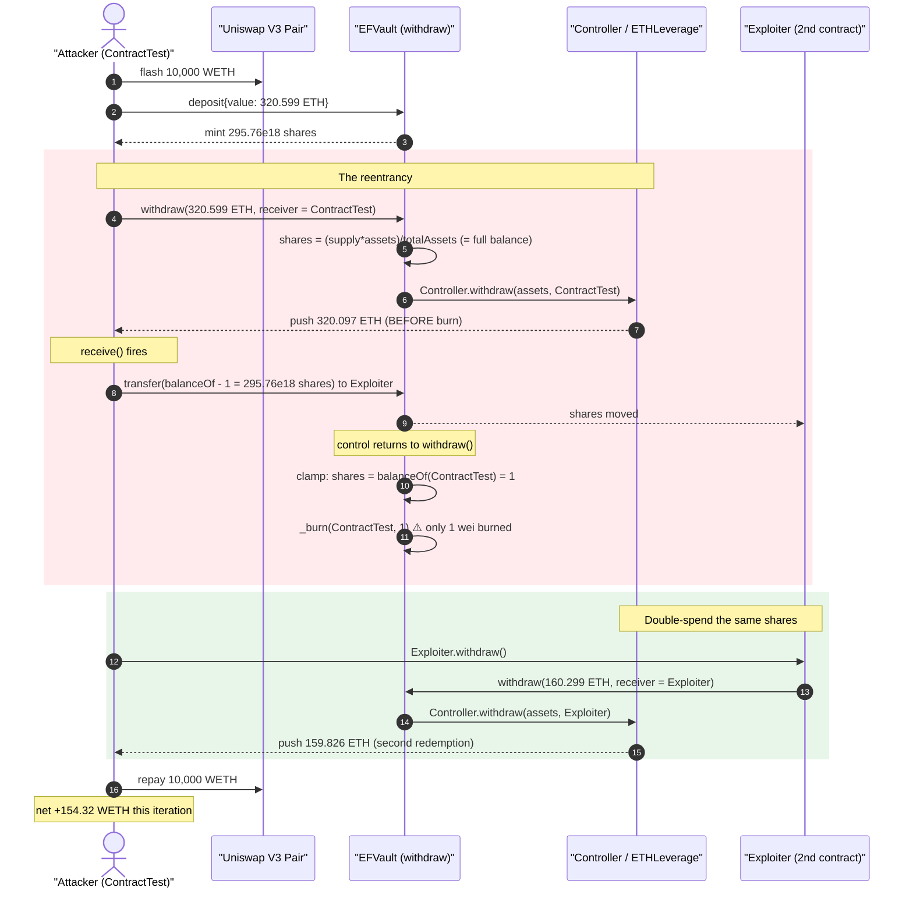
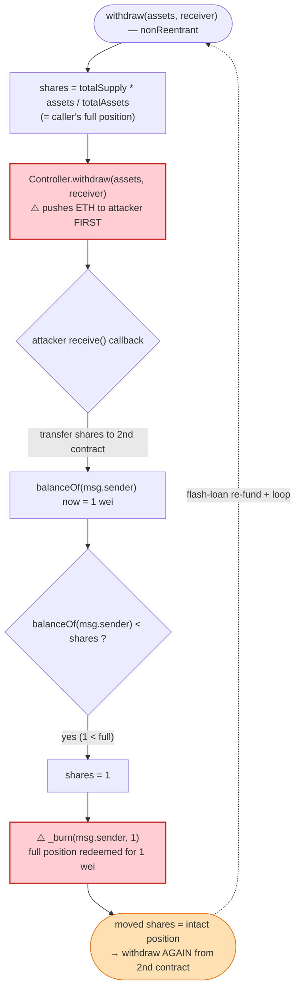
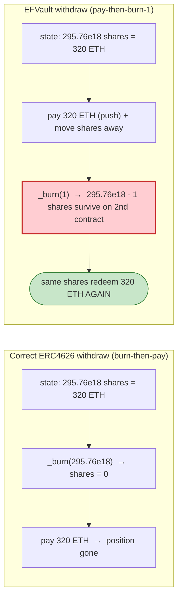

# EarningFarm (ENF) Exploit — Withdraw Reentrancy via ETH-Push-Before-Burn in `EFVault`

> **Vulnerability classes:** vuln/reentrancy/single-function · vuln/logic/incorrect-order-of-operations

> **Reproduction:** the PoC compiles & runs in an isolated Foundry project at
> [this project folder](.) (the umbrella DeFiHackLabs repo contains many
> unrelated PoCs that do not whole-compile, so this one was extracted).
> Full verbose trace: [output.txt](output.txt).
> Verified vulnerable source: [contracts_core_Vault.sol](sources/EFVault_863e57/contracts_core_Vault.sol).

---

## Key info

| | |
|---|---|
| **Loss** | ~$286K — the entire `ETHLeverage` strategy was drained (≈ 320.6 ETH of `totalAssets` at the fork block, ~283.9 ETH netted to the attacker) |
| **Vulnerable contract** | `EFVault` (impl) — [`0x863e572b215fd67c855d973f870266cf827aea5e`](https://etherscan.io/address/0x863e572b215fd67c855d973f870266cf827aea5e#code), behind proxy `ENF_ETHLEV` [`0x5655c442227371267c165101048E4838a762675d`](https://etherscan.io/address/0x5655c442227371267c165101048e4838a762675d) |
| **Victim / pooled funds** | `Controller` proxy [`0xE8688D014194fd5d7acC3c17477fD6db62aDdeE9`](https://etherscan.io/address/0xe8688d014194fd5d7acc3c17477fd6db62addee9) → `ETHLeverage` sub-strategy (Aave-stETH leverage) |
| **Attacker EOA** | [`0xee4b3dd20902fa3539706f25005fa51d3b7bdf1b`](https://etherscan.io/address/0xee4b3dd20902fa3539706f25005fa51d3b7bdf1b) |
| **Attacker contract** | [`0xfe141c32e36ba7601d128f0c39dedbe0f6abb983`](https://etherscan.io/address/0xfe141c32e36ba7601d128f0c39dedbe0f6abb983) |
| **Attack tx** | [`0x6e6e556a5685980317cb2afdb628ed4a845b3cbd1c98bdaffd0561cb2c4790fa`](https://etherscan.io/tx/0x6e6e556a5685980317cb2afdb628ed4a845b3cbd1c98bdaffd0561cb2c4790fa) |
| **Chain / block / date** | Ethereum mainnet / fork 17,875,885 / Aug 9, 2023 |
| **Compiler** | `EFVault` v0.8.3, optimizer **200 runs** (proxy v0.8.9) |
| **Bug class** | Reentrancy — external ETH push to `receiver` **before** `_burn` of shares; shares are moved away during the callback so the burn destroys only 1 wei |

---

## TL;DR

`EFVault.withdraw()` ([contracts_core_Vault.sol:122-145](sources/EFVault_863e57/contracts_core_Vault.sol#L122-L145))
pays the user out by calling `IController(controller).withdraw(assets, receiver)`, which forwards the
strategy's redeemed **native ETH straight to `receiver`**, and only *afterwards* burns the caller's vault
shares. The `nonReentrant` guard on `withdraw()` does **not** stop this, because the reentrancy does not
re-enter `withdraw()` at all — it just needs to **move the shares out of the caller's account during the
ETH callback**, before the burn reads `balanceOf(msg.sender)`.

The withdraw burn is written defensively *against the wrong threat*:

```solidity
// Shares could exceed balance of caller
if (balanceOf(msg.sender) < shares) shares = balanceOf(msg.sender);
_burn(msg.sender, shares);
```

This clamp means: "if the caller no longer holds the `shares` we computed, just burn whatever they have
left." During the ETH push, the attacker forwards **all but 1** of its shares to a second contract, so when
control returns the clamp reduces the burn to **1 wei** — the attacker withdrew a full position's worth of
ETH while surrendering one wei of shares. The 295.76M shares now live untouched on the second contract,
which immediately withdraws **again**, and the cycle repeats inside one flash-loan-funded transaction until
the strategy is empty.

---

## Background — what EarningFarm / ENF does

EarningFarm is an ETH yield aggregator. The piece in scope is the **ETH leverage vault**:

- **`EFVault`** ([source](sources/EFVault_863e57/contracts_core_Vault.sol)) is an ERC4626-style ETH vault.
  Users `deposit{value: assets}` ETH and receive ENF shares; `withdraw(assets, receiver)` redeems shares
  back to ETH. It is `ReentrancyGuardUpgradeable` and behind a `TransparentUpgradeableProxy`.
- **`Controller`** (proxy `0xE868…`, impl `0x31cd…`) routes vault ETH into a sub-strategy and back. On
  withdraw it returns `(withdrawn, fee)` and **forwards the redeemed ETH to the `receiver` address the vault
  passes in**.
- **`ETHLeverage`** is the actual sub-strategy: it deposits ETH → stETH → Aave, borrows WETH against it, and
  loops for leverage. `totalAssets()` is computed live from the Aave/Lido position
  ([trace L1681-1700](output.txt#L1681)). At the fork block the strategy was worth ≈ **320.6 ETH**.

The vault converts between assets and shares with the standard ERC4626 formula
([:151-161](sources/EFVault_863e57/contracts_core_Vault.sol#L151-L161)):

```solidity
function convertToAssets(uint256 shares) public view returns (uint256) {
    uint256 supply = totalSupply();
    return supply == 0 ? shares : (shares * totalAssets()) / supply;
}
```

So a holder of "all the shares" can redeem "all the assets". That is fine — **once**. The bug is that the
exploit lets the *same* shares redeem the assets *more than once*.

---

## The vulnerable code

### `withdraw()` — interaction (ETH push) precedes effect (burn)

[contracts_core_Vault.sol:122-145](sources/EFVault_863e57/contracts_core_Vault.sol#L122-L145):

```solidity
function withdraw(uint256 assets, address receiver) public virtual nonReentrant unPaused returns (uint256 shares) {
    require(assets != 0, "ZERO_ASSETS");
    require(assets <= maxWithdraw, "EXCEED_ONE_TIME_MAX_WITHDRAW");

    // Total Assets amount until now
    uint256 totalDeposit = convertToAssets(balanceOf(msg.sender));
    require(assets <= totalDeposit, "EXCEED_TOTAL_DEPOSIT");

    // Calculate share amount to be burnt
    shares = (totalSupply() * assets) / totalAssets();

    // Calls Withdraw function on controller
    (uint256 withdrawn, uint256 fee) = IController(controller).withdraw(assets, receiver); // ⚠️ sends ETH to `receiver` — EXTERNAL CALL
    require(withdrawn > 0, "INVALID_WITHDRAWN_SHARES");

    // Shares could exceed balance of caller
    if (balanceOf(msg.sender) < shares) shares = balanceOf(msg.sender);  // ⚠️ clamp re-reads balance AFTER the callback

    _burn(msg.sender, shares);                                            // ⚠️ EFFECT happens last → only 1 wei left to burn

    emit Withdraw(address(asset), msg.sender, receiver, assets, shares, fee);
}
```

Two design errors compose:

1. **Checks-Effects-Interactions is inverted.** The external ETH-paying call
   `IController(controller).withdraw(assets, receiver)` happens *before* `_burn`. `receiver` is fully
   attacker-controlled, so the attacker gets a re-entry hook with the shares still on its books.
2. **The "defensive" clamp is self-defeating.** `if (balanceOf(msg.sender) < shares) shares = balanceOf(msg.sender)`
   was meant to prevent a revert when the position rounds slightly. But it converts the attack from a revert
   into a **silent under-burn**: by moving the shares away during the callback, the attacker forces
   `balanceOf(msg.sender) == 1`, so `_burn` destroys **1 wei** for a full-value redemption.

The `nonReentrant` modifier is intact — but it guards re-entry into `withdraw`/`deposit`, which the attack
**does not need**. The attack only needs to mutate `balanceOf(msg.sender)` between the `shares = …`
computation and the `_burn`, and an ordinary ERC20 `transfer` inside the ETH callback does exactly that
without re-entering any guarded function.

### `deposit()` follows CEI correctly — so the vault price is honest

[contracts_core_Vault.sol:81-116](sources/EFVault_863e57/contracts_core_Vault.sol#L81-L116) sends ETH to the
controller and only then mints. This matters: the attacker first makes an *honest* deposit to mint itself a
full share position, then weaponizes the broken withdraw path. There is no share-inflation trick here — the
shares are real; they are simply burned-by-1 and then re-spent.

---

## Root cause — why it was possible

> **A withdrawal destroys the value receipt (shares) only after handing out the underlying asset, and it
> trusts whatever `balanceOf(msg.sender)` reads after an attacker-controlled callback.**

In a correct ERC4626 withdraw, shares are burned **before** assets leave the contract (`_withdraw` in OZ
burns first, transfers last). `EFVault` does the opposite and pays in **native ETH routed to an arbitrary
`receiver`**, which is the strongest possible re-entry primitive (every contract has a `receive`/`fallback`).

Concretely, the chain of decisions:

1. **ETH is pushed before burn.** `IController.withdraw(assets, receiver)` forwards strategy ETH to
   `receiver` first; `_burn` is last. Reentrancy window opened.
2. **`receiver` is caller-chosen.** The attacker passes its own contract as `receiver`, so the ETH push
   lands in code it controls.
3. **Shares are fungible and transferable mid-withdraw.** Nothing locks the caller's shares during the
   redemption, so the callback can `transfer` them elsewhere.
4. **The burn clamps to the post-callback balance.** After the shares are gone, `_burn` quietly burns 1 wei
   instead of reverting — the position is redeemed for free.
5. **The moved shares are still a full, valid position.** The recipient contract can withdraw the *same*
   value again; with a flash loan to keep re-funding the strategy, the loop drains it completely.

---

## Preconditions

- The attacker holds (or mints, via an honest `deposit`) a vault share position. In the PoC it deposits the
  flash-loaned ETH to mint **295,761,225,721,251,919,241** shares (≈ the whole supply at that moment)
  ([trace L2884](output.txt#L2884)).
- A second attacker-controlled contract to receive the shares during the callback (`Exploiter` in the PoC).
- Working capital in WETH to top the strategy back up between drains. The PoC uses a **Uniswap V3 WETH/USDC
  flash loan of 10,000 WETH per iteration** ([EarningFram_exp.sol:51](test/EarningFram_exp.sol#L51)); it is
  fully repaid each loop, so the attack is **flash-loanable / near-zero-capital**.
- The vault must be `unPaused` (it was).

---

## Attack walkthrough (with on-chain numbers from the trace)

All figures are taken directly from `console.log` lines and events in
[output.txt](output.txt). The attack is a `while (totalAssets() > 1 ether)` loop; each iteration takes a
fresh flash loan, deposits the strategy's full value, then redeems it **twice** using the reentrancy. The
table follows **iteration 1**.

| # | Step | Trace | Effect |
|---|------|-------|--------|
| 0 | **Initial** strategy value | [L1571](output.txt#L1571) `Current Total: 320.599 ETH` | `totalAssets ≈ 320.6 ETH`, attacker holds 0 shares |
| 1 | **Flash loan** 10,000 WETH from Uniswap V3 WETH/USDC pair | [L1761](output.txt#L1761) | working capital obtained |
| 2 | Unwrap WETH→ETH, then **`deposit{value: 320.599 ETH}`** | [L1892](output.txt#L1892) | mints **295,761,225,721,251,919,241** ENF shares to `ContractTest` ([L2884](output.txt#L2884)) |
| 3 | **`withdraw(320.599 ETH, ContractTest)`** | [L2987](output.txt#L2987) | `shares = (totalSupply·assets)/totalAssets` ≈ full balance |
| 4 | Vault → `Controller.withdraw(…, ContractTest)` redeems strategy and **pushes 320.097 ETH to `ContractTest`** | [L3165](output.txt#L3165), `Cont Withdraw: 320.097` [L3932](output.txt#L3932) | ETH arrives **before** burn |
| 5 | **Reentrancy:** `ContractTest.receive()` fires, transfers `balanceOf − 1 = 295,761,225,721,251,919,240` shares to `Exploiter` | [L3938-3945](output.txt#L3938) | caller's share balance drops to **1 wei** |
| 6 | Back in `withdraw`: clamp sets `shares = balanceOf(msg.sender) = 1`; **`_burn(ContractTest, 1)`** | [L3956-3957](output.txt#L3956) `shares: 1` | full 320.097 ETH redeemed for **1 wei** of shares burned |
| 7 | **`Exploiter.withdraw()`** redeems the moved 295.76M shares **again** | [L3963](output.txt#L3963), inner `EFVault::withdraw(160.299 ETH, Exploiter)` [L4068](output.txt#L4068) | second redemption of the *same* position |
| 8 | `Controller.withdraw(…, Exploiter)` pushes another **159.826 ETH** to the attacker | `Cont Withdraw: 159.826` [L1577](output.txt#L1577) | strategy drained further |
| 9 | Repay 10,000 WETH flash loan; **net WETH after iter 1 = 154.32** | [L1578](output.txt#L1578) | profit booked |

The loop then repeats. Because each pass redeems roughly **2× the strategy's current value** while only
re-funding it once, `totalAssets` halves each iteration (320.6 → 160.3 → 80.0 → 40.0 → 20.0 → 10.0 → … ETH,
visible in the `ETH Vault:` / `Current Total:` logs at [L1569-1657](output.txt#L1569)). After **9 flash-loan
iterations** the strategy is below 1 ETH and the loop exits.

Cumulative attacker WETH balance across iterations ([L1578-1658](output.txt#L1578)):

| Iter | 1 | 2 | 3 | 4 | 5 | 6 | 7 | 8 | 9 |
|------|---|---|---|---|---|---|---|---|---|
| WETH held | 154.32 | 229.18 | 264.05 | 278.96 | **283.90** | 283.86 | 281.33 | 277.57 | 273.18 |

The balance **peaks at ≈ 283.9 WETH** (iteration 5); later iterations spend slightly more re-funding the
shrinking strategy than they extract (diminishing returns on the tail), but the attacker keeps the peak by
stopping when profitable — the realized theft is essentially the strategy's whole **~320 ETH** of pooled LP
value, reported by DeFiHackLabs as **~$286K**.

### Why "burn 1 wei" is the whole exploit

`_burn(msg.sender, shares)` is the only place the redeemed value is supposed to be subtracted from the
attacker's position. Burning `1` instead of the full `295.76e18` leaves the position **intact but relocated**
to `Exploiter`. The vault has now paid out ETH for a position that still exists and can pay out again. Every
withdraw after the first is double-spending the same shares.

---

## Profit / loss accounting

| | ETH |
|---|---:|
| Strategy `totalAssets` at fork block (the prize) | ~320.6 |
| Per-iteration flash loan (borrowed & repaid each loop) | 10,000 (net 0) |
| Peak attacker WETH balance (iteration 5) | **~283.9** |
| Reported loss (DeFiHackLabs `@KeyInfo`) | **~$286K** |

Capital at risk to the attacker is essentially zero: every WETH spent depositing into the strategy is
recovered (twice) by the reentrant double-withdraw, and the 10,000-WETH flash loan is repaid in the same
transaction.

---

## Diagrams

### Sequence of one drain iteration



### Control-flow of the broken withdraw



### Share-conservation invariant: correct vs. exploited



---

## Remediation

1. **Burn before paying (Checks-Effects-Interactions).** Move `_burn(msg.sender, shares)` (and the share
   computation it depends on) **before** the `IController.withdraw(...)` call that releases ETH. After the
   burn, the caller cannot relocate the shares to escape it. This single reordering kills the exploit.
2. **Do not let `receiver` be the re-entry surface during the burn.** If the controller must push ETH to an
   arbitrary `receiver`, do it strictly *after* all vault state (burn + supply) is finalized. Prefer
   redeeming to the vault and then doing one final transfer at the very end.
3. **Remove / fix the clamp.** `if (balanceOf(msg.sender) < shares) shares = balanceOf(msg.sender)` should
   not silently reduce the burn. Either burn the exact computed `shares` and `require` the caller holds them
   (revert otherwise), or snapshot `balanceOf(msg.sender)` *before* any external call and burn against the
   snapshot.
4. **Lock shares for the duration of a withdraw.** A real `nonReentrant` is necessary but not sufficient
   here, because the attack uses a plain `transfer` rather than re-entering a guarded function. Disallow
   share transfers while a withdrawal is mid-flight (e.g., a transient "withdrawing" flag, or pull-based
   payout so no external call happens before the burn).
5. **Pull over push for ETH.** Credit the owed ETH to the receiver and let them claim it in a separate call,
   so no attacker code executes inside `withdraw`.

The minimal, correct shape:

```solidity
function withdraw(uint256 assets, address receiver) public nonReentrant unPaused returns (uint256 shares) {
    require(assets != 0 && assets <= maxWithdraw, "BAD_ASSETS");
    require(assets <= convertToAssets(balanceOf(msg.sender)), "EXCEED_TOTAL_DEPOSIT");

    shares = (totalSupply() * assets) / totalAssets();
    if (shares > balanceOf(msg.sender)) shares = balanceOf(msg.sender);

    _burn(msg.sender, shares);                                  // EFFECT first

    (uint256 withdrawn, uint256 fee) = IController(controller).withdraw(assets, receiver); // INTERACTION last
    require(withdrawn > 0, "INVALID_WITHDRAWN_SHARES");

    emit Withdraw(address(asset), msg.sender, receiver, assets, shares, fee);
}
```

---

## How to reproduce

The PoC was extracted into a standalone Foundry project (the umbrella DeFiHackLabs repo has many unrelated
PoCs that fail to compile under a whole-project build):

```bash
_shared/run_poc.sh 2023-08-EarningFram_exp --mt testExploit -vvvvv
```

- RPC: a mainnet **archive** endpoint is required (fork block 17,875,885). `foundry.toml` maps
  `mainnet` to an Infura key; any archive node serving historical state at that block works. Pruned nodes
  fail with `header not found` / `missing trie node`.
- The test loops `while (ENF_ETHLEV.totalAssets() > 1 ether)`, draining the strategy across 9 flash-loan
  iterations and logging the running WETH balance each pass.

Expected tail:

```
[PASS] testExploit() (gas: 28588578)
Logs:
  ...
  Attacker WETH balance after exploit: 154.324273138764416547
  ...
  Attacker WETH balance after exploit: 283.897959680470125802   <-- peak
  ...
Suite result: ok. 1 passed; 0 failed; 0 skipped
```

---

*References: DeFiHackLabs PoC header ([test/EarningFram_exp.sol](test/EarningFram_exp.sol)); analysis by
Phalcon — https://twitter.com/Phalcon_xyz/status/1689182459269644288 ; SlowMist Hacked archive (EarningFarm,
ETH, ~$286K).*
