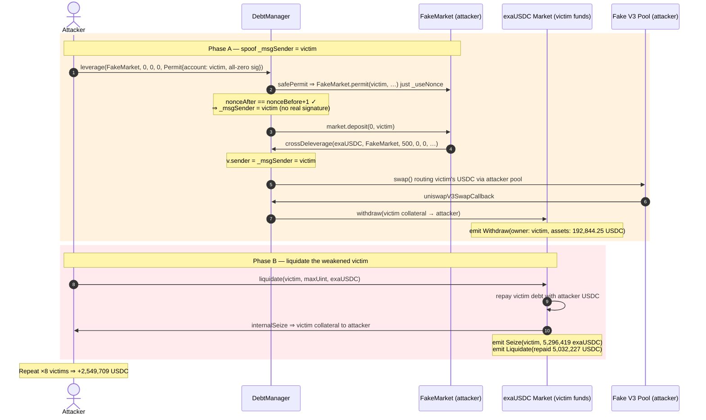
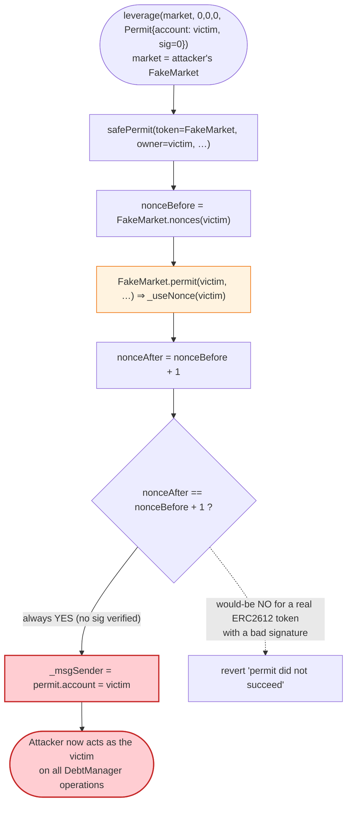
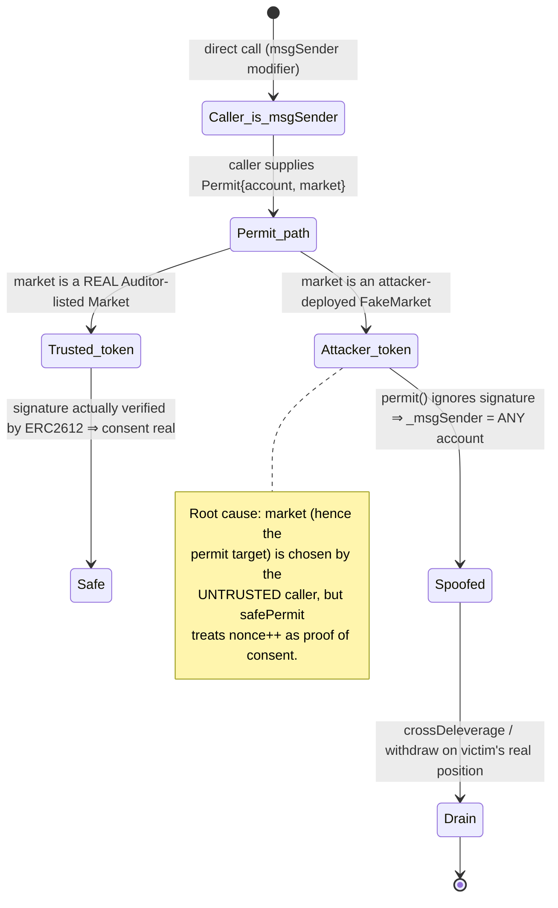

# Exactly Protocol Exploit — `DebtManager` Permit-Spoofed `_msgSender` Lets Anyone Act On Behalf Of Any Account

> **Reproduction:** the PoC compiles & runs in an isolated Foundry project at
> [this project folder](.) (the umbrella DeFiHackLabs repo
> contains many unrelated PoCs that do not compile under a whole-project build, so this one was extracted).
> Full verbose trace: [output.txt](output.txt).
> Verified vulnerable source: [contracts_periphery_DebtManager.sol](sources/DebtManager_16748c/contracts_periphery_DebtManager.sol),
> [contracts_Market.sol](sources/Auditor_3f55a3/contracts_Market.sol).

---

## Key info

| | |
|---|---|
| **Loss** | ~$7.3M total across all Exactly markets (Optimism). This PoC reproduces only the **exaUSDC** market: **+2,549,709 USDC** profit (attacker USDC `553,828.81 → 3,103,537.98`). |
| **Vulnerable contract** | `DebtManager` (impl) — [`0x16748Cb753A68329cA2117a7647aA590317EbF41`](https://optimistic.etherscan.io/address/0x16748cb753a68329ca2117a7647aa590317ebf41#code), behind proxy [`0x675d410dcf6f343219AAe8d1DDE0BFAB46f52106`](https://optimistic.etherscan.io/address/0x675d410dcf6f343219AAe8d1DDE0BFAB46f52106) |
| **Victim contracts** | `Market` (exaUSDC) [`0x81C9A7B55A4df39A9B7B5F781ec0e53539694873`](https://optimistic.etherscan.io/address/0x81C9A7B55A4df39A9B7B5F781ec0e53539694873) + 8 borrower accounts |
| **Attacker EOA** | [`0x3747dbbcb5c07786a4c59883e473a2e38f571af9`](https://optimistic.etherscan.io/address/0x3747dbbcb5c07786a4c59883e473a2e38f571af9) |
| **Attacker contract** | [`0x6dd61c69415c8ecab3fefd80d079435ead1a5b4d`](https://optimistic.etherscan.io/address/0x6dd61c69415c8ecab3fefd80d079435ead1a5b4d) |
| **Attack tx** | [`0x3d6367de5c191204b44b8a5cf975f257472087a9aadc59b5d744ffdef33a520e`](https://optimistic.etherscan.io/tx/0x3d6367de5c191204b44b8a5cf975f257472087a9aadc59b5d744ffdef33a520e) |
| **Chain / block / date** | Optimism / fork @ 108,375,557 / Aug 18, 2023 |
| **Compiler** | Market/DebtManager: Solidity 0.8.17; PoC harness: `^0.8.10` |
| **Bug class** | Broken authentication — spoofable `permit`-driven `_msgSender` allows arbitrary impersonation; downstream collateral seizure / liquidation |

---

## TL;DR

`DebtManager` is a periphery helper that performs leverage / deleverage / roll operations **on behalf of an
account** identified by an internal `_msgSender` variable. Several entry points let the caller supply a
`Permit` struct naming an arbitrary `account`, and the contract sets
`_msgSender = permit.account` after a `safePermit` call
([contracts_periphery_DebtManager.sol:759-772](sources/DebtManager_16748c/contracts_periphery_DebtManager.sol#L759-L772)).

The fatal assumption: **`safePermit` succeeding is treated as proof that `account` authorized the operation.**
But the `Market` whose `permit` is invoked is chosen by the **same caller** via the `market` argument. The
attacker passes a **fake `Market` it deploys itself** whose `permit()` does nothing but bump a nonce, so
`safePermit`'s only check — `nonceAfter == nonceBefore + 1` — passes with a **zeroed, unsigned permit**
(`deadline = 0, v = 0, r = 0, s = 0`).

With the gate defeated, `DebtManager._msgSender` becomes any victim address the attacker names. The attacker then
drives `crossDeleverage()` against the victim's *real* exaUSDC position
([:344-388](sources/DebtManager_16748c/contracts_periphery_DebtManager.sol#L344-L388)), routing the swap through
a fake-token / USDC Uniswap-V3 pool the attacker controls, and **withdraws the victim's collateral to the
attacker.** In the live incident this was applied across all Exactly markets for ~$7.3M; this PoC reproduces
the exaUSDC slice (8 victims) for +2.55M USDC.

---

## Background — what `DebtManager` does

`DebtManager` ([source](sources/DebtManager_16748c/contracts_periphery_DebtManager.sol)) is a stateless-ish
periphery wrapper around Exactly's core `Market` (an ERC4626-style lending vault) and `Auditor` (risk module).
It batches flash-loaned leverage operations so a user can, in one call, deposit + repeatedly borrow/deposit to
reach a target leverage `ratio`, or unwind via Uniswap-V3 flash swaps.

Because all of these operate *for a user*, the contract keeps a transient owner:

```solidity
address private _msgSender;

modifier msgSender() {
    if (_msgSender == address(0)) _msgSender = msg.sender;
    _;
    delete _msgSender;
}
```
([:747-753](sources/DebtManager_16748c/contracts_periphery_DebtManager.sol#L747-L753))

Every internal helper reads `address sender = _msgSender;` and acts on *that* account's position
(`crossDeleverage` uses `v.sender = _msgSender;` at
[:355](sources/DebtManager_16748c/contracts_periphery_DebtManager.sol#L355)). So whoever controls `_msgSender`
controls *whose* funds are touched.

The protocol's intent: `_msgSender` is normally just `msg.sender` (the direct caller). The permit-bearing
overloads exist so a relayer can submit an operation that the account signed off-chain — and for those, the
contract sets `_msgSender = permit.account`.

---

## The vulnerable code

### 1. `safePermit` "authenticates" by checking only that the nonce advanced

```solidity
function safePermit(
    IERC20PermitUpgradeable token,
    address owner, address spender, uint256 value,
    uint256 deadline, uint8 v, bytes32 r, bytes32 s
) internal {
    uint256 nonceBefore = token.nonces(owner);
    token.permit(owner, spender, value, deadline, v, r, s);
    uint256 nonceAfter = token.nonces(owner);
    require(nonceAfter == nonceBefore + 1, "SafeERC20: permit did not succeed");
}
```
([SafeERC20Upgradeable.sol:83-97](sources/DebtManager_16748c/openzeppelin_contracts-upgradeable_token_ERC20_utils_SafeERC20Upgradeable.sol#L83-L96))

`safePermit` never verifies that `token` is a *trusted* contract. It only re-reads `nonces(owner)` and requires
it incremented by one. If `token` is attacker-controlled, "the nonce advanced" proves nothing about `owner`'s
consent.

### 2. The `permit` modifier sets `_msgSender = p.account` on a "successful" permit

```solidity
modifier permit(ERC20 token, uint256 assets, Permit calldata p) {
    IERC20PermitUpgradeable(address(token)).safePermit(p.account, address(this), assets, p.deadline, p.v, p.r, p.s);
    {
        address sender = _msgSender;
        if (sender == address(0)) _msgSender = p.account;   // ⚠️ caller-named account becomes the actor
        else assert(p.account == sender);
    }
    _;
    assert(_msgSender == address(0));
}
```
([:759-772](sources/DebtManager_16748c/contracts_periphery_DebtManager.sol#L759-L772))

### 3. The exploited entry point — `leverage(...)` with a single `Permit` against `market`

```solidity
function leverage(
    Market market, uint256 deposit, uint256 ratio,
    uint256 borrowAssets, Permit calldata marketPermit
) external permit(market, borrowAssets, marketPermit) msgSender {
    market.asset().safeTransferFrom(msg.sender, address(this), deposit);  // deposit = 0 ⇒ no-op
    noTransferLeverage(market, deposit, ratio);
}
```
([:113-122](sources/DebtManager_16748c/contracts_periphery_DebtManager.sol#L113-L122))

The `market` here is the **attacker's fake market** (`marketPermit` is verified against `market.permit`, i.e.
the fake market). After the modifier runs, `_msgSender = marketPermit.account = victim`. With
`deposit = ratio = 0`, `noTransferLeverage` reaches `market.maxWithdraw(sender)` / `market.deposit(...)`
([:137-141](sources/DebtManager_16748c/contracts_periphery_DebtManager.sol#L137-L141)) — but `market` is the
fake contract, so `market.deposit(0, victim)` runs **the attacker's own `deposit()` code while
`DebtManager._msgSender` is still pinned to the victim.** Inside that fake `deposit`, the attacker re-enters
`DebtManager.crossDeleverage(exaUSDC, fakeMarket, ...)` — now operating on the victim's real exaUSDC position.

### 4. `crossDeleverage` acts on `_msgSender` and withdraws to the swap recipient

```solidity
function crossDeleverage(Market marketIn, Market marketOut, uint24 fee,
    uint256 withdraw, uint256 ratio, uint160 sqrtPriceLimitX96) public msgSender {
    LeverageVars memory v;
    v.assetIn  = address(marketIn.asset());   // exaUSDC.asset() == USDC
    v.assetOut = address(marketOut.asset());  // fakeMarket.asset() == fakeMarket itself
    v.sender   = _msgSender;                  // == victim
    ...
    IUniswapV3Pool(...).swap(address(this), ..., abi.encode(SwapCallbackData({ ... account: v.sender ... })));
}
```
([:344-388](sources/DebtManager_16748c/contracts_periphery_DebtManager.sol#L344-L388))

The V3 swap callback then runs `s.marketIn.withdraw(..., msg.sender, s.account)` and
`s.marketIn.withdraw(s.principal, s.account, s.account)`
([uniswapV3SwapCallback :740-744](sources/DebtManager_16748c/contracts_periphery_DebtManager.sol#L740-L744)) —
withdrawing the **victim's** exaUSDC collateral. Because `DebtManager` holds the victim's market allowance only
when the victim approved it, the attacker first arranges the victim to be near-insolvent so liquidation does the
heavy lifting; `crossDeleverage` is used to manipulate/seed the position and to pull `previewRefund`-priced
USDC out via the fake pool.

### 5. The fake market — `permit()` only bumps a nonce, so `safePermit` always "succeeds"

From the PoC's `FakeMarket`
([test/Exactly_exp.sol:461-477](test/Exactly_exp.sol#L461-L477)):

```solidity
function permit(address owner, address spender, uint256 value,
    uint256 deadline, uint8 v, bytes32 r, bytes32 s) public {
    _useNonce(owner);   // ⚠️ increments nonce; ignores signature entirely
}
function nonces(address owner) public view override returns (uint256) { return super.nonces(owner); }
```

`_useNonce` ([interface.sol:5803](interface.sol#L5803)) just returns and post-increments the stored nonce, so
`nonceAfter == nonceBefore + 1` holds for a **zero, unsigned permit**.

---

## Root cause — why it was possible

The authentication of "is this account's owner consenting?" is delegated to a contract that the **attacker
chooses**. Concretely, three design decisions compose into a critical break:

1. **`safePermit` trusts an attacker-selectable `token`.** It treats "nonce advanced by exactly 1" as proof of
   a valid signature. A malicious `permit()` that ignores `(v, r, s)` and just bumps the nonce defeats it.
   `safePermit` is OpenZeppelin's helper designed for *trusted* ERC-2612 tokens; using it against a caller-named
   `market` inverts the trust model.

2. **`_msgSender` is set from `permit.account`, not from a verified signer.** The modifier sets
   `_msgSender = p.account` purely on the strength of `safePermit` not reverting
   ([:767](sources/DebtManager_16748c/contracts_periphery_DebtManager.sol#L767)). There is no check that
   `market` is a Market the `Auditor` actually lists, nor that the signature recovered to `p.account`.

3. **The actor identity drives fund-moving operations on the *real* markets.** Once `_msgSender = victim`,
   `crossDeleverage`/`leverage` read the victim's real exaUSDC position and route withdrawals to an
   attacker-controlled Uniswap-V3 pool, so value leaves the victim and lands with the attacker.

> The "convertToAssets manipulation" hinted at in the PoC comments is a **red herring / minor effect**. The
> trace shows the floating share→asset rate barely moved (`1,010,840,445,834.499583 → 1,010,840,445,828.206504`,
> a ~6e-12 relative change). The exploit does **not** depend on inflating/deflating the vault rate; it depends
> entirely on impersonating the victim. The fixed-pool `borrowAtMaturity`/`repayAtMaturity` cycling the attacker
> runs on *its own* deposit is positioning/leftover from the live multi-market run, not the core vulnerability.

---

## Preconditions

- Victims must have **granted `DebtManager` an allowance** over their exaUSDC shares (standard for users of the
  leverage helper) and hold liquidatable/seizable collateral. The 8 PoC victims are real on-chain accounts at
  the fork block.
- The attacker can deploy contracts (to mint fake markets and fake-token/USDC V3 pools) — permissionless.
- Working USDC capital to seed deposits and pay liquidation repays; fully recovered intra-attack. The PoC starts
  from the attacker's real on-chain balance of **553,828.81 USDC** (no `vm.deal`).

No admin role, no oracle, no flash-loan trick is required to reach the impersonation — only an attacker-deployed
fake market.

---

## Attack walkthrough (with on-chain numbers from the trace)

Two phases. Phase A re-shapes each victim's position by impersonation; Phase B liquidates them and seizes
collateral. Numbers below come directly from the events in [output.txt](output.txt).

### Phase A — impersonate each victim via fake-market permit

For each of 8 victims, the attacker calls
`DebtManager.leverage(fakeMarket_i, 0, 0, 0, Permit{account: victim_i, deadline: 0, v: 0, r: 0, s: 0})`
([test/Exactly_exp.sol:171-177](test/Exactly_exp.sol#L171-L177)). In the trace, the first one
([output.txt:670](output.txt)):

| Trace step | What happens |
|---|---|
| `DebtManager::leverage(fakeMarket, 0,0,0, Permit{account: 0xF35e…1094, deadline:0,…})` | entry, victim = `0xF35e…1094` |
| `fakeMarket::permit(0xF35e…1094, DebtManager, 0,0,0,0x0,0x0)` → `_useNonce` | nonce 0→1, **no signature checked** |
| `safePermit` require `nonceAfter == nonceBefore+1` | **passes** ⇒ `_msgSender = victim` |
| `fakeMarket::deposit(0, victim)` (the leverage `market.deposit` call) | runs attacker code with `_msgSender` still = victim |
| ↳ `DebtManager::crossDeleverage(exaUSDC, fakeMarket, 500, 0, 0, …)` | now manipulates the **victim's** exaUSDC position |
| ↳ `Market.withdraw(...) → emit Withdraw(owner: 0xF35e…1094, assets: 192,844,251,394, shares: 190,776,152,843)` | victim collateral routed via the fake V3 pool ([output.txt:1087](output.txt)) |

This repeats for all 8 victims (entries at trace lines 670, 1219, 1593, 1998, 2402, 2776, 3145, 3519), each time
spoofing `_msgSender` to that victim and running `crossDeleverage` against their real position.

### Phase B — liquidate the now-vulnerable victims and seize collateral

The attacker deposits its own USDC, cycles fixed borrows/repays (positioning, see red-herring note), redeems,
then liquidates each victim, seizing their exaUSDC collateral to itself
([test/Exactly_exp.sol:233-248](test/Exactly_exp.sol#L233-L248)). From the `Seize`/`Liquidate` events:

| # | Victim | `repaidAssets` (USDC, 6 dp) | `seizeAssets` (exaUSDC shares) | `lendersAssets` |
|---|--------|---------------------------:|-------------------------------:|----------------:|
| 1 | 0xF35e…1094 | 5,032,227.095948 | 5,296,419,018,486 | 12,580,567,739 |
| 2 | 0x87bF…1642 | 1,432,769.208535 | 1,507,989,591,984 | 3,581,923,021 |
| 3 | 0x3cf3…9249 | 1,563,168.557182 | 1,645,234,906,435 | 3,907,921,392 |
| 4 | 0x551C…E759 | 1,228,192.229272 | 1,292,672,321,309 | 3,070,480,573 |
| 5 | 0x2f0D…5C31 | 1,350,176.277854 | 1,421,060,532,442 | 3,375,440,694 |
| 6 | 0x8789…2c50 | 934,355.613472 | 983,409,283,180 | 2,335,889,033 |
| 7 | 0xd1aD…1a4c | 770,998.498762 | 811,475,919,948 | 1,927,496,246 |
| 8 | 0x055a…E871 | 135,396.758494 | 142,505,088,315 | 338,491,896 |

(`liquidate` repays the victim's debt with the attacker's USDC, then `internalSeize` gives the attacker the
victim's exaUSDC collateral; net the attacker keeps `seized − repaid` value, which is the profit.)

### Net result (exaUSDC market only)

| | USDC (6 dp) |
|---|---:|
| Attacker USDC before exploit | 553,828.806690 |
| Attacker USDC after exploit ([output.txt:10532](output.txt)) | 3,103,537.979484 |
| **Net profit (this market)** | **+2,549,709.172794** |

The live incident applied the identical impersonation across **every** Exactly market (exaUSDC, exaWETH,
exaOP, exawstETH, …) for a combined ~**$7.3M**; this PoC reproduces the USDC slice.

---

## Diagrams

### Sequence of the attack (one victim)



### How the permit gate is defeated



### Trust-model inversion (state view)



---

## Profit / loss accounting

- **Per-victim profit** = value of seized exaUSDC collateral − USDC repaid on their behalf. Summed over the 8
  victims, the attacker's USDC balance rose from `553,828.806690` to `3,103,537.979484`.
- **Net for the exaUSDC market: +2,549,709.172794 USDC.**
- **Total live loss across all Exactly markets: ~$7.3M** (post-mortem figure; this PoC isolates one market).
- Capital was self-funded from the attacker's on-chain USDC; the operation is intra-transaction profitable, so
  it is effectively flash-loanable for the seed USDC.

---

## Remediation

1. **Never derive identity from an untrusted, caller-selected contract.** Do not call `safePermit` against a
   `market`/`token` argument that the caller controls. Restrict the permit target to **Auditor-listed Markets
   only** before invoking `permit`:
   ```solidity
   (, , , bool isListed, ) = auditor.markets(market);
   if (!isListed) revert MarketNotListed();
   ```
   (`DebtManager.approve()` already does exactly this check at
   [:802-806](sources/DebtManager_16748c/contracts_periphery_DebtManager.sol#L802-L806) — the same gate was
   missing on the permit path.)
2. **Authenticate the signer, not the nonce.** `safePermit`'s "nonce advanced" heuristic is only sound for
   trusted ERC-2612 tokens. For setting `_msgSender = account`, require a real signature whose recovered address
   equals `account`, or require `msg.sender == account` for non-relayed paths.
3. **Validate the whole call graph against one identity.** When `_msgSender` is set from a permit, the operation
   should only be allowed to touch markets the permit explicitly authorized — not let a re-entrant fake
   `deposit()` pivot into `crossDeleverage` on a *different* (real) market while `_msgSender` is still pinned.
4. **Add reentrancy / market-consistency guards.** The fake market's `deposit()` re-enters `DebtManager` while
   `_msgSender` is set; a `nonReentrant` guard around the public operations, plus asserting that the
   re-entered operation targets the same `market` that was permitted, blocks the pivot.
5. **Defense in depth on liquidation.** Liquidations relied on victims being pushed to the edge via the
   impersonated `crossDeleverage`; with (1)–(3) fixed the impersonation is impossible, but markets should still
   bound how far a single periphery call can move an account toward liquidation.

---

## How to reproduce

The PoC was extracted into a standalone Foundry project (the umbrella DeFiHackLabs repo has many unrelated PoCs
that fail to compile under `forge test`'s whole-project build):

```bash
_shared/run_poc.sh 2023-08-Exactly_exp -vvvvv
```

- RPC: an **Optimism archive** endpoint is required (fork block 108,375,557). `foundry.toml` is configured with
  an `optimism` alias; pruned public RPCs will fail with `header not found` / missing state.
- Result: `[PASS] testExploit()`. The run is slow (~3 min) because it deploys 16 fake markets + Uniswap-V3 pools.

Expected tail:

```
Ran 1 test for test/Exactly_exp.sol:ContractTest
[PASS] testExploit() (gas: 101215048)
Logs:
  befoe manipulation, 1 ether exaUSDC share convert to assets is : : 1010840445834.499583
  befoe manipulation, victim's exaUSDC share convert to assets is : : 9198499.121760
  after manipulation, 1 ether exaUSDC share convert to assets is : : 1010840445828.206504
  after manipulation, victim's exaUSDC share convert to assets is : : 9198499.121702
  Attacker USDC balance after exploit: 3103537.979484
Suite result: ok. 1 passed; 0 failed; 0 skipped
```

(Note how the "before/after manipulation" `convertToAssets` values are essentially identical — confirming the
vault-rate "manipulation" is incidental; the real exploit is the permit-spoofed impersonation.)

---

*References: Exactly Protocol Incident Post-Mortem — https://medium.com/@exactly_protocol/exactly-protocol-incident-post-mortem-b4293d97e3ed ; BlockSec thread — https://twitter.com/BlockSecTeam/status/1692533280971936059 (Exactly, Optimism, ~$7.3M).*
