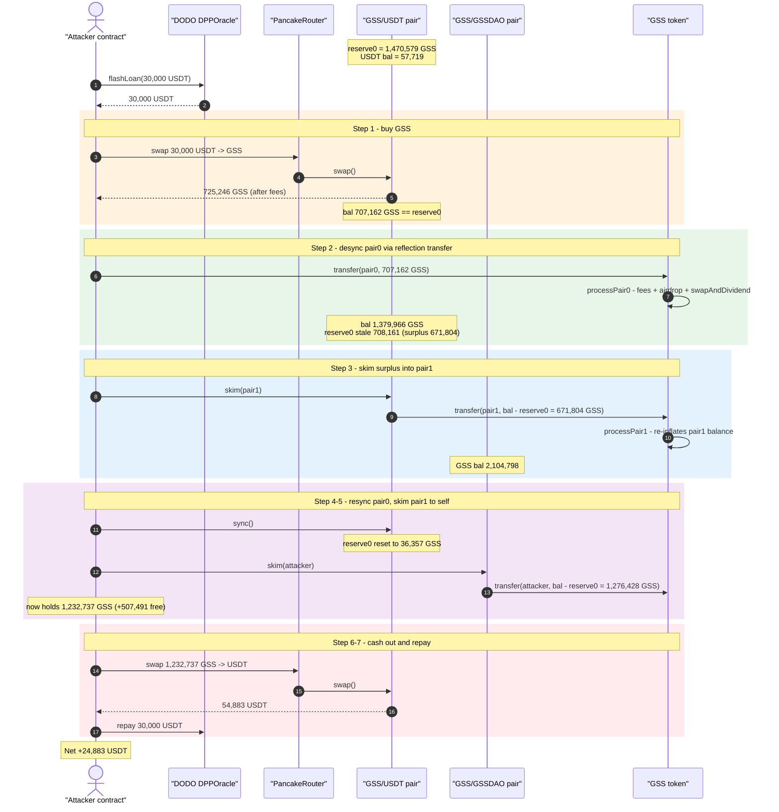
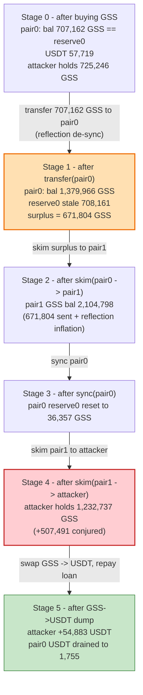
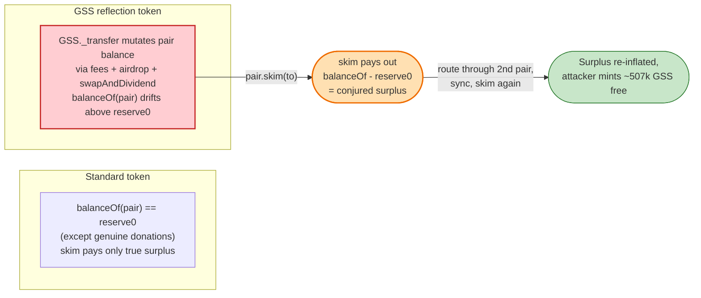

# GSS Exploit — Fee-on-Transfer / Reflection Token Drained via Cross-Pool `skim()`

> **Vulnerability classes:** vuln/defi/slippage · vuln/logic/state-update

> **Reproduction:** the PoC compiles & runs in an isolated Foundry project at
> [this project folder](.) (the umbrella DeFiHackLabs repo contains many
> unrelated PoCs that do not whole-compile under `forge test`, so this one was
> extracted standalone).
> Full verbose trace: [output.txt](output.txt).
> Verified vulnerable source: [GSS.sol](sources/GSS_37e42B/GSS.sol) and
> [PancakePair.sol](sources/PancakePair_1ad2cB/PancakePair.sol).

---

## Key info

| | |
|---|---|
| **Loss** | **~$24,883** — 24,883.45 USDT extracted (flash-loaned 30,000 USDT, repaid in full, net profit) |
| **Vulnerable contract** | `GSS` token — [`0x37e42B961AE37883BAc2fC29207A5F88eFa5db66`](https://bscscan.com/address/0x37e42B961AE37883BAc2fC29207A5F88eFa5db66#code) — a fee-on-transfer / reflection token whose balances drift from the AMM's recorded reserves |
| **Victim pools** | GSS/USDT pair `0x1ad2cB3C2606E6D5e45c339d10f81600bdbf75C0` and GSS/GSSDAO pair `0xB4F4cD1cc2DfF1A14c4Aaa9E9434A92082855C64` (both PancakeSwap V2 pairs) |
| **Attacker EOA** | `0x84f37f6cc75ccde5fe9ba99093824a11cfdc329d` |
| **Attacker contract** | `0x69ed5b59d977695650ec4b29e61c0faa8cc0ed5c` |
| **Attack tx** | `0x4f8cb9efb3cc9930bd38af5f5d34d15ce683111599a80df7ae50b003e746e336` |
| **Chain / block / date** | BSC / fork at 31,108,558 (`31_108_559 - 1`) / ~Aug 24, 2023 |
| **Flash-loan source** | DODO DPPOracle pool `0x9ad32e3054268B849b84a8dBcC7c8f7c52E4e69A` (30,000 USDT, fee-free) |
| **Compiler (GSS)** | Solidity v0.8.18, optimizer 1 run (PoC harness built with 0.8.34) |
| **Bug class** | Fee-on-transfer / reflection token + PancakePair `skim()` reserve-vs-balance desynchronization |

---

## TL;DR

`GSS` is a "reflection / auto-liquidity / dividend" BEP-20 token. Its
`_transfer` override ([GSS.sol:785-810](sources/GSS_37e42B/GSS.sol#L785-L810))
intercepts every transfer that touches a registered Pancake pair and reroutes
it through `processPair0` / `_tokenTransfer0`, which:

- skims **buy/sell fees**, an **airdrop**, a **burn**, and a **dividend** out of
  the transferred amount via many extra `super._transfer` hops, and
- triggers `swapAndDividend0` (a router round-trip) whenever the GSS contract has
  accumulated enough fee tokens.

The consequence is that the GSS **balance actually sitting inside a Pancake pair
no longer equals the pair's recorded `reserve0`**. A Uniswap-V2/PancakeSwap pair
exposes a permissionless `skim(to)`
([PancakePair.sol:482-487](sources/PancakePair_1ad2cB/PancakePair.sol#L482-L487))
that hands `balanceOf(pair) − reserve0` of the surplus token to *any* address.
Because the GSS fee/airdrop machinery **inflates that surplus** — and re-inflates
it again every time the surplus is itself transferred through another pair — the
attacker can repeatedly `skim` GSS out of the two pairs for free.

The attacker flash-loaned 30,000 USDT, bought GSS, pumped a large GSS balance
into the GSS/USDT pair, then used a **cross-pool `skim → sync → skim`** dance
between the GSS/USDT pair and the GSS/GSSDAO pair to mint **~507,000 GSS out of
thin air** into its own wallet. It dumped that GSS back into the GSS/USDT pair
for 54,883 USDT, repaid the 30,000 USDT loan, and walked away with
**24,883 USDT**.

---

## Background — what GSS does on every transfer

`GSS` ([GSS.sol:484-1139](sources/GSS_37e42B/GSS.sol#L484-L1139)) overrides ERC20
`_transfer`. Any transfer where `from` or `to` is `uniswapV2Pair0` (the GSS/USDT
pair) is routed into `processPair0`
([GSS.sol:812-842](sources/GSS_37e42B/GSS.sol#L812-L842)):

```solidity
function processPair0(address from, address to, uint amount) private {
    uint256 contractTokenBalance = balanceOf(address(this));
    bool overMinTokenBalance = contractTokenBalance >= numTokensSellToSwap0; // 1000 GSS
    if (overMinTokenBalance && !swapping && from != uniswapV2Pair0) {
        swapAndDividend0(numTokensSellToSwap0);   // router round-trip, sells fee GSS
    }
    bool takeFee = !swapping;
    if (_isExcludedFromFees[from] || _isExcludedFromFees[to]) takeFee = false;
    _tokenTransfer0(from, to, amount, takeFee);   // applies fees / airdrop / burn
    ...
}
```

`_tokenTransfer0` ([GSS.sol:975-1016](sources/GSS_37e42B/GSS.sol#L975-L1016)) is
the heart of the divergence. On a *taxed* transfer it performs several
**independent** `super._transfer` movements before finally moving the residual
amount:

```solidity
function _tokenTransfer0(address sender, address recipient, uint256 amount, bool takeFee) private {
    if (takeFee) {
        if (enableAirdrop && balanceOf(address(this)) >= 3 * 1e13) {
            for (uint i = 0; i < 3; i++) {            // (1) airdrop — moves GSS the
                super._transfer(address(this),         //     CONTRACT holds to pseudo-
                    address(uint160(uint(keccak256(abi.encodePacked(   //  random addrs
                        i, balanceOf(address(this)), block.timestamp))))), 1e13);
            }
        }
        ...
        if (feeToThis > 0)    { super._transfer(sender, address(this), feeAmount);            amount -= feeAmount; } // (2)
        if (feeToHolders > 0) { super._transfer(sender, address(dividendTracker), feeAmount); amount -= feeAmount; } // (3)
        if (feeToBurn > 0)    { super._transfer(sender, address(0xdead), feeAmount);          amount -= feeAmount; } // (4)
    }
    super._transfer(sender, recipient, amount);       // (5) residual
}
```

Every one of these `super._transfer` calls changes the **GSS balance of the
pair address** without the pair's `reserve0` being updated — the pair only
updates its reserves inside `swap`/`mint`/`burn`/`sync`. The discrepancy is
exactly what `skim` is designed to forward to a caller-chosen address.

The token is registered against two pairs: `uniswapV2Pair0` = GSS/USDT (the deep
pool with USDT liquidity) and `uniswapV2Pair1` = GSS/GSSDAO. The exploit moves
GSS between them.

---

## The vulnerable code

### 1. PancakePair `skim()` blindly forwards `balanceOf − reserve`

[PancakePair.sol:481-491](sources/PancakePair_1ad2cB/PancakePair.sol#L481-L491):

```solidity
// force balances to match reserves
function skim(address to) external lock {
    address _token0 = token0;
    address _token1 = token1;
    _safeTransfer(_token0, to, IERC20(_token0).balanceOf(address(this)).sub(reserve0)); // ⚠️
    _safeTransfer(_token1, to, IERC20(_token1).balanceOf(address(this)).sub(reserve1));
}

// force reserves to match balances
function sync() external lock {
    _update(IERC20(token0).balanceOf(address(this)), IERC20(token1).balanceOf(address(this)), reserve0, reserve1);
}
```

`skim` is a standard, permissionless V2 primitive. It is *safe* for ordinary
tokens because `balanceOf(pair) − reserve0` only ever holds genuine "extra"
tokens donated to the pair. It is **unsafe for a token whose own transfer logic
mutates the pair's balance behind the pair's back** — the surplus is then an
artifact of the token's accounting, not real donated value, yet `skim` pays it
out anyway.

### 2. GSS `_transfer` re-routes pair transfers and de-syncs the balance

[GSS.sol:785-810](sources/GSS_37e42B/GSS.sol#L785-L810):

```solidity
function _transfer(address from, address to, uint256 amount) internal override {
    ...
    if (from == uniswapV2Pair0 || to == uniswapV2Pair0) {
        processPair0(from, to, amount);     // ⚠️ multi-hop fee/airdrop/burn/dividend
    }
    if (from == uniswapV2Pair1 || to == uniswapV2Pair1) {
        processPair1(from, to, amount);     // ⚠️ same for the second pair
    }
    ...
}
```

Because both pairs run their own fee logic, transferring the skim surplus from
pair0 **into** pair1 triggers pair1's buy-fee + airdrop path, which *adds more
GSS* to pair1's balance from the contract's accumulated fees and the airdrop
source — re-inflating the surplus a second time. That is why the GSS that landed
in the GSS/GSSDAO pair (≈638,214 transferred) read back as a **balance of
2,104,798 GSS** when the next `skim` measured it.

---

## Root cause — why it was possible

The constant-product AMM model assumes `balanceOf(pair, token) == reserve` except
for genuine, one-directional donations. PancakeSwap's `skim()` exists precisely
to refund those donations. GSS violates the assumption:

1. **The token mutates pair balances during `transfer`.** Fees, the 3×`1e13`
   airdrop, the burn, the dividend, and the `swapAndDividend0` router round-trip
   all run `super._transfer` touching the pair address, so after any GSS transfer
   involving a pair, `balanceOf(pair) ≠ reserve0`.
2. **`skim()` is permissionless and pays out the difference.** Anyone can call
   `pair.skim(any_address)` and collect `balanceOf(pair) − reserve0` GSS. With a
   reflection token, that difference is not a "donation" — it is freshly
   conjured imbalance.
3. **Two registered pairs amplify the leak.** Routing the skimmed surplus from
   pair0 *through* pair1's fee logic inflates it again before the second
   `skim`, multiplying the free GSS.
4. **`sync()` lets the attacker reset reserve0 between skims** so the second
   measurement of "surplus" starts from a freshly-low reserve, maximizing what
   the next `skim` pays.

In short: **a fee-on-transfer / reflection token must never be paired naked with
a standard V2 pair that exposes `skim`/`sync`, because the token's own accounting
manufactures a withdrawable reserve surplus.**

---

## Preconditions

- GSS is paired against **two** PancakeSwap V2 pairs (GSS/USDT and GSS/GSSDAO),
  both of which run GSS's fee/airdrop logic on transfer.
- `enableAirdrop == true` and the GSS contract holds ≥ `3e13` GSS, so the airdrop
  branch fires and moves contract-held GSS on every taxed transfer.
- `skim()` and `sync()` are the unmodified, permissionless PancakeSwap V2
  primitives — no access control.
- Working capital in USDT to seed the GSS buy. The attacker sourced it from a
  **fee-free DODO flash loan** (30,000 USDT), fully repaid intra-transaction, so
  the attack is effectively capital-free.

---

## Attack walkthrough (with on-chain numbers from the trace)

In the GSS/USDT pair, `token0 = GSS`, `token1 = USDT`, so `reserve0 = GSS` and
`reserve1 = USDT`. All figures below are read directly from the `Sync` events,
`balanceOf` static-calls, and `getReserves` returns in
[output.txt](output.txt).

The whole attack runs inside `DPPFlashLoanCall`
([GSS_exp.sol:37-50](test/GSS_exp.sol#L37-L50)).

| # | Step (trace line) | GSS/USDT pair: GSS bal / reserve0 (GSS) | GSS/USDT USDT | Effect |
|---|---|---|---|---|
| 0 | **Flash-loan 30,000 USDT** from DODO ([1588](output.txt#L1588)) | reserve0 ≈ 1,470,579 GSS | 27,719 (reserve1); 57,719 actual | 30k USDT delivered to attacker. |
| 1 | **swap 30,000 USDT → GSS** via router ([1601](output.txt#L1601)) | bal 707,162 / reserve0 707,162 ([Sync 1690](output.txt#L1690)) | 57,719 | Attacker receives **725,246 GSS** ([1697](output.txt#L1697)). Pool GSS balance now == reserve0. |
| 2 | **`GSS.transfer(pair0, 707,162 GSS)`** ([1700](output.txt#L1700)) → routes through `processPair0`: `swapAndDividend0` router trip + fees + 3× airdrop | **bal 1,379,966** / reserve0 still 708,161 (stale) | 57,665 | Pool's actual GSS balance balloons far above its recorded reserve0 — the exploitable surplus. |
| 3 | **`pair0.skim(GSS_GSSDAO_POOL)`** ([1886](output.txt#L1886)) → pays `bal − reserve0` = **671,804 GSS** to the GSSDAO pair; that inbound transfer fires pair1's fee/airdrop logic, minting still more GSS into it | bal drops toward reserve0 | — | GSSDAO pair GSS balance inflates to **2,104,798 GSS** ([1981](output.txt#L1981)). |
| 4 | **`pair0.sync()`** ([1965](output.txt#L1965)) | reserve0 reset to current bal = **36,357 GSS** ([Sync 1976](output.txt#L1976)) | 57,665 | reserve0 re-anchored low so pair0's books are "clean". |
| 5 | **`GSS_GSSDAO_POOL.skim(attacker)`** ([1980](output.txt#L1980)) → pays `balanceOf(gssdao) − reserve0(gssdao)` = **1,276,428 GSS** to the attacker ([1983](output.txt#L1983)) | — | — | Attacker GSS balance jumps to **1,232,737 GSS** ([2044](output.txt#L2044)) — a net **+507,491 GSS** vs the 725,246 it started step 1 with. |
| 6 | **swap 1,232,737 GSS → USDT** via router ([2050](output.txt#L2050), final swap [2222](output.txt#L2222)) | reserve0 1,208,458 / bal 1,208,458 ([Sync 2233](output.txt#L2233)) | drained to **1,755 USDT** | Attacker receives **54,883.44 USDT** ([2238](output.txt#L2238)). |
| 7 | **Repay 30,000 USDT** to DODO ([2241](output.txt#L2241)) | — | — | Loan closed; **net 24,883.45 USDT** retained ([2247](output.txt#L2247)). |

### How the free GSS appears

The attacker never *bought* the ~507k extra GSS. It was synthesized purely by the
mismatch between the pair's stored `reserve0` and its real GSS `balanceOf`:

- Step 2 pushes the GSS/USDT pair's GSS balance to 1,379,966 while reserve0
  lagged at 708,161 → a 671,804-GSS surplus.
- Step 3's `skim` exports that surplus to the GSS/GSSDAO pair, whose **own**
  fee/airdrop logic on the inbound transfer inflated its balance to 2,104,798.
- Step 5's `skim` on the GSSDAO pair exports *its* surplus (1,276,428 GSS)
  straight to the attacker.

The GSS that the attacker dumps in step 6 (1,232,737) is mostly this conjured
surplus, sold against the still-deep USDT side of the GSS/USDT pair.

### Profit accounting (USDT)

| Direction | Amount |
|---|---:|
| Borrowed (DODO flash loan) | 30,000.00 |
| Received — final GSS→USDT swap | 54,883.44 |
| Repaid — DODO flash loan | 30,000.00 |
| **Net profit (USDT retained)** | **+24,883.45** |

Confirmed by the trace log: `Attacker USDT balance after exploit:
24883.449810865059102747` ([2249](output.txt#L2249)).

---

## Diagrams

### Sequence of the attack



### Pool / balance state evolution



### Why `skim` is theft on a reflection token



---

## Remediation

1. **Never expose a reflection / fee-on-transfer token to a naked V2 pair with
   `skim`/`sync`.** The AMM invariant `balanceOf(pair) == reserve` is structurally
   violated by GSS's per-transfer accounting; any pair exposing `skim` will leak.
   If liquidity is required, wrap GSS in a non-rebasing, non-taxed proxy token and
   pair *that*.
2. **Exclude the pair addresses from all fee/airdrop/dividend logic.** GSS already
   has `_isExcludedFromFees`. Excluding both pair addresses (and the router) so
   `takeFee == false` for any transfer touching a pair would keep
   `balanceOf(pair)` aligned with `reserve0` and remove the exploitable surplus.
   The contract excludes some infrastructure addresses but **not** the pair
   itself for the airdrop/swapAndDividend side effects.
3. **Do not move tokens out of arbitrary accounts (the airdrop / dividend hops)
   during a transfer that involves a pair.** The `swapAndDividend0` router
   round-trip and the 3×`1e13` airdrop fundamentally desynchronize pair balances.
4. **If a token genuinely needs reflective mechanics, integrate them through the
   pair's own `mint`/`burn`** so reserves move atomically with balances, instead
   of relying on out-of-band balance mutation that `skim` will later monetize.
5. **Treat permissionless `skim()`/`sync()` as part of the token's threat model.**
   Any token that can change a pair's balance without a `swap` enables a free
   `skim` for whoever calls it first.

---

## How to reproduce

The PoC was extracted into a standalone Foundry project (the umbrella
DeFiHackLabs repo has many unrelated PoCs that fail under `forge test`'s
whole-project build):

```bash
_shared/run_poc.sh 2023-08-GSS_exp -vvvvv
```

- RPC: a **BSC archive** endpoint is required (fork block 31,108,558 is from
  Aug 2023). `foundry.toml` is configured with a BSC endpoint that serves
  historical state at that block; most pruned public RPCs will fail with
  `header not found` / `missing trie node`.
- Result: `[PASS] testExploit()` and
  `Attacker USDT balance after exploit: 24883.449810865059102747`.

Expected tail:

```
Ran 1 test for test/GSS_exp.sol:ContractTest
[PASS] testExploit() (gas: 2039268)
Logs:
  Attacker USDT balance after exploit: 24883.449810865059102747

Suite result: ok. 1 passed; 0 failed; 0 skipped
```

---

*Reference: DeFiHackLabs — GSS (BSC, ~$24.9K). SlowMist / Twitter
@bbbb analysis: https://twitter.com/bbbb/status/1694571228185723099*
