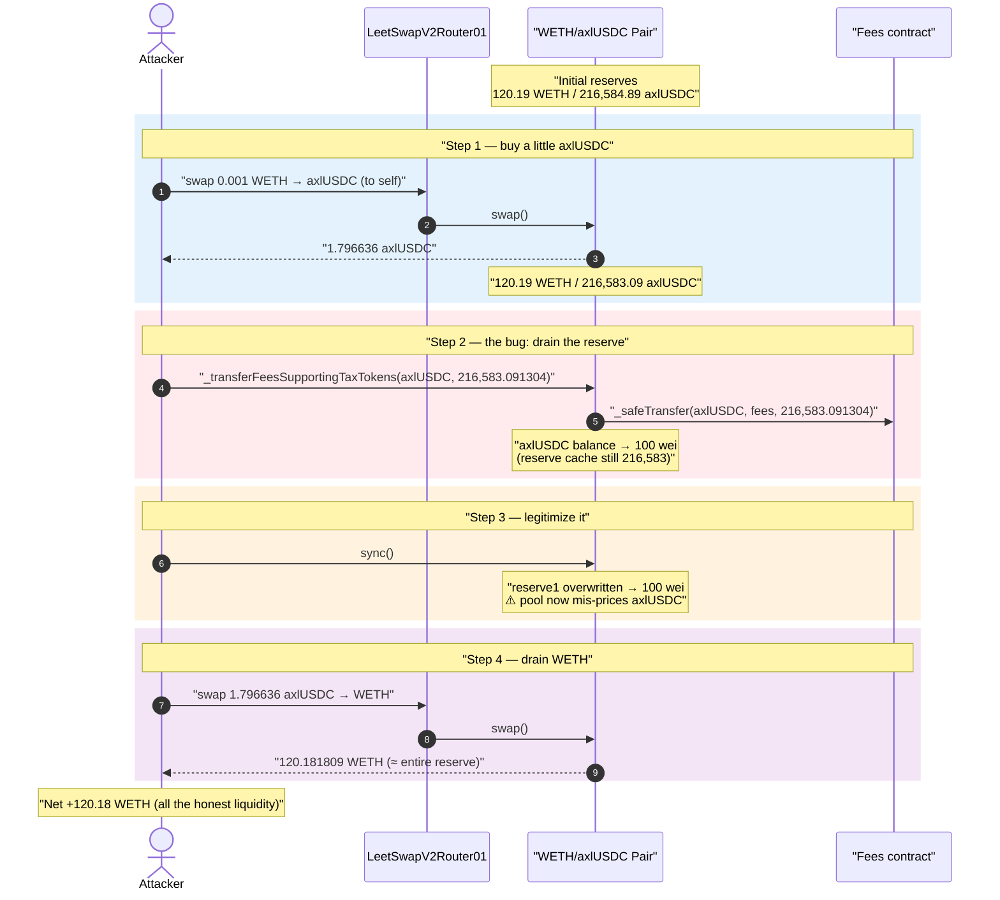
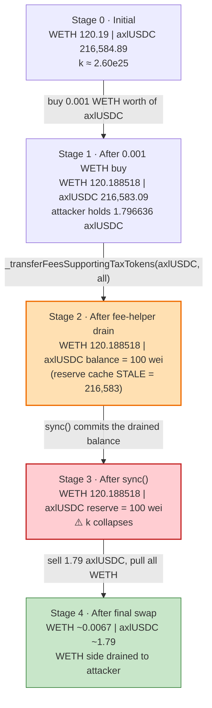
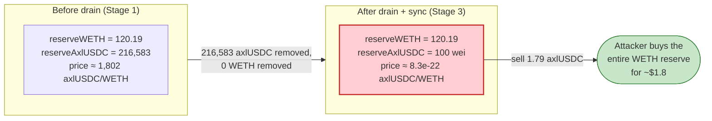

# LeetSwap V2 Exploit — Public `_transferFeesSupportingTaxTokens()` Drains the Pair's Reserves

> **Vulnerability classes:** vuln/access-control/broken-logic · vuln/logic/missing-check

> **Reproduction:** the PoC compiles & runs in this isolated Foundry project
> ([this folder](.)). Full verbose trace: [output.txt](output.txt).
> Verified vulnerable source: [LeetSwapV2Pair.sol](sources/LeetSwapV2Pair_94dac4/LeetSwapV2Pair.sol)
> (stored as Etherscan source-bundle JSON; the `LeetSwapV2Pair.sol` entry inside that file holds the pair code).

---

## Key info

| | |
|---|---|
| **Loss** | ~$630,000 — across all LeetSwap V2 pairs; this PoC drains **120.18 WETH** from the WETH/axlUSDC pair |
| **Vulnerable contract** | `LeetSwapV2Pair` — [`0x94dAC4a3Ce998143aa119c05460731dA80ad90cf`](https://basescan.org/address/0x94dac4a3ce998143aa119c05460731da80ad90cf#code) |
| **Victim pool (PoC)** | WETH/axlUSDC pair — `0x94dAC4a3Ce998143aa119c05460731dA80ad90cf` |
| **Router** | `LeetSwapV2Router01` — `0xfCD3842f85ed87ba2889b4D35893403796e67FF1` |
| **Attacker EOA** | `0x705f736145bb9d4a4a186f4595907b60815085c3` |
| **Attacker contract** | `0xea8f89f47f3d4293897b4fe8cb69b5c233b9f560` |
| **Attack tx** | [`0xbb837d417b76dd237b4418e1695a50941a69259a1c4dee561ea57d982b9f10ec`](https://basescan.org/tx/0xbb837d417b76dd237b4418e1695a50941a69259a1c4dee561ea57d982b9f10ec) |
| **Chain / block / date** | Base / 2,031,746 / July 31, 2023 |
| **Compiler** | Solidity v0.8.17, optimizer enabled, 200 runs |
| **Bug class** | Broken function visibility — internal accounting helper exposed as `public`, allowing permissionless reserve drain |

---

## TL;DR

`LeetSwapV2Pair` (a Solidly/Velodrome-style AMM fork) splits trading fees out of the pool by
transferring the fee amount to a separate `fees` contract. The helper that performs that transfer,
`_transferFeesSupportingTaxTokens(address token, uint256 amount)`, is declared **`public`** instead
of `internal` and has **no access control** ([LeetSwapV2Pair.sol](sources/LeetSwapV2Pair_94dac4/LeetSwapV2Pair.sol)):

```solidity
// Used to transfer fees when calling _update[01]
function _transferFeesSupportingTaxTokens(address token, uint256 amount)
    public                                   // ⚠️ should be internal
    returns (uint256)
{
    if (amount == 0) return 0;
    uint256 balanceBefore = IERC20(token).balanceOf(fees);
    _safeTransfer(token, fees, amount);      // ⚠️ moves ANY amount of ANY token out of the pair
    uint256 balanceAfter  = IERC20(token).balanceOf(fees);
    return balanceAfter - balanceBefore;
}
```

Anyone can call this and order the pair to ship its entire balance of one token to the `fees`
contract. By itself that does not move the pair's *cached* `reserve0/reserve1`, but the pair also
exposes a permissionless **`sync()`** that force-overwrites the reserves with the pair's *current
balances*. So the attacker:

1. Makes a tiny swap to acquire a small amount of token1 (axlUSDC) for themselves.
2. Calls `_transferFeesSupportingTaxTokens(axlUSDC, ~all of the pair's axlUSDC)` — moving the pool's
   entire axlUSDC reserve out to the `fees` contract, leaving the pair with **100 wei** of axlUSDC.
3. Calls `sync()` — the pair now believes `reserve1 = 100` wei of axlUSDC while still holding
   **120.19 WETH** of `reserve0`.
4. Swaps the small axlUSDC they bought back through the now-degenerate pool. Against a 100-wei
   reserve, a ~1.8M-unit axlUSDC input prices out at essentially the **entire WETH reserve**: the
   attacker receives **120.18 WETH** out for ~$2 of input.

Net: the attacker walks off with the pool's whole WETH side. Repeated across LeetSwap's pairs the
total loss was ~$630K; this PoC reproduces the WETH/axlUSDC pair drain for **+120.18 WETH**.

---

## Background — what LeetSwap V2 is

LeetSwap was a DEX on Base (and Canto), forked from the Solidly/Velodrome `Pair` design. Its
distinguishing feature versus vanilla Uniswap V2 is **fee segregation**: instead of leaving accrued
fees inside the reserves, the pair transfers each swap's fee out to a dedicated `LeetSwapV2Fees`
contract so LPs can claim them separately. That transfer is what
`_transferFeesSupportingTaxTokens` exists to do — it is meant to be an **internal** helper invoked
only from `_update0` / `_update1` during a swap ([LeetSwapV2Pair.sol](sources/LeetSwapV2Pair_94dac4/LeetSwapV2Pair.sol)):

```solidity
function _update0(uint256 amount) internal {
    ...
    amount = _transferFeesSupportingTaxTokens(token0, amount - _protocolFeesAmount);
    ...
}
```

The "SupportingTaxTokens" name signals its intent: it measures the balance delta after the transfer
so that fee-on-transfer ("tax") tokens, which deliver less than `amount`, are accounted correctly.
That is a perfectly reasonable internal routine — the bug is purely that it was published as a
`public` entry point.

On-chain state of the WETH/axlUSDC pair at the fork block (read from the trace):

| Parameter | Value |
|---|---|
| `token0` | WETH (`0x4200…0006`) |
| `token1` | axlUSDC (`0xEB46…5215`, 6 decimals) |
| `reserve0` (WETH) | 120.187521209079354818 WETH ← the prize |
| `reserve1` (axlUSDC) | 216,584.888040 axlUSDC |
| `fees` contract | `0xE659e3044B4720B4f107b12a45bcd9bc44A4AC02` |
| factory `isPaused()` | `false` |

---

## The vulnerable code

### 1. The fee helper is `public` and transfers arbitrary token amounts out

```solidity
function _transferFeesSupportingTaxTokens(address token, uint256 amount)
    public                                   // ⚠️ visibility bug
    returns (uint256)
{
    if (amount == 0) return 0;
    uint256 balanceBefore = IERC20(token).balanceOf(fees);
    _safeTransfer(token, fees, amount);      // pair → fees, no checks
    uint256 balanceAfter  = IERC20(token).balanceOf(fees);
    return balanceAfter - balanceBefore;
}
```

[LeetSwapV2Pair.sol](sources/LeetSwapV2Pair_94dac4/LeetSwapV2Pair.sol) — there is **no `msg.sender`
check, no `lock` modifier, and no `internal` keyword**. `token` and `amount` are fully
caller-controlled, so any external account can drain any token the pair holds to the `fees` address.

### 2. `sync()` blindly trusts the post-drain balance

```solidity
// force reserves to match balances
function sync() external lock {
    _update(
        IERC20Metadata(token0).balanceOf(address(this)),
        IERC20Metadata(token1).balanceOf(address(this)),
        reserve0,
        reserve1
    );
}
```

`sync()` is the standard Uniswap-V2 reserve-repair function. It assumes balances only change through
sanctioned paths (`mint`/`burn`/`swap`/donations). Once the fee helper has silently removed the
reserve, `sync()` is the second half of the exploit: it commits the artificially-low balance as the
new authoritative reserve.

### 3. The swap then prices against the corrupted reserve

```solidity
function _getAmountOut(uint256 amountIn, address tokenIn, uint256 _reserve0, uint256 _reserve1)
    internal view returns (uint256)
{
    ...
    // volatile path:
    (uint256 reserveA, uint256 reserveB) = tokenIn == token0 ? (_reserve0, _reserve1) : (_reserve1, _reserve0);
    return (amountIn * reserveB) / (reserveA + amountIn);
}
```

With `reserveA` (the axlUSDC reserve the attacker is selling into) reduced to **100 wei**, the term
`amountIn / (reserveA + amountIn)` is ≈ 1 for any non-trivial `amountIn`, so the swap returns
essentially the entire opposite reserve (`reserveB` = the full WETH side). The `swap()` invariant
check `_k(balance) >= _k(reserve)` passes because `reserve` is now the corrupted (tiny) value — the
pool's *belief* about its own size was already poisoned by `sync()`.

---

## Root cause — why it was possible

The single defect is **wrong function visibility**: an internal fee-accounting helper was compiled
as a `public` function. Everything else follows mechanically:

1. **Permissionless reserve removal.** `_transferFeesSupportingTaxTokens` lets anyone push the
   pair's holdings of an arbitrary token to the `fees` contract. The pair never checks that the
   caller is itself, nor that the move corresponds to a real fee event.
2. **A public, unguarded `sync()` legitimizes the theft.** After the balance is drained, `sync()`
   overwrites the cached reserve with the new (tiny) balance. The AMM's pricing is reserve-driven,
   so the "thinned" side now prices out the entire opposite reserve.
3. **No invariant protects against a one-sided reserve collapse.** The constant-product check only
   runs *inside* `swap()` and only compares against the (already poisoned) cached reserves; nothing
   detects that one reserve fell to dust while the other was untouched.

This is the same end-state as the BY-token "burn-from-pool + sync" class of bug — one side of the
pool is annihilated for free while the other side stays full, and the attacker buys the full side
with dust — but here the primitive that removes the reserve is a **mis-scoped fee transfer**, not a
burn.

---

## Preconditions

- The factory is not paused (`isPaused() == false` in the trace; note `swap()` checks this, but the
  fee helper and `sync()` do not).
- The target pair holds non-trivial reserves of both tokens (the WETH/axlUSDC pair held ~120 WETH).
- A tiny amount of working capital to (a) buy a small amount of token1 to sell back, and (b) pay
  gas. The PoC starts with **0.001 WETH** (`deal(WETH, this, 0.001 ether)`,
  [test/Leetswap_exp.sol:41](test/Leetswap_exp.sol#L41)) — i.e. the attack is essentially
  capital-free and trivially flash-loanable.

---

## Attack walkthrough (with on-chain numbers from the trace)

For this pair `token0 = WETH`, `token1 = axlUSDC`, so `reserve0 = WETH` and `reserve1 = axlUSDC`
(axlUSDC has 6 decimals). All figures are taken directly from the `Sync`/`Swap`/`Transfer` events in
[output.txt](output.txt).

| # | Step | WETH reserve (r0) | axlUSDC reserve (r1) | Effect |
|---|------|------------------:|---------------------:|--------|
| 0 | **Initial** | 120.187521 | 216,584.888040 | Honest pool. |
| 1 | **Swap 0.001 WETH → axlUSDC** to self (router `swapExact…SupportingFeeOnTransferTokens`) | 120.188518 | 216,583.091404 | Attacker now holds **1.796636 axlUSDC**; pair gains the 0.001 WETH. |
| 2 | **`_transferFeesSupportingTaxTokens(axlUSDC, 216,583.091304)`** — push the pair's entire axlUSDC (minus 100 wei) to the `fees` contract | 120.188518 *(stale)* | **balance → 100 wei** | Reserve cache still 216,583; real balance now 100 wei. |
| 3 | **`sync()`** | 120.188518 | **100 wei** | ⚠️ Reserve cache overwritten: pool now believes it has only 100 wei axlUSDC. `Sync(reserve0: 120.188518e18, reserve1: 100)`. |
| 4 | **Swap 1.796636 axlUSDC → WETH** through the degenerate pool | ~0.006709 | ~1.791347 | `getAmountOut` against `reserveA = 100` returns **120.181808815633580249 WETH**. Attacker receives the whole WETH side. |

The decisive line in the trace is the `Sync(reserve0: 120188518209079354818, reserve1: 100)`
([output.txt:147](output.txt#L147)) followed by `getAmountOut(1796636, axlUSDC) → 120181808815633580249`
([output.txt:173-176](output.txt#L173-L176)) and the matching
`Swap(... amount0Out: 120181808815633580249 ...)` ([output.txt:218](output.txt#L218)).

**Why 1.8M units of axlUSDC buys ~all the WETH:** the volatile-pool formula is
`out = amountIn·reserveB / (reserveA + amountIn)`. After `sync()`, `reserveA = 100` wei while
`amountIn = 1,796,636` units, so `amountIn / (reserveA + amountIn) = 1,796,636 / 1,796,736 ≈ 0.99994`
— the attacker is sold ≈99.99% of the entire 120.19 WETH reserve for ~$1.8 of axlUSDC.

### Profit accounting (WETH)

| Direction | Amount (WETH) |
|---|---:|
| Spent — seed capital | 0.001 |
| Received — final swap | 120.181809 |
| **Net profit** | **≈ +120.18 WETH** |

The PoC logs the attacker's ending balance directly:

```
Attacker WETH balance after exploit: 120.181808815633580249
```

That 120.18 WETH is essentially the pool's entire original 120.19 WETH reserve — the attacker walked
off with all the honest liquidity for the cost of 0.001 WETH plus gas. In the real incident the same
primitive was applied across LeetSwap's pairs for a combined ~$630K.

---

## Diagrams

### Sequence of the attack



### Pool state evolution



### The flaw: an internal helper exposed as `public`

```mermaid
flowchart TD
    subgraph Intended["Intended use (internal only)"]
        SW["swap()"] --> U0["_update0 / _update1"]
        U0 --> H1["_transferFeesSupportingTaxTokens()<br/>move fee slice → fees contract"]
    end

    subgraph Bug["Actual: also reachable directly"]
        EOA(["Any external caller"]) -->|"public, no auth, no lock"| H2["_transferFeesSupportingTaxTokens(token, amount)"]
        H2 --> Drain["_safeTransfer(token, fees, amount)<br/>⚠️ ships pair's reserve out"]
        Drain --> Sync["attacker calls sync()<br/>reserve cache := drained balance"]
        Sync --> Broken(["Reserve mispriced →<br/>buy full opposite side with dust"])
    end

    style H2 fill:#ffcdd2,stroke:#c62828,stroke-width:2px
    style Drain fill:#ffcdd2,stroke:#c62828,stroke-width:2px
    style Broken fill:#ffcdd2,stroke:#c62828,stroke-width:2px
```



### Why it is theft: constant-product before vs. after



---

## Why each step is needed

- **Step 1 (buy 0.001 WETH worth of axlUSDC):** the attacker needs *some* axlUSDC to sell back in
  step 4. It also conveniently leaves the pair's axlUSDC balance at a clean number to drain. Any
  small amount works; the profit comes from the mispricing, not the size of this input.
- **Step 2 (`_transferFeesSupportingTaxTokens`):** the core exploit primitive. It removes the pair's
  axlUSDC reserve without removing WETH and without going through `swap()`/`burn()`. The attacker
  leaves exactly **100 wei** behind (`balanceOf(Pair) - 100`,
  [test/Leetswap_exp.sol:51](test/Leetswap_exp.sol#L51)) just to keep the reserve non-zero so the
  later division `amountIn / (reserveA + amountIn)` stays well-defined.
- **Step 3 (`sync()`):** converts the silent balance change into a committed reserve change so the
  pricing function reads the tiny number.
- **Step 4 (sell axlUSDC):** with `reserveA = 100` wei, the standard x*y output formula returns
  ≈100% of the WETH side. The pool's invariant check passes because it compares against the
  poisoned reserve.

---

## Remediation

1. **Fix the visibility.** Change `_transferFeesSupportingTaxTokens` from `public` to `internal`.
   This single edit removes the external attack surface entirely — the helper can then only be
   reached from `_update0`/`_update1` inside `swap()`. This was the actual root cause and the actual
   on-chain fix.
2. **Add access control as defense-in-depth.** If a function must move pool funds, gate it to
   `msg.sender == address(this)` or an authorized router/keeper, and add the `lock` modifier so it
   cannot be composed reentrantly with `sync()`/`swap()`.
3. **Harden `sync()` against one-sided collapses.** `sync()` should not allow a reserve to be
   overwritten with a value drastically smaller than the cached reserve in a single call (e.g.
   revert if a reserve drops by more than a small percentage without a corresponding `burn`). Reserve
   repair should never silently bless a balance that fell to dust on only one side.
4. **Enforce the invariant against a stable baseline.** Pricing-relevant functions should validate
   `k` against a baseline that cannot be reset to an attacker-chosen value within the same
   transaction (e.g. a TWAP/oracle anchor), so that poisoning one reserve does not also poison the
   invariant check.
5. **Audit visibility on every fork.** Solidly/Velodrome forks repeatedly ship internal helpers with
   wrong visibility. Treat `public`/`external` functions that move funds or mutate reserves as
   high-risk and require explicit access control on each.

---

## How to reproduce

The PoC was extracted into a standalone Foundry project (the umbrella DeFiHackLabs repo has many
unrelated PoCs that fail to compile under a whole-project build):

```bash
_shared/run_poc.sh 2023-08-Leetswap_exp -vvvvv
```

- RPC: a **Base** archive endpoint is required (`foundry.toml` aliases `base = https://mainnet.base.org`)
  to serve historical state at fork block **2,031,746**.
- Result: `[PASS] testExploit()` with the attacker ending on **120.18 WETH** from a 0.001 WETH seed.

Expected tail:

```
Ran 1 test for test/Leetswap_exp.sol:ContractTest
[PASS] testExploit() (gas: 487385)
Logs:
  Attacker WETH balance after exploit: 120.181808815633580249

Suite result: ok. 1 passed; 0 failed; 0 skipped
```

---

*References: BlockSec (https://twitter.com/BlockSecTeam/status/1686217464051539968) and PeckShield
(https://twitter.com/peckshield/status/1686209024587710464) — LeetSwap, Base, ~$630K, July 31, 2023.*
