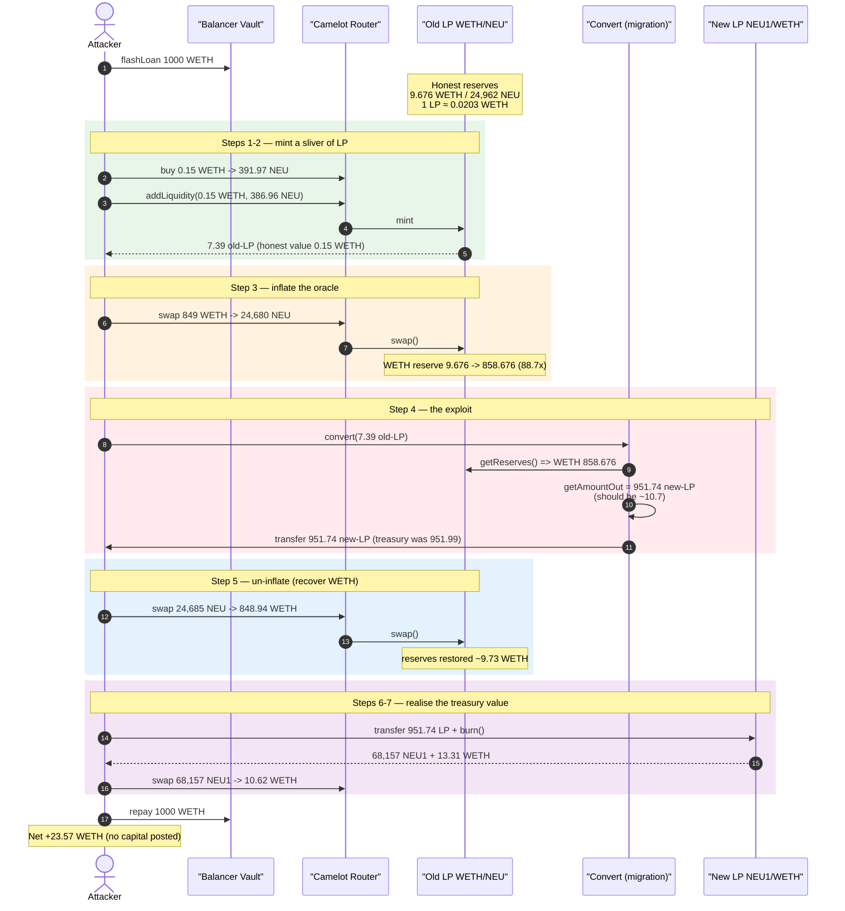
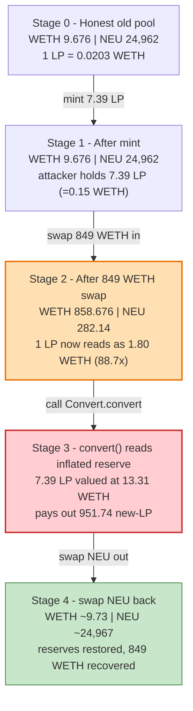
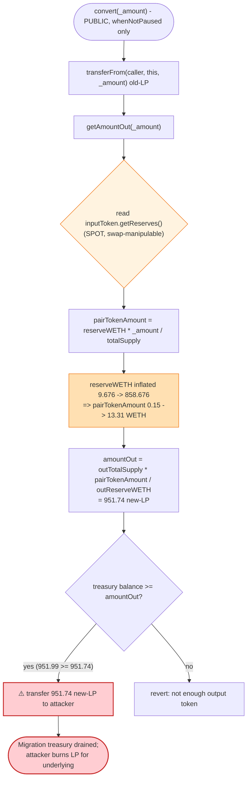
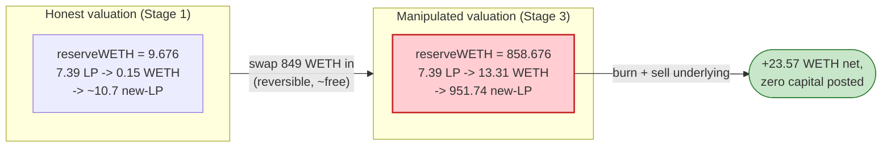

# Neutra Finance Exploit — `Convert.getAmountOut()` Prices LP by a Spot-Manipulable Reserve

> **Vulnerability classes:** vuln/oracle/spot-price · vuln/oracle/price-manipulation · vuln/governance/flash-loan-attack

> **Reproduction:** the PoC compiles & runs in an isolated Foundry project at
> [this project folder](.) (the umbrella DeFiHackLabs repo contains many
> unrelated PoCs that do not whole-compile, so this one was extracted).
> Full verbose trace: [output.txt](output.txt).
> Verified vulnerable source: [contracts_Convert.sol](sources/Convert_dbd3d6/contracts_Convert.sol).

---

## Key info

| | |
|---|---|
| **Loss** | ~$48K — attacker net **+23.57 WETH** intra-transaction (flash-loan funded, zero capital) |
| **Vulnerable contract** | `Convert` — [`0xdbd3d6040f87A9F822839Cb31195Ad25C2D0D54d`](https://arbiscan.io/address/0xdbd3d6040f87A9F822839Cb31195Ad25C2D0D54d#code) |
| **Drained asset** | The migration treasury of **new** LP tokens held by `Convert`: 951.74 of 951.99 `NEU1/WETH` Camelot LP (`0x2ea3CA79413C2EC4C1893D5f8C34C16acB2288A4`) |
| **Victim pools** | Old LP `WETH/NEU` — `0x65eBC8Cfd2aF1D659ef2405a47172830180Ba440` (price-manipulated); New LP `NEU1/WETH` — `0x2ea3CA79413C2EC4C1893D5f8C34C16acB2288A4` (drained via burn) |
| **Attacker EOA / contract** | `0x7FA9385bE102ac3EAc297483Dd6233D62b3e1496` (PoC test contract proxies the on-chain attacker) |
| **Flash-loan source** | Balancer Vault — `0xBA12222222228d8Ba445958a75a0704d566BF2C8` (1000 WETH, 0 fee) |
| **Reference tx** | `0x6301d4c9f7ac1c96a65e83be6ea2fff5000f0b1939ad24955e40890bd9fe6122` ([Phalcon](https://explorer.phalcon.xyz/tx/arbitrum/0x6301d4c9f7ac1c96a65e83be6ea2fff5000f0b1939ad24955e40890bd9fe6122)) |
| **Chain / fork block / date** | Arbitrum / 117,189,138 / Aug 2, 2023 |
| **Compiler** | `Convert` & both NEU tokens: Solidity v0.8.11, optimizer **1 run** |
| **Bug class** | Spot-price (reserve) manipulation feeding a token-migration valuation oracle |

---

## TL;DR

`Convert` is Neutra Finance's LP-migration contract. A user hands it **old** `WETH/NEU` LP
tokens and it pays back the equivalent number of **new** `NEU1/WETH` LP tokens from a treasury
it pre-holds. To decide "equivalent", `getAmountOut()`
([contracts_Convert.sol:36-55](sources/Convert_dbd3d6/contracts_Convert.sol#L36-L55)) values the
incoming LP **by reading the input pair's live `getReserves()`** — specifically the WETH-side
reserve — at the moment of the call:

```solidity
pairTokenAmount = reserves0 * _amount / inputTotalSupply;   // WETH backing the burned LP
...
return outputTotalSupply * pairTokenAmount / reserves3;     // → output-LP shares
```

That reserve is **spot state of a constant-product AMM** — it can be moved at will inside the
same transaction by a single swap. The attacker:

1. Flash-borrows **1000 WETH** from Balancer.
2. Buys a tiny amount of NEU and `addLiquidity()`s it, minting **7.39 old-LP** tokens (worth only
   **0.15 WETH** at honest reserves).
3. **Swaps 849 WETH into the old pool**, inflating its WETH reserve **9.68 → 858.68 WETH (≈ 88.7×)**.
4. Calls `convert(7.39 LP)`. Because the WETH reserve is now 88.7× larger, `getAmountOut` values
   the 7.39 LP at **13.31 WETH** instead of 0.15, and pays out **951.74 new-LP** tokens — virtually
   the entire migration treasury (951.99).
5. **Swaps the 849 WETH back out** (the pool is otherwise untouched, so this is a near round-trip:
   849.3 in, 848.94 out).
6. **Burns the 951.74 new-LP**, redeeming **68,157 NEU1 + 13.31 WETH**, then dumps the NEU1 for a
   further **10.62 WETH**.

Net result: the attacker walks off with the migration treasury's underlying value. Profit =
**+23.57 WETH** ([output.txt:46](output.txt#L46)), having posted no capital of its own.

---

## Background — what `Convert` does

Neutra Finance migrated its `NEU` token. Holders of the **old** Camelot LP
(`WETH/NEU`, address `0x65eB…Ba440`) were meant to swap it for **new** LP
(`NEU1/WETH`, address `0x2ea3…88A4`) at a fair, value-preserving rate. `Convert`
([source](sources/Convert_dbd3d6/contracts_Convert.sol)) is the migration teller:

- `inputToken` = the **old** `WETH/NEU` pair (LP token #0). `token0 = WETH`, `token1 = NEU`.
- `outputToken` = the **new** `NEU1/WETH` pair (LP token #1). `token0 = NEU1`, `token1 = WETH`.
- `pairToken` = `WETH` — the common asset used to express value across the two LPs.
- The contract is pre-funded with a treasury of **951.99 new-LP** tokens to pay migrators
  ([output.txt:15](output.txt#L15)).

`convert(_amount)` ([:27-34](sources/Convert_dbd3d6/contracts_Convert.sol#L27-L34)) pulls
`_amount` of old-LP from the caller, asks `getAmountOut()` how many new-LP that is worth, and
transfers that many new-LP back. It has **no access control beyond `whenNotPaused`** — anyone can
call it.

On-chain state at the fork block (read from the trace):

| Parameter | Value | Trace |
|---|---|---|
| Old-LP `WETH/NEU` reserves (honest) | **9.676 WETH** / 24,962.5 NEU | [L231](output.txt#L231) |
| Old-LP totalSupply | 476.77 | [L243](output.txt#L243) |
| New-LP `NEU1/WETH` reserves | 340,914.99 NEU1 / **66.56 WETH** | [L237](output.txt#L237) |
| New-LP totalSupply | 4,759.12 | [L247](output.txt#L247) |
| New-LP held by `Convert` (treasury) | **951.99** | [L227](output.txt#L227) |

The decisive fact: the old pool holds only **9.676 WETH** of real liquidity, yet `getAmountOut`
trusts that number — divided by `totalSupply` — as the per-share WETH value of the LP. Pushing the
pool's WETH reserve up by 849 WETH costs the attacker nothing net (the swap is reversible), but it
multiplies the apparent per-share value by ~88×.

---

## The vulnerable code

### `getAmountOut` reads live AMM reserves as a price oracle

```solidity
function convert(uint256 _amount) external whenNotPaused {
    inputToken.transferFrom(msg.sender, address(this), _amount);
    uint256 amountOut = getAmountOut(_amount);                       // ← valuation
    require(outputToken.balanceOf(address(this)) >= amountOut, "not enough output token");
    outputToken.transfer(msg.sender, amountOut);                     // ← pays treasury LP
    emit Converted(msg.sender, _amount, amountOut);
}

function getAmountOut(uint256 _amount) view public returns(uint256) {
    (uint256 reserves0, uint256 reserves1,,) = inputToken.getReserves();  // ⚠️ SPOT reserves
    uint256 inputTotalSupply = inputToken.totalSupply();

    uint256 pairTokenAmount;
    if (pairToken == inputToken.token0()) {
        pairTokenAmount = reserves0 * _amount / inputTotalSupply;    // WETH-value of burned LP
    } else {
        pairTokenAmount = reserves1 * _amount / inputTotalSupply;
    }

    (uint256 reserves2, uint256 reserves3,,) = outputToken.getReserves();
    uint256 outputTotalSupply = outputToken.totalSupply();

    if (pairToken == outputToken.token0()) {
        return outputTotalSupply * pairTokenAmount / reserves2;
    } else {
        return outputTotalSupply * pairTokenAmount / reserves3;      // → new-LP shares
    }
}
```

[contracts_Convert.sol:27-55](sources/Convert_dbd3d6/contracts_Convert.sol#L27-L55)

For this attack `pairToken == WETH == inputToken.token0()`, so the contract takes the **first**
branch: `pairTokenAmount = reserveWETH * _amount / inputTotalSupply`. `reserveWETH` is the live,
swappable reserve of the old pool — that is the oracle the attacker controls.

---

## Root cause — why it was possible

A Uniswap-V2 / Camelot pair's `getReserves()` is the **instantaneous** balance of the pool. It is
*not* a price; it is one input to a price, and it moves the instant anyone swaps. `Convert` treats
`reserveWETH / totalSupply` as the authoritative redemption value of an LP share, with **no
manipulation resistance whatsoever**:

> No TWAP, no oracle, no snapshot, no proof that the LP is actually redeemable for that much. The
> contract simply asks the pool "how much WETH is in you right now?" — and the attacker answers that
> question by depositing (and then withdrawing) 849 WETH.

The three design decisions that compose into the exploit:

1. **Spot reserve as the valuation source.** `getAmountOut` reads `inputToken.getReserves()` at call
   time. Because an AMM reserve is freely inflatable by an in-transaction swap, the per-share value
   `reserveWETH / totalSupply` is attacker-controlled. The honest value of the attacker's 7.39 LP was
   **0.15 WETH**; after the 849-WETH swap it read as **13.31 WETH** — an **88.7× inflation**.
2. **Permissionless, capital-free entry.** `convert()` is callable by anyone (only `whenNotPaused`),
   and the migrator does not have to be a long-term LP. The attacker mints fresh LP seconds before
   converting, so the valuation is applied to liquidity that did not exist a block earlier.
3. **The payout is real treasury value, not a 1:1 swap.** `Convert` holds 951.99 genuine new-LP
   tokens. Over-valuing the input LP lets the attacker withdraw essentially the whole treasury; those
   new-LP tokens are then `burn()`ed for their underlying NEU1 + WETH, which is liquid value.

The reserve inflation is *self-funding*: swapping 849 WETH into a thin pool and immediately swapping
the resulting NEU back out is a near round-trip (849.3 WETH in, 848.94 WETH out — the ~0.36 WETH gap
is just the 0.3% pool fee paid twice). So the manipulation costs almost nothing; the profit is the
treasury LP obtained in between.

---

## Preconditions

- `Convert` holds a non-trivial treasury of `outputToken` LP (951.99 new-LP here) — otherwise the
  `require(outputToken.balanceOf(this) >= amountOut)` guard reverts.
- The input pool is **thin in WETH** relative to the working capital available (9.676 WETH vs a
  1000-WETH flash loan), so a single swap can multiply its WETH reserve many-fold.
- Working capital to perform the inflating swap. It is fully recovered intra-transaction, so the
  attack is **flash-loanable** — the PoC borrows 1000 WETH from Balancer at zero fee
  ([NeutraFinance_exp.sol:297-303](test/NeutraFinance_exp.sol#L297-L303)).
- No oracle / TWAP / pause active on `Convert`.

---

## Attack walkthrough (with on-chain numbers from the trace)

All figures are taken directly from the `Sync`/`Swap` events and `console.log`s in
[output.txt](output.txt). Old-LP (`0x65eB…`): `token0 = WETH`, `token1 = NEU`. New-LP
(`0x2ea3…`): `token0 = NEU1`, `token1 = WETH`.

| # | Step | Old-pool WETH reserve | Old-pool NEU reserve | Effect |
|---|------|----------------------:|---------------------:|--------|
| 0 | **Flash-loan** 1000 WETH from Balancer | 9.376 | 24,967.6 | Zero-capital working balance. [L65-80](output.txt#L65) |
| 1 | **Buy** 0.15 WETH → 391.97 NEU (recipient = attacker) | 9.526 | 24,575.6 | Seed NEU to add liquidity with. [L110-151](output.txt#L110) |
| 2 | **addLiquidity** 0.15 WETH + 386.96 NEU → mint **7.39 old-LP** | 9.676 | 24,962.5 | Attacker now holds 7.39 LP, honest value 0.15 WETH. [L173-216](output.txt#L173) |
| 3 | **Swap 849 WETH → 24,680 NEU** (the inflation) | **858.676** | 282.14 | Old-pool WETH reserve inflated **88.7×**. [L254-298](output.txt#L254) |
| 4 | **`convert(7.39 LP)`** — values it at 13.31 WETH, pays out **951.74 new-LP** | 858.676 | 282.14 | Migration treasury drained (held 951.99). [L326-354](output.txt#L326) |
| 5 | **Swap 24,685 NEU → 848.94 WETH** (un-inflate) | 9.732 | 24,967.6 | Recovers the 849 WETH; pool restored. [L372-417](output.txt#L372) |
| 6 | **Burn 951.74 new-LP** → 68,157 NEU1 + 13.31 WETH | — | — | Redeem treasury LP for underlying. [L430-475](output.txt#L430) |
| 7 | **Swap 68,157 NEU1 → 10.62 WETH** | — | — | Liquidate the NEU1 leg. [L493-538](output.txt#L493) |
| 8 | **Repay** 1000 WETH to Balancer | — | — | Loan closed; keep the rest. [L559-566](output.txt#L559) |

### The valuation, verified to the wei

Inside `convert()` the contract reads old-LP reserves `WETH=858.676`, `totalSupply=476.77`, and
new-LP `WETH-side reserve=66.56`, `totalSupply=4759.12`:

```
pairTokenAmount = 858.676 * 7.39 / 476.77            = 13.3109 WETH   (honest would be 0.15)
amountOut       = 4759.12 * 13.3109 / 66.56          = 951.7355 new-LP
```

The computed `951.735531148986388193` matches the `Converted` event payout and the new-LP
`Transfer` in the trace **to the wei** ([L347-353](output.txt#L347)). At honest reserves the same
7.39 LP would have been valued at 0.15 WETH → ~10.7 new-LP. The 88.7× reserve inflation became an
~89× over-payout.

### Profit accounting (attacker WETH balance)

| Checkpoint | WETH balance | Δ |
|---|---:|---:|
| After flash-loan | 1000.000 | — |
| After swap 849 WETH → NEU (step 3) | 150.700 | −849.300 |
| After convert + swap NEU → WETH (steps 4-5) | 999.644 | +848.944 |
| After burning new-LP (step 6, +13.31 WETH) | 1012.951 | +13.307 |
| After swap NEU1 → WETH (step 7) | 1023.573 | +10.621 |
| **After repaying 1000 WETH (step 8)** | **23.573** | −1000.000 |

The inflating swap (steps 3 + 5) is a near-zero-cost round-trip (−849.300 then +848.944, a 0.356
WETH fee drag). **All real profit comes from the over-valued `convert()`**: 13.307 WETH (WETH leg of
the burned treasury LP) + 10.621 WETH (NEU1 leg sold) = 23.928, less dust/fees ⇒ **+23.573 WETH**
net ([output.txt:46](output.txt#L46)).

---

## Diagrams

### Sequence of the attack



### Old-pool reserve manipulation (the oracle being fooled)



### The flaw inside `getAmountOut`



### Why the valuation is theft: honest vs manipulated



---

## Why each magic number

- **Flash loan 1000 WETH:** working capital sized comfortably above the old pool's 9.676 WETH so
  the inflating swap dwarfs the existing reserve (849 ≫ 9.676). Repaid in full; profit is what
  remains after repayment.
- **0.15 WETH buy + addLiquidity → 7.39 LP:** the attacker only needs *some* old-LP to feed into
  `convert()`. The exact amount is unimportant because the valuation scales linearly with the
  inflated reserve — even a sliver of LP, valued at the manipulated price, exhausts the treasury.
- **Swap 849 WETH:** chosen so the post-swap WETH reserve (858.676) makes `951.74 new-LP ≤ 951.99`
  treasury — i.e. it extracts ~100% of the treasury while staying under the `require` guard. A
  larger swap would mint a payout exceeding the treasury and revert.
- **Burn the 951.74 new-LP:** converts the treasury LP tokens into their fungible underlying
  (68,157 NEU1 + 13.31 WETH); the NEU1 is then swapped to WETH so the entire profit is realised in
  the flash-loaned asset for repayment.

---

## Remediation

1. **Never price LP from spot reserves.** Replace `inputToken.getReserves()` in `getAmountOut` with
   a manipulation-resistant source: a Camelot/Uniswap **TWAP**, a Chainlink feed, or
   a fair-LP-value formula (e.g. `2 * sqrt(reserve0 * reserve1 * p0 * p1) / totalSupply` using
   *oracle* prices `p0,p1`, not pool reserves). Spot reserves are attacker-writable in a single tx.
2. **Use redemption value, not pool snapshot.** If the goal is "old LP → equivalent new LP", compute
   it from what the old LP would *actually* redeem for via `burn()` against the **time-weighted** or
   **oracle** price, not the instantaneous reserve, which can be inflated and reverted within one
   transaction.
3. **Reject just-minted liquidity / add a holding period.** Migrators should not be able to mint LP
   in the same block they convert. A minimum LP age or a snapshot of eligible balances taken before
   the migration window opens removes the "mint → inflate → convert → un-mint" loop.
4. **Cap per-call and total payout.** Bound `amountOut` to a sane fraction of the treasury and to a
   sane multiple of the caller's historical LP share, so a single mispriced call cannot drain the
   whole treasury even if the oracle is briefly wrong.
5. **Pause is not enough.** `whenNotPaused` only helps after the team notices; the fix must be in the
   pricing, not in reactive controls.

---

## How to reproduce

The PoC was extracted into a standalone Foundry project (the umbrella DeFiHackLabs repo has many
unrelated PoCs that fail to compile under a whole-project `forge build`):

```bash
_shared/run_poc.sh 2023-08-NeutraFinance_exp -vvvvv
```

- RPC: an **Arbitrum archive** endpoint is required — the fork pins block 117,189,138, whose
  historical state most public Arbitrum RPCs have pruned (they fail with `header not found` /
  `missing trie node`). `foundry.toml` should point `arbitrum` at an archive provider.
- Result: `[PASS] test()` with the attacker's final WETH balance `23572628500527017010` (≈ 23.57
  WETH) after repaying the 1000-WETH flash loan.

Expected tail:

```
Ran 1 test for test/NeutraFinance_exp.sol:CounterTest
[PASS] test() (gas: 735176)
Logs:
  ...
  refund flashloan
  Attacker's WETH token balance:  23572628500527017010

Suite result: ok. 1 passed; 0 failed; 0 skipped; finished in 17.01s
```

---

*References: PoC analysis — https://twitter.com/phalcon_xyz/status/1686654241111429120 ;
reference tx on Phalcon — https://explorer.phalcon.xyz/tx/arbitrum/0x6301d4c9f7ac1c96a65e83be6ea2fff5000f0b1939ad24955e40890bd9fe6122 .
Neutra Finance (NEU migration), Arbitrum, Aug 2023.*
