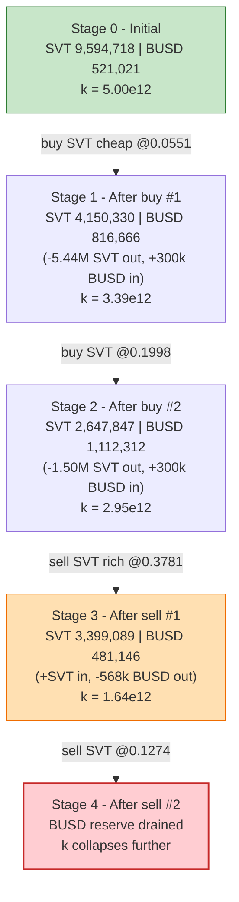
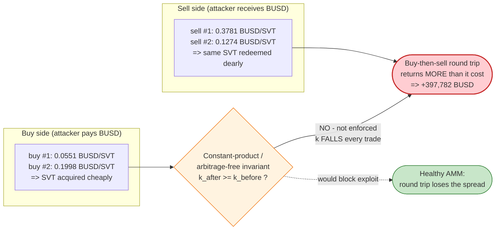

# SVT Exploit — Broken AMM Pricing Round-Trip Drain (flash-loan funded)

> **Vulnerability classes:** vuln/oracle/price-manipulation · vuln/logic/price-calculation

> **Reproduction:** the PoC compiles & runs in an isolated Foundry project at
> [this project folder](.) (the umbrella DeFiHackLabs repo contains many unrelated PoCs
> that do not whole-compile, so this one was extracted).
> Full verbose trace: [output.txt](output.txt).
> **Caveat — unverified victim:** the SVT token and the SVT trading pool are **unverified
> on BscScan**, so no Solidity source could be downloaded for them. The only verified
> sources present are the DODO flash-loan provider ([DPPOracle.sol](sources/DPPOracle_FeAFe2/DPPOracle.sol))
> and BUSD ([BEP20USDT.sol](sources/BEP20USDT_55d398/BEP20USDT.sol)). The victim's bug is
> therefore reconstructed from on-chain trace behavior (reserve reads, swap outputs, the
> constant-product `k` it leaks), not from its source.

---

## Key info

| | |
|---|---|
| **Loss** | **≈ 397,782 BUSD** profit to the attacker, drained from the SVT/BUSD pool's BUSD reserve |
| **Vulnerable contract** | SVT trading pool — [`0x2120F8F305347b6aA5E5dBB347230a8234EB3379`](https://bscscan.com/address/0x2120F8F305347b6aA5E5dBB347230a8234EB3379) (unverified) |
| **Victim token** | SVT — [`0x657334B4FF7bDC4143941B1F94301f37659c6281`](https://bscscan.com/address/0x657334B4FF7bDC4143941B1F94301f37659c6281) (unverified) |
| **Quote asset / loan** | BUSD-T (BSC-USD) — [`0x55d398326f99059fF775485246999027B3197955`](https://bscscan.com/address/0x55d398326f99059fF775485246999027B3197955) |
| **Flash-loan source** | DODO DPPOracle (D3MM) — [`0xFeAFe253802b77456B4627F8c2306a9CeBb5d681`](https://bscscan.com/address/0xFeAFe253802b77456B4627F8c2306a9CeBb5d681) |
| **Tax / treasury sink** | `0xF037A9F7e7eE68A011AB3E4FA8667DD350370B04` (receives SVT + BUSD "fees") |
| **Attack tx** | [`0xf2a0c957fef493af44f55b201fbc6d82db2e4a045c5c856bfe3d8cb80fa30c12`](https://bscscan.com/tx/0xf2a0c957fef493af44f55b201fbc6d82db2e4a045c5c856bfe3d8cb80fa30c12) |
| **Chain / fork block / date** | BSC / 31,178,238 (PoC forks block − 1 = 31,178,237) / Aug 2023 |
| **Compiler (provider)** | DPPOracle v0.6.9 (opt 1/200); BUSD v0.5.16; PoC under Solc 0.8.34 |
| **Bug class** | Broken / non-constant-product AMM pricing — asymmetric buy vs. sell price enables a profitable round-trip that drains the quote reserve |
| **Analysis ref** | https://twitter.com/Phalcon_xyz/status/1695285435671392504 |

---

## TL;DR

The SVT pool at `0x2120…` is a custom AMM exposing `buy(uint256 busdAmount)` and
`sell(uint256 svtAmount)`. Its pricing does **not preserve a constant product** — buying SVT
is cheap and selling SVT back is rich, for the *same* pool state region. The attacker:

1. Flash-borrows **600,296.10 BUSD** from DODO's DPPOracle (`flashLoan`).
2. **Buys SVT twice** (two `buy()` calls of ~300,148 BUSD each), acquiring **6,946,871 SVT**
   at an effective price of only **0.055 → 0.200 BUSD/SVT**.
3. **Sells SVT twice** (`sell(1,502,483)` then `sell(3,375,520)`), receiving **998,078.59 BUSD**
   at a far higher effective price (**0.378 then 0.127 BUSD/SVT**).
4. Repays the 600,296.10 BUSD flash loan.

Net: **+397,782.49 BUSD**, taken straight out of the pool's BUSD reserve. The pool's
constant-product invariant `k = reserveSVT · reserveBUSD` visibly collapses from
**5.00e12 → 1.64e12** across the four trades — that leakage *is* the stolen value.

---

## Background — the actors

- **DODO DPPOracle (D3MM, `0xFeAFe…`)** is an unrelated, healthy DODO Private Pool. The attacker
  only uses it as a **fee-free flash-loan tap**: `flashLoan()` hands out the requested BUSD,
  calls back `DPPFlashLoanCall`, and at the end requires the borrowed amount be returned
  ([DPPOracle.sol:1195-1278](sources/DPPOracle_FeAFe2/DPPOracle.sol#L1195-L1278)). DODO is not the
  victim; it is the lender.
- **SVT token (`0x6573…`)** is a tax token: every transfer routed through the pool also skims
  a fee to the treasury `0xF037…` (visible as `Transfer(pool → 0xF037…)` of both SVT and BUSD in
  the trace). The tax does **not** protect the pool — it is taken on top, and the attacker's
  buy cost basis is irrelevant because there is no profit-tax gate on the BUSD side.
- **SVT pool (`0x2120…`)** is the victim. It holds the SVT and BUSD reserves and implements the
  faulty `buy`/`sell` pricing.

### On-chain pool state at the fork block (read from the trace)

| Reserve | Amount |
|---|---:|
| SVT held by the pool (before first buy) | **9,594,718.10 SVT** |
| BUSD held by the pool (before first buy) | **521,020.64 BUSD** |
| Implied mid-price (BUSD/SVT) | **≈ 0.0543** |
| Constant product `k` (start) | **≈ 5.00 × 10¹²** |

---

## The "vulnerable code"

The SVT pool is unverified, so the exact Solidity is unavailable. What the trace proves
mechanically about its `buy()` / `sell()` is:

1. **`buy(busdAmount)`** pulls `busdAmount` of BUSD from the caller
   (`transferFrom(attacker → pool)`), then `transfer`s SVT out to the caller. The amount of SVT
   returned is computed from an internal price that is **far too generous** relative to what the
   pool would charge to sell that same SVT back.
2. **`sell(svtAmount)`** pulls `svtAmount` of SVT from the caller, then `transfer`s BUSD out — at
   a price per SVT that is **several times higher** than the price the same pool just sold SVT for.
3. Both paths additionally route a tax skim to `0xF037…`.

The defect is therefore an **invariant violation**: a correct constant-product (or any
arbitrage-free) AMM must guarantee that an immediate buy-then-sell round trip returns *less*
than it cost (you pay the spread/fee). Here the round trip returns *more*. The product `k` of the
reserves, which a Uniswap-style pool keeps non-decreasing, instead **decreases on every trade**:

| State (from `balanceOf` reads in [output.txt](output.txt)) | reserve SVT | reserve BUSD | mid BUSD/SVT | product `k` |
|---|---:|---:|---:|---:|
| before `buy #1` | 9,594,718 | 521,021 | 0.0543 | **5.00e12** |
| before `buy #2` | 4,150,330 | 816,666 | 0.1968 | 3.39e12 |
| before `sell #1` | 2,647,847 | 1,112,312 | 0.4201 | 2.95e12 |
| before `sell #2` | 3,399,089 | 481,146 | 0.1416 | **1.64e12** |

A monotonically falling `k` is the signature of an AMM that lets value leak out — exactly the
quantity the attacker extracts.

For contrast, the **lender** behaves correctly: DODO's flashLoan enforces repayment with the
standard balance check
([DPPOracle.sol:1208-1215](sources/DPPOracle_FeAFe2/DPPOracle.sol#L1208-L1215)):

```solidity
uint256 baseBalance  = _BASE_TOKEN_.balanceOf(address(this));
uint256 quoteBalance = _QUOTE_TOKEN_.balanceOf(address(this));
// no input -> pure loss
require(
    baseBalance >= _BASE_RESERVE_ || quoteBalance >= _QUOTE_RESERVE_,
    "FLASH_LOAN_FAILED"
);
```

---

## Root cause

**The SVT pool's `buy` and `sell` prices are asymmetric and not bound by a preserved
invariant.** Buying SVT moves the price up far less than selling the same SVT moves it down (or
the buy/sell sides read from inconsistent price sources), so an attacker who buys then immediately
sells extracts the pool's BUSD reserve.

Concretely, the four design failures that compose into a critical bug:

1. **No constant-product / arbitrage-free guarantee.** The pool does not enforce
   `reserveSVT · reserveBUSD ≥ k_before` (or any equivalent monotone invariant) across a trade.
   Buying SVT cheaply does not make subsequent buying proportionally more expensive in a way that
   closes the loop, so a buy-then-sell round trip is profitable.
2. **Buy price ≪ sell price for the same state.** Buy #1 fills SVT at **0.0551 BUSD/SVT**;
   Sell #1 fills SVT at **0.3781 BUSD/SVT** — a ~6.8× round-trip price improvement that should be
   impossible in a healthy AMM (it would require the price to *rise* after the buy and *stay* high
   through the sell).
3. **Permissionless trade entry points.** `buy()` and `sell()` are callable by anyone, so the
   attacker chooses the size and ordering that maximizes extraction.
4. **Flash-loan-sized capital is free.** Because the entire attack is atomic and self-funding, the
   attacker needs no capital of its own — a 600k-BUSD flash loan from an unrelated pool (DODO)
   supplies the working capital, and is repaid within the same transaction.

The SVT transfer tax (to `0xF037…`) is **not a defense**: it is skimmed on top of the trade and
does not re-price the round trip toward the pool's favor. The trace shows the tax leaving the pool
(reducing the pool's own reserves further), so it actually worsens the pool's position rather than
clawing value back.

---

## Preconditions

- The SVT pool holds meaningful BUSD reserves (here **521,021 BUSD** initially, rising to over
  **1.1M BUSD** mid-attack as the attacker's buy-side BUSD is added before being pulled back out).
- `buy()` / `sell()` are open to any caller (they are — the PoC calls them directly).
- Access to atomic working capital. The attacker uses a **fee-free DODO flash loan** of
  **600,296.10 BUSD**; any flash-loan source of BUSD would do. The whole attack is one transaction,
  so no own capital and no price-risk exposure.

---

## Step-by-step attack walkthrough (with on-chain numbers from the trace)

The pool's `token0 = SVT`, `token1 = BUSD`. All figures are taken directly from `balanceOf`
reads and `Transfer` events in [output.txt](output.txt).

| # | Step (trace line) | reserve SVT | reserve BUSD | Attacker BUSD Δ | Effect |
|---|---|---:|---:|---:|---|
| 0 | **Flash loan** — `D3MM.flashLoan(0, 600,296.10 BUSD)` → attacker ([output.txt:1587-1593](output.txt)) | 9,594,718 | 521,021 | +600,296.10 | Working capital acquired (must be repaid). |
| 1 | **buy #1** — `pool.buy(300,148.06 BUSD)` ([:1597-1624](output.txt)). Pays 300,148.06 BUSD, receives **5,444,387.82 SVT** @ 0.0551 | 4,150,330 | 816,666 | −300,148.06 | Bought 56.7% of pool SVT for 57.6% of pool BUSD — far too much SVT. |
| 2 | **buy #2** — `pool.buy(300,148.06 BUSD)` ([:1627-1654](output.txt)). Pays 300,148.06 BUSD, receives **1,502,483.44 SVT** @ 0.1998 | 2,647,847 | 1,112,312 | −300,148.06 | Now holds **6,946,871 SVT**; pool BUSD reserve inflated to 1.11M. |
| 3 | **sell #1** — `pool.sell(1,502,483.44 SVT)` ([:1661-1697](output.txt)). Receives **568,049.38 BUSD** @ 0.3781 | 3,399,089 | 481,146 | +568,049.38 | Sells back at ~6.8× the buy price; pulls 568k BUSD out. SVT tax 751,241 + BUSD tax 63,116 skim to `0xF037`. |
| 4 | **sell #2** — `pool.sell(3,375,520.45 SVT)` ([:1700-1736](output.txt)). Receives **430,029.21 BUSD** @ 0.1274 | (drained) | (drained) | +430,029.21 | Dumps most of the remaining SVT; pulls another 430k BUSD. SVT tax 1,687,760 + BUSD tax 47,781 skim to `0xF037`. |
| 5 | **Repay** — `transfer(D3MM, 600,296.10 BUSD)` ([:1737-1742](output.txt)) | — | — | −600,296.10 | Flash loan returned; DODO whole. |
| 6 | **End** — attacker BUSD balance ([:1754-1756](output.txt)) | — | — | **397,782.49** | Net profit. |

Note: the attacker does **not** sell all 6,946,871 SVT — the PoC sells `svtBalance2`
(1,502,483) then 62% of the remaining balance (3,375,520), leaving ~2.07M SVT in hand. It is still
hugely profitable purely because **the buy price was a fraction of the sell price.**

### Why each magic number

- **`flash_amount = 600,296.10 BUSD`** — the entire BUSD balance of the DODO DPPOracle at the
  fork block (read via `BUSD.balanceOf(dodo)` in [SVT_exp.sol:36](test/SVT_exp.sol#L36)); simply
  "borrow everything available" to maximize the trade size.
- **Two `buy(amount/2)` calls** — split into halves
  ([SVT_exp.sol:45-47](test/SVT_exp.sol#L45-L47)) to stay within the pool's per-trade pricing
  envelope and to harvest SVT before the price has fully reacted.
- **`sell(svtBalance2)` then `sell(62% of balance)`** ([SVT_exp.sol:52-53](test/SVT_exp.sol#L52-L53))
  — sized so the BUSD pulled out comfortably exceeds the flash-loan repayment; the leftover SVT is
  not worth dumping into the now-thinner pool.

---

## Profit / loss accounting (BUSD)

| Direction | Amount (BUSD) |
|---|---:|
| Borrowed (flash loan) | 600,296.10 |
| Spent — buy #1 | 300,148.06 |
| Spent — buy #2 | 300,148.06 |
| **Total spent on buys** | **600,296.11** |
| Received — sell #1 | 568,049.38 |
| Received — sell #2 | 430,029.21 |
| **Total received from sells** | **998,078.59** |
| Net from trades (received − spent) | +397,782.48 |
| Flash loan repaid | −600,296.10 |
| **Final attacker BUSD (profit)** | **397,782.49** |

The profit equals the net trade gain to the wei — the attacker walked off with ~397.8k BUSD of the
pool's quote reserve, funded entirely by a flash loan that left DODO whole.

---

## Diagrams

### Sequence of the attack

```mermaid
sequenceDiagram
    autonumber
    actor A as "Attacker contract"
    participant D as "DODO DPPOracle (D3MM)"
    participant P as "SVT pool (0x2120)"
    participant T as "SVT token (0x6573)"
    participant F as "Treasury 0xF037"

    Note over P: "Initial reserves<br/>9,594,718 SVT / 521,021 BUSD<br/>k ≈ 5.00e12"

    rect rgb(227,242,253)
    Note over A,D: "Step 0 — free working capital"
    A->>D: "flashLoan(0, 600,296.10 BUSD)"
    D-->>A: "600,296.10 BUSD"
    D->>A: "DPPFlashLoanCall(...)"
    end

    rect rgb(255,243,224)
    Note over A,P: "Steps 1-2 — buy SVT cheap"
    A->>P: "buy(300,148.06 BUSD)"
    P-->>A: "5,444,387.82 SVT  (@0.0551)"
    A->>P: "buy(300,148.06 BUSD)"
    P-->>A: "1,502,483.44 SVT  (@0.1998)"
    Note over P: "2,647,847 SVT / 1,112,312 BUSD"
    end

    rect rgb(255,235,238)
    Note over A,F: "Steps 3-4 — sell SVT rich (drain)"
    A->>P: "sell(1,502,483.44 SVT)"
    P-->>A: "568,049.38 BUSD  (@0.3781)"
    P-->>F: "tax: 751,241 SVT + 63,116 BUSD"
    A->>P: "sell(3,375,520.45 SVT)"
    P-->>A: "430,029.21 BUSD  (@0.1274)"
    P-->>F: "tax: 1,687,760 SVT + 47,781 BUSD"
    Note over P: "BUSD reserve drained; k ≈ 1.64e12"
    end

    rect rgb(232,245,233)
    Note over A,D: "Step 5 — repay, keep the rest"
    A->>D: "transfer(600,296.10 BUSD)"
    end
    Note over A: "Net +397,782.49 BUSD"
```

### Pool state evolution (constant product collapses)



### The flaw: asymmetric pricing makes the round trip profitable



---

## Remediation

1. **Enforce a preserved invariant on every trade.** Whatever pricing curve the pool uses, it must
   guarantee that a trade cannot *lower* the value of the reserves to the LP — e.g. assert
   `reserveSVT · reserveBUSD ≥ k_before` (constant product) or the equivalent for the chosen
   curve, *after* fees. A buy-then-sell round trip must always lose the spread, never gain.
2. **Make buy and sell read the same price state.** Asymmetric quoting (buy cheap / sell rich for
   the same reserves) is the core defect. Both directions must derive from one consistent reserve
   state updated atomically after each trade, so the price the buy moved is the price the sell sees.
3. **Re-sync reserves from real balances and validate them.** After pulling tokens in and pushing
   tokens out, recompute reserves from `balanceOf` and revert if the post-trade invariant is
   violated (the pattern DODO itself uses in `_sync()` /
   [flashLoan repayment check](sources/DPPOracle_FeAFe2/DPPOracle.sol#L1208-L1215)).
4. **Add slippage / per-trade size caps.** A single trade that moves a reserve by tens of percent
   (here ~57% of SVT in one buy) should be bounded or revert, limiting any residual mispricing.
5. **Do not rely on a transfer tax as economic protection.** The SVT tax skim does not protect the
   pool; it leaves the reserves and worsens the LP position. Security must come from the invariant,
   not from a fee.

---

## How to reproduce

The PoC was extracted into a standalone Foundry project (the umbrella DeFiHackLabs repo has many
unrelated PoCs that fail to compile under a whole-project `forge build`):

```bash
_shared/run_poc.sh 2023-08-SVT_exp -vvvvv
```

- RPC: a **BSC archive** endpoint is required (fork block 31,178,237). Public pruning nodes will
  fail with `header not found` / `missing trie node`.
- The SVT pool and token are unverified, so the trace shows them only by address; the exploit is
  fully observable through reserve reads and `Transfer` events.

Expected tail:

```
Ran 1 test for test/SVT_exp.sol:ContractTest
[PASS] testExploit() (gas: 444795)
Logs:
  1502483441628337913437563
  5444387820287775099483383
  [End] Attacker BUSD balance after exploit: 397782.487378557372144034

Suite result: ok. 1 passed; 0 failed; 0 skipped
```

---

*References: Phalcon analysis — https://twitter.com/Phalcon_xyz/status/1695285435671392504 ·
DeFiHackLabs (SVT, BSC, Aug 2023).*
