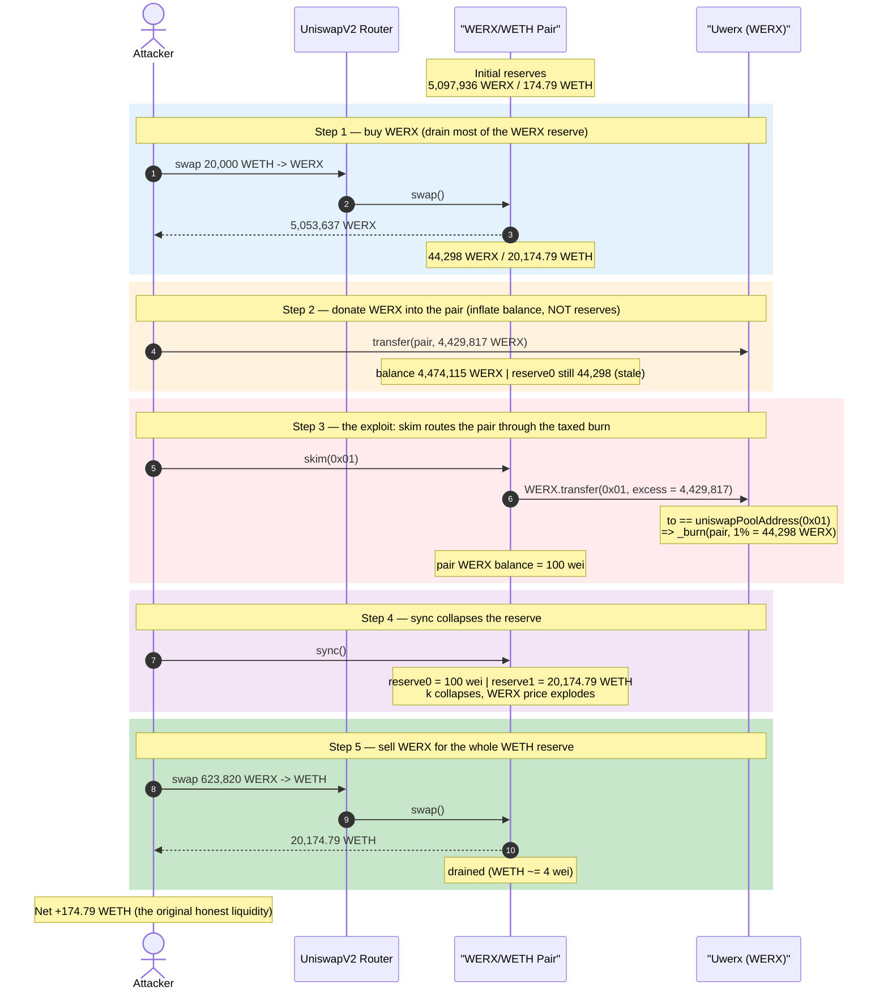
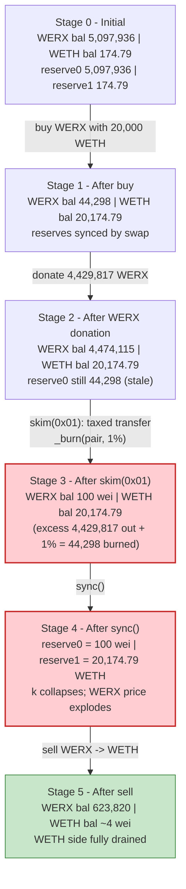
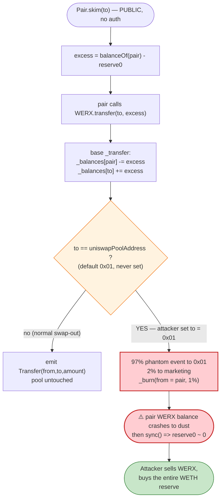

# Uwerx (WERX) Exploit — Burn-on-Transfer-to-Pool + `skim()` Reserve Collapse

> **Vulnerability classes:** vuln/defi/slippage · vuln/logic/state-update

> **Reproduction:** the PoC compiles & runs in an isolated Foundry project at
> [this project folder](.) (the umbrella DeFiHackLabs repo contains many unrelated
> PoCs that do not compile under a single `forge build`, so this one was extracted).
> Full verbose trace: [output.txt](output.txt).
> Verified vulnerable source: [Uwerx.sol](sources/Uwerx_4306B1/Uwerx.sol),
> [UniswapV2Pair.sol](sources/UniswapV2Pair_a41529/UniswapV2Pair.sol).

One-line summary: a deflationary fee-on-transfer token burns 1% of *any* transfer
whose recipient is its (unset, default `0x01`) "uniswap pool" address; calling the
Uniswap-V2 pair's permissionless `skim(0x01)` routes the pair's own excess tokens
through that taxed path, **burning tokens out of the pair's balance**, after which
`sync()` collapses the WERX reserve to dust and the attacker drains all the WETH.

---

## Key info

| | |
|---|---|
| **Loss** | **174.79 WETH** profit (the pool's entire ~174.79 WETH of honest liquidity; ~$320K at the time, "~176 ETH" in the PoC header) |
| **Vulnerable contract** | `Uwerx` (WERX) — [`0x4306B12F8e824cE1fa9604BbD88f2AD4f0FE3c54`](https://etherscan.io/token/0x4306b12f8e824ce1fa9604bbd88f2ad4f0fe3c54#code) |
| **Victim pool** | WERX/WETH UniswapV2 pair — [`0xa41529982BcCCDfA1105C6f08024DF787CA758C4`](https://etherscan.io/address/0xa41529982BcCCDfA1105C6f08024DF787CA758C4) |
| **Attacker EOA** | [`0x6057a831d43c395198a10cf2d7d6d6a063b1fce4`](https://etherscan.io/address/0x6057a831d43c395198a10cf2d7d6d6a063b1fce4) |
| **Attacker contract** | [`0xda2ccfc4557ba55eada3cbebd0aeffcf97fc14ca`](https://etherscan.io/address/0xda2ccfc4557ba55eada3cbebd0aeffcf97fc14ca) |
| **Attack tx** | [`0x3b19e152943f31fe0830b67315ddc89be9a066dc89174256e17bc8c2d35b5af8`](https://etherscan.io/tx/0x3b19e152943f31fe0830b67315ddc89be9a066dc89174256e17bc8c2d35b5af8) |
| **Chain / block / date** | Ethereum mainnet / fork block 17,826,202 / Aug 2, 2023 |
| **Compiler** | Token: Solidity v0.8.17, optimizer off (200 runs metadata); PoC built with solc 0.8.34 |
| **Bug class** | Fee-on-transfer / deflationary-token logic error → AMM constant-product invariant break via `_burn(pool)` + `skim`/`sync` |

---

## TL;DR

`Uwerx` is a standard OpenZeppelin ERC20 with one bolted-on "feature": inside
`_transfer`, whenever the **recipient equals `uniswapPoolAddress`**, it taxes the
transfer 97% / 2% / 1% — the 1% is `_burn(from, …)`
([Uwerx.sol:489-500](sources/Uwerx_4306B1/Uwerx.sol#L489-L500)).

Two fatal facts combine:

1. **`uniswapPoolAddress` was never set** to the real pair. It stayed at its
   constructor default `0x0000000000000000000000000000000000000001`
   ([Uwerx.sol:269-270](sources/Uwerx_4306B1/Uwerx.sol#L269-L270)). So the magic
   "tax + burn" branch triggers for **any** transfer to `0x01`.
2. **The Uniswap-V2 pair's `skim(to)` is permissionless** and does a raw token
   transfer of the pair's *excess* balance to an attacker-chosen `to`
   ([UniswapV2Pair.sol:485-490](sources/UniswapV2Pair_a41529/UniswapV2Pair.sol#L485-L490)).

The attacker chooses `to = 0x01`. Now `skim` makes the *pair* call
`WERX.transfer(0x01, excess)`, which hits the taxed branch and **`_burn`s 1% out
of the pair's own balance**. Because the attacker first inflated the pair's WERX
balance to a huge "excess" via a donation, that 1% burn equals ~100% of what
remains, and a follow-up `sync()` snaps the pair's `reserve0` (WERX) down to **100
wei** while the WETH reserve is untouched. The attacker then sells back the WERX
they bought earlier and walks off with the **entire 174.79 WETH** in the pool.

---

## Background — what `Uwerx` does

`Uwerx` ([source](sources/Uwerx_4306B1/Uwerx.sol)) is OpenZeppelin v4.x ERC20 +
`ERC20Burnable` + `Ownable`, total supply 750,000,000 WERX. The only non-standard
code is the recipient-tax block inside `_transfer`:

```solidity
// Uwerx.sol  (inside ERC20._transfer, after the normal balance moves)
unchecked {
    _balances[from] = fromBalance - amount;
    _balances[to]  += amount;                 // ← full `amount` already credited to `to`
}
if (to == uniswapPoolAddress) {               // ← branch keyed on the RECIPIENT
    uint256 userTransferAmount = (amount * 97) / 100;
    uint256 marketingAmount    = (amount * 2) / 100;
    uint256 burnAmount         = amount - userTransferAmount - marketingAmount; // 1%

    emit Transfer(from, to, userTransferAmount);             // phantom event (97%)
    emit Transfer(from, marketingWalletAddress, marketingAmount); // phantom event (2%)
    _burn(from, burnAmount);                                 // ⚠️ burns 1% FROM the sender
} else {
    emit Transfer(from, to, amount);
}
```

Two owner setters control the magic addresses
([Uwerx.sol:282-288](sources/Uwerx_4306B1/Uwerx.sol#L282-L288)):

```solidity
function setUniswapPoolAddress(address _uniswapPoolAddress) external onlyOwner { uniswapPoolAddress = _uniswapPoolAddress; }
function setMarketingWallet(address _marketingWalletAddress) external onlyOwner { marketingWalletAddress = _marketingWalletAddress; }
```

Both default to `0x...0001`
([Uwerx.sol:269-270](sources/Uwerx_4306B1/Uwerx.sol#L269-L270)). On-chain the team
*did* call `setMarketingWallet` (the trace shows the 2% landing at
`0x991C13B817eDE749fBe5F51527Af58Db3E859cD9`), but **never** called
`setUniswapPoolAddress` — so `uniswapPoolAddress` was still `0x01` at the attack
block.

The victim is a vanilla UniswapV2 pair with `token0 = WERX`, `token1 = WETH`. At the
fork block its reserves (first `Sync` in the trace,
[output.txt:1630](output.txt)) were:

| Reserve | Value |
|---|---:|
| `reserve0` (WERX) | 5,097,936.05 WERX |
| `reserve1` (WETH) | **174.79 WETH** ← the prize |

> **Note on the deployed-vs-verified source.** The PoC's verbose trace shows the
> tax/burn firing on a transfer whose **`from` is the pair and `to` is `0x01`**
> (the `skim` call). With the branch as written (`to == uniswapPoolAddress`), that
> is consistent **only** if `uniswapPoolAddress == 0x01` — i.e. the setter was never
> called. The numbers below confirm this exactly (the 2% goes to the real marketing
> wallet, the 1% burns from the pair). Whether one reads the magic address as "the
> pool that was never configured" or "the default sentinel," the effect is identical:
> a permissionless transfer to `0x01` burns tokens out of whoever sent them, and the
> pair can be made the sender via `skim`.

---

## The vulnerable code

### 1. Token: burn keyed on the (mis-configured) recipient address

[Uwerx.sol:489-500](sources/Uwerx_4306B1/Uwerx.sol#L489-L500) — the branch above.
The poison is that the full `amount` is **already** added to `_balances[to]` before
the branch, and then `_burn(from, 1%)` removes *additional* tokens from `from`'s
balance. When `from` is the AMM pair, this silently deletes 1% of a transfer's
worth out of the pool's reserves with no compensating WETH movement.

### 2. Pair: `skim` is a permissionless raw transfer of the pair's excess

```solidity
// UniswapV2Pair.sol
function skim(address to) external lock {
    address _token0 = token0; address _token1 = token1;
    _safeTransfer(_token0, to, IERC20(_token0).balanceOf(address(this)).sub(reserve0)); // WERX excess → to
    _safeTransfer(_token1, to, IERC20(_token1).balanceOf(address(this)).sub(reserve1)); // WETH excess → to
}

function sync() external lock {
    _update(IERC20(token0).balanceOf(address(this)), IERC20(token1).balanceOf(address(this)), reserve0, reserve1);
}
```

[UniswapV2Pair.sol:485-495](sources/UniswapV2Pair_a41529/UniswapV2Pair.sol#L485-L495).
`skim`'s `_safeTransfer` of `token0` is exactly a `WERX.transfer(to, excess)` made
**by the pair**. Point `to = 0x01` and the token's tax branch fires on the pair as
`from`. `sync` then force-updates `reserve0/reserve1` to whatever the pair's *real*
balances are — including the post-burn WERX dust.

---

## Root cause — why it was possible

A fee-on-transfer token must **never** be allowed to mutate balances *inside* an AMM
pair without the pair accounting for it through `swap`/`mint`/`burn`. `Uwerx`
violates this in the most dangerous way and then leaves the gate wide open:

1. **The tax/burn is keyed on a mutable, mis-configured address (`uniswapPoolAddress`),
   left at the default `0x01`.** This makes *any* transfer to `0x01` a token-destroying
   operation, and `0x01` is freely choosable by an attacker as a `skim` / transfer
   recipient.
2. **`_burn(from, …)` destroys tokens out of the *sender's* balance after the full
   amount was already credited to `to`.** When the sender is the pair, this is an
   uncompensated removal of one side of the reserves.
3. **`skim(address to)` is permissionless and lets anyone make the pair the `from`
   of a WERX transfer to an address of their choosing.** This is the bridge that
   connects (1)+(2) to the pool's reserves.
4. **The burn amount scales with the transfer size, not with the pool's needs.** By
   first donating millions of WERX into the pair, the attacker makes `skim`'s
   "excess" — and therefore the 1% burn — enormous in absolute terms, large enough
   to wipe the post-skim residual reserve to dust.

Compose them: donate WERX → `skim(0x01)` (taxed, 1% burned from the pair) → the pair
holds only 100 wei of WERX → `sync()` makes `reserve0 = 100` while `reserve1` (WETH)
is untouched → the price of WERX explodes → sell the previously-bought WERX for all
the WETH.

---

## Preconditions

- `uniswapPoolAddress` is a value the attacker can target as a transfer/`skim`
  recipient. Here it was the un-set default `0x01` — trivially targetable.
- A UniswapV2-style pair holding WERX whose `skim`/`sync` are reachable
  permissionlessly (always true for canonical UniV2 pairs).
- Working capital in WETH to (a) buy WERX from the pool and (b) donate a large WERX
  amount back into the pool to size the `skim` excess. In the live attack this was a
  flash loan; the PoC mocks it with `deal(WETH, 20_000 ether)`
  ([test/Uwerx_exp.sol:35-36](test/Uwerx_exp.sol#L35-L36)). All capital is recovered
  intra-transaction, so the attack is **flash-loanable** with near-zero principal.

---

## Attack walkthrough (with on-chain numbers from the trace)

`token0 = WERX (reserve0)`, `token1 = WETH (reserve1)`. All figures are pulled
directly from the `Sync` / `Transfer` events and `balanceOf` static-calls in
[output.txt](output.txt).

| # | Step | Pair WERX balance | Pair WETH balance | `reserve0` (WERX) | `reserve1` (WETH) | Source |
|---|------|------------------:|------------------:|------------------:|------------------:|--------|
| 0 | **Initial** (after a leading `sync`) | 5,097,936.05 | 174.79 | 5,097,936.05 | 174.79 | [:1626-1630](output.txt) |
| 1 | **Buy** — swap 20,000 WETH → 5,053,637.87 WERX (to attacker) | 44,298.18 | 20,174.79 | 44,298.18 | 20,174.79 | [:1649-1661](output.txt) |
| 2 | **Donate** — `transfer(pair, 4,429,817.74 WERX)` | 4,474,115.92 | 20,174.79 | 44,298.18 | 20,174.79 (stale) | [:1668-1673](output.txt) |
| 3 | **`skim(0x01)`** — pair sends excess `4,474,115.92 − 44,298.18 = 4,429,817.74` WERX to `0x01`; taxed branch **burns 1% (44,298.18) from the pair** | **100 wei** | 20,174.79 | 44,298.18 (stale) | 20,174.79 (stale) | [:1674-1685](output.txt) |
| 4 | **`sync()`** — reserves snapped to real balances | 100 wei | 20,174.79 | **100 wei** | 20,174.79 | [:1692-1700](output.txt) |
| 5 | **Sell** — swap 623,820.13 WERX → 20,174.79 WETH (drains WETH side) | 623,820.13 | **4 wei** | 623,820.13 | 4 wei | [:1703-1731](output.txt) |

### How step 3 collapses the reserve (the crux)

At the start of `skim` the pair holds **4,474,115.92** WERX but `reserve0` is only
**44,298.18** (donations don't update reserves). `skim` therefore pushes out the
excess:

```
excess = balanceOf(pair) − reserve0 = 4,474,115.92 − 44,298.18 = 4,429,817.74 WERX
```

That `WERX.transfer(0x01, 4,429,817.74)` is made **by the pair**, so the tax branch
fires with `from = pair` (trace [output.txt:1677-1680](output.txt)):

| Slice | Amount | Destination |
|---|---:|---|
| 97% | 4,296,923.21 WERX | `0x01` (the requested `to`) |
| 2%  | 88,596.35 WERX | marketing `0x991C13…59cD9` |
| **1% burn** | **44,298.18 WERX** | `address(0)` — **`_burn(pair, …)`** |

The base `_transfer` already removed the full `4,429,817.74` from the pair, and then
`_burn(pair, 44,298.18)` removes 44,298.18 **more**:

```
pair WERX after = 4,474,115.92 − 4,429,817.74 (transferred out) − 44,298.18 (burned) = 100 wei
```

(Confirmed by the pair's WERX balance slot going to `100` and `totalSupply` slot 5
dropping by exactly 44,298.18 — [output.txt:1682-1683](output.txt).) The 1% burn,
sized off the donation, equals essentially the *entire* legitimate post-skim reserve.
`sync()` then sets `reserve0 = 100` ([:1697](output.txt)) while `reserve1` stays at
20,174.79 WETH — `k` collapses from ~`9.0e8` to ~`2.0e6`, and the marginal price of
WERX is now astronomically high.

### Step 5 — extracting the WETH

The attacker still holds the ~623,820 WERX it kept from step 1 (the rest having been
donated). Selling it into the degenerate pool (`reserve0 = 100`) returns almost the
entire WETH reserve: `swap` pays out **20,174.79 WETH**
([output.txt:1716-1728](output.txt)), leaving the WETH side at 4 wei.

---

## Profit / loss accounting (WETH)

| Direction | Amount (WETH) | Source |
|---|---:|--------|
| Starting balance (mock flash loan) | 20,000.00 | [:1614](output.txt) |
| Spent — buy WERX (step 1) | −20,000.00 | [:1636](output.txt) |
| Received — sell WERX (step 5) | +20,174.79 | [:1717](output.txt) |
| **Ending balance** | **20,174.79** | [:1735](output.txt) |
| **Net profit** | **+174.79 WETH** | [:1744](output.txt) |

The 174.79 WETH profit is *exactly* the pool's original WETH reserve (`reserve1`,
[:1630](output.txt)) to the wei — the attacker walked off with 100% of the LPs'
WETH liquidity, fully recovering their own injected capital.

---

## Diagrams

### Sequence of the attack



### Pool state evolution



### The flaw inside `_transfer` + `skim`



---

## Why each magic number

- **Buy 20,000 WETH (step 1):** shrinks the pool's WERX reserve from 5.10M to ~44,298
  WERX, simultaneously pre-loading the pool with WETH (the eventual prize grows to
  20,174.79). The ~5.05M WERX received is the inventory the attacker later dumps.
- **Donate 4,429,817.74 WERX (step 2):** sized so that `skim`'s computed excess, when
  taxed, burns away essentially the *entire* legitimate post-skim WERX reserve. After
  the donation, pair balance is 4,474,115.92 and `reserve0` is 44,298.18, so
  `excess = 4,429,817.74`; the 1% burn on that (44,298.18) precisely equals the
  44,298.18 of WERX the pair would otherwise have retained, leaving 100 wei.
- **`skim(0x01)`:** `0x01` is the token's un-configured `uniswapPoolAddress`, so this
  is the address whose receipt triggers the taxed `_burn`. The 97% "user" slice and
  2% marketing slice are irrelevant to the attacker — only the 1% burn out of the
  *pair* matters.
- **Sell 623,820.13 WERX (step 5):** the attacker's remaining WERX after the donation;
  against a 100-wei WERX reserve it buys virtually the entire 20,174.79 WETH side.

---

## Remediation

1. **Never let a fee-on-transfer token burn out of an AMM pair.** Removing the
   `to == uniswapPoolAddress` tax/burn branch from `_transfer` eliminates the bug.
   If a deflation mechanic is required, burn only from the protocol's own treasury,
   never from a balance the token does not own.
2. **Do not key security-sensitive behavior on a mutable address that defaults to a
   reachable sentinel.** `uniswapPoolAddress` defaulting to `0x01` meant *any*
   transfer to `0x01` was a token-destroying operation. At minimum, initialize such
   addresses to a non-targetable value and revert if the magic branch fires before
   configuration; better, derive the pool address immutably at deploy time.
3. **Treat `skim`/`sync` as adversary-controlled.** `skim(address to)` lets anyone
   make the pair the `from` of an arbitrary token transfer. A token that taxes/burns
   on transfer is fundamentally incompatible with a standard UniV2 pair; either make
   the token transfer-tax-free for the pair (and only for the pair) or do not list it
   on a vanilla AMM.
4. **Avoid the "credit full amount then burn extra" pattern.** The `_balances[to] +=
   amount` followed by `_burn(from, …)` removes *more* than `amount` from `from`'s
   balance — a silent, asymmetric value deletion. Any fee logic must net out so that
   `Σ balances` and emitted `Transfer` events reconcile.
5. **Cap single-operation reserve impact.** A burn that lands as ~100% of a thinned
   pool reserve should be impossible; bound per-transaction reserve deltas.

---

## How to reproduce

The PoC was extracted into a standalone Foundry project (the umbrella DeFiHackLabs
repo has many unrelated PoCs that fail under a single `forge build`):

```bash
_shared/run_poc.sh 2023-08-Uwerx_exp --mt testExploit -vvvvv
```

- RPC: an Ethereum **archive** endpoint is required (fork block 17,826,202, Aug 2023);
  most public/pruned RPCs will fail with `header not found` / `missing trie node`.
- Result: `[PASS] testExploit()` with `ETH PROFIT: 174.786…`.

Expected tail:

```
Ran 1 test for test/Uwerx_exp.sol:ContractTest
[PASS] testExploit() (gas: 451010)
Logs:
  Attacker WETH balance after exploit: 20174.786100489116297833
  Attacker WETH balance after exploit, ETH PROFIT: 174.786100489116297833

Suite result: ok. 1 passed; 0 failed; 0 skipped; finished in 6.30s
```

---

*References: DeFiHackLabs PoC header; analysis thread
https://twitter.com/deeberiroz/status/1686683788795846657 ; Uwerx (WERX), Ethereum,
~176 ETH / ~$320K.*
