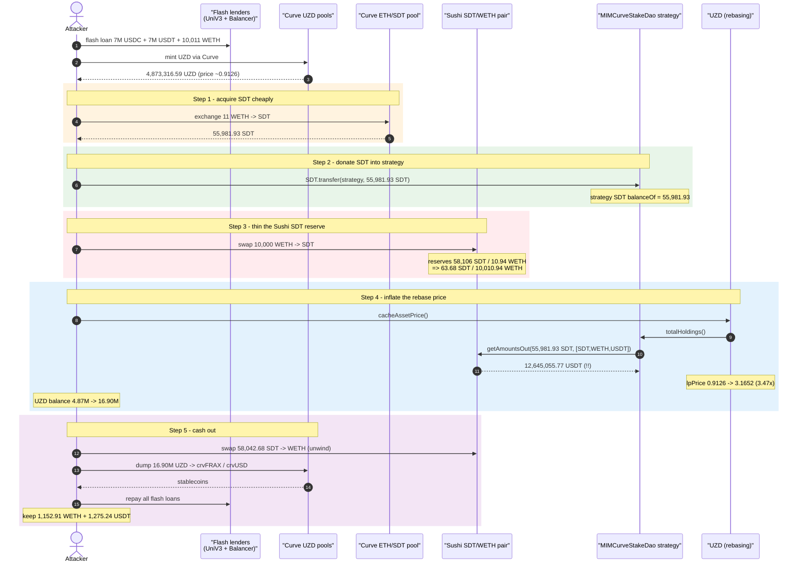
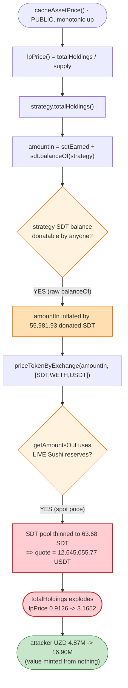
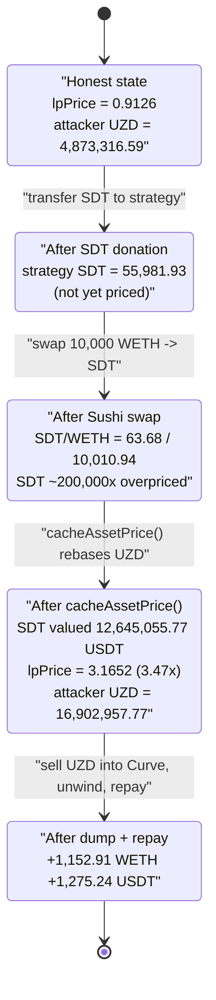

# Zunami UZD Exploit — Spot-Price `totalHoldings()` Inflation via SDT Donation

> **Vulnerability classes:** vuln/oracle/spot-price · vuln/oracle/price-manipulation

> **Reproduction:** the PoC compiles & runs in an isolated Foundry project at
> [this project folder](.) (the umbrella DeFiHackLabs repo contains many unrelated
> PoCs that do not compile under a whole-project build, so this one was extracted).
> Full verbose trace: [output.txt](output.txt).
> Verified vulnerable sources: [CurveStakeDaoStratBase.sol](sources/MIMCurveStakeDao_9848ED/contracts_strategies_stakedao_CurveStakeDaoStratBase.sol),
> [CurveStakeDaoExtraStratBase.sol](sources/MIMCurveStakeDao_9848ED/contracts_strategies_stakedao_CurveStakeDaoExtraStratBase.sol),
> [PricableAsset.sol](sources/UZD_b40b66/contracts_PricableAsset.sol).

---

## Key info

| | |
|---|---|
| **Loss** | ~$2.1M — **1,152.91 WETH + 1,275.24 USDT** extracted by the attacker (≈ $2.1M at the time) |
| **Vulnerable contract** | `MIMCurveStakeDao` strategy — [`0x9848EDb097Bee96459dFf7609fb582b80A8F8EfD`](https://etherscan.io/address/0x9848EDb097Bee96459dFf7609fb582b80A8F8EfD#code) (the `totalHoldings()` spot-price logic) |
| **Victim / impacted token** | `UZD` (Zunami USD) — [`0xb40b6608B2743E691C9B54DdBDEe7bf03cd79f1c`](https://etherscan.io/address/0xb40b6608b2743e691c9b54ddbdee7bf03cd79f1c#code), priced from `0x2ffCC661011beC72e1A9524E12060983E74D14ce` (Zunami main) |
| **Attacker EOA** | [`0x5f4c21c9bb73c8b4a296cc256c0cde324db146df`](https://etherscan.io/address/0x5f4c21c9bb73c8b4a296cc256c0cde324db146df) |
| **Attacker contract** | [`0xa21a2b59d80dc42d332f778cbb9ea127100e5d75`](https://etherscan.io/address/0xa21a2b59d80dc42d332f778cbb9ea127100e5d75) |
| **Attack tx** | [`0x0788ba222970c7c68a738b0e08fb197e669e61f9b226ceec4cab9b85abe8cceb`](https://etherscan.io/tx/0x0788ba222970c7c68a738b0e08fb197e669e61f9b226ceec4cab9b85abe8cceb) |
| **Chain / block / date** | Ethereum mainnet / fork **17,908,949** / August 13, 2023 |
| **Compiler** | Solidity v0.8.x (`pragma ^0.8.0`) |
| **Bug class** | Manipulable spot-price valuation inside `totalHoldings()` + donatable reward balance → rebase-price (`lpPrice`) inflation |

---

## TL;DR

UZD is a rebasing stablecoin whose per-share price (`lpPrice`) is computed from the Zunami
protocol's **total USD holdings divided by supply**. One of the underlying yield strategies,
`MIMCurveStakeDao`, values its accrued **SDT rewards** by asking a **SushiSwap router for a spot
quote** — `getAmountsOut(amountIn, [SDT, WETH, USDT])` — and, critically, the `amountIn` it prices
includes the strategy's **own SDT token balance** ([CurveStakeDaoStratBase.sol:283-285](sources/MIMCurveStakeDao_9848ED/contracts_strategies_stakedao_CurveStakeDaoStratBase.sol#L283-L285)).

Both of those inputs are attacker-controllable:

1. **The priced amount is donatable.** Anyone can `SDT.transfer(strategy, X)`; the next
   `totalHoldings()` call will treat the donated `X` as strategy value.
2. **The price is a spot AMM quote.** The SDT→WETH leg uses the Sushi SDT/WETH pair, whose
   reserves can be skewed in the same transaction so each SDT prices for far more than it is worth.

The attacker (flash-loaned) bought 55,981.93 SDT cheaply from a Curve ETH/SDT pool, **donated all
of it** to `MIMCurveStakeDao`, then **drained the Sushi SDT/WETH pool** of SDT (swapping 10,000
WETH in, leaving only 63.68 SDT of liquidity). Now `totalHoldings()` priced those 55,981.93 donated
SDT at **12,645,055.77 USDT** against that thinned pool. That inflated the protocol's total holdings,
so a permissionless `UZD.cacheAssetPrice()` rebase lifted `lpPrice` from **0.9126 → 3.1652** (a
**3.47×** jump), and the attacker's UZD balance ballooned from **4,873,316.59 → 16,902,957.77 UZD**.
The attacker dumped the now-overvalued UZD into the Curve UZD pools, unwound the SDT swap, repaid
the flash loans, and walked away with **1,152.91 WETH + 1,275.24 USDT**.

---

## Background — how UZD is priced

UZD ([UZD.sol](sources/UZD_b40b66/contracts_UZD.sol)) is an **elastic / rebasing** ERC20. A
holder's displayed balance is `nominal × assetPriceCached`. The price comes from an oracle:

```solidity
// ZunamiElasticRigidVault.sol:57-59
function assetPrice() public view override returns (uint256) {
    return priceOracle.lpPrice();
}
```

`lpPrice()` lives on the Zunami main contract (`0x2ffCC66...`, called via the oracle at
`0x2ffCC66...`/`0x7eae191...` in the trace) and is, in essence:

```
lpPrice = Σ strategy.totalHoldings() / totalSupply
```

The cached price is only updated upward, and **anyone** can trigger the update
([PricableAsset.sol:31-38](sources/UZD_b40b66/contracts_PricableAsset.sol#L31-L38)):

```solidity
function cacheAssetPrice() public virtual {
    _blockCached = block.number;
    uint256 currentAssetPrice = assetPrice();          // ← reads lpPrice() live
    if (_assetPriceCached < currentAssetPrice) {        // ← monotonic upward
        _assetPriceCached = currentAssetPrice;
        emit CachedAssetPrice(_blockCached, _assetPriceCached);
    }
}
```

The contract's own NatSpec even warns that the price may be temporarily out of sync and that
"an arbitrary user can arbitrage by sandwiched trade-rebase-trade operations" — but it did not
anticipate that the underlying `totalHoldings()` could be **inflated several-fold** in a single
block.

---

## The vulnerable code

### 1. SDT rewards are valued at a Sushi spot price, on a donatable balance

[`CurveStakeDaoStratBase.totalHoldings()`](sources/MIMCurveStakeDao_9848ED/contracts_strategies_stakedao_CurveStakeDaoStratBase.sol#L279-L301):

```solidity
function totalHoldings() public view virtual returns (uint256) {
    uint256 crvLpHoldings = (vault.liquidityGauge().balanceOf(address(this)) * getCurvePoolPrice()) /
        CURVE_PRICE_DENOMINATOR;

    uint256 sdtEarned = vault.liquidityGauge().claimable_reward(address(this), address(_config.sdt));
    uint256 amountIn = sdtEarned + _config.sdt.balanceOf(address(this));   // ⚠️ includes DONATABLE SDT balance
    uint256 sdtEarningsInFeeToken = priceTokenByExchange(amountIn, _config.sdtToFeeTokenPath); // ⚠️ SPOT price

    uint256 crvEarned = vault.liquidityGauge().claimable_reward(address(this), address(_config.crv));
    amountIn = crvEarned + _config.crv.balanceOf(address(this));
    uint256 crvEarningsInFeeToken = priceTokenByExchange(amountIn, _config.crvToFeeTokenPath);
    ...
    return
        tokensHoldings +
        crvLpHoldings +
        (sdtEarningsInFeeToken + crvEarningsInFeeToken) *
        decimalsMultipliers[feeTokenId];
}
```

[`priceTokenByExchange`](sources/MIMCurveStakeDao_9848ED/contracts_strategies_stakedao_CurveStakeDaoStratBase.sol#L303-L311) is a raw AMM spot quote — no TWAP, no sanity bound:

```solidity
function priceTokenByExchange(uint256 amountIn, address[] memory exchangePath)
    internal view returns (uint256)
{
    if (amountIn == 0) return 0;
    uint256[] memory amounts = _config.router.getAmountsOut(amountIn, exchangePath); // ⚠️ spot reserves
    return amounts[amounts.length - 1];
}
```

The fee-token path for SDT is hard-coded to `[SDT, WETH, USDT]`
([CurveStakeDaoExtraStratBaseUSDT.sol:19](sources/MIMCurveStakeDao_9848ED/contracts_strategies_stakedao_CurveStakeDaoExtraStratBaseUSDT.sol#L19) supplies the `[WETH, USDT]` tail; the SDT head comes from `_config.sdtToFeeTokenPath`), routing the SDT→WETH leg through the **Sushi SDT/WETH pair** whose reserves are trivially skewable.

The `extraToken` valuation in [`CurveStakeDaoExtraStratBase.totalHoldings()`](sources/MIMCurveStakeDao_9848ED/contracts_strategies_stakedao_CurveStakeDaoExtraStratBase.sol#L44-L58) has the **same** donatable-balance + spot-price defect (`extraToken.balanceOf(address(this))` priced via `priceTokenByExchange`), so multiple reward tokens share the flaw.

### 2. The two attacker-controlled inputs

- **`_config.sdt.balanceOf(address(this))`** — the strategy's SDT balance. SDT is a normal ERC20; anyone can `transfer` SDT into the strategy, and that balance is immediately counted as protocol value the next time `totalHoldings()` runs. There is **no** "only count claimed-then-deposited rewards" accounting; raw `balanceOf` is trusted.
- **`getAmountsOut(...)`** — a live SushiSwap quote that depends on current pool reserves, which the attacker reshapes within the same transaction.

Either input alone is dangerous; combined, they let the attacker mint protocol value out of thin air.

---

## Root cause — why it was possible

`lpPrice` (the rebase price) is a function of **strategy value / supply**, and the strategy value
trusts:

1. a **raw ERC20 balance** (`sdt.balanceOf(this)`) that anyone can inflate by donation, and
2. a **single-block AMM spot price** to convert that balance to USD.

A correct holdings calculation must value reward tokens at a **manipulation-resistant** price
(a TWAP/oracle, or only the amount actually *realized* via a slippage-checked swap), and must not
let a donated balance count as protocol value. Because neither protection existed, the attacker
could, atomically:

> donate cheap SDT → thin the SDT side of the Sushi pool → `getAmountsOut` reports each SDT is
> worth ~200,000× its real value → `totalHoldings()` explodes → `cacheAssetPrice()` ratchets
> `lpPrice` up 3.47× → every UZD balance (including the attacker's freshly-bought UZD) rebases up →
> sell the over-valued UZD back into the Curve pools.

The fact that `cacheAssetPrice()` is **permissionless and same-block** is what lets the attacker
seize the inflated price the instant it exists.

---

## Preconditions

- A flash-loan source for working capital. The PoC borrows from **Uniswap V3 USDC/USDT pair**
  (7,000,000 USDC equiv) and the **Balancer Vault** (7,000,000 USDC + 10,011 WETH), all repaid
  in-transaction ([test/Zunami_exp.sol:78-106](test/Zunami_exp.sol#L78-L106)). The attack is fully
  atomic, so it is flash-loanable.
- Liquidity to (a) cheaply acquire SDT (Curve ETH/SDT pool) and (b) drain the SDT side of the
  Sushi SDT/WETH pair. The Sushi pool held only **10.94 WETH / 58,106 SDT** of liquidity, so
  10,000 WETH was enough to reduce its SDT reserve to **63.68 SDT**.
- The attacker must hold UZD *before* the rebase so the price jump enriches them. The PoC mints UZD
  by routing flash-loaned USDC through Curve (`FRAX_USDC_POOL` → `UZD_crvFRAX_POOL` and
  `crvUSD_USDC_POOL` → `crvUSD_UZD_POOL`), ending with **4,873,316.59 UZD** before manipulation.
- No admin action is required; every step is permissionless.

---

## Attack walkthrough (with on-chain numbers from the trace)

All figures are pulled directly from [output.txt](output.txt) (the verbose forge trace at fork
block 17,908,949).

| # | Step | On-chain evidence | Effect |
|---|------|-------------------|--------|
| 0 | **Flash loans** — UniV3 USDC/USDT pair `flash(7M USDT)`; Balancer `flashLoan(7M USDC + 10,011 WETH)` | [Zunami_exp.sol:78-106](test/Zunami_exp.sol#L78-L106); FlashLoan events in trace | Working capital sourced, all repaid at the end. |
| 1 | **Mint UZD** — USDC → crvFRAX → UZD, and USDC → crvUSD → UZD via Curve | [Zunami_exp.sol:120-127](test/Zunami_exp.sol#L120-L127) | Attacker now holds **4,873,316.59 UZD** (priced at the honest `lpPrice ≈ 0.9126`). |
| 2 | **Buy SDT cheap** — `ETH_SDT_POOL.exchange(WETH→SDT, 11 WETH)` on Curve | trace L286: 11 WETH in → **55,981.93 SDT** out (L304) | Acquire the SDT that will be donated. |
| 3 | **Donate SDT** — `SDT.transfer(MIMCurveStakeDao, 55,981.93 SDT)` | trace L336 | Strategy SDT `balanceOf` is now **55,981.93 SDT**, all counted as "value" next read. |
| 4 | **Thin the Sushi SDT pool** — `sushiRouter.swapExactTokensForTokens(10,000 WETH → SDT)` | trace L342; reserves **58,106 SDT / 10.94 WETH → 63.68 SDT / 10,010.94 WETH** (L335, L355) | SDT becomes ~200,000× over-priced on Sushi. |
| 5 | **Rebase up** — `UZD.cacheAssetPrice()` | trace L398-L1625 | `totalHoldings()` prices 55,981.93 SDT at **12,645,055.77 USDT** (L833,L837); `lpPrice` slot @2 **0x0caa…8d4b → 0x2bed…0db0** = **0.9126 → 3.1652** (**3.47×**). UZD balance **4,873,316.59 → 16,902,957.77** (L1629). |
| 6 | **Unwind the Sushi pool** — `sushiRouter.swapExactTokensForTokens(58,042.68 SDT → WETH)` | trace L1637 | Recover the WETH spent thinning the SDT pool. |
| 7 | **Dump inflated UZD** — `UZD_crvFRAX_POOL.exchange(UZD→crvFRAX, 84% of bal)` then `crvUSD_UZD_POOL.exchange(UZD→crvUSD, rest)` | [Zunami_exp.sol:151-153](test/Zunami_exp.sol#L151-L153) | Sell the over-valued UZD into the Curve pools for real stablecoins. |
| 8 | **Convert & repay** — crvFRAX→FRAX→USDC, crvUSD→USDC, Curve3 USDC→USDT, UniV3 USDC→WETH; repay both flash loans | [Zunami_exp.sol:155-167](test/Zunami_exp.sol#L155-L167) | Loans repaid; profit retained. |

### Why the SDT quote is absurd

After step 4 the Sushi SDT/WETH pair holds **63.68 SDT / 10,010.94 WETH**. Pricing
`amountIn = 55,981.93 SDT` against a pool with only 63.68 SDT of reserve, `getAmountsOut` returns
essentially the *entire WETH side and more* in nominal terms — the trace records the SDT→WETH→USDT
output as **12,645,055.77 USDT** (trace L837). That single number is the inflated "value" the
strategy reports, dwarfing the protocol's real holdings.

### Profit accounting

| Quantity | Value |
|---|---:|
| UZD held before rebase | 4,873,316.59 UZD |
| `lpPrice` before / after | 0.9126 → **3.1652** (3.47×) |
| UZD balance after rebase | **16,902,957.77 UZD** |
| **Attacker WETH after exploit** (trace L1970) | **1,152.91 WETH** |
| **Attacker USDT after exploit** (trace L1975) | **1,275.24 USDT** |

Net retained value (after repaying all flash loans) ≈ **1,152.91 WETH + 1,275.24 USDT ≈ $2.1M**.

---

## Diagrams

### Sequence of the attack



### How `totalHoldings()` is corrupted



### Price state evolution



---

## Remediation

1. **Never value reward tokens at a single-block AMM spot price.** Replace `getAmountsOut` in
   `priceTokenByExchange` with a manipulation-resistant source (Chainlink, a Curve/Uniswap TWAP, or
   the protocol's own oracle). A holdings function that feeds a rebase price must not be readable
   from instantaneous pool reserves.
2. **Do not count raw `balanceOf` as protocol value.** `totalHoldings()` should value only rewards
   that are *claimable* (`claimable_reward`) and amounts the protocol itself deposited — never a
   donatable ERC20 balance. If reward tokens must be counted, snapshot them at claim time, not via
   live `balanceOf(address(this))`.
3. **Bound the per-update price movement.** Make `cacheAssetPrice()` reject (or clamp) any
   `lpPrice` change larger than a small per-interval delta. A 3.47× jump in a single block is a
   clear anomaly that a circuit breaker would have caught.
4. **Gate or rate-limit the rebase trigger.** `cacheAssetPrice()` being permissionless and
   same-block lets the attacker capture the inflated price instantly. Require it to use the
   already-cached oracle value (with the 4-hour cache duration the contract advertises) rather than
   reading a fresh, manipulable `lpPrice()` on demand.
5. **Apply the same fix to every reward path.** The `extraToken` valuation in
   [CurveStakeDaoExtraStratBase.totalHoldings()](sources/MIMCurveStakeDao_9848ED/contracts_strategies_stakedao_CurveStakeDaoExtraStratBase.sol#L44-L58)
   and the CRV valuation share the identical donatable-balance + spot-price pattern; fix all of them.

---

## How to reproduce

The PoC was extracted into a standalone Foundry project (the umbrella DeFiHackLabs repo has many
unrelated PoCs that fail to compile under `forge test`'s whole-project build):

```bash
_shared/run_poc.sh 2023-08-Zunami_exp --mt testExploit -vvvvv
```

- RPC: an **Ethereum mainnet archive** endpoint is required (fork block 17,908,949). Most pruned
  public RPCs will fail with `missing trie node` / `header not found`.
- Result: `[PASS] testExploit()`.

Expected tail:

```
Ran 1 test for test/Zunami_exp.sol:ContractTest
[PASS] testExploit() (gas: 5481524)
Logs:
  Before donation and reserve manipulation, UZD balance: 4873316.591569740886823823
  After donation and reserve manipulation, UZD balance: 16902957.773155665803499610
  Attacker WETH balance after exploit: 1152.913811977198057525
  Attacker USDT balance after exploit: 1275.238963

Suite result: ok. 1 passed; 0 failed; 0 skipped
```

---

*References: PeckShield — https://twitter.com/peckshield/status/1690877589005778945 ;
BlockSec — https://twitter.com/BlockSecTeam/status/1690931111776358400 (Zunami UZD, Ethereum, ~$2.1M).*
