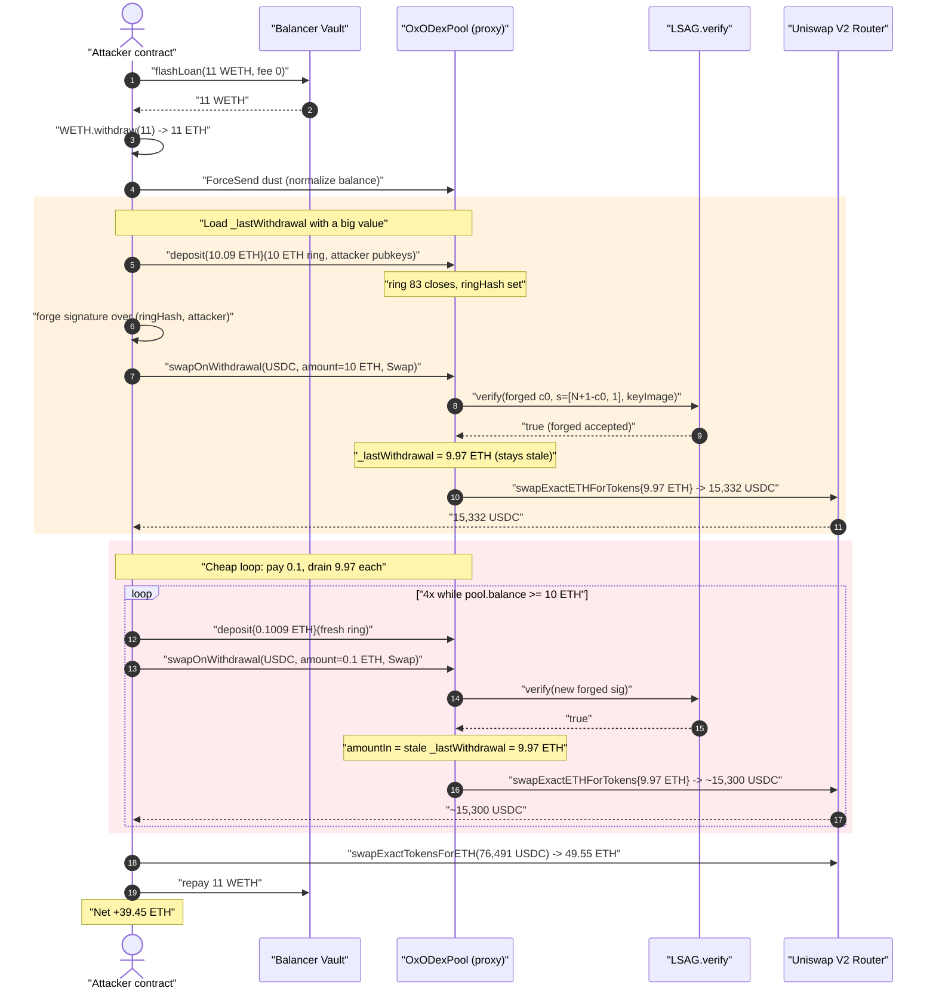
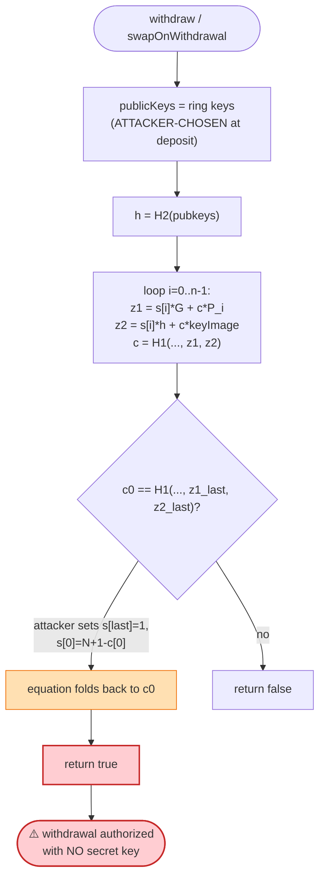
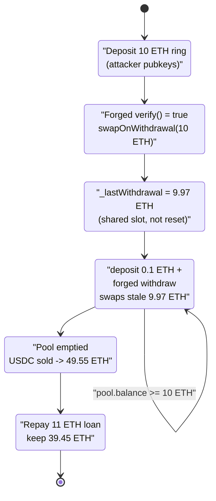

# 0x0 Privacy DEX (OxODex) Exploit — Forged LSAG Ring Signature + Stale `_lastWithdrawal` Pool Drain

> **Vulnerability classes:** vuln/auth/signature-validation · vuln/logic/state-update

> **Reproduction:** the PoC compiles & runs in an isolated Foundry project at
> [this project folder](.) (the umbrella DeFiHackLabs repo contains many unrelated
> PoCs that do not whole-compile, so this one was extracted).
> Full verbose trace: [output.txt](output.txt).
> Verified vulnerable source: [contracts_OxODexPool.sol](sources/OxODexPool_29d2bc/contracts_OxODexPool.sol) and [contracts_lib_LSAG.sol](sources/OxODexPool_29d2bc/contracts_lib_LSAG.sol).

---

## Key info

| | |
|---|---|
| **Loss** | ~$61K — **~49.85 ETH** drained from the OxODex ETH pool |
| **Vulnerable contract** | `OxODexPool` (logic) — [`0x29d2bcf0d70f95ce16697e645e2b76d218d66109`](https://etherscan.io/address/0x29d2bcf0d70f95ce16697e645e2b76d218d66109#code), reached via proxy [`0x3d18AD735f949fEbD59BBfcB5864ee0157607616`](https://etherscan.io/address/0x3d18AD735f949fEbD59BBfcB5864ee0157607616) |
| **Victim** | The OxODex ETH pool itself (LP deposits of other users) |
| **Attacker EOA** | [`0xcf28e9b8aa557616bc24cc9557ffa7fa2c013d53`](https://etherscan.io/address/0xcf28e9b8aa557616bc24cc9557ffa7fa2c013d53) |
| **Attacker contract** | [`0xc44ea7650b27f83a6b310a8fed9e9daf2864a65b`](https://etherscan.io/address/0xc44ea7650b27f83a6b310a8fed9e9daf2864a65b) |
| **Attack tx** | `0x00b375f8e90fc54c1345b33c686977ebec26877e2c8cac165429927a6c9bdbec` |
| **Chain / block / date** | Ethereum mainnet / fork at 18,115,707 / September 2023 |
| **Compiler** | source `^0.8.5`; PoC built with Solc 0.8.34 |
| **Bug class** | Broken ring-signature verification (cryptographic auth bypass) compounded by stale stored parameter (`_lastWithdrawal`) |

---

## TL;DR

OxODex is a privacy mixer / "privacy DEX." Users `deposit()` ETH together with a public key into an
*anonymity ring*, then later `withdraw()` by proving membership with an LSAG (Linkable Spontaneous
Anonymous Group) ring signature ([contracts_lib_LSAG.sol](sources/OxODexPool_29d2bc/contracts_lib_LSAG.sol)).
Two independent flaws compose into a full pool drain:

1. **The ring-signature `verify()` is forgeable.** The verifier closes the ring with
   `c0 == H1(…, z_1, z_2)` but lets the caller fully control the inputs (`c0`, `s[i]`, `keyImage`)
   while the public keys are attacker-chosen at deposit time. By picking `s[last] = 1` and
   `s[0] = N + 1 − c[0]`, the attacker constructs values that make the final hash collapse back onto
   `c0` *without ever knowing a private key*. `verify()` returns `true` for a signature nobody could
   legitimately produce ([LSAG.verify, :98-157](sources/OxODexPool_29d2bc/contracts_lib_LSAG.sol#L98-L157)).
   The on-chain trace confirms the precompile call to the verifier returns
   `0x…0001` (true) for the forged input.

2. **`swapOnWithdrawal` uses a stale, mutable `_lastWithdrawal` as the swap amount.**
   `swapOnWithdrawal()` forces `wType = Swap`, which makes `withdraw()` store the withdrawn ETH into
   `_lastWithdrawal` *instead of sending it*, then swaps `_lastWithdrawal` ETH through Uniswap to the
   recipient ([:357-396](sources/OxODexPool_29d2bc/contracts_OxODexPool.sol#L357-L396)). Because
   `_lastWithdrawal` is a single shared storage slot that is **not reliably reset**, the attacker
   first withdraws a large amount (10 ETH) to load the slot, then performs many cheap follow-up
   withdrawals — each only depositing **0.1 ETH** but each swapping out the stale **9.97 ETH** still
   sitting in `_lastWithdrawal`.

Wrapped in a Balancer flash loan, the attacker repeats deposit→forged-withdraw until the pool is
nearly empty, sells the proceeds back to ETH, repays the loan, and keeps the rest.

---

## Background — what OxODex does

`OxODexPool` ([source](sources/OxODexPool_29d2bc/contracts_OxODexPool.sol)) is an upgradeable
(`Initializable`, behind a `TransparentUpgradeableProxy`) privacy pool with these moving parts:

- **Rings.** Funds are pooled per *denomination* (`amount`) into rings of `MAX_RING_PARTICIPANT = 2`
  participants ([:51](sources/OxODexPool_29d2bc/contracts_OxODexPool.sol#L51)). `deposit()` adds the
  caller's public key(s) to the current ring and, once the ring fills, closes it with a `ringHash`
  ([:142-217](sources/OxODexPool_29d2bc/contracts_OxODexPool.sol#L142-L217)).
- **Anonymous withdrawal.** `withdraw()` verifies an LSAG ring signature over
  `abi.encodePacked(ring.ringHash, recipient)` against the ring's public keys, checks the `keyImage`
  hasn't been used (double-spend guard), then pays the recipient
  ([:234-317](sources/OxODexPool_29d2bc/contracts_OxODexPool.sol#L234-L317)).
- **Swap-on-withdrawal.** `swapOnWithdrawal()` lets a withdrawer receive a *different* token: it runs
  the same `withdraw()` but routes the ETH through Uniswap V2 to buy `tokenOut`
  ([:357-396](sources/OxODexPool_29d2bc/contracts_OxODexPool.sol#L357-L396)).

The entire security model rests on **one assumption**: only someone who knows a private key matching
one of the ring's deposited public keys can produce a signature that `LSAG.verify()` accepts. That
assumption is false.

---

## The vulnerable code

### 1. The forgeable ring-signature verifier

```solidity
function verify(
    bytes memory message,
    uint256 c0,
    uint256[2] memory keyImage,
    uint256[] memory s,
    uint256[2][] memory publicKeys
) public view returns (bool)
{
    require(publicKeys.length >= 2, "Signature size too small");
    require(publicKeys.length == s.length, "Signature sizes do not match!");

    uint256 c = c0;
    ...
    uint256[2] memory h = H2(hBytes);          // H2 = hash-to-point of the pubkeys

    uint256[2] memory z_1;
    uint256[2] memory z_2;

    for (i = 0; i < publicKeys.length; i++) {
        z_1 = ringCalcZ1(publicKeys[i], c, s[i]);     // s[i]*G + c*P_i
        z_2 = ringCalcZ2(keyImage, h, s[i], c);       // s[i]*h + c*keyImage

        if (i != publicKeys.length - 1) {
            c = H1(abi.encodePacked(hBytes, keyImage, message, z_1, z_2));
        }
    }

    return c0 == H1(abi.encodePacked(hBytes, keyImage, message, z_1, z_2));
}
```
[contracts_lib_LSAG.sol:98-157](sources/OxODexPool_29d2bc/contracts_lib_LSAG.sol#L98-L157)

The verifier never checks that `keyImage` is a *valid* image of any ring member's key, and it never
constrains the `s[i]` scalars. **Every input except the ring public keys is attacker-supplied.**
The attacker chooses the public keys when depositing (the only thing they fully control), then solves
the closing equation `c0 == H1(…, z_1, z_2)` algebraically. This is the textbook "you can forge a
ring signature if you control the ring and the verifier doesn't bind the key image to the keys" flaw.

### 2. The forgery, as performed in the PoC

The exploit contract (verified on Etherscan, reproduced in the PoC) deposits with a fixed public key
`(Bx, By)` and then constructs the signature in `generateSignature`:

```solidity
// c_1 = H1(L, y~, m, G, H)
c[1] = createHash(ringHash, recv, G, H);
// pick s1 := 1
s[1] = 1;
c[0] = createHash(ringHash, recv, ecAdd(G, ecMul(B, c[1])), ecMul(H, c[1] + 1));
// s0 := N + 1 - c_0  (mod N)
s[0] = curveN + 1 - c[0];
```
[test/0x0DEX_exp.sol:195-202](test/0x0DEX_exp.sol#L195-L202)

By setting `s[1] = 1` and `s[0] = N + 1 − c[0]`, the algebra inside the verifier's loop folds so that
the recomputed `c0` equals the supplied `c0`. The trace shows the verifier returning **true**:

```
[93694] 0x37661153…::verify(0x2496225b…7fa9385be102ac3eac297483dd6233d62b3e1496, 21452442…548, …)
  └─ ← [Return] 0x0000000000000000000000000000000000000000000000000000000000000001
```
([output.txt](output.txt), first `swapOnWithdrawal`)

### 3. The stale `_lastWithdrawal` swap amount

```solidity
function swapOnWithdrawal(
    address tokenOut, address payable recipient, uint256 relayerGasCharge,
    uint256 amountOut, uint256 deadline, WithdrawalData memory withdrawalData
) external {
    require(recipient != address(0), "ZERO_ADDRESS");
    withdrawalData.wType = Types.WithdrawalType.Swap;   // <- forces Swap branch
    withdraw(recipient, withdrawalData, relayerGasCharge);

    uint amountIn = _lastWithdrawal;                    // <- reads SHARED storage slot
    uint relayerFee = getRelayerFeeForAmount(amountIn);
    ...
    router.swapExactETHForTokens{value: amountIn}(amountOut, path, recipient, deadline);
    _lastWithdrawal = 0;
    ...
}
```
[contracts_OxODexPool.sol:357-396](sources/OxODexPool_29d2bc/contracts_OxODexPool.sol#L357-L396)

And in `withdraw()` the Swap branch stores into that same slot rather than paying out:

```solidity
if (withdrawalData.wType == Types.WithdrawalType.Direct) {
    _sendFundsWithRelayerFee(withdrawalData.amount - relayerGasCharge, recipient);
} else {
    _lastWithdrawal = withdrawalData.amount - relayerGasCharge;   // Swap branch
}
```
[contracts_OxODexPool.sol:309-314](sources/OxODexPool_29d2bc/contracts_OxODexPool.sol#L309-L314)

`_lastWithdrawal` is a **single mutable storage slot** ([:108](sources/OxODexPool_29d2bc/contracts_OxODexPool.sol#L108))
shared by every withdrawal. The amount that is actually swapped out of the pool is driven by whatever
value happens to be sitting in that slot — not by the amount validated in the current withdrawal.
On-chain (storage `@ 3`) it starts at a leftover `0.085 ETH` from a prior real withdrawal and is set
to `10 ETH` by the attacker's first call:

```
@ 3: 0x…012dfb0cb5e88000 (0.085 ETH) → 0x…8ac7230489e80000 (10 ETH)
```
([output.txt](output.txt), end of first `swapOnWithdrawal`). Every subsequent attacker withdrawal —
which only ringed a fresh **0.1 ETH** deposit — still swaps the stale **9.97 ETH** (10 ETH minus the
0.3% relayer fee), as proven by the identical `swapExactETHForTokens{value: 9970000000000000000}` on
all five iterations.

---

## Root cause

The hack is the composition of a **cryptographic auth bypass** and a **value-binding bug**:

1. **Unbound ring-signature verification (primary).** `LSAG.verify` accepts a signature whose
   `keyImage` and `s[]` scalars are unconstrained relative to the ring's public keys, so an attacker
   who controls the public keys (trivially — they deposit them) can satisfy the closing hash equation
   without any secret. This turns "prove you deposited" into "submit any well-formed transcript,"
   defeating the anonymity-set spend authorization entirely. The deposit "duplicate public key" check
   ([:177-191](sources/OxODexPool_29d2bc/contracts_OxODexPool.sol#L177-L191)) and the `onCurve` check
   ([:165-167](sources/OxODexPool_29d2bc/contracts_OxODexPool.sol#L165-L167)) do nothing to prevent
   this, because the attacker uses legitimately-shaped on-curve keys.

2. **Swap amount sourced from stale shared state (amplifier).** `swapOnWithdrawal` swaps
   `_lastWithdrawal`, a process-wide slot, instead of the *current* withdrawal's validated `amount`.
   Once loaded with a large value it lets the attacker pay only a tiny per-iteration deposit while
   draining a large fixed amount each time. Even without flaw #2, flaw #1 alone is a full drain; flaw
   #2 simply makes each iteration cheaper (deposit 0.1 ETH, extract 9.97 ETH).

Because the withdrawal recipient is the attacker and the `keyImage` only needs to be *distinct* per
withdrawal (the double-spend guard compares against previously stored images, not against the keys),
the attacker can loop withdrawals freely against rings they cheaply seed themselves.

---

## Preconditions

- The pool holds victim ETH (other users' deposits) to drain — at the fork block the ETH pool held
  enough that 5×9.97 ≈ **49.85 ETH** could be pulled.
- The attacker can `deposit()` to create/seed a closed ring (`participants >= MAX_RING_PARTICIPANT`)
  for the chosen denomination, providing the public keys it will "ring-sign" against.
- Ability to compute the forged signature off the public ring hash (`getRingHash`) — pure arithmetic
  over alt-bn128, no secret required.
- Working capital to seed deposits; obtained via a Balancer **flash loan** of 11 ETH (0 fee), fully
  repaid intra-transaction — so the attack is effectively **capital-free**.

---

## Step-by-step attack walkthrough

All figures are taken directly from [output.txt](output.txt). The attacker contract implements
`receiveFlashLoan` and drives the loop in `exploit()`.

| # | Step | Pool ETH effect | Attacker effect |
|---|------|-----------------|-----------------|
| 0 | **Flash loan** 11 ETH from Balancer (fee 0); `WETH.withdraw(11)` → 11 ETH | — | +11 ETH working capital |
| 1 | **`ForceSend`** a few wei via `selfdestruct` so `pool.balance` is a clean multiple of 10 ETH | normalizes denomination | tiny outlay |
| 2 | **Deposit 10 ETH** (`deposit{value: 10.09}` — 10 ETH + 0.09 ETH fee) into the 10-ETH ring (ringIndex 83); ring closes, `ringHash` set | +10 ETH principal | −10.09 ETH |
| 3 | **Forge** signature over `(ringHash, attacker)` and call **`swapOnWithdrawal(USDC, …, amount = 10 ETH, wType = Swap)`** → `verify()` returns true → `_lastWithdrawal = 9.97 ETH`; pool swaps **9.97 ETH → 15,332,634,740 USDC** to attacker | −9.97 ETH | +15,332.63 USDC; `_lastWithdrawal` now **10 ETH** (stale) |
| 4 | **Loop while `pool.balance ≥ 10 ETH`:** deposit only **0.1 ETH** (`deposit{value: 0.1009}`, fresh ringIndex), forge a new signature, call `swapOnWithdrawal(…, amount = 0.1 ETH)`. Despite the 0.1-ETH deposit, the swap still uses the stale `_lastWithdrawal` and sends **9.97 ETH** each time | −9.97 ETH × 4 | +~15,300 USDC each (×4); deposit −0.1009 ETH each |
| 5 | Loop ran **4 more times** (iterations 2–5), each swapping 9.97 ETH for ~15.3K USDC | −9.97 ETH × 4 | accumulates USDC |
| 6 | **Sell all USDC back to ETH:** `swapExactTokensForETH(76,491,028,829 USDC)` → **49.552 ETH** | — | +49.552 ETH |
| 7 | **Repay flash loan:** `WETH.deposit{value: 11}` + transfer 11 WETH to Balancer | — | −11 ETH |
| 8 | **Final** attacker ETH balance | pool drained | **39.4548 ETH** held |

Total USDC bought across the 5 swaps: `15,332,634,740 + 15,315,391,199 + 15,298,176,744 +
15,280,991,311 + 15,263,834,835 = 76,491,028,829` (= 76,491.03 USDC), which exactly matches the
single `swapExactTokensForETH` input in step 6.

---

## Profit / loss accounting (ETH)

| Direction | Amount (ETH) |
|---|---:|
| Flash-loan in (Balancer, fee 0) | +11.0000 |
| Deposits paid into pool/fees (10.09 + 4×0.1009) | −10.4936 |
| ETH swapped **out of the pool** to attacker (5 × 9.97, as USDC) | +49.8500 (pool side: −49.85) |
| USDC sold back → ETH (net of AMM fees/slippage) | realized **49.5520** |
| Flash-loan repayment | −11.0000 |
| **Final attacker ETH balance** | **39.4548** |

The trace's last log confirms it:

```
emit log_named_decimal_uint(key: "Attacker ETH balance after exploit", val: 39454816188631645050, decimals: 18)
```

The attacker started with **0 ETH** and walked away with **≈ 39.45 ETH** (~$61K at the time). The
victim is the OxODex ETH pool — the ~49.85 ETH pulled out was other users' privacy-pool liquidity;
the difference vs. the 39.45 ETH kept is AMM fees/slippage on the USDC round-trip plus the deposit
fees and principal the attacker fronted.

---

## Diagrams

### Sequence of the attack



### Why the forged signature verifies (control-flow of `verify`)



### The two composing flaws and the drain loop



---

## Why each magic number

- **Flash loan 11 ETH** — just enough working capital to seed the first 10-ETH ring plus fees, all
  repaid at the end (Balancer fee was 0 at this block).
- **`ForceSend` dust** — `exploit()` computes `10 ETH - (poolBalance mod 10 ETH)` and `selfdestruct`s
  that amount into the pool so the pool's ETH balance is an exact multiple of the 10-ETH denomination,
  keeping the `while (pool.balance >= 10 ether)` loop clean.
- **First deposit 10 ETH** — sized to load `_lastWithdrawal` with the maximum per-iteration drain.
- **Subsequent deposits 0.1 ETH** — the minimum needed to open a *new* closed ring to "withdraw"
  against; the actual amount swapped out ignores this and uses the stale 9.97 ETH.
- **Relayer fee 0.03 ETH per swap** — exactly 0.3% (`relayerFee = 30`) of the stale **10 ETH**
  `amountIn`, not of the 0.1-ETH deposit — direct proof that `_lastWithdrawal` (10 ETH) drove every
  swap, including the 0.1-ETH iterations.
- **`s = [N + 1 − c0, 1]`** — the algebraic solution that makes the LSAG closing hash equal `c0`
  without any private key.

---

## Remediation

1. **Replace / fix the ring-signature scheme.** `LSAG.verify` must cryptographically bind the
   `keyImage` to the ring's public keys (the linkability property of LSAG) and constrain the `s[i]`
   scalars; as written it accepts transcripts unrelated to any secret. Use a vetted, audited LSAG/
   Monero-style implementation, and add a known-answer forgery test (the `s = [N+1−c0, 1]` attack
   above) to the test suite. **Do not roll custom ring-signature crypto.**
2. **Validate the key image properly.** Enforce that `keyImage = x·H2(pubkeys)` for the spending key
   `x` whose public key `P = x·G` is in the ring — the binding the current code omits. This is what
   makes a ring signature unforgeable *and* linkable (double-spend-proof).
3. **Bind the swap amount to the current withdrawal, not shared state.** `swapOnWithdrawal` must swap
   `withdrawalData.amount - fees` directly; eliminate the `_lastWithdrawal` storage slot entirely (or
   make it a memory/local return value). A function's effect must never depend on a leftover value
   from an unrelated prior call.
4. **Reset transient accounting unconditionally.** If a shared slot is unavoidable, set it before use
   and clear it in a `finally`-equivalent path, and assert it equals the current amount before the
   swap.
5. **Rate-limit / cap per-ring withdrawals** so a single forged transcript cannot be looped to drain
   the whole pool, and consider per-denomination liquidity caps to bound blast radius.

---

## How to reproduce

The PoC was extracted into a standalone Foundry project (the umbrella DeFiHackLabs repo has many
unrelated PoCs that fail to compile under a whole-project `forge build`):

```bash
_shared/run_poc.sh 2023-09-0x0DEX_exp -vvvvv
```

- RPC: a mainnet **archive** endpoint is required (fork block 18,115,707, Sept 2023). The project's
  `foundry.toml` defines the `mainnet` alias used by `vm.createSelectFork("mainnet", 18_115_707)`.
- Result: `[PASS] testExploit()` with the attacker ending on ~39.45 ETH from a 0-ETH start.

Expected tail ([output.txt](output.txt)):

```
emit log_named_decimal_uint(key: "Attacker ETH balance after exploit", val: 39454816188631645050 [3.945e19], decimals: 18)
Suite result: ok. 1 passed; 0 failed; 0 skipped
Ran 1 test suite: 1 tests passed, 0 failed, 0 skipped (1 total tests)
```

---

*References: attacker's own write-up (0x0 Privacy DEX Exploit, 0x0ai Notion); verified exploit
contract on Etherscan `0xc44ea7650b27f83a6b310a8fed9e9daf2864a65b`; SlowMist / DeFiHackLabs (OxODex,
Ethereum, ~$61K).*
