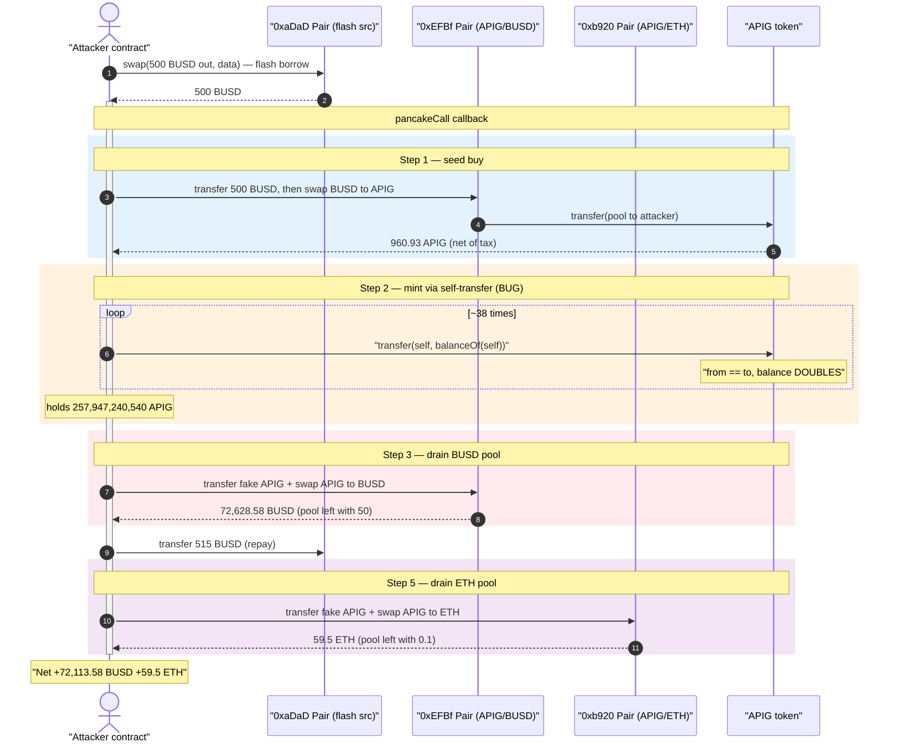
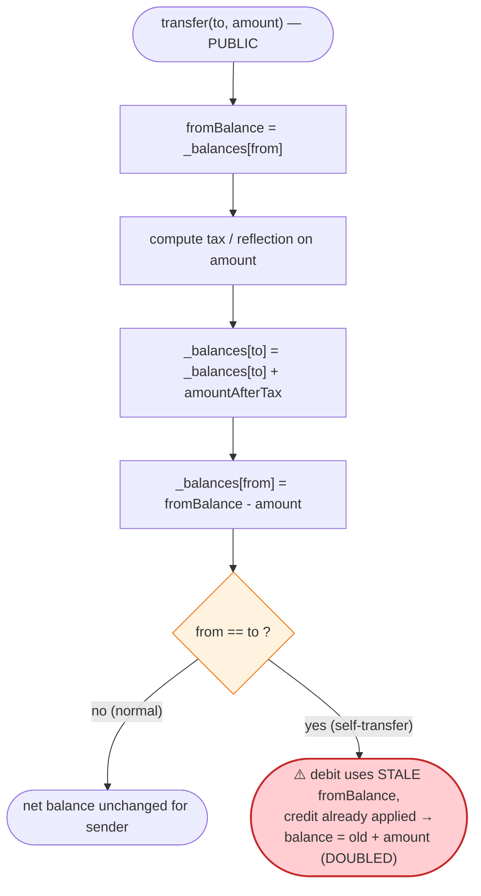
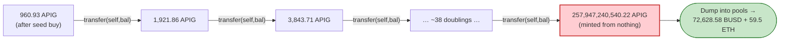

# APIG Token Exploit — Self-Transfer Balance-Doubling Bug Drains Two Pools

> **Vulnerability classes:** vuln/arithmetic/overflow · vuln/logic/state-update

> **Reproduction:** the PoC compiles & runs in an isolated Foundry project at
> [this project folder](.) (the umbrella DeFiHackLabs repo does not whole-compile,
> so this PoC was extracted standalone).
> Full verbose trace: [output.txt](output.txt).
> The vulnerability is in the **APIG token** itself (`0xDc63…8888`); its source was not verified
> on BscScan, but the bug is fully observable from the trace's `Transfer` events and storage diffs.
> Verified PancakeSwap pair sources are under [sources/](sources/).

---

## Key info

| | |
|---|---|
| **Loss** | **59.5 ETH + ~72,113.58 BSC-USD ≈ $169K** drained from two PancakeSwap pools |
| **Vulnerable contract** | `APIG` token — [`0xDc630Fb4F95FaAeE087E0CE45d5b9c4fc9888888`](https://bscscan.com/address/0xDc630Fb4F95FaAeE087E0CE45d5b9c4fc9888888) |
| **Victim pool #1 (BUSD)** | APIG/BSC-USD pair — [`0xEFBf31B0Ca397D29E9BA3fb37FE3C013EE32871d`](https://bscscan.com/address/0xEFBf31B0Ca397D29E9BA3fb37FE3C013EE32871d) |
| **Victim pool #2 (ETH)** | APIG/ETH pair — [`0xb920456AeC6E88c68C16c8294688B2b63C81B2Ce`](https://bscscan.com/address/0xb920456AeC6E88c68C16c8294688B2b63C81B2Ce) |
| **Flash-loan source** | BSC-USD pair — [`0xaDaD973f8920bc511d94aade2762284f621F1467`](https://bscscan.com/address/0xaDaD973f8920bc511d94aade2762284f621F1467) |
| **Attacker EOA** | [`0x73d80500b30a6ca840bfab0234409d98cf588089`](https://bscscan.com/address/0x73d80500b30a6ca840bfab0234409d98cf588089) |
| **Attacker contract** | [`0xfdc6a621861ed2a846ab475c623e13764f6a5ad0`](https://bscscan.com/address/0xfdc6a621861ed2a846ab475c623e13764f6a5ad0) |
| **Attack tx** | [`0x66dee84591aeeba6e5f31e12fe728f2ddc79a06426036793487a980c3b952947`](https://bscscan.com/tx/0x66dee84591aeeba6e5f31e12fe728f2ddc79a06426036793487a980c3b952947) |
| **Chain / fork block / date** | BSC / 31,562,011 (`31_562_012 - 1`) / Sept 7, 2023 |
| **Compiler (PoC)** | Solidity 0.8.34 (PoC); pairs are PancakePair `v0.5.16` |
| **Bug class** | Broken ERC-20 `transfer` — self-transfer (`from == to`) **doubles** the sender's balance |

---

## TL;DR

The `APIG` token's `transfer()` is written so that when **`from == to`** (a self-transfer), the
sender's balance is **credited without being debited** — every call to `APIG.transfer(self, balanceOf(self))`
**doubles** the caller's balance for free. The trace proves it: balance `960.93 APIG` →
`1,921.86` → `3,843.71` → `7,687.43` … each `transfer` event has the same `from` and `to`
([output.txt:1862-1863](output.txt)), and the storage slot holding the attacker's balance exactly
doubles on every call (`0x34…dee1` → `0x68…bdc2`, etc).

The attacker:

1. **Flash-borrows** 500 BSC-USD from the `0xaDaD…` pair.
2. **Buys** a small amount of APIG from the APIG/BSC-USD pool → receives **960.93 APIG** (net of the
   token's transfer tax).
3. **Doubles** that balance ~38 times via the self-transfer loop until it holds
   **≈ 2.58 × 10¹¹ APIG** (`257,947,240,540.22 APIG`) — out of thin air.
4. **Dumps** the minted APIG into the APIG/BSC-USD pool, draining it down to **50 BSC-USD**
   (taking **72,628.58 BUSD**).
5. **Dumps** more minted APIG into the APIG/ETH pool, draining it down to **0.1 ETH**
   (taking **59.5 ETH**).
6. **Repays** the 515 BSC-USD flash loan and keeps the rest.

Net profit: **72,113.58 BSC-USD + 59.5 ETH ≈ $169K**, all from a balance counter that grew without
bound because the token never subtracted on a self-transfer.

---

## Background — what APIG is

`APIG` is a BEP-20 "reflection / tax" memecoin on BSC. Two behaviours are visible in the trace:

- **Transfer tax + reflection.** On a normal `transfer`/`transferFrom`, a slice of the amount is
  routed to a reflection helper (`0x2C117488e89749A29723A22B581d9547AD3fD9E5`) which fans tiny
  amounts out to many holder addresses (`0x017a…`, `0x0178…`, etc — see
  [output.txt:1799-1803](output.txt)), and a portion is burned to `0x…dEaD`
  ([output.txt:2310](output.txt)). On the big sell, the tax was substantial: a `4.94e29` APIG
  transfer to the pool delivered only `3.458e29` to the pool, with `1.482e29` skimmed by the tax
  ([output.txt:2309-2317](output.txt)).
- **The fatal bug:** the same `transfer` function does **not** handle the `from == to` case. A
  self-transfer credits the recipient (= sender) without first debiting the sender, so the balance
  doubles.

It traded against two PancakeSwap V2 pairs:

| Pool | token0 | token1 | Reserve at attack |
|---|---|---|---|
| `0xEFBf…` | BSC-USD | APIG | **72,178.58 BUSD** / 14,435,615 APIG |
| `0xb920…` | ETH | APIG | **59.6 ETH** / 83,000,000 APIG |

Those two BUSD/ETH reserves are the prize.

---

## The vulnerable code

> APIG's source is not verified on-chain, so we cannot quote its `transfer` body. But the bug is a
> textbook one and the trace is unambiguous. The buggy pattern is:

```solidity
// BUGGY (reconstructed from on-chain behaviour):
function _transfer(address from, address to, uint256 amount) internal {
    uint256 fromBalance = _balances[from];
    require(fromBalance >= amount, "insufficient");
    // ...tax / reflection bookkeeping using `amount`...
    _balances[to]   = _balances[to]   + amountAfterTax;   // credit recipient
    _balances[from] = fromBalance      - amount;           // debit sender
    // ⚠️ When from == to, these two writes use a STALE cached `fromBalance`,
    //    so the net effect is `_balances[self] = fromBalance + amountAfterTax`
    //    — i.e. the balance is credited but the debit is overwritten/lost.
}
```

The exact mechanism (cached-balance overwrite vs. an early-return that skips the debit) cannot be
pinned without source, but the observable invariant violation is:

> `balanceOf(self)` **after** `transfer(self, balanceOf(self))` ≈ **2 ×** `balanceOf(self)` **before**.

This is proven directly by consecutive storage diffs on the attacker's balance slot
`0xb38645…bc96` ([output.txt:1864](output.txt) onward):

```
0x…34178f4d9047fddee1   (≈   960.93 APIG)
0x…682f1e9b208ffbbdc2   (≈ 1,921.86 APIG)   ← exactly 2×
...
0x…34178f4d9047fddee10000000  (≈ 16,121,702,533 APIG)
0x…682f1e9b208ffbbdc20000000  (≈ 32,243,405,067 APIG)  ← still exactly 2×
```

The healthy PancakeSwap `swap()` ([sources/PancakePair_EFBf31/PancakePair.sol:452-480](sources/PancakePair_EFBf31/PancakePair.sol#L452-L480))
and `sync()` ([:491-493](sources/PancakePair_EFBf31/PancakePair.sol#L491-L493)) are **not** at
fault — they faithfully price APIG by reserves and enforce the K-invariant. The pools were drained
because the *token's own balance ledger* let the attacker conjure ~258 billion APIG and sell it.

---

## Root cause — why it was possible

A correct ERC-20 `transfer` must be a no-op on the sender's net balance when `from == to`: you
cannot send tokens to yourself and end up richer. APIG's transfer violates this:

1. **Self-transfer is not special-cased.** The function caches `fromBalance`, performs its tax math,
   credits `to`, then debits `from`. When `from == to`, the credit and the stale-cached debit do not
   cancel — the balance is left at `old + amount`, i.e. **doubled**.
2. **The doubling is unbounded and free.** Each call costs only gas; there is no supply cap enforced
   in the balance path, so 38 calls turn 960 APIG into 258 billion APIG.
3. **APIG is freely tradable against real liquidity.** Once the attacker holds an astronomically
   inflated balance, the AMM has no idea that balance is illegitimate — `swap()` just prices it by
   reserves, so the attacker swaps the fake APIG for all the genuine BUSD and ETH.
4. **The transfer tax does not stop it.** The tax shaves a fraction off each *outbound* transfer to
   the pool, but the attacker simply doubles a few extra times to overshoot, and the residual is
   still vastly larger than the pools' reserves.

The minting-by-self-transfer is the single root cause; the AMM pools are the value sink.

---

## Preconditions

- A liquid APIG market exists (two pools held ~72K BUSD and ~59.6 ETH).
- The attacker needs only a *tiny* APIG seed to start doubling — obtained here with a **500 BUSD
  flash loan** from the `0xaDaD…` pair, fully repaid intra-transaction
  ([APIG_exp.sol:68](test/APIG_exp.sol#L68), [:100](test/APIG_exp.sol#L100)). The exploit is
  therefore **capital-free / flash-loanable**.
- No timing, role, or governance precondition — the bug is in a permissionless `transfer`.

---

## Attack walkthrough (with on-chain numbers from the trace)

The whole exploit runs inside a single `aDaDPair.swap(...)` flash-swap callback (`pancakeCall`),
[APIG_exp.sol:65-103](test/APIG_exp.sol#L65-L103).

| # | Step | Code | Observed numbers |
|---|------|------|------------------|
| 0 | **Flash-borrow** 500 BUSD from `0xaDaD…`, enter `pancakeCall` | [APIG_exp.sol:68](test/APIG_exp.sol#L68) | 500 BUSD received ([output.txt:1591](output.txt)) |
| 1 | **Buy APIG**: send 500 BUSD to `0xEFBf…` pool, swap BUSD→APIG | [APIG_exp.sol:80-83](test/APIG_exp.sol#L80-L83) | got **960.93 APIG** net of tax ([output.txt:1860-1861](output.txt)) |
| 2 | **Double loop**: `while(true){ APIG.transfer(self, balanceOf(self)); ... }` | [APIG_exp.sol:90-96](test/APIG_exp.sol#L90-L96) | 960.93 → 1,921.86 → … → **257,947,240,540.22 APIG** (~38 doublings, [output.txt:1862-2061](output.txt)) |
| 3 | **Top up + dump into BUSD pool**: send APIG to `0xEFBf…`, swap APIG→BUSD for `pool_BUSD − 50` | [APIG_exp.sol:98-99](test/APIG_exp.sol#L98-L99) | drained **72,628.58 BUSD**, pool left at **50 BUSD** ([output.txt:2285-2300](output.txt)) |
| 4 | **Repay flash loan**: send 515 BUSD back to `0xaDaD…` | [APIG_exp.sol:100](test/APIG_exp.sol#L100) | 515 BUSD repaid ([output.txt:2353](output.txt)) |
| 5 | **Dump into ETH pool**: send remaining APIG to `0xb920…`, swap APIG→ETH for `pool_ETH − 0.1` | [APIG_exp.sol:101-102](test/APIG_exp.sol#L101-L102) | drained **59.5 ETH**, pool left at **0.1 ETH** ([output.txt:2326-2342](output.txt)) |

The sell sizes are computed off-chain via `router.getAmountsIn` against the *current* reserves so the
attacker takes everything except a tiny dust floor (50 BUSD, 0.1 ETH) required to keep the AMM's
K-check from reverting ([APIG_exp.sol:84-89](test/APIG_exp.sol#L84-L89)).

### Why "double then dump" works

The pools priced APIG normally. By minting 258 billion APIG (vs. the BUSD pool's ~14.4M APIG reserve),
the attacker's holdings dwarfed the reserve by ~18,000×. Selling enough of that fake APIG pushes the
APIG reserve up and lets the attacker withdraw essentially the entire BUSD / ETH side — the AMM
faithfully honoured a balance that should never have existed.

### Profit accounting

| Item | Amount |
|---|---:|
| Flash-loan principal borrowed | 500.00 BUSD |
| Flash-loan repaid (with fee) | 515.00 BUSD |
| BUSD pulled from `0xEFBf…` pool | 72,628.58 BUSD |
| **Net BUSD profit** | **72,113.58 BUSD** |
| ETH pulled from `0xb920…` pool | **59.50 ETH** |

Confirmed by the PoC's own logs ([output.txt:1564-1565](output.txt)):

```
Attack Exploit: 72113.575425255057150292 USD
Attack Exploit: 59.500000000000000000 ETH
```

Total ≈ **$169K** at the time. `[PASS] testExploit()` ([output.txt:1562](output.txt)).

---

## Diagrams

### Sequence of the attack



### The flaw inside APIG.transfer



### Attacker APIG balance growth (self-transfer doubling)



---

## Remediation

1. **Special-case self-transfers.** At the top of `_transfer`, if `from == to`, either revert or
   return early *without modifying balances* (and without applying tax twice). This single guard
   eliminates the bug.
2. **Debit before credit, with no stale cache.** Compute and write the sender's debit, then read the
   recipient's balance fresh before crediting. Never apply both updates from a single cached
   `fromBalance` snapshot — that is exactly what makes `from == to` non-idempotent.
3. **Prefer a battle-tested ERC-20 base.** OpenZeppelin's `_transfer` is self-transfer-safe by
   construction (it subtracts from `_balances[from]` and adds to `_balances[to]` using fresh reads).
   Custom tax/reflection logic should layer on top of it, not replace the core accounting.
4. **Invariant test.** Add a unit/property test asserting `balanceOf(x)` is unchanged after
   `transfer(x, balanceOf(x))` for any tax configuration. This bug would have been caught instantly.
5. **Cap or track total supply in the balance path.** Any mechanism that can increase a balance
   without a corresponding decrease elsewhere should be impossible; `totalSupply` should be an
   enforced invariant of `_transfer`.

---

## How to reproduce

The PoC was extracted into a standalone Foundry project (the umbrella DeFiHackLabs repo has several
unrelated PoCs that fail to compile under `forge test`'s whole-project build):

```bash
_shared/run_poc.sh 2023-09-APIG_exp -vvvvv
```

- RPC: a **BSC archive** endpoint is required (fork block `31_562_012 - 1`). `foundry.toml` uses
  `https://bsc-mainnet.public.blastapi.io`, which serves historical state; most public BSC RPCs prune
  it.
- Result: `[PASS] testExploit()`.

Expected tail:

```
Attack Exploit: 72113.575425255057150292 USD
Attack Exploit: 59.500000000000000000 ETH
[PASS] testExploit() (gas: 4262051)
Suite result: ok. 1 passed; 0 failed; 0 skipped
```

---

*Reference: CertiK Alert — https://twitter.com/CertiKAlert/status/1700128158647734745 (APIG, BSC, ~$169K).*
