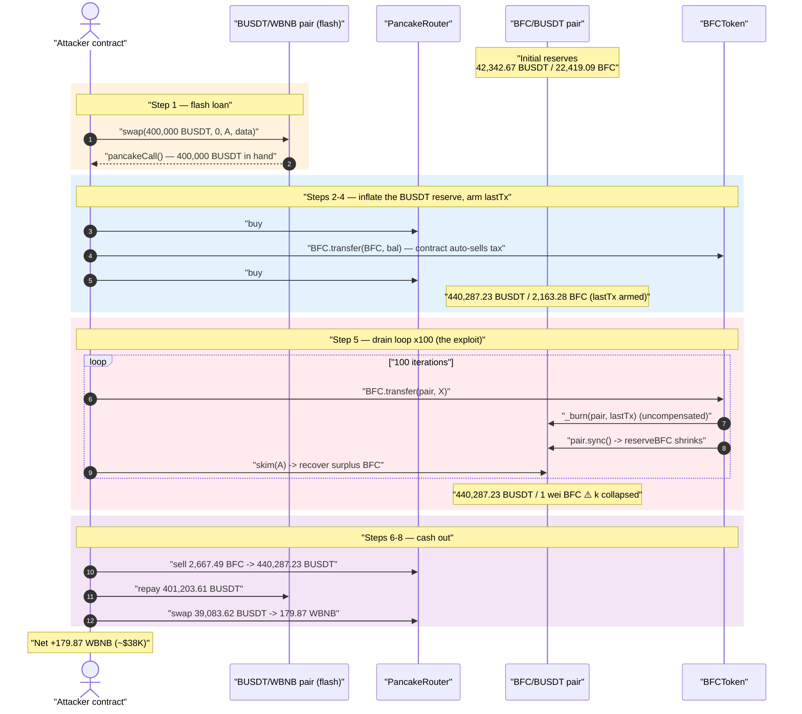
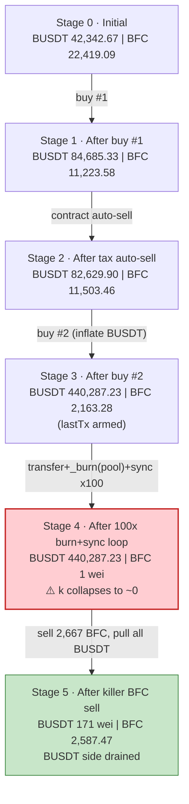
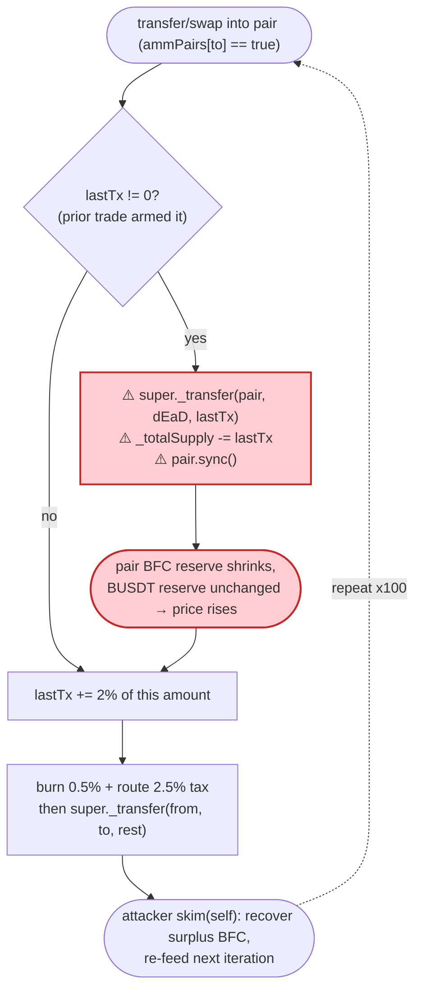
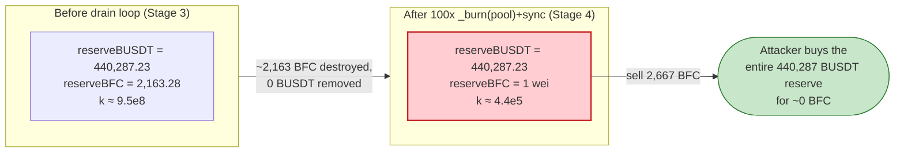

# BFCToken Exploit — `lastTx` Deferred Pool-Burn Desyncs PancakeSwap Reserves

> **Reproduction:** the PoC compiles & runs in an isolated Foundry project at
> [this project folder](.) (the umbrella DeFiHackLabs repo contains many
> unrelated PoCs that do not all compile, so this one was extracted).
> Full verbose trace: [output.txt](output.txt).
> Verified vulnerable source: [BFCToken.sol](sources/BFCToken_595eac/BFCToken.sol).

---

## Key info

| | |
|---|---|
| **Loss** | ~$38K — **179.87 WBNB** drained out of the attack (≈ 440,287 BUSDT siphoned from the BFC/BUSDT pool, of which 401,204 BUSDT repaid the flash loan) |
| **Vulnerable contract** | `BFCToken` — [`0x595eac4A0CE9b7175a99094680fbe55A774B5464`](https://bscscan.com/address/0x595eac4A0CE9b7175a99094680fbe55A774B5464#code) |
| **Victim pool** | BFC/BUSDT PancakePair — [`0x71e1949A1180C0F945fe47C96f88b1a898760c05`](https://bscscan.com/address/0x71e1949A1180C0F945fe47C96f88b1a898760c05) |
| **Flash-loan source** | BUSDT/WBNB PancakePair — `0x16b9a82891338f9bA80E2D6970FddA79D1eb0daE` |
| **Attacker EOA** | [`0x7cb74265e3e2d2b707122bf45aea66137c6c8891`](https://bscscan.com/address/0x7cb74265e3e2d2b707122bf45aea66137c6c8891) |
| **Attacker contract** | [`0x9180981034364f683ea25bcce0cff5e03a595bef`](https://bscscan.com/address/0x9180981034364f683ea25bcce0cff5e03a595bef) |
| **Attack tx** | [`0x8ee76291c1b46d267431d2a528fa7f3ea7035629500bba4f87a69b88fcaf6e23`](https://bscscan.com/tx/0x8ee76291c1b46d267431d2a528fa7f3ea7035629500bba4f87a69b88fcaf6e23) |
| **Chain / block / date** | BSC / 31,599,443 / Sept 8, 2023 |
| **Compiler** | `BFCToken` Solidity v0.8.19, optimizer 1 run / `PancakePair` v0.5.16 |
| **Bug class** | Token-side burn of pool balance + `sync()` desyncs the AMM reserve from the real balance (broken `x·y=k` invariant) |
| **Analysis ref** | [@CertiKAlert](https://twitter.com/CertiKAlert/status/1700621314246017133) |

---

## TL;DR

`BFCToken` is a "DeFi-flavoured" reflection token with a per-trade tax. On every swap **into** the
pair it carries forward a slice of the previous trade in a state variable called `lastTx`
(2% of the prior sell amount), and on the *next* trade it **burns that `lastTx` directly out of the
pair's balance and calls `pair.sync()`**
([BFCToken.sol:1716-1724](sources/BFCToken_595eac/BFCToken.sol#L1716-L1724)). This is an
*un-compensated* deletion of one side of the pool's reserves: BFC is destroyed inside the pair and
the pair is then forced to accept the smaller balance as its new reserve — no BUSDT moves out.

Because PancakeSwap (a stock v0.5.16 pair) prices purely from its cached `reserve0/reserve1`, an
attacker who can pump `lastTx` arbitrarily large can repeatedly shrink the pair's BFC reserve to
**1 wei** while its BUSDT reserve stays untouched. The marginal price of BFC then explodes, and a
tiny BFC sell buys essentially the entire BUSDT reserve.

The attacker:

1. **Flash-borrows 400,000 BUSDT** from the BUSDT/WBNB pair.
2. **Pumps the BFC/BUSDT pool's BUSDT reserve** to ~440,287 BUSDT with two buys (and routes
   BFC through the token's own `_transfer` machinery to load `lastTx`).
3. **Runs a 100-iteration loop** of `BFC.transfer(pair, X); pair.skim(self); BFC.transfer(pair, 0)`.
   Each `transfer`-into-pair triggers the deferred `lastTx` burn → `_burn(pair, lastTx)` + `sync()`,
   ratcheting the pair's BFC reserve down: `2,163.28 → 1,982.08 → … → 1 wei`.
4. **Sells a small amount of BFC** into the now-degenerate pool (BFC reserve = 1 wei, BUSDT
   reserve = 440,287) and pulls out **440,287 BUSDT** for ~0 BFC.
5. **Repays the flash loan** (401,204 BUSDT) and swaps the leftover 39,084 BUSDT → **179.87 WBNB profit**.

The token's burn-from-pool mechanic, intended as deflationary "buy pressure", is the entire exploit.

---

## Background — what BFCToken does

`BFCToken` ([source](sources/BFCToken_595eac/BFCToken.sol)) is an ERC20 paired against BUSDT on
PancakeSwap, with a tangle of LP-mining / referral / reflection features. The parts that matter for
this exploit:

- **Per-trade taxes.** On any swap touching the pair it burns `burnFee = 5/1000 = 0.5%` to `dEaD` and
  routes `toUsdtFee = 25/1000 = 2.5%` to the contract itself
  ([:1727-1732](sources/BFCToken_595eac/BFCToken.sol#L1727-L1732)).
- **Deferred pool-burn (`lastTx`).** When the recipient is the pair (a sell), the contract first
  *settles the previous trade*: it burns the stored `lastTx` amount **out of the pair**, decrements
  `_totalSupply`, and **calls `uniswapV2PairUSDT.sync()`**. It then records `lastTx = 2% of the
  current trade amount` to be burned next time
  ([:1716-1724](sources/BFCToken_595eac/BFCToken.sol#L1716-L1724)).
- **Auto-swap of accrued tax.** When the contract holds BFC and the pair holds more, a `_transfer`
  will sell the contract's BFC for BUSDT to `fundAddress` via `swap()`
  ([:1699-1711](sources/BFCToken_595eac/BFCToken.sol#L1699-L1711), [:1959-1971](sources/BFCToken_595eac/BFCToken.sol#L1959-L1971)).
- **`balanceOf` override.** `balanceOf` is overridden to return a *virtual* time-decayed/minted
  balance for ordinary users ([:1382-1391](sources/BFCToken_595eac/BFCToken.sol#L1382-L1391)), but
  the pair is in `cannotBurn` so its reported balance equals the raw ERC20 balance — meaning `skim`
  reads the true post-burn balance and the gap it exposes is real, not virtual.

On-chain state at the fork block (block 31,599,443), read from the trace's first calls into the
BFC/BUSDT pair:

| Parameter | Value |
|---|---|
| `burnFee` | 5/1000 = **0.5%** |
| `toUsdtFee` | 25/1000 = **2.5%** |
| `lastTx` deferred-burn rate | `amount/100*2` = **2% of prior sell** |
| BFC/BUSDT pair `token0` / `token1` | **BUSDT** / **BFC** |
| Initial pair reserves | BUSDT **42,342.67** / BFC **22,419.09** |
| `cannotBurn[pair]` | **true** (set in constructor) |

---

## The vulnerable code

### 1. The deferred burn deletes BFC from the pair and `sync()`s it

From `_transfer` ([BFCToken.sol:1713-1735](sources/BFCToken_595eac/BFCToken.sol#L1713-L1735)):

```solidity
if (!isAddLdx && !isDelLdx) {
    if (isExcludedFromFees[from] || isExcludedFromFees[to]) {} else {
        if (ammPairs[to] || ammPairs[from]) {
            if (ammPairs[to]) {                         // ← a SELL (recipient is the pair)
                if (lastTx != 0) {
                    super._transfer(address(uniswapV2PairUSDT), DESTROY, lastTx); // ⚠️ burn FROM the pair
                    _totalSupply = _totalSupply - lastTx;
                    IUniswapPair(uniswapV2PairUSDT).sync();                        // ⚠️ force new reserve
                    lastTx = 0;
                }
                uint256 subAmount = amount.div(100).mul(2);
                lastTx = lastTx + subAmount;            // ← arm next burn = 2% of THIS sell
            }
            uint256 burnAmount = amount.mul(burnFee).div(1000);
            uint256 toUsdtAmount = amount.mul(toUsdtFee).div(1000);
            super._transfer(from, DESTROY, burnAmount);
            _totalSupply = _totalSupply - burnAmount;
            super._transfer(from, address(this), toUsdtAmount);
            amount = amount.sub(burnAmount).sub(toUsdtAmount);
        }
    }
}
super._transfer(from, to, amount);
```

`super._transfer(pair, DESTROY, lastTx)` reduces the pair's *real* BFC balance, and the immediate
`pair.sync()` overwrites `reserve1` with that smaller balance — **without removing any BUSDT**.
The constant product `k = reserveBUSDT · reserveBFC` collapses in the seller's favor.

### 2. The attacker controls `lastTx` and can replay the burn at will

`lastTx` is set to `2%` of *any* transfer the attacker makes into the pair, and the burn fires on the
*next* transfer into the pair. By transferring large BFC amounts into the pair in a loop, the attacker
makes each successive `lastTx`-burn carve a large chunk out of the pair's BFC reserve. PancakeSwap's
`skim(to)` ([interface](sources/BFCToken_595eac/BFCToken.sol#L878)) then ships the leftover BFC back
to the attacker so it can be re-fed into the next iteration — the same BFC is recycled, only the
pair's reserve shrinks.

There is **no guard** preventing a token from burning the pair's own balance, and the per-trade
`lastTx` rate is uncapped relative to the pool reserve.

---

## Root cause — why it was possible

A Uniswap-V2 / PancakeSwap pair enforces `x·y ≥ k` only *inside `swap()`*. `sync()` exists so the
pair can trust its token balances — it assumes balances only change via mint/burn/swap that the pair
can reason about. `BFCToken` violates that trust:

> On a sell, BFCToken **destroys** BFC held by the pair (`super._transfer(pair, dEaD, lastTx)`),
> decrements supply, and **calls `pair.sync()`**, telling the pair "your BFC reserve is now this
> much smaller." No BUSDT leaves the pair, so `k` drops and the marginal BUSDT-per-BFC price rises —
> a value transfer to whoever still holds BFC.

The three design decisions that compose into a critical bug:

1. **Token burns from the pool and re-syncs it.** Any token that calls `_burn(pair, …)` (or transfers
   the pair's balance to a sink) followed by `pair.sync()` can arbitrarily shrink one reserve. This is
   the same root cause class as the BY token / many "deflationary token" hacks.
2. **The burn amount is attacker-controlled (`lastTx = 2% of the previous trade`) and uncapped vs. the
   pool reserve.** The attacker first inflates the pool's BUSDT reserve so the loop has a large prize,
   then drives the BFC reserve to 1 wei iteration by iteration.
3. **`skim` recycles the attacker's BFC.** Because `cannotBurn[pair] = true`, `skim` reads the pair's
   true post-burn balance and returns the surplus BFC to the attacker, who re-feeds it. The pool's BFC
   reserve monotonically decreases while the attacker's working BFC is conserved.

The intended deflation ("burn from the pool on each sell") is exactly the exploit primitive.

---

## Preconditions

- A flash-loanable source of BUSDT to (a) inflate the BFC/BUSDT pool's BUSDT reserve and (b) bootstrap
  the loop. The PoC borrows **400,000 BUSDT** from the BUSDT/WBNB pair via a `pancakeCall` flash swap
  ([test/BFCToken_exp.sol:37-38](test/BFCToken_exp.sol#L37-L38)).
- `lastTx != 0` on the second-and-later transfers into the pair — guaranteed by the attacker's own
  prior transfer arming `lastTx`.
- The pair must hold BFC for the burn to bite (it does, ~22.4K BFC initially, pumped to ~11.5K then
  ~2.16K reserve during setup).

No special permissions are required; every entry point used (`swap`, `transfer`, `skim`) is permissionless.

---

## Attack walkthrough (with on-chain numbers from the trace)

The pair's `token0 = BUSDT`, `token1 = BFC`, so `reserve0 = BUSDT`, `reserve1 = BFC`. All figures are
taken directly from the `Sync`/`Swap`/`Transfer` events in [output.txt](output.txt). Token amounts are
shown in whole units (÷1e18).

| # | Step | BUSDT reserve | BFC reserve | Effect |
|---|------|--------------:|------------:|--------|
| 0 | **Initial** (BFC/BUSDT pair) | 42,342.67 | 22,419.09 | Honest pool. |
| 1 | **Flash-borrow 400,000 BUSDT** from BUSDT/WBNB pair → `pancakeCall` | — | — | Working capital acquired. |
| 2 | **Buy #1** — swap 42,342.67 BUSDT → 11,195.52 BFC to attacker | 84,685.33 | 11,223.58 | BUSDT side doubled. |
| 3 | **`BFC.transfer(BFC, balance)`** ([:49](test/BFCToken_exp.sol#L49)) → contract auto-sells its accrued BFC to `fundAddress` | 82,629.90 | 11,503.46 | Tax machinery churns. |
| 4 | **Buy #2** — swap 357,657.33 BUSDT → 9,340.19 BFC to attacker | **440,287.23** | **2,163.28** | BUSDT reserve inflated to the prize; `lastTx` armed. |
| 5 | **Loop ×100**: `transfer(pair, X)` fires `_burn(pair, lastTx)` + `sync()`, then `skim(self)` recovers BFC | **440,287.23** (unchanged) | 2,163.28 → 1,982.08 → 1,811.59 → … → **1 wei** | BFC reserve annihilated; BUSDT untouched ⇒ `k` collapses. |
| 6 | **Sell 2,667.49 BFC** into the degenerate pool | **171 wei** | 2,587.47 | One small sell drains essentially all 440,287 BUSDT. |
| 7 | **Repay flash loan**: transfer 401,203.61 BUSDT → BUSDT/WBNB pair | — | — | `400,000·1000/997 + 1` repaid. |
| 8 | **Swap leftover 39,083.62 BUSDT → WBNB** | — | — | **179.87 WBNB** to attacker. |

A few representative `Sync` events from the drain loop (reserve0 constant, reserve1 collapsing):

```
Sync(reserve0: 440287.23 BUSDT, reserve1: 2163.28 BFC)   ← after Buy #2
Sync(reserve0: 440287.23 BUSDT, reserve1: 1982.08 BFC)
Sync(reserve0: 440287.23 BUSDT, reserve1: 1811.59 BFC)
...
Sync(reserve0: 440287.23 BUSDT, reserve1:    3.94 BFC)
Sync(reserve0: 440287.23 BUSDT, reserve1:    1 wei)      ← BFC reserve annihilated
Sync(reserve0:    171 wei,      reserve1: 2587.47 BFC)   ← after the killer sell
```

### Why one small sell drains the pool

After the loop `reserveBFC = 1 wei` while `reserveBUSDT = 440,287.23`. PancakeSwap's `getAmountOut`
is `out = (in·9975·reserveOut) / (reserveIn·10000 + in·9975)`. With `reserveIn = 1 wei` and the
fee-scaled input dwarfing the scaled reserve, `out → reserveOut`: the attacker's modest BFC sell
maps to ~100% of the 440,287 BUSDT reserve (trace: `amount0Out = 440,287.23 BUSDT`, leaving
`reserve0 = 171 wei`).

---

## Profit / loss accounting (BUSDT, then WBNB)

| Direction | Amount |
|---|---:|
| Flash-borrowed BUSDT | 400,000.00 |
| BUSDT pulled out of the BFC/BUSDT pool (killer sell) | 440,287.23 |
| **BUSDT available after the drain** | **~440,287.23** (≈ borrowed + pool's full BUSDT side) |
| Flash-loan repayment (`400,000·1000/997 + 1`) | −401,203.61 |
| **Net BUSDT kept** | **~39,083.62** |
| → swapped to WBNB | **179.87 WBNB** |

The attacker walks off with **179.87 WBNB** (~$38K at Sept-2023 prices). The economic loss is the
BFC/BUSDT pool's BUSDT liquidity that real LPs had supplied — the killer sell took the BUSDT reserve
from 440,287 down to 171 wei.

> The PoC's final line confirms the take:
> `Attacker BNB balance after attack: 179.873143647826145209`.

---

## Diagrams

### Sequence of the attack



### Pool state evolution



### The flaw inside `_transfer` (the `lastTx` deferred pool-burn)



### Why the burn is theft: constant-product before vs. after



---

## Remediation

1. **Never burn from the liquidity pool.** A token must only destroy tokens it *owns* (its own balance
   / a treasury). Removing the `super._transfer(pair, dEaD, lastTx)` + `pair.sync()` path
   ([:1716-1722](sources/BFCToken_595eac/BFCToken.sol#L1716-L1722)) eliminates the bug. If "deflation
   reaching the pool" is a product goal, implement it as the protocol buying & burning from its own
   funds, not as a side-channel reserve deletion.
2. **Do not call `pair.sync()` after mutating the pair's balance.** Any token-initiated `sync()` after
   altering a reserve lets a single side move independently of the other, breaking `x·y=k`.
3. **Cap single-operation reserve impact.** The deferred-burn rate (`2% of the previous trade`) is
   uncapped relative to the pool reserve; even if a pool burn were kept, it should be bounded to a tiny
   fraction of the *current reserve* and must move both sides proportionally (route through the pair's
   own `burn()`/LP redemption).
4. **Avoid stateful cross-trade accounting (`lastTx`) that an attacker can pump.** Carrying a slice of
   one trade into the next, then applying it to the pool, gives the attacker direct control of the burn
   magnitude. Tax logic should be self-contained within a single transfer.
5. **Reconsider the `balanceOf` override + reflection model entirely.** Tokens whose reported balance
   diverges from real ERC20 balances routinely break AMMs that read `balanceOf` for `skim`/`sync`.

---

## How to reproduce

The PoC was extracted into a standalone Foundry project (the umbrella DeFiHackLabs repo has many
PoCs that fail under one whole-project `forge build`):

```bash
_shared/run_poc.sh 2023-09-BFCToken_exp --mt testExploit -vvvvv
```

- RPC: a **BSC archive** endpoint is required (fork block 31,599,443). `foundry.toml` provides a BSC
  alias; most pruned public BSC RPCs will fail with `header not found` / `missing trie node`.
- Result: `[PASS] testExploit()` logging `Attacker BNB balance after attack: 179.873143647826145209`.

Expected tail:

```
Ran 1 test for test/BFCToken_exp.sol:BFCTest
[PASS] testExploit() (gas: 12224603)
Logs:
  Attacker BNB balance after attack: 179.873143647826145209

Suite result: ok. 1 passed; 0 failed; 0 skipped
```

---

*Reference: CertiK Alert — https://twitter.com/CertiKAlert/status/1700621314246017133 (BFC, BSC, ~$38K).*
