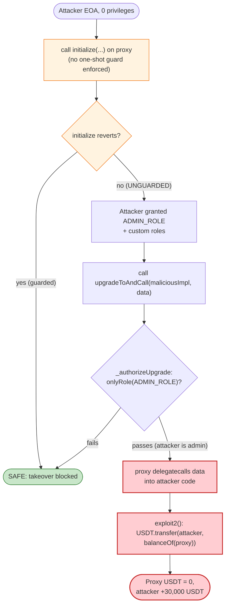
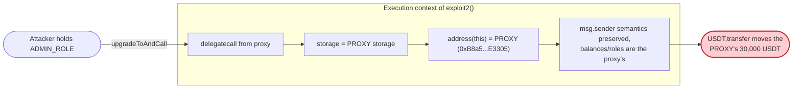

# CEXISWAP Exploit — Unprotected `initialize()` + UUPS Arbitrary Upgrade Drain

> **Vulnerability classes:** vuln/access-control/uninitialized-proxy · vuln/dependency/upgradeable-contract

> **Reproduction:** the PoC compiles & runs in an isolated Foundry project at
> [this project folder](.) (the umbrella DeFiHackLabs repo contains several unrelated
> PoCs that do not compile under a whole-project build, so this one was extracted).
> Full verbose trace: [output.txt](output.txt). PoC: [test/CEXISWAP_exp.sol](test/CEXISWAP_exp.sol).
>
> **Verified source:** the on-chain CEXISWAP implementation is **NOT verified on Etherscan**, so no
> Solidity source could be downloaded into [`sources/`](sources/). The analysis below is reconstructed
> from the execution trace, the ERC-1967/AccessControl storage layout, and the known role keccak hashes.
> Every storage slot and role hash cited has been verified against the trace and against OpenZeppelin's
> standard constants (see [Root cause](#root-cause--why-it-was-possible)).

---

## Key info

| | |
|---|---|
| **Loss** | **30,000 USDT** (~$29,966) drained from the CEXISWAP proxy |
| **Vulnerable contract** | `CEXISWAP` proxy (EIP-1967 / UUPS) — [`0xB8a5890D53dF78dEE6182A6C0968696e827E3305`](https://etherscan.io/address/0xb8a5890d53df78dee6182a6c0968696e827e3305) |
| **Victim** | The CEXISWAP proxy itself — it custodied 30,000 USDT |
| **Attacker EOA** | [`0x060C169C4517D52c4BE9a1Dd53e41a3328d16F04`](https://etherscan.io/address/0x060c169c4517d52c4be9a1dd53e41a3328d16f04) |
| **Attacker contract** | [`0x8C425Ee62D18b65Cc975767C27c42dE548D133A1`](https://etherscan.io/address/0x8c425ee62d18b65cc975767c27c42de548d133a1) (also the malicious implementation) |
| **Attack tx** | [`0xede72a74d8398875b42d92c550539d72c830d3c3271a7641ee1843dc105de59e`](https://etherscan.io/tx/0xede72a74d8398875b42d92c550539d72c830d3c3271a7641ee1843dc105de59e) |
| **Chain / block / date** | Ethereum mainnet / 18,182,606 / Sep 21, 2023 06:56 UTC (PoC forks at 18,182,605) |
| **Compiler** | Solidity `^0.8.9` (per on-chain bytecode metadata; PoC test uses `^0.8.10`) |
| **Bug class** | Unprotected/uninitialized proxy initializer → privilege takeover → UUPS arbitrary upgrade & arbitrary-code `delegatecall` |
| **Analysis ref** | Decurity — https://twitter.com/DecurityHQ/status/1704759560614126030 |

---

## TL;DR

CEXISWAP is an **upgradeable (UUPS / ERC-1967) AccessControl token proxy** that left its `initialize()`
function **callable by anyone**. The deployed proxy had received 30,000 USDT but its initializer had
never been (re)claimed in a protected way, so an attacker simply:

1. **Called `initialize(...)`** passing *its own* address as treasury, community, admin and strategy.
   This granted the attacker `ADMIN_ROLE` (and two custom roles) — full control of the proxy.
2. **Called `upgradeToAndCall(maliciousImpl, exploit2())`** — because the attacker now held the
   upgrade-authorized role, UUPS let it point the implementation at its own contract **and immediately
   `delegatecall` into it** in the same transaction.
3. Inside the `delegatecall`, `exploit2()` ran *in the proxy's storage/identity* and executed
   `USDT.transfer(owner, USDT.balanceOf(address(this)))` — sending the proxy's entire **30,000 USDT**
   balance to the attacker. It then reset the implementation slot to hide tracks.

No flash loan, no price manipulation, no economic setup. It is a pure **access-control / proxy-init
failure**: an unguarded initializer hands over the keys, and UUPS turns "I am admin" into "I can run
arbitrary code as the contract."

---

## Background — what CEXISWAP is

CEXISWAP (`0xB8a5890D…E3305`) is an **OpenZeppelin-style upgradeable contract** deployed behind an
**ERC-1967 proxy** using the **UUPS** upgrade pattern. The trace exposes its design even without
verified source:

- **It is `AccessControlUpgradeable`-based.** During the attacker's `initialize()` call the trace emits
  three `RoleAdminChanged` and three `RoleGranted` events for these roles, and writes role membership
  to the standard `_roles` mapping (the `@ 0x…: 0 → 1` storage writes):

  | Role hash (from trace) | Decoded |
  |---|---|
  | `0xa49807205ce4d355092ef5a8a18f56e8913cf4a201fbe287825b095693c21775` | `keccak256("ADMIN_ROLE")` ✓ |
  | `0x5d8e12c39142ff96d79d04d15d1ba1269e4fe57bb9d26f43523628b34ba108ec` | custom role (e.g. treasury/community) |
  | `0x88aa719609f728b0c5e7fb8dd3608d5c25d497efbb3b9dd64e9251ebba101508` | custom role (e.g. strategy/community) |

  All three were **granted to the attacker**, and each role's *admin* role was set to `ADMIN_ROLE`.

- **It is `UUPSUpgradeable`.** The implementation pointer lives in the canonical ERC-1967 slot
  `0x360894a13ba1a3210667c828492db98dca3e2076cc3735a920a3ca505d382bbc`
  (`= keccak256("eip1967.proxy.implementation") - 1`, verified to match the PoC's
  `IMPLEMENTATION_SLOT` at [test/CEXISWAP_exp.sol:50](test/CEXISWAP_exp.sol#L50)). Upgrades go through
  `upgradeToAndCall(newImpl, data)`, which writes that slot then `delegatecall`s `data` into `newImpl`.

- **It custodied real funds.** At the fork block the proxy held **30,000 USDT** (trace:
  `USDT::balanceOf(CEXISWAP) → 30000000000`, i.e. `3e10 / 1e6`). USDT (`0xdAC17…831ec7`) is the prize.

Config-style state the `initialize()` overwrote (from the `storage changes` block of the
`initialize` call):

| Slot | Before (decoded) | After |
|---|---|---|
| `254` | `0x2260fac5e5542a773aa44fbcfedf7c193bc2c599` (WBTC addr) | attacker |
| `255` | `0xdAC17F958D2ee523a2206206994597C13D831ec7` (USDT addr) | attacker |
| `256` | `0x19d6d5aebeae778586f73786108b04e9910b1ccd` | attacker |
| `251`, `252` | packed name/ticker strings (`"CEXISWAP"`, `"v1"`) | `"HAX"` |

The point is not what these slots mean precisely — it is that **`initialize()` rewrote privileged
configuration and role membership with attacker-supplied addresses, with no guard preventing a second
(hostile) caller from doing so.**

---

## The vulnerable code

> The implementation is unverified, so the snippets below are the **canonical OpenZeppelin patterns**
> that the trace proves CEXISWAP used. The bug is in how these standard pieces were wired, not in
> OpenZeppelin itself.

### 1. An unprotected initializer

A correctly written upgradeable contract guards `initialize()` with OpenZeppelin's `initializer`
modifier, so it can run **exactly once**:

```solidity
// CORRECT pattern — what CEXISWAP should have had
function initialize(
    string memory name_, string memory ticker_,
    address treasury, address community, address admin, address strategy
) public initializer {                         // ← runs once, ever
    __AccessControl_init();
    __UUPSUpgradeable_init();
    _grantRole(ADMIN_ROLE, admin);
    ...
}
```

The trace shows CEXISWAP's `initialize()` **executing successfully for the attacker** — granting roles,
rewriting config, emitting `RoleGranted` — at a block where the proxy was already funded and in use.
That is only possible if the initializer was **either never guarded by `initializer`/`reinitializer`,
or its `_initialized` flag was still `0`** (e.g. the proxy was deployed/funded without the deployer ever
calling a protected initializer, or an upgrade re-opened it). Either way the entry point was **left
callable by an arbitrary address**, which is the root vulnerability:

```solidity
// EFFECTIVE behavior on-chain (no one-shot guard enforced against the attacker)
function initialize(..., address admin, ...) public {   // ← anyone can call
    _grantRole(ADMIN_ROLE, admin);                       // admin = attacker
    ...
}
```

### 2. UUPS upgrade authorized by the now-attacker-held role

UUPS gates upgrades behind `_authorizeUpgrade`, which CEXISWAP tied to its admin role:

```solidity
// CEXISWAP's effective upgrade authorization
function _authorizeUpgrade(address newImpl)
    internal override onlyRole(ADMIN_ROLE) {}            // attacker now holds ADMIN_ROLE

function upgradeToAndCall(address newImpl, bytes memory data) external payable {
    _authorizeUpgrade(newImpl);                          // passes — attacker is admin
    _upgradeToAndCallUUPS(newImpl, data);                // set ERC-1967 slot, then delegatecall(data)
}
```

Once step 1 made the attacker an `ADMIN_ROLE` holder, `_authorizeUpgrade` no longer protects anything.
`upgradeToAndCall` becomes a **general-purpose "run arbitrary code in my storage context"** primitive.

### 3. The attacker's malicious implementation (the actual fund transfer)

From the PoC, the malicious implementation's payload is trivially a token sweep — executed via
`delegatecall`, so `address(this)` is the **proxy** (CEXISWAP), and the proxy's USDT is sent away:

```solidity
// test/CEXISWAP_exp.sol — runs as a delegatecall inside the proxy
function exploit2() external {
    USDT.transfer(owner, USDT.balanceOf(address(this))); // address(this) == proxy == CEXISWAP
}
```

([test/CEXISWAP_exp.sol:63-66](test/CEXISWAP_exp.sol#L63-L66))

---

## Root cause — why it was possible

The attack composes **two independent failures**, each catastrophic on its own when combined with an
upgradeable, fund-holding proxy:

1. **Uninitialized / unprotected initializer (the entry).**
   In the proxy pattern, the implementation's constructor does **not** run in the proxy's storage —
   initialization *must* happen by calling `initialize()` *through the proxy*, and it *must* be guarded
   so it can run only once. CEXISWAP's `initialize()` was reachable by an arbitrary caller at a block
   where the proxy already held 30,000 USDT. Calling it let the attacker **install itself as
   `ADMIN_ROLE`** (verified by the `RoleGranted(ADMIN_ROLE, attacker)` event and the
   `_roles` storage write `@ 0x37cf59f2…1400: 0 → 1`).

   This is the classic "uninitialized proxy" / "unprotected initializer" bug
   (same family as the Parity wallet freeze and numerous `*-Upgradeable` takeovers).

2. **UUPS upgrade authority = arbitrary code execution (the weaponization).**
   With `_authorizeUpgrade` gated only on `ADMIN_ROLE`, holding that role is equivalent to **total
   control**: the attacker pointed the implementation at its own contract and used the
   `upgradeToAndCall` data argument to `delegatecall` `exploit2()` **atomically in the same
   transaction**. Running in the proxy's identity, that code moved the proxy's USDT to the attacker.
   The attacker then `sstore`'d the implementation slot back (trace: `@ 0x360894…2bbc:
   attacker → 0`, then re-set on the outer `_upgradeToAndCallUUPS`), partially covering tracks.

The deeper lesson: **for an upgradeable contract, "who can become admin" and "who can upgrade" are the
*entire* security model.** A single unguarded `initialize()` collapses both. There was no need to
attack any token logic, AMM, or oracle — the proxy machinery itself handed over the funds.

---

## Preconditions

- The CEXISWAP proxy's `initialize()` is callable by an arbitrary address at the target block (its
  one-shot guard was not in force against the attacker). ✓ — proven by the trace.
- The proxy is **UUPS** with `_authorizeUpgrade` gated on a role that `initialize()` grants to the
  caller's chosen `admin`. ✓ — `upgradeToAndCall` succeeds for the attacker.
- The proxy **custodies value** (30,000 USDT). ✓.
- **No capital required.** The exploit transfers value *out of the victim*; the attacker spends only
  gas. It is not flash-loan-dependent (nothing to borrow), it is simply free.

---

## Step-by-step attack walkthrough (with ground-truth from the trace)

The whole exploit is one transaction calling `Exploiter::exploit()`
([test/CEXISWAP_exp.sol:57-60](test/CEXISWAP_exp.sol#L57-L60)), which internally does two calls into the
proxy. All values below are read directly from [output.txt](output.txt).

| # | Step | Call | On-chain effect (from trace) |
|---|------|------|------------------------------|
| 0 | **Initial** | — | Proxy holds **30,000 USDT** (`balanceOf(CEXISWAP) = 3e10`); attacker holds 0. |
| 1 | **Seize admin** | `CEXISWAP.initialize("HAX","HAX", attacker, attacker, attacker, attacker)` | Emits `RoleGranted(ADMIN_ROLE, attacker)` + 2 custom roles; `RoleAdminChanged` sets all role admins to `ADMIN_ROLE`; rewrites config slots 254/255/256 → attacker; `_roles` writes `0 → 1`. Attacker is now admin. |
| 2 | **Upgrade + execute** | `CEXISWAP.upgradeToAndCall(attackerImpl, exploit2.selector)` | `_authorizeUpgrade` passes (attacker is admin). Sets ERC-1967 impl slot → `attackerImpl`. Then `delegatecall`s `exploit2()`. |
| 2a | ↳ **Sweep (delegatecall)** | `exploit2()` runs *as the proxy* | `USDT::balanceOf(CEXISWAP) → 3e10`; `USDT::transfer(owner, 3e10)` → emits `Transfer(CEXISWAP → owner, 30000000000)`; USDT balances slot for CEXISWAP `…ac00 → 0`, owner `0 → …ac00`. |
| 2b | ↳ **Cover tracks** | inner `upgradeTo(address(0))` (delegatecall) | Zeroes the impl slot `@ 0x360894…2bbc: attacker → 0` (then outer `_upgradeToAndCallUUPS` re-emits `Upgraded`). |
| 3 | **Confirm** | `USDT.balanceOf(test) → 3e10` | `log_named_decimal_uint("Attacker USDT balance after exploit", 30000.000000)`. |

> **Note on `owner` in the PoC:** the malicious implementation forwards funds to its `owner`
> (`= msg.sender` at deploy time = the test contract), so the test's USDT balance is 30,000 after the
> run. In the live attack the destination was the attacker's EOA `0x060C…16F04`.

---

## Profit / loss accounting

| Item | Amount |
|---|---:|
| USDT held by the CEXISWAP proxy before | 30,000.000000 USDT |
| USDT swept to attacker | 30,000.000000 USDT |
| Attacker capital at risk | **0** (gas only) |
| **Net attacker profit** | **+30,000 USDT** (~$29,966) |
| **Victim loss** | **−30,000 USDT** |

The entire custodied balance was taken in a single transaction with no economic outlay.

---

## Diagrams

### Sequence of the attack

```mermaid
sequenceDiagram
    autonumber
    actor A as "Attacker (Exploiter contract)"
    participant P as "CEXISWAP proxy (ERC-1967/UUPS)"
    participant I as "Malicious implementation"
    participant U as "USDT (0xdAC17...)"

    Note over P: Proxy holds 30,000 USDT<br/>initialize() is unguarded

    rect rgb(255,243,224)
    Note over A,P: Step 1 — seize admin via unprotected initializer
    A->>P: initialize("HAX","HAX", attacker x4)
    P-->>P: _grantRole(ADMIN_ROLE, attacker)
    P-->>A: RoleGranted(ADMIN_ROLE), config slots -> attacker
    end

    rect rgb(255,235,238)
    Note over A,I: Step 2 — UUPS upgrade + atomic delegatecall
    A->>P: upgradeToAndCall(maliciousImpl, exploit2())
    P-->>P: _authorizeUpgrade(): onlyRole(ADMIN_ROLE) -> PASS
    P-->>P: set ERC-1967 impl slot = maliciousImpl
    P->>I: delegatecall exploit2()
    Note over I,P: runs in proxy storage; address(this) == proxy
    I->>U: transfer(attacker, balanceOf(proxy) = 30,000)
    U-->>A: 30,000 USDT
    I-->>P: sstore(impl slot, 0)  (cover tracks)
    end

    Note over A: Net +30,000 USDT, zero capital
```

### Privilege-escalation flow



### Why `delegatecall` makes upgrade authority = arbitrary code



---

## Remediation

1. **Guard the initializer.** Mark `initialize()` with OpenZeppelin's `initializer` (or
   `reinitializer(n)`) modifier so it can run exactly once, and **call it atomically at deploy time**
   (in the proxy's deployment transaction / via the proxy constructor's `data` arg). Never leave a
   funded proxy in an uninitialized state.
2. **Lock the implementation contract itself.** Add a constructor to the implementation that calls
   `_disableInitializers()` so the logic contract can never be initialized directly and cannot be used
   as a UUPS upgrade target by an attacker who controls its storage.
3. **Restrict and minimize upgrade authority.** `_authorizeUpgrade` should be gated to a
   multisig/timelock, not a role that an externally-callable `initialize()` can grant. Treat
   "who can upgrade" as the single most sensitive privilege in the system.
4. **Avoid `upgradeToAndCall` with attacker-influenceable `data`/`newImplementation`.** If post-upgrade
   initialization is needed, route it through a fixed, audited migration function — never an arbitrary
   selector chosen by the caller.
5. **Monitor `Upgraded`, `RoleGranted`, and `initialize` events** on production proxies and alert on any
   unexpected admin grant or implementation change; an `Upgraded` event followed by a balance-zeroing
   `Transfer` is the exact signature of this attack.

---

## How to reproduce

The PoC was extracted into a standalone Foundry project (the umbrella DeFiHackLabs repo has several
unrelated PoCs that fail to compile under a whole-project `forge test` build):

```bash
_shared/run_poc.sh 2023-09-CEXISWAP_exp --mt testExploit -vvvvv
```

- **RPC**: an Ethereum **mainnet archive** endpoint is required (the fork block 18,182,605 is from
  Sep 21, 2023). `foundry.toml` configures the `mainnet` endpoint; most public mainnet RPCs prune state
  this old and will fail with `header not found` / `missing trie node` — use an archive node.
- **Result**: `[PASS] testExploit()` with the attacker holding **30,000 USDT** afterward.

Expected tail:

```
Ran 1 test for test/CEXISWAP_exp.sol:CexiTest
[PASS] testExploit() (gas: 565125)
Logs:
  Attacker USDT balance after exploit: 30000.000000

Suite result: ok. 1 passed; 0 failed; 0 skipped
```

---

*Reference: Decurity — https://twitter.com/DecurityHQ/status/1704759560614126030 (CEXISWAP, Ethereum, ~$30K).*
