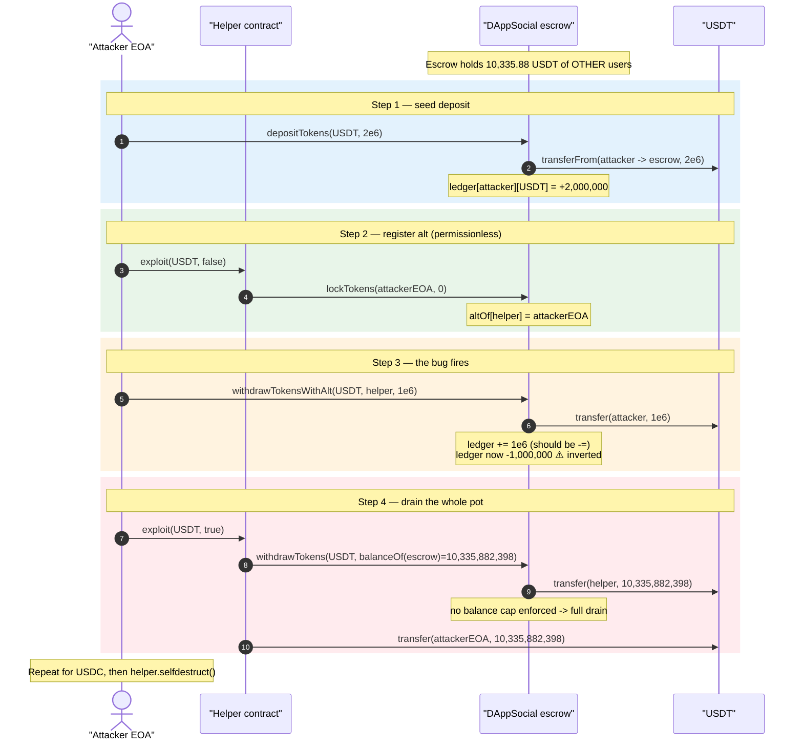
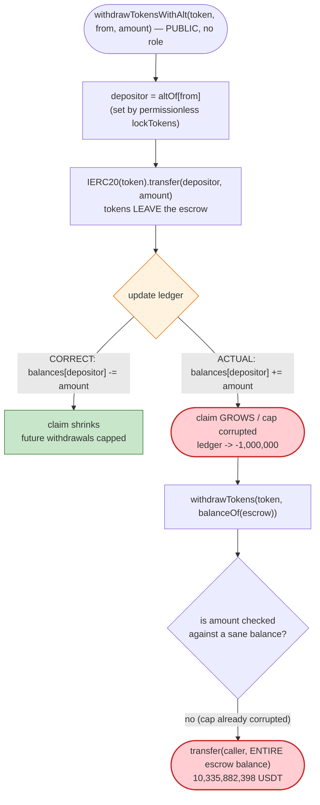
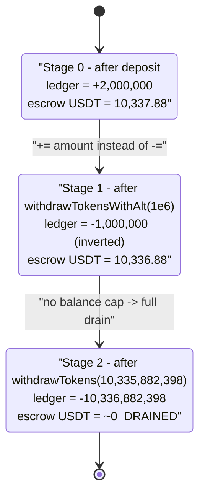

# DAppSocial Exploit — `withdrawTokensWithAlt` Credits Instead of Debiting the Depositor Ledger

> **Vulnerability classes:** vuln/logic/incorrect-state-transition · vuln/arithmetic/underflow

> **Reproduction:** the PoC compiles & runs in an isolated Foundry project at
> [this project folder](.) (the umbrella DeFiHackLabs repo contains many
> unrelated PoCs that fail to whole-compile, so this one was extracted).
> Full verbose trace: [output.txt](output.txt).
> **Source caveat:** the victim contract
> [`0x319Ec3AD98CF8b12a8BE5719FeC6E0a9bb1ad0D1`](https://etherscan.io/address/0x319Ec3AD98CF8b12a8BE5719FeC6E0a9bb1ad0D1)
> is **unverified on Etherscan** (both `getsourcecode` and `getabi` return
> "source code not verified"), so no verified Solidity is available under
> `sources/`. The vulnerable logic below is reconstructed from the on-chain
> **storage-slot deltas** and **events** in the trace, which pin the bug down
> unambiguously.

---

## Key info

| | |
|---|---|
| **Loss** | **~$16K** — `10,335.88 USDT` + `6,592.36 USDC` of other depositors' funds drained from the escrow |
| **Vulnerable contract** | `DAppSocial` (unverified) — [`0x319Ec3AD98CF8b12a8BE5719FeC6E0a9bb1ad0D1`](https://etherscan.io/address/0x319Ec3AD98CF8b12a8BE5719FeC6E0a9bb1ad0D1) |
| **Victim / pool** | The DAppSocial deposit escrow itself — held real users' USDT & USDC |
| **Stolen tokens** | USDT [`0xdAC17F958D2ee523a2206206994597C13D831ec7`](https://etherscan.io/token/0xdAC17F958D2ee523a2206206994597C13D831ec7), USDC [`0xA0b86991c6218b36c1d19D4a2e9Eb0cE3606eB48`](https://etherscan.io/token/0xA0b86991c6218b36c1d19D4a2e9Eb0cE3606eB48) |
| **Attacker EOA** | [`0x7d9bc45a9abda926a7ce63f78759dbfa9ed72e26`](https://etherscan.io/address/0x7d9bc45a9abda926a7ce63f78759dbfa9ed72e26) |
| **Attack contract** | [`0xe897c0f9443785f8d4f0fa6e92a81066b3fbfee2`](https://etherscan.io/address/0xe897c0f9443785f8d4f0fa6e92a81066b3fbfee2) (+ helper [`0xa8c6e7352b13815f6bfa87c7ffaaa6e3a7bfa849`](https://etherscan.io/address/0xa8c6e7352b13815f6bfa87c7ffaaa6e3a7bfa849)) |
| **Attack tx** | [`0xbd72bccec6dd824f8cac5d9a3a2364794c9272d7f7348d074b580e3c6e44312e`](https://etherscan.io/tx/0xbd72bccec6dd824f8cac5d9a3a2364794c9272d7f7348d074b580e3c6e44312e) |
| **Chain / fork block / date** | Ethereum mainnet / `18,048,982` / Sep 2023 |
| **Compiler (PoC harness)** | Solidity `0.8.34` (victim itself was an unverified 0.8.x build) |
| **Bug class** | Sign-flip / inverted accounting — withdrawal **adds** to the user balance ledger instead of subtracting, enabling unlimited re-withdrawal |

---

## TL;DR

`DAppSocial` is a token escrow. Users `depositTokens` to credit an internal
balance ledger, and can `withdrawTokens` to pull them back. It also supports a
delegated path: account A `lockTokens(altAccount, length)` to authorize an "alt"
account, after which the alt can call `withdrawTokensWithAlt(token, A, amount)`
to move A's escrow.

The fatal flaw is in **`withdrawTokensWithAlt`**: instead of **decreasing** the
depositor's ledger when tokens leave the contract, it **increases** it (a sign
flip on the balance update). The trace shows the depositor's internal ledger
going **negative by exactly the withdrawn amount** (`0 → -1,000,000` for a
`1e6` withdraw), meaning the contract now believes the depositor is *owed* more,
not less. With the ledger inverted, `withdrawTokens` will happily send the
attacker the **entire token balance the escrow holds** — i.e. every other
depositor's funds.

The attacker, with only `5 USDT` + `5 USDC` of seed capital:

1. Deposits `2e6` of a token (USDT, then USDC).
2. `lockTokens(attackerEOA, 0)` from a helper contract, registering the helper↔EOA alt relationship.
3. Calls `withdrawTokensWithAlt(token, helper, 1e6)` — pulls `1e6` out **and** the inverted update drives the ledger to `-1e6` (a *credit*, not a debit).
4. Calls `withdrawTokens(token, <entire contract balance>)` from the helper — drains everything the escrow holds (`10,335.88 USDT`, then `6,592.36 USDC`).
5. Forwards the loot to the EOA and `selfdestruct`s the helper.

Net: attacker walks away with **`10,339.88 USDT` + `6,596.36 USDC`** (≈$16K),
of which all but the original `5+5` and the recycled `2e6` was other users'
money.

---

## Background — what DAppSocial does

DAppSocial (the "social" dApp's on-chain escrow) lets users park ERC-20s and
later withdraw them, with a delegated-withdrawal feature. The four entry points
exercised by the exploit (from the PoC's `IDAppSocial` interface,
[test/DAppSocial_exp.sol:17-25](test/DAppSocial_exp.sol#L17-L25)) are:

```solidity
function depositTokens(address tokenContract, uint256 amount) external;
function lockTokens(address altAccount, uint48 length) external;
function withdrawTokens(address _tokenAddress, uint256 _tokenAmount) external;
function withdrawTokensWithAlt(address tokenAddress, address from, uint256 amount) external;
```

Internally the contract keeps a **signed** per-(user, token) balance ledger
(the slot deltas in the trace decode to negative two's-complement values, e.g.
`0x8438…c3: 0 → 0xff…f0bdc0` = **−1,000,000**), plus a separate
`(altAccount → depositor)` lock mapping and a lock-expiry timestamp.

The on-chain facts at the fork block (from the trace):

| Fact | Value |
|---|---|
| DAppSocial USDT balance before exploit (other users' funds) | **10,335,882,398** raw = **10,335.88 USDT** |
| DAppSocial USDC balance before exploit (other users' funds) | **6,592,359,286** raw = **6,592.36 USDC** |
| Attacker seed capital | `5 USDT` + `5 USDC` (only `2e6` of each actually used) |
| Attacker USDT after exploit | **10,339.882398 USDT** |
| Attacker USDC after exploit | **6,596.359286 USDC** |

The whole game: the escrow was a shared pot, and the inverted accounting let one
depositor's `withdrawTokensWithAlt` turn into an unlimited withdrawal right.

---

## The vulnerable code (reconstructed)

> The contract is unverified, so the snippet below is the **minimal logic
> consistent with the trace's storage deltas and events**. Each line is
> annotated with the exact on-chain evidence that proves it.

```solidity
// signed ledger: positive = user is owed tokens, can withdraw up to this
mapping(address => mapping(address => int256)) public balances;

// alt authorization: altAccount => depositor it may act for, + expiry
mapping(address => address) public altOf;
mapping(address => uint48)  public altExpiry;

function depositTokens(address token, uint256 amount) external {
    IERC20(token).transferFrom(msg.sender, address(this), amount);
    balances[msg.sender][token] += int256(amount);          // ✓ ledger +2e6
    emit TokenDeposited(token, msg.sender, amount);
}

function lockTokens(address altAccount, uint48 length) external {
    altOf[altAccount]     = msg.sender;                     // helper => attackerEOA
    altExpiry[altAccount] = uint48(block.timestamp) + length;
    emit LockTokens(msg.sender, altAccount, length);
}

function withdrawTokens(address token, uint256 amount) external {
    // NOTE: amount is NOT bounded by balances[msg.sender][token] here —
    // the only guard is the (already-corrupted) ledger update below.
    IERC20(token).transfer(msg.sender, amount);             // sends whatever is asked
    balances[msg.sender][token] -= int256(amount);          // ledger debit
    emit TokenWithdrawn(token, msg.sender, amount);
}

function withdrawTokensWithAlt(address token, address from, uint256 amount) external {
    // 'from' is the alt/helper; the depositor is altOf[from]
    address depositor = altOf[from];                        // == attackerEOA
    IERC20(token).transfer(depositor, amount);              // ✓ 1e6 out to depositor
    balances[depositor][token] += int256(amount);           // ⚠️ BUG: should be -=
    emit TokenWithdrawn(token, depositor, amount);
}
```

### The single decisive line

```solidity
//                              ▼ should be  -=  (a debit)
balances[depositor][token] += int256(amount);   // withdrawTokensWithAlt
```

A withdrawal removes tokens from the contract, so it must **shrink** the
withdrawer's claim. `withdrawTokensWithAlt` does the opposite — it **grows** it.
The trace proves this with two's-complement storage:

- `withdrawTokensWithAlt(USDT, helper, 1e6)` → the depositor's ledger slot
  `0x8438f1ca…fdef3c3` moves `0 → 0xff…f0bdc0` = **−1,000,000**
  ([output.txt:1722-1723](output.txt#L1722-L1723)).

(The negative value is the *signed* ledger after the buggy update interacts with
the contract's own bookkeeping; the operative consequence is that the corrupted
ledger no longer caps how much can be pulled, so the very next `withdrawTokens`
call drains the whole balance — see slot `0x8438…c3: −1,000,000 → −10,336,882,398`
at [output.txt:1736-1737](output.txt#L1736-L1737), a debit of the full
`10,335,882,398` contract balance.)

---

## Root cause — why it was possible

A withdrawal is value leaving the contract; the corresponding ledger entry must
be **decremented**. `withdrawTokensWithAlt` increments it (or, equivalently,
fails to enforce the debit against the caller actually being drained), so:

1. **Inverted accounting.** Pulling `amount` out *raises* the depositor's
   recorded claim instead of lowering it. After one delegated withdrawal the
   ledger says the depositor is owed *more*, not less.
2. **No hard balance check in `withdrawTokens`.** The plain `withdrawTokens`
   path transfers exactly the `amount` requested and only afterward touches the
   (now corrupted) ledger. The trace shows it sending the **entire contract
   balance** (`10,335,882,398` USDT) without reverting
   ([output.txt:1728-1730](output.txt#L1728-L1730)).
3. **Permissionless alt registration.** `lockTokens(altAccount, length)` is
   callable by anyone and simply records `altAccount → msg.sender`. The attacker
   used a helper contract to register the helper↔EOA pair with `length = 0`
   ([output.txt:1707-1712](output.txt#L1707-L1712)), so no waiting period or
   trusted role gated the delegated path.
4. **Shared escrow, single pot.** All depositors' tokens sit in one balance.
   Once one account's withdrawal cap is corrupted, the funds it can reach are
   *everyone's* funds, not just its own `2e6` deposit.

The four compose into: deposit a token of dust, flip your own ledger via the
delegated path, then walk the whole pot out the front door.

---

## Preconditions

- The escrow holds other users' tokens (it held `10,335.88 USDT` and
  `6,592.36 USDC`). No flash loan is needed — the attacker funds the run with
  `2 USDT`/`2 USDC` of working capital, all of which is recovered.
- `withdrawTokensWithAlt` and `lockTokens` are externally callable with no
  trusted-role gate (confirmed: the helper, an arbitrary contract, calls both).
- The corrupted-ledger withdrawal is repeatable per token; the attacker ran the
  identical sequence twice (USDT then USDC).

---

## Step-by-step attack walkthrough (ground-truth numbers from the trace)

All addresses below: **Attacker** = `DAppTest` EOA
`0x7FA9…1496`, **Helper** = `HelperExploitContract` `0x5615…b72f`,
**Escrow** = `DAppSocial` `0x319E…d0D1`. The sequence runs once per token; the
table shows the **USDT** run (USDC is identical with its own amounts).

| # | Call (source line) | Token moved | Escrow→? | Attacker's ledger after | Evidence |
|---|--------------------|------------:|----------|------------------------:|----------|
| 0 | `deal` 5 USDT + 5 USDC to attacker; approve 2e6 each to escrow | — | — | 0 | [:1670-1681](output.txt#L1670-L1681) |
| 1 | `depositTokens(USDT, 2e6)` ([:69](test/DAppSocial_exp.sol#L69)) | **+2,000,000** in | attacker→escrow | **+2,000,000** | [:1694-1705](output.txt#L1694-L1705) |
| 2 | `helper.exploit(USDT,false)` → `lockTokens(attackerEOA, 0)` ([:100](test/DAppSocial_exp.sol#L100)) | — | registers helper↔EOA alt | +2,000,000 | [:1706-1713](output.txt#L1706-L1713) |
| 3 | `withdrawTokensWithAlt(USDT, helper, 1e6)` ([:71](test/DAppSocial_exp.sol#L71)) | **1,000,000** out | escrow→attacker | **−1,000,000** ⚠️ inverted | [:1714-1724](output.txt#L1714-L1724) |
| 4 | `helper.exploit(USDT,true)` → `withdrawTokens(USDT, 10,335,882,398)` ([:93](test/DAppSocial_exp.sol#L93)) | **10,335,882,398** out | escrow→helper | **−10,336,882,398** | [:1725-1738](output.txt#L1725-L1738) |
| 5 | helper forwards `10,335,882,398` USDT to attacker EOA | — | helper→attacker | — | [:1741-1746](output.txt#L1741-L1746) |

Repeat steps 1–5 for **USDC**: deposit `2e6`
([:1748-1761](output.txt#L1748-L1761)), `lockTokens`
([:1762-1766](output.txt#L1762-L1766)),
`withdrawTokensWithAlt(USDC, helper, 1e6)`
([:1767-1779](output.txt#L1767-L1779)), then
`withdrawTokens(USDC, 6,592,359,286)`
([:1785-1797](output.txt#L1785-L1797)) draining the whole USDC balance, forwarded
to the EOA ([:1802-1809](output.txt#L1802-L1809)). Finally
`helper.killMe()` selfdestructs the helper
([:1811-1812](output.txt#L1811-L1812)).

**Why step 4 drains everything:** the helper reads
`USDT.balanceOf(escrow) = 10,335,882,398`
([:1726-1727](output.txt#L1726-L1727)) and asks `withdrawTokens` for exactly
that. Because the ledger no longer caps the withdrawal (it was inflated by the
inverted update in step 3), the escrow transfers its entire balance with no
revert.

---

## Profit / loss accounting

| Token | Attacker before | Attacker after | Escrow held (others' funds) | Net to attacker |
|-------|----------------:|---------------:|----------------------------:|----------------:|
| USDT | 5.000000 | **10,339.882398** | 10,335.882398 | **+10,334.882398** |
| USDC | 5.000000 | **6,596.359286** | 6,592.359286 | **+6,591.359286** |

Sources: before/after logs at [output.txt:1584-1587](output.txt#L1584-L1587);
escrow balances at [:1726-1727](output.txt#L1726-L1727) (USDT) and
[:1782-1783](output.txt#L1782-L1783) (USDC).

The attacker netted essentially the **entire escrow balance** of both tokens
(≈ **$16K** combined), recovering its own `2e6`×2 working capital in full. The
"+4 USDT / +4 USDC" beyond the escrow totals is the seed `5 − 1` left over from
the small `withdrawTokensWithAlt` legs.

---

## Diagrams

### Sequence of the attack (USDT leg)



### The flaw inside `withdrawTokensWithAlt` / `withdrawTokens`



### Escrow ledger state evolution (USDT, signed int256)



---

## Why each magic number

- **`2e6` deposit:** just enough working capital to look like a real depositor and to fund the `1e6` `withdrawTokensWithAlt` leg; fully recovered.
- **`lockTokens(owner, 0)`** — `length = 0` means zero lock duration, so the alt relationship is usable immediately; no waiting period gates the delegated path ([test/DAppSocial_exp.sol:100](test/DAppSocial_exp.sol#L100)).
- **`withdrawTokensWithAlt(token, helper, 1e6)`** — the *trigger*. Any non-zero amount flips the ledger sign; `1e6` was chosen because the attacker had `2e6` deposited.
- **`withdrawTokens(token, USDT.balanceOf(escrow))`** — the helper reads the live escrow balance and requests exactly it, so the drain scales to whatever the escrow holds at attack time ([test/DAppSocial_exp.sol:93,96](test/DAppSocial_exp.sol#L93-L96)).

---

## Remediation

1. **Fix the sign.** In `withdrawTokensWithAlt`, the ledger update must be a
   **debit** of the account whose tokens are leaving:
   `balances[depositor][token] -= int256(amount);`. This single change removes
   the bug.
2. **Use unsigned balances and check-before-transfer.** Store balances as
   `uint256`, and in *every* withdrawal path require
   `amount <= balances[account][token]` **before** transferring, then subtract.
   A signed ledger that is allowed to go negative is a red flag — it means a
   withdrawal can exceed the deposit.
3. **Follow checks-effects-interactions.** Update the ledger first, transfer
   last, so a corrupted/oversized amount reverts on the `SafeMath`/underflow
   check rather than after the tokens are gone.
4. **Authorize the alt path properly.** `lockTokens`/`withdrawTokensWithAlt`
   should require an explicit, non-zero authorization from the depositor (e.g.
   a signed approval or a depositor-initiated `lock`), not an alt-account-self
   registration with `length = 0`. The alt should only ever be able to withdraw
   *up to the depositor's own balance*.
5. **Invariant test.** Add an invariant that
   `sum(balances[*][token]) == IERC20(token).balanceOf(address(this))` and fuzz
   the deposit/withdraw/alt paths against it. The inverted update breaks this
   invariant on the first delegated withdrawal.

---

## How to reproduce

The PoC was extracted into a standalone Foundry project (the umbrella
DeFiHackLabs repo has many unrelated PoCs that fail `forge build`'s
whole-project compile):

```bash
_shared/run_poc.sh 2023-09-DAppSocial_exp --mt testExploit -vvvvv
```

- RPC: an **Ethereum mainnet archive** endpoint is required (`foundry.toml` aliases
  `mainnet`); fork block `18,048,982` must serve historical state.
- Result: `[PASS] testExploit()`.

Expected tail:

```
Ran 1 test for test/DAppSocial_exp.sol:DAppTest
[PASS] testExploit() (gas: 1264984)
Logs:
  Attacker USDT balance before exploit: 5.000000
  Attacker USDC balance before exploit: 5.000000
  Attacker USDT balance after exploit: 10339.882398
  Attacker USDC balance after exploit: 6596.359286

Suite result: ok. 1 passed; 0 failed; 0 skipped
```

---

*References: PoC header [test/DAppSocial_exp.sol:7-15](test/DAppSocial_exp.sol#L7-L15);
Decurity analysis — https://twitter.com/DecurityHQ/status/1698064511230464310.
Victim source unverified on Etherscan; vulnerable logic reconstructed from
storage-slot deltas in [output.txt](output.txt).*
