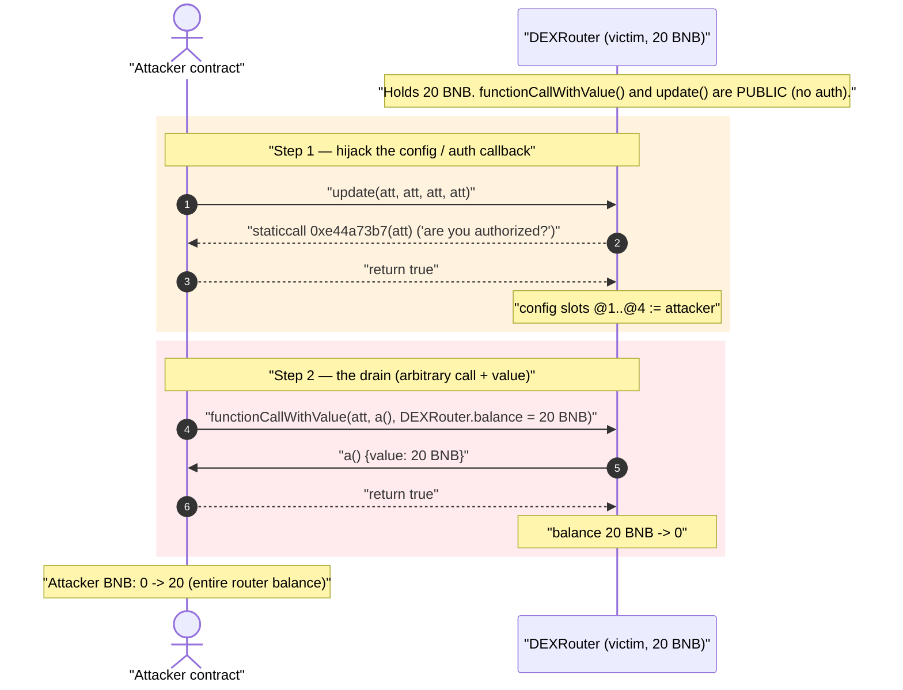
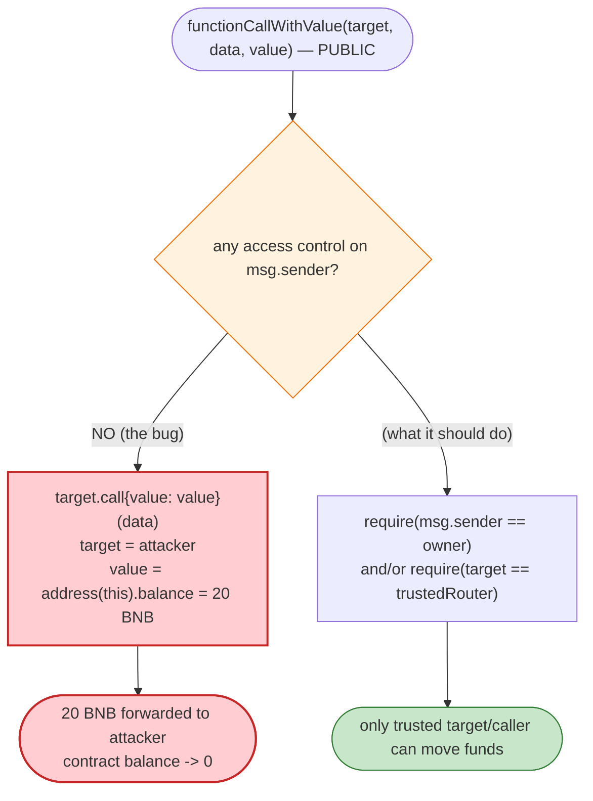
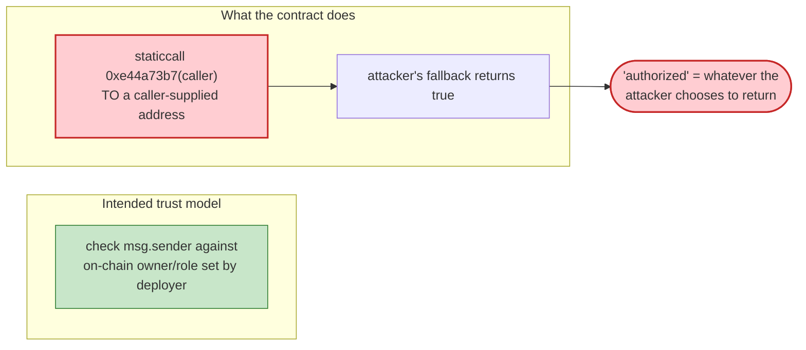

# DEXRouter Exploit — Unprotected `functionCallWithValue` Drains the Router's Native BNB

> **Vulnerability classes:** vuln/access-control/missing-auth · vuln/dependency/unsafe-external-call

> **Reproduction:** the PoC compiles & runs in an isolated Foundry project at
> [this project folder](.) (the umbrella DeFiHackLabs repo contains many unrelated
> PoCs that do not compile under a whole-project build, so this one was extracted).
> Full verbose trace: [output.txt](output.txt). PoC: [test/DEXRouter_exp.sol](test/DEXRouter_exp.sol).
>
> The victim contract is **unverified** on BscScan, so no Solidity source could be
> downloaded into [sources/](sources/). Every claim below is reconstructed from the
> live `-vvvvv` execution trace, the function selectors, and direct `cast` reads of
> on-chain state at the fork block. Function names (`update`, `functionCallWithValue`,
> param names `fcb`/`bnb`/`busd`/`router`) are taken from the PoC author's reverse-engineered
> interface, not from verified source.

---

## Key info

| | |
|---|---|
| **Loss** | **20 BNB** (≈ **$4,000** at the Sept-2023 BNB price) — the entire native-coin balance of the router |
| **Vulnerable contract** | `DEXRouter` (unverified) — [`0x1f7cF218B46e613D1BA54CaC11dC1b5368d94fb7`](https://bscscan.com/address/0x1f7cf218b46e613d1ba54cac11dc1b5368d94fb7) |
| **Victim / drained party** | The `DEXRouter` contract itself (held 20 BNB) |
| **Attacker EOA** | [`0x09039e2082a0a815908e68bd52b86f96573768e8`](https://bscscan.com/address/0x09039e2082a0a815908e68bd52b86f96573768e8) |
| **Attacker contract** | [`0x0f41f9146de354e5ac6bb3996e2e319dc8a3bb7f`](https://bscscan.com/address/0x0f41f9146de354e5ac6bb3996e2e319dc8a3bb7f) |
| **Attack tx** | [`0xf77c5904da98d3d4a6e651d0846d35545ef5ca0b969132ae81a9c63e1efc2113`](https://bscscan.com/tx/0xf77c5904da98d3d4a6e651d0846d35545ef5ca0b969132ae81a9c63e1efc2113) |
| **Chain / block / date** | BSC / fork at block **32,161,325** / Sept 2023 |
| **Compiler** | PoC: Solidity `^0.8.10` (Foundry, `evm_version = cancun`). Victim: unverified bytecode, 20,218 bytes. |
| **Bug class** | Missing access control on a privileged **arbitrary-external-call-with-value** primitive (CWE-284 / CWE-862) |
| **Analysis ref** | [@DecurityHQ thread](https://twitter.com/DecurityHQ/status/1707851321909428688) |

---

## TL;DR

`DEXRouter` exposes a public function — `functionCallWithValue(address target, bytes data, uint256 value)` —
that performs an **arbitrary external call to a caller-chosen `target`, forwarding caller-chosen native
value out of the contract's own balance**, with **no access control**. There is also a public
`update(address,address,address,address)` that lets anyone rewrite the four privileged "config"
addresses the contract stores (the slots originally held the PancakeSwap V2 router and three
project-specific addresses).

The attacker simply:

1. Calls `update(attacker, attacker, attacker, attacker)` to register itself in all four config slots
   (during this call the router calls back `0xe44a73b7(caller)` to the new address to "confirm" it; the
   attacker's `fallback` answers `true`).
2. Calls `functionCallWithValue(attacker, a(), address(DEXRouter).balance)` — the router forwards its
   **entire 20 BNB balance** into a call to `attacker.a(){value: 20 BNB}`, which trivially succeeds.

There is no swap, no flash loan, no price manipulation, no oracle. It is a one-shot drain of an
unguarded "execute arbitrary call and send my money" function. The attacker's BNB balance goes from
**0 → 20 BNB** in a single transaction.

---

## Background — what the contract appears to be

The contract is labelled `DEXRouter` (the name comes from a parameter in the attacker's helper code).
From the storage layout that `update()` overwrites, it behaves like a small **DEX-router wrapper /
helper** that caches four addresses it needs in order to route swaps and pull funds:

| Slot (from trace `storage changes`) | Original value at fork block | Likely meaning |
|---|---|---|
| `@1` | `0xa025f4e855ac654d8e80a31ce09c7d7df502ea1d` | project token / pair (`fcb`) |
| `@2` | `0x10ed43c718714eb63d5aa57b78b54704e256024e` | **PancakeSwap V2 Router** (`router`) |
| `@3` | `0x…004946c0e9f43f4dee607b0ef1fa1c` (packed) | packed config (`busd`/flag) |
| `@4` | `0xa2ed9fbd90c518dd1a89ecb2edc497f1de5f6be3` | project address (`bnb`-side) |

Slot `@2` decoding to `0x10ED43C718714eb63d5aA57B78B54704E256024E` — the canonical PancakeSwap V2
Router — confirms this is a router-integration helper that legitimately needs to make value-bearing
external calls (e.g. to swap or to forward BNB). The fatal mistake is that the **mechanism it uses to
make those calls is exposed publicly without any caller check**.

At the fork block the contract held exactly **20 BNB** (confirmed by
`cast balance 0x1f7c…4fb7 --block 32161325` → `20000000000000000000`). That balance is the prize.

---

## The vulnerable code

The victim is unverified, so there is no `.sol` to quote. The behaviour below is reconstructed
**directly from the execution trace** in [output.txt](output.txt) and from the function selectors.

### 1. `functionCallWithValue` — arbitrary call + arbitrary native value, no auth

The attacker's reverse-engineered interface ([test/DEXRouter_exp.sol:16-20](test/DEXRouter_exp.sol#L16-L20)):

```solidity
interface IDEXRouter {
    function update(address fcb, address bnb, address busd, address router) external;
    function functionCallWithValue(address target, bytes memory data, uint256 value) external;
}
```

In the trace, the single call

```
DEXRouter::functionCallWithValue(ContractTest, 0x0dbe671f, 20000000000000000000)
  ├─ ContractTest::a{value: 20000000000000000000}()   // 0x0dbe671f == a()
  │   └─ ← [Return] true
  └─ ← [Return] 0x…0001
```

shows the router taking three caller-supplied arguments and executing, in effect:

```solidity
// Reconstructed semantics (victim unverified):
function functionCallWithValue(address target, bytes memory data, uint256 value) external {
    // ❌ NO access control — any caller reaches this
    (bool ok, bytes memory ret) = target.call{value: value}(data);
    require(ok);
    // returns ret
}
```

The attacker passes `target = attacker`, `data = a()` selector (`0x0dbe671f`), and
`value = address(DEXRouter).balance` (= 20 BNB). The router obediently forwards its **own** 20 BNB
into the call to the attacker. ([test/DEXRouter_exp.sol:38](test/DEXRouter_exp.sol#L38))

This is the textbook "unprotected forwarding / arbitrary call" anti-pattern: an
`address.call{value:…}(data)` whose `target`, `data`, and `value` are all attacker-controlled and which
spends the **contract's** balance rather than the caller's.

### 2. `update` — unprotected config setter (the enabler)

```
DEXRouter::update(ContractTest, ContractTest, ContractTest, ContractTest)
  ├─ ContractTest::fallback(0xe44a73b7…7fa9385b…) [staticcall] → 0x…0001  // "authorized?" → true
  └─ storage changes: slots @1,@2,@3,@4 all set to ContractTest
```

`update(...)` lets **any caller** overwrite all four privileged config addresses
([test/DEXRouter_exp.sol:35](test/DEXRouter_exp.sol#L35)). Before writing, the contract performs a
**caller-controlled authorization callback**: it issues a `staticcall` with selector `0xe44a73b7` and
the caller's address as the argument *to the address being written in* (here, the attacker). The
attacker's `fallback` recognizes selector `0xe44a73b7` and returns `abi.encode(true)`
([test/DEXRouter_exp.sol:47-53](test/DEXRouter_exp.sol#L47-L53)):

```solidity
fallback(bytes calldata data) external payable returns (bytes memory) {
    if (bytes4(data) == bytes4(0xe44a73b7)) {
        return abi.encode(true);   // "yes, I am authorized"
    }
}
```

So the contract's idea of "is this caller allowed?" is to **ask an address the caller controls** — a
self-defeating check. The attacker registers itself, the check it controls says "yes," and the config
is overwritten.

---

## Root cause — why it was possible

Two independent missing-access-control defects, either of which is fatal, compose into a trivial drain:

1. **`functionCallWithValue` is a public, unguarded "spend my balance on an arbitrary call" primitive.**
   `target`, `data`, and `value` are entirely attacker-controlled, and the native value is drawn from
   the **contract's** balance. A helper that needs to forward BNB to a *known, trusted* router must
   restrict either the caller (owner/role) or the `target` (hard-coded to the router) — this contract
   did neither. This alone is sufficient to steal the 20 BNB; the `update()` step is not strictly
   required to reach it.

2. **`update` "authorizes" the caller by calling back into a caller-controlled address.** Using a
   callback to a *parameter-supplied* address as the authorization oracle means the attacker provides
   both the question and the answer. The intended guard (selector `0xe44a73b7` → "are you allowed?") is
   inverted into an attacker-controlled `true`.

The deeper design flaw is treating *caller-supplied data* as a trust source: the call target, the value,
and even the authorization verdict are all chosen by the untrusted caller. A privileged value-bearing
call must derive its trust from on-chain state set by a trusted party (an `owner`/role mapping checked
with `msg.sender`), never from arguments the caller passes in.

---

## Preconditions

- The router holds a non-zero native balance (it held **20 BNB** at block 32,161,325). The drain takes
  exactly whatever balance is present, because `value = address(DEXRouter).balance`.
- `functionCallWithValue` is publicly callable (no `onlyOwner`/role modifier). Confirmed by the trace:
  the Foundry default test EOA (`0x7FA9…1496`) calls it directly and it executes.
- No capital, no flash loan, no token approvals, no market conditions are required. The attacker starts
  with **0 BNB** ([test/DEXRouter_exp.sol:32](test/DEXRouter_exp.sol#L32)) and ends with 20 BNB.

---

## Step-by-step attack walkthrough (ground truth from the trace)

All figures are taken directly from [output.txt](output.txt).

| # | Action | Call in trace | Native value moved | Attacker BNB after |
|---|--------|---------------|-------------------:|-------------------:|
| 0 | **Start** — `deal(attacker, 0)` | `VM::deal(ContractTest, 0)` | 0 | 0 |
| 1 | **Register self in config** — `update(att, att, att, att)`; router calls back `0xe44a73b7(att)` → attacker returns `true`; slots `@1..@4` overwritten with attacker | `DEXRouter::update(...)` | 0 | 0 |
| 2 | **Drain** — `functionCallWithValue(att, a(), DEXRouter.balance)` forwards the router's whole 20 BNB into `attacker.a(){value:20 BNB}` which returns `true` | `DEXRouter::functionCallWithValue(ContractTest, 0x0dbe671f, 20e18)` → `ContractTest::a{value:20e18}()` | **20 BNB** | **20 BNB** |
| 3 | **End** — log balance | `emit log_named_decimal_uint(..., 20e18)` | — | **20 BNB** |

Concretely from the log lines:

```
Attacker BNB balance before exploit: 0.000000000000000000
Attacker BNB balance after  exploit: 20.000000000000000000
```

The entire exploit is **two external calls**: one to neutralize/abuse the config check, one to walk off
with the money. Step 1 is mostly ceremony — step 2's `functionCallWithValue` is the actual theft and,
because it reads `address(DEXRouter).balance` itself, it scoops up whatever the router holds.

### Profit / loss accounting

| Party | Before | After | Delta |
|---|---:|---:|---:|
| Attacker | 0 BNB | 20 BNB | **+20 BNB** |
| `DEXRouter` contract | 20 BNB | 0 BNB | **−20 BNB** |

Net attacker profit = **20 BNB** (≈ $4,000 at the time), with **zero** capital at risk and no fees
beyond gas. This matches the PoC's `@KeyInfo - Total Lost : ~4K USD$`.

---

## Diagrams

### Sequence of the attack



### Control flow of the vulnerable primitive



### Why the `update` authorization check fails (self-referential trust)



---

## Remediation

1. **Never expose an arbitrary value-bearing call publicly.** `functionCallWithValue(target, data, value)`
   must be either (a) `onlyOwner`/role-gated, or (b) restricted to a hard-coded, immutable trusted
   `target` (the known PancakeSwap router) — ideally both. A contract that forwards *its own* native
   balance to a caller-chosen address with no caller check is an unconditional drain primitive.
2. **Authorize against on-chain state, not arguments.** `update()` must check `msg.sender` against an
   `owner`/role mapping that was set by a trusted party at deployment. Asking a *caller-supplied*
   address "are you authorized?" lets the attacker answer its own question. Remove the
   `0xe44a73b7`-style callback authorization entirely.
3. **Do not let privileged config setters be permissionless.** Overwriting the router/token/treasury
   addresses is a high-privilege action and must be gated by `onlyOwner` (or a timelock/multisig).
4. **Hold zero idle native balance in a router helper.** If the contract must transiently custody BNB,
   sweep it to a treasury at the end of each operation so there is nothing to steal between calls.
5. **Apply checks-effects-interactions and reentrancy guards** to any function that performs external
   `call{value:…}`, even after the access-control fix, to prevent secondary abuse.

---

## How to reproduce

The PoC was extracted into a standalone Foundry project (the umbrella DeFiHackLabs repo has several
unrelated PoCs that fail to compile under `forge test`'s whole-project build):

```bash
_shared/run_poc.sh 2023-09-DEXRouter_exp --mt testExploit -vvvvv
```

- RPC: a **BSC archive** endpoint is required (fork block 32,161,325). `foundry.toml` uses
  `https://bsc-mainnet.public.blastapi.io`, which serves historical state at that block; most pruned
  public BSC RPCs fail with `header not found` / `missing trie node`.
- Result: `[PASS] testExploit()` — attacker BNB goes from `0` to `20.0`.

Expected tail ([output.txt](output.txt)):

```
Ran 1 test for test/DEXRouter_exp.sol:ContractTest
[PASS] testExploit() (gas: 45274)
Logs:
  Attacker BNB balance before exploit: 0.000000000000000000
  Attacker BNB balance after exploit: 20.000000000000000000

Suite result: ok. 1 passed; 0 failed; 0 skipped
```

---

*Victim contract is unverified on BscScan; the source-level behaviour above is reconstructed from the
live `-vvvvv` trace, function selectors (`0xe52809f8 update`, `0x0dbe671f a()`), and direct `cast` reads
of on-chain state at the fork block. Reference: @DecurityHQ —
https://twitter.com/DecurityHQ/status/1707851321909428688.*
