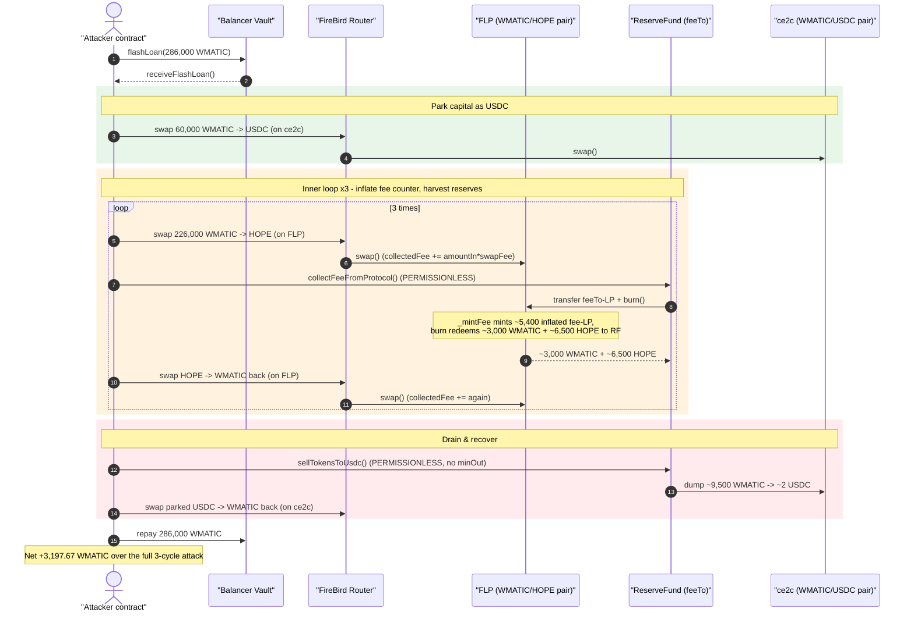
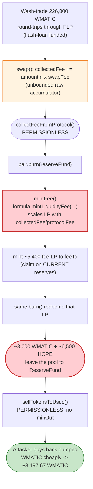
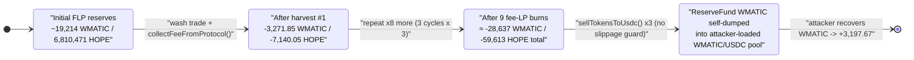

# FireBird Finance Exploit — Manipulable Protocol-Fee LP Mint Drains the WMATIC/HOPE Pool

> **Reproduction:** the PoC compiles & runs in an isolated Foundry project at
> [this project folder](.) (the umbrella DeFiHackLabs repo
> contains many unrelated PoCs that fail to whole-compile, so this one was extracted).
> Full verbose trace: [output.txt](output.txt).
> Verified vulnerable source: [FireBirdPair.sol](sources/FireBirdPair_5e9cd0/FireBirdPair.sol)
> and the `ReserveFund` proxy [UpgradableProxy.sol](sources/UpgradableProxy_5D53C9/UpgradableProxy.sol).

---

## Key info

| | |
|---|---|
| **Loss** | ~3,197.67 WMATIC profit in this tx (≈ part of ~8,536 MATIC total across the campaign) |
| **Vulnerable contract** | `FireBirdPair` (WMATIC/HOPE LP, "FLP") — [`0x5E9cd0861F927ADEccfEB2C0124879b277Dd66aC`](https://polygonscan.com/address/0x5e9cd0861f927adeccfeb2c0124879b277dd66ac#code) |
| **Co-vulnerable contract** | `FirebirdReserveFund` proxy — [`0x5D53C9F5017198333C625840306D7544516618e4`](https://polygonscan.com/address/0x5D53C9F5017198333C625840306D7544516618e4) (impl `0xd01224268A0f2FF5659A14AF96051701070a1211`) |
| **Victim pool(s)** | WMATIC/HOPE FLP `0x5E9cd0…66aC`; WMATIC/USDC FLP `0xCe2cB67b11ec0399E39AF20433927424f9033233` |
| **Attacker EOA** | [`0x8e83cd1bad00cf933b86214aaaab4db56abf68aa`](https://polygonscan.com/address/0x8e83cd1bad00cf933b86214aaaab4db56abf68aa) |
| **Attacker contract** | [`0x22b1a115b16395e5ebd50f4f82aef3a159e1c6d1`](https://polygonscan.com/address/0x22b1a115b16395e5ebd50f4f82aef3a159e1c6d1) |
| **Attack tx** | [`0x96d80c609f7a39b45f2bb581c6ba23402c20c2b6cd528317692c31b8d3948328`](https://polygonscan.com/tx/0x96d80c609f7a39b45f2bb581c6ba23402c20c2b6cd528317692c31b8d3948328) |
| **Chain / block / date** | Polygon / fork at 48,149,137 (tx in 48,149,138) / Sep 2023 |
| **Compiler** | Pair: Solidity v0.5.16 (opt, 999999 runs); ReserveFund impl: v0.6.12 |
| **Bug class** | Manipulable protocol-fee accounting → inflated fee-LP mint → permissionless reserve drain (flash-loan amplified) |

---

## TL;DR

FireBird's AMM accrues a protocol fee not as an instantaneous skim, but as a running counter
(`collectedFee0` / `collectedFee1`) accumulated **inside every `swap()`**
([FireBirdPair.sol:536-545](sources/FireBirdPair_5e9cd0/FireBirdPair.sol#L536-L545)). When liquidity
is later added or removed, `_mintFee()` converts those collected fees into freshly-minted LP tokens
sent to the factory's `feeTo` address, via the external `formula.mintLiquidityFee(...)`
([FireBirdPair.sol:447-463](sources/FireBirdPair_5e9cd0/FireBirdPair.sol#L447-L463)).

The factory's `feeTo` is the **`FirebirdReserveFund`** contract, which exposes a **permissionless**
`collectFeeFromProtocol()` that: (1) triggers a pool `burn()` so `_mintFee()` runs and mints the
protocol-fee LP to itself, and (2) immediately redeems that LP back into real WMATIC + HOPE reserves.
It also exposes a permissionless `sellTokensToUsdc()` that market-sells the harvested WMATIC with **no
slippage protection**.

Because `collectedFee` is just an accumulator that grows with raw swap volume, an attacker can wash-trade
a flash-loaned 226,000 WMATIC back and forth through the pool to balloon `collectedFee` to ~13,000-token
scale, then call `collectFeeFromProtocol()` to mint ~5,200–5,800 FLP of "protocol fee" and burn it for
**~3,000+ WMATIC and ~6,500 HOPE of *genuine* pool reserves per call**. Repeating this 9 times over 3
flash-loan cycles harvests ~28,600 WMATIC + ~59,600 HOPE of LP value into the ReserveFund, which then
self-dumps the WMATIC; the attacker buys it all back cheaply on the thin WMATIC/USDC pair and walks away
with **3,197.67 WMATIC** profit.

---

## Background — what FireBird is

FireBird Finance is a Balancer/Uniswap-V2-style weighted AMM on Polygon. The relevant pieces:

- **`FireBirdPair`** ([source](sources/FireBirdPair_5e9cd0/FireBirdPair.sol)) — a Uniswap-V2-derived
  pair with configurable token weights and swap fee. Unlike vanilla V2, its protocol fee is taken as an
  **accumulated token counter** inside `swap()`, not as a √k growth measurement.
- **`FireBirdRouter`** ([`0xb31D1B…`](sources/FireBirdRouter_b31D1B/_meta.json)) — multi-DEX router; the
  attacker calls `swapExactTokensForTokens(tokenIn, tokenOut, …, path=[pair], dexIds=[1], …)` to swap
  directly against a chosen pair.
- **`FirebirdReserveFund`** — an `UpgradableProxy`
  ([source](sources/UpgradableProxy_5D53C9/UpgradableProxy.sol)) delegating to impl
  `0xd01224268A0f2FF5659A14AF96051701070a1211`. It is set as the factory `feeTo`
  ([trace L247-248](output.txt)), so all protocol-fee LP is minted to it. It exposes:
  - `collectFeeFromProtocol()` — iterates over a list of pairs, transfers its own LP balance into each
    pair and calls `pair.burn(reserveFund)` to redeem the protocol-fee LP into underlying tokens.
  - `sellTokensToUsdc()` — market-sells the WMATIC (and other tokens) it has harvested into USDC, with
    no `amountOutMin`.

On-chain state at the fork block (read from the trace):

| Parameter | Value |
|---|---|
| WMATIC/HOPE pair (`FLP`) reserves | reserve0 (WMATIC) ≈ **19,214**, reserve1 (HOPE) ≈ **6,810,471** ([trace L150](output.txt)) |
| WMATIC/USDC pair (`ce2c_FBP`) reserves | reserve0 (WMATIC) ≈ **1,361**, reserve1 (USDC) ≈ **713.5** ([trace L92](output.txt)) |
| FLP swap fee | `20` (0.20%) ([trace L169](output.txt)) |
| factory `feeTo` | `0xEf7E3401f70aE2e49E3D2af0A30d2978A059cd7b` ([trace L247](output.txt)) |
| factory `protocolFee` | `0x2710` = **10000** ([trace L249](output.txt)) |
| Balancer flash-loaned WMATIC | **286,000** WMATIC, fee 0 ([trace L77](test/FireBirdPair_exp.sol#L77) / FlashLoan event) |

---

## The vulnerable code

### 1. Swap accumulates a raw fee counter

Every swap adds `amountIn × swapFee` to `collectedFee0`/`collectedFee1`:

```solidity
// FireBirdPair.sol, inside swap()
if (amount0In > 0) {
    uint amount0InFee = amount0In.mul(swapFee);
    balance0Adjusted = balance0Adjusted.sub(amount0InFee);
    collectedFee0 = uint112(uint(collectedFee0).add(amount0InFee)); // ⚠️ unbounded accumulator
}
if (amount1In > 0) {
    uint amount1InFee = amount1In.mul(swapFee);
    balance1Adjusted = balance1Adjusted.sub(amount1InFee);
    collectedFee1 = uint112(uint(collectedFee1).add(amount1InFee)); // ⚠️ grows with raw volume
}
```
([FireBirdPair.sol:536-545](sources/FireBirdPair_5e9cd0/FireBirdPair.sol#L536-L545))

`collectedFee` is a running sum of (input × fee) and is **never bounded relative to reserves**. Wash
trades that net out the price still pump this counter on every leg.

### 2. `_mintFee` turns the counter into LP minted to `feeTo`

```solidity
function _mintFee(uint112 _reserve0, uint112 _reserve1) private returns (bool feeOn) {
    address feeTo = IFireBirdFactory(factory).feeTo();
    uint112 protocolFee = uint112(IFireBirdFactory(factory).protocolFee());
    feeOn = feeTo != address(0);
    (uint112 _collectedFee0, uint112 _collectedFee1) = getCollectedFees();
    if (protocolFee > 0 && feeOn && (_collectedFee0 > 0 || _collectedFee1 > 0)) {
        uint32 _tokenWeight0 = tokenWeight0;
        uint liquidity = IFireBirdFormula(formula).mintLiquidityFee(   // ⚠️ external formula
            totalSupply, _reserve0, _reserve1,
            _tokenWeight0, 100 - _tokenWeight0,
            _collectedFee0 / protocolFee, _collectedFee1 / protocolFee // ⚠️ scales with collectedFee
        );
        if (liquidity > 0) _mint(feeTo, liquidity);                    // ⚠️ mint LP to feeTo
    }
    if (_collectedFee0 > 0) collectedFee0 = 0;
    if (_collectedFee1 > 0) collectedFee1 = 0;
}
```
([FireBirdPair.sol:447-463](sources/FireBirdPair_5e9cd0/FireBirdPair.sol#L447-L463))

`_mintFee` runs at the start of both `mint()` and `burn()`
([FireBirdPair.sol:471](sources/FireBirdPair_5e9cd0/FireBirdPair.sol#L471) and
[:496](sources/FireBirdPair_5e9cd0/FireBirdPair.sol#L496)). The amount of LP minted is proportional to
the **collected-fee token amounts** the attacker just inflated. The LP minted (`liquidity`) represents a
claim on the pool's *current reserves* — so by inflating `collectedFee`, the attacker mints an
out-sized claim on real liquidity.

### 3. `feeTo` (ReserveFund) is permissionlessly harvestable

`collectFeeFromProtocol()` and `sellTokensToUsdc()` on the ReserveFund proxy
([UpgradableProxy.sol](sources/UpgradableProxy_5D53C9/UpgradableProxy.sol) → impl
`0xd01224…`) have **no access control** — anyone can invoke them. `collectFeeFromProtocol()`:

1. Reads `feeTo`'s FLP balance ([trace L460](output.txt)),
2. `FLP.transfer(pair, balance)` then `pair.burn(reserveFund)` ([trace L462-468](output.txt)),
   which runs `_mintFee` (minting fresh fee-LP) and then redeems the transferred LP for underlying.

So the attacker never needs to be `feeTo`: they just inflate the fee counter, then let the
permissionless harvester mint-and-burn the inflated fee-LP into real WMATIC/HOPE for the ReserveFund,
and finally let `sellTokensToUsdc()` dump that WMATIC into a thin pool the attacker controls.

---

## Root cause — why it was possible

A correct AMM protocol fee must be a **small fraction of accrued trading fees**, fixed at the moment of
accrual and bounded by them. FireBird instead:

1. **Accumulates fees as an unbounded raw counter** (`collectedFee += amountIn·swapFee`) that scales with
   *gross* swap volume, not net economic activity. Flash-loaned wash trading inflates it arbitrarily for
   ~zero cost (the round trip only pays the 0.20% fee, which is itself recycled into the counter).
2. **Mints LP proportional to that counter** through an external `formula.mintLiquidityFee`, giving the
   `feeTo` a claim on the pool's reserves that grows with the manipulated counter rather than with honest
   fee earnings.
3. **Exposes the fee LP through a permissionless harvester** (`collectFeeFromProtocol`) that mints and
   burns it in one shot, converting the inflated paper claim into real WMATIC + HOPE.
4. **Self-dumps the harvested WMATIC with no slippage guard** (`sellTokensToUsdc`), and the attacker
   pre-positions the WMATIC/USDC pool so they recover that WMATIC cheaply.

The composition of (1)+(2)+(3) is the core flaw: *fee-LP minting is a function of attacker-controllable
input and is redeemable by an attacker-callable function for genuine pool reserves.* The fee counter
should have been bounded by, and derived from, the √k fee-growth measurement used by canonical
Uniswap-V2, not by raw input volume.

---

## Preconditions

- A `FireBirdPair` whose factory `protocolFee > 0` and whose `feeTo` is the `FirebirdReserveFund`
  (true at the fork block: `feeTo = 0xEf7E3401…`, `protocolFee = 10000`).
- Working capital in WMATIC to wash-trade the WMATIC/HOPE pool and inflate `collectedFee`. The attack
  uses a **Balancer flash loan of 286,000 WMATIC** ([trace L77](test/FireBirdPair_exp.sol#L77)), fully
  repaid in-transaction — so the attack is effectively self-funded.
- Permissionless reachability of `ReserveFund.collectFeeFromProtocol()` and
  `ReserveFund.sellTokensToUsdc()` (both callable by anyone in the trace).
- A thin secondary pool (WMATIC/USDC `ce2c_FBP`, ~1,361 WMATIC / ~713 USDC) used to (a) park WMATIC as
  USDC during the wash phase and (b) buy back the WMATIC the ReserveFund dumps.

---

## Attack walkthrough (with on-chain numbers from the trace)

The PoC's structure ([FireBirdPair_exp.sol:84-107](test/FireBirdPair_exp.sol#L84-L107)):

- `receiveFlashLoan` runs `WMATIC_HOPE_PairSwap()` **3 times** ([L90-92](test/FireBirdPair_exp.sol#L90-L92)),
  then repays the 286,000 WMATIC loan.
- Each `WMATIC_HOPE_PairSwap()`:
  1. Swaps **60,000 WMATIC → USDC** on `ce2c_FBP` (parks capital as USDC) ([L98](test/FireBirdPair_exp.sol#L98)).
  2. Runs an **inner loop ×3** of: swap **226,000 WMATIC → HOPE** on `FLP` →
     `collectFeeFromProtocol()` → swap the HOPE back to WMATIC ([L99-103](test/FireBirdPair_exp.sol#L99-L103)).
  3. Calls `sellTokensToUsdc()` (ReserveFund dumps harvested WMATIC → USDC) ([L104](test/FireBirdPair_exp.sol#L104)).
  4. Swaps the parked **USDC → WMATIC** back on `ce2c_FBP` ([L105](test/FireBirdPair_exp.sol#L105)).

So there are **3 × 3 = 9** `collectFeeFromProtocol()` calls and **3** `sellTokensToUsdc()` calls — exactly
what the trace shows.

### Per-`collectFeeFromProtocol` harvest (the 9 reserve drains)

Each call inflates the fee counter via the surrounding 226k-WMATIC round trip, then mints fee-LP and
burns it for real reserves. Verified from the `Burn` events (`amount0 = WMATIC`, `amount1 = HOPE`):

| # | Trace line | Fee-LP minted to feeTo | WMATIC drained | HOPE drained |
|---|-----------:|-----------------------:|---------------:|-------------:|
| 1 | [L253/L277](output.txt) | 5,435.30 FLP | 3,271.85 | 7,140.05 |
| 2 | [L481/L505](output.txt) | 5,177.93 FLP | 3,178.15 | 6,974.11 |
| 3 | [L709/L733](output.txt) | 5,209.40 FLP | 2,989.52 | 6,596.65 |
| 4 | [L1122/L1146](output.txt) | 5,413.86 FLP | 3,073.36 | 6,361.34 |
| 5 | [L1350/L1374](output.txt) | 5,464.50 FLP | 3,151.82 | 6,560.16 |
| 6 | [L1578/L1602](output.txt) | 5,501.65 FLP | 3,139.04 | 6,570.05 |
| 7 | [L1991/L2015](output.txt) | 5,722.48 FLP | 3,227.37 | 6,335.01 |
| 8 | [L2219/L2243](output.txt) | 5,779.32 FLP | 3,310.12 | 6,533.88 |
| 9 | [L2447/L2471](output.txt) | 5,822.80 FLP | 3,296.07 | 6,542.62 |
| | **Total** | **≈49,527 FLP** | **≈28,637 WMATIC** | **≈59,613 HOPE** |

**Smoking gun — the inflated fee-LP claim:** in cycle 1, `mintLiquidityFee(...)` is called with
`collectedFee1/protocolFee = 13,325.4` (HOPE-scale) and `collectedFee0/protocolFee = 453.99`
([trace L251](output.txt)) and returns **5,435 FLP**, which is immediately burned for 3,271.85 WMATIC +
7,140.05 HOPE — i.e. the "protocol fee" for one batch of swaps is redeemed for thousands of WMATIC of
genuine reserves. Cycle 2 then reads `feeTo`'s FLP balance as exactly **5,435.30**
([trace L460](output.txt) vs L253), proving the harvester is consuming the previously-minted
inflated fee-LP, not honest accrued fees.

### Per-`sellTokensToUsdc` dump (no slippage protection)

The ReserveFund market-sells its accumulated WMATIC into the thin WMATIC/USDC pool with no
`amountOutMin`:

| # | Trace line | WMATIC sold by ReserveFund | USDC received |
|---|-----------:|---------------------------:|--------------:|
| 1 | [L889](output.txt) | 9,503.12 | 2.125 USDC |
| 2 | [L1758](output.txt) | 9,364.22 | 2.110 USDC |
| 3 | [L2627](output.txt) | 9,833.56 | 2.214 USDC |

The WMATIC the ReserveFund dumps is being pushed into a pool the attacker has already loaded with WMATIC
(via the 60k WMATIC→USDC park), so the ReserveFund sells at a terrible rate (~9,500 WMATIC for ~2 USDC),
and the attacker's parked USDC buys back a large WMATIC slug — funnelling the harvested LP value to the
attacker.

### Net result

The flash loan of 286,000 WMATIC is repaid in full; the attacker ends with **3,197.670133537860835704
WMATIC** more than it started ([trace L_tail](output.txt), `Attack Exploit: 3197.670…`).

---

## Profit/loss accounting

| Item | Amount |
|---|---|
| Balancer flash loan (borrowed, repaid same tx, fee 0) | 286,000 WMATIC |
| WMATIC value drained out of FLP reserves via 9 fee-LP burns | ≈28,637 WMATIC |
| HOPE drained out of FLP reserves via 9 fee-LP burns | ≈59,613 HOPE |
| WMATIC self-dumped by ReserveFund into the attacker-loaded pool | ≈28,701 WMATIC (3 sells) |
| **Net attacker profit (this tx)** | **+3,197.67 WMATIC** |

The harvested HOPE plus the round-trip price impact on both pools nets down to the realized 3,197.67
WMATIC. The headline campaign figure (~8,536 MATIC) spans multiple transactions; this analysis covers the
single reproduced tx (3,197.67 WMATIC).

---

## Diagrams

### Sequence of one flash-loan cycle



### How the inflated fee-LP becomes a reserve drain



### FLP reserve evolution (WMATIC side, across the 9 harvests)



---

## Why each magic number

- **286,000 WMATIC flash loan** ([test L53](test/FireBirdPair_exp.sol#L53)): the working capital. 60,000
  is parked as USDC each cycle and 226,000 is wash-traded through FLP — together sized to push
  `collectedFee` high enough that each `mintLiquidityFee` mints ~5,400 fee-LP.
- **226,000 WMATIC per inner swap** ([test L97](test/FireBirdPair_exp.sol#L97)): large enough that the
  0.20% fee accumulated on each leg dominates the fee counter; round-tripping HOPE→WMATIC keeps net
  inventory roughly flat while re-pumping the counter.
- **60,000 WMATIC → USDC park** ([test L98](test/FireBirdPair_exp.sol#L98)): pre-loads the thin
  WMATIC/USDC pool so that when the ReserveFund dumps ~9,500 WMATIC with no `amountOutMin`, the
  attacker's parked USDC buys that WMATIC back at a steep discount.
- **9 harvests / 3 dumps**: 3 outer flash-loan cycles × 3 inner harvests, then one dump per cycle — the
  structure that maximizes total fee-LP minted within one flash loan.

---

## Remediation

1. **Do not derive protocol-fee LP from a raw, attacker-pumpable counter.** Use the canonical
   Uniswap-V2 √k fee-growth measurement (`rootK` vs `rootKLast`) so the protocol fee reflects *net*
   value growth of the pool, which wash trades cannot inflate (round trips don't grow √k beyond the fee
   actually paid).
2. **Bound the minted fee-LP.** Cap `mintLiquidityFee` output so a single accrual can never represent
   more than a tiny fraction of `totalSupply` / reserves; reject mints that would redeem for more than
   the fees genuinely accrued.
3. **Gate the harvester.** `collectFeeFromProtocol()` and `sellTokensToUsdc()` on the ReserveFund must be
   restricted to a trusted keeper/role, and must not be invokable in the same transaction as the swaps
   that produced the fees (e.g., enforce a one-block delay between fee accrual and harvest).
4. **Add slippage protection to `sellTokensToUsdc()`.** Require a sane `amountOutMin` (oracle/TWAP-based)
   so the ReserveFund cannot be made to dump assets into a manipulated pool for ~0 proceeds.
5. **Reset `collectedFee` atomically with accrual semantics.** Ensure the counter cannot be re-pumped and
   harvested repeatedly within one transaction; consider accruing protocol fees only on `mint`/`burn`
   triggered by liquidity events, not on every swap.

---

## How to reproduce

The PoC was extracted into a standalone Foundry project (the umbrella DeFiHackLabs repo has many
unrelated PoCs that fail to compile under a whole-project `forge build`):

```bash
_shared/run_poc.sh 2023-09-FireBirdPair_exp --mt testExploit -vvvvv
```

- RPC: a **Polygon archive** endpoint is required (the fork block 48,149,137 is historical). `foundry.toml`
  is configured with a `polygon` alias; most public Polygon RPCs prune state at this depth and will fail
  with `missing trie node` / `header not found`.
- Result: `[PASS] testExploit()` with `Attack Exploit: 3197.670133537860835704 MATIC`.

Expected tail:

```
Ran 1 test for test/FireBirdPair_exp.sol:ContractTest
[PASS] testExploit() (gas: 3543523)
Logs:
  Before Start: 0 MATIC
  Attack Exploit: 3197.670133537860835704 MATIC
...
Suite result: ok. 1 passed; 0 failed; 0 skipped
```

---

*Reference: DeFiHackLabs — FireBird Finance (Polygon, Sep 2023). Attacker EOA
`0x8e83cd1bad00cf933b86214aaaab4db56abf68aa`, tx
`0x96d80c609f7a39b45f2bb581c6ba23402c20c2b6cd528317692c31b8d3948328`.*
