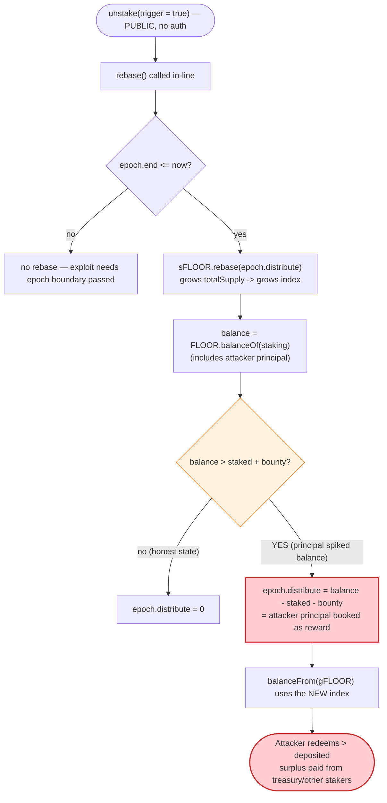
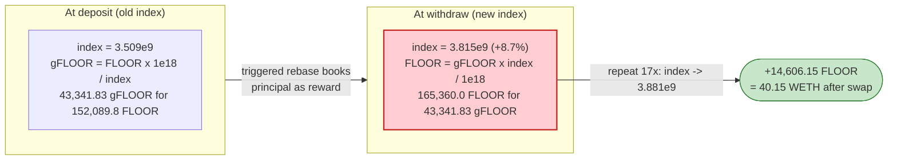

# FloorDAO Exploit — Self-Donated Rebase Inflates the Staking `index`, Over-Paying gFLOOR Redemptions

> **Reproduction:** the PoC compiles & runs in an isolated Foundry project at
> [this project folder](.) (the umbrella DeFiHackLabs repo contains many unrelated
> PoCs that do not whole-compile, so this one was extracted).
> Full verbose trace: [output.txt](output.txt).
> Verified vulnerable sources: [FloorStaking](sources/FloorStaking_759c6D/contracts_Staking.sol),
> [sFLOOR](sources/sFLOOR_164AFe/contracts_sFloorERC20.sol),
> [gFLOOR](sources/gFLOOR_b1Cc59/contracts_governance_gFLOOR.sol).

---

## Key info

| | |
|---|---|
| **Loss** | ~**40.15 WETH** (~$64K at the time) — drained from the FLOOR/WETH UniswapV3 pool |
| **Vulnerable contract** | `FloorStaking` — [`0x759c6De5bcA9ADE8A1a2719a31553c4B7DE02539`](https://etherscan.io/address/0x759c6De5bcA9ADE8A1a2719a31553c4B7DE02539#code) |
| **Vulnerable dependency** | `sFLOOR` rebase token — [`0x164AFe96912099543BC2c48bb9358a095Db8e784`](https://etherscan.io/address/0x164AFe96912099543BC2c48bb9358a095Db8e784#code) |
| **Victim pool** | FLOOR/WETH UniV3 1% pool — `0xB386c1d831eED803F5e8F274A59C91c4C22EEAc0` |
| **Liquidity source for flash** | same UniV3 pool (`flash()` of all its FLOOR) |
| **Attacker EOA** | [`0x4453aed57c23a50d887a42ad0cd14ff1b819c750`](https://etherscan.io/address/0x4453aed57c23a50d887a42ad0cd14ff1b819c750) |
| **Attacker contract** | [`0x6ce5a85cff4c70591da82de5eb91c3fa38b40595`](https://etherscan.io/address/0x6ce5a85cff4c70591da82de5eb91c3fa38b40595) |
| **Attack tx** | [`0x1274b32d4dfacd2703ad032e8bd669a83f012dde9d27ed92e4e7da0387adafe4`](https://explorer.phalcon.xyz/tx/eth/0x1274b32d4dfacd2703ad032e8bd669a83f012dde9d27ed92e4e7da0387adafe4) |
| **Chain / block / date** | Ethereum / 18,068,772 / Sep 5, 2023 |
| **Compiler** | `FloorStaking` v0.7.5, optimizer 200 runs (OlympusDAO V2 fork) |
| **Bug class** | Rebase-accounting manipulation — staked principal mis-counted as reward profit, inflating the share `index` |

---

## TL;DR

`FloorStaking` is an OlympusDAO-V2 fork. Stakers can hold their position either as `sFLOOR`
(a rebasing token, balance grows each epoch) or as `gFLOOR` (a non-rebasing "wrapped" token whose
FLOOR value is tracked by an ever-growing `index`). The exploit abuses the `index`:

1. The attacker **flash-borrows essentially the entire FLOOR supply** (152,089.8 FLOOR) from the
   FLOOR/WETH UniV3 pool and stakes it into `FloorStaking` choosing `_rebasing = false`, receiving
   `gFLOOR` priced at the *current* index.
2. The attacker immediately calls `unstake(..., _trigger = true, _rebasing = false)`. The
   `_trigger = true` flag makes `unstake` call `rebase()`
   ([Staking.sol:178-179](sources/FloorStaking_759c6D/contracts_Staking.sol#L178-L179)).
3. `rebase()`'s reward math is `epoch.distribute = FLOOR.balanceOf(staking) − circulatingSupply`
   ([Staking.sol:233-239](sources/FloorStaking_759c6D/contracts_Staking.sol#L233-L239)). Because the
   attacker just deposited ~all FLOOR, the contract's FLOOR balance vastly exceeds the staked
   (`sFLOOR`) supply, so the *attacker's own principal* is booked as a giant "reward" and distributed
   to `sFLOOR` holders on the next rebase — **bumping the `index`**.
4. `gFLOOR → FLOOR` redemption is `balanceFrom(g) = g · index / 1e18`
   ([gFLOOR.sol:114-116](sources/gFLOOR_b1Cc59/contracts_governance_gFLOOR.sol#L114-L116)). The
   attacker minted `gFLOOR` at the *old* index but redeems at the *new, inflated* index, so it
   withdraws **more FLOOR than it deposited**.
5. Repeat 17×. The index climbs `3.509e9 → 3.881e9` (≈ +10.6%) and the attacker walks away with
   **14,606.1 FLOOR** of pure profit after repaying the flash loan + fee, then swaps it for
   **40.15 WETH**.

The root flaw is the OlympusDAO "staking principal vs. reward" confusion: `rebase()` cannot
distinguish *new staked principal* from *yield earned by the treasury*, and `unstake` lets the caller
trigger that rebase **in the same transaction** after loading the contract with borrowed principal.

---

## Background — FloorDAO's OlympusDAO-V2 staking

FLOOR (9-decimal) can be staked for one of two receipt tokens:

- **`sFLOOR`** — a rebasing token (9 decimals). 1 `sFLOOR` ≈ 1 FLOOR, and balances grow each epoch as
  the treasury distributes rewards. Internally it tracks "gons"; rebasing multiplies everyone's gon
  balance up.
- **`gFLOOR`** — a non-rebasing governance token (18 decimals). Its FLOOR value is tracked by an
  `index`. The conversions are
  - mint (FLOOR → gFLOOR): `balanceTo(a) = a · 1e18 / index`
    ([gFLOOR.sol:123-125](sources/gFLOOR_b1Cc59/contracts_governance_gFLOOR.sol#L123-L125))
  - redeem (gFLOOR → FLOOR): `balanceFrom(g) = g · index / 1e18`
    ([gFLOOR.sol:114-116](sources/gFLOOR_b1Cc59/contracts_governance_gFLOOR.sol#L114-L116))

The `index` itself is derived from `sFLOOR` rebase growth — `gFLOOR.index()` simply forwards to
`sFLOOR.index()` ([gFLOOR.sol:105-107](sources/gFLOOR_b1Cc59/contracts_governance_gFLOOR.sol#L105-L107),
[sFLOOR.sol:279-281](sources/sFLOOR_164AFe/contracts_sFloorERC20.sol#L279-L281)). Each rebase grows
`sFLOOR._totalSupply`, which grows the index, which raises the FLOOR redeemed per `gFLOOR`.

On-chain state at fork block 18,068,772 (read from the trace):

| Parameter | Value | Source |
|---|---|---|
| `index` at start | `3,509,076,800` (3.509 in 9-dec terms) | [output.txt:81](output.txt) |
| `epoch.number` | 1322, length 28,800 s (8 h) | [output.txt:135](output.txt) |
| FLOOR held by staking contract | 1,356,712,874,641,176 (1.357M FLOOR) | [output.txt:43](output.txt) |
| FLOOR in the UniV3 pool (flash source) | 152,089,813,098,499 (152,089.8 FLOOR) | [output.txt:38](output.txt) |
| WETH in the UniV3 pool (the prize) | 535.25 WETH | [output.txt:34](output.txt) |
| gFLOOR `totalSupply` | 337,812.48 gFLOOR | [output.txt:78](output.txt) |

---

## The vulnerable code

### 1. `unstake` lets the caller trigger a rebase in-line, then redeems gFLOOR at the new index

[`FloorStaking.unstake`](sources/FloorStaking_759c6D/contracts_Staking.sol#L170-L191):

```solidity
function unstake(address _to, uint256 _amount, bool _trigger, bool _rebasing)
    external returns (uint256 amount_)
{
    amount_ = _amount;
    uint256 bounty;
    if (_trigger) {
        bounty = rebase();              // ⚠️ attacker-controlled: fires a rebase NOW
    }
    if (_rebasing) {
        sFLOOR.safeTransferFrom(msg.sender, address(this), _amount);
        amount_ = amount_.add(bounty);
    } else {
        gFLOOR.burn(msg.sender, _amount);             // burn gFLOOR
        amount_ = gFLOOR.balanceFrom(_amount).add(bounty); // ⚠️ priced at the POST-rebase index
    }
    require(amount_ <= FLOOR.balanceOf(address(this)), "Insufficient FLOOR balance in contract");
    FLOOR.safeTransfer(_to, amount_);
}
```

### 2. `rebase` books contract FLOOR balance minus staked supply as "reward to distribute"

[`FloorStaking.rebase`](sources/FloorStaking_759c6D/contracts_Staking.sol#L221-L242):

```solidity
function rebase() public returns (uint256) {
    uint256 bounty;
    if (epoch.end <= block.timestamp) {
        sFLOOR.rebase(epoch.distribute, epoch.number);   // apply LAST epoch's distribute → grows index
        epoch.end = epoch.end.add(epoch.length);
        epoch.number++;
        if (address(distributor) != address(0)) {
            distributor.distribute();
            bounty = distributor.retrieveBounty();
        }
        uint256 balance = FLOOR.balanceOf(address(this)); // ⚠️ includes attacker's just-deposited principal
        uint256 staked  = sFLOOR.circulatingSupply();
        if (balance <= staked.add(bounty)) {
            epoch.distribute = 0;
        } else {
            epoch.distribute = balance.sub(staked).sub(bounty); // ⚠️ principal mis-booked as reward
        }
    }
    return bounty;
}
```

The protocol's intended invariant is "FLOOR held by the staking contract beyond the staked sFLOOR
supply is yield the treasury earned, so distribute it." That assumption is **false the instant a user
deposits**, because the deposit transiently makes `balance ≫ staked`. The deposit path
([`stake`, Staking.sol:88-115](sources/FloorStaking_759c6D/contracts_Staking.sol#L88-L115)) pulls the
FLOOR in *before* anyone can re-measure, and `_rebasing = false` mints `gFLOOR` whose redemption value
is governed by the very index this surplus will inflate.

### 3. The conversion asymmetry that turns the index bump into profit

```solidity
// gFLOOR.sol — mint at index_old, redeem at index_new
function balanceTo(uint256 a)   returns (uint256) { return a * 1e18 / index(); }  // deposit
function balanceFrom(uint256 g) returns (uint256) { return g * index() / 1e18;  } // withdraw
```

If `index` rises by factor `r` between deposit and withdraw, then
`balanceFrom(balanceTo(a)) = a · index_new / index_old = a · r > a`. The extra FLOOR is paid out of
the contract's balance, i.e. ultimately out of other stakers' and the treasury's FLOOR.

---

## Root cause

`rebase()` defines reward as `contractBalance − stakedSupply`. This conflates two economically
opposite quantities:

- **Treasury yield** (FLOOR minted/sent to the staking contract as genuine reward) — *should* be
  distributed.
- **User-deposited principal** (FLOOR a staker just transferred in) — *must not* be distributed; it is
  owed back to that staker.

Because `stake()` transfers principal in and `unstake(_trigger=true)` re-runs `rebase()` in the same
call, an attacker can:

1. Spike `contractBalance` with borrowed principal,
2. Have `rebase()` book that spike as a reward and grow the share `index`, then
3. Redeem `gFLOOR` minted at the old index for FLOOR valued at the new index.

Four design facts compose into the exploit:

1. **`_trigger` is caller-controlled and permissionless.** Anyone can force a rebase at the exact
   moment the contract is loaded with their own principal.
2. **Reward = balance − staked is a snapshot of attacker-manipulable state.** Flash loans let the
   attacker make `balance` arbitrarily large for one transaction.
3. **gFLOOR mint/redeem use the live index with no per-position index anchor.** A position minted at
   `index_old` is redeemed at `index_new`; the protocol never records the index at which a given
   gFLOOR was created, so it cannot detect that the redemption over-pays.
4. **The flash-loan source is the very pool that holds the WETH prize.** The attacker borrows FLOOR
   from the FLOOR/WETH pool, profits in FLOOR, repays FLOOR + fee, and swaps the surplus FLOOR back
   into the pool's WETH — all atomically.

---

## Preconditions

- The staking contract must hold less FLOOR than it can be flash-spiked with, and the attacker must be
  able to make `contractBalance > circulatingSupply` after depositing — satisfied by flash-borrowing
  ~all FLOOR. The PoC's loop only proceeds while
  `balanceAttacker + balanceStaking > circulatingSupply`
  ([FloorDAO_exp.sol:63](test/FloorDAO_exp.sol#L63)) — i.e. while there is enough surplus to keep
  inflating the index.
- `epoch.end <= block.timestamp` so that `rebase()` actually advances an epoch and applies the
  previous `epoch.distribute`. In the live attack the epoch boundary had naturally passed; the PoC
  relies on the fork being past `epoch.end` at block 18,068,772.
- A FLOOR flash-loan source. The FLOOR/WETH UniV3 pool provides one via `flash()`, and conveniently
  also holds the WETH that becomes the realized profit.
- No warmup obstacle: `stake(..., _claim = true)` with `warmupPeriod == 0` sends the receipt
  immediately ([Staking.sol:96-97](sources/FloorStaking_759c6D/contracts_Staking.sol#L96-L97)).

---

## Step-by-step attack walkthrough (ground-truth numbers from the trace)

The attacker contract takes a FLOOR flash loan and, inside the callback, runs a 17-iteration
stake→unstake loop, each iteration nudging the index up. All figures below are read directly from
[output.txt](output.txt).

### Iteration 1 (representative — [output.txt:63-230](output.txt))

| # | Action | Concrete values | Effect |
|---|--------|-----------------|--------|
| 0 | **Flash-borrow FLOOR** from the UniV3 pool | `flash(amount1 = 152,089,813,098,498)` = 152,089.8 FLOOR ([:30](output.txt)) | Attacker holds ~all FLOOR. |
| 1 | `stake(152,089.8 FLOOR, _rebasing=false, _claim=true)` | inner `rebase(0,1322)`: epoch advances, **index unchanged 3,509,076,800**; mints `gFLOOR = 152089813098498·1e18/3509076800 =` **43,341,830,848,073,202,615,571** (43,341.83 gFLOOR) ([:122-123](output.txt)) | gFLOOR minted at the OLD index. `rebase` sets `epoch.distribute = balance−staked = 1,509,196,738,915,154 − 1,375,877,722,515,691 =` **133,319,016,399,463** ([:106-118](output.txt)). |
| 2 | `unstake(43,341.83 gFLOOR, _trigger=true, _rebasing=false)` | inner `rebase(133319016399463, 1323)` applies the surplus → **index jumps 3,509,076,800 → 3,815,252,590** ([:163](output.txt)); `balanceFrom(43,341.83 gFLOOR) = 43341830848073202615571·3815252590/1e18 =` **165,360,032,398,453** = 165,360.0 FLOOR ([:214-217,:220](output.txt)) | Redeemed at the NEW index. Deposited 152,089.8 FLOOR, received **165,360.0 FLOOR** → **+13,270.2 FLOOR** in one pass. |

The index ratio `3,815,252,590 / 3,509,076,800 = 1.08725` exactly matches the FLOOR-out / FLOOR-in
ratio `165,360,032,398,453 / 152,089,813,098,498 = 1.08725` — confirming the entire gain is the index
inflation, to the wei.

### The 17-iteration loop ([FloorDAO_exp.sol:57-73](test/FloorDAO_exp.sol#L57-L73))

Each subsequent iteration re-stakes the (now larger) FLOOR balance and unstakes after another
triggered rebase. The surplus shrinks as the index converges, so the per-epoch rebaseAmount tapers:

| Epoch | rebaseAmount | index after | source |
|------:|-------------:|------------:|--------|
| 1322 | 0 | 3,509,076,800 | [:84](output.txt) |
| 1323 | 133,319,016,399,463 | 3,815,252,590 | [:163](output.txt) |
| 1325 | 14,058,617,247,638 | 3,847,539,119 | [:352](output.txt) |
| 1327 | 2,188,149,309,569 | 3,852,564,346 | [:541](output.txt) |
| … | … | … | |
| 1353 | 881,648,383,985 | 3,879,140,595 | (tail) |
| 1355 | 882,089,258,242 | 3,881,166,370 | (tail) |

Final index `3,881,166,370` vs start `3,509,076,800` ⇒ ≈ **+10.6%** cumulative inflation.

### Cash-out ([output.txt:3275-3308](output.txt))

- After repaying the flash loan (`flashAmount + fee1`, fee = 1% =
  1,520,898,130,985 FLOOR — [output.txt:72-end of flash](output.txt)) the attacker retains
  **14,606,145,072,279 = 14,606.15 FLOOR** ([:231,:3271](output.txt)).
- It then swaps that FLOOR into the same UniV3 pool: `Pool::swap(..., false, 14606145072279, ...)`
  returns **40,146,353,823,753,349,478 = 40.146 WETH** ([:3275-3308](output.txt)).

### Profit / loss accounting

| Item | Amount |
|---|---:|
| Flash-borrowed FLOOR | 152,089.8 FLOOR |
| Flash fee (1%) | 1,520.9 FLOOR |
| FLOOR repaid to pool | 153,610.7 FLOOR |
| FLOOR retained after loop | **14,606.15 FLOOR** |
| Final swap → WETH | **40.146 WETH** |
| **Net attacker profit** | **≈ 40.15 WETH** |

The 14,606 FLOOR profit is drawn from the staking contract's FLOOR balance — i.e. treasury reserves
and other stakers' principal — because the inflated index made the contract pay out more FLOOR than
the attacker ever deposited.

---

## Diagrams

### Sequence of one stake → unstake cycle

```mermaid
sequenceDiagram
    autonumber
    actor A as Attacker contract
    participant POOL as "FLOOR/WETH UniV3 pool"
    participant S as FloorStaking
    participant SF as "sFLOOR (rebase token)"
    participant GF as "gFLOOR (index token)"

    Note over POOL: holds ~all FLOOR (152,089.8)<br/>and 535 WETH
    A->>POOL: flash(152,089.8 FLOOR)
    activate A

    rect rgb(227,242,253)
    Note over A,GF: stake — mint gFLOOR at OLD index 3.509e9
    A->>S: stake(152,089.8 FLOOR, rebasing=false, claim=true)
    S->>S: rebase(): index unchanged<br/>but epoch.distribute = balance - staked = 133,319.0
    S->>GF: mint balanceTo(152,089.8) = 43,341.83 gFLOOR
    GF-->>A: 43,341.83 gFLOOR
    end

    rect rgb(255,235,238)
    Note over A,GF: unstake(trigger=true) — redeem at NEW index 3.815e9
    A->>S: unstake(43,341.83 gFLOOR, trigger=true, rebasing=false)
    S->>SF: rebase(133,319.0): apply surplus → index 3.509e9 -> 3.815e9
    S->>GF: burn 43,341.83 gFLOOR
    S->>A: FLOOR = balanceFrom(43,341.83) = 165,360.0
    Note over A: deposited 152,089.8 -> got 165,360.0<br/>(+13,270.2 FLOOR)
    end

    Note over A: repeat 17x, then repay flash + fee,<br/>swap 14,606.15 FLOOR -> 40.15 WETH
    A->>POOL: repay 153,610.7 FLOOR; swap surplus -> 40.15 WETH
    deactivate A
```

### Why the rebase over-pays (state view)



### Index inflation vs. the gFLOOR round-trip



---

## Remediation

1. **Never derive "reward" from a raw balance snapshot.** `rebase()` must compute distributable yield
   from an explicitly accounted source (treasury transfers, a dedicated reward escrow), not from
   `FLOOR.balanceOf(this) − stakedSupply`. As written, any FLOOR transferred in for any reason — a
   deposit in flight, a donation, a flash-loan spike — is mistaken for yield.
2. **Do not let `unstake`/`stake` trigger a rebase that prices the same call's redemption.** Either
   remove the caller-controllable `_trigger` rebase, or snapshot the index *before* processing the
   user's principal and use that snapshot for the mint/redeem in the same transaction.
3. **Anchor each gFLOOR position to the index at which it was created** (or require a warmup/epoch
   delay between stake and unstake), so a position minted at `index_old` cannot be redeemed at
   `index_new` within the same transaction.
4. **Settle deposits net of any in-flight rebase.** `stake` already does `_amount.add(rebase())` for
   the rebase *bounty*; the deeper fix is to ensure the deposited principal is excluded from the
   reward base used to compute the next `epoch.distribute`.
5. **Add a sanity invariant**: total FLOOR redeemable across all sFLOOR + gFLOOR holders must never
   exceed `FLOOR.balanceOf(staking)`; a single-transaction index move large enough to break this
   should revert. (This is the same class of bug that hit OlympusDAO V2-fork stakers historically.)

---

## How to reproduce

The PoC was extracted into a standalone Foundry project (the umbrella DeFiHackLabs repo has many
unrelated PoCs that fail to whole-compile under `forge test`):

```bash
_shared/run_poc.sh 2023-09-FloorDAO_exp --mt testExploit -vvvvv
```

- RPC: an **Ethereum archive** endpoint is required (fork block 18,068,772, Sep 2023). `foundry.toml`
  points `mainnet` at an Infura archive endpoint; any archive node serving historical state at that
  block works.
- Result: `[PASS] testExploit()`.

Expected tail (from [output.txt](output.txt)):

```
Ran 1 test for test/FloorDAO_exp.sol:FloorStakingExploit
[PASS] testExploit() (gas: 4864916)
Logs:
  floor token balance after exploit: 14606.145072279
  weth balance after swap: 40.146353823753349478

Suite result: ok. 1 passed; 0 failed; 0 skipped
```

---

*References: FloorDAO post-mortem — https://medium.com/floordao/floor-post-mortem-incident-summary-september-5-2023-e054a2d5afa4 ·
PeckShieldAlert — https://twitter.com/PeckShieldAlert/status/1698962105058361392*
