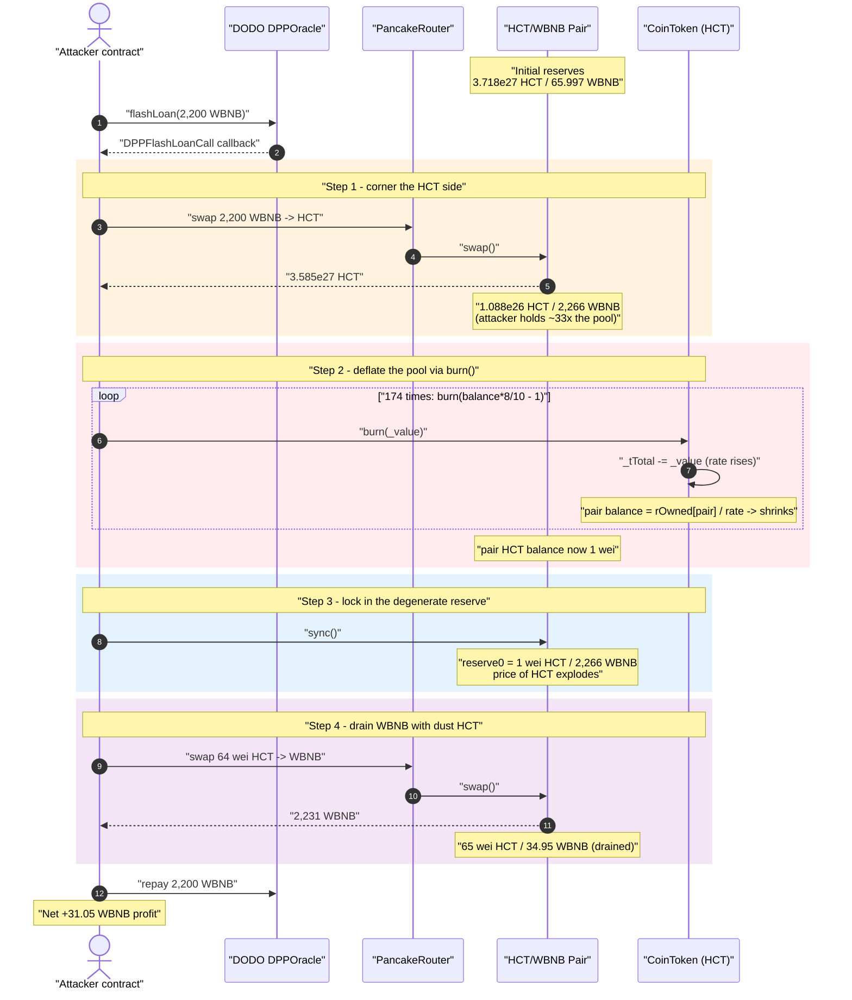
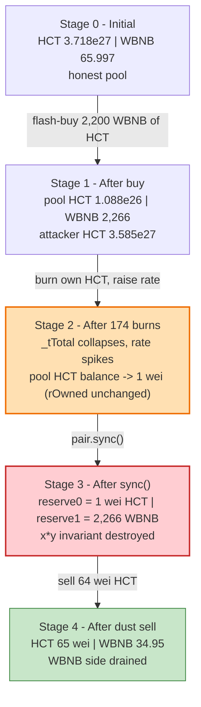
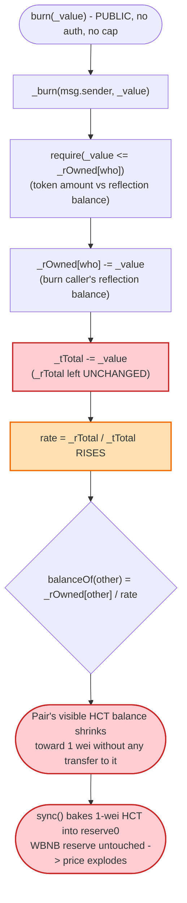
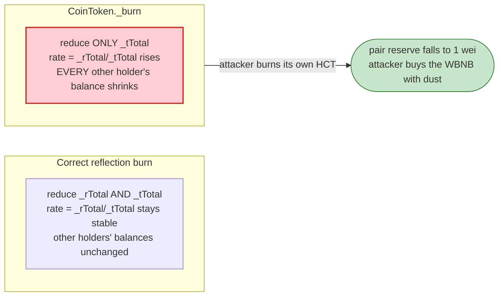

# HCT (CoinToken) Exploit — Reflection-Token `burn()` Deflates the Pool's Reserve to 1 wei

> **Reproduction:** the PoC compiles & runs in an isolated Foundry project at
> [this project folder](.) (the umbrella DeFiHackLabs repo contains many unrelated
> PoCs that do not whole-compile, so this one was extracted into its own project).
> Full verbose trace: [output.txt](output.txt).
> Verified vulnerable source: [CoinToken.sol](sources/CoinToken_0FDfcf/CoinToken.sol).

---

## Key info

| | |
|---|---|
| **Loss** | ~$8.6K — **31.05 WBNB** profit drained from the HCT/WBNB PancakeSwap pair |
| **Vulnerable contract** | `CoinToken` (HCT) — [`0x0FDfcfc398Ccc90124a0a41d920d6e2d0bD8CcF5`](https://bscscan.com/address/0x0FDfcfc398Ccc90124a0a41d920d6e2d0bD8CcF5#code) |
| **Victim pool** | HCT/WBNB PancakePair — [`0xdbE783014Cb0662c629439FBBBa47e84f1B6F2eD`](https://bscscan.com/address/0xdbE783014Cb0662c629439FBBBa47e84f1B6F2eD) |
| **Flash-loan source** | DODO `DPPOracle` — [`0xFeAFe253802b77456B4627F8c2306a9CeBb5d681`](https://bscscan.com/address/0xFeAFe253802b77456B4627F8c2306a9CeBb5d681) (2,200 WBNB) |
| **Attacker EOA** | [`0xc892d5576c65e5b0db194c1a28aa758a43bb42a5`](https://bscscan.com/address/0xc892d5576c65e5b0db194c1a28aa758a43bb42a5) |
| **Attacker contract** | [`0xd7a2fc756e1053b152f90990129f94c573e006fd`](https://bscscan.com/address/0xd7a2fc756e1053b152f90990129f94c573e006fd) |
| **Attack tx** | [`0x84bd77f25cc0db493c339a187c920f104a69f89053ab2deabb93c35220e6dfc0`](https://bscscan.com/tx/0x84bd77f25cc0db493c339a187c920f104a69f89053ab2deabb93c35220e6dfc0) |
| **Chain / block / date** | BSC / fork at 31,528,197 (`31_528_198 - 1`) / Sep 2023 |
| **Compiler (token)** | Solidity v0.8.3, optimizer 200 runs |
| **Bug class** | Reflection-token accounting flaw — `burn()` mixes r-space and t-space, deflating other holders' balances; AMM price manipulation |

---

## TL;DR

`CoinToken` (HCT) is a SafeMoon-style **reflection token**: every account's balance is stored as a
reflected amount `_rOwned[account]` and the *visible* balance is computed on the fly as
`_rOwned[account] / rate`, where `rate = _rTotal / _tTotal`
([CoinToken.sol:634-638](sources/CoinToken_0FDfcf/CoinToken.sol#L634-L638),
[:848-851](sources/CoinToken_0FDfcf/CoinToken.sol#L848-L851)).

Its public `burn(uint256 _value)` ([:669-671](sources/CoinToken_0FDfcf/CoinToken.sol#L669-L671)) calls an
internal `_burn` that is **catastrophically mis-implemented for a reflection token**
([:683-688](sources/CoinToken_0FDfcf/CoinToken.sol#L683-L688)):

```solidity
function _burn(address _who, uint256 _value) internal {
    require(_value <= _rOwned[_who]);          // compares a token amount to a REFLECTED balance
    _rOwned[_who] = _rOwned[_who].sub(_value); // subtracts a token amount from a REFLECTED balance
    _tTotal = _tTotal.sub(_value);             // subtracts the SAME number from the token-space total
    emit Transfer(_who, address(0), _value);
}
```

`_value` is a **token-space** number (the user-supplied amount), yet it is subtracted from a
**reflection-space** balance `_rOwned[_who]` and from the **token-space** `_tTotal`, while `_rTotal`
(the reflection-space total) is **never touched**. Reducing `_tTotal` raises
`rate = _rTotal / _tTotal`, and because every other holder's visible balance is
`_rOwned / rate`, **a larger rate silently deflates everyone else's balance** — including the AMM
pair's.

The attacker exploits this in a single flash-loaned transaction:

1. **Flash-borrows 2,200 WBNB** from DODO's `DPPOracle` and swaps it into the pool, receiving
   **3.585×10²⁷ HCT** — far more HCT than the pool itself now holds (1.088×10²⁶).
2. **Repeatedly `burn()`s its own HCT** (174 iterations of `burn(balance*8/10 - 1)`). Each burn shrinks
   `_tTotal`, raising the rate. Because the pair's `_rOwned` is fixed, the pair's visible HCT balance
   collapses from 1.088×10²⁶ → **1 wei**.
3. **Calls `pair.sync()`** so the pair adopts that 1-wei HCT balance as `reserve0`. The pool's WBNB
   reserve (~2,266 WBNB after the borrow) is untouched, so HCT's marginal price explodes.
4. **Sells 64 wei of HCT** into the degenerate pool and receives **2,231 WBNB** back.
5. **Repays 2,200 WBNB** to DODO and walks away with **31.05 WBNB**.

---

## Background — what CoinToken does

`CoinToken` ([source](sources/CoinToken_0FDfcf/CoinToken.sol)) is a generic BEP20 reflection token with
tax/burn/charity fees. The mechanics that matter here:

- **Reflection accounting.** Balances live in reflection space: `_rOwned[account]`. The exchange rate
  between reflection and token space is `rate = _rTotal / _tTotal`
  ([_getRate](sources/CoinToken_0FDfcf/CoinToken.sol#L848-L851)). A holder's *visible* balance is
  `tokenFromReflection(_rOwned[account]) = _rOwned[account] / rate`
  ([balanceOf](sources/CoinToken_0FDfcf/CoinToken.sol#L559-L562),
  [tokenFromReflection](sources/CoinToken_0FDfcf/CoinToken.sol#L634-L638)). In a correctly built
  reflection token, the **only** way `rate` should change is when `_rTotal` is reduced by reflective
  fees (`_reflectFee`, [:805-812](sources/CoinToken_0FDfcf/CoinToken.sol#L805-L812)) — never via an
  isolated `_tTotal` change.
- **Public burn.** `burn(_value)` ([:669-671](sources/CoinToken_0FDfcf/CoinToken.sol#L669-L671)) is
  permissionless — anyone can burn their own tokens — and forwards to the buggy `_burn`.
- **Fee-on-transfer.** `_transfer` splits transfers into tax/burn/charity components, which is why the
  PoC uses `swapExactTokensForTokensSupportingFeeOnTransferTokens`. The fee plumbing is incidental to
  the exploit; the reflection-rate flaw is the core bug.

On-chain state observed at the fork block (from the trace):

| Parameter | Value (from [output.txt](output.txt)) |
|---|---|
| Pair `token0` (HCT) reserve, initial | **3,717,772,046,944,618,148,783,712,500** (≈ 3.718×10²⁷ HCT) |
| Pair `token1` (WBNB) reserve, initial | **65,997,190,154,150,201,517** (≈ 65.997 WBNB) |
| Flash-loan size (WBNB) | **2,200** WBNB (`baseAMount = 2.2e21`) |
| Attacker HCT after the buy | **3,584,864,718,117,811,096,161,532,165** (≈ 3.585×10²⁷) |
| Pair HCT balance after the buy (`reserve0`) | **108,899,889,060,817,903,347,222,460** (≈ 1.088×10²⁶) |

The decisive fact: after the buy the **attacker holds ~33× more HCT than the pool does**, so when the
attacker burns its own holdings to crank the rate up, the pool's much-smaller `_rOwned` divides down to
near-zero long before the attacker runs out of tokens to burn.

---

## The vulnerable code

### 1. `balanceOf` is a *function of the rate*, not a stored number

```solidity
// CoinToken.sol:559-562
function balanceOf(address account) public view override returns (uint256) {
    if (_isExcluded[account]) return _tOwned[account];
    return tokenFromReflection(_rOwned[account]);     // ← _rOwned / rate
}

// CoinToken.sol:634-638
function tokenFromReflection(uint256 rAmount) public view returns(uint256) {
    require(rAmount <= _rTotal, "Amount must be less than total reflections");
    uint256 currentRate =  _getRate();
    return rAmount.div(currentRate);                  // ← divide by rate
}

// CoinToken.sol:848-851
function _getRate() private view returns(uint256) {
    (uint256 rSupply, uint256 tSupply) = _getCurrentSupply();
    return rSupply.div(tSupply);                      // ← rate = _rTotal / _tTotal (non-excluded path)
}
```

The PancakePair is **not** an excluded account, so its visible HCT balance — and hence the AMM
reserve that `sync()` will read — is `_rOwned[pair] / rate`. The attacker never has to touch
`_rOwned[pair]`; it only has to move `rate`.

### 2. The fatal `_burn` mixes reflection space and token space

```solidity
// CoinToken.sol:683-688
function _burn(address _who, uint256 _value) internal {
    require(_value <= _rOwned[_who]);          // ⚠️ token-space _value vs reflection-space _rOwned
    _rOwned[_who] = _rOwned[_who].sub(_value); // ⚠️ subtract token amount from a reflection balance
    _tTotal = _tTotal.sub(_value);             // ⚠️ reduce _tTotal, but NOT _rTotal
    emit Transfer(_who, address(0), _value);
}
```

Two compounding defects:

1. **`_rTotal` is not updated.** Every other reflection token reduces *both* `_rTotal` and `_tTotal`
   on a burn so the rate stays sane. Here only `_tTotal` drops, so `rate = _rTotal / _tTotal`
   **strictly increases** with every burn the attacker performs. A rising rate deflates
   `_rOwned[pair] / rate` toward zero.
2. **`_value` is treated as both a token amount and a reflection amount.** The same raw number is
   subtracted from `_rOwned[_who]` (reflection space) and from `_tTotal` (token space). These spaces
   differ by the (large) `rate` factor, so the burn destroys the caller's *reflection* balance far
   faster than it "should," but it also drags `_tTotal` down hard — which is exactly the lever that
   moves the rate.

### 3. The public entry point is permissionless

```solidity
// CoinToken.sol:669-671
function burn(uint256 _value) public {
    _burn(msg.sender, _value);   // ← anyone, any amount they hold, no access control
}
```

Anyone holding HCT can call `burn` arbitrarily many times. The attacker simply buys a huge HCT position
first, then burns it down to manipulate the shared `rate`.

---

## Root cause — why it was possible

A Uniswap-V2/PancakeSwap pair derives price purely from its reserves and trusts that a token's balance
only changes through transfers/mints/burns it can reason about; `sync()` exists to let the pair adopt
its *current* token balance as the new reserve.

`CoinToken` violates that trust at the accounting layer:

> A holder's visible balance is a **global function of `_tTotal`**. By burning *its own* tokens, the
> attacker shrinks `_tTotal`, inflates `rate`, and thereby **silently shrinks the pair's balance**
> without ever sending a transfer to the pair. A single `pair.sync()` then bakes that artificially
> deflated balance into `reserve0`, leaving `reserve1` (WBNB) fully intact.

The composing design decisions:

1. **Reflection rate is mutated by an isolated `_tTotal` write.** `_burn` reduces `_tTotal` without
   reducing `_rTotal`, so the rate is attacker-controllable via `burn()`.
2. **`burn()` is permissionless and unbounded.** The attacker can call it as many times as needed
   (174 times here) to drive the pair's balance to 1 wei.
3. **The attacker can become the dominant HCT holder cheaply.** Flash-borrowing 2,200 WBNB and buying
   gives the attacker ~33× the pool's HCT, so the rate manipulation annihilates the pool's reserve long
   before the attacker exhausts its own balance.
4. **AMM reserves trust `balanceOf` + `sync()`.** PancakePair reads `IERC20(token).balanceOf(pair)`
   and accepts whatever it returns. A token whose `balanceOf` is rate-dependent and attacker-mutable
   makes the reserve attacker-mutable.

The token's own tax/burn/charity fees do not help: the reflective fee path (`_reflectFee`) reduces
`_rTotal`, but the standalone `burn()` path bypasses it entirely.

---

## Preconditions

- A PancakeSwap HCT/WBNB pair with real WBNB liquidity (≈ 65.997 WBNB at the fork block).
- HCT's `burn()` reachable (it is `public`, no pause needed — `_burn` is called directly, bypassing the
  `whenNotPaused` modifier on `transfer`).
- Working capital in WBNB to corner the pool's HCT — here a **2,200 WBNB DODO flash loan**
  ([HCT_exp.sol:59](test/HCT_exp.sol#L59)), fully repaid intra-transaction, so the attack is
  effectively capital-free.
- The pair must not be an "excluded" account (excluded accounts use the fixed `_tOwned` path and would
  be immune); the pair is a normal holder, so its balance follows the rate.

---

## Attack walkthrough (with on-chain numbers from the trace)

The pair's `token0 = HCT`, `token1 = WBNB`, so `reserve0 = HCT`, `reserve1 = WBNB`. All figures are
taken directly from the `getReserves`, `Sync`, and `balanceOf` records in
[output.txt](output.txt). The whole thing runs inside DODO's `DPPFlashLoanCall` callback
([HCT_exp.sol:66-72](test/HCT_exp.sol#L66-L72)).

| # | Step | Pool HCT (reserve0) | Pool WBNB (reserve1) | Attacker HCT | Effect |
|---|------|--------------------:|---------------------:|-------------:|--------|
| 0 | **Initial pool** | 3.718×10²⁷ | 65.997 WBNB | 0 | Honest pool. |
| 1 | **Flash-borrow 2,200 WBNB, swap WBNB → HCT** (`swapWBNBtoHCT`, [:74-81](test/HCT_exp.sol#L74-L81)) | **1.088×10²⁶** | **2,266 WBNB** | **3.585×10²⁷** | Attacker now holds ~33× the pool's HCT; pool WBNB is the prize. |
| 2 | **Burn loop, iteration 1** — `burn(2.868×10²⁷)` | (shrinking) | 2,266 WBNB | 2.549×10²⁷ | `_tTotal` drops, rate rises, every non-excluded balance deflates. |
| … | **172 more burns** — each `burn(balance*8/10 - 1)` | (shrinking) | 2,266 WBNB | …→ 89 → 64 wei | Pool's `_rOwned/rate` driven toward 0 as `_tTotal` collapses. |
| 3 | **Burn loop end** (attacker HCT ≤ 70 ⇒ break, [:84-89](test/HCT_exp.sol#L84-L89)) | **1 wei** | 2,266 WBNB | 64 wei | Pair's visible HCT balance is now **1 wei**. |
| 4 | **`pair.sync()`** ([HCT_exp.sol:69](test/HCT_exp.sol#L69)) | **1 wei** | 2,266 WBNB | 64 wei | Pair adopts 1-wei HCT as `reserve0`; **invariant destroyed**, HCT price explodes. |
| 5 | **Sell 64 wei HCT → WBNB** (`swapHCTtoWBNB`, [:92-98](test/HCT_exp.sol#L92-L98)) | 65 wei | **34.95 WBNB** | 0 | 64 wei of HCT buys **2,231 WBNB** out of the pool. |
| 6 | **Repay 2,200 WBNB** to DODO ([:71](test/HCT_exp.sol#L71)) | 65 wei | 34.95 WBNB | 0 | Flash loan closed. |

**Why 64 wei of HCT drains ~2,231 WBNB:** after `sync()`, `reserveIn (HCT) = 1`. PancakeSwap's
`getAmountOut` is `out = (in·9975·reserveOut) / (reserveIn·10000 + in·9975)`. With `reserveIn = 1`,
`reserveOut ≈ 2,266 WBNB`, and `in = 64`: the denominator `1·10000 + 64·9975 = 648,400` is dominated by
the input term, so the swap returns nearly the entire WBNB reserve — the trace shows
`amount1Out = 2,231,049,670,256,646,342,764` wei (≈ 2,231 WBNB), bringing the pool's WBNB reserve from
2,266 down to **34.95 WBNB**.

### Profit accounting (WBNB)

| Direction | Amount (WBNB) |
|---|---:|
| Borrowed from DODO (in) | 2,200.000 |
| WBNB out of the pool on the final sell | 2,231.050 |
| Repaid to DODO (out) | 2,200.000 |
| **Net profit** | **+31.050** |

The PoC logs confirm it ([output.txt](output.txt) tail): `Attack Exploit: 31.49670256646342764 BNB`
of WBNB balance gained inside the callback, of which `2,231.050 − 2,200 = 31.050` WBNB is net profit
after repayment (the test header records `Total Lost : 30.5BNB`). The PoC starts with a zero WBNB
balance and ends holding **31.05 WBNB** ([output.txt](output.txt): final
`WBNB::balanceOf(ContractTest) → 31049670256646342764`).

---

## Diagrams

### Sequence of the attack



### Pool / accounting state evolution



### The accounting flaw inside `burn` / `_burn`



### Why the burn is theft: correct vs. broken reflection bookkeeping



---

## Why each magic number

- **`baseAMount = 2,200 WBNB`** ([HCT_exp.sol:43](test/HCT_exp.sol#L43)): the flash-loan size. Large
  enough that, after buying, the attacker holds vastly more HCT (3.585×10²⁷) than the pool (1.088×10²⁶),
  guaranteeing that burning the attacker's own balance drives the pool's balance to dust before the
  attacker runs out of HCT to burn. Fully repaid, so the only true cost is the flash-loan fee (zero in
  the trace).
- **`burn(balance*8/10 - 1)`** ([HCT_exp.sol:88](test/HCT_exp.sol#L88)): burns ~80% of the attacker's
  *current* visible balance each loop, leaving ~20%. Because the rate is also rising, the post-burn
  visible balance settles near ~71% per iteration in the trace. Iterating drives the rate up
  geometrically; 174 iterations are enough to crush the pool's HCT balance from 1.088×10²⁶ to **1 wei**.
- **`balanceOf(this) <= 70` break** ([HCT_exp.sol:85](test/HCT_exp.sol#L85)): stop once the attacker's
  own balance is dust (it ends at 64 wei). At that point the pool is already at 1 wei, so further burns
  are pointless.
- **Final swap of 64 wei HCT** ([HCT_exp.sol:95-97](test/HCT_exp.sol#L95-L97)): with `reserveIn = 1`,
  even a few dozen wei of HCT input buys essentially the whole 2,266-WBNB reserve.

---

## Remediation

1. **Fix the reflection bookkeeping in `_burn`.** A burn must reduce **both** `_rTotal` and `_tTotal`
   in the correct spaces. Convert the token amount to reflection space via the current rate and subtract
   consistently:
   ```solidity
   function _burn(address who, uint256 tValue) internal {
       uint256 rate = _getRate();
       uint256 rValue = tValue * rate;
       require(rValue <= _rOwned[who], "burn exceeds balance");
       _rOwned[who] = _rOwned[who] - rValue;
       _rTotal      = _rTotal - rValue;   // ← keep rate invariant
       _tTotal      = _tTotal - tValue;
       emit Transfer(who, address(0), tValue);
   }
   ```
   With both totals reduced by the same reflection/token amounts, `rate = _rTotal/_tTotal` is preserved
   and other holders' balances are unaffected.
2. **Never let a single holder's action move a global rate that other balances depend on.** Any operation
   that mutates `_tTotal` must mutate `_rTotal` in lockstep (or the token must not be a reflection token).
3. **Do not pair manipulable rebasing/reflection tokens against AMM reserves without protection.** AMM
   pairs read `balanceOf` + `sync()`; a token whose `balanceOf` is attacker-mutable makes reserves
   attacker-mutable. If the token must be tradable, exclude the pair from reflection (fixed `_tOwned`
   path) so its reserve cannot be deflated by rate changes.
4. **Cap or oracle-gate single-operation reserve impact.** A swap where one reserve has collapsed to a
   handful of wei should be treated as a price-manipulation red flag and reverted.

---

## How to reproduce

The PoC was extracted into a standalone Foundry project (the umbrella DeFiHackLabs repo has several
unrelated PoCs that fail to compile under `forge test`'s whole-project build):

```bash
_shared/run_poc.sh 2023-09-HCT_exp --mt testExploit -vvvvv
```

- RPC: a **BSC archive** endpoint is required (the fork pins block `31_528_198 - 1`); most pruned public
  BSC RPCs fail with `header not found` / `missing trie node` at that height.
- Result: `[PASS] testExploit()`, profit ≈ **31.05 WBNB**.

Expected tail (from [output.txt](output.txt)):

```
Ran 1 test for test/HCT_exp.sol:ContractTest
[PASS] testExploit() (gas: 6345325)
  Before Start: 0 BNB
  Attack Exploit: 31.49670256646342764 BNB
```

(The `Attack Exploit` figure is the attacker's WBNB balance gained inside the flash-loan callback before
repayment is netted out; net profit after repaying the 2,200 WBNB loan is **31.05 WBNB**.)

---

*Reference: DeFiHackLabs — HCT (CoinToken), BSC, Sep 2023. Attack tx
`0x84bd77f25cc0db493c339a187c920f104a69f89053ab2deabb93c35220e6dfc0`.*
