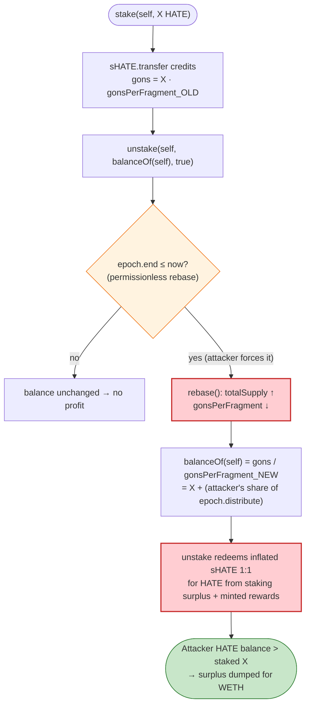
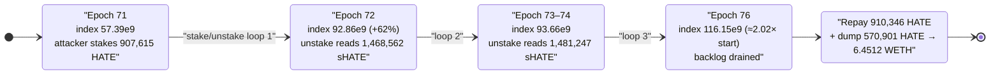

# Heavens Gate (HATE) Exploit — Rebase-Index Inflation via Permissionless `stake`/`unstake` Looping

> **Vulnerability classes:** vuln/logic/reward-calculation · vuln/access-control/missing-auth · vuln/oracle/price-manipulation

> **Reproduction:** the PoC compiles & runs in an isolated Foundry project at
> [this project folder](.) (the umbrella DeFiHackLabs repo contains several
> unrelated PoCs that do not whole-compile, so this one was extracted).
> Full verbose trace: [output.txt](output.txt).
> Verified vulnerable sources: [contracts_Staking.sol](sources/HATEStaking_8EBd6c/contracts_Staking.sol)
> and [contracts_token_sHATE.sol](sources/sHATE_f829d7/contracts_token_sHATE.sol).

---

## Key info

| | |
|---|---|
| **Loss** | ~**7.85 ETH** (≈ $13K at the time) — drained from the HATE/WETH Uniswap-V2 pair across two transactions (6.451 WETH + 1.394 WETH) |
| **Vulnerable contracts** | `HATEStaking` — [`0x8EBd6c7D2B79CA4Dc5FBdEc239a8Bb0F214212b8`](https://etherscan.io/address/0x8EBd6c7D2B79CA4Dc5FBdEc239a8Bb0F214212b8#code) and `sHATE` — [`0xf829d7014Db17D6DCe448bE958c7e4983cdb1F77`](https://etherscan.io/address/0xf829d7014Db17D6DCe448bE958c7e4983cdb1F77#code) |
| **Victim pool** | HATE/WETH pair — [`0x738dab4AF8D21b7aafb73545D79D3B4831eE79dA`](https://etherscan.io/address/0x738dab4AF8D21b7aafb73545D79D3B4831eE79dA) |
| **Attacker EOA** | [`0x6ce9fa08f139f5e48bc607845e57efe9aa34c9f6`](https://etherscan.io/address/0x6ce9fa08f139f5e48bc607845e57efe9aa34c9f6) |
| **Attacker contracts** | [`0x8faa53a742fc732b04db4090a21e955fe5c230be`](https://etherscan.io/address/0x8faa53a742fc732b04db4090a21e955fe5c230be), [`0x38702e5c98ba4ad4b786d5a075a5c74694cd616d`](https://etherscan.io/address/0x38702e5c98ba4ad4b786d5a075a5c74694cd616d) |
| **Attack txs** | [`0xe28ca1f…fda834`](https://etherscan.io/tx/0xe28ca1f43036f4768776805fb50906f8172f75eba3bf1d9866bcd64361fda834), [`0x8e1b0ab…f6c5372`](https://etherscan.io/tx/0x8e1b0ab098c4cc5f632e00b0842b5f825bbd15ded796d4a59880bb724f6c5372) |
| **Chain / blocks / date** | Ethereum mainnet / 18,069,528 & 18,071,199 / **Sep 5, 2023** |
| **Compiler** | Solidity v0.8.19, optimizer disabled (0 runs) |
| **Bug class** | OlympusDAO-fork rebase accounting flaw — permissionless `rebase()` + index inflation lets a flash-loan-dominated staker mint redeemable `sHATE` out of accrued rebase rewards |

---

## TL;DR

`HATEStaking` is a fork of the OlympusDAO staking system. `sHATE` is a rebasing share token: each
account stores an internal **gon** balance, and the displayed balance is `gons / _gonsPerFragment`.
A `rebase()` increases `_totalSupply` and lowers `_gonsPerFragment`, so *every* sHATE holder's
displayed balance grows — that is how staking rewards are distributed.

Two design flaws compose into a drain:

1. **`rebase()` is reachable permissionlessly and runs on every `stake`/`unstake`.** Both mutative
   entry points call `rebase()` ([Staking.sol:59](sources/HATEStaking_8EBd6c/contracts_Staking.sol#L59),
   [:69](sources/HATEStaking_8EBd6c/contracts_Staking.sol#L69)), and `rebase()` fires whenever the epoch
   has ended ([:79](sources/HATEStaking_8EBd6c/contracts_Staking.sol#L79)) — no keeper restriction.
2. **The rebase reward is split pro-rata by *current* circulating sHATE.** `epoch.distribute` is the
   surplus HATE held by the staking contract over circulating sHATE
   ([:89-96](sources/HATEStaking_8EBd6c/contracts_Staking.sol#L89-L96)). A staker who momentarily owns
   the overwhelming majority of circulating sHATE captures almost the entire distribution.

The attacker flash-borrows ~90% of the pool's HATE, `stake`s it (becoming the dominant sHATE holder),
then `unstake`s — which forces a fresh `rebase()` that inflates the attacker's sHATE balance *before*
it is read back and redeemed 1:1 for HATE. Looping `stake → unstake` repeatedly harvests every
accrued (and freshly minted) rebase distribution into the attacker's HATE balance. The surplus HATE is
dumped into the pair for WETH, the flash loan is repaid, and the attacker keeps the difference.

---

## Background — the OlympusDAO rebase model

`sHATE` ([source](sources/sHATE_f829d7/contracts_token_sHATE.sol)) is a standard OHM-style "gons"
rebase token (9 decimals):

- Internal balances are stored as **gons** in `_gonBalances`. `TOTAL_GONS` is a huge constant.
- The public balance is `balanceOf(who) = _gonBalances[who] / _gonsPerFragment`
  ([sHATE.sol:222-224](sources/sHATE_f829d7/contracts_token_sHATE.sol#L222-L224)).
- `transfer(to, value)` converts the *fragment* amount to gons at the **current** rate:
  `gonValue = value * _gonsPerFragment` ([:163-171](sources/sHATE_f829d7/contracts_token_sHATE.sol#L163-L171)).
- `rebase(amount_, epoch_)` grows `_totalSupply` and recomputes
  `_gonsPerFragment = TOTAL_GONS / _totalSupply` ([:106-130](sources/sHATE_f829d7/contracts_token_sHATE.sol#L106-L130)).
  A smaller `_gonsPerFragment` means every gon balance now displays as *more* sHATE — that is the reward.

`HATEStaking` ([source](sources/HATEStaking_8EBd6c/contracts_Staking.sol)) wraps this:

- `stake(_to, _amount)`: pull `_amount` HATE from the caller, `rebase()`, then `sHATE.transfer(_to, _amount)`
  (1 HATE in → 1 sHATE out at par) ([:57-61](sources/HATEStaking_8EBd6c/contracts_Staking.sol#L57-L61)).
- `unstake(_to, _amount, _rebase)`: optionally `rebase()`, pull `_amount` sHATE from the caller, send
  `_amount` HATE out (1 sHATE in → 1 HATE out at par) ([:68-73](sources/HATEStaking_8EBd6c/contracts_Staking.sol#L68-L73)).
- `rebase()`: if the epoch ended, call `sHATE.rebase(epoch.distribute, epoch.number)`, advance the epoch,
  pull fresh rewards from the `distributor` (a treasury that mints HATE), then recompute
  `epoch.distribute = HATE.balanceOf(staking) - circulatingSupply()`
  ([:78-98](sources/HATEStaking_8EBd6c/contracts_Staking.sol#L78-L98)).

On-chain state at the fork block (read from the trace):

| Parameter | Value (9-decimal HATE / 18-decimal WETH) |
|---|---|
| Pool HATE reserve (`reserve0`) | 1,008,461.55 HATE (`1.008e15`) |
| Pool WETH reserve (`reserve1`) | ~11.46 WETH (`1.146e19`) before the prior block's swaps; ~17.9 WETH mid-attack |
| `epoch.number` at start | 71 |
| `epoch.end` | `0x6487cdb7` = 1686621623 (already past → rebase active) |
| `sHATE.circulatingSupply()` before attack | 577,577.06 sHATE (`5.775e14`) |
| HATE held by staking contract before attack | ~1,495,493 HATE (`1.495e15`) |

Because the staking contract held **far more HATE than circulating sHATE**, `epoch.distribute` was
large and several epochs of rewards were sitting unclaimed — exactly the surplus the attacker harvests.

---

## The vulnerable code

### 1. Both `stake` and `unstake` call the permissionless `rebase()`

```solidity
function stake(address _to, uint256 _amount) external {
    HATE.transferFrom(msg.sender, address(this), _amount);
    rebase();                       // ⚠️ anyone can advance the epoch here
    sHATE.transfer(_to, _amount);   // 1 HATE in → 1 sHATE out (credited at CURRENT _gonsPerFragment)
}

function unstake(address _to, uint256 _amount, bool _rebase) external {
    if (_rebase) rebase();          // ⚠️ ...and again here, BEFORE the balance is read
    sHATE.transferFrom(msg.sender, address(this), _amount);
    require(_amount <= HATE.balanceOf(address(this)), "Insufficient HATE balance in contract");
    HATE.transfer(_to, _amount);    // 1 sHATE in → 1 HATE out
}
```
[Staking.sol:57-73](sources/HATEStaking_8EBd6c/contracts_Staking.sol#L57-L73)

### 2. `rebase()` distributes accrued surplus to *current* sHATE holders, no access control

```solidity
function rebase() public {                       // ← public, no onlyKeeper
    if (epoch.end <= block.timestamp) {
        sHATE.rebase(epoch.distribute, epoch.number);   // grows everyone's sHATE pro-rata
        epoch.end = epoch.end + epoch.length;
        epoch.number++;
        if (address(distributor) != address(0)) {
            distributor.distribute();                    // treasury MINTS fresh HATE into staking
        }
        uint256 balance = HATE.balanceOf(address(this));
        uint256 staked  = sHATE.circulatingSupply();
        if (balance <= staked) { epoch.distribute = 0; }
        else                   { epoch.distribute = balance - staked; }  // ← surplus = next reward
    }
}
```
[Staking.sol:78-98](sources/HATEStaking_8EBd6c/contracts_Staking.sol#L78-L98)

### 3. The rebase inflates a balance that is immediately read and redeemed

`unstake` reads the post-rebase balance in the attacker's PoC and redeems all of it:

```solidity
// attacker callback, per loop iteration:
uint256 balanceAttacker = HATE.balanceOf(address(this));
HATEStaking.stake(address(this), balanceAttacker);     // mint sHATE at par
uint256 sTokenBalance = sHATE.balanceOf(address(this)); // ⚠️ inflated by the rebase inside unstake
HATEStaking.unstake(address(this), sTokenBalance, true); // redeem inflated sHATE 1:1 for HATE
```
[HeavensGate_exp.sol:82-86](test/HeavensGate_exp.sol#L82-L86)

Inside `unstake`, the `_rebase=true` rebase runs *first*, lowering `_gonsPerFragment`. The attacker's
fixed gon balance (credited during `stake` at the higher rate) now displays as a larger sHATE amount,
and that larger amount is what gets redeemed for HATE. Because the attacker holds the dominant share of
circulating sHATE, nearly the entire `epoch.distribute` surplus flows into the attacker each loop.

---

## Root cause — why it was possible

The OlympusDAO staking design assumes rewards drip slowly to a broad, *static* set of stakers between
epochs. This fork broke that assumption in three ways that compose:

1. **`rebase()` is permissionless and bundled into `stake`/`unstake`.** The attacker — not an honest
   keeper — controls *when* the epoch advances and the distribution is split. They advance it at the
   exact instant they hold the majority of circulating sHATE.
2. **The reward is split by *instantaneous* circulating supply.** `epoch.distribute` is divided pro-rata
   among current sHATE holders. A flash-loan staker who briefly owns ~all circulating sHATE captures
   ~all of the surplus, despite contributing none of it.
3. **`stake` and `unstake` are par-priced (1:1) against a balance that just grew.** Staking mints sHATE
   at par, then a forced rebase grows that sHATE, then unstaking redeems the grown sHATE at par for HATE.
   The round-trip is profitable by exactly the captured rebase reward — repeatable until the surplus and
   the unclaimed multi-epoch backlog are exhausted.

The flash loan is the enabler: it lets the attacker temporarily own ~90% of the pool's HATE (and thus
~90% of circulating sHATE after staking) with zero capital, so the pro-rata split rounds almost entirely
in their favor. Without a flash loan an attacker would need to genuinely own a majority of the float.

This is the canonical "OlympusDAO staking / `Staking.unstake` rebase" vulnerability that hit a family of
OHM forks in 2022–2023.

---

## Preconditions

- `epoch.end <= block.timestamp` so `rebase()` actually fires (it had been past for several epochs,
  leaving an unclaimed reward backlog). The PoC reproduces it via `vm.rollFork` to the live block.
- The staking contract holds **more HATE than circulating sHATE** (a positive `epoch.distribute`
  surplus), plus a `distributor` that mints additional HATE on each `distribute()`.
- A flash-loanable source of HATE — here the HATE/WETH Uniswap-V2 pair itself, via `pair.swap()` with a
  callback. Borrow is repaid in the same transaction as `amount0 * 1000 / 997 + 1` HATE
  ([HeavensGate_exp.sol:88](test/HeavensGate_exp.sol#L88)).
- No working capital required — the entire position is opened and closed inside one flash-loan callback,
  making the attack effectively free and atomic.

---

## Attack walkthrough — transaction 1 (`testExploit1`, block 18,069,528)

The pair's `token0 = HATE` (9 decimals), `token1 = WETH` (18 decimals). All figures are pulled directly
from the trace in [output.txt](output.txt). HATE amounts shown in raw 9-decimal integers.

| # | Step | Trace evidence | Effect |
|---|------|----------------|--------|
| 0 | **Initial** — pool HATE = 1,008,461.55; staking holds ~1,495,493 HATE; circulating sHATE = 577,577 | `balanceOf(pair)=1008461554645894` | Surplus & multi-epoch backlog sit in staking. |
| 1 | **Flash-borrow 90% of pool HATE** — `pair.swap(907615399181304, 0, this, 0x03)` (the `0x03` = 3 loop iterations) | `swap(907615399181304, 0, …, 0x03)` | Attacker holds 907,615.4 HATE, owes ~910,346 HATE back. |
| 2a | **Loop 1 — stake** all 907,615.4 HATE → `rebase()` (epoch 71→72) → receive 907,615.4 sHATE | `stake(…, 907615399181304)`; `LogRebase(epoch:71, index:5.739e10)` | Attacker now dominates circulating sHATE. |
| 2b | **Loop 1 — unstake** — `_rebase=true` rebase (epoch 72) **before** reading balance; `sHATE.balanceOf(attacker)` now reads **1,468,562.9** (inflated from 907,615.4) | `LogRebase(epoch:72, index:9.286e10)`; `sHATE::balanceOf → 1468562883234511`; `unstake(…, 1468562883234511, true)` | Index jumps 57.39e9 → 92.86e9 (+62%); attacker redeems 1,468,562.9 HATE 1:1. |
| 3 | **Loop 2** — restake 907,615.4 (capped at what was pulled), unstake reads 1,481,247.4 sHATE | `stake(…, 907615399181304)`; `unstake(…, 1481247433788967, true)` | Further rebases (epoch 73–74) top up the balance. |
| 4 | **Loop 3** — final stake/unstake; epoch advances to 76 with a large `LogRebase(epoch:76, index:1.161e11, rebase:2.4e17)` | `LogRebase(epoch:76, index:116149771803)` | Index has risen 57.39e9 → 116.15e9 (≈ **2.02×**) over the loops. |
| 5 | **Repay flash loan** — transfer 910,346.4 HATE back to the pair | `HATE::transfer(pair, 910346438496795)` | Loan settled (`amount0*1000/997+1`). |
| 6 | **Dump surplus HATE** — attacker's leftover 570,901 HATE swapped HATE→WETH via router | `balanceOf(attacker)=570900995292172`; `swap(0, 6451150248578494990, …)` | Pool pays out **6.4512 WETH**. |

**Net result of tx 1: +6.4512 WETH**, with zero starting capital ("Before Start: 0 ETH").

### Why the balance inflates (the core mechanism)

When `stake()` credits the attacker, it does `gonBalance += amount * _gonsPerFragment_OLD`. When
`unstake()` then runs `rebase()`, `_gonsPerFragment` drops (because `_totalSupply` grew). The attacker's
gon balance is now read back as `gonBalance / _gonsPerFragment_NEW`, which is *larger* than the amount
originally staked. That extra sHATE is the attacker's share of `epoch.distribute`, captured because they
held ~all circulating sHATE at the instant of the rebase. `unstake` redeems it 1:1 for real HATE, and the
HATE came from the surplus + freshly-minted distributor rewards sitting in the staking contract.

---

## Attack walkthrough — transaction 2 (`testExploit2`, block 18,071,199)

A repeat of the same pattern two blocks of activity later, after the surplus had partially refilled:

- Flash-borrow **70%** of the pool HATE: `pair.swap(1107465512477489, 0, this, 0x1e)` — the `0x1e` byte
  drives **30** `stake`/`unstake` iterations (confirmed: 30 stakes + 30 unstakes in the trace).
- Each loop harvests the smaller remaining per-epoch surplus; after repaying the loan and dumping the
  leftover HATE, the pool pays out **1.3940 WETH** (`WETH balance after swap: 1.394018976261958592`).

**Net result of tx 2: +1.3940 WETH.**

### Combined profit accounting (WETH)

| Source | Amount |
|---|---:|
| Transaction 1 payout | 6.4512 |
| Transaction 2 payout | 1.3940 |
| **Total drained** | **≈ 7.845 WETH (~8 ETH)** |

Both transactions start the attacker at 0 ETH and 0 HATE; every WETH out is pure profit, funded by the
HATE/WETH pool's WETH reserve and the surplus/minted HATE held by the staking system.

---

## Diagrams

### Sequence of one transaction (3-loop variant)

```mermaid
sequenceDiagram
    autonumber
    actor A as "Attacker contract"
    participant P as "HATE/WETH Pair"
    participant S as "HATEStaking"
    participant SH as "sHATE (rebasing)"
    participant D as "Distributor / Treasury"
    participant R as "UniswapV2 Router"

    Note over P: "reserve0 = 1,008,461 HATE<br/>reserve1 ≈ 11.46 WETH<br/>epoch behind → rebase armed"

    A->>P: "swap(907,615 HATE out, callback 0x03)"
    P-->>A: "907,615 HATE (flash loan)"

    rect rgb(227,242,253)
    Note over A,SH: "Loop ×3 — harvest the rebase surplus"
    loop "3 iterations"
        A->>S: "stake(self, balanceHATE)"
        S->>SH: "rebase(epoch.distribute) → index ↑, gonsPerFragment ↓"
        S->>SH: "transfer(self, amount)  (1 HATE → 1 sHATE)"
        A->>SH: "balanceOf(self)  → INFLATED amount"
        A->>S: "unstake(self, inflatedSHATE, true)"
        S->>SH: "rebase() again → index ↑ further"
        S->>D: "distribute() → MINT fresh HATE into staking"
        S-->>A: "inflatedSHATE worth of HATE (1:1)"
    end
    end

    A->>P: "transfer 910,346 HATE (repay flash loan + 0.3% fee)"
    A->>R: "swapExactTokensForTokens(570,901 HATE → WETH)"
    R->>P: "swap()"
    P-->>A: "6.4512 WETH"
    Note over A: "Net +6.4512 WETH (tx1); +1.3940 WETH (tx2)"
```

### Why the round-trip prints money



### Index / reward capture across the loop (tx 1)



---

## Remediation

1. **Do not bundle a permissionless `rebase()` into `stake`/`unstake`, and never split rewards by
   *instantaneous* circulating supply within the same call that mints/redeems.** Snapshot the staked
   balance *before* the rebase, or use a warmup/lock period (the OlympusDAO `Claim.expiry`/warmup that
   this fork stripped out) so a freshly-staked balance cannot claim the current epoch's distribution.
2. **Gate epoch advancement.** Restrict `rebase()` (or the epoch-rollover branch) to a trusted
   keeper/timelock, so an attacker cannot choose the instant the distribution is allocated.
3. **Make stake → unstake round-trips non-profitable atomically.** Apply a per-block or per-transaction
   guard (e.g., disallow unstaking in the same block as staking, or charge the rebase reward only to
   balances held across an epoch boundary). This breaks the flash-loan single-transaction loop.
4. **Quote redemptions on a snapshot, not a live balance.** `unstake` should redeem the amount the user
   actually held before the in-call rebase, not the post-rebase inflated `balanceOf`.
5. **Cap or rate-limit `epoch.distribute` payout to any single account per epoch.** A distribution that
   can be ~entirely captured by one transient holder is a red flag; bound the per-address share.

---

## How to reproduce

The PoC was extracted into a standalone Foundry project (the umbrella DeFiHackLabs repo has several
unrelated PoCs that fail `forge test`'s whole-project build):

```bash
_shared/run_poc.sh 2023-09-HeavensGate_exp -vvvvv
```

- RPC: an **Ethereum mainnet archive** endpoint is required (the fork blocks 18,069,527 / 18,071,198 are
  from Sep 2023). `foundry.toml` maps `mainnet` to an Infura archive endpoint; most pruning RPCs will
  fail at these blocks with `header not found` / `missing trie node`.
- Result: both `testExploit1()` and `testExploit2()` PASS.

Expected tail:

```
Ran 2 tests for test/HeavensGate_exp.sol:ContractTest
[PASS] testExploit1() (gas: 1212095)
  Before Start: 0 ETH
  WETH balance after swap: 6.451150248578494990
[PASS] testExploit2() (gas: 5038388)
  Before Start: 0 ETH
  WETH balance after swap: 1.394018976261958592
Suite result: ok. 2 passed; 0 failed; 0 skipped
```

---

*Reference: Hexagate analysis — https://twitter.com/hexagate_/status/1699003711937216905
(Heavens Gate / HATE, Ethereum, ~8 ETH). Vulnerability class: OlympusDAO-fork staking rebase
inflation.*
