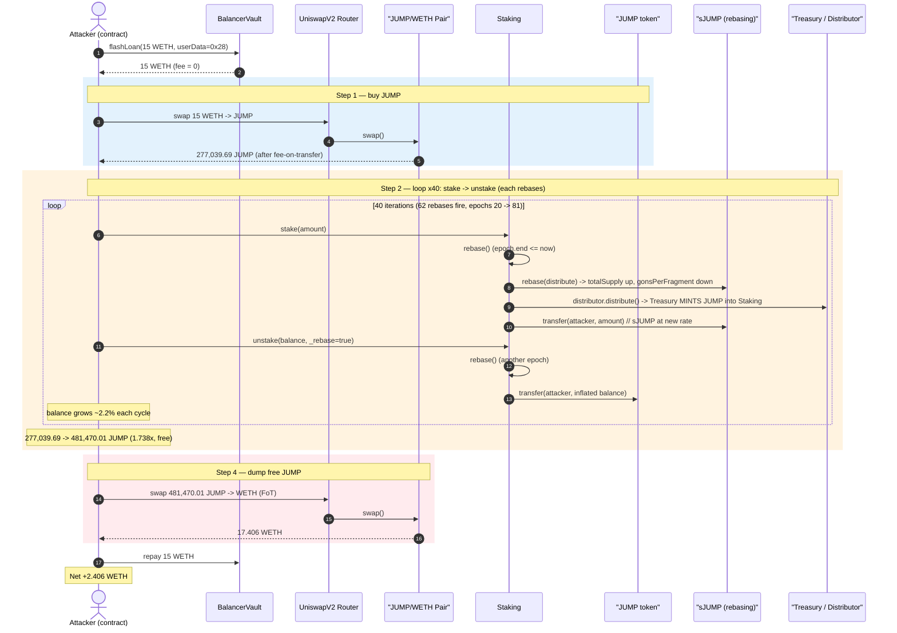
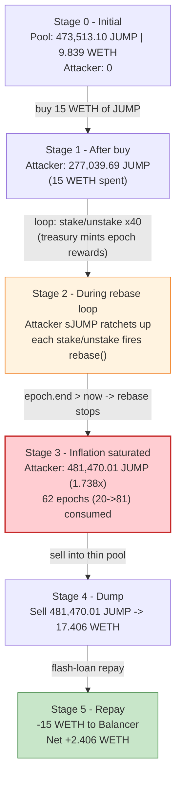
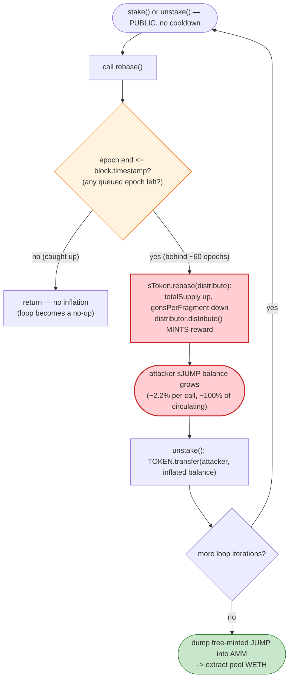

# JumpFarm Exploit — Single-Transaction Rebase Inflation in OlympusDAO-style Staking

> **Vulnerability classes:** vuln/logic/reward-calculation · vuln/access-control/missing-auth

> **Reproduction:** the PoC compiles & runs in an isolated Foundry project at
> [this project folder](.) (the umbrella DeFiHackLabs repo contains many
> unrelated PoCs that do not whole-compile, so this one was extracted into a
> standalone project). Full verbose trace:
> [output.txt](output.txt). Verified vulnerable sources:
> [Staking](sources/Staking_05999e/contracts_Staking.sol),
> [sToken (sJUMP)](sources/sToken_dd28c9/contracts_sToken.sol).

---

## Key info

| | |
|---|---|
| **Loss** | ~**2.406 WETH** (≈ $2.4K at the time) drained from the JUMP/WETH Uniswap-V2 pool via free-minted JUMP |
| **Vulnerable contracts** | `Staking` — [`0x05999eB831ae28Ca920cE645A5164fbdB1D74Fe9`](https://etherscan.io/address/0x05999eB831ae28Ca920cE645A5164fbdB1D74Fe9#code) and `sToken` (sJUMP) — [`0xdd28c9d511a77835505d2fBE0c9779ED39733bdE`](https://etherscan.io/address/0xdd28c9d511a77835505d2fBE0c9779ED39733bdE#code) |
| **Victim pool** | JUMP/WETH UniswapV2 pair — `0x20746FdE9Ae1b7BBD3dBaDDaE3c9244A27bD2b06` |
| **Token (JUMP)** | [`0x39d8BCb39DE75218E3C08200D95fde3a479D7a14`](https://etherscan.io/address/0x39d8BCb39DE75218E3C08200D95fde3a479D7a14#code) (9 decimals, fee-on-transfer) |
| **Attacker EOA** | [`0x6CE9fa08F139F5e48bc607845E57efE9AA34C9F6`](https://etherscan.io/address/0x6CE9fa08F139F5e48bc607845E57efE9AA34C9F6) |
| **Attacker contract** | [`0x154863eb71De4a34F88Ea57450840eAB1c71abA6`](https://etherscan.io/address/0x154863eb71De4a34F88Ea57450840eAB1c71abA6) |
| **Attack tx** | [`0x6189ad07894507d15c5dff83f547294e72f18561dc5662a8113f7eb932a5b079`](https://explorer.phalcon.xyz/tx/eth/0x6189ad07894507d15c5dff83f547294e72f18561dc5662a8113f7eb932a5b079) |
| **Chain / block / date** | Ethereum mainnet / 18,070,346 / ~Sept 6, 2023 |
| **Compiler** | Solidity v0.8.19, optimizer 200 runs |
| **Bug class** | Same-transaction multi-rebase inflation in OlympusDAO-fork staking (`stake`/`unstake` both call `rebase()`, and `rebase()` can fire repeatedly within one block) |

---

## TL;DR

`Staking` is an OlympusDAO-style (Olympus/Wonderland v1) staking contract: you deposit `JUMP`,
receive `sJUMP` (a rebasing receipt token) 1:1, and the receipt's balance grows automatically as
each "epoch" distributes treasury-minted profit. `unstake()` lets you redeem `sJUMP` back for
`JUMP` 1:1 on the *current* (already-rebased) balance.

Two design facts compose into a critical exploit:

1. **Both `stake()` and `unstake()` call `rebase()` first** — and `rebase()` is permissionless
   ([Staking.sol:332-372](sources/Staking_05999e/contracts_Staking.sol#L332-L372)).
2. **`rebase()` advances exactly one epoch per call as long as `epoch.end <= block.timestamp`**
   ([Staking.sol:352-353](sources/Staking_05999e/contracts_Staking.sol#L352-L353)). When the
   contract is *behind* on epochs (no honest user has poked it in a while), a single block has
   **dozens** of due epochs queued — and each `stake`/`unstake` call burns one off, minting fresh
   profit into the staking contract and inflating every `sJUMP` holder's balance.

The attacker simply loops `stake → unstake` 40 times in one flash-loaned transaction. Each cycle
fires one or two rebases, growing the attacker's `sJUMP` (and therefore the redeemable `JUMP`) by a
few percent. Over the loop the attacker's holding grows from **277,039.69 JUMP → 481,470.01 JUMP**
(**≈ 1.738×**) at **zero cost** — the inflation is funded by the protocol treasury minting backlogged
epoch rewards into a contract where the attacker is essentially the only "circulating" holder.

The attacker then dumps the free-minted JUMP into the thin JUMP/WETH pool, walking off with
**2.406 WETH** of pool liquidity after repaying the 15 WETH flash loan.

---

## Background — OlympusDAO rebase staking, in one paragraph

In the Olympus v1 model, `sToken` (`sJUMP`) is a **rebasing** ERC20 implemented with "gons": each
account stores a fixed `_gonBalances[account]`, and the displayed balance is
`_gonBalances[account] / _gonsPerFragment`
([sToken.sol:858-862](sources/sToken_dd28c9/contracts_sToken.sol#L858-L862)). A *rebase* increases
`_totalSupply` and **decreases** `_gonsPerFragment`
([sToken.sol:729-735](sources/sToken_dd28c9/contracts_sToken.sol#L729-L735)), so every holder's
displayed balance grows proportionally without any transfer. The `Staking` contract holds the unstaked
gon pool and pays out rewards by calling `sToken.rebase()` each epoch.

`circulatingSupply()` is defined as `_totalSupply − balanceOf(stakingContract)`
([sToken.sol:881-883](sources/sToken_dd28c9/contracts_sToken.sol#L881-L883)) — i.e. **everything not
held by the staking contract**. When the attacker is staked, *they* are nearly the entire circulating
supply, so nearly **100% of every rebase accrues to them.**

On-chain parameters at the fork block (read from the trace):

| Parameter | Value |
|---|---|
| sJUMP decimals | 9 |
| JUMP decimals | 9 (fee-on-transfer token) |
| `epoch.number` at fork | 20 (last honest epoch) |
| `block.timestamp` vs `epoch.end` | timestamp is **~60 epochs ahead** — protocol is badly behind on rebases |
| JUMP/WETH pool reserves (initial) | 473,513.10 JUMP / **9.839 WETH** |
| Attacker capital | 15 WETH (Balancer flash loan, **0 fee**) |

The fact that the protocol was **60+ epochs behind** is the entire game: those backlogged rebases were
sitting un-distributed, and the attacker drained them all into their own position inside one transaction.

---

## The vulnerable code

### 1. `stake()` and `unstake()` both trigger `rebase()`

```solidity
// Staking.sol
function stake(address _to, uint256 _amount) external {
    rebase();                                       // ← (1) advances one epoch, mints reward
    TOKEN.transferFrom(msg.sender, address(this), _amount);
    sTOKEN.transfer(_to, _amount);                  // ← gives attacker _amount sJUMP at the NEW rate
}

function unstake(address _to, uint256 _amount, bool _rebase) external {
    if (_rebase) rebase();                          // ← (2) advances ANOTHER epoch
    sTOKEN.transferFrom(msg.sender, address(this), _amount);
    require(_amount <= TOKEN.balanceOf(address(this)),
            "Insufficient TOKEN balance in contract");
    TOKEN.transfer(_to, _amount);                   // ← returns the now-inflated balance as JUMP
}
```
[Staking.sol:332-349](sources/Staking_05999e/contracts_Staking.sol#L332-L349)

### 2. `rebase()` fires once per queued epoch — permissionless, no block guard

```solidity
function rebase() public {
    if (epoch.end <= block.timestamp) {             // ← (3) ONE epoch per call, while behind
        sTOKEN.rebase(epoch.distribute, epoch.number);   // inflate sJUMP supply by epoch.distribute
        epoch.end = epoch.end + epoch.length;
        epoch.number++;
        if (address(distributor) != address(0)) {
            distributor.distribute();               // ← treasury MINTS fresh JUMP into Staking
        }
        uint256 balance = TOKEN.balanceOf(address(this));
        uint256 staked  = sTOKEN.circulatingSupply();
        if (balance <= staked) epoch.distribute = 0;
        else                   epoch.distribute = balance - staked;   // next reward = surplus
    }
}
```
[Staking.sol:352-372](sources/Staking_05999e/contracts_Staking.sol#L352-L372)

### 3. The receipt token rebase: supply up, gons-per-fragment down

```solidity
// sToken.sol — rebase increases supply, shrinks _gonsPerFragment
function rebase(uint256 amount_, uint256 epoch_) public onlyStakingContract returns (uint256) {
    ...
    rebaseAmount = (amount_ * _totalSupply) / circulatingSupply_;   // amplified by 1/circ-share
    _totalSupply = _totalSupply + rebaseAmount;
    _gonsPerFragment = TOTAL_GONS / _totalSupply;                    // ← everyone's balance grows
    ...
}
```
[sToken.sol:713-740](sources/sToken_dd28c9/contracts_sToken.sol#L713-L740)

Note the amplification on [sToken.sol:724](sources/sToken_dd28c9/contracts_sToken.sol#L724):
the rebase is scaled by `_totalSupply / circulatingSupply_`. Because the attacker dominates the
circulating supply while staked, this factor is large and the per-rebase growth is meaningful.

---

## Root cause — why it was possible

The protocol assumes rebases happen **at most once per epoch in real time**, paced by the passage of
wall-clock days. The implementation never enforces that. Three concrete flaws compose:

1. **Time-debt batching, not rate-limiting.** `rebase()` consumes *one* queued epoch per call but
   places no cap on how many calls can happen in a single block. When the protocol is behind by N
   epochs (here ~60), an attacker can pull all N rebases into one transaction by calling
   `stake`/`unstake` repeatedly. Each call mints a fresh epoch's reward and inflates the receipt
   token. There is no `lastRebaseBlock == block.number → return` guard.

2. **Rebase before redeem, in the same call.** Because `stake()` rebases *then* hands out `sJUMP`,
   and `unstake()` rebases *then* lets you redeem, an attacker who is staked across a rebase
   immediately captures the inflation and can cash it out 1:1 in the very next call. There is no
   lockup, no cooldown, and no snapshot of the pre-rebase index.

3. **Reward concentration via `circulatingSupply`.** Rewards are distributed proportionally to
   circulating (non-staking-contract) supply. A flash-loan attacker who becomes ~100% of circulating
   supply receives ~100% of every backlogged epoch's freshly-minted reward — there is no honest
   counter-party to dilute them.

The net effect: the attacker mints `JUMP` out of thin air (treasury-funded epoch rewards that *should*
have been spread over ~60 real days and across all stakers), compresses it into one transaction, and
sells it into a thin AMM pool. The free `JUMP` is the loss; the pool's WETH is the realized prize.

This is the same vulnerability class as the historical **OlympusDAO / Wonderland "single-block
multi-rebase"** issue: a rebasing-receipt staking contract whose reward cadence is driven by an
un-rate-limited, permissionlessly-pokeable `rebase()`.

---

## Preconditions

- The protocol is **behind on epochs** (`epoch.end << block.timestamp`), so multiple rebases are queued.
  In the live attack this was naturally true — nobody had poked `rebase()` in ~60 epochs.
- The treasury/`Distributor` is funded enough to `mint()` the queued epoch rewards into `Staking`
  ([Staking.sol:359-361](sources/Staking_05999e/contracts_Staking.sol#L359-L361)).
- A small amount of starting `JUMP` to stake (here bought with a **15 WETH** flash loan from Balancer,
  which charges **0 fee**, making the whole thing free).
- A JUMP/WETH AMM pool to sell the inflated `JUMP` into — present and thinly liquid (~9.84 WETH at
  start), so the free `JUMP` translates into real WETH.

---

## Attack walkthrough (with on-chain numbers from the trace)

Token0 of the pair is `JUMP`, token1 is `WETH`. All figures are pulled from
[output.txt](output.txt). The whole exploit executes inside the Balancer
flash-loan callback `receiveFlashLoan` ([test/JumpFarm_exp.sol:49-79](test/JumpFarm_exp.sol#L49-L79)).
The flash-loan `userData = 0x28` decodes to **40 loop iterations**.

| # | Step | Trace ref | Result |
|---|------|-----------|--------|
| 0 | **Flash-loan 15 WETH** from Balancer (fee = 0) | [L1584](output.txt#L1584) | Attacker holds 15 WETH |
| 1 | **Buy JUMP**: `swapExactTokensForTokens(15 WETH → JUMP)`; JUMP is fee-on-transfer so 285,607.93 JUMP out, **277,039.69 JUMP** received after fee | [L1601-L1632](output.txt#L1601-L1632) | Attacker: 277,039.69 JUMP |
| 2 | **Loop ×40: `stake` then `unstake(_rebase=true)`** — each call fires `rebase()`, advancing one queued epoch (epochs 20 → 81, **62 rebases**), inflating attacker's `sJUMP` | [L1645-L5871](output.txt#L1645-L5871) | sJUMP/JUMP balance ratchets up each cycle |
| 3 | **Inflation saturates** — once all backlogged epochs (through epoch 81) are consumed, `rebase()` stops firing (`epoch.end > block.timestamp`); later cycles are no-ops (stake gas drops 193,807 → 17,733) | [L5587](output.txt#L5587) | Balance plateaus at **481,470.01 JUMP** |
| 4 | **Sell all JUMP**: `swapExactTokensForTokensSupportingFeeOnTransferTokens(481,470.01 JUMP → WETH)` (3% sell-fee skimmed) | [L5899 (tail)](output.txt) | **17.406 WETH** received |
| 5 | **Repay** 15 WETH to Balancer | tail | Net **+2.406 WETH** |

### The inflation ladder (attacker's redeemable balance per loop iteration)

These are the live `sToken.balanceOf(attacker)` reads between each `stake`/`unstake` cycle
([grep of L1764…L5565](output.txt#L1764)). Units are raw (÷10⁹ for JUMP/sJUMP):

| Cycle | sJUMP balance (raw) | sJUMP (display) | Growth vs prev |
|------:|--------------------:|----------------:|---------------:|
| start | 277,039,687,340,311 | 277,039.69 | — |
| 1 | 283,536,005,996,714 | 283,536.01 | +2.35% |
| 2 | 290,013,563,216,641 | 290,013.56 | +2.28% |
| 3 | 296,476,329,656,191 | 296,476.33 | +2.23% |
| … | … | … | ~+2.2%/cycle |
| 10 | 341,577,194,782,680 | 341,577.19 | |
| 20 | 413,475,467,623,047 | 413,475.47 | |
| 30 | 467,704,235,963,581 | 467,704.24 | |
| 31 (final growth) | 481,470,014,550,149 | **481,470.01** | |
| 32-40 | 481,470,014,550,149 | 481,470.01 | **0% (rebases exhausted)** |

Total free inflation: **481,470.01 / 277,039.69 = 1.738×** — the attacker created **204,430.33 JUMP**
out of nothing, all funded by backlogged treasury-minted epoch rewards.

### Why the balance plateaus

Each `rebase()` fires only while `epoch.end <= block.timestamp`
([Staking.sol:353](sources/Staking_05999e/contracts_Staking.sol#L353)). The 40-iteration loop offers
80 rebase opportunities (one per `stake`, one per `unstake`), but only **62** fire (epochs 20 → 81),
because after 62 epoch-advances `epoch.end` finally exceeds the current block timestamp. From that
point on, `rebase()` short-circuits, `distributor.distribute()` is not called, and the receipt balance
stops growing — visible in the trace as the stake gas collapsing from `193,807` to `17,733`
([L5587](output.txt#L5587)) and unstake from `214,722` to `38,648` ([L5567](output.txt#L5567)).

---

## Profit / loss accounting (WETH)

| Direction | Amount (WETH) |
|---|---:|
| Flash loan in (Balancer, 0 fee) | 15.000 |
| Spent — buy JUMP (step 1) | 15.000 |
| Received — sell 481,470.01 JUMP (step 4) | 17.406 |
| Repaid to Balancer | 15.000 |
| **Net profit** | **+2.406** |

PoC final log: `eth balance after exploit: 2.406051928901484042`
([L5950](output.txt#L5950)) — i.e. **2.406 WETH**, matching the PoC header's "~$2.4ETH".

The loss is borne jointly by (a) the JUMP/WETH pool LPs, who absorbed the dump of free-minted JUMP and
lost ~2.4 WETH of liquidity, and (b) the protocol treasury, which minted ~60 epochs of rewards into a
position monopolized by the attacker.

---

## Diagrams

### Sequence of the attack



### Pool / position state evolution



### The flaw inside `rebase()` / `stake` / `unstake`



---

## Remediation

1. **Rate-limit `rebase()` to once per block (or once per real epoch).** Add a guard such as
   `require(block.number > lastRebaseBlock); lastRebaseBlock = block.number;` or only allow one epoch
   advance per `rebase()` call *and* require that wall-clock time has actually elapsed between calls.
   The historical Olympus fix collapses all overdue epochs into a single distribution rather than one
   reward per `stake`/`unstake` invocation.

2. **Do not couple reward distribution to user-triggered `stake`/`unstake`.** Move `rebase()` to a
   keeper/cron path, or make it idempotent within a block so that repeated calls in the same
   transaction cannot each mint a fresh epoch's reward.

3. **Add a stake → unstake cooldown / warmup.** A minimum holding period (even one block) prevents an
   attacker from capturing a rebase and redeeming it in the same transaction. Olympus introduced a
   warmup period specifically to break this single-transaction loop.

4. **Snapshot the index, not the live balance, on redeem.** Redeeming should not pay out inflation that
   accrued *within the same call* that triggered it; bind the redeemable amount to the index observed at
   stake time plus only genuinely-elapsed reward periods.

5. **Cap per-rebase / per-block reward magnitude relative to circulating supply.** A rebase that grows a
   single dominant holder's balance by double-digit percentages in one transaction should be rejected as
   anomalous.

---

## How to reproduce

The PoC was extracted into a standalone Foundry project (the umbrella DeFiHackLabs repo does not
whole-compile under `forge test`):

```bash
_shared/run_poc.sh 2023-09-JumpFarm_exp --mt testExploit -vvvvv
```

- RPC: an **Ethereum mainnet archive** endpoint is required (fork block 18,070,346 from Sept 2023).
  `foundry.toml` is configured with a `mainnet` alias; most public RPCs prune state this old and fail
  with `header not found` / `missing trie node`, so an archive provider is needed.
- Result: `[PASS] testExploit()` with `eth balance after exploit: 2.406051928901484042`.

Expected tail:

```
    ├─ emit log_named_decimal_uint(key: "jump token balance after exploit", val: 481470014550149 [4.814e14], decimals: 9)
    ├─ emit log_named_decimal_uint(key: "eth balance after exploit", val: 2406051928901484042 [2.406e18], decimals: 18)
    └─ ← [Stop]

Suite result: ok. 1 passed; 0 failed; 0 skipped
```

---

*Reference: Decurity disclosure — https://twitter.com/DecurityHQ/status/1699384904218202618 (JumpFarm, Ethereum, ~$2.4K).*
