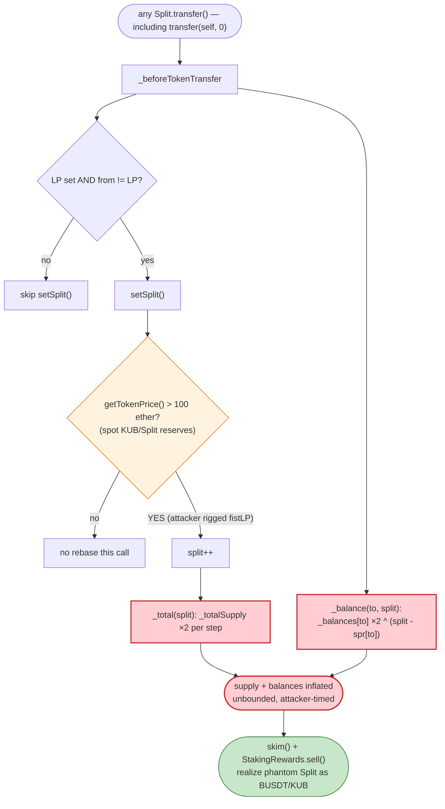
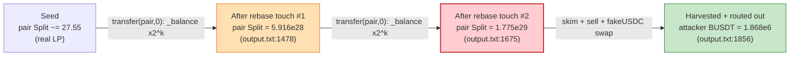

# Split (Kub) Exploit — Self-Doubling Balance via Manipulable On-Chain "Token Price" Oracle

> **Reproduction:** the PoC compiles & runs in an isolated Foundry project at
> [this project folder](.) (the umbrella DeFiHackLabs repo contains many unrelated
> PoCs that do not whole-compile, so this one was extracted).
> Full verbose trace: [output.txt](output.txt).
> Verified vulnerable sources: [Split.sol](sources/Split_c98E18/Split.sol),
> [StakingRewards.sol](sources/StakingRewards_3A006d/StakingRewards.sol).

---

## Key info

| | |
|---|---|
| **Loss** | ~$22.2K — attacker netted **22,049.48 BUSDT + 126.38 KUB** (≈ $22.2K) after repaying all flash loans |
| **Vulnerable contract** | `Split` token — [`0xc98E183D2e975F0567115CB13AF893F0E3c0d0bD`](https://bscscan.com/address/0xc98E183D2e975F0567115CB13AF893F0E3c0d0bD#code) |
| **Co-conspiring contract** | `StakingRewards` — [`0x3A006dD44a4a0e43C942f57d452a6a7Ada25AdC3`](https://bscscan.com/address/0x3A006dD44a4a0e43C942f57d452a6a7Ada25AdC3#code) and [`0x26Eea9ff…`](https://bscscan.com/address/0x26Eea9ff2f3caDec4d6Fc4f462F677b58AB31Ab0#code) |
| **Victim pools** | BUSDT/Split `0xe4D038…155fF`, KUB/Split `0x16bF07…C570`, BUSDT/KUB `0x39aDFE…7600` & `0x1E338D…11AF` |
| **Attacker EOA** | [`0x7Ccf451D3c48C8bb747f42F29A0CdE4209FF863e`](https://bscscan.com/address/0x7Ccf451D3c48C8bb747f42F29A0CdE4209FF863e) |
| **Attack contract** | [`0xa7fe9c5d4b87b0d03e9bb99f4b4e76785de26b5d`](https://bscscan.com/address/0xa7fe9c5d4b87b0d03e9bb99f4b4e76785de26b5d) |
| **Attack tx** | [`0x2b0877b5495065e90d956e44ffde6aaee5e0fcf99dd3c86f5ff53e33774ea52d`](https://bscscan.com/tx/0x2b0877b5495065e90d956e44ffde6aaee5e0fcf99dd3c86f5ff53e33774ea52d) |
| **Chain / block / date** | BSC / fork at 32,021,099 (`32_021_100 - 1`) / ~Sep 22 2023 |
| **Compiler** | Solidity `v0.8.4+commit.c7e474f2`, optimizer enabled (1 / 200 runs) |
| **Bug class** | Balance/supply inflation driven by an instantaneous, attacker-manipulable on-chain price "oracle" |

---

## TL;DR

`Split` is a "reflection"-style deflationary token. On **every** token transfer its
`_beforeTokenTransfer` hook calls `setSplit()`
([Split.sol:1231-1237](sources/Split_c98E18/Split.sol#L1231-L1237)). When an internal
price reading `getTokenPrice()` exceeds `100 ether`, `setSplit()` bumps a counter
`split` and invokes two internal "rebase" routines that **literally double numbers in
storage**:

- `_total(split)` doubles `_totalSupply`
  ([Split.sol:731-741](sources/Split_c98E18/Split.sol#L731-L741)), and
- `_balance(to, split)` doubles each touched account's `_balances[to]`
  ([Split.sol:742-752](sources/Split_c98E18/Split.sol#L742-L752)).

`getTokenPrice()` is computed live from the spot reserves of a pool the attacker
controls (`KUB.balanceOf(fistLP)` and `Split.balanceOf(fistLP)`,
[Split.sol:1238-1246](sources/Split_c98E18/Split.sol#L1238-L1246)). So the attacker
first force-feeds that pool until the reading clears `100 ether`, then triggers the hook
repeatedly with **zero-value, self-directed transfers**. Each call doubles their Split
balance held inside the AMM pairs. Pair balances are then harvested with `skim()`, the
inflated Split is routed through a fresh attacker-owned `fakeUSDC/Split` pair and through
the `StakingRewards` `sell()` path back into BUSDT and KUB, and finally five DODO/DPP
flash loans (~1.87M BUSDT borrowed) are repaid. The attacker keeps the difference:
**22,049.48 BUSDT + 126.38 KUB**.

---

## Background — what the contracts do

`Split` ([Split.sol:1125-1255](sources/Split_c98E18/Split.sol#L1125-L1255)) inherits a
**modified** OpenZeppelin `ERC20`. Two non-standard pieces are bolted into the base
`ERC20`:

1. A hidden "rebase" pair `_total()` / `_balance()`
   ([Split.sol:731-752](sources/Split_c98E18/Split.sol#L731-L752)) that doubles supply and
   per-account balances `sp - <last>` times.
2. A `balanceOf` override
   ([Split.sol:1212-1216](sources/Split_c98E18/Split.sol#L1212-L1216)) that returns a
   floor of `_initialBalance` (`= 1`) for any account whose real balance is zero. This
   "phantom dust" is what gives the doubling something to multiply.

The `StakingRewards` contract
([StakingRewards.sol:414-862](sources/StakingRewards_3A006d/StakingRewards.sol#L414-L862))
is a yield/referral farm with a permissionless `sell()`
([StakingRewards.sol:767-782](sources/StakingRewards_3A006d/StakingRewards.sol#L767-L782))
that buys back `token` (Split/KUB) for `token1` (KUB/BUSDT) at a spot price and, if it is
short on inventory, pulls it out of the LP via `removeLiquidity()`. This is the path the
attacker uses to convert inflated Split into real value.

The on-chain state at the fork block (read from the trace):

| Quantity | Value |
|---|---|
| Attacker initial Split balance | **1 wei** (phantom dust, [output.txt:127](output.txt)) |
| Attacker initial BUSDT / KUB | 0 / 0 ([output.txt:117-122](output.txt)) |
| BUSDT/Split pair reserves | 4,176.99 BUSDT / 20.66 Split ([output.txt:256](output.txt)) |
| KUB/Split pair reserves (the price source `fistLP`) | 720.42 KUB / 901.16 Split ([output.txt:243-245](output.txt)) |
| `getTokenPrice()` reading | **> 100 ether** (gate satisfied — see below) |
| Total flash-loan capital borrowed (5× DODO/DPP) | ~**1,874,170 BUSDT** ([output.txt:141-185](output.txt)) |

---

## The vulnerable code

### 1. Every transfer can trigger a balance "rebase"

```solidity
// Split._beforeTokenTransfer  (Split.sol:1164-1173)
function _beforeTokenTransfer(address from,address to,uint amount) internal override trading{
    if(LP != address(0) && from !=LP){
       setSplit();                 // ⚠️ called on (almost) every transfer
    }
    _balance(from,split);          // ⚠️ doubles from's balance `split-spr[from]` times
    _balance(to,split);            // ⚠️ doubles to's balance `split-spr[to]` times
    ...
}
```

### 2. `setSplit()` keys off a spot-reserve "price" and increments the rebase counter

```solidity
// Split.sol:1231-1246
function setSplit() public {
    if(getTokenPrice() > 100 ether){    // ⚠️ attacker-controllable threshold
        split++;                        // bump rebase counter
        _total(split);                  // double _totalSupply
        IFactory(LP).sync();
    }
}
function getTokenPrice() view private returns(uint){
    // price = (KUB held by fistLP × KUB/USDT price) / (Split held by fistLP)
    uint kubPrice = IRouter(KUBDEX).getAmountsOut(1 ether, [KUB, USDT])[1];
    uint kubUSDT  = IERC20(KUB).balanceOf(fistLP) * kubPrice / 1 ether;
    uint fistlpToken = kubUSDT * 1 ether / IERC20(address(this)).balanceOf(fistLP);
    return fistlpToken;                 // ⚠️ pure spot read of a pool the attacker fills
}
```

### 3. The doubling primitives

```solidity
// Split.sol:731-752  (added to the modified ERC20 base)
function _total(uint sp) internal {
    if(sp > spss){
        uint a = sp - spss;
        for(uint i=0;i<a;i++){ _totalSupply = _totalSupply*2; }   // ⚠️ supply ×2 per step
        spss = sp;
    }
}
function _balance(address to,uint sp) internal {
    if(sp > spr[to]){
        uint a = sp - spr[to];
        for(uint i=0;i<a;i++){ _balances[to] = _balances[to]*2; } // ⚠️ balance ×2 per step
        spr[to] = sp;
    }
}
```

### 4. The phantom-dust `balanceOf` override that makes the doubling productive

```solidity
// Split.sol:1212-1216
function balanceOf(address account) public view virtual override returns (uint) {
    uint balance = super.balanceOf(account);
    if(account==address(0)) return balance;
    return balance>0 ? balance : _initialBalance;   // ⚠️ zero-balance accounts read as 1 wei
}
```

The interaction is the whole bug: an account that has *never* held Split still reports
`1 wei`. The first time the rebase counter catches up with it, `_balance` doubles its
*real* stored balance — and the per-account `spr[to]` is many steps behind `split`, so a
single touch can multiply that seed by `2^(split - spr[to])`, an astronomically large
factor.

---

## Root cause — why it was possible

`Split` derives a security-relevant decision (whether to inflate everyone's balances)
from `getTokenPrice()`, which is nothing more than an **instantaneous read of AMM pool
reserves the attacker can fill at will**. There is no TWAP, no admin gate, no
rate-limit, and the inflation is *unbounded* — `_total`/`_balance` multiply by 2 once per
unit the lagging counter is behind.

Concretely, four design faults compose into a critical exploit:

1. **Spot-price-driven control flow.** `setSplit()` flips inflation on whenever
   `getTokenPrice() > 100 ether`. The price is `(KUB reserve × KUB-price) / Split reserve`
   of the `fistLP` pool. By cornering KUB into that pool and starving it of Split, the
   attacker drives the reading above the threshold deterministically.
2. **Per-account doubling with a lagging counter.** `_balance(to, split)` doubles
   `_balances[to]` `split - spr[to]` times. Because `spr[to]` starts at 0 while `split`
   has been advanced many steps, the first touch of an account multiplies its seed by a
   huge power of two.
3. **Phantom-dust floor.** `balanceOf` returns `_initialBalance = 1` for zero-balance
   accounts, so even fresh addresses (and the pair contracts) carry a non-zero seed for
   the doubling to act on.
4. **Permissionless harvest paths.** Uniswap-V2 `skim()` lets anyone sweep a pair's
   surplus token balance to themselves; `StakingRewards.sell()`
   ([StakingRewards.sol:767-782](sources/StakingRewards_3A006d/StakingRewards.sol#L767-L782))
   permissionlessly buys back the inflated Split for KUB/BUSDT and even withdraws pool
   liquidity to fund the payout. Together they convert "doubled storage numbers" into
   real, withdrawable assets.

---

## Preconditions

- The attacker can move the `fistLP` (KUB/Split) reserves so that
  `getTokenPrice() > 100 ether`. In the live attack this is done by swapping BUSDT→KUB
  and dumping the KUB into the KUB/Split pair, then `sync()`ing
  ([output.txt:235-251](output.txt)).
- The `Split` rebase counter `split` is allowed to advance freely via repeated transfers
  — there is no cooldown, so the attacker can fire dozens of `transfer(self, 0)` calls in
  one transaction ([Kub_Split_exp.sol:122-126](test/Kub_Split_exp.sol#L122-L126)).
- Working capital in BUSDT to seed the swaps. The attack borrows it via five chained
  DODO/DPP flash loans (~1.87M BUSDT, fully repaid intra-tx), so the only real cost is
  gas — i.e. it is effectively capital-free.

---

## Attack walkthrough (with on-chain numbers from the trace)

All figures are taken directly from the `output.txt` trace.

| # | Step | Trace ref | Effect |
|---|------|-----------|--------|
| 0 | Seed attacker with `10,000 fakeUSDC`, zero BUSDT/KUB; record 1-wei phantom Split balance | [127](output.txt) | Starting position. |
| 1 | Borrow BUSDT via **5 nested flash loans**: DPPOracle1 178,235.6 + DPPOracle2 725,624.9 + DPPAdvanced 140,302.4 + DPPOracle3 756,552.0 + DPP 73,455.4 ≈ **1,874,170 BUSDT** | [141-185](output.txt) | Capital to position the pools. |
| 2 | Swap **4,102.28 BUSDT → 10.05 KUB**, then transfer that KUB into the **KUB/Split** pair and `sync()` → reserves become 720.42 KUB / 901.16 Split | [203-251](output.txt) | Inflates KUB side of `fistLP` so `getTokenPrice() > 100 ether`. |
| 3 | Swap **8,353.98 BUSDT → 13.76 Split** out of the BUSDT/Split pair (acquires real Split + warms the price hook) | [254-316](output.txt) | Gives attacker live Split; first `setSplit()` rebases fire. |
| 4 | Call `StakingRewards1.stake(KUB, BUSDT, BUSDT, up, 1000e18)` | [317-443](output.txt) | Drives staking-side bookkeeping / extra transfers that keep advancing the rebase counter. |
| 5 | Loop **`Split.transfer(self, 0)` ×30** | [123-126](test/Kub_Split_exp.sol#L123-L126), [444-1449](output.txt) | Each zero-value transfer trips `setSplit()`, advancing `split` and **doubling** balances. Attacker's stored Split slot grows geometrically (e.g. [1463](output.txt): `0x2e4d… → 0x5c9b…`). |
| 6 | `Split.transfer(BUSDT_Split,0)` then `BUSDT_Split.skim(self)` | [1450-1668](output.txt) | The BUSDT/Split pair's Split balance is doubled to **5.916e28** ([1478](output.txt)); `skim()` sweeps the surplus to the attacker. |
| 7 | `Split.transfer(KUB_Split,0)`, `KUB.transfer(KUB_Split,1)`, `KUB_Split.skim(self)`, more `BUSDT_Split.skim(self)` | [1519-1705](output.txt) | Harvest both pairs; BUSDT/Split Split balance doubles again to **1.775e29** ([1675](output.txt)). |
| 8 | Create a fresh **fakeUSDC/Split** pair, seed it `1e6 fakeUSDC / 55.10 Split`, `Split.setPair(fakeUSDC)`, then `fakeUSDC → Split → BUSDT` swap of all 10,000 fakeUSDC | [1708-1857](output.txt) | Routes value out: attacker BUSDT jumps to **1,868,975.7** ([1856](output.txt)) (≈ borrowed + profit). |
| 9 | Loop **`StakingRewards2.sell(Split, KUB, …)` ×100** | [159-172](test/Kub_Split_exp.sol#L159-L172), [1882-…](output.txt) | Dumps the gigantic Split balance (3.165e31, [1881](output.txt)) for KUB via the permissionless sell/removeLiquidity path. |
| 10 | Loop **`StakingRewards1.sell(KUB, BUSDT, …)` ×10** | [174-183](test/Kub_Split_exp.sol#L174-L183) | Converts harvested KUB back into BUSDT. |
| 11 | Repay all five flash loans in full (73,455.4 + 756,552.0 + 140,302.4 + 725,624.9 + 178,235.6 BUSDT) | [16634-16704](output.txt) | Loans closed; DODOFlashLoan events fire clean. |
| 12 | **Final balances:** 22,049.48 BUSDT + 126.38 KUB + 3.165e31 leftover Split | [22049…/126…](output.txt) (tail) | Net profit. |

### Why "doubling a 1-wei seed" produces 3.165e31 Split

The per-account routine `_balances[to] = _balances[to]*2` runs `split - spr[to]` times.
Because the pair/attacker accounts start with `spr=0` (or far behind) while `split` has
been advanced ~30+ times in step 5, the *first* touch multiplies the seed by `2^k` for a
large `k`. The trace shows the BUSDT/Split pair's reported Split balance leaping from
~`27.55` (real LP) to `5.916e28` ([1478](output.txt)) and then `1.775e29`
([1675](output.txt)) across two rebase touches — exactly the geometric blow-up the doubling
loops predict. `skim()` then realizes that phantom surplus as a transferable balance.

---

## Profit / loss accounting (net of flash loans)

| Asset | Before | After | Δ |
|---|---:|---:|---:|
| BUSDT | 0 | 22,049.48 | **+22,049.48** |
| KUB | 0 | 126.38 | **+126.38** |
| Split | 1 wei | 3.165e31 | +3.165e31 (worthless once the token is drained) |

All five flash loans (~1,874,170 BUSDT) are repaid in full
([output.txt:16634-16704](output.txt)); the DODO `DODOFlashLoan` events at the tail confirm
no shortfall. The realized profit — **22,049.48 BUSDT + 126.38 KUB** (≈ $22.2K at the
BUSDT≈$1, KUB price implied by the trace) — is value siphoned out of the KUB/Split,
BUSDT/Split, and (via `StakingRewards`) BUSDT/KUB liquidity pools.

---

## Diagrams

### Sequence of the attack

```mermaid
sequenceDiagram
    autonumber
    actor A as Attacker
    participant DPP as DODO/DPP Oracles (x5)
    participant R as PancakeRouter
    participant KS as "KUB/Split pair (fistLP)"
    participant BS as "BUSDT/Split pair"
    participant SP as Split token
    participant SR as StakingRewards

    Note over A: Start: 0 BUSDT, 0 KUB, 1 wei Split

    rect rgb(227,242,253)
    Note over A,DPP: Step 1 — borrow ~1.87M BUSDT (nested flash loans)
    A->>DPP: flashLoan x5
    DPP-->>A: 1,874,170 BUSDT
    end

    rect rgb(255,243,224)
    Note over A,KS: Step 2 — rig the price oracle
    A->>R: swap 4,102 BUSDT -> 10.05 KUB
    A->>KS: transfer KUB + sync()
    Note over KS: 720.42 KUB / 901.16 Split<br/>getTokenPrice() > 100 ether
    end

    rect rgb(232,245,233)
    Note over A,SP: Step 3-5 — trigger the rebase repeatedly
    A->>R: swap 8,354 BUSDT -> 13.76 Split
    loop transfer(self, 0) x30
        A->>SP: transfer(self, 0)
        SP->>SP: setSplit(): split++, _total x2, _balance x2
    end
    Note over SP: balances doubled 2^k times
    end

    rect rgb(255,235,238)
    Note over A,BS: Step 6-7 — harvest inflated balances
    A->>SP: transfer(pair, 0)  (doubles pair's Split balance)
    A->>BS: skim(self)
    A->>KS: skim(self)
    Note over BS: pair Split balance -> 1.775e29
    end

    rect rgb(243,229,245)
    Note over A,SR: Step 8-10 — convert to real value
    A->>SP: create fakeUSDC/Split pair + setPair(fakeUSDC)
    A->>R: fakeUSDC -> Split -> BUSDT
    loop sell x100 / x10
        A->>SR: sell(Split,KUB) ; sell(KUB,BUSDT)
        SR-->>A: KUB / BUSDT (via removeLiquidity)
    end
    end

    A->>DPP: repay 1,874,170 BUSDT (all 5 loans)
    Note over A: Net +22,049.48 BUSDT + 126.38 KUB
```

### The flaw inside `setSplit()` / `_balance()`



### Balance blow-up (BUSDT/Split pair's reported Split balance)



---

## Remediation

1. **Never gate state mutations on a spot AMM price.** `getTokenPrice()` reads live pool
   reserves the attacker can fill. If a price signal is genuinely needed, use a
   manipulation-resistant TWAP/oracle, or an admin-set value — not an instantaneous
   `getAmountsOut` / `balanceOf(pair)` reading.
2. **Remove the doubling rebase entirely.** `_total()` and `_balance()`
   ([Split.sol:731-752](sources/Split_c98E18/Split.sol#L731-L752)) multiply supply and
   balances by 2 with no cap and no invariant tying balances to a fixed total supply. Any
   legitimate rebase must preserve `Σ balances == totalSupply` and be bounded /
   permissioned.
3. **Delete the phantom-dust `balanceOf` floor.** Returning `_initialBalance` for
   zero-balance accounts ([Split.sol:1212-1216](sources/Split_c98E18/Split.sol#L1212-L1216))
   manufactures value out of nothing and is what gives the doubling something to multiply.
4. **Don't run unbounded logic in the transfer hook.** `_beforeTokenTransfer` calling a
   public, externally-influenced `setSplit()` on every transfer turns a no-op
   `transfer(self, 0)` into a state-mutating weapon. Hooks should be side-effect-free with
   respect to global supply.
5. **Harden the StakingRewards `sell()` path.** It permissionlessly buys back tokens at a
   spot price and withdraws pool liquidity to fund the payout
   ([StakingRewards.sol:767-788](sources/StakingRewards_3A006d/StakingRewards.sol#L767-L788)).
   It should validate token solvency against a manipulation-resistant price and never
   pull LP reserves to satisfy a spot-priced redemption.

---

## How to reproduce

The PoC was extracted into a standalone Foundry project (the umbrella DeFiHackLabs repo
does not whole-compile under a single `forge build`):

```bash
_shared/run_poc.sh 2023-09-Kub_Split_exp -vvvvv
```

- RPC: a **BSC archive** endpoint is required (fork block 32,021,099). `foundry.toml`
  uses `https://bsc-mainnet.public.blastapi.io`, which serves historical state at that
  block; most public BSC RPCs prune it and fail with `header not found` /
  `missing trie node`.
- Result: `[PASS] testExploit()`.

Expected tail (from [output.txt](output.txt)):

```
  Attacker BUSDT balance after attack: 22049.483174547645804689
  Attacker KUB balance after attack:   126.379336484940877783
  Attacker Split balance after attack: 31651945174745.793911796322504040
Suite result: ok. 1 passed; 0 failed; 0 skipped; finished in 49.12s
```

---

*References: CertiK Alert — https://twitter.com/CertiKAlert/status/1705966214319612092
(Split / Kub, BSC, ~$22K). SlowMist Hacked archive — https://hacked.slowmist.io/.*
